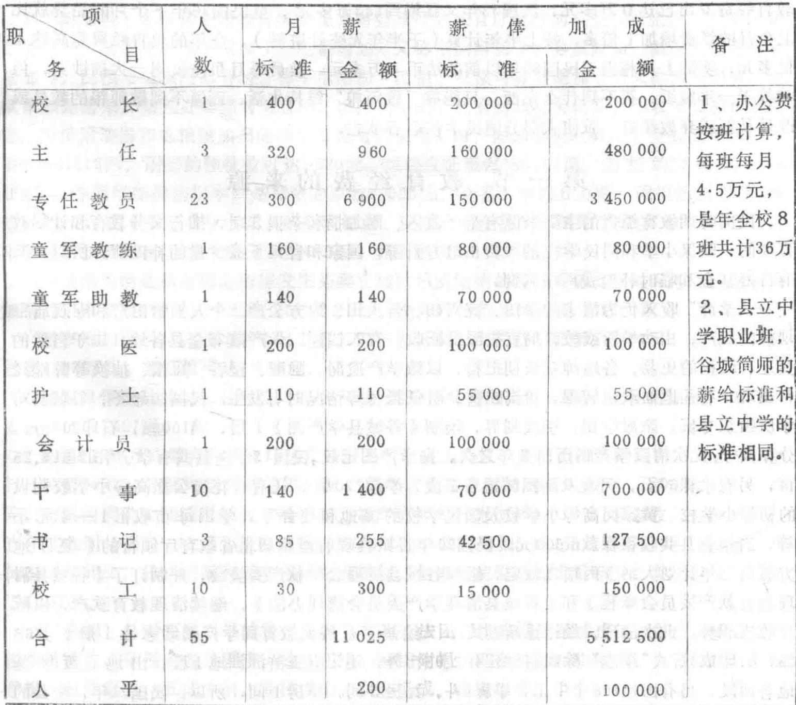
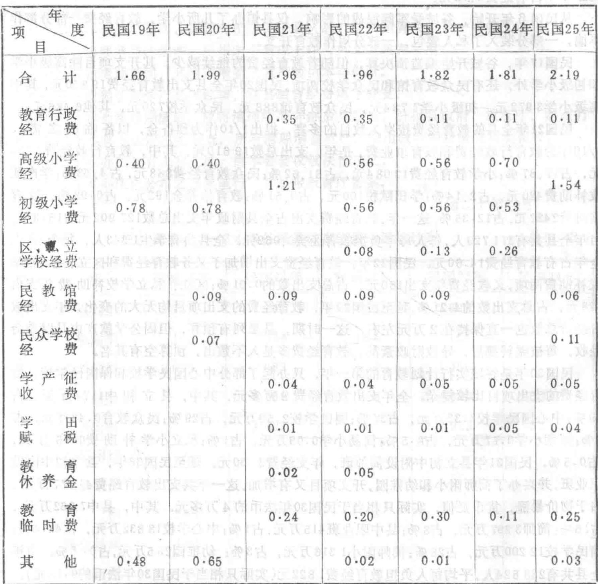
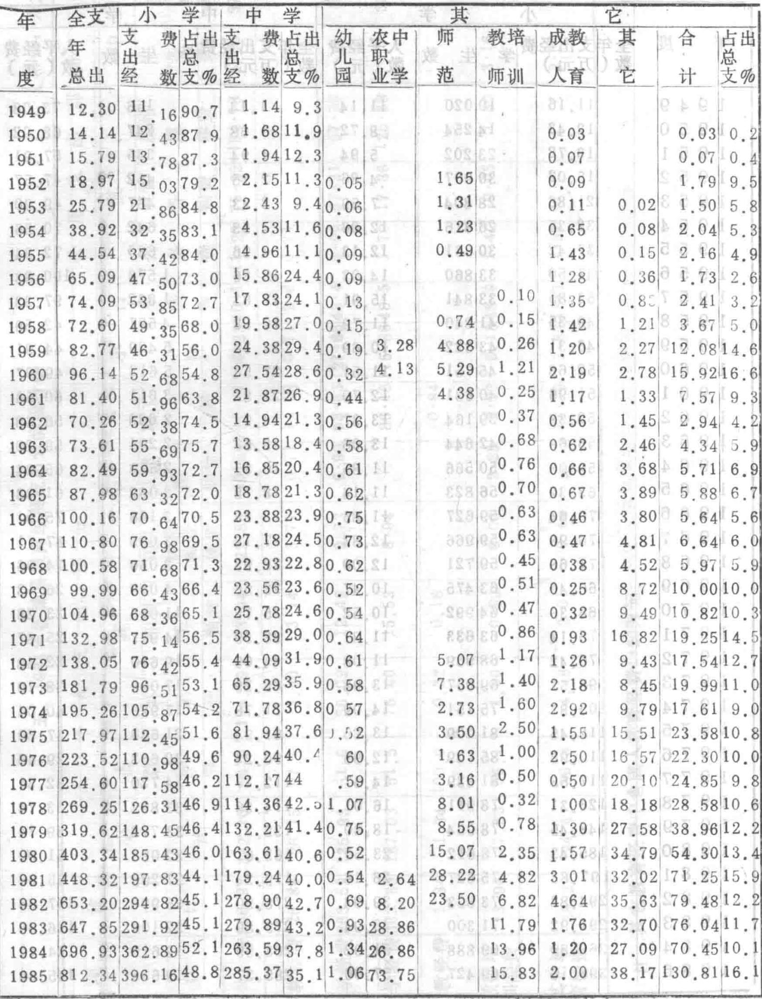
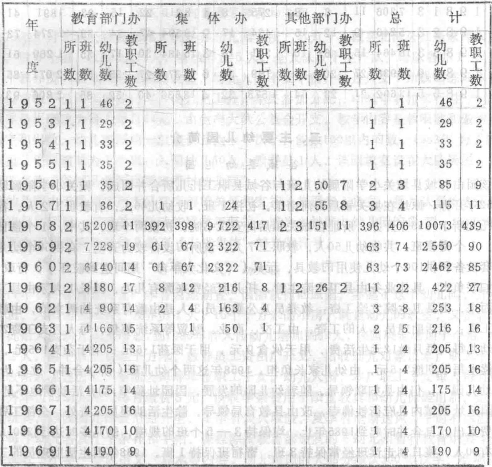

# 公城縣教育志

(1868—1985)

谷城县教育志编纂组编

地图绘制: 程家猷 梁伟年

谷城县教育印刷厂印刷

(内部发行)

1987年9月出版

后 挑 担 任 书 记 文 代 教 厅 厅 厅 厅 长 和 教 高 部 部 教 司 长 长 等 职

对年十 实

合城聚教育志

# 序 言

教育是人类特有的社会现象。人类的知识、技能、经验和道德规范的传递,社会劳动力的扩大再生产,都需要通过教育来进行。因此,振兴教育是关系到人类社会不断前进和国家民族兴旺发达的重要条件之一。

谷城教育源远流长,经历了漫长的发展道路。近百年以来,随着社会经济的发展,连续发生了两次伟大变革:从封建教育发展到民主主义教育,再发展到社会主义教育。这些变革,都产生过质的飞跃。

中华人民共和国诞生后,谷城教育以马克思列宁主义、毛泽东思想为指导,坚持贯彻教育为无产阶级的政治服务,与生产劳动相结合,培养德智体全面发展的新人的教育方针,以先进的社会科学和自然科学知识为教学内容,坚持理论联系实际的原则,使人民教育蓬勃发展,为社会主义革命和社会主义建设作出了巨大贡献。新中国教育在它的发展过程中,尽管也有过较大的挫折和失误,然而主流仍然是好的,总的方向也是正确的,是以前任何时期的教育不可比拟的。

中国共产党十一届三中全会以来,教育战线经过拨乱反正,实现了历史性的伟大转变,教育工作不断得到重视和加强。党的十二大又进一步把教育和科学列为经济发展的战略重点之一,提出教育必须为社会主义建设服务,社会主义建设必须依靠教育等新论断。改革和振兴教育是大势所趋、人心所向的大问题。

当今,世界科技迅猛发展,知识积累成倍上升,教育更加明显地成为整个社会范畴内的主要内容之一。它由封闭型的教育走向开放型

的教育,由人生的一次性教育走向终身教育,由知识较单一型的教育走向知识密集型的教育。要改革和振兴谷城教育,就必须从谷城的实际出发,研究教育的历史和现状,回顾总结谷城教育的实践,从中引出社会主义教育的基本规律,指导我们的教育工作,从而使我们的教育工作者增强自觉性,减少盲目性,把教育工作搞得更好。

我县教育志编纂组在县委和县政府的关怀下,在上级有关部门的指导下,依靠我县广大教育工作者的支持和协助,经过全组人员的共同努力,从清末到1985年的浩繁的教育史料中,整理编写出这本《谷城县教育志》,以求"存史"、"资治"和"教化",使教育更能适应社会主义建设的要求。这对改革和振兴谷城教育工作,将会有着十分重要的意义。现在我们把它献给全县教育战线的园丁们,献给全县50万人民,让我们以史为鉴,更加自觉地贯彻中共中央《关于教育体制改革的决定》,努力开创谷城教育的新局面。

卢荣轩

县农业技术高中荣获"先进集体"匾

  
县一中毕业生翟维民在全国体育比赛中获得荣誉

  
实验小学教师吴素琴获先进个人奖旗

  
城内小学教师李印阁荣获的奖章和证书

  
少先队员在庆祝教师节大会上祝词

  
县一中教师余正伦荣获省劳动模范奖章

  
县中教学楼

  
县农业技术高中教学楼

县幼儿园教学楼

  
皮家洼村小学教学楼

  
县师范学校大门

  
城内小学教学楼

  
1943年谷城县中学校址

  
县一中职工宿舍楼

  
沈垭天主堂修道院和经言学校校址

  
实验小学职工宿舍楼

学员正在收看卫星接收  站转播的电视教学。  保平正在辅导学生学习。  东风小学青年教师余

学教师一起探讨课堂结构改革。  县电视广播教学卫星地面接收站

  
石花镇彭家岭村小学桔园

  
手纺所师生分组讨论情况

学员留影(一九三九年)。

  
手纺所学员正在操作棉纺机

  
1942年儿童教养院教职员留影

  
1931年谷城县学产分布图

# 各城县中等学校分布图

一、本志上限与清同治六年(1868)编纂的《谷城县志》相衔接。为了探索谷城教育的历史渊源,"清末篇"上溯到北宋仁宗年间,"概述篇"从西周谷国的教育开始叙述。下限原则上断在1985年,个别章节延伸到1986年。

二、鉴于不同历史时期教育的性质、内容截然不同,而且,中华人民共和国成立后,谷城县所辖的范围变化也较大:原属谷城县的仙人渡、太平店、张家集、小樊洲和大冲等乡,分别划归襄阳县和光化县(现为老河口市)管辖;原属光化县的伍员乡和固封乡则划归谷城县管辖。因此,本志除概述、人物和大事记外,其余内容均采取断代史的笔法,划分"清末"、"中华民国"和"中华人民共和国"3个时期,每个时期均按当时谷城所辖的范围记述教育史实。

三、本志分编、章、节3个层次,有的节下也按"事以类从"的要求分项记述,必要时,在同类事物的第一段开头设小标题。收录的照片和学校分布图集中于卷首;统计图表及其他附录资料,均附在各章节行文之后,以期互为补充。

四、本志坚持"生不立传"的原则,将"教育人物"章分为"传略"和"简介"两节。凡是教育界的革命烈士,对发展教育有突出贡献的知名人士,无论是在外地工作的谷城人,还是在谷城工作的外地人,均予收录。凡在办学、治学、教学及其他方面有成就,而又健在的人物,或者已经去世但不符合立传标准者,则简要介绍其生平事迹。对发展教育有破坏作用的个别人物,也以"简介"的形式录其劣

迹。无论古人今人,一律直书其名,不加褒贬性称谓。

五、"大事记"采用编年体与记事本末体相结合的体裁。从新中国成立之时起采用公元年号;建国以前均按历史习惯纪年,夹注公元年号;同一个朝代的年号,只在开始使用时夹注,其余从略。

六、本志力求用语体文表述,引文和附录悉照原文。对于各种具体事项、事件的名称,第一次出现时用全称,重复使用时改用简称。

七、本志在涉及数字时,悉按照《人民日报》1986年12月31日公布的《关于出版物上数字用法的试行规定》,分别使用汉字和阿拉伯数字。其计量单位均按各时期当时所采用的计量单位记入志书。

八、本志遵循"言必据史"的原则,以档案资料为主要依据,兼收口碑资料。所采用的统计数字,以县教育行政部门的统计为基础,参考其他部门的统计进行考证。记人叙事所用的资料也都经过考证,使其尽量符合实际。还将原始资料汇编成册,保存备查。因而,文中除重要史实注有出处外,一般史料均未注明出处,以节省篇幅。

# 目录

# 第一编 概述

# 第二编 清末时期的教育

第一章 教育行政机构

附录一教育会

二谷城县历任教渝、训导资格统计表

第二章 教育宗旨的贯彻

第三章 学官、教习的任用与待遇

第四章 教育经费

附录一谷城县光绪三十三年教育经费岁入岁出统计表

二谷城县光绪三十三年学务资产统计表

三谷城县普通学堂学生人平教育经费比较表

四谷城县宣统元年教育经费分配比例表

五谷城县宾兴条规

第五章 学校教育

第一节 县学

第二节 书院

一文龙书院

二筑阳书院

附录一谷城县试院

二谷城县历代科举中试统计表

第三节 学堂

一学堂沿革及其发展

二主要学堂简介

谷城县官立高等小学堂

谷城县官立中码头初等小学堂

谷城县私立两等小学堂

谷城县官立半日学堂

谷城县初等农业学堂

附录谷城县清末各类学堂概况表

第四节 义学、私塾和简易识字学塾 16

附录 宣讲所 17

# 第三编 中华民国时期的教育

第一章 教育行政机构 19

第一节 县教育行政机构 19

第二节 区、乡、保教育行政机构 21

附录 一 教育会 21

二 谷城县教育行政管理系统图 22

三 民国时期谷城县教育行政长官一览表 23

四 民国时期谷城县督学一览表 24

五 民国26年谷城县教育委员、学董统计表 24

第二章 教育宗旨的实施 25

第三章 教育制度 27

第一节 学制 27

第二节 课程 28

一 小学教学科目 28

二 中等学校教学科目 29

第四章 教职员的任用与待遇 31

附录 一 湖北省谷城县简易师范学校教职员服务公约 33

二 民国2一16年谷城县教职员人数统计表 34

三 民国18一29年谷城县教职员人数统计表 35

四 民国30一36年谷城县教职员人数统计表 35

五 民国31年谷城县教育工作人员学历统计表 36

六 民国时期谷城县中小学教员人平月薪对照表 36

七 民国31年谷城县小学教职工月薪支给标准对照表 37

八 民国36年谷城县初级中学俸给统计表 37

第五章 教育经费 38

第一节 教育经费的来源 38

附录 一 谷城县清理教育款产委员会章程 40

二 谷城县清理学产委员会清理办法 41

三 民国13一24年谷城县教育经费来源统计表 42

第二节 教育经费的使用 43

附录 一民国19一25年谷城县岁出教育经费统计表 44

二民国30一36年谷城县岁出教育经费统计表 45

三民国36年谷城县教育经费岁出分类统计表 45

四民国时期谷城县人平负担教育经费统计表 46

第六章 初等教育 46

第一节 幼儿教育 46

第二节 小学教育 47

一沿革与发展 47

附录 一民国2一16年谷城县小学教育统计表 51

二民国18一29年谷城县小学教育统计表 52

三民国30一36年谷城县国民学校统计表 54

四民国21年谷城县公私立小学一览表 55

五民国24年谷城县公私立小学一览表 56

六民国26年秋谷城县短期小学概况表 57

七民国31年谷城县乡管中心国民学校一览表 57

八民国31年谷城县保国民学校分乡镇统计表 58

九民国34年谷城县乡镇中心国民学校一览表 60

十民国36年谷城县乡镇中心国民学校名称调整一览表 61

十一民国24年和31年谷城县私塾概况表 62

十二民国23年谷城县小学教职员学历统计表 62

十三民国23年谷城县小学教职员职别统计表 62

十四民国时期谷城驻军所办学校一览表 63

十五民国时期谷城县教会小学一览表 63

二 主要小学简介 64

湖北省立谷城县第一初级小学 64

湖北省第三育幼院 64

谷城县谷伯镇第一中心国民学校 66

谷城县立女子两等小学校 67

石花镇中心国民学校 67

谷城县私立宗山小学 68

谷城县私立广智小学 68

谷城县私立博爱小学 68

谷城县私立精诚小学 69

谷城县私立求实小学 70

谷城县私立崇真小学 70

谷城县私立中正小学 70

石花镇工商子弟小学 70

黄山垭蔚英小学 71

第七章 中等教育 71

第一节 中学教育 71

沿革与发展 71

附录 民国时期谷城县4所中学创办时基本情况一览表 71

二 主要中学简介 72

谷城县私立筑阳中学 72

谷城县立第一初级中学 72

第二节 师范教育 77

附录 一 民国时期谷城县简历年在校师生数统计表 79

二 民国时期谷城县简师毕业生就业状况表 80

三 民国时期谷城县简师教职员学历统计表 80

四 民国时期谷城县简师教职员职别统计表 80

第三节 职业教育 81

谷城县立乙种农业学校 81

谷城县初级农业职业学校 81

谷城县立初级中学附设职业科 81

附录 一 谷城县沈垭天主堂修道院 82

二 石花镇豫鄂路德会福音堂青年学校 83

第八章 社会教育 83

附录 一 民国时期谷城县专设民众学校统计表 85

二 民国时期谷城县附设民众学校统计表 85

第九章 民国时期共产党在谷城兴办的教育 86

第一节 综述 86

第二节 党办学校的沿革及发展 87

第三节 党办学校简介 89

茨河手纺织训练所 89

杉树梁子学校 92

谷城县城关第一完全小学 93

谷城县私立集义第一小学 93

盛壤知识分子训练班 94

附录一民国16年县党部第一次大会提出的《谷城县最低限度政纲》中

"关于教育者"部分摘抄 94

二胡培洲在莲山教书时自编的歌词 94

三邱家山中心支部自编教材中的歌词及诗歌 95

# 第四编 中华人民共和国时期的教育

第一章 教育行政机构 96

第一节 县教育委员会 96

第二节 区(镇)教育组 97

附录一1984年谷城县教育行政管理系统图 99

二谷城县教育局各股室职责(1984年拟订) 99

三谷城县区(镇)教育组职责 101

四解放后谷城县教育行政负责人一览表 102

五1984年谷城县各区(镇)教育组负责人一览表 103

六1984年谷城县教育局所属股室及县直单位负责人一览表 104

七谷城县教育局干部统计表 105

八1984年谷城县教育局实有人数统计表 105

九1984年谷城县各级学校领导干部统计表 106

十1982年谷城县各公社(镇)所属大队小学干部统计表 107

第二章 教育系统党群组织 108

第一节 党组织的建立和发展 108

附录一1978年谷城县教育系统党组织发展情况统计表 109

二中华人民共和国成立后谷城县教育系统党组织发展情况统计表 110

三谷城县教育局及直属二级单位党组织统计表 111

第二节 团组织的建立和发展 111

附录一1952年谷城县青年团员分类统计表 113

二谷城县教育系统共青团员统计表 114

三1961年谷城县中小学共青团员情况统计表 115

第三节 少先队组织的建立和发展 115

附录一1961年谷城县各区(镇)小学少先队组织情况统计表 117

二1952一1963年谷城县少先队组织情况统计表 118

三1961年谷城县各中学少先队组织情况统计表 118

第四节 教育工会的建立和发展 119

附录一谷城县教育工会组织统计表 121

二谷城县教育工会历届委员会一览表 121

三出席县总工会历届代表大会教育代表统计表 121

第三章 教育方针的实施 123

第四章 教育制度 127

第一节 学制 127

第二节 课程设置 128

第三节 招生制度及其他 130

第五章 教师 130

第一节 教师队伍的发展 130

附录 1949—1985年谷城县各级各类学校教职工人数统计表 133

二1956—1984年谷城县小学专任教师教龄统计表 134

三1957—1984年谷城县中学专任教师教龄统计表 134

第二节 教师培训 135

附录 1956—1985年谷城县小学专任教师学历统计表 141

二1957—1985年谷城县中学专任教师学历统计表 141

三1977—1984年谷城县分级举办教师培训证情况统计表 142

四1978—1985年谷城县函授学员统计表 143

五谷城县中小学教师过教材教法关考核情况统计表 143

第三节 知识分子政策的执行 144

附录 1979—1984年谷城县教育系统先进单位、模范教师、先进工作者统计表 146

第四节 教职工的工资福利待遇 146

第六章 思想政治教育 149

附录 1981—1985年受县、市表彰的学生及其干部统计表 152

第七章 教学工作 153

第一节 教学方法 153

第三节 教学管理 157

第三节 教研工作 158

附录 1980—1985年各级学设毕业生升学考试成绩统计表 162

二谷城县历年高中毕业生升学情况统计表 163

第八章 体育卫生 163

第一节 学校体育 163

附录 一谷城县几次中小学田径运动会记录(男子) 167

二谷城县几次中小学田径运动会记录(女子) 18

三 谷城县中小学学生参加省、市(地区)运动会成绩表 169

四 谷城县几次中小学体育运动会情况统计表 171

第二节 学校卫生 171

第九章 勤工俭学 174

第十章 教育经费 176

第一节 经费来源与使用 176

第二节 经费管理 179

附录 1949—1985年谷城县普通教育经费来源统计表 180

二 1949—1985年谷城县教育经费支出分项目统计表 181

三 1949—1985年谷城县教育经费支出分类别统计表 183

四 1949—1985年谷城县中小学学生人平经费统计表 184

五 1984年谷城县教育经费支出分类统计表 185

六 1984年谷城县教职工补助工资及福利费支出明细表 186

七《关于加强教育工作的决定》 187

第十一章 初等教育 191

第一节 幼儿教育 191

一 沿革与发展 191

附录 1952—1985年谷城县幼儿教育基本情况统计表 193

二 主要幼儿园简介 194

谷城县幼儿园 194

谷城县北河区聂家滩村幼儿园 195

谷城县砖瓦厂幼儿园 195

谷城县谷城镇老街幼儿园 196

谷城县商业局幼儿园 196

第二节 小学教育 196

沿革与发展 196

附录 1949—1985年谷城县小学校数、班数统计表 203

二 1949—1985年谷城县小学学生数、毕业生数、招生数统计表 204

三 1955—1985年谷城县适龄儿童入学率统计表 206

四 1949—1985年谷城县小学教职工统计表 207

五 1984年中央驻谷工厂职工子弟学校(小学)一览表 208

六 1984年谷城县各类小学一览表 208

二 主要小学简介 226

谷城县谷城镇城内小学 226

234

234

234

239

240

241

242

243

244

244

249

250

250

251

252

253

253

254

255

255

255

256

257

258

259

259

谷城县林业学校 260

石花镇真武观乡农业中学 260

茨河镇农业高中 260

谷城县职业高中 261

石花镇职业中学 262

谷城县庙滩区黄畈乡初级农业中学 262

附录 1952—1985年谷城县师范教育基本情况统计表 263

二 1958—1985年谷城县农职业中学统计表 264

三 1958—1968年谷城县农职业中学一览表 264

四 1984年谷城县中等学校基本情况一览表 265

第十三章 成人教育 268

第一节 农民教育 268

沿革与发展 268

二 黄塘乡农民业余学校简介 271

第二节 干部职工教育 271

沿革与发展 271

二 湖北省谷城卫生职工中等专业学校 274

附录 1949—1985年谷城县成人教育统计表 275

二 1970—1985年谷城县电视教育统计表 276

三 1984年谷城县扫盲情况统计表 277

四 1984年谷城县脱盲率统计表 278

五 1985年谷城县干部职工学校一览表 279

# 第五编 人事记略

第一章 教育人物 280

第一节 人物传略 280

安庆澜 280

钱希珍 281

王天合 281

刘元承 281

李充美 282

杨昭恕 282

张子公 284

欧士道 285

黄恒修 285

张祭星 286

第二节 人物简介 288

附录 一 谷城县万代进士表 296

二 谷城县留学生一览表 297

三 谷城县教育系统由席省、市人大、政协及党代会的代表一览表 297

四 谷城县历届党代会教育系统代表 298

五 谷城县历届人大教育系统代表名单 300

六 谷城县历届政协教育系统代表任职情况一览表 301

七 谷城县受市以上表彰的教职员工一览表 302

第二章 大事记 308

第一节 宋元明清 308

第二节 中华民国 309

第三节 中华人民共和国 317

# 第一编 概述

谷城县地处鄂西北山区东部边缘,汉水中游西岸。自公元前1世纪周封谷国至今,已历时三千余载。谷城的教育也随之经历了漫长的岁月,从西周至民国,在这块美好的土地上,钟灵毓秀,代有英才。但纵观教育历史,发展是缓慢的。直到中华人民共和国成立,在共产党的领导下,教育才真正获得蓬勃发展的生机。

西周时,谷国设有"泮宫"(国学)和"庠"(乡学),这是教养贵胄子弟的地方,以"礼、乐、射、御,书、数"六艺为学习内容,庶民子弟被排除在校门之外。春秋时,谷国为楚国吞并,沦为附庸。随着生产力和学术思想的发展,私学应运而生,是为谷城办私学之始。秦灭楚后,谷城立为筑阳县。秦既不设官学,又禁私学,但私学是禁不绝的。当时,谷城民间事实上存在着私学。汉代谷城既有官学,又有私学,县级官学称为"校"(儒学);乡级官学称为"庠",学习儒家经典,以奖进礼乐,推广教化。私学称为"学馆",以"蒙学"为主,学习"宇书"、《论语》、《孝经》等。此后,谷城的官学时兴时废。延至隋唐之际,废察举,兴科举,谷城立县学,为科举考试服务。其后,县学又废。直到宋仁宗时,谷城知县狄采兴学校,建学宫,县学得以恢复。直至清末,学宫时毁时修,迭有变更。科举时代谷城除县学外,尚有文龙和筑阳两个书院,以考课为主,兼顾学术传授。另有义学与私塾,使贫家子弟能知学明礼,以广教化。

鸦片战争后,清政府迫于形势,明令改革科举制度与废科举,兴学校。从此,谷城教育有了转机。光绪三十年(1904)谷城县开始兴办学堂,光绪三十二年就建立学堂13所。光绪三十三年谷城县设立劝学所,负责筹措办学经费,劝办学堂,使学堂进一步发展。宣统二年(1910)全县共有学堂22所,教学班24个,学生736人,教职工34人。新办的学堂贯彻"忠君、尊孔、尚公、尚武、尚实"的教育宗旨,在内容上增设格致,体操等课程,实行课堂教学,定期修业,宣告了科举制度的破产。但由于清王朝政治腐败,改革并不彻底,教学内容和教学方法都保持着浓厚的封建色彩。

中华民国时期,谷城县既有军阀、国民党推行的半殖民地、半封建教育,又有共产党兴办的人民教育。

民国元年(1912)临时国民政府明令废除"忠君"、"尊孔"的封建教育宗旨,代之以培养国民道德为主要内容的教育宗旨。但未及实施,就遭到袁世凯封建复古主义的破坏,谷城县执行的仍然是"忠君"、"尊孔"的教育宗旨。随后,北洋军阀混战,教育经费挪作军饷,不仅私立中学、实业学校和女子学校如同昙花一现,而且其他小学也迅速减少。到民国16年,全县仅有小学9所,学生249人,教职工16人。这一年,"北伐"胜利,蒋介石篡夺了革命果实,建立法西斯独裁政权,实施封建的、买办的、法西斯的教育,仅在学制和课程

设置上作了一些改变:小学的学制改为7年,继又改为6年,行至解放;教学内容方面,将读经改为修身,再改为公民,只不过是名称变换而已。为了推行"义务教育",谷城县清理祠庙产,筹款办学,开办了县立小学、区立小学、私立小学,还举办了农业职业教育、社会教育等。民国29年全县共有小学46所,学生1497人,教职工78人,与军阀混战时期相比,略有发展。民国30年谷城县开始推行国民教育,保办国民学校,乡办申心国民学校,县办初中和简师。据民国36年统计,全县共有小学241所,学生9889人,教职工530人;中学3所(含简师、职业班)学生1074人,教职工86人。老年全县共有人口239111人,面积2161平方公里,每万人口中平均有学生459人;每百平方公里平均有学校11所,学生507人。推行国民教育是在抗日战争期间,当时生产遭到破坏,民不聊生;抗战胜利后,国民党又发动内战,民穷财尽,因此,虽然办了一些国民学校,但绝大部分是只挂牌手不办学,更无质量可言,致使全县教育落后,文盲充斥。

与此形成鲜明对照的是共产党兴办的人民教育,在极其困难的条件下不断发展。民国16年春,在共产党领导下,国民党谷城县党部制定了《谷城县最低限度政纲》,其中关于教育方面明确提出了以提高劳苦大众文化水平为奋斗目标。但不久,大革命失败,这个纲领未能全部实施,仅在县城、石花、感埭等地组织了儿童团,开展革命宣传活动。大革命失败后,谷城的共产党组织迅即转入地下斗争。绝大部分共产党员当了塾师,一边教书,一边进行革命活动。民国20年5月,谷城县建立了苏维埃政府,在国民党疯狂围剿的险恶环境中,还办起了燕山小学和小笋苦峪小学,教师自编教材和歌曲,学生除了读书识字外,还承担站岗放哨等任务。民国27年,邱家山地区在地下党组织的领导下,兴办了农民识字班以及夜校、午校、雨校和牧校等。民国28年,中共杉树梁子乔支除多次举办党员训练班以外,还办起了1所比较正规的学校。同年5月,中共鄂西北区党委在茨河镇办起了手纺织训练所,培养抗日军政骨干,当时被誉为鄂西北的"抗大"。因国民党特务破坏,于民国31年停办。次年邱家山地区的党组织遭到严重破坏,教育活动随即停止。民国37年7月,谷城县解放,县爱国民主政府立即着手恢复学校。至次年9月底,共恢复中小学95所,165班,学生9876人,教职工243人。这为新中国成立后谷城教育事业的发展奠定了基础。

1949年10月1日中华人民共和国宣告成立,在共产党领导下,谷城县的教育事业蓬勃发展。虽然也经过了一些曲折,但无论是数量还是质量,都取得了前所未有的成就。建国初,谷城认真贯彻向工农开门的方针,继续对旧的教育制度、教育内容和教育方法以及私塾进行改造;结合国内外形势和重大事件对师生进行革命人生观教育;大力发展中小学教育和工农教育。到1952年,全县的中小学发展到384所,是民国36年(民国时期中小学数量最多的一年)所数的1.6倍;731班(含初师3班),是民国38年班数的2.0倍;学生31513人(含师范生154人),是民国36年学生数的3.0倍;教职工1027人(含初师教职工11人),是民国36年教职工数的1.7倍。1952年全县进入农民业余学校学习的农民达两万多人,当年毕业1900人。随后,谷城对小学进行了整顿,精简教职工200多人。中学教师参加了湖北省组织的思想改造运动。这不仅克服了学校的混乱和忙乱现象,建立了以教学为中心的各种制度,而且,加强了党对教育工作的领导。中小学开始学习苏联教育经验,实施智育、德育、体育、

美育和综合技术教育,突出抓了劳动教育。同时,中小学教师积极探讨改进教学的新途径,教学研究开始形成风气。正因为如此,从1953——1957年,谷城的中小学教育得以健康发展,教育质量有了明显提高。

1958年,谷城开始贯彻"教育为无产阶级的政治服务,教育与生产劳动相结合"的教育工作方针,和"两条腿走路的"办学方针,国家办学和群众办学都有较大发展,民办中小学、农专、技工学校、林业中学、卫生学校、师范学校和盲聋哑学校相继兴办。这一时期对教育脱离生产、脱离政治、脱离实际的倾向有所冲击,但由于对教育方针贯彻的不全面,师生参加大办纲铁、大办农业,劳动过多,影响了课堂教学,完不成教学计划,遂提出"大战四十天,质量翻一番"的口号,上所谓"跃进课"和"单元课",违背了教育规律,打乱了学校的正常秩序。加之反右派斗争扩大化和开展反右倾运动,挫伤了部分教师的积极性,教学质量一度下降。

1961年谷城县开始贯彻执行"调整、巩固、充实、提高"的方针(简称"八字方针"),到1982年总共精简教职工279人,处理小学超龄生1971人,中学超龄生1811人。随后,刘少奇倡导"两种教育制度,两种劳动制度",谷城县开始兴办耕读学校,到1966年上半全,全县共办耕读小学500所,耕读中学39所,促进了山区教育事业的发展。同时,各学校认真贯彻中小学《工作条例》,批判凯洛夫《教育学》,学习毛泽东提出的"十大教授法",坚持以教学为中心,加强基础知识教学和基本技能训练,教学秩序恢复正常,教学质量逐步回升。

"文化大革命"十年内乱,给教育事业带来了严重灾难。学校贯彻党的教育方针,按照教学计划进行教学,被说成是推行修正主义教育路线,广大教师被列为专政对象,身心受到严重摧残。"四人帮"(王洪文、张春桥、江青、姚文元反革命集团)鼓吹反潮流精神,毒害了年轻一代的心灵。"文化大革命"初期,学校停课闹革命,不久,原有的中学全部停办,唯一的1所完全中学亦被解散。部分学校的校舍被占用。此后,又盲目发展中学教育,形成了"中学肿,小学空"的严重局面,成人教育陷于停顿。谷城县的教育事业遭受到了不可估量的损失。

粉碎"四人帮"后,谷城县的教育进入了一个新的历史时期。在揭批"四人帮"破坏教育事业罪行、清理滑派体系的同时,进行了一系列的拨乱反正工作。随后,学习中共十一届三中全会精神,贯彻"调整、改革、整顿、提高"的方针,开创了谷城教育的新局面。

一、调整教育内部结构,恢复"小宝塔"体系。1979年,谷城本着"高中适当压缩,初中控制发展,小学大力普及"精神,对中小学布局进行了初步调整。1981年又以"充实加强小学,整顿提高初中,调整改革高中,大力发展职业教育,努力办好重点中小学"为原则,继续调整中小学布局,并加速了改革中等教育结构的步伐。到1984年,全县的小学达617所,2048班,学生69888人。小学适龄儿童入学率上升到97.7%;普通初中由1976年的61所,373班,学生23706人,下降到41所,343班,学生17061人;普通高中由1977年的43所,179班,学生9473人,下降到8所,43班,学生2549人;农职业技术中学发展到28所,141班,学生5545人;师范1所,3班,141名学生。全县共有学校895所,2578班,学生95184人。每万人口中平均有学生1880人;每百平方公里平均有学校27所,学生3728人。至此,全县各

级各类学校结构基本合理,基础比较稳固。

二、落实知识分子政策,调动教师积极性。粉碎"四人帮"后,推翻了"两个估计"(即:"四人帮"炮制的"文化大革命"前十七年教育战线是资产阶级专了无产阶级的政,是"黑线专政";知识分子的大多数世界观基本上是资产阶级的,是资产阶级知识分子);平反了冤假错案;在全县中小学教师中发展党员211人;解决中小学教师家属及子女"农转非"户口94户,264人;落实兑现了民办教师报酬;改善了教师的工作和生活条件,仅1984年就新建教职工住房32578平方米,使教职工的住房由1983年的人平4.4平方米增加到6.5平方米。一个尊师重教的社会风尚正在形成。

三、抓紧师资培训,提高教师政治文化素质。在调动教师积极性的同时,注意提高全县中小学教师的文化业务素质。谷城县把师资培训工作当作提高教育质量的战略措施来抓。一是加强领导。1977年充实了县函授站人员,1979年各公社(镇)教育组新配1名副组长主管师训工作,并调配语文、数学进修教师各1名。1980年县教育局确定1名副局长主管师训工作,同时在教育局内设师训股,作为师训工作的办事机构。县函授站建立党支部,以加强领导。二是建立师训中心。1982年新开办了县教师进修学校,本着"着眼当前,解决急需;立足长远,系统提高"的原则,分期分批地提高在职教师。三是学习形式灵活多样,从1977年起,谷城坚持"教什么,学什么,缺什么,补什么"和"自学为主,业余为主"的原则,采取业余自学,假期培训和离职进修3种办法,帮助教师掌握所任学科的教材。在过教材教法关的基础上,进行系统提高。经过考试符合条件的参加中师或高师函授;未被函授学校录取的教师,参加业余面授,提高文化水平;还有一部分教师分别进入省、市、县教师进修学校(院)学习,或者参加广播电视大学学习。使每个教师都逐步达到相应的学历要求。1984年,参加小学教师进修班学习的有34人,参加中师进修班学习的有76人,参加中师函授班学习的有318人,参加各公社(镇)业余面授班学习的有493人,参加高师函授学习的有81人,参加电大学习的有106人。本年寒假,全县中小学教师经过省组织的"过教材教法关"文化考试,初小教师参加考试的有919人,及格的有518人,占56.4%;高小教师参加考试的有1347人。及格的有1227人,占91.1%;初中教师参加考试的有684人,及格的有499人,占73%;高中教师参加考试的有68人,及格的有57人,占83.8%。这说明全县中小学教师的文化素质和业务能力都有了显著提高。合格教师逐步增多,为开创谷城教育的新局面创造了条件。

四、加快教改步伐,提高教学质量。一是恢复和健全教学工作的规章制度,使备课、教学、批改作业和辅导学生等工作走上了正轨。二是改变传统的教学思想和方法,既发挥教师在教学中的主导作用,又加强学生在学习中的主体地位,提出并实践了"加强基础,培养能力,发展智力"的教学思想,初步克服了教学中的注入式倾向。三是学校领导深入教学第一线,坚持抓好一项事,蹲好一个点,教好一门课,基本成为领导教学工作的内行。四是健全业务指挥系统。县设教研室,各公社(镇)教育组配小学语文、数学教研员,学校成立教研组。五是坚持贯彻"抓纲(掌握教学大纲的要求)、务本(紧扣教本内容)、重法(重视改进教法和指导学法)、求实(讲求教学效果)"的教学改革要求,一年一个重点地发动中小学教师开展"人人教一堂好课"活动,推动教研活动不断深入发展,有效地提高了教学质

量,1984年高考后,谷城上大专录取分数线的人数突破百人关,创历史最好水平。

五、加强思想政治工作,培养"四有"人才。为了全面贯彻执行党的教育方针,改进和加强学校的思想政治工作,强调各学校结合学生思想实际,搞好小学生的共产主义品德课和中学的马列主义、毛泽东思想理论课的教学,恢复了"向雷锋同志学习"的活动,广泛开展了"五讲四美三热爱"(讲文明、讲礼貌、讲道德、讲卫生、讲秩序;心灵美、语言美、行为美、环境美;热爱祖国、热爱社会主义、热爱共产党)和遵法守纪的活动;对广大青少年进行坚持社会主义道路、坚持人民民主专政即无产阶级专政,坚持共产党的领导,坚持马列主义、毛泽东思想的四项基本原则和"四有"(有理想、有道德、有文化、有纪律)教育,使青少年身心得到健康成长。

六、积极开展成人教育,适应经济体制改革的需要。从1982年春季开始,谷城县抽调人员组成扫盲工作队,深入到各公社(镇)分期分批开展农村扫盲工作。1984年11月进行自验,在全县12至40周岁的236658人中,除去失掉学习能力的4850人外,实有扫盲对象231808人,已脱盲213042人,脱盲率达91.9%。经襄樊市政府扫盲验收团抽签复查验收,并将验收结果转报省政府批准,确认谷城县为基本无盲县。

干部职工教育也有新的起色,1977年,谷城县卫生职工中等专业学校恢复。1982年元月,开始举办电视教育,当年录取电视大学学员150人。1983年,对1968——1980年初中、高中毕业的学生进行文化补课,参加脱产学习的有3个班,学员105人,参加业余学习的有12个班,学员148人。当年参加全县职工文化考试的有5068人,其中语文及格的1485人,数学及格的1252人,语文、数学双科及格的950人。到1984年,全县共办职工学校8所;1个党政干部中专班和1个高中班;电视大学学员发展到323人,分为9个专业,成为发展成人教育的一个重要途径。

七、试行分级办学分级管理体制,努力改善办学条件。从1984年秋季开始,县里负责办好"五校一园"即普通高中两所,职业高中、教师进修学校、实验小学和幼儿园各1所;各区(镇)负责办好2至3所学校,即区(镇)重点初中、重点小学和农职业高中;各乡(镇)负责办好乡(镇)初中和中心小学;各村负责办好村小和联村办的高小点。为了改善办学条件,谷城自1980年开始动员各单位集资建校。到1984年累计集资金额715.87万元,就地维修校舍74970平方米,新建扩建校舍59978平方米,共有校舍11893间,294511平方米。校园总面积1900.5亩,其中操场面积617.8亩。另有勤工俭学基地2492.3亩,学校面貌为之一新。

中华人民共和国成立以来,随着各级各类教育的发展,全县人民的文化素质普遍提高。据1982年人口普查统计,全县有大专文化程度的1362人,高中文化程度的29395人,初中文化程度的104359人,小学文化程度的183429人。这是发展谷城教育、振兴谷城经济的重要因素。

目前,谷城县的教育,正以"面向现代化、面向世界、面向未来"为指针,在即将开始的教育体制改革中开拓前进。

# 第二编 清末时期的教育

(1868—1911)

# 第一章 教育行政机构

清末废科举以前,谷城县在学宫里设有教谕署和训导署。虽称两署为老师衙门,但实际上就是学校。教谕署设学宫之后,训导署设学宫西侧,故称教谕署为东斋,训导署为西斋。教谕署设学官1员,称教谕,负责文庙祭祀和教育所属生员;训导署亦设学官1员,称训导,协助同级学官教育所属生员。行新学之前,谷城有文字记载的学官,上自明朝天启年间的教谕曹大壮与训导盛于唐,下至清末的教谕柳继贻与训导陈皋言,共有学官86人。其中教谕45人,训导41人。另外,两署还设有门斗3人,为衙署的工役,供学官役使。斋夫6人,掌管文庙的香火。至光绪末年建立劝学所时,两署皆废。

光绪三十二年(1906)四月,清帝下令于府、厅、州、县设立劝学所。次年,谷城知县吴淞奉文设立"谷城县劝学所"于城内南街县立高等小学堂内。至此,谷城始有专设的教育行政机构。劝学所的主要职责是筹措办学经费,劝导家长送儿童入学,调查新学推行情况,宣讲教育宗旨,动员地方人士建立学堂,推广教育。劝学所设学务总董1人,推选本籍湖北文普通中学堂毕业生,奏奖优贡生刘元承,由省提学使委派充任,宣统元年(1909)七月举派本县岁贡张书绅继任。劝学所以下按东、南、西、北四乡,划分四个学区。每区设劝学员1人,由总董选,会同当地绅士劝办初等学堂。辛亥首义成功,清政府逊位,劝学所暂停。

附录: 一、教育 会

光绪三十四年五月,谷城县教育会在城内南街设立。会长奕宇,副会长郑之侨,有会员150人。规定每年召开例会1次,每年开支经费50元(银币,下同),由会员所交会费支用。会长、副会长由会员公选品学兼修、声誉素著者充任,任期3年,连选连任。会员须品行端正有志教育者,呈具入会志愿书,经人介绍方可入会。另外还有名誉会员,以财力赞助者参加。

清末兴学之初,规定教育会为教育行政辅助机构,协助教育行政组织图谋教育发展,其会务只限于教育范围,不准涉及政治。谷城县教育会会长、副会长为高龄宿儒,会内又未设专职人员,规定的应办之事,未尽办理,因而,教育会形同虚设。

# 二、谷城县历任教谕、训导资格统计表

<table><tr><td>职  务</td><td>进士</td><td>举人</td><td>副榜</td><td>拨贡</td><td>岁贡</td><td>恩贡</td><td>其他</td><td>合计</td><td>备 注</td></tr><tr><td>教  谕</td><td></td><td>7</td><td>4</td><td>5</td><td>8</td><td>1</td><td>20</td><td>45</td><td rowspan="2">此表所录人数起自明朝天启年间，止于清朝末年。</td></tr><tr><td>训  导</td><td>1</td><td>9</td><td>1</td><td>1</td><td>9</td><td></td><td>20</td><td>41</td></tr></table>

# 第二章 教育宗旨的贯彻

清末废科举前的儒学,虽没有确定全国统一的教育宗旨,但有其具体的办学目的。清顺治九年颁行的《卧碑文》上说:"朝廷建立学校,选取生员,免其丁粮,厚以廪膳,设学院学道学官以教之,各衙门官以礼相待,全要养成贤才,以供朝廷之用。"要求诸生"当立志学为忠臣清官",以"上报国恩,下立人品"。就是要培养为清王朝效命的所谓贤才。清末行新学,开始确立了统一的教育宗旨,此项宗旨见于光绪二十九年(1903)颁布的《奏定学堂章程》中。这个章程规定:"至于立学宗旨,勿论何种学堂,均以忠孝为本,以中国经史之学为基,俾学生心术壹归于纯正,而后以西学瀹其知识,练其艺能,务期他日成材,各适实用,以仰副国家造就通才,慎防流弊之意。"光绪三十三年由学部规定了更加明确的教育宗旨,即"忠君、尊孔、尚公、尚武、尚实"等五条,不仅反映了半封建社会教育的实质。同时也反映了半殖民地教育的特征,就是要达到造就对帝国主义封建主义有"实用"的"通才"为目的。

科举时代谷城的儒学,十分重视对生员的思想控制,不仅立卧碑于学宫,而且将康熙二十三年(1684)颁行的《上谕》,康熙二十四年(1685)颁行的《上谕十六条》,以及康熙四十一年(1702)颁行的《训伤士子文》刊刻于学宫,还于道光十九年(1839)把翰林院根据《圣谕广训》内"凯异端以崇正学"一条所编成的四言尚文印发乡塾,以便乡间学童诵习。并以此作为限制生员言论行动的"戒律"。每月初一、十五日召集生员诵读"圣谕",生员3次不到者受训斥,1年之内不到者革除。每次科试、岁试都要默写"圣谕"1条,每于节令宣读"圣谕"1至2条。同时,严令遵守,违者治罪,以此来钳制生员的思想。

清末兴学堂,谷城在对学生的管理上亦按照学堂章程规定之仪节和堂规的要求,在礼堂设立孔子牌位,悬挂《圣谕广训》全文。开学、散学及每月初一,师生齐到至圣先师牌位前行礼。每逢皇太后、皇上万寿圣节。皇后千秋节、至圣先师诞日、仲春仲秋上丁释奠日(春秋两季对孔子的祭祀),师生齐到礼堂行礼,并停课1天。教习、学生一律遵奉《圣谕广训》并照学政岁科试下学讲书,宣读御制《训伤士子文》例,每月初一,传集学生在礼堂宣读《圣谕广训》1条。学生出入大门,须稽查登记。学生家里来人或宾客访问,于外厅会谈,不得入内,亦不得过久。对学生注意旧礼教的陶冶,处处讲究传统的封建礼仪。

生员入学后,除按月授课和按季考试外,还有两年1次的科试和1年1次的岁试,用以检查督促生员的学习,书院毕业门生,月有两课,用膏火激励讲习。从光绪三十年筑阳书院改为官立高等小学堂时起,谷城开始实行班级教学。在教学方法上,虽提倡讲解,但教者多是老学究,习惯于读读念念,讲解甚少,学生难于领悟,名目新法,实则旧制。在教学内容上,虽增加了格致、体操和实业课目,但仍注重经学的传授。初等小学堂每星期上课的时间为30个小时,读经讲经就占12个小时,为每星期上课总时数的2/5;高等小学堂每周上课的时间为33个小时,读经讲经也占12个小时,为每周上课总时数的1/3。保持了浓厚的封教育色彩。

# 第三章 学官、教习的任用与待遇

第三章 学官、教习的任用与待遇清时谷城的教谕和训导,既是学官又是教员。兴办学堂之后,方设专任教习,后称教员,并有正副之分。教谕、训导2员为外县籍人,多出身于举人、贡生,由吏部泾派,岁支公项俸银31.52两,加俸银48.48两。门斗3名,由县派充,岁支工食银21.6两,遇闰加银0.3285两。斋夫6名,亦由县派充,岁支工食银36两,遇闰加银0.549两。谷城兴办学堂之初,正副教员的任用由劝学所报请知县委派,并尽量选用师范学堂毕业生。宣统二年,全县共有27名教员(高等小学堂教员8人,初等小学堂教员19人),其中师范毕业的15人(高等小学堂教员3人,初等小学堂教员12人),占56%弱;他科毕业的8人(高等小学堂教员1人,初等小学堂教员7人),占30%弱;未入新学堂以及上过学堂而没有毕业的4人,占14%强。学堂教员一经充选,即列作职官,任期3年或2年,除不得力者随时辞退外,优者任满再留,中平者如期更换,任期未满者不得自行告退,另就他职。其经济待遇,职员(指学堂堂长、董事等)与教员有别,光绪三十三年,全县共有职员3人,全年共支薪津1002元(银币,下同)。每人每月的平均薪津为27.8元。同年,全县共有教员15人,全年共支薪修3430元,每人每月的平均薪为19元,与职员相比少8.8元。

# 第四章 教育经费

废科举前,谷城县的教育经费来源有二:一是从本县的田赋项下投给;二是由地方士绅捐助,由于县学、书院、试院、义学兴办的时期不同,其经费的名称来源及使用亦各有别。

县学的经费,除岁支田赋银198.933两,遇闰共加银1.8065两外,另捐置学田6处,共124亩,岁收租银10.848两,租谷7.91石。每年拨给的田赋款主要用于学官的俸银,斋夫与门斗的工食银,廪生的膳银(廪生共20名,每名岁支膳银3.0666两,共支银61.332两,遇闰共加银0.929两)。学田的租银与租谷则作为祭祀、奖励优秀生员及补助贫困生员的费用。

筑阳书院原有膏火田6处,共有洲地和山地293亩,水田75亩,每年收租银36.84两,收租谷55石。光绪九年(1883),知县陈夔麟劝捐千金,存入典铺生息,使书院的膏火费有所增加。上述的租谷息钱,主要用于支付山长和主讲的束洛,也可用来补助贫困生员和奖赏优秀生员。

谷城捐设宾兴费始于道光丙午年(1846),县令安庆澜鉴于本县距省会千里,每遇乡试之年,贫困的读书人不能应试,于当年六月宴请在筑阳有声望的人劝捐宾兴费3643串(1000文为1串,也称1吊或1贯),除已使用的各项外,实存"玖玖陆"典钱3000串整,岁得息钱288串,3年共得息钱865串,全部作为生员应乡试的旅费,他项不许动用。安庆澜还亲定宾兴条规,由谷城著名书法家何兆祥缮写,刊刻碑石,立于试院大堂之侧,以便互相监督,减少弊端。

谷城义学的经费系各乡富裕人家捐设。据《湖北通志》(民国十年刊)和《谷城县志》记载,共捐钱5515千文,田地424亩,此两项专作延师、兴建及维修校舍之用,另捐房屋59间,为义学之校舍。所捐地亩银钱,概由首士经理。

谷城试院的经费,系光绪十九年(1893)举人张恒泰等创议捐助,光绪二十一年,知县张冕邀集县城的士绅刘德润、徐树森、陈瀛图等设局分募,共得钱36000贯,以24000贯买田375亩,以12000贯存入典铺生息,凡院试厦贡费,新生的学师束修费,文武举人会试,五贡朝考的公车费等均用此款。

谷城兴办学堂的经费,一是来自学田、膏火田、宾兴费和试院费的租谷息金;二是官款拨给、公款提充和派捐以及学生缴纳。光绪三十三年,谷城劝学所成立伊始,即将原学产学款逐项清理,按实登记,由劝学所负责管理,主要用于教职员工的薪津工食,学生的服食用品,教学用的图书仪器,学堂房屋的营建修缮,以及学田学款的租息粮税等项。

清末政治腐败,经济崩溃,谷城的教育经费逐年减少。宣统元年,教育经费岁入为9013元,与光绪三十三年的岁入12278元相比,减少3265元,降低了26·6%;宣统元年岁出为9063元,当年已入不敷出,与光绪三十三年的岁出10030元相比、减少967元,降低了10%。普遍学堂历年岁出按学生数平均计算(即岁出数除以学生数)亦随之下降,宣统元年,普遍学堂的岁出经费每个学生平均为12.779元,与光绪三十三年的24.765元相比,平均每人下降了11·986元,由此可以窥见清末谷城教育经费之窘迫情形。

附录一:谷城县光绪三十三年教育经费岁入岁出统计表

单位:银元

<table><tr><td colspan="2">岁 入 部 分</td><td colspan="2">岁 出 部 分</td></tr><tr><td>项 目</td><td>金 额</td><td>项 目</td><td>金 额</td></tr><tr><td>产业收入</td><td>1 390</td><td>职员薪津</td><td>1 002</td></tr><tr><td>存款收入</td><td>1 742</td><td>教员薪修</td><td>3 430</td></tr><tr><td>官款拨给</td><td>7 148</td><td>夫役工食</td><td>180</td></tr><tr><td>公款提充</td><td>380</td><td>租息粮税</td><td>84</td></tr><tr><td>学生缴纳</td><td>860</td><td>服食用品</td><td>839</td></tr><tr><td>派 捐</td><td>272</td><td>图书标本器具</td><td>300</td></tr><tr><td>杂 入</td><td>486</td><td>营建修缮</td><td>634</td></tr><tr><td></td><td></td><td>杂 用</td><td>3 561</td></tr><tr><td>合 计</td><td>12 278</td><td></td><td>10 030</td></tr></table>

# 谷城县光绪三十三年学务资产统计表

单位:银元

<table><tr><td>项目</td><td>房宇及地基</td><td>场所及设置</td><td>图书标本器具</td><td>田亩山林</td><td>储存款本</td><td>合计</td></tr><tr><td>金额</td><td>1 200</td><td>7 380</td><td>2 950</td><td>18 990</td><td>17 700</td><td>48 220</td></tr></table>

# 谷城县普通学学生人平教育经费比较表

单位:银元

<table><tr><td>年
堂
名
称</td><td>光
绪
三
十
三
费</td><td>光
绪
三
十
四
费</td><td>宣
学
统
元
年
费</td><td>光
绪
三
十
四
三
较</td><td>宣
光
统
元
年
三
十
四
较</td><td>宣
光
统
元
年
三
十
较</td></tr><tr><td>高等小学堂</td><td>109·873</td><td>49·880</td><td>48·094</td><td>-59·993</td><td>-1·786</td><td>-61·779</td></tr><tr><td>两等小学堂</td><td>28·777</td><td>35·714</td><td>25·800</td><td>+6·937</td><td>-9·914</td><td>-2·977</td></tr><tr><td>初等小学堂</td><td>6·771</td><td>4·708</td><td>4·686</td><td>-2·063</td><td>-0·022</td><td>-2·085</td></tr><tr><td>半日学堂</td><td></td><td></td><td>2·040</td><td></td><td></td><td></td></tr><tr><td>总 平 均</td><td>24·765</td><td></td><td>12·779</td><td></td><td></td><td>-11·936</td></tr></table>

# 四、谷城县宣统元年教育经费分配比例表

单位:银元

<table><tr><td rowspan="2">项目单位</td><td rowspan="2">经费来源</td><td colspan="2">岁入数</td><td colspan="2">岁出数</td></tr><tr><td>金额</td><td>比例%</td><td>金额</td><td>比例%</td></tr><tr><td>高等小学堂</td><td>赔款及学堂捐</td><td>5 098</td><td>40,93</td><td>5 098</td><td>37,30</td></tr><tr><td>两等小学堂</td><td>杨姓祠产及学费</td><td>854</td><td>6,86</td><td>903</td><td>6,61</td></tr><tr><td>初等小学堂</td><td>赔款捐及宾兴存息</td><td>2 205</td><td>17,70</td><td>2306</td><td>16,87</td></tr><tr><td>初等农业学堂</td><td>由劝学所拨给</td><td>1 500</td><td>12,04</td><td>1 500</td><td>10,97</td></tr><tr><td>半日学堂</td><td>由劝学所拨给</td><td>102</td><td>0,82</td><td>102</td><td>0,75</td></tr><tr><td>劝学所</td><td>田房租息收入</td><td>2 609</td><td>20,95</td><td>3 671</td><td>26,86</td></tr><tr><td>宣讲所</td><td></td><td>87</td><td>0,70</td><td>87</td><td>0,64</td></tr><tr><td>合计</td><td></td><td>12 455</td><td></td><td>13 667</td><td></td></tr></table>

一、捐项共钱三千六百四十三串,除动用各项,实存"玖玖陆"典钱三千串整。

一、前项发交玖典,按月利厘厘生息,每年应得息钱二百八十八串,遇闰加增。

一、节年存典息钱并不另行起息。

一、会试公车之费,另俟筹捐,不得动用此项,致形支绌。

一、交典系"玖玖陆"典钱,付息亦系"玖玖陆"典钱,不得稍有短少,以及搀杂毛钱,致干禀究。

一、每届乡试,无论正科、恩科,俱以七月初一日截止,计得息钱若干,全数取用。不得因选举恩科生息较少,通挪冒发,亦不得因只有正科生息较多,另提存储,以免项款纷歧,层违核算,致滋弊窦。

一、每届乡试,定于七月初一日,首士共同呈请县官、学官会印执照,向值年典总支取息钱。

一、其执照注明首士姓名,以备查考。

一、此项惟乡试之年,首士凭照按时取用息钱,其余概不得借故挪用,倘该典徇情滥借,责其加倍赔偿,以示惩罚,而杜弊端。

一、首士支取息钱,不得就近换银,至省复行换钱给发;以免价值低昂不一,含混滋疑。

一、值年首士承领息钱,倘有筹算不清,以及收藏不慎,致有短亏遗失,罚令首士分赔,以为疏忽者戒。

一、钱数较多,转运不易,每十串除扣付首士,佚力船价钱一百六十文,永不增减外,另给首士钱各六串,以酬辛劳。

一、每届乡试,以岁考县学一等第一名,科考县学一等第一名,府学科考一等前一名,同为值年首士,恩科从同。如接连举行,尚未岁考科考,仍归上届首士办理,倘有故不获观场,挨次递推,其余不得搀越。

一、此项息钱存贮首士省寓,按期如数给发,不得随意借用,亦不得扣抵各项账务,以免烦扰。

一、每届乡试,定于八月初五日,门斗查明正案若干名,录遗若干名,造具清册,交首士公同核计息钱若干,除开销各项,实存若干,按名均分。

二、录遗未取者各给程费六串,恩科减半,其全项如已分讫无余,即复获补取,不得另议加增。

一、此费既经领用,并无事故,临时不进科场者,首士查出呈请追缴,由县交典,下届并支汇发,勿庸另行起息。

一、赴省专补岁考或考贡,并不录科乡试者,概不得领用此费,以示区别。

一、本县学师赴省乡试或送考,各奉赆仪八串,其别项因公赴省,不与此例。

一、此项息钱所以济益寒畯,其应武举者率皆殷实之家,概不得与。

一、每届支数若干,开销若干,给发若干,首士开具清单,限九月内呈交存案,不得逾延。

一、典铺或有歇业,将原领钱项,刻日交值年典总分存,各典生息,不得旷悬。

知谷城县事山左安庆澜 定

邑庠生何兆祥 书

大清道光二十七年岁次丁未孟夏月谷旦 立

# 第五章 学校教育

科举时代,谷城既有县学和书院,又有义学和私塾。光绪末年裁学官,废科举,行新学,谷城始有普通学堂和实业学堂及简易识字学塾。

# 第一节 县 学

谷城的县学,设于学宫之内,随学宫的兴建、迁址而演变。早在宋朝就有比较详细的文字记载。宋欧阳修在他所撰写的《谷城县夫子庙记》中说,宋仁宗时知县狄栗建学宫于县治东南佑圣观右,宋末毁于兵。元至元二十六年(1289)主簿于谅复修,至正二年(1342)知县徒单郎继父徒单政志政修。明因之,并增设射亭。万历时迁于旧址西北的半里处,通判徐凤来负责修建,崇祯十四年(1641)毁于战火,清顺治六年(1649)知县刘措修复,十年复遭兵疾,十七年知县卢雍重建。康熙时知县倪长犀、扈际兴、总兵祁伯豸、佟国弼,乾隆二十三年(1758)知县周锡龙,道光五年(1825)知县韩维等先后修建,同治六年(1867)知县承印又重修明伦堂。谷城学宫既是县学学官讲经之处,又是祭祀之所,藏经之室。清末裁学官,学宫仅为一祭祀之地,今旧迹无存。

县学设有教谕、训导各1人(其任用与待遇详见第三章)。

县学的生员有名额规定,廪生20名,为岁试之优者,每年可以领取膳食费;增生20名,成绩次于廪生,没有膳食费;附生每年录取文武各15名,为初入学生员,也没有膳食费。

生员资格的取得,须经过院试合格。清代的科举考试大体因袭明代,分为院试、乡试和会试三级。在院试之前尚需进行两次预备性考试,即县试和府试,凡初应试者不论年龄大小,一律称为童生,所以,县试、府试和院试统称童子试,又叫小考,也叫入学考试。

谷城于每年二月举行县试,由知县主持。童生报考,先向本县衙门礼房报名,填写姓名、籍贯、三代履历,并由同考之5个童生具连环保,还要本县秀才中的廪生具保。童生报考有限制:一是不准外县人参加本地考试,因为录取秀才名额有限,所以本县人严防外地人冒籍;二是按照封建礼节,遇有父母之丧,27个月内不得参加科举考试。违者叫做匿丧;三是封建社会的娼妓、戏子、奴仆以及理发、剔脚、搓背、裁缝等类职业者的子孙,被认为出身卑贱,不得参加科举考试。保人就是保证没有上述现象。

县试共考四场,第一场考八股两篇、五言六韵试帖诗一首。清早进场,点灯前交卷,姓名弥封,由知县阅卷,不准委派学官和书院山长阅卷,以免徇私舞弊,第一场试毕发圆案,

淘汰若干名,隔一、二日再试下场,最后一场试毕确定录取名单,发长案。县试及格称出案,第一名称县案首。因县试只是预试性质,一般录取从宽,只要第一场及格,即可参加府试。所以,第一场以后各场仅供参考,可以自愿参加。府试考录后,就参加院试,凡院试及格被录取者,即取得了秀才资格,这是功名的起点。

生员的正式称呼叫县学生员,又叫庠生,俗称秀才。生员入学文雅的说法叫"游洋"(因学宫前有泮池,叫泮水),通俗的说法叫进学。进学后即换上秀才的衣帽,即头戴顶子(帽顶系银质的),身穿蓝袍(又称蓝衫)。生员入学后,所习学科有四书、五经、性理、习字等。学官每月给生员讲课1次,叫做"月课",每季考试1次,叫做"季考"。季考除四书、五经之外,兼试策论,试卷送学政复查。每次月课,学官招集生员于学宫明伦堂,宣读《圣谕》及卧碑文诸条,请生敬听。生员除丁忧,患病等事故外,不参加月课三次誓受戒饬,无故终年不应者取消入学资格。其实生员并未在县学肄业,只不过应付一下月课、季考罢了。晚清月课、季考渐废,有师生之名,无教诲之实,徒具虚名而已。

此外,生员还须参加岁试和科试。岁试每年一次,属于学政所举行的检查性考试,检查生员学业有无进步。岁试以等第高者补(附生补增生,增生补廪生),另赏绒花、笔墨等,以示奖励。劣者降(廪生降增生,增生降附生),最劣者开除儒学学籍,以示惩罚。学政两年举行1次科试,为乡试之预考,优者参加乡试。

生员的出路,一是参加乡试考举人,再就是升入国子监,取得贡生资格,以便出仕为官。生员入贡之途径有五:一是"岁贡",按廪生年资次序,两年贡1人。岁贡须廪生20年后与选,大抵高龄宿儒先由学政按序考准,再经礼部咨吏部选授本省训导;二是"拨贡",12年1举,县取1人。拨贡入都朝考,一等取小京官,分部学习,二等分派知县;三是"优贡",遴选县学生员文行具优者,每3年学政调省考试,全省取4人。优贡朝考一等委派知县,二等委派学官;四是"恩贡",遇国家庆典加贡1人;五是"副贡",为乡试之副榜,即举人的备取人,可以不经学政选考,直接送国子监读书。贡生名为国学生员,其实并不入监学习,不过取得出仕资格而已。据《谷城县志》(1982年重印本)记载,明清两代,谷城有贡生352人,其中恩贡30人,拨贡23人,副贡2人,岁贡291人(明代132人,清代159人),优贡6人。

# 第二节 书院

# 文龙书院

谷城县文龙书院的原址在县西南的温坪乡,距县城60里,是金代状元刘文龙读书处,后因道远迁城内,明末毁于战火。

# 二、筑阳书院

谷城县筑阳书院,系清乾隆时知县胡廷栋所建。乾隆十九年(1754)谷城邑民程、杨二

姓互争金竹园山场,历讼不休,知县胡廷栋用自己的薪俸将其买作官山,兴办书院。正欲破土动工,邑绅朱炎捐城内东街房屋1所,计9间,草瓦各半,胡廷栋又添房3间,合为12间。当年开始整修,次年竣工,随即延师开学。乾隆二十一年(1758)胡廷栋离职,周锡龙继任又将书院加以整修,增加膏火田,以补充书院经费,并亲自督课,书院渐兴。院址后移城内西街,光绪二十年(1894)知县钟桐山又将其迁建于东街左侧,清末行新学,始将书院改办成高等小学堂。

筑阳书院,始聘周璐擎教,有肆业门人15人,至乾隆三十六年(1771)增加到31人,学习内容与讲课举业为主。书院课试每月两次,1次为官课,由县官出题阅卷,优者奖给膏火。1次为师课,由山长命题阅卷,优者亦奖膏火。遇有兴学重士的县令,对筑阳书院也就特别重视,清乾隆时知县周锡龙,居官15年,每于公余,亲临督课,学风大兴。同治时县令林瑞芝,聘县学训导徐承颐主讲筑阳书院,每月课试,生童常数百人,一时称盛。著有《筑阳书院课艺》,令诸生传诵。

附录:

# 一、谷城县试院

县试院(俗称考棚)的旧址及成毁年月无考。设在城内西街的县试院,共有6棚,系道光六年(1826)知县韩维镛就筑阳书院拓建而成的,除整修房屋外,还新置了桌几。每年二月由县官在此主持县试。

# 二、谷城县历代科举中试统计表

<table><tr><td>名
朝
代</td><td>称</td><td>进  士</td><td>举  人</td><td>恩贡</td><td>拨贡</td><td>副贡</td><td>岁贡</td><td>优贡</td></tr><tr><td>宋</td><td>2</td><td></td><td></td><td></td><td></td><td></td><td></td><td></td></tr><tr><td>明</td><td>5</td><td>28</td><td></td><td></td><td></td><td></td><td>132</td><td></td></tr><tr><td>清</td><td>7</td><td>39</td><td>30</td><td>23</td><td>2</td><td>159</td><td>6</td><td></td></tr><tr><td>合 计</td><td>14</td><td>67</td><td>30</td><td>23</td><td>2</td><td>291</td><td>6</td><td></td></tr><tr><td>备 考</td><td>内含清朝武进士4人</td><td>内含清朝武举人23人</td><td></td><td></td><td></td><td></td><td></td><td></td></tr></table>

# 第三节 学堂

# 一、学堂沿革及其展发

光绪二十四年(1898)五月,清帝谕"即将各省府厅州县现有之大小书院,一律改为兼习中学西学之学堂",各地次第举办。光绪三十年(1904)谷城县新建高等小学堂1所1个班,此为谷城县兴办学堂之始。光绪三十一年清帝谕"立停科举,以广学堂",次年谷城县普通学堂纷纷设立,除原来高等小学堂1所63名学生外,又新建立两等小学堂1所,1个班,学生36人,教员2人,四乡还建有官立、私立初等小学堂11所,学生306人,教员11人。光

绪三十三年,谷城县劝学所成立,负责筹措经费,兴办学堂,使学堂又有所发展。宣统元年(1909),高等小学堂扩充1班,计2班,学生106人;两等小学堂增加1班,共2班,学生53人;初等小学堂增加7所,达18所(官立12所,公立5所,私立1所),18班,学生492人;另新设半日学堂1所,学生55人,教员1人。宣统二年设实业学堂1所,学生60人,教职员5人。不久清朝覆灭,学堂随即停办。

# 二、主要学堂简介

# 谷城县官立高等小学堂

光绪三十年,谷城知县左一芬委邑绅刘成彦、王树德、严金声、龚念学等人就县城东街筑阳书院旧基改修学堂,称"谷城县官立高等小学堂"。设堂长1人,由刘元承充任,教员2人,司事1人,学生63人。宣统二年扩充1班,招收学生43人,全校共2班,有学生106人。先招的1班称甲班,后招的1班称乙班,增聘教员2人,全校共有教职员6人。宣统三年(1911)停办。

该学堂招收初等小学堂毕业或有同等程度之学生,修业4年,每星期授课36小时。所授课目有修身(2小时)、读经诗经(12小时)、国文(5小时)、算学(3小时)、历史(2小时)、地理(2小时)、格致(2小时)、图画(2小时)、体操(2小时)、英文(3小时)、音乐(1小时)等。学生均在校住宿,上操和春秋远足时皆穿制服,制服规定为白色衣服镶红筋的短褂,筋条形如云朵,上绕领项,下沿衣边,与初等小学堂及私塾学生的穿戴有别。

# 谷城县官立中码头初等小学堂

光绪三十一年,谷城县在城关后街绍兴馆新建1所初等小学堂,称"谷城县官立中码头初等小学堂",共有甲乙丙丁4个班。学生60余人,教员3人。在该校任过课的教师有邓锡三、孔霸西、熊梦卜、姚锦涛等人,除姚为清末湖北文普通学堂毕业、清奖优贡生外,余皆为清末秀才。4个班的学生分别在两个教室上课,进行复式教学。所授科目有四书、五经、同文、修身、算学、图画、体操、唱歌等。

该学堂的学制为5年,每星期授课30小时,毕业后送高等小学堂肆业。学生上军操和春秋两季远足时也须穿制服,其样式与高等小学堂的制服相同,但该学堂的制服规定为蓝色衣服镶黑筋,以示区别。

学生称呼教师为"先生",开学,下学、三节(春节、端阳节、中秋节)及先师节都给先生送节礼,少者200文,多予1串,以表尊师之意。

# 谷城县私立两等小学堂

光绪三十二年二月,谷城县私立两等小学堂在西乡杨家老湾建立,为杨氏祠公产所办。初建为1班,有学生36名。虽有高等和初等之分,但都在1个教室上课。宣统元年学生人数增加,高等、初等分开上课,各设1班;共有学生53人,增添教员1人,共有教职员3人,

即堂长1人,教员2人。其学制、课目、课时按初等小学堂和高等小学堂的规章分别办理,该学堂也是宣统三年停办。

# 谷城县官立半日学堂

宣统元年,谷城县官立半日学堂创建,设在县城,共有1个班,25名学生,1个教员。该学堂属初等小学堂,专收贫寒子弟入学,不收学费。其教授科目、课时按照初等小学堂各科规定酌量设置。宣统三年停办。

# 谷城县初等农业学堂

谷城县初等农业学堂谷城县于宣统二年四月兴办初等农业学堂,设在高等小学堂内,有教员5人,1个班,学生60名。招收初等小学堂毕业生或有同等程度者入学,以教授最浅近之知识技能,使学生毕业后能从事简易农业为宗旨,以有产之人皆能服田力,可以自存为成效。学习期限为3年,每星期授课30小时。初等农业学堂所开设的课程分普通科目与实习科目两类,普通科目有修身、中国文理、算学、格致、体操等,为3年内常设科目,年级不同,时数有别。实习科目有土壤、肥料、作物、农产制造、家畜、虫害、气候、实习等,除实习课每年都开设外,其它各科按年分设。该学堂于宣统三年停办。

附录： 谷城县清末各类学堂概况表  

<table><tr><td>年度</td><td>学堂类别</td><td>所数</td><td>班数</td><td>教职员数</td><td>学生数</td></tr><tr><td rowspan="3">光绪三十二年</td><td>高等小学堂</td><td>1</td><td>1</td><td>4</td><td>63</td></tr><tr><td>两等小学堂</td><td>1</td><td>1</td><td>2</td><td>36</td></tr><tr><td>初等小学堂</td><td>11</td><td>11</td><td>11</td><td>306</td></tr><tr><td rowspan="4">宣统元年</td><td>高等小学堂</td><td>1</td><td>2</td><td>6</td><td>106</td></tr><tr><td>两等小学堂</td><td>1</td><td>2</td><td>3</td><td>53</td></tr><tr><td>初等小学堂</td><td>18</td><td>18</td><td>19</td><td>492</td></tr><tr><td>半日小学堂</td><td>1</td><td>1</td><td>1</td><td>25</td></tr><tr><td>宣统二年</td><td>农业学堂</td><td>1</td><td>1</td><td>5</td><td>60</td></tr></table>

# 第四节 义学、私塾和简易识字学塾

义学 谷城县义学之设始于清初,雍正元年(1723)曾令"各省改生祠书院为义学,延

师授徒,以广文教"。道光六年(1826)襄阳府知府周凯手订《义学章程十条》,令饬各县劝办义学,谷城知县韩维镛即于是年出示劝谕,创办义学36所。咸丰元年,监生李德亮捐设盛家埭义学1所,光绪七年又增设3所,1所在城内书院侧,1所在城外三神殿,1所在东乡仙人渡(高、郭二姓互争洲址,将其充公,办义学1所)。延圣清末,除上述4所和《谷城县志》记载的19所外,尚有邑绅宋华春捐设的东乡义学1所,共有义学24所。

义学馆地择于各乡村适中之庙宇或祠堂公所,每所约计可收蒙童二、三十名,上悬义学匾额,中供至圣先师牌位,旁挂义学规则木榜1块,另贴府县告示1张,以禁闲杂之人扰乱。

义学公推首士1人,即以所捐银地之人为主,职掌义学款产,并时至义学稽查。

《义学章程》对义学教师的人选,教材的选用,县官的督导等都作了规定。义学教师以生员为佳,如无生员亦可延聘附近生童,不可滥延外地生童及测字算命之人。教材以襄阳府所印的《小儿语》《小学诗体》《圣谕广训》为先。贫民子弟读至十四、五岁就要学习农家事务,读此3种书籍,能知孝悌忠信礼义廉耻,为人治家之道,成为安身良民。对学童的教授方法,贵讲解,不重背诵,务使蒙童共晓书中大义。县官因公下乡,经过其地,认真检查学童,优耆奖给纸笔。对成绩特别突出的学童,首士就将其送入经馆或附入书院,以资造就,若有闹事学童则将其逐出。义学设置虽然简陋,且为捐资劝办,但能使贫家子弟知学明礼,安分守己,不犯上作乱,各地绅耆也可乘机中饱,所以,义学得以延存。

品整谷城清时的私塾遍布乡里,按程度有蒙学与经馆之分,按性质有村学、族学、家塾、门馆之别。蒙学为幼儿初学之塾,以识字为主;经馆乃年长读书之学,以读经应举为主。一村之人聚资所设者为村学,以宗祠公款所设者为族学,其实之户延师课读者为家塾,学师自立授徒者为门馆。学师束詹,多少不一,学生人数多少不定,多则二、三十入,少则三、五人。蒙学授《三字经》《百家姓》等书,以识字、习字为主:经馆授四书、五经,读诗作对、习字等,进而读应举文字。私塾教授之法,以读书、背书、写字为基本。

简易识学学塾宣统二年谷城建简易识学学塾26处,分设四乡,共有学生400名。此种学塾,专为年长失学及贫寒子弟无力就学者面设,一切从简,役舍桌椅,一般借用,学生入学不收学费,应用书籍物品,用由塾中供给。学习内容专教《简习识字课本》《国民必读课本》,并酌授浅易算术(珠算或笔算)。每日教授3小时或2小时,学习年限为1一3年(读完规定课本,即准于毕业)。各熟人数不多,程度不齐,一律合评上课,进行复式数学。

附录: 宣讲所

光绪三十四年(1908),谷城县设宣讲所12处,城内设3处,城外设9处。宣讲所的主要任务是宣讲清政府的文教政策,劝令绅耆兴办学堂,晓谕民众安分守己,其主要内容是宣讲《圣谕广训》及"忠君、尊孔、尚公、尚武、尚实"的教育宗旨和修身、历史、地理、格致等国民教育课程的浅近事理,尤其重视《圣谕广训》,凡遇宣讲圣谕之时,应肃立起敬。宣讲内容不得抨击政治,演说偏激之词。

宣讲方法遵照从前宣讲《圣谕广训章程》,由劝学所制定宣讲章程,延请专员赴集镇按集市日期,聚众宣讲。宣讲时,巡警官得派明白事理的巡警员旁听,遇有妨碍治安的演说,就令其立即停讲。宣讲员得接受地方官及巡警之监督,并将每期宣讲事项备簿存记概要,以备地方官及劝学所总董稽查。

宣讲对象,除妇女外,均准听讲。宣讲地点多在城乡地方公所或通衢要道。

# 第三编 中华民国时期的教育

(1912—1949)

民国时期,谷城县本上存在着两种性质不同的教育,一种是半殖民地半封建教育。一种是人民教育,它包括解放前共产党在领导谷城人民开展革命斗争时所从事的教育活动,以及解放后(民国37年7月至民国38年9月)谷城县爱国民主政府所兴办的教育。

# 第一章 教育行政机构

民国初年,谷城县的教育行政机构为劝学所。以后相继改称教育局、第三科和教育科。而县以下仅在地方行政机构里设专人负责处理教育事宜。民国30年(1941)前按学区设置学务委员、教育委员和学董等。民国30年后,始在区署、乡(镇)和保里分别设文化指导员、文化股主任和文化干事等。

# 第一节 县教育行政机构

民国2年(1913)春,谷城县劝学所由清末的高等小学堂迁至东街前清的教谕署,民国9年此地开办谷城县立乙种农业学校,劝学所乃迁南街高等小学之后。民国初期,曾令专设视学,谷城仍沿旧制,未设专人,仅设所长1人,劝学员4人,书记2人。劝学所长由县知事呈请道尹委任,任期3年。劝学员由县知事委任,任期2年。书记由劝学所长聘任。先后任劝学所长的有席葆珍(聘之)、钱希珍(席之)等。这一时期,谷城县劝学所的主要职能仍然是推行新学,其具体事项有划分学区,设置并核定县、区立学校,认许及考核私立学校,经管教育经费,查核学校建筑,召开全县教育会议等。按照规定,劝学所长每年还应周历各区1至2次,劝学员每学期须周历所任学区2次以上。主要是劝办学校,兼有督导学校的责任。但按此规定办教育的劝学所长和劝学员甚少,在他们之中有不少人都只顾侵吞教育经费,根本没有认真履行自己的职责。

延至民国10年,新学已有所发展,劝学所的名称已不适用,其地位与职权均有变更之必要。因此,教育部于民国11年决定改劝学所为教育局,并于12年3月正式公布了县教育局规程。谷城县遂于民国13年将劝学所改为教育局,历经10年,改局初期地址未变,至民国15年,才迁到南街原训导署。谷城县教育局设局长1人,系由县知事推荐3人,呈请省教育厅选任。设视学1人,书记2人。另外,还聘有董事等。民国16年蒋介石背叛革命,在南京建立国民政府,推行党化教育。湖北省于民国17年新颁《湖北各县教育局暂行规程》,规定教育局长除具有一定的学历或教龄外,还须服从党义,合乎这个条件的准许申请登记,由省教育厅审查委任。暂行规程还把视学改称督学,由教育厅委任。民国20年谷城县教育局设局长1

人, 瞿学 1 人, 主任 1 人, 事务员 2 人, 录事 1 人, 工役 4 人。曾任谷城县教育局局长的有钱希珍等 10 人。县教育局商承县知事, 主持全县教育行政事宜, 并督促指导所属区乡的教育事务。其主要任务是布置考核学务, 审核支配经费。具体事项编制订教育计划, 筹划教育经费, 管理县教育财产, 编制县教育预决算, 任用校长、教员, 督促县督学考察学务, 培训教师等。民国 23 年湖北省政府根据蒋介石颁布的剿共省份(豫、鄂、皖)各县政府裁局改科办法大纲, 制定了《县政府组织暂行规程》, 规定县政府以不设局为原则, 并于当年遥令各县裁局并科。当时, 谷城全年的教育经费已达到了两万元, 本来可以保留教育局。但由于全县仅有中心小学 1 所, 初小 14 所, 民众教育馆 1 所, 事务甚简, 无设局之必要。所以, 谷城县教育局于民国 24 年与县政府第三科合署办公。从此谷城县教育行政机构即迁入县政府内, 直至解放。先后任谷城县政府第三科科长的有李竹溪等 3 人。

民国 28 年国民政府公布《县各级组织纲要》, 规定县政府设民政、财政、建设、教育等科, 县教育行政机构改局设科的体制, 有明文规定。民国 29 年湖北省推行计划教育, 令饬各县一律成立教育科, 专门负责教育行政事宜。民国 30 年谷城县政府决定将建教分开, 从此县教育科又单独设立, 有科长 1 人, 督学 2 人, 科员 1 人, 事务员 1 人。先后任谷城县政府教育科长的有杨廉等 4 人。督学的任务是分赴各乡视察学务, 并将视察情形按月填报。曾任谷城县教育局或教育科督学的有彭金德等 9 人。裁局并科以后, 局长降为佐制人员, 权限缩小, 处理各项事务受到多方牵制, 致使国民教育发展缓慢。

谷城县虽属山区小县, 教育事业向不发达, 但在民国初年, 教育经费步入可达两万余元, 地方蒙绅看到教育局长一职有油水可捞, 历年为之争夺不休, 并因此产生了派系斗争。民国 10 年以后, 谷城教育界基本上形成了两大派。一派以杨国相和任联华等人为代表, 称"酉乡系"。一派由钱希珍和方姐等人组成, 称"十人团"。民国 13 年, 南漳督学汤用彪奉省教育厅之令来谷城监算学款。"酉乡系"见有机可乘, 即以清算局长钱希珍的帐目为由, 提出质问书。"十人团"则极力为其辩护, 致使会杨秩序紊乱, 督帐无法进行。"酉乡系"看到清帐不能将钱搞垮, 就采取暗杀行动。这一年的农历腊月十七日, 钱希珍从县城回家, 他们就派人在距城 15 里的柳家桥将其杀害, 引起更大风波, 直至汤用彪逃离谷城, 事件方休。此后, 谷城县的教育行政长官, 大多数是地方豪绅, 他们只顾争权夺利, 无心管好教育, 致使谷城县的教育行政工作, 恢复相团, 成绩甚微。民国 29 年湖北省民政厅厅长孟广澎在《巡视谷城县报告》中的第一条, 就是揭露谷城教育行政工作及各区教育工作的腐败情形。他说: "该县地处山僻, 文化落后, 过去教育因办理不良, 又复天灾水患, 农村经济破产, 环境恶劣, 甚至市侩僧徒亦能把持教育, 学校有名无实。"教师有长期不到校而遥领薪水, 或透支甚巨者。甚至有校址较具俱无与私塾合并而冒领经费者, 其腐败现象, 难以罄书"。谷城县的教育事业虽然落后, 但教育行政机构却很庞大, 形成人浮于事, 钱财糜费。民国 23 年出席湖北省教育会的谷城代表游仲平说: "教育局经临两费年支四千余元, 旨全县小学经费三分之二, 请令裁撤教育局, 经费移作推广小学之用"。同年, 省政府在裁撤各县教育局的通令中, 曾引用了这段话, 以证实教育局事少人多, 确有裁撤之必要。但游仲平出此言的真正用心, 当然不是为了谋求谷城县教育事业的发展, 只是因为他争夺教育局长未逞, 才

向上进言,既迎合省政府裁局设科之旨意,又达到使对方功败事失之目的。民国27年7月,湖北省教育厅视察员朱道俊在《视察谷城县教育改进意见》中,也对谷城的教育行政工作提出了批评,他说:"关于教育行政者,该县第三科科长杨廉,办事大多敷衍塞责,对于全县事业殊少改进计划,各校校长每带离校数目,并不向县政府请假,且往往不按校历规定办事,擅自放假。不唯不予监督,抑且明知不问,殊属玩忽,应饬注意。"且官贤上不加会商

民国初年谷城县依照行政区划分学区,每学区设学务委员1人,辅助区董办理各区教育事务,以后渐停。

民国13年,谷城县教育局成立后,仍按行政区划分学区,全县共6个行政区,分别划为6个学区。每学区应设教育委员1人,负责办理各区的教育事务,但直至民国22年湖北省民政厅厅长孟广澎到谷城视察时,二六两个学区仍然没有教育委员,其余4个学区各设教育委员1人,全县共4人。

民国24年,国民党推行义务教育时,要求每保划为1个小学区,设助理学董1人;每联保为联合小学区,设学董1人;每1自治区设教育委员1人。当时谷城不仅保无小学,而且联保小学也未全部建立,所以既没有划分小学区,也没有设置教育行政人员,仅6个自治区各设教育委员1人,民国26年前报老县有学区,联合小学区和小学区的划分,并分别设教育委员4人,学董48人,助理学董672人。但民国27年朱道俊在《视察谷城县教育改进意见》中说:"该县小学区迄今尚未依照规定划分"。上述数据虽按名单统计,但这些学董和助理学董,大部分只是挂名而已。

民国30年,国民党推行国民教育,除区署置教育指导员1人外,乡保也开始设置管理教育的人员。乡(镇)公所设文化股主任1人,保办公处置文化干事1人,分级管理教育事宜。当年谷城未设区署,全县共有43个乡(镇),588个保。甲等乡(镇)公所26个,各设文化股主任1人;乙等乡(镇)公所17个,经济与文化合并,各设股主任1人。各保办公处设文化干事1人,由保国民学校教员兼任。当年全县共设保国民学校78所,也就有保文化干事78人。民国33年开始设石花、太平两区署,各置文化指导员1人,共2人。同年7月,裁乡并保,全县划为24乡(镇),367保,每乡(镇)公所设第一股、第二股,文化与经济属第二股,置股主任1人。当年保国民学校增加到245所,保文化干事也相应地增加到245人。民国35年冬又编并乡保,全县划为18个乡(镇),220保。乡(镇)公所取消各股,实行干事制,各置文化干事1人,共18人。保文化干事为220人。

民国30年以前,谷城各区虽设有学务委员或教育委员,既无专人,又无专款,徒有其名,而无其实。民国30后区乡虽设有专人,但多为挂名,未尽其责。

附录: 一、教育 会

民国成立,谷城县的教育会仍然沿清制,既无专职人员,又无专设机构,也无固定的会址,只设有会长和副会长。民国11年,会长为席辉硕,副会长为方先铸。民国中期,先将

会长改称主任,后又改称常务干事,至民国后期才改称理事长。民国19年,教育会主任为彭化,民国23年教育会常务干事为毕钊,民国35年教育会理事长为王荣录。教育会的经费以会员缴纳的会费为主要来源,其次靠官府补助。民国33年教育会补助款为90元。实际上只有少数会员缴纳会费,官府补助也时有时无,同时为数不多的收入又被会长装入私囊。因此,教育会基本上没有正常的活动经费。

教育会名义上是研究教育事项,发展地方教育事业,实际上是教育内部派系斗争的工具。民国36年,谷城县教育会理事长王荣录为了帮助县参议会议长方泽远一派争夺谷城县简师校长职位,以教育会的名义向上级机关指控简师校长许恢出资历不合、贪污教育经费等。但许与谷城县长石宗林关系密切,经石的庇护,结果以指控不实了之。

# 二、谷城县教育行政管理系统图

1、民国21年

2、民国31年

# 三、民国时期谷城县教育行政长官一览表

<table><tr><td>职  务</td><td>姓  名</td><td>别名</td><td>性别</td><td>任年
职
时龄</td><td>籍贯</td><td>学  历</td><td>到差年月</td><td>离职年月</td></tr><tr><td>劝学所长</td><td>席葆珍</td><td>聘之</td><td>男</td><td>谷城</td><td>湖北文普通学堂毕业</td><td></td><td></td><td></td></tr><tr><td>劝学所长教育局长</td><td>钱希珍</td><td>席之</td><td>男</td><td>谷城</td><td>湖北师范学堂毕业</td><td></td><td></td><td>民国14年2月</td></tr><tr><td>教育局长</td><td>方先铸</td><td>鼎九</td><td>男</td><td>谷城</td><td>民国14年3月</td><td></td><td></td><td></td></tr><tr><td>代教育局长</td><td>陈清</td><td>陈清</td><td>男</td><td>谷城</td><td>民国15年</td><td></td><td></td><td></td></tr><tr><td>教育局长</td><td>徐伯先</td><td>徐伯先</td><td>男</td><td>谷城</td><td>民国16年4月</td><td></td><td></td><td></td></tr><tr><td>教育局长</td><td>范云峰</td><td>范云峰</td><td>男</td><td>谷城</td><td>民国16年5月</td><td></td><td></td><td></td></tr><tr><td>教育局长</td><td>席廷珍</td><td>席廷珍</td><td>男</td><td>谷城</td><td>民国17年</td><td>民国18年8月</td><td></td><td></td></tr><tr><td>教育局长</td><td>游仲平</td><td>游仲平</td><td>男</td><td>谷城</td><td>民国18年9月</td><td>民国19年5月</td><td></td><td></td></tr><tr><td>教育局长</td><td>韩维城</td><td>韩维城</td><td>男</td><td>谷城</td><td>民国19年6月</td><td>民国22年8月</td><td></td><td></td></tr><tr><td>教育局长</td><td>方泽远</td><td>方泽远</td><td>男</td><td>谷城</td><td>民国22年9月</td><td></td><td></td><td></td></tr><tr><td>教育局长</td><td>盛鉴</td><td>盛鉴</td><td>男</td><td>谷城</td><td>民国23年</td><td></td><td></td><td></td></tr><tr><td>县政府第三科科长</td><td>李竹溪</td><td>李竹溪</td><td>男</td><td>冯阳</td><td>陆军第二预备学校及私立湖北政法学校毕业</td><td>民国25年</td><td></td><td></td></tr><tr><td>县政府第三科科长</td><td>张云梯</td><td>张云梯</td><td>男</td><td>冯阳</td><td>陆军第二预备学校及私立湖北政法学校毕业</td><td>民国25年</td><td></td><td></td></tr><tr><td>第三科科长</td><td>杨廉</td><td>杨廉</td><td>男</td><td>冯阳</td><td>湖北私立法政专科毕业</td><td>民国27年</td><td>民国30年</td><td></td></tr><tr><td>教育科长</td><td>方泽远</td><td>方泽远</td><td>男</td><td>谷城</td><td>湖北省二师毕业</td><td>民国31年5月</td><td></td><td></td></tr><tr><td>教育科长</td><td>刘静宇</td><td>刘静宇</td><td>男</td><td>谷城</td><td>湖北省二师毕业</td><td>民国33年</td><td></td><td></td></tr><tr><td>教育科长</td><td>席廷珍</td><td>席廷珍</td><td>男</td><td>谷城</td><td>湖北省二师毕业</td><td>民国34年</td><td>民国37年7月</td><td></td></tr></table>

民国元年,南京临时国民政府对清末的教育作了一些重要改革。首先废除了为封建王朝服务的,以"忠君"、"尊孔"为主要内容的教育宗旨,公布了以培养公民道德为主要目标的教育宗旨。其内容是:"注重道德教育,以实利教育,军国民教育辅之,更以美感教育完成其道德"。这个宗旨反映了新兴资产阶级要求国家独立营强和发展资本主义的进步思想和愿望。但民国成立不久,袁世凯篡夺了革命果实,包括教育在内的一切革命计划都被破坏了,上述教育宗旨并没有付诸实施。民国4年(1915)2月,袁世凯以大总统命令公布了"爱国、尚武、崇实、法孔孟、重自治、戒贪争、戒躁进"七项教育宗旨,以此来提倡封建复古主义,为其复辟帝制服务。

民国初年,谷城县受辛亥革命的影响,教育在形式上也略有改变。诸如学生入学不许营发辫,下操要穿"军装"、唱歌等。但无实质性的变化,教职员仍是清末的一些秀才、贡生,所采用的教学内容和方式方法,也都还是清末的一套。"读经讲经"虽明令取消,改为"修身",但各学校仍然抱着给书不放。尤其是袁世凯颁行尊孔复兴的教育宗旨以后,封建教育思想更是居于主导地位。这时期的学校与清末的学堂并没有什么根本区别。

洪宪帝制被推翻后,国民政府教育部提出了以"养成健全人格,发展共和精神"为宗旨,更明确的提出了资产阶级的要求。民国11年公布的《学校系统改革草案》中关于加强职业教育,注重天才教育,发挥平民教育精神,注意生活教育等项规定,都是符合资产阶级利益的。虽然北洋军阀政府于民国14年公布了《整顿学风令》,提倡读经,掀起了一股封建主义的逆流,但谷城的教育在"五四"新文化运动和农民运动的推动下,却出现了新局面。县办了乙种农业学校和女子小学,还建立了私立中学。不少教师投身于农民运动,他们所进行的革命活动震动了全县,使原来的秀才先生退避三舍,襄阳二师毕业的学生纷纷被聘进县立高级小学执教。引进了"改革案"公布的教育内容。"公民"课取代"修身"课、"国文"改为"国语","体操"改称"体育",小学学制也由7年改为6年。在学校行政管理方面,取消了校监,改设训育主任。总之,从形式到内容都发生了一些变化。

在资产阶级进行教育改革运动的同时,帝国主义的文化侵略开始了,谷城县内的天主堂和福音堂纷纷办起了教会学校,一时多达11所。面对帝国主义的文化侵略,谷城人民奋起反抗。民国16年学生和农民、官员一起举行反帝示威游行,捣毁了城关的"亚细亚"商店,烧毁了城关、黄山垭等地的教会学校,有力地打击了帝国主义的文化侵略。

民国18年3月,国民党第三次全国代表大会通过的教育宗旨为"中华民国之教育,根据三民主义,以充实人民生活,扶植社会生存,发展国民生计,延续民族生命为目的,务期民族独立,民权普遍,民生发展,以促进世界大同"。这个宗旨是国民政府为了实施法西斯独裁统治在教育方面实行的"一个主义"的开端。它在实施方针中说到"各级学校之三民主义,应与全体课程及课外作业相连贯……务使知识道德融会贯通于三民主义之下,以收笃信力行之效"。此后,国民政府强迫推行"党化教育",强调青年和儿童的培养目标是养成"忠孝

仁爱、信义和平"的封建德性。抗日战争时期,蒋介石又提出"战时要当平时看"的方针,反对教育改革,限制师生参加抗日活动,甚至采用特务手段,进一步加强教育的法西斯化。

国民政府为了实施法西斯教育,从训育着手,建立起一套法西斯的教育制度。一是改革课程内容,据《教科书审查规程》规定,初等教育课程,"应以三民主义重要的观点为编定全部课程之中心,并应注重伦理知识及实践,以助长儿童忠孝仁爱、信义和平之德性"。中等教育全部课程的编制"应以三民主义为中心",并提出"课程之教学应与训育的实施相关联。"当时的"国定教科书"还把国民党党员守则十二条,作为"公民"和"国文"教材的主要内容。谷城县政府害怕进步教师借补充教材的名义向学生传播进步思想,对于补充教材还作了特别规定:国文补充教材,要注重思想训练,作文内容要联系教育目标;公民补充教材,要以蒋介石训示、新生活信条和国民党党员守则为内容,阐明"党义"和公民道德;体育补充教材则要求注重军事训练。通过这些规定,严格限制教学内容,以便向学生灌输法西斯意识。与此同时,谷城教育还受杜威实用主义教育的影响。民国18年,谷城县教育局指示二师学生张崇善编写了《设计教学法与党化教育》,印发全县,以期推广。民国20年,县立高级小学在显眼的地方书写"教育即生活,学校即社会"的巨幅标语。但由于设计教学法与传统的教学方法有极大的差别,教师不易运用,实际并没有执行;二是采用法西斯的特务手段,钳制师生思想,控制师生行为。从实施训育的组织形式看,既实行过导师制和保甲制,又在学生中组织过自治会,还建立有童子军和三青团。谷城县30年代的小学和40年代的中小学在行政管理上,都实行了导师制,一校设训育主任,一班设级导师,对学生进行管理。在中学生中组织学生自治会,以学生监督学生。民国24年,县立中心小学推行保甲制度,以1个儿童为1户,1组为1甲,1班为1保,3班为1联保,全校为1区,分别选举保甲长、联保主任和区长,并制定《保甲公约》,以遵守校规及实行新生活为主要内容。谷城县实行童子军训练始于民国20年,先在县立中心小学试行,后在各高级小学推行。民国30年,才在初中和乡(镇)中心国民学校普遍进行。按照规定,初中学生和年满12岁以上的小学生都加入童子军,每校设专职童子军教练员1一2人。初中还开设童子军课,以"忠孝仁爱、信义和平"为童子军训练的最高原则,向儿童灌输封建道德观念。民国30年县立初中一成立,就开始设立三民主义青年团直属区队,每班设分队。谷城县简师单独设校后,也随之建立了三青团直属区队,并强迫学生集体加入三青团。同时,还在小学教员中发展三青团组织,加强对青年教师的法西斯管制。民国31年,由于训导工作政出多门,训导人员意见不一,步调不齐,谷城县初中遵照湖北谷教育厅提出的以校长为中心的训育一元化制度,使三青团、童子军的活动及训导工作统一步调,更加严密地控制学生的思想和行动。从实施训育的方式看,谷城的花样也很多,每天升降旗时举行精神讲话,每星期一举行总理纪念周,讲解蒋介石反共反人民的言论及一些封建道德规范,诵读国民党的《党员十二守则》,并以之作为每周训教学生的中心内容。学校及公共场所都书有"忠孝仁爱、信义和平"的封建信条,各校都制有"礼义廉耻"的校训横匾,随时随地都以封建的教育内容来毒害青少年,甚至还采用各种恐怖手段严密控制师生的行为。民国31年,湖北省教育厅为了镇压师生的爱国行动,下令整饬学风,要求"发展党团,严加制止不轨言行"。据此,谷城县就密令校长指定教职员组成

检查队,检查学生佳处,防止学生爱国活动。民国32年7月,教育部订定的《各级学校德育日工作大纲》中规定星期日为"德育日"。每逢德育日,谷城各学校都强令师生参加国民周会,推动新生活运动,开展社会服务。其目的也在于限制和监视师生的行动。民国34年4月,教育部制定学运方案,主要内容是阴谋破坏共产党领导的抗日活动,谷城的学运组织由当地教育部门及国民党、三青团、中统、军统的负责人组成。他们在县中和简师派进特务监视进步师生的行动。民国36年,湖北省教育厅制定整饬学风实施要点"二十三条",派员督饬各中学"剀切晓谕,严格执行,并呈由省政府通令警保机关负责协助执行,必要时函请宪兵协助"。该要点规定学生一律穿着制服,佩戴符号,以便识别;各校厉行门禁,学生外出必须持有训育处准假证;学生接触校外人员须经训育处批准等等,使进步师生完全失去了人身自由,但在中国共产党的影响下,各学校反对法西斯统治的斗争一直没有间断。广大进步师生通过各种渠道秘密传阅《新华日报》、《民主》、《周报》等进步报刊,收听延安广播,从中受到马列主义教育。谷城地处边远山区,本来消息闭塞,但这种特殊的地理位置,为共产党开展革命工作提供了有利条件。加之抗日战争爆发以后,大量难民涌进谷城,沦陷区的学校也相继迁入谷城。民国28年,共产党领导下的鄂西北干训班,以手纺织训练所的名义迁到谷城茨河设校。与此同时,一贯坚持进步的"湖北省第三难童教养院"也在谷城设立。他们用各种形式大力宣传党的抗日主张,促使谷城人民,特别是中小学师生迅速觉醒,爱国热情空前高涨,强烈要求国民党政府停止内战,一致抗日。

抗日战争胜利后,国民党反动派发动全面内战,谷城中小学教育濒临崩溃,进步师生在政治上受迫害,在薪金收入上受物价暴涨的影响,枵腹从教,实在无法生活下去,随之爆发了反迫害、反饥饿的斗争。随着谷城的解放,国民政府在谷城推行的法西斯教育也宣告终结。

# 第三章教育制度

# 第一节学 制

小学民国元年公布的学制,小学学生修业年限由清末的9年(高等小学堂4年,初等小学堂5年)改为7年,前4年为初等小学,后3年为高等小学。民国11年公布壬戌学制,将小学修业年限由7年改为6年,初级小学4年,高级小学2年。同时说明小学校修业年限,依地方情形得暂展长1年。民国17年对壬戌学制进行修改,小学校分为初高两级,前4年为初级,得单设之,后2年为高级,这个小学修业年限行至解放。

谷城县民国时期的高级小学学生还能按照学制年限修业,初级小学的大部分学生不能按规定的年限修业,其主要原因有三:一是初级小学的学生多是旁人的子弟,年龄大,上学晚,读一两年就参加了生产;二是初级小学多属挂牌学校,时办时停,学生不可能按修业年限完成学习任务;三是富家子弟大多数不上初级小学,而在家塾读书,年纪稍长再上高级小学,为投考初中取得合法资格。

为了实施义务教育,谷城县于民国26年办起了短期小学,以10—16岁的失学儿童为招收

对象,分一年制和二年制两种。按照规定此种小学虽然可以采用二部制的方法上课,即两班共用1个教室,或上午、下午轮班上课,或间日轮班上课。但由于入学学生少,1个班就不足额。因此,谷城的短期小学,并没有实行二部制。与这种小学并存的联保小学,也属于初级小学,招收学龄儿童,修业期限4年,有半日制、全日制之分。全日制进行多级复式教学,半日制则只在上午或下午上课。此种半日制学校又称简易小学。谷城县办起的联保小学,虽属于全日制,但没有分班级授课,多属个别教学。儿童入学,退学没有限制,入学就读,退学就了。

中学民国元年公布的学制规定中学修业年限为4年。民国11年修订中学学制,规定中学修业年限为6年,初中、高中各为3年,直至解放。谷城县民国中期的私立中学和民国后期的县立中学,私立中学,都属于初级中学,修业年限均为3年。

师范民国30年,谷城县为培养国民教育师资,先在谷城县立初级中学内附设三年制及四年制的简师科,招收高小毕业学生。民国34年单独设立简易师范学校后,也有三年制及四年制两种。另外,还招有一年制国民教育师资训练班。这个师训班招收初中毕业生和相当于初中程度而又年轻的小学教师。

职业学校谷城县立乙种农业学校,招收初小毕业和具有同等学力的学生,修业3年。谷城县立初级农业学校和谷城县立初级中学附设的职业科,都是招收高小毕业学生,修业3年。除县立乙种农业学校有毕业生外,其它农业职业学校(班)都没有办到毕业就结果了。

# 一、小学教学科目

民国初年,随着新学制的公布,小学教学科目也有重要变更。谷城县的高等小学普遍设置有修身、国文、算术、历史、地理、理科、图画、手工、唱歌、体操、英语11科;初等小学仅少数城镇学校设科较全,有修身、国文、算术、图画、手工、唱歌、体操7科,大部分初小仅设国文、算术两科,甚至还有个别初小只设国文1科,与私塾无别。以后十几年间,虽选有变更,但谷城县小学课程的设置基本上相同。民国25年《修正小校课程标准》规定:高级小学设公民训练、国语、社会、自然、算术、劳作、美术、体育、音乐9科;初级小学课程与高级小学同。谷城县小学因受师资条件限制,所设科目仍然不全。尤其是联保小学和短期小学,规定开设国语、公民、算术、体育、常识和注音符号等科,国民学校中的成人和妇女班还要求加设职业常识科,实际上,这些科目均很少开设。各科设置演变过程分述于下。公民科民国初规定为修身科,以古人的"良言美德"作为学生言行的表率。谷城小学由于受封建思想的支配,多利用修身科读经讲经。民国12年国民政府公布的《新学制课程标准纲要》,已将修身分为公民和卫生两科,此为设公民科之始。但直到民国17年,谷城县才将修身改为公民。同年,国民党为了实施其三民主义的教育宗旨,加设三民主义科。民国18年国民党为了推行党化教育,又将三民主义与公民两科合并为党义。民国21年政党义为公民训

练,民国31年又改公民训练为团体训练,直到容城解放时才停止。文殊既来要,中承督能国语科民国元年设国文科民国12年又将国文改为国语。虽然民国元年就废除了读经科,但谷城各小学直到民国16年才改授国语,至解放前夕,一直没有变动。

常识科常识科分自然,社会两类。民国初年将清末的格致科讲称理科,民国12年改称自然科。同年,将修身科一分为二,高小设卫生科,初小设社会科(包括公民、卫生、历史,地理等科的简单知识)。民国25年,停授卫生科,民国31年初小将自然、社会合并为常识科,直至解放。民国时期,谷城县的初小多属于私垫性质,没有按照规定开设自然或常识科,高小虽然开设了自然和社会科,又因教师水平低,多未完成教学任务。

音乐、体育、唱游科民国初年,小学的课程设置沿用清末旧制,仍设有唱歌(清称乐歌)、体操两科。民国12年改唱歌为音乐,改体操为体育。民国26年,初小将体育、音乐合并为唱游科。此后,高小设音乐、体育,初小设唱游,一直沿用到谷城解放时为止。

图画、美术、劳作科民国初年小学设图画、手工2科。民国12年改称形象艺术和工用艺术,但谷城县仍沿用旧名。民国17年又改称图画、手工,民国18年改称美术、工作,民国21年改称美术、劳作。这些科目的名称虽然变化频繁,但谷城从民国初年到民国21年一直称为图画和手工,从民国22年开始改称美术和劳作,直到解放时为止。

英语科小学高年级设英语简介清末,但称英文,民国元年设外国语,民国9年改称英语,至民国12年停止开设。谷城始设英语科的时间无考,但此科一直坚持到民国25年才予废除。

谷城县民国时期的小学课程时分时合,时停时开,变化宪常。其基本情况可分两个阶段,从民国元年到民国18年所设课程大致相同,从民国18年到谷城解放,所设课程也基本一致。但因交通不变,课本不能及时供应,课程的变动受到教材的限制,一般都改换较迟。初级小学虽列有课程分配表,但并未按所列课程开设,一是早期教员多出身于私塾,他们不懂算术,音乐、体育等科的教材内容,更不知教学方法,无能为力;二是学生家庭困难,无钱购买课本,致使教员无法开课,加之,个别学生家长认为新书不加经书好,不少学生虽随身带着国文,那是为了应付督学检查,实际上仍以《三学经》和《百家姓》一类的书为教材,进行识字教学。

# 二、中等学校教学科目

中学民国10年开办的谷城县私立筑阳中学(初中)。课本上按照民国元年公布的《中等学校施行规则》的规定设置科目,有修身、国文、外国语、历史、地理、数学、博物、物理、化学、乐歌、图画、手工、体操等科。民国30年设立的县立初级中学及以后设立的私立粉阳中学所设教学科目,一年级有公民、童子军、体育、国文、科学、英语、历史、地理、动物、植物、劳作、图画、音乐等科;二年级减少动物、植物,加授化学、生理卫生,算学科为代数、几何;三年级减少生理卫生和劳作,增设物理,算学科为代数、几何。据《湖北省三十年度第二学期中等学校概况调查表》记载,谷城县申学在设劳作的同时还设有生产劳动,英文也成了必修科,这与当时的规定不符。因此,民国31年秋,湖北省政府在对该校工

作的指示中,要求把英文改为选修科,生产劳动科改为劳作科,并应就当地实际情形及需要,注重生产技艺的训练;女生增加纺织、缝纫及家事的训练。抗战初期纸张缺乏,印刷困难,教科书供不应求,曾一度发生书荒,因而也出现过开科不全的现象。

附:

民国31年容城县立初级中学课程设置及课时分配表  

<table><tr><td>年
级</td><td>公
民</td><td>国
文</td><td>算
学</td><td>体
育</td><td>童
子
军</td><td>历
史</td><td>地
理</td><td>音
乐</td><td>图
画</td><td>英
语</td><td>动
物</td><td>植
物</td><td>劳
作</td><td>生
劳
动</td><td>化
学</td><td>物
理</td><td>卫
生</td><td>合
计</td></tr><tr><td>一</td><td>1</td><td>6</td><td>4</td><td>2</td><td>3</td><td>3</td><td>3</td><td>2</td><td>2</td><td>3</td><td>2</td><td>2</td><td>2</td><td>1</td><td></td><td></td><td></td><td>36</td></tr><tr><td>二</td><td>1</td><td>6</td><td>4</td><td>2</td><td>3</td><td>3</td><td>3</td><td>2</td><td>2</td><td>3</td><td></td><td></td><td>2</td><td>1</td><td>3</td><td></td><td>1</td><td>36</td></tr><tr><td>三</td><td>1</td><td>6</td><td>4</td><td>2</td><td>3</td><td>3</td><td>3</td><td>2</td><td>2</td><td>3</td><td></td><td></td><td>1</td><td></td><td>3</td><td>3</td><td></td><td>36</td></tr></table>

师范民国时期谷城县立简易师范学校,从一年级到四年级都设有公民、国文、生理卫生、体育、音乐、美术6科。除此以外,一年级设有算术、历史、地理、博物、童子军、劳作或实用技术(开办初设劳作,从民国35年春起改设实用技术)6科;二年级减少算术、博物两科,增设代数、化学、教育心理、教材及数法4科;三年级减少历史、地理、实用技术、教育心理、童子军5科。加设几何、测验统计、地方自治、教育行政、教材教法、教学实习6科;四年级减少代数、几何、化学、测验统计、地方自治、教育行政6科,加设物理、教育概论、农村经济及合作3科。民国35年开始附设的师资训练班,所设科目有三民主义、公民、体育、军事训练、生理卫生、音乐、国语、注音符号、应用文、算术、历史、地理、自然、教学概要、学校行政、教学法、童军教育、地方自治、农村经济及合作、教学实习20科。

教学实习的开始时间因学制不同而不同,每周实习的次数也各异:四年制的学生从第四学年开始,第一学期为9次,第二学期为12次;三年制的学生从第三学年开始,第一学期为2次,第二学期为9次;一年制师训班的学生入学不久即开始教学实习,第一学期为3次,第二学期为6次。

职业学校民国2年教育部公布了《实业学校规程》,这个"规程"对乙种农业学校的课程设置作了具体规定。但由于谷城县乙种农业学校的师资水平太低,并未按此规定设置课程,只开设了国文、算术、体操、养蚕学、病虫害学、桑树栽培法、土壤及肥料学、林学大意和实习等课程。民国25年秋开办的谷城县初级农业职业学校,名义上是为了培养农业技术人才,但大部分教师的学历不合,也没有按当时的规定设置课程,除设有算术、国语、植物、化学、公民、土壤、气象、物理、矿物、实习等公修科外,学农科的加授作物,学林科的加授造林,其它专业课程都没有开设。民国35年谷城县初级中学附设的职业科,从培养基层会计人员出发,除设有公民、童子军、国文、算术、历史、地理、体育、音乐、图画等课程外,还设有簿记学、地方自治和农村经济等课程。

# 第四章 教职员的任用与待遇

民国初年,随着教育事业的发展,谷城县的教职员人数逐年增加。民国3年全县的教职员发展到37人(初级小学32人,高级小学5人),与清宣统二年(1910)的27人相比,增长了37%。民国9年谷城县创办乙种农业学校,有教职员6人。民国11年私立筑阳中学建立,谷城县始有中学教职员。这一年,全县共有教职员34人,其中,小学19人,中学10人,乙种农业学校5人。这一时期,由于军阀混战,经济凋敝,教育经费短缺,大部分小学相继停办,因而小学教职员人数同民国3年小学教职员人数相比,减少将近一半,直到南京国民政府建立以后,才略有增加。民国18年全县有教职员138人(初级小学127人,高级小学11人)。民国24年全国推行义务教育,但谷城县未认真执行,全县的教职员又下降到73人(初级小学25人,高级小学48人)。至民国30年随着新县制的推行,谷城县的中小学教职员才有明显增加。是年,全县教职员达126人,其中,小学教职员114人(乡中心36人,保校78人),中学教职员12人,民国36年全县的教职员发展到616人,其中,小学教职员530人(乡中心291人,保校239人),中学教职员60人(含私立中学教职员12人和县立中学职业科教职员3人),简师教职员26人。由于民国时期谷城县的保国民学校多是挂牌的私塾,所以绝大部分保校教员实际上就是塾师。

谷城县中小学校长由县政府和教育行政机关委派。民国初年的高级小学校长由劝学所所长报请县知事审核委派,民国中期的高级小学校长由教育局长派充,报省教育厅加委。民国后期的中心国民学校校长由县长委派,中学及简师校长由县长报省教育厅审核委派。私立中小学的校长则由学校董事会选聘,报县备案。

谷城县公私立小学教员的任用,一般分两种情况:单级小学教员一校1人,既是教员,又是学校行政人员,他们的任用和一般教员不同,民国2年至民国13年由劝学所所长委派;劝学所改为教育局后,由局长派充;裁局设科后,则由县长委派。民国30年推行国民教育,保国民学校教员也是一校1人,由乡(镇)长委派。其它中小学教员都由校长聘任。聘请教员须在开学前下聘书,聘书又称聘约,主要是注明所任的职务和课程,月薪金额和任职时间。教员接到聘书后在一周内回交应聘书,至此方成为这个学校的教员。初聘以一学年为限,以后续聘为二学年。但各校校长为了保持或提高校长的权威,一般聘书都只限一个学期,已经相沿成习。如果续聘,须在原聘约期满前再下聘书。聘约上规定:"教员在聘约期满后半个月内尚未接到聘书,即作解聘论",不再另行通知。根据规定,谷城县民国时期的教员,既实行过教员总登记,也实行过教员检定,通过登记或检定,承认教员的合法资格。但校长并不按照规定选聘检定合格的教员,所以个人关系任用教员。教员检定只是一个形式,教员去留完全操纵于校长之手,职业得不到保障,常存失业之虑。因此,民国时期的所谓聘请,实际上就是临时雇用,合格教师不愿乞求迁就,纵然受聘,也不安心教学。当时的教员多不合格,民国31年全县共有教育工作人员462人,高中毕业以上文化程度的只有142人,占30.7%。教员中,有年老腐儒,有失业公务员,有躲避兵役的青年。这些人既无教学能力,又无专业

思想,教学质量的低劣不言而喻。

思想,教学质量的低劣不言而喻。思想,教学质量的低劣不言而喻。民国时期谷城县教员的经济待遇,就只有薪金一项。民国初年与清末相比,人平每月工资减少甚多。光绪33年(1908)人平月工资为23.4元,民国5年人平月工资则只有11.9元,减少了11.5元。而且初级小学教员的薪金和高级小学教员的薪金悬殊也很大。民国5年初级小学教员人平月工资为5.3元,高级小学教员人平月工资为18.5元,高级小学教员工资是初级小学教员工资的3.5倍。在军阀混战的十余年间,教职员的薪金根本没有保证,导致人数锐减,学校停办,仅县城有几所装点行面的学校。民国10年南京国民政府建立,仍沿用民国初年的薪金标准。民国18年全县教职员人平月工资12.1元,高级小学教职员工资仍是初级小学教职员工资的3.5倍。这种情况,直到民国22年才有所改变。这一年,全县教职员人平月工资上升到21.25元,其中,初级小学教职员人平月工资18元,高级小学教职员人平月工资24.5元,高级小学教职员工资是初级小学教职员工资的1.4倍。此后,物价上涨,教职员的薪金不仅没有提高,相反还在降低。民国27年教职员人平月工资降低到17元,其中,县立小学教职员人平月工资为21元(初小18元,高小24元);区立小学教职员人平月工资12.5元(初小10元,高小15元)。不仅人平月工资降低的幅度很大,而且由于谷城县裁局设科以后,教育经费由县财务委员会经收、保管和核发。县财务委员会系由地方豪绅所组成,他们把持教育经费,利用贷款放债生息,教员薪金不能按月发给,一拖数月,致使教职员生活无着,不能安心教学。民国27年7月,湖北省教育厅视察员朱道俊在《视察谷城县教育改正意见》中说:"该县一般教师待遇,大部甚为微薄,中心小学教员原月支20元,初小教员月支14元,本已极薄。国难发生后,九折七扣,一月所得最多不过12.6元,与教育部所规定小学教员薪津支给标准相差甚远,以致各教员均不能安心工作。查该县教育经费之收入,受到战事影响甚微,20元为最低限度生活费,亦迭经政府明令规定。该县如此办法,殊与教育前途有碍"。

民国29年谷城县开始推行计划教育,全县教职员人平月工资上升到52.2元,其中初中教职员人平月工资81.7元,乡(镇)中心教职员人平月工资40元,保校教职员人平月工资35元,但这时正值抗日战争期间,物价不断上涨,工资的上升跟不上物价的上涨。民国30年湖北省政府颁布《地方津贴小学教员米谷办法》,每人每月津贴42市斤米谷。当时军粮紧迫,人民负担过重,教员米谷津贴东催同时,难于兑现。民国31年谷城县政府制订了《谷城县各级学校经费支给标准表》,规定初中教员每月工资180元,乡中心教员每月工资90元,保国民学校教员80元。但当年并未执行,全县教职员人平月工资实际上只有66元。其中,初中教职员人平月工资105元(月工资90元,战时加发15元),乡(镇)中心教职员人平月工资48.1元,保国民学校教职员人平月工资45元。由于货币贬值,教员职的生活依靠领取粮食来维持。因此,同年又改善津贴米谷办法,教职员本人应得的食米,由乡、校所在征收的公粮项下拨发,其购粮款由乡(镇)筹给。教职员家里不能生产粮食的,家眷吃的粮食比照公务员购粮办法拨给公粮,由教职员自己筹款购买。民国32年谷城县教职员的工资虽然按照前一年的规定标准支给,但物价继续上涨,故民国33年再度制定《改善小学教员米谷津贴办法》,准予比照县级公务员配给办法按人计口授粮,县立中学及简师教职员的食粮虽按此办法配给,但各校

职员的食粮皆无现品。简师校长李明辉在向湖北省教育厅呈报的《谷城县简易师范学校改进意见书》中说:"学校需拨现品。本校学粮虽拨由各乡支付,然以收粮不易,皆无现品,全由事务员、校工或学生经常催收,影响校务校誉甚巨。"

民国34年粮食欠收,公粮豁免,"津贴米谷办法"作废,粮款无限上涨,当年9月大米每市斗价950元,10月大米每市斗价970元,教职员一月工资只能买几升大米。同年谷城县立初级中学在向湖北省教育厅呈送的《谷城县立初级中学三十四年度第二学期业务检讨报告表》中写道:"县级财政枯竭,教职员的现有待遇,除底薪与省级教员待遇相符外,生补与省级现有待遇相差四分之一。以今日通货膨胀来定,县教职员待遇月之收入仅足维持一己之最低生活,至家口所需,毫无保证。因此,既难于聘请资历较高的教师,又不易对教师的工作进行考核。长此以往;县教育前途将不堪设想。"民国35年教职员的基本工资未动,主要靠增加津贴来补助。据《湖北省各县市三十五年度岁出概算统计表》所列公教人员津贴提成标准之规定,教职员的生活待遇自6月份起。县级在自治财政充裕以前,以3月份标准加成140倍,人平月工资基数为3750元,估列32.5万元,乡中心教职员人平月工资底数为2635元,加成70倍,估列18.445万元,保校教职员人平月工资底数为390元,加成70倍,估列2.73万元。但实际上谷城县中小学教职员的薪俸加成远远低于上述标准,县立中学教职员的薪俸加成为10万元,中心学社教职员的薪俸加成为3.4万元,保国民学校教职员的薪俸加成为

2.7万元。除保国民学设教职员的薪俸加成同规定标准基本相符外,县立中学和中心学设教职员的薪俸加成还不及规定标准的1/5。民国36年谷城县政府组织了中小学教员审查委员会,对全县中小学教员举办总审核,按资定级。中学教员遵照湖北省政府颁发的《湖北省中等学校教职员薪俸支给暂时标准》,按十四级薪额审核薪给;小学教员遵照《湖北省小学教员任用条例》,拟定了《谷城县三十六年度各乡(镇)小学教员薪俸支给标准表》,规定按十三级薪额审核薪给。小学教职员最高薪额300元,末级薪额120元,每级相差15元,由末级向上逐级递加。当年,谷城县正值解放前夕,国民政府政权摇摇欲坠,法币贬值,钞票不起作用,市场交易,以物易物,广大中小学教职员的薪粮无着,形势岌岌可危。此种情况,在民国36年10月,谷城县五山乡公所、五山乡民代表会联席会议的记录中亦有记载:"查保校教员自本年八月至十月份原薪及生活补助费9万元,加成400倍,十二月至三十七年元月份增加生活补助费30万元,加成80倍。迄今数月未经筹给,保小现代无法维持。"

纵观民国时期教职员的工资待遇,几经升降。但无论是降还是升,教职员均不能摆脱困境。尤其是到了民国后期,政治极端腐败,经济彻底崩溃,物价飞涨,货币贬值,教职员工资的数额剧增,小学教职员的月薪加津贴增加到20万元,初中教职员的月薪加津贴增加到50万元以上。但教职员的生活水平却急剧下降,导致教职员的社会地位极度低下,严重影响了教育事业的发展。

# 附录: 一、湖北省谷城县简易师范学校教职员服务公约

1、凡本校教职员皆须信仰三民主义,热心教育事业,力谋个人学行之进益与本校教育方针之实现。

2、本校教职员须一律出席本校各种有关会议与各种集会。

3、本校教职员除原定职守外,还负指导学生生活与课外活动之责。

4、本校教职员如不得已而缺课,须事先通知教导处与其它教员商酌对调,或择相当时间补课。职员请假须自行请人暂代。教职员请假如在一周以上,须商得校长同意,正式请人代理。除亲丧疾病外,请假逾月者,得由校长另聘继人。

5、本校教职员须按时到校办公,在假期内不得离校。专任教员必要时虽在假期亦有到校服务之责。

6、专任教员须于开学前一周到校,学期结束后离校。

7、本校教员在开学后不请假逾期到校者,自到校之日起薪。凡教职员中途辞退者,其薪俸于停止服务之日止。

8、本校教职员未满聘约而辞职,须得校长允许。

9、本校教职员应于接到聘书后一周寄回应聘书。

10、在聘约期满后半月内尚未得到聘书或特别过时者,即作解聘论。

二、国民2一13年行城县教职员人数统计表  

<table><tr><td>学校类别</td><td rowspan="2">合计</td><td colspan="3">小</td><td rowspan="2" colspan="2">学</td><td rowspan="2">中学</td><td rowspan="2">职业学校</td></tr><tr><td>年
度</td><td>初 小</td><td>高 小</td><td>小 计</td></tr><tr><td>民国2年</td><td>27</td><td>24</td><td>3</td><td>27</td><td></td><td></td><td></td><td></td></tr><tr><td>民国3年</td><td>37</td><td>32</td><td>5</td><td>37</td><td></td><td></td><td></td><td></td></tr><tr><td>至4年</td><td></td><td></td><td></td><td></td><td></td><td></td><td></td><td></td></tr><tr><td>民国5年</td><td>366</td><td>350</td><td>16</td><td>366</td><td></td><td></td><td></td><td></td></tr><tr><td>至6年</td><td></td><td></td><td></td><td></td><td></td><td></td><td></td><td></td></tr><tr><td>民国9年</td><td>21</td><td>9</td><td>6</td><td>15</td><td></td><td></td><td></td><td>6</td></tr><tr><td>民国10年</td><td>27</td><td>12</td><td>9</td><td>21</td><td></td><td></td><td></td><td>6</td></tr><tr><td>民国11年</td><td>34</td><td>11</td><td>8</td><td>19</td><td>10</td><td></td><td></td><td>5</td></tr><tr><td>民国15年</td><td>30</td><td>9</td><td>7</td><td>16</td><td>10</td><td></td><td></td><td>4</td></tr><tr><td>民国16年</td><td>25</td><td>9</td><td>7</td><td>16</td><td>9</td><td></td><td></td><td></td></tr></table>

# 五、民国31年谷城县教育工作人员学历统计表

<table><tr><td>性
别</td><td>学
历</td><td>总 计</td><td>大学及专科学业</td><td>师范
毕业</td><td>高 中
毕业</td><td>初 中
毕业</td><td>小 学
毕业</td><td>其它</td></tr><tr><td>男</td><td>317</td><td>13</td><td>31</td><td>66</td><td>67</td><td>60</td><td>80</td><td></td></tr><tr><td>女</td><td>145</td><td>4</td><td>11</td><td>17</td><td>46</td><td>52</td><td>15</td><td></td></tr><tr><td>计</td><td>462</td><td>17</td><td>42</td><td>83</td><td>113</td><td>112</td><td>95</td><td></td></tr></table>

六、民国时期谷城县中小学教员人平月薪对照表 单位:元

<table><tr><td rowspan="2">学
校
度
别</td><td colspan="2">中学(含简师)</td><td colspan="2">高 级 小 学</td><td colspan="2">初 级 小 学</td></tr><tr><td>月 薪</td><td>事 贴</td><td>月 薪</td><td>津 贴</td><td>月 薪</td><td>津 贴</td></tr><tr><td>民国5年</td><td></td><td></td><td>18.5</td><td></td><td>5.3</td><td></td></tr><tr><td>民国18年</td><td></td><td></td><td>18.5</td><td></td><td>5.7</td><td></td></tr><tr><td>民国22年</td><td></td><td></td><td>24.5</td><td></td><td>18</td><td></td></tr><tr><td>民国24年</td><td></td><td></td><td>26.4</td><td></td><td>18</td><td></td></tr><tr><td>民国27年</td><td></td><td></td><td>20</td><td></td><td>14</td><td></td></tr><tr><td>民国30年</td><td>81.7</td><td></td><td>40</td><td></td><td>35</td><td></td></tr><tr><td>民国31年</td><td>90</td><td>15</td><td>48.1</td><td></td><td>45</td><td></td></tr><tr><td>民国35年</td><td>180</td><td>525 000</td><td>100</td><td>217 500</td><td>75</td><td>190 000</td></tr></table>

注:1935年11月发行法币,禁止银元流通。其兑换比价为1:1,到1946年3月,法币已贬值到每千元上下换银元1元。1948年8月发行金元券,规定法币每300万元折合金元券1元;银元1元折合金元券2元,但到1949年5月,金元券已成废纸,银元1元可换金元券97万元了。

  
八、民国36年谷城县初级中学俸给统计表 单位：元

# 第五章教育经费

民国初年,随着教育事业的发展,教育经费也有所增加。民国5年,谷城全县的教育经费岁入已达25166元,与宣统元年的学务岁入9013元相比增长了1.8倍。从民国6年开始,由于政局纷乱,军需浩繁,谷城的教育经费逐年下降,至民国13年全县的教育经费已减少到21144元。民国16年以后,蒋介石只顾围剿中国工农红军,根本无力兴办学校,致使教育经费继续下降,民国19年全县的教育经费岁入仅有16533元。民国24年,国民党推行所谓的义务教育,也只是空喊而已,全县的教育经费岁入仍然只有17368元,常年亏空3000余元。民国30年,谷城县开始实行计划教育,由于国民政府的经济全面崩溃,通货恶性膨胀,货币急剧贬值,导致教育经费成倍增长,但是教育事业反而出现了倒退的异常现象。当年全县的教育经费岁出已达9万多元,民国33年又猛增到143万多元,至民国36年下个月的经费就比上个月的经费增加1倍多,按上半年计算(下半年无统计资料),全年的教育经费竟高达4亿多元,实际上只相当于民国30年以前的法币4万多元。教员每月虽能领到一大捆钞票,但却等于一堆废纸,买不到什么东西,只能靠"敬师粮"维持生活,而领不到敬师粮的教员或改教私塾或弃教经商,致使大部分国民学校名存实亡。

# 第一节教育经费的来源

民国时期教育经费的主要来源有学产收入、附加捐和杂捐3项,推行义务教育和计划教育期间,联保小学和国民学校的经费由地方自筹,国家和省只下拨少量的补助费,所以,又有自筹基金和临时补助费两项来源。

"学产"收入仍为清末的学田、宾兴田、膏火田、地方公产、个人捐赠田产和寺观庙宇划拨的田产,由劝学所或教育局直接派员征收,存入钱铺。学产散布全县各地,由于自然的变迁和政权的更易,各地绅董长期把持,以致学产遗漏、隐匿、侵吞、短报、抽换等弊端经常出现,有些地佃承包转,价高出售,价低抵稞等情况时有发生。民国10年冬,谷城县劝学所组织专班,亲履学田,引线划界,绘制《谷城县学产图》1册,共100幅,石印300份,分存共守。此次清查学产田历时3年之久,据学产图记载,民国13年全县共有学产田2514.25亩,另有水稞60石,河套及猪圈洲地各1段,学款720串,还有石花街公立高等小学校附设的初等小学校,黄家岗高等小学校及国民学校的基地和校舍等。学田每亩收租1一4元不等,当年全县共收租稞款6500元。民国20年谷城县政府遵照湖北省教育厅颁行的《复订地方教育三年计划大纲》丙项之规定,组织谷城县清理公学款产委员会,并制订了《谷城县清理教育款产委员会章程》和《谷城县清理学产委员会清理办法》,继续清理教育款产,以减少收支积弊。此次清理,经过重新勘丈,又绘制了《谷城教育局学产图续志》1册,共68幅,石印成。"续志"除载有学田492.05亩外,还记有王济洲洲地1段,山地、废堡基地各两段,另有山地108个牛工,旱稞9斗,瓦房3间,草房1间。所以,民国21年,全县的学田已增加到3006.3亩,当年共收田地房屋租稞钱6515元。民国22年全县的学田达3330

亩,估价1万元,房屋54间,估价2000元,但当年仅收学产租稞钱5400元。民国23年春,湖北省第八区清理学产专员李延昌来谷城协助清理。据该员写给省教育厅的报告称:"此次虽对五起侵占学产的事件进行了清理,并分别由清委会议决,由教育局呈请县政府办理,但实际议决各项并未执行。"民国24年再次清理,并编制了学产清册,载有房屋225间,估价9700元,田地房租的年收入为5557元。当年,县教育局并入县政府第三科,虽然学产随之交县财委会统收统支,但谷城县清理教育款产委员会直至民国29年才撤销。民国31年公学款产又有县、乡之分,而且,随着货币贬值,其金额也不断增涨。当年全县共收公学款产14.7万元,其中县公学款产为6.9万元,乡公学款产7.4万元,寺庙款产0.4万元。民国33年全县的公学款产达79.4万元,其中县公学款产29.4万元,乡公学款产50万元。民国35年又对公学款产进行了清理,但无清理结果。谷城县的公学款产年年清理,而实际收入则年年减少,积弊之深,可以想见。

"附加捐"系由县主管教育机关呈报省财政厅和教育厅批准的有关教育捐税。计有民粮附加(民国时期又称地丁附加)、屯粮附加(又称屯饷附加)、券票附加、契税附加和屠宰附加等,民粮与屯粮附加有时合称丁屯附加,民粮、屯粮与券票附加有时又称田赋附加。田赋附加是清末开始兴办学堂时就有的,民国初年由县政府财政机关代征,随收随交教育局保管。民粮附加捐和屯粮附加捐的捐率都是每收税银1两,附加学捐0.47元,全县民粮应征粮银6208.212两,附捐的额征数可达2920元。屯粮应征粮银388.51两,附捐的额征数可达182元。券票附加捐的捐率则是每张券票收0.025元,全县1年约6万张,附捐的额征数可达1500元。据《谷城县学产图》的附表记载,民国13年全县的田赋附加捐实收4984元,其中民粮附加捐2781元,屯粮附加捐175元,券票附加捐2028元。

契税附加捐是私有田地房屋发生买卖立契约后所缴纳的税捐(创自何时无考)。此项附加捐的捐率系按产价每100元附加学捐2元,全年产价约为36万元,额征数可达7200元。

屠宰附加捐创自民国20年4月1日,税率为每宰1头牲畜附征学捐0.07元,全年约计宰牲畜2.52万头,额征数可达1764元。

民国21年全县的附加捐增加到13948元,其中田赋附加捐3052元,契税附加捐9469元,屠宰附加捐1427元。

民国23年3月,教育局长方萍远在谷城县行政会上提议,调整附加捐的捐率,并于次年施行。民国24年,田赋附捐仍然随粮带征,捐率改为每亩附加银元0.02元,额定收入达4142元,契税附捐设处随正税征收,捐率改为每产价洋1元附加洋0.013元,额定收入达4680元。当年实收附加捐11811元,其中田赋附捐3586元,契税附捐5112元,屠宰附捐3113元。与民国21年相比,虽然田赋和屠宰附捐略有增加,但由于契税附捐大量减少,实收附加捐减少了2137元。

"杂捐"是对正税以外的税捐而言,由地方法团议决或沿照前清成例,并由县教育局直接派员征收。杂捐的名目繁多,计有门捐、商铺附捐、商会补助、中笔捐、九五学捐、五厘学捐、包厘附捐、五成学捐、渔税附捐、罚金提成、特税等等。

"门捐"是沿前清例规,按生意大小酌定派收,每间商铺门面每月缴200—600文不等。

民国19年改串为元,"门捐"亦改为每间每月0.2- 0.6元;"商铺附捐"年征120元,因系复捐,于民国23年予以废除;"商会补助"后因商会自办1所学校而停收。

"中笔捐"系民国3年咨城县知县帅本寅为了兴学校和办团练,呈请湖北省行政公署转报内务司批准而创立。"中"是买卖田房中间的作合人,"笔"是写契人,按照谷城民间俗例,每契价百串,由买主另给中人钱3串,写契人2串。"中笔捐",就是中人和写契人各捐一成,即每契价100串,收"中笔捐"500文,随契税带征。按民国2年契价为215万串,1年可收"中笔捐"1.1万多串,但契价时有涨落,故所收之款盈细不等。当年自6月开始征收,实际只收了9000多串。民国4年收11200串,用于教育2000串。自民国6年开始,以收入的半数即5600串用于兴办学校,室民国13年用于兴办学校的"中笔捐"达6000串,此后则无记载。

"九五学捐"和"五厘学捐"原系前清庚子赔款,由田赋附加征集,以后各国主张此款免缴,名义上专作中国办理教育之用,实际上是为了加紧对我国的文化侵略。于是饬令各县以"九五"留县,其余"五厘"解省,后因各县以教育经费不足为由,拖欠不交,情况复杂,难予追究,省府于民国30年同意此款免解。谷城每年应征此款6540元,民国30年前应解省327元,民国30年后全部留县。

其他"包厘附捐"、"五成学捐"、"渔税附捐"、"罚金提成"和"特税"等等,均时收时停,又无统计数字,仅民国13年记载的项目较多,计有"包厘附捐"43元,"门捐"585元,"商会补助"120元,"五成学捐"2912元,"中笔捐"6000元,共计9660元。杂捐开始征收时,由地方豪绅把持,民国24年交县财委会统一管理和使用。

民国30年谷城县开始推行计划教育,在《国民教育实施纲领》中规定,除县立初中由县财政拨款外,保国民学校的经费由各保自行筹集;乡(镇)中心国民学校的办公费及设备费由所在地方自筹,称"国民教育基金"。当年全县共筹集此项基金45348元,民国35年达373.9万元,此后物价暴涨,教育经费改为实物支付,此项基金也自行停筹。

"临时补助"系国家或省为了推行义务教育和国民教育而临时下拨的少量补助费。民国30年省拨给谷城的义务教育补助费4320元,国民教育补助费2214元。民国36年省拨给谷城教育临时补助费200万元。

录附:一、谷城县清理教育款产委员会章程

第一条本县为清理教育款产期由收支积弊起见,遵照湖北省教育厅颁发的《复订地方教育三年计划大纲》丙项之规定,组织谷城县清理公学款产委员会(以下简称本会)。

第二条本会地点暂设于谷城县教育局。

第三条本会清理款产办法另定之。

第四条本会设委员5人,除县长、教育局长为当然委员外,其余委员以县财委会委员代表1人,教育机构代表2人充任;以县长为主席,对外行文盖用县印。

第五条本会职务如左,

1. 关于学捐学款之清查整理;

2. 关于学款之调查清算。

3. 关于教育经费纠纷之处理。

4. 关于清理教育款产及处理一切事物,除设总干事1人,由教育局长兼任外,另设干事2人,得随时调用左列人员负责助理:

(1) 县政府职员;

(2) 教育局职员;

(3) 财务委员会职员;

(4) 各区区公所职员及各联保主任。

第六条 本会委员、总干事及调用人员均为无给职,但赴乡调查时,得核实开支必需旅费,干事得酌给津贴。

第七条 本会清理教育款产时,得向有关机关调阅案卷。

第八条 本会会议分为两种:

1. 定期会议于每周星期六下午二时举行之;

2. 临时会议由主席临时召集之。

本会会议以全体委员过半数为法定人数,以出席委员过半数为表决可否,同数时由主席决定之。

第九条 本会会议时得请有关系人员列席。

第十条 本会清理期限至迟以六个月为限。

第十一条 本章程如有未尽事宜,由本会会议临时修改之。

第十二条 本章程自县政府公布之日起施行,并呈报教育厅备案。

民国二十年一月

# 二、谷城县清理学产委员会清理办法

(一)本办法依据谷城县清理学产学款委员会组织章程第三条规定订定之。

(二)清理教育款产之步骤如左:

1、调查;

2、整理。

(三)应调查之款产如左:

1、属于县有学产学款;

2、属于各学区内各学校所有之学款学产;

3、属于地方公款公产,性质尚未确定作何项公益之用者。

(四)前项款产经调查确实数目后,应即详细登记,由本会切实整理之。

(五)旧有田产有未缴清地价以及未经承粮或漏丈之地,应即照章补缴,以免纠纷。

(六)旧有款产地方绅士私人保管者应一律归还教育经费保管机关,设法生利。

(七)旧有田产及各项教育附加税项,向由私人抵价从中渔利者,其田产应收回,另

行直接招佃,税款应撤销承包,另定征收办法,尽力剔出中饱。

(八)旧有款产被私人侵占者应一律查明追究。

(九)未经确定用途之地方公款公产堪充教育经费者,应由本会直接接收,报教育厅备案。

(十)本会为充核教育经费计,如以为有增加某项学捐之必要时,得请县政府转呈教育厅或财政厅核办。

(十一)如有把持或侵蚀学款学产及破坏清理事务之进行者,一经本会查实后,得请县政府依法惩办。

(十二)本会清理期间,得随时稽核关于县区教育经费预算决算及一切收支项目。

(十三)清理增益之款产,应指定半数以上作为办义务教育之用,

(十四)在清理期间,凡清理增益之款产暂由本会保管。

(十五)清理学款学产必需经费,在县教育经费项下开支。

(十六)本会清理期满后,应将清理结果详细造具册表,分报县政府、教育厅、财政厅备案,并印送本县各法定机关存查。所有清理增益款产,交由教育经费保管机关接收。

(十七)本办法如有未尽之处,由本会会议议决修改之。

(十八)本办法自公布之日起施行,并呈报教育厅备案。

民国二十年一月

三、民国13一24年谷城县教育经费来源统计表 单位:银元

<table><tr><td colspan="2">类 别</td><td>民国13年</td><td>民国21年</td><td>民国22年</td><td>民国23年</td><td>民国24年</td></tr><tr><td rowspan="2">附</td><td>民粮附捐</td><td>2 781</td><td>1 9 46</td><td>2 628</td><td>2 628</td><td rowspan="5">3 586</td></tr><tr><td>屯粮附捐</td><td>1 75</td><td>124</td><td>164</td><td>164</td></tr><tr><td rowspan="2">加</td><td>券票附捐</td><td>2 028</td><td>982</td><td>1 350</td><td>1 350</td></tr><tr><td>契税附捐</td><td>9 469</td><td>6 480</td><td>4 680</td><td>5 112</td></tr><tr><td>捐</td><td>屠宰附捐</td><td>1 427</td><td>1 587</td><td>2 925</td><td>3 113</td></tr><tr><td rowspan="2">杂</td><td>包厘附捐</td><td>45</td><td></td><td></td><td></td><td></td></tr><tr><td>五成学捐</td><td>2 912</td><td></td><td></td><td></td><td></td></tr><tr><td rowspan="3">捐</td><td>门 捐</td><td>5 85</td><td>120</td><td>108</td><td></td><td></td></tr><tr><td>商会补助</td><td>120</td><td></td><td></td><td></td><td></td></tr><tr><td>中 笔 捐</td><td>6 000</td><td></td><td></td><td></td><td></td></tr><tr><td>学 产 租 程</td><td>6 500</td><td>6 515</td><td>5 400</td><td>6 600</td><td>5 557</td><td></td></tr><tr><td>合 计</td><td>21 144</td><td>20 583</td><td>17 717</td><td>18 347</td><td>17 368</td><td></td></tr></table>

附注:民国初年,教育经费来源无分类统计。民国24年以后,教育经费由县财委会统收统支,亦无分类统计。

# 工员煤,出浪不人学学第二节教育经费的使用

民国初年,谷城县的教育经费主要用于兴办国民学校和高等小学,开支的具体项目是教育行政人员和教职员的薪俸。民国5年,全县教育经费25166元,其中国民学校21194元,高等小学3972元。当年全县共有368827人,每人负担教育经费0.068元。全县共有学生6130人,每个学生占有经费4.12元。

从民国6年开始,谷城受军阀混战的影响,仅县镇办了几所小学,教育经费一部分挪作军饷,一部分装入了私人腰包,一部分用作教育开支。

民国17年,谷城开始编造预决算,但随着教育经费的继续减少,其开支项目除高级小学和初级小学外,还有民众教育馆和民众学校两项。民国20年全县支出教育经费19850元,其中高级小学3972元,初级小学7784元,民众教育馆888元,民众学校720元,其他6486元。

民国21年全县的教育经费按岁入数目的多寡,提出1/10作为预备金,以备临时之需,9/10作为教育行政经费和教育事业费。是年,支出总数19610元,其中,教育行政经费3504元,占17.87%;小学教育经费12084元,占61.62%;民众教育经费888元,占4.53%;学产征收补助费420元,占2.14%;学困赋税100元,占0.51%;教育休养金192元,占0.98%;教育临时费2422元,占12.35%。这一年,教育经费支出占全县财政年支出总数127902元的15.3%。当年全县共有371729人,每人每年负担教育经费0.052元。全县共有学生1343人,每个学生全年占有教育经费14.60元。民国22年,教育经费支出增加了义务教育经费和区立、私立学校补助费两项,义教经费年支出180元,占总支出数的0.91%;区立、私立学校补助费年支出828元,占总支出数的4.21%。延至民国29年,教育经费的支出项目均无大的变化,年支出教育经费总数也一直保持在2万元左右。这一时期,县虽列有预算,但因公学款产由县财委会经收,每被辗转挪用,导致财政紊乱,教育经费多是入不敷出,预算空有其名。

民国30年是谷城实行计划教育的第一年,只办起了部分中心国民学校和保国民学校,教育经费的支出项目比较复杂。全年支出教育经费9万多元,其中,县立初中1.74万元,占19%;中心国民学校3.33万元,占37%;国民学校2.59万元,占29%;民众教育0.43万元,占5%;短期小学0.77万元,占8.5%;简易小学0.09万元,占1%;私立小学补助费0.05万元,占0.5%。民国31年县立初中附设简师班,年支经费3630元。延至民国36年,县立初中附设职业班,并兴办了简师附小和幼稚园,开支项目又有增加。这一年共支出教育经费45477万元,由于物价暴涨,货币贬值,实际只相当于民国30年法币的4万多元。其中,县中7062万元,占16%;简师3397万元,占8%;县中职业班415万元,占1%;中心学校18832万元,占43.4%;国民学校12200万元,占28%;简师附小1316万元,占3%;幼稚园255万元,占0.6%。当年全县共有238624人,平均每人负担教育经费1822元(实际只相当于民国30年法币的0.18元)。全县共有学生11258人(不含私立学校),平均每人1年占有教育经费38612元(实际只相当于民国30年法币的3.86元)。与民国5年相比,人平负担教育经费增加了0.11元,而学生占有经费反而减少了0.26元。

民国时期,谷城县的教育经费,从总的趋势来看虽有所增加,但一直被地方豪绅所把

持,管理混乱,积弊颇深,或辗转挪用,或中饱私囊,致使教育经费年年入不敷出,教员工资经常拖欠,学校借用的祠堂、庙宇因年久失修,房屋倒塌,破败不堪,严重地影响了全县教育事业的发展。

附录:一、民国19一25年谷城县岁出教育经费统计表 单位:万元(银元、法币)

注:"其他"项内有义务教育经费0.02万元,教育会补助费0.01万元,图书馆、体育馆和社会教育经费0.25万元,拨解五厘学捐0.03万元。

<table><tr><td>学校类别</td><td>民国30年</td><td>民国31年</td><td>民国32年</td><td>民国33年</td><td>民国34年</td><td>民国35年</td><td>民国36年</td></tr><tr><td>县 中</td><td>1.74</td><td>2.16</td><td>28.33</td><td>61.45</td><td>71.18</td><td>1 672.49</td><td>7 061.67</td></tr><tr><td>简 师</td><td>0.36</td><td>0.36</td><td>0.36</td><td>0.36</td><td>53.51</td><td>2 234.47</td><td>3 397.44</td></tr><tr><td>中心学校</td><td>3.33</td><td>9.65</td><td>7.90</td><td>27.90</td><td>268.24</td><td>1 216.15</td><td>18 832.10</td></tr><tr><td>国民学校</td><td>2.59</td><td>12.91</td><td>41.18</td><td>53.95</td><td>294.82</td><td>297.15</td><td>2 200.64</td></tr><tr><td>民众教育馆</td><td>0.43</td><td>0.48</td><td>1.08</td><td></td><td></td><td></td><td></td></tr><tr><td>其他</td><td>0.91</td><td></td><td></td><td></td><td></td><td></td><td>1 985.52</td></tr><tr><td>合 计</td><td>9.00</td><td>25.56</td><td>98.85</td><td>143.30</td><td>685.75</td><td>5 420.26</td><td>43 477.37</td></tr></table>

附注:1,民国30年"其他"栏内的数据含短期小学款0.77万元;简易小学款0.10万元;私立小学补助款0.04万元。

2、民国36年"其他"栏内的数据含简师附小款1315.82万元;县中附设职业班款414.72万元;幼稚园款254.98万元。

三、民国36年谷城县教育经费岁出分类统计表 单位:万元(法币)

<table><tr><td rowspan="2">学校类别</td><td rowspan="2">项目</td><td rowspan="2">总支出</td><td colspan="3">其</td><td colspan="3">中</td></tr><tr><td>俸给费</td><td>津贴费</td><td>办公费</td><td>特别费</td><td>设备费</td><td></td></tr><tr><td>县 中</td><td>7 061.67</td><td>13.23</td><td>6 615.00</td><td>432.00</td><td>1.44</td><td></td><td></td><td></td></tr><tr><td>职业班</td><td>414.72</td><td>0.72</td><td>360.00</td><td>54.00</td><td></td><td></td><td></td><td></td></tr><tr><td>简 师</td><td>3 397.44</td><td>6.24</td><td>3 120.00</td><td>270.00</td><td>1.20</td><td></td><td></td><td></td></tr><tr><td>附 小</td><td>1 315.82</td><td>3.02</td><td>8 56.80</td><td>228.00</td><td></td><td></td><td>228.00</td><td></td></tr><tr><td>中心学校</td><td>18 832.09</td><td>44.06</td><td>12 759.23</td><td>3 014.40</td><td></td><td></td><td>3 014.40</td><td></td></tr><tr><td>国民学校</td><td>12 200.64</td><td>26.64</td><td>7 274.00</td><td>2 450.00</td><td></td><td></td><td>2 450.00</td><td></td></tr><tr><td>幼稚园</td><td>2 54.98</td><td>0.58</td><td>163.20</td><td>45.60</td><td></td><td></td><td>45.60</td><td></td></tr><tr><td>合 计</td><td>43 477.36</td><td>94.49</td><td>31 148.23</td><td>6 494.00</td><td>2.64</td><td>5 738.00</td><td></td><td></td></tr></table>

<table><tr><td>项
目
年度</td><td>全年经费数(元)</td><td>总 人 口</td><td>人平负担经费数(元)</td></tr><tr><td>民国5年</td><td>25166</td><td>368827</td><td>0.068</td></tr><tr><td>民国20年</td><td>19900</td><td>366807</td><td>0.054</td></tr><tr><td>民国21年</td><td>19600</td><td>371729</td><td>0.053</td></tr><tr><td>民国35年</td><td>54202600</td><td>238624</td><td>227.140</td></tr><tr><td>民国36年</td><td>434773700</td><td>238624</td><td>1822.000</td></tr></table>

附注:民国35年的227·14元,实际上只相当于民国30年以前的法币0·023元;民国36年的1822元,实际上只相当于0·18元。

# 第六章 初等教育

# 第一节 幼儿教育

民国33年(1944)冬,国民政府教育部发出"训令",要求各地在国民学校里附设幼稚班。次年秋,谷城县开始试办幼稚班,到民国36年秋,全县共有附设幼稚班2个,入园幼儿60人,保育员4人。

城厢镇第一中心国民学校附设幼稚班民国34年9月在城厢镇第一中心国民学校附设的一个幼稚班,招收4一6岁的幼儿30人,有保姆(后称保育员)1人,女工1人。先后任过保姆的有王筠淑、杨大岑、谢淑梅等人。开设的课程有唱歌、游戏、讲故事、识数、剪贴、图画等。每日上课6节,上午与下午各半。幼儿在园没有时限,以达到学龄为准。

该班设备全属新置,建有3间的教室1个,新购桌凳20套;教具有风琴1架;玩具有秋千、滑梯、木马、摇船等。幼儿入园必须穿戴护兜,护兜上绣园名和号码,不戴护兜不准入园。

幼儿入园每学期交学费1元,幼稚班发给每个幼儿幼稚书1本,图画作业1本,彩色笔1包,铅笔1支,供幼儿学习使用。

教职工每月平均工资原为120元,后因物价暴涨,每人每月发津贴费3.4万元,由城厢镇拨发,钱数虽多,但不管用。据该班保育员谢淑梅说:"那时,物价飞涨,每月拿的钱仅能买1个人的口粮,至于油盐柴菜都没钱买。"

民国36年秋,该幼稚班有幼儿32人,保育员2人。次年春谷城解放时,该班停办。

谷城县简师附小附设幼稚班民国35年春在简师附小附设的一个幼稚班,有幼儿26人,保育员2人(吴竹筠、张育秀)。工资由县发给。学生不交费,也不领书,每天都有唱歌、跳舞、讲故事等活动。民国36年秋,该班有幼儿28人,保育员2人。次年春谷城解放时,该班停办。

# 第二节小学教育

# 沿革与发展

民国时期,谷城的小学既有公立,又有私立(含教会学校),与之并存的还有私塾和改良私塾。另外,尚有驻军所办小学。

公立小学民国2年,谷城开始恢复小学,按照《小学校令》的规定,改学堂为学校,有初等小学校、高等小学校和两等小学校之分。当年,共办公立初等小学24所,有学生360人,教职员24人。民国3年,全县的公立小学就比清末学堂最多的一年宣统元年多12所,达到33所。每百平方公里有小学1.4所。有学生528人(全县40万人,每万人中有学生13.2人),教职员37人。其中高等小学1所,学生53人,教职员5人。袁世凯篡夺辛亥革命的胜利果实以后,令饬各地将初级小学及私塾均换上国民学校牌子,并以序号命名,谷城的公立小学一时剧增。据《中华民国第五次教育统计图表》记载,民国5年到民国6年7月,全县的公立小学猛增到290所,有学生5318人,教职员366人。这时的国民学校大多是挂牌的私塾,只不过以此来谎报成绩。袁世凯倒台以后,军阀混战,豪绅争权,地方秩序混乱,教育经费挪作军饷,校舍被军队占用,谷城的小学校数急剧减少,只保留了县城和各集镇的几所学校。民国9年,全县仅有小学9所,学生191人,教职员15人。民国10年,谷城受"五四"新文化运动的影响,创办了县立女子两等小学1所,至民国17年与第一完全小学合并,唯一的1所女子小学就此结束。同年,谷城县蒋国民学校和高等小学校分别改称初级小学校和完全小学校。

随着北伐战争的胜利,国民政府由广州迁往武汉,各项事业开始兴办。谷城县亦组织人力清理学款学产,并决定征捐抽税,以增加教育经费,使小学教育呈现发展趋势。民国18年,全县的公立小学上升到54所,学生3757人,教职员68人。民国19年,谷城县按照湖北省分期实施义务教育的规定,成立了义务教育委员会。同年,省教育厅决定在全省增设初级小学100所,以推动义务教育的发展。谷城属小县仅设1所,这是设在谷城的第一所省立小学,但因经费无法筹措,次年该校就停办了。同时,公立小学也随之大量减少,省政府不得不采取区办小学的办法,经费由地方自筹,政府酌予补助。于是,谷城的公立小学又有县立和区立之分。为了进行教学试验,县立第一完全小学改为县立中心小学。民国21年,全县的公立小学减少到22所,学生1182人,教职员49人。其中,县立16所,学生951人,教职员42人;区立初小6所,学生261人,教职员7人。县年,全县37万人,每万人中有公立小学学生31.9人。

民国24年,湖北省实行政教合一及普及教育,规定每区必须设小学1所,每联保必须设初小1所。谷城虽计划设联保小学152所,但直到民国26年联保小学尚不足20所,且多由私塾改办,每校只有教员1人,学生二三十人。经费以就地筹措为原则,校舍多是利用寺庙、善堂、宗祠、公所的房屋。民国26年,湖北省又督饬各县筹办短期小学。当年,谷城设立了短期小学7所。这些短期小学也是以序号命名,而且就教员住地附近的祠堂、庙宇设学,每校只有教员1人,学生二三十人。经费由县开支,省给少量补助。学校的教具除一块黑板外,别无他物,桌凳全由学生自带,所谓义务教育只不过如此而已。

民国29年因日寇入侵内地,涌入谷城的难民增加,谷城县难童教养院于是年建立。同年3月,湖北省为了贯彻教育部公布的《国民教育实施纲领》,令各县将原有的各种小学分别改为乡(镇)中心国民学校和保国民学校(以下简称乡中心和保校)。并要求各乡(镇)长及保长会同各校教员积极筹备,限期开学授课。乡中心以乡的名称命名,保校以保的序号命名。民国30年谷城开始按行政区划(全县43个乡、镇,650保),拟定了设立乡(镇)中心及保校分年进度表。到年底,全县共改建国民学校83所(乡中心5所,保校78所),有学生4110人(乡中心363人,保校3747人),教职员114人(乡中心36人,保校78人)。每所国民学校均包括儿童、成人、妇女三部分(成人与妇女部分详见社会教育章),使义务教育与民众补习教育合流。校长、主任分别由乡(镇)长、保长和文化股主任兼任。民国32年缩编乡保。全县划为24乡(镇),367保。是年,乡中心全部建立,保校增加到239所,共有学生12415人。当时,全县27万人,每万人中有学生459.8人,至民国34年,全县的国民学校发展到264所(乡中心24所,保校240所),有学生25619人(乡中心9138人,保校16481人),教职员804人(乡中心552人,保校252人)。除去挂保校牌子的私塾和只挂牌子而不办学的情况以外,这时的公立小学仍是民国时期最多的一年。以后,由于国民党政权行将崩溃,学校逐渐减少,至民国36年缩编乡保,全县划为18个乡(镇),220个保,国民学校则根据并乡不并校的原则进行调整,全县的公立小学下降到241所(乡中心22所,保校218所,简师附小1所),有学生9889人(乡中心4015人,保校5461人,简师附小413人),教职员530人(乡中心291人,保校218人,简师附小21人)。与民国34年相比,减少学校23所,减少学生15730人,减少教职员274人。是年,全县共有24万人,每万人中有学生412人。民国37年春谷城解放,国民学校自行停办。

民国时期,由于政局不稳,经济枯竭,人民生活贫困,谷城的小学教育虽有所发展,但速度慢,质量差。民国26年,谷城县督学陈伯威在写给湖北省教育厅的《谷城县教育改进意见书》中说:"本县地处偏僻,经费支绌,地方教育向称落后,学校布局不当,位置不宜,班级编制多属凌乱,未能衔接。各校校舍因陋就简,而教学设备一无所有。县立中心小学为全县之模范学校,房屋逼窄,教室阴暗,甚至墙垣倾颓,危及学生生命。在全校教职员中,师范毕业者仅1人,对于训教各项均不甚谙悉。其他各校更加严重,教室不避风雨,桌椅残缺不齐。各学校没有统一教材,所用课本复杂凌乱,俨如旧有私塾,此种个别教学不特为教师精力所难能,亦与法令所不许。"同年,湖北省义务教育视察员肖仲垓在《谷城县视察报告》中也说:"各初级小学,办学多未完善,学额不足,不据实编班。课表不按规定编列,上课也无定时,训育事项不知设施,学校行政事务不知处理。各校教职员办事敷衍,且多不合规定资格,不言教学,连科目尚属不清。排列课表,一学期中有常识,同时有又社会、自然、卫生等科。"民国27年,湖北省教育厅义务教育视导员朱道俊在《视察谷城县教育改进意见》中写道:"该县义务教育委员会虽已成立,但无成绩表现。各短期小学均欠完善,学生年龄大小不一,程度参差不齐,名额皆未能达到规定数目。教员因循敷衍,教学尚欠踏实;能依照课程标准,预定教学进度计划施行者甚少;注音符号及算术大全都未曾教授;课间操,公民训练能依次实施者甚少;甚至少数教员擅自长期离校,导致学校秩序紊乱,学生缺乏礼

“该县的铁保小学多来成立,即已成立者,因系拳命赶办,故大都为私塾改组,亦多不负责办理,且有将私塾悬联小招牌,蒙混呈报,从中利道。设各均异常简陋,教材也参差不齐,采取久已失效之教科书甚多。至联小教员因系由铁保主任遵派,呈请县政府加委。故多属联保主任之私人;而联保主任亦视教员为附属,于是,品学较优之士多不愿充任。现有各教员资历大都不足,能明确及育之义意与教育之方法者甚少。长此以往,义教前途殊难乐观。”因此,谷城县督学熊哭端在《发进学派教育之鸟赋》中说:"县区教育之落后实已无可掩饰"。民国32年10月,谷城县县长马光汉向湖北省主席陈诚呈报了本县国民学制的办理情形。他在呈报中说:"本县国人才、经济有特荣困难,中心学校校长多由乡(镇)长兼任,又因师资缺乏,其教职员多系弋师改良。"谷城县参议会第一届第二次大会的第十四号提案也陈述了本县国民学校的办理情形:"各乡(镇)中心国民学校之设许多未充实,积国民学校之设备更为简陋,因无固定校址,有的尚未举办,收益甚微"。

私立小学民国初年,谷城的私塾普遍存在,私立小学为数不多,仅盛塘的黄家岗办有1所"信小学。民国18年,谷城县决定提充祠庙会产办学,各地祠堂、庙宇、会馆为了保存自己"财产,纷纷开办私立小学。因此,全县私立小学一时骤增到70所,有学生2621人,教职员70人。至民国21年,全县私立小学下降到4所(完小1所,河小3所),有学生303人(完小88人,初小207人)。教师13人(完小6人,初小7人)。民国30年推行计划教育时,要求将私立小学改办成国民学校。民国31年,湖北省主席陈诚指示各县将私立学校一律停办。以后谷城仍然保存私立小学1一2所,直至解放时为止。这类小学的经费来源主要是祠庙会产,设有固定收入,学徒时办时停,被不稳定。

教会小学民国时期设立谷城的天主堂和福音堂均办有小学借以传道布教,并为帝国主义推行文化侵略服务。民国初年,全县仅有两所教会小学:一是沈娅天主堂开办的经言学校;二是石花镇福音堂开办的宏道小学,军阀混战时期,城关、石花、盛塘、庙滩、茨河、黄山等地的天主堂和福音堂相继办起教会小学11所。第二次世界大战爆发后,各国忙于应付战争,经费中断,绝大部分教会小学先后停办,惟沈娅天主堂办的教会小学始终未停。直到1950年该校迁往老河口市后,谷城的教会小学才告终。

设在谷城的教会小学,每所可具有1一2班,二三十名学生,改友和非教友的子弟兼收。教友的子弟不发学费,非改友的子弟须交学费(亦有不交的),早期发书籍、文具,后由学生自备。所校年年极不一致,有《三字经》、《百家姓》一类的古书,也有国文、国语一类的课本,俨如人三。所不同的是每校均设有拉丁文,高年级设圣经,低年级则学《圣经要理》和《古仁略说》等。学生都要参加宗教活动,做"祷告"、做礼拜,讲"主日学"。教堂还专印一片,背面还有文字,发给学生阅读。教师的来源有二:一是由有文化的女修道兼任,二是由有文化的教友专任。教师的工资比较可靠。经费来源有三:一是教会拨款,二是教友捐款,三是学生缴学费。教会小学的教学内容陈腐,民国28年,省教育厅义务教育视察员肖仲该在《谷城县视察报告》中说:"该县各乡(镇)教会设学甚多,办理均不完善,应严加取缔。"

私塾及改良私塾民国初年,谷城的公立小学次第兴办,私塾随之减少。民国6年以

后,公立小学大量停办,私塾又相继成立。民国24年,全县共有私塾136所。民国26年全县的私塾达到368所。推行计划教育时,部分私塾改为国民学校。民国34年4月日军侵扰谷城,大部分国民学校一度停课,一些有学识有名望的教员自行设馆授徒。于是,谷城的私塾再度盛行,直到解放时为止。

私塾可分家塾、门馆和朋学3种。有钱有势而又重视子女读书的人家,聘请学识较高的塾师在家设馆为自己和亲朋的子弟授课,称为"家塾"。与这种家塾无亲属关系而又自交学费的学生俗称读"搭学"。塾师依靠地方上有名望的人(称"学东")出面邀学,学费由学东统筹,称为"朋学"。"家塾"与"朋学"的塾师薪俸及其一切开支均由学东负责,每个学生应纳多少学费,由学东与家长议定。塾师在自己家里或租房设馆,收徒授课,称"门馆"。学生应纳多少学费,由塾师直接与学生家长议定。一般是启蒙生每年缴3一5斗大米或小麦;能写诗作文的每年缴大米或小麦1石(每石约270市斤)以上。此外,逢年过节,家长要给塾师送节礼。一般塾师年收入粮食约8石,学问较多、治学较严的塾师,每年可收入粮食10一15石。塾师的膳食有"供生"与"供熟"之分。"供生"就是由学生家长每月供给塾师斗米、担柴(100市斤)、斤油、斤盐,由塾师自做自吃。"供熟"就是由学东按时供应茶水、菜肴和饭食等。可见,民国时期塾师的经济待遇十分低下,被人贬为"酸先儿",教书被视为读书人的末路,所以谷城流传有"穷不读,富不教","家有二斗粮,不做孩子王"的说法。

民国时期谷城的私塾多为蒙馆,而经馆甚少。这是因为贫寒人家的子弟只能上蒙馆,识几个字就算了,根本无力上经馆。而富有人家的子弟读蒙馆则是为上官学打基础,亦不愿上经馆。私塾一般都是一师一馆,且无学籍管理可言,修业期限也不固定,每年春节后开学,直到农历腊月一日带学,其间,仅端阳节和中秋节各放假5至10天不等。

私塾学生年龄大小不齐,程度高低不一,其教学内容与教材又极不一致,因此只能按学生的文化程度进行个别面授。"启蒙生"以识字为主,读《三字经》、《百家姓》、《增广贤文》等书。"开讲生"以理解文义为主,读背"四书"、"五经"和《幼学琼林》等书。"破题生"以写文章为主,一般从应对开始,继以写日记,破题作文。民国20年后,私塾虽备有国文(或国语)和算术等教材,那只是为了应付上级检查。私塾注重习字教学,先仿影,后临帖,学生天天练习,塾师天天改,从不间断。塾师教学虽无一定计划,但也形成了一套不成文的课程安排。早晨,读背1一3遍生书,"破题生"加阅读范文;上午写大字1张,读背3一5遍生书。"破题生"要加写日记和短文;中午放学前,"启蒙生"认字,"开讲生"和"破题生"都要回讲和应对;下午"启蒙生"读背3一5遍生书,"开讲生"和"破题生"除背温书外,还要听讲和读背3遍生书。私塾无正规的考试制度,只是通过背书、认字、回讲和批阅文章,来了解学生的写作能力以及对所学知识的理解程度。

塾师对学生的管理,一般都很严格,动辄施以体罚。学生一走进学屋门,行止都受到限制,便溺前须先禀告,领到戒尺压在书上后,方能到厕所去;从早到晚呆坐咿呀,一有差错,就要受到打手心、打屁股、罚站、罚跪和不准吃饭等处罚,学生身心健康受到摧残,逃学之事时有发生。

民国一成立,即下令整理私塾,后又迭令严万取缔,但因谷城的官办小学未能普及,又因办理不善,整理和取缔私塾都无法实现。直至民国19年,谷城县政府扩大会议才决定对私塾进行改良,通令禁止私塾教授经书,改用国家审定的教科书,并责成县督学切实考查,如有违抗即行取缔。据《湖北省年鉴》统计,民国24年,全县共有私塾136所,其中已改良的有85所,登记合格的塾师85人,有学生968人。民国26年,谷城县督学陈伯威在《谷城县教育改进意见书》中说:"本县无能何地,私塾充斥,以致各地学校均感招收学生之困难。而各地私塾的教学设备百无一有,教学方法墨守成规,毫无改良,与现代教育宗旨大相悖谬,应即加以改良,分别取缔,以符法令,而利教育。"省义务教育视察员肖仲垓和朱道俊在视察谷城教育以后,也都认为"该县私塾均办理陈腐,对于新教育之推行妨碍滋多,私塾改良刻不容缓"。他们要求谷城"遵照教育部颁发改良私塾办法,厉行调查,核发《设塾许可证》,督饬教材教法切实改良,并宜勤加辅导,严予奖惩,伸宜社教之推行。但私塾之设立,须以不妨碍公私小学之招生为原则,此点应饬切实注意"。至民国31年全县仍有改良私塾40所,登记合格的塾师70人,有学生374人。延至民国35年4月,国民学校虽早已开学,但到校学生人数无几。为此,宣化乡公所训令"各保将私塾一律取缔,并勒令学童克日到校"。民国37年谷城县爱国民主政府成立后,才逐步把私塾改造成村小,不少塾师经过学习亦参加了人民的教育工作,成为光荣的人民教师。

附录:一、民国2一16年谷城县小学教育统计表

<table><tr><td rowspan="2">项
年
目
度</td><td colspan="3">校数</td><td colspan="3">学
生
数</td><td colspan="3">教
职
员</td><td colspan="3">毕
业
生</td><td rowspan="2">备
注</td></tr><tr><td>初
级</td><td>高
级</td><td>合
计</td><td>初
级</td><td>高
级</td><td>合
计</td><td>初
级</td><td>高
级</td><td>合
计</td><td>初
级</td><td>高
级</td><td>合
计</td></tr><tr><td>民国2年</td><td>24</td><td>1</td><td>25</td><td>360</td><td>40</td><td>400</td><td>24</td><td>3</td><td>27</td><td></td><td></td><td></td><td></td></tr><tr><td>民国3</td><td>32</td><td>1</td><td>33</td><td>475</td><td>53</td><td>528</td><td>32</td><td>5</td><td>37</td><td></td><td></td><td></td><td></td></tr><tr><td>民国5</td><td>287</td><td>3</td><td>290</td><td>5166</td><td>152</td><td>5318</td><td>350</td><td>16</td><td>366</td><td>684</td><td>79</td><td>763</td><td>改称国民学校</td></tr><tr><td>民国9年</td><td>8</td><td>1</td><td>9</td><td>146</td><td>45</td><td>191</td><td>9</td><td>6</td><td>15</td><td></td><td></td><td></td><td></td></tr><tr><td>民国10年</td><td>8</td><td>2</td><td>10</td><td>178</td><td>103</td><td>281</td><td>12</td><td>9</td><td>21</td><td></td><td></td><td></td><td>含女子两等小学改称高级初级小学</td></tr><tr><td>民国11年</td><td>7</td><td>2</td><td>9</td><td>159</td><td>98</td><td>257</td><td>11</td><td>8</td><td>19</td><td></td><td></td><td></td><td></td></tr><tr><td>民国15至16年</td><td>7</td><td>2</td><td>9</td><td>154</td><td>95</td><td>249</td><td>9</td><td>7</td><td>16</td><td></td><td></td><td></td><td></td></tr></table>

<table><tr><td>项
目
度</td><td colspan="101">校
数</td><td></td><td></td><td></td><td></td><td></td><td></td><td></td><td></td><td></td><td></td><td></td><td></td><td></td><td></td><td></td><td></td><td></td><td></td><td></td><td></td><td></td><td></td><td></td><td></td><td></td><td></td><td></td><td></td><td></td><td></td><td></td><td></td><td></td><td></td><td></td><td></td><td></td><td></td><td></td><td></td><td></td><td></td><td></td><td></td><td></td><td></td><td></td><td></td><td></td><td></td><td></td><td></td><td></td><td></td><td></td><td></td><td></td><td></td><td></td><td></td><td></td><td></td><td></td><td></td><td></td><td></td><td></td><td></td><td></td><td></td><td></td><td></td><td></td><td></td><td></td><td></td><td></td><td></td><td></td><td></td><td></td><td></td><td></td><td></td><td></td><td></td><td></td><td></td><td></td><td></td><td></td><td></td><td></td><td></td><td></td><td></td><td></td><td></td><td></td><td></td><td></td><td></td><td></td><td></td><td></td><td></td><td></td><td></td><td></td><td></td><td></td><td></td><td></td><td></td><td></td><td></td><td></td><td></td><td></td><td></td><td></td><td></td><td></td><td></td><td></td><td></td><td></td><td></td><td></td><td></td><td></td><td></td><td></td><td></td><td></td><td></td><td></td><td></td><td></td><td></td><td></td><td></td><td></td><td></td><td></td><td></td><td></td><td></td><td></td><td></td><td></td><td></td><td></td><td></td><td></td><td></td><td></td><td></td><td></td><td></td><td></td><td></td><td></td><td></td><td></td><td></td><td></td><td></td><td></td><td></td><td></td><td></td><td></td><td></td><td></td><td></td><td></td><td></td><td></td><td></td><td></td><td></td><td></td><td></td><td></td><td></td><td></td><td></td><td></td><td></td><td></td><td></td><td></td><td></td><td></td><td></td><td></td><td></td><td></td><td></td><td></td><td></td><td></td><td></td><td></td><td></td><td></td><td></td><td></td><td></td><td></td><td></td><td></td><td></td><td></td><td></td><td></td><td></td><td></td><td></td><td></td><td></td><td></td><td></td><td></td><td></td><td></td><td></td><td></td><td></td><td></td><td></td><td></td><td></td><td></td><td></td><td></td><td></td><td></td><td></td><td></td><td></td><td></td><td></td><td></td><td></td><td></td><td></td><td></td><td></td><td></td><td></td><td></td><td></td><td></td><td></td><td></td><td></td><td></td><td></td><td></td><td></td><td></td><td></td><td></td><td></td><td></td><td></td><td></td><td></td><td></td><td></td><td></td><td></td><td></td><td></td><td></td><td></td><td></td><td></td><td></td><td></td><td></td><td></td><td></td><td></td><td></td><td></td><td></td><td></td><td></td><td></td><td></td><td></td><td></td><td></td><td></td><td></td><td></td><td></td><td></td><td></td><td></td><td></td><td></td><td></td><td></td><td></td><td></td><td></td><td></td><td></td><td></td><td></td><td></td><td></td><td></td><td></td><td></td><td></td><td></td><td></td><td></td><td></td><td></td><td></td><td></td><td></td><td></td><td></td><td></td><td></td><td></td><td></td><td></td><td></td><td></td><td></td><td></td><td></td><td></td><td></td><td></td><td></td><td></td><td></td><td></td><td></td><td></td><td></td><td></td><td></td><td></td><td></td><td></td><td></td><td></td><td></td><td></td><td></td><td></td><td></td><td></td><td></td><td></td><td></td><td></td><td></td><td></td><td></td><td></td><td></td><td></td><td></td><td></td><td></td><td></td><td></td><td></td><td></td><td></td><td></td><td></td><td></td><td></td><td></td><td></td><td></td><td></td><td></td></tr><tr><td>年
度</td><td>区立</td><td>区立</td><td>区立</td><td>区立</td><td>区立</td><td>区立</td><td>区立</td><td>区立</td><td>区立</td><td>区立</td><td>区立</td><td>区立</td><td>区立</td><td>区立</td><td>区立</td><td>区立</td><td>区立</td><td>区立</td><td>区立</td><td>区立</td><td>区位</td><td>区位</td><td>区位</td><td>区位</td><td>区位</td><td>区位</td><td>区位</td><td>区位</td><td>区位</td><td>区位</td><td>区位</td><td>区位</td><td>区位</td><td>区位</td><td>区位</td><td>区位</td><td>区位</td><td>区位</td><td>区位</td><td>区位</td><td>区立</td><td>区立</td><td>区立</td><td>区立</td><td>区立</td><td>区立</td><td>区立</td><td>区立</td><td>区立</td><td>区立</td><td>区立</td><td>区立</td><td>区立</td><td>区立</td><td>区立</td><td>区立</td><td>区立</td><td>区立</td><td>区立</td><td>区志</td><td>区志</td><td>区志</td><td>区志</td><td>区志</td><td>区志</td><td>区志</td><td>区志</td><td>区志</td><td>区志</td><td>区志</td><td>区志</td><td>区志</td><td>区志</td><td>区志</td><td>区志</td><td>区志</td><td>区志</td><td>区志</td><td>区志</td><td>区立</td><td>区立</td><td>区立</td><td>区立</td><td>区立</td><td>区立</td><td>区立</td><td>区立</td><td>区立</td><td>区立</td><td>区立</td><td>区立</td><td>区立</td><td>区立</td><td>区立</td><td>区立</td><td>区立</td><td>区立</td><td>区立</td><td>区业</td><td>区业</td><td>区业</td><td>区业</td><td>区业</td><td>区业</td><td>区业</td><td>区业</td><td>区业</td><td>区业</td><td>区业</td><td>区业</td><td>区业</td><td>区业</td><td>区业</td><td>区业</td><td>区业</td><td>区业</td><td>区业</td><td>区业</td><td>区志</td><td>区志</td><td>区志</td><td>区志</td><td>区志</td><td>区志</td><td>区志</td><td>区志</td><td>区志</td><td>区志</td><td>区志</td><td>区志</td><td>区志</td><td>区志</td><td>区志</td><td>区志</td><td>区志</td><td>区志</td><td>区志</td><td>区业</td><td>区业</td><td>区业</td><td>区业</td><td>区业</td><td>区业</td><td>区业</td><td>区业</td><td>区业</td><td>区业</td><td>区业</td><td>区业</td><td>区业</td><td>区业</td><td>区业</td><td>区业</td><td>区业</td><td>区业</td><td>区业</td><td>区立</td><td>区立</td><td>区立</td><td>区立</td><td>区立</td><td>区立</td><td>区立</td><td>区立</td><td>区立</td><td>区立</td><td>区立</td><td>区立</td><td>区立</td><td>区立</td><td>区立</td><td>区立</td><td>区立</td><td>区立</td><td>区立</td><td>区立志</td><td>区志</td><td>区志</td><td>区志</td><td>区志</td><td>区志</td><td>区志</td><td>区志</td><td>区志</td><td>区志</td><td>区志</td><td>区志</td><td>区志</td><td>区志</td><td>区志</td><td>区志</td><td>区志</td><td>区志</td><td>区志</td><td>区志</td><td>区立志</td><td>区志</td><td>区志</td><td>区志</td><td>区志</td><td>区志</td><td>区志</td><td>区志</td><td>区志</td><td>区志</td><td>区志</td><td>区志</td><td>区志</td><td>区志</td><td>区志</td><td>区志</td><td>区志</td><td>区志</td><td>区志</td><td>区立志</td><td>区立志</td><td>区立志</td><td>区立志</td><td>区立志</td><td>区立志</td><td>区立志</td><td>区立志</td><td>区立志</td><td>区立志</td><td>区立志</td><td>区立志</td><td>区立志</td><td>区立志</td><td>区立志</td><td>区立志</td><td>区立志</td><td>区立志</td><td>区立志</td><td>区立志</td><td>区志</td><td>区立志</td><td>区立志</td><td>区立志</td><td>区立志</td><td>区立志</td><td>区立志</td><td>区立志</td><td>区立志</td><td>区立志</td><td>区立志</td><td>区立志</td><td>区立志</td><td>区立志</td><td>区立志</td><td>区立志</td><td>区立志</td><td>区立志</td><td>区立志</td><td>区志</td><td>区志</td><td>区立志</td><td>区立志</td><td>区立志</td><td>区立志</td><td>区立志</td><td>区立志</td><td>区立志</td><td>区立志</td><td>区立志</td><td>区立志</td><td>区立志</td><td>区立志</td><td>区立志</td><td>区立志</td><td>区立志</td><td>区立志</td><td>区立志</td><td>区志</td><td>区立志</td><td>区志</td><td>区立志</td><td>区立志</td><td>区立志</td><td>区立志</td><td>区立志</td><td>区立志</td><td>区立志</td><td>区立志</td><td>区立志</td><td>区立志</td><td>区立志</td><td>区立志</td><td>区立志</td><td>区立志</td><td>区立志</td><td>区立志</td><td>区立志</td><td>区志</td><td>区志</td><td>区志</td><td>区立志</td><td>区立志</td><td>区立志</td><td>区立志</td><td>区立志</td><td>区立志</td><td>区立志</td><td>区立志</td><td>区立志</td><td>区立志</td><td>区立志</td><td>区立志</td><td>区立志</td><td>区立志</td><td>区立志</td><td>区立志</td><td>区志</td><td>区立志</td><td>区立志</td><td>区志</td><td>区立志</td><td>区立志</td><td>区立志</td><td>区立志</td><td>区立志</td><td>区立志</td><td>区立志</td><td>区立志</td><td>区立志</td><td>区立志</td><td>区立志</td><td>区立志</td><td>区立志</td><td>区立志</td><td>区立志</td><td>区立志</td><td>区志</td><td>区立志</td><td>区志</td><td>区志</td><td>区立志</td><td>区立志</td><td>区立志</td><td>区立志</td><td>区立志</td><td>区立志</td><td>区立志</td><td>区立志</td><td>区立志</td><td>区立志</td><td>区立志</td><td>区立志</td><td>区立志</td><td>区立志</td><td>区立志</td><td>区立志</td><td>区志</td><td>区志</td><td>区立志</td><td>区志</td><td>区立志</td><td>区立志</td><td>区立志</td><td>区立志</td><td>区立志</td><td>区立志</td><td>区立志</td><td>区立志</td><td>区立志</td><td>区立志</td><td>区立志</td><td>区立志</td><td>区立志</td><td>区立志</td><td>区立志</td><td>区立志</td><td>区志</td><td>区志</td><td>区志</td><td>区志</td><td>区立志</td><td>区立志</td><td>区立志</td><td>区立志</td><td>区立志</td><td>区立志</td><td>区立志</td><td>区立志</td><td>区立志</td><td>区立志</td><td>区立志</td><td>区立志</td><td>区立志</td><td>区立志</td><td>区立志</td><td>区志</td><td>区立志</td><td>区立志</td><td>区立志</td><td>区志</td><td>区立志</td><td>区立志</td><td>区立志</td><td>区立志</td><td>区立志</td><td>区立志</td><td>区立志</td><td>区立志</td><td>区立志</td><td>区立志</td><td>区立志</td><td>区立志</td><td>区立志</td><td>区立志</td><td>区立志</td><td>区志</td><td>区立志</td><td>区立志</td><td>区志</td><td>区志</td><td>区立志</td><td>区立志</td><td>区立志</td><td>区立志</td><td>区立志</td><td>区立志</td><td>区立志</td><td>区立志</td><td>区立志</td><td>区立志</td><td>区立志</td><td>区立志</td><td>区立志</td><td>区立志</td><td>区立志</td><td>区志</td><td>区立志</td><td>区志</td><td>区立志</td><td>区志</td><td>区立志</td><td>区立志</td><td>区立志</td><td>区立志</td><td>区立志</td><td>区立志</td><td>区立志</td><td>区立志</td><td>区立志</td><td>区立志</td><td>区立志</td><td>区立志</td><td>区立志</td><td>区立志</td><td>区立志</td><td>区志</td><td>区立志</td><td>区志</td><td>区志</td><td>区志</td><td>区立志</td><td>区立志</td><td>区立志</td><td>区立志</td><td>区立志</td><td>区立志</td><td>区立志</td><td>区立志</td><td>区立志</td><td>区立志</td><td>区立志</td><td>区立志</td><td>区立志</td><td>区立志</td><td>区立志</td><td>区志</td><td>区志</td><td>区立志</td><td>区立志</td><td>区志</td><td>区立志</td><td>区立志</td><td>区立志</td><td>区立志</td><td>区立志</td><td>区立志</td><td>区立志</td><td>区立志</td><td>区立志</td><td>区立志</td><td>区立志</td><td>区立志</td><td>区立志</td><td>区立志</td><td>区立志</td><td>区立志</td></tr><tr><td>项
目
度</td><td colspan="61">校
数</td><td>区志</td><td>区志</td><td>区志</td><td>区志</td><td>区志</td><td>区志</td><td>区志</td><td>区志</td><td>区志</td><td>区志</td><td>区志</td><td>区志</td><td>区志</td><td>区志</td><td>区志</td><td>区志</td><td>区志</td><td>区志</td><td>区志</td><td></td><td></td><td></td><td></td><td></td><td></td><td></td><td></td><td></td><td></td><td></td><td></td><td></td><td></td><td></td><td></td><td></td><td></td><td></td><td></td><td></td><td></td><td></td><td></td><td></td><td></td><td></td><td></td><td></td><td></td><td></td><td></td><td></td><td></td><td></td><td></td><td></td><td></td><td></td><td></td><td></td><td></td><td></td><td></td><td></td><td></td><td></td><td></td><td></td><td></td><td></td><td></td><td></td><td></td><td></td><td></td><td></td><td></td><td></td><td></td><td></td><td></td><td></td><td></td><td></td><td></td><td></td><td></td><td></td><td></td><td></td><td></td><td></td><td></td><td></td><td></td><td></td><td></td><td></td><td></td><td></td><td></td><td></td><td></td><td></td><td></td><td></td><td></td><td></td><td></td><td></td><td></td><td></td><td></td><td></td><td></td><td></td><td></td><td></td><td></td><td></td><td></td><td></td><td></td><td></td><td></td><td></td><td></td><td></td><td></td><td></td><td></td><td></td><td></td><td></td><td></td><td></td><td></td><td></td><td></td><td></td><td></td><td></td><td></td><td></td><td></td><td></td><td></td><td></td><td></td><td></td><td></td><td></td><td></td><td></td><td></td><td></td><td></td><td></td><td></td><td></td><td></td><td></td><td></td><td></td><td></td><td></td><td></td><td></td><td></td><td></td><td></td><td></td><td></td><td></td><td></td><td></td><td></td><td></td><td></td><td></td><td></td><td></td><td></td><td></td><td></td><td></td><td></td><td></td><td></td><td></td><td></td><td></td><td></td><td></td><td></td><td></td><td></td><td></td><td></td><td></td><td></td><td></td><td></td><td></td><td></td><td></td><td></td><td></td><td></td><td></td><td></td><td></td><td></td><td></td><td></td><td></td><td></td><td></td><td></td><td></td><td></td><td></td><td></td><td></td><td></td><td></td><td></td><td></td><td></td><td></td><td></td><td></td><td></td><td></td><td></td><td></td><td></td><td></td><td></td><td></td><td></td><td></td><td></td><td></td><td></td><td></td><td></td><td></td><td></td><td></td><td></td><td></td><td></td><td></td><td></td><td></td><td></td><td></td><td></td><td></td><td></td><td></td><td></td><td></td><td></td><td></td><td></td><td></td><td></td><td></td><td></td><td></td><td></td><td></td><td></td><td></td><td></td><td></td><td></td><td></td><td></td><td></td><td></td><td></td><td></td><td></td><td></td><td></td><td></td><td></td><td></td><td></td><td></td><td></td><td></td><td></td><td></td><td></td><td></td><td></td><td></td><td></td><td></td><td></td><td></td><td></td><td></td><td></td><td></td><td></td><td></td><td></td><td></td><td></td><td></td><td></td><td></td><td></td><td></td><td></td><td></td><td></td><td></td><td></td><td></td><td></td><td></td><td></td><td></td><td></td><td></td><td></td><td></td><td></td><td></td><td></td><td></td><td></td><td></td><td></td><td></td><td></td><td></td><td></td><td></td><td></td><td></td><td></td><td></td><td></td><td></td><td></td><td></td><td></td><td></td><td></td><td></td><td></td><td></td><td></td><td></td><td></td><td></td><td></td><td></td><td></td><td></td><td></td><td></td><td></td><td></td><td></td><td></td><td></td><td></td><td></td><td></td><td></td><td></td><td></td><td></td><td></td><td></td><td></td><td></td><td></td><td></td><td></td><td></td><td></td><td></td><td></td><td></td><td></td><td></td><td></td><td></td><td></td><td></td><td></td><td></td><td></td><td></td><td></td><td></td><td></td><td></td><td></td><td></td><td></td><td></td><td></td><td></td><td></td><td></td><td></td><td></td><td></td><td></td><td></td><td></td><td></td><td></td><td></td><td></td><td></td><td></td><td></td><td></td><td></td></tr><tr><td>项
目
度</td><td colspan="60">校
数</td><td>区志</td><td>区志</td><td>区志</td><td></td><td></td><td></td><td></td><td></td><td></td><td></td><td></td><td></td><td></td><td></td><td></td><td></td><td></td><td></td><td></td><td></td><td></td><td></td><td></td><td></td><td></td><td></td><td></td><td></td><td></td><td></td><td></td><td></td><td></td><td></td><td></td><td></td><td></td><td></td><td></td><td></td><td></td><td></td><td></td><td></td><td></td><td></td><td></td><td></td><td></td><td></td><td></td><td></td><td></td><td></td><td></td><td></td><td></td><td></td><td></td><td></td><td></td><td></td><td></td><td></td><td></td><td></td><td></td><td></td><td></td><td></td><td></td><td></td><td></td><td></td><td></td><td></td><td></td><td></td><td></td><td></td><td></td><td></td><td></td><td></td><td></td><td></td><td></td><td></td><td></td><td></td><td></td><td></td><td></td><td></td><td></td><td></td><td></td><td></td><td></td><td></td><td></td><td></td><td></td><td></td><td></td><td></td><td></td><td></td><td></td><td></td><td></td><td></td><td></td><td></td><td></td><td></td><td></td><td></td><td></td><td></td><td></td><td></td><td></td><td></td><td></td><td></td><td></td><td></td><td></td><td></td><td></td><td></td><td></td><td></td><td></td><td></td><td></td><td></td><td></td><td></td><td></td><td></td><td></td><td></td><td></td><td></td><td></td><td></td><td></td><td></td><td></td><td></td><td></td><td></td><td></td><td></td><td></td><td></td><td></td><td></td><td></td><td></td><td></td><td></td><td></td><td></td><td></td><td></td><td></td><td></td><td></td><td></td><td></td><td></td><td></td><td></td><td></td><td></td><td></td><td></td><td></td><td></td><td></td><td></td><td></td><td></td><td></td><td></td><td></td><td></td><td></td><td></td><td></td><td></td><td></td><td></td><td></td><td></td><td></td><td></td><td></td><td></td><td></td><td></td><td></td><td></td><td></td><td></td><td></td><td></td><td></td><td></td><td></td><td></td><td></td><td></td><td></td><td></td><td></td><td></td><td></td><td></td><td></td><td></td><td></td><td></td><td></td><td></td><td></td><td></td><td></td><td></td><td></td><td></td><td></td><td></td><td></td><td></td><td></td><td></td><td></td><td></td><td></td><td></td><td></td><td></td><td></td><td></td><td></td><td></td><td></td><td></td><td></td><td></td><td></td><td></td><td></td><td></td><td></td><td></td><td></td><td></td><td></td><td></td><td></td><td></td><td></td><td></td><td></td><td></td><td></td><td></td><td></td><td></td><td></td><td></td><td></td><td></td><td></td><td></td><td></td><td></td><td></td><td></td><td></td><td></td><td></td><td></td><td></td><td></td><td></td><td></td><td></td><td></td><td></td><td></td><td></td><td></td><td></td><td></td><td></td><td></td><td></td><td></td><td></td><td></td><td></td><td></td><td></td><td></td><td></td><td></td><td></td><td></td><td></td><td></td><td></td><td></td><td></td><td></td><td></td><td></td><td></td><td></td><td></td><td></td><td></td><td></td><td></td><td></td><td></td><td></td><td></td><td></td><td></td><td></td><td></td><td></td><td></td><td></td><td></td><td></td><td></td><td></td><td></td><td></td><td></td><td></td><td></td><td></td><td></td><td></td><td></td><td></td><td></td><td></td><td></td><td></td><td></td><td></td><td></td><td></td><td></td><td></td><td></td><td></td><td></td><td></td><td></td><td></td><td></td><td></td><td></td><td></td><td></td><td></td><td></td><td></td><td></td><td></td><td></td><td></td><td></td><td></td><td></td><td></td><td></td><td></td><td></td><td></td><td></td><td></td><td></td><td></td><td></td><td></td><td></td><td></td><td></td><td></td><td></td><td></td><td></td><td></td><td></td><td></td><td></td><td></td><td></td><td></td><td></td><td></td><td></td><td></td><td></td><td></td><td></td><td></td><td></td><td></td><td></td><td></td><td></td><td></td><td></td><td></td><td></td><td></td><td></td><td></td><td></td></tr><tr><td>项
目
度</td><td colspan="22">校
数</td><td>区志</td><td>区志</td><td>区志</td><td>区志</td><td>区志</td><td>区志</td><td>区志</td><td>区志</td><td>区志</td><td>区志</td><td>区志</td><td>区志</td><td>区志</td><td>区志</td><td>区志</td><td>区志</td><td>区志</td><td>区志</td><td>区志</td><td colspan="34">区志</td><td>区志</td><td>区志</td><td>区志</td><td>区志</td><td>区志</td><td>区志</td><td>区志</td><td>&lt;fcel&gt;</td><td>项
目
度</td><td colspan="29">校
数</td><td>区志</td><td>区志</td><td colspan="33">区志&lt;fuelcel&gt;</td><td></td><td></td><td></td><td></td><td></td><td></td><td></td><td></td><td></td><td></td><td></td><td></td><td></td><td></td><td></td><td></td><td></td><td></td><td></td><td></td><td></td><td></td><td></td><td></td><td></td><td></td><td></td><td></td><td></td><td></td><td></td><td></td><td></td><td></td><td></td><td></td><td></td><td></td><td></td><td></td><td></td><td></td><td></td><td></td><td></td><td></td><td></td><td></td><td></td><td></td><td></td><td></td><td></td><td></td><td></td><td></td><td></td><td></td><td></td><td></td><td></td><td></td><td></td><td></td><td></td><td></td><td></td><td></td><td></td><td></td><td></td><td></td><td></td><td></td><td></td><td></td><td></td><td></td><td></td><td></td><td></td><td></td><td></td><td></td><td></td><td></td><td></td><td></td><td></td><td></td><td></td><td></td><td></td><td></td><td></td><td></td><td></td><td></td><td></td><td></td><td></td><td></td><td></td><td></td><td></td><td></td><td></td><td></td><td></td><td></td><td></td><td></td><td></td><td></td><td></td><td></td><td></td><td></td><td></td><td></td><td></td><td></td><td></td><td></td><td></td><td></td><td></td><td></td><td></td><td></td><td></td><td></td><td></td><td></td><td></td><td></td><td></td><td></td><td></td><td></td><td></td><td></td><td></td><td></td><td></td><td></td><td></td><td></td><td></td><td></td><td></td><td></td><td></td><td></td><td></td><td></td><td></td><td></td><td></td><td></td><td></td><td></td><td></td><td></td><td></td><td></td><td></td><td></td><td></td><td></td><td></td><td></td><td></td><td></td><td></td><td></td><td></td><td></td><td></td><td></td><td></td><td></td><td></td><td></td><td></td><td></td><td></td><td></td><td></td><td></td><td></td><td></td><td></td><td></td><td></td><td></td><td></td><td></td><td></td><td></td><td></td><td></td><td></td><td></td><td></td><td></td><td></td><td></td><td></td><td></td><td></td><td></td><td></td><td></td><td></td><td></td><td></td><td></td><td></td><td></td><td></td><td></td><td></td><td></td><td></td><td></td><td></td><td></td><td></td><td></td><td></td><td></td><td></td><td></td><td></td><td></td><td></td><td></td><td></td><td></td><td></td><td></td><td></td><td></td><td></td><td></td><td></td><td></td><td></td><td></td><td></td><td></td><td></td><td></td><td></td><td></td><td></td><td></td><td></td><td></td><td></td><td></td><td></td><td></td><td></td><td></td><td></td><td></td><td></td><td></td><td></td><td></td><td></td><td></td><td></td><td></td><td></td><td></td><td></td><td></td><td></td><td></td><td></td><td></td><td></td><td></td><td></td><td></td><td></td><td></td><td></td><td></td><td></td><td></td><td></td><td></td><td></td><td></td><td></td><td></td><td></td><td></td><td></td><td></td><td></td><td></td><td></td><td></td><td></td><td></td><td></td><td></td><td></td><td></td><td></td><td></td><td></td><td></td><td></td><td></td><td></td><td></td><td></td><td></td><td></td><td></td><td></td><td></td><td></td><td></td><td></td><td></td><td></td><td></td><td></td><td></td><td></td><td></td><td></td><td></td><td></td><td></td><td></td></tr></table>

<table><tr><td rowspan="15">民国
计
四
年</td><td>初级</td><td>14</td><td>6</td><td>22</td><td>17</td><td>6</td><td>3</td><td>26</td><td>607</td><td>188</td><td>104</td><td>899</td><td>16</td><td>6</td><td>3</td><td>25</td><td></td><td></td><td></td></tr><tr><td>高级</td><td>1</td><td>3</td><td>5</td><td>10</td><td>12</td><td>4</td><td>26</td><td>320</td><td>385</td><td>137</td><td>842</td><td>16</td><td>24</td><td>8</td><td>48</td><td></td><td></td><td></td></tr><tr><td>小计</td><td>15</td><td>9</td><td>3</td><td>27</td><td>27</td><td>18</td><td>7</td><td>52</td><td>927</td><td>573</td><td>241</td><td>1741</td><td>32</td><td>30</td><td>11</td><td></td><td></td><td></td></tr><tr><td rowspan="3">民国
计
五
年</td><td>初级</td><td>13</td><td>6</td><td>21</td><td>15</td><td>6</td><td>2</td><td>23</td><td>574</td><td>185</td><td>86</td><td>845</td><td>15</td><td>6</td><td>3</td><td>24</td><td></td><td></td></tr><tr><td>高级</td><td>1</td><td>3</td><td>5</td><td>8</td><td>11</td><td>3</td><td>22</td><td>290</td><td>361</td><td>121</td><td>772</td><td>14</td><td>23</td><td>7</td><td>44</td><td></td><td></td></tr><tr><td>小计</td><td>14</td><td>9</td><td>3</td><td>26</td><td>23</td><td>17</td><td>5</td><td>45</td><td>864</td><td>207</td><td>1617</td><td>29</td><td>29</td><td>10</td><td>68</td><td></td><td></td></tr><tr><td rowspan="3">民国
计
六
年</td><td>初级</td><td>19</td><td>11</td><td>1</td><td>31</td><td>21</td><td>11</td><td>1</td><td>33</td><td>595</td><td>195</td><td>37</td><td>827</td><td>21</td><td>11</td><td>1</td><td>33</td><td></td></tr><tr><td>高级</td><td>1</td><td>2</td><td>1</td><td>4</td><td>8</td><td>9</td><td>2</td><td>19</td><td>286</td><td>294</td><td>83</td><td>663</td><td>14</td><td>17</td><td>7</td><td>38</td><td></td></tr><tr><td>小计</td><td>20</td><td>13</td><td>2</td><td>35</td><td>29</td><td>20</td><td>3</td><td>52</td><td>881</td><td>489</td><td>120</td><td>1490</td><td>35</td><td>28</td><td>8</td><td>71</td><td></td></tr><tr><td rowspan="3">民国
计
八
年</td><td>初级</td><td>18</td><td>19</td><td>1</td><td>38</td><td>20</td><td>19</td><td>1</td><td>40</td><td>572</td><td>287</td><td>25</td><td>884</td><td>21</td><td>19</td><td>1</td><td>41</td><td></td></tr><tr><td>高级</td><td>1</td><td>2</td><td>1</td><td>4</td><td>7</td><td>8</td><td>2</td><td>17</td><td>261</td><td>256</td><td>73</td><td>590</td><td>12</td><td>15</td><td>5</td><td>32</td><td></td></tr><tr><td>小计</td><td>19</td><td>21</td><td>2</td><td>42</td><td>27</td><td>27</td><td>3</td><td>57</td><td>833</td><td>543</td><td>98</td><td>1474</td><td>33</td><td>34</td><td>6</td><td>73</td><td></td></tr><tr><td rowspan="3">民国
计
九
年</td><td>初级</td><td>21</td><td>18</td><td>1</td><td>2</td><td>41</td><td>22</td><td>18</td><td>1</td><td>41</td><td>593</td><td>265</td><td>23</td><td>881</td><td>23</td><td>18</td><td>1</td><td>42</td></tr><tr><td>高级</td><td>1</td><td>3</td><td>5</td><td>8</td><td>9</td><td>9</td><td>2</td><td>19</td><td>285</td><td>267</td><td>64</td><td>616</td><td>14</td><td>16</td><td>6</td><td>36</td><td></td></tr><tr><td>小计</td><td>22</td><td>21</td><td>3</td><td>46</td><td>30</td><td>27</td><td>3</td><td>60</td><td>878</td><td>532</td><td>87</td><td>1497</td><td>37</td><td>34</td><td>7</td><td>78</td><td></td></tr></table>

三、民国30一36年谷城县国民学校统计表  

<table><tr><td>年度</td><td>学校类别</td><td>校数</td><td>班数</td><td>学生数</td><td>教职员数</td></tr><tr><td rowspan="3">民国卅年</td><td>乡中心</td><td>5</td><td>5</td><td>363</td><td>36</td></tr><tr><td>保
小</td><td>78</td><td>78</td><td>3747</td><td>78</td></tr><tr><td>计</td><td>83</td><td>83</td><td>4110</td><td>114</td></tr><tr><td rowspan="3">民国卅一年</td><td>乡中心</td><td>18</td><td>90</td><td>4626</td><td>137</td></tr><tr><td>保
小</td><td>239</td><td>470</td><td>14693</td><td>239</td></tr><tr><td>计</td><td>257</td><td>560</td><td>9319</td><td>376</td></tr><tr><td rowspan="3">民国卅二年</td><td>乡中心</td><td>24</td><td>24</td><td>5360</td><td>185</td></tr><tr><td>保
其
小</td><td>250</td><td>295</td><td>6190</td><td>260</td></tr><tr><td>计</td><td>4</td><td>319</td><td>865</td><td>445</td></tr><tr><td rowspan="3">民国卅四年</td><td>乡中心</td><td>24</td><td>217</td><td>9138</td><td>552</td></tr><tr><td>保
小</td><td>240</td><td>328</td><td>16481</td><td>252</td></tr><tr><td>计</td><td>264</td><td>545</td><td>25619</td><td>804</td></tr><tr><td rowspan="4">民国卅五年</td><td>乡中心</td><td>25</td><td>161</td><td>5097</td><td>331</td></tr><tr><td>保
私立小学</td><td>224</td><td>245</td><td>6720</td><td>224</td></tr><tr><td rowspan="2">小计</td><td>1</td><td>5</td><td>115</td><td>12</td></tr><tr><td>250</td><td>411</td><td>11932</td><td>567</td></tr><tr><td rowspan="4">民国卅六年</td><td>乡中心</td><td>22</td><td>124</td><td>4015</td><td>291</td></tr><tr><td rowspan="3">保
附
小
计</td><td>218</td><td>218</td><td>5461</td><td>218</td></tr><tr><td>1</td><td>10</td><td>413</td><td>21</td></tr><tr><td>241</td><td>352</td><td>9889</td><td>530</td></tr></table>

四、民国21年谷城县公私立小学一览表  

<table><tr><td rowspan="2">校名</td><td rowspan="2">校址</td><td rowspan="2">立别</td><td rowspan="2">校长或教员</td><td rowspan="2">教员数</td><td rowspan="2">班数</td><td colspan="3">学 生 数</td></tr><tr><td>男</td><td>女</td><td>计</td></tr><tr><td>中心小学</td><td>城内西街</td><td>县立</td><td>张崇善</td><td>18</td><td>9</td><td>187</td><td>70</td><td>257</td></tr><tr><td>博爱小学</td><td>城内中山街</td><td>私立</td><td>傅和瑞</td><td>6</td><td>6</td><td>48</td><td>48</td><td>96</td></tr><tr><td>第一初级小学</td><td>城关中码头</td><td>县立</td><td>王承烈</td><td>4</td><td>4</td><td>58</td><td>44</td><td>102</td></tr><tr><td>第二初级小学</td><td>五区石花街</td><td>&quot;</td><td>杨沛霖</td><td>4</td><td>4</td><td>63</td><td>22</td><td>85</td></tr><tr><td>初三初级小学</td><td>三区太平店</td><td>&quot;</td><td>曾心田</td><td>4</td><td>3</td><td>85</td><td>35</td><td>120</td></tr><tr><td>第四初级小学</td><td>四区盛家埭</td><td>&quot;</td><td>张汇福</td><td>1</td><td>1</td><td>16</td><td>9</td><td>25</td></tr><tr><td>第五初级小学</td><td>新店</td><td>&quot;</td><td>袁教之</td><td>1</td><td>1</td><td>28</td><td>16</td><td>44</td></tr><tr><td>第六初级小学</td><td>六区冷家集</td><td>&quot;</td><td>席道达</td><td>1</td><td>1</td><td>30</td><td>10</td><td>40</td></tr><tr><td>第七初级小学</td><td>二区仙人渡</td><td>&quot;</td><td>余开源</td><td>1</td><td>1</td><td>19</td><td>3</td><td>22</td></tr><tr><td>第八初级小学</td><td>庙滩</td><td>&quot;</td><td>刘照之</td><td>1</td><td>1</td><td>30</td><td></td><td>30</td></tr><tr><td>第九初级小学</td><td>茨河</td><td>&quot;</td><td>鞠天鸿</td><td>1</td><td>1</td><td>35</td><td>6</td><td>41</td></tr><tr><td>第十初级小学</td><td>城外西关</td><td>&quot;</td><td>席韵梅</td><td>1</td><td>1</td><td>15</td><td>20</td><td>35</td></tr><tr><td>第十一初级小学</td><td>城外火星庙</td><td>&quot;</td><td>方春和</td><td>1</td><td>1</td><td>18</td><td>7</td><td>25</td></tr><tr><td>第十二初级小学</td><td>张村篷</td><td>&quot;</td><td>张吉之</td><td>1</td><td>1</td><td>29</td><td></td><td>29</td></tr><tr><td>第十三初级小学</td><td>唐家洲</td><td>&quot;</td><td>任×</td><td>1</td><td>1</td><td>23</td><td></td><td>23</td></tr><tr><td>第十四初级小学</td><td>古乐寺</td><td>&quot;</td><td>王中智</td><td>1</td><td>1</td><td>19</td><td>4</td><td>23</td></tr><tr><td>第十五初级小学</td><td>青安山</td><td>&quot;</td><td>唐本昌</td><td>1</td><td>1</td><td>16</td><td>4</td><td>20</td></tr><tr><td>精诚小学</td><td>杨家老湾</td><td>私立</td><td>杨正明</td><td>1</td><td>1</td><td>27</td><td>3</td><td>30</td></tr><tr><td>求实小学</td><td>城外后街</td><td>&quot;</td><td>尹光鉴</td><td>3</td><td>3</td><td>50</td><td>54</td><td>104</td></tr><tr><td>养正小学</td><td>石花街</td><td>&quot;</td><td>万子常</td><td>3</td><td>2</td><td>44</td><td>29</td><td>73</td></tr><tr><td>第一初小</td><td>后湖红庙</td><td>区立</td><td>刘明哲</td><td>1</td><td>1</td><td>56</td><td>10</td><td>66</td></tr><tr><td>第二初小</td><td>太元观</td><td>&quot;</td><td>阮士楹</td><td>1</td><td>1</td><td>56</td><td>10</td><td>66</td></tr><tr><td>第三初初</td><td>五通庙</td><td>&quot;</td><td>方益三</td><td>1</td><td>1</td><td>34</td><td></td><td>34</td></tr><tr><td>第四初小</td><td>盛家埭</td><td>&quot;</td><td>周怡民</td><td>1</td><td>1</td><td>18</td><td>7</td><td>25</td></tr><tr><td>第五初小</td><td>效古乡</td><td>&quot;</td><td>周时阳</td><td>1</td><td>1</td><td>28</td><td>2</td><td>30</td></tr><tr><td>崇实小学</td><td>石花街</td><td>&quot;</td><td>陶子来</td><td>2</td><td>2</td><td>30</td><td>10</td><td>40</td></tr><tr><td>总</td><td>计</td><td>26所</td><td></td><td>62</td><td>61</td><td>1062</td><td>423</td><td>1485</td></tr></table>

八、民国31年谷城县保国民学校分乡镇统计表  

<table><tr><td>项
乡
(镇)  目
名</td><td>所  数</td><td>班  数</td><td>教师数</td><td>学 生 数</td><td>全年经费数
(元)</td></tr><tr><td>城厢镇</td><td>5</td><td>10</td><td>5</td><td>361</td><td>2700</td></tr><tr><td>石花镇</td><td>9</td><td>18</td><td>9</td><td>565</td><td>4860</td></tr><tr><td>盛家乡</td><td>2</td><td>4</td><td>2</td><td>147</td><td>1080</td></tr><tr><td>勤俭乡</td><td>8</td><td>16</td><td>8</td><td>569</td><td>4320</td></tr><tr><td>文化乡</td><td>5</td><td>10</td><td>5</td><td>337</td><td>2700</td></tr><tr><td>里坪乡</td><td>4</td><td>8</td><td>4</td><td>240</td><td>2160</td></tr><tr><td>五山乡</td><td>7</td><td>14</td><td>7</td><td>434</td><td>3780</td></tr><tr><td>黄龙乡</td><td>6</td><td>12</td><td>6</td><td>327</td><td>3240</td></tr><tr><td>同乐乡</td><td>12</td><td>24</td><td>12</td><td>604</td><td>6480</td></tr><tr><td>煤矿乡</td><td>8</td><td>16</td><td>8</td><td>547</td><td>4320</td></tr><tr><td>荣誉乡</td><td>2</td><td>4</td><td>2</td><td>163</td><td>1080</td></tr><tr><td>乌龙乡</td><td>4</td><td>8</td><td>4</td><td>224</td><td>2160</td></tr><tr><td>附城乡</td><td>5</td><td>8</td><td>5</td><td>293</td><td>2700</td></tr><tr><td>庙滩乡</td><td>8</td><td>16</td><td>8</td><td>563</td><td>4320</td></tr><tr><td>茨河乡</td><td>2</td><td>4</td><td>2</td><td>142</td><td>1080</td></tr><tr><td>金牛乡</td><td>4</td><td>8</td><td>4</td><td>225</td><td>2160</td></tr><tr><td>绿化乡</td><td>7</td><td>14</td><td>7</td><td>391</td><td>3780</td></tr><tr><td>三清乡</td><td>1</td><td>2</td><td>1</td><td>57</td><td>540</td></tr><tr><td>笃信乡</td><td>7</td><td>14</td><td>7</td><td>437</td><td>3780</td></tr><tr><td>洄流乡</td><td>14</td><td>28</td><td>14</td><td>945</td><td>7560</td></tr><tr><td>新店乡</td><td>6</td><td>6</td><td>6</td><td>213</td><td>3240</td></tr><tr><td>谷伯乡</td><td>7</td><td>14</td><td>7</td><td>468</td><td>3780</td></tr><tr><td>茅坪乡</td><td>3</td><td>6</td><td>3</td><td>165</td><td>1620</td></tr></table>

(续前表)

<table><tr><td>项
乡
(镇)  目
名</td><td>所  数</td><td>班  数</td><td>教 师 数</td><td>学 生 数</td><td>全年经费数
(元)</td></tr><tr><td>水 沟 乡</td><td>10</td><td>20</td><td>10</td><td>554</td><td>5 400</td></tr><tr><td>宣 化 乡</td><td>5</td><td>10</td><td>5</td><td>269</td><td>2 700</td></tr><tr><td>莲花 乡</td><td>3</td><td>6</td><td>3</td><td>185</td><td>1 620</td></tr><tr><td>粟 谷 乡</td><td>5</td><td>10</td><td>5</td><td>273</td><td>2 700</td></tr><tr><td>玛 瑙 乡</td><td>1</td><td>2</td><td>1</td><td>53</td><td>5 40</td></tr><tr><td>县 坪 乡</td><td>1</td><td>2</td><td>1</td><td>53</td><td>5 40</td></tr><tr><td>甘 峰 乡</td><td>2</td><td>4</td><td>2</td><td>109</td><td>1 080</td></tr><tr><td>甘 坪 乡</td><td>6</td><td>12</td><td>6</td><td>338</td><td>3 240</td></tr><tr><td>夹 河 乡</td><td>1</td><td>2</td><td>1</td><td>58</td><td>5 40</td></tr><tr><td>大 峪 乡</td><td>5</td><td>10</td><td>5</td><td>276</td><td>2 700</td></tr><tr><td>薤 北 乡</td><td>11</td><td>22</td><td>11</td><td>551</td><td>5 940</td></tr><tr><td>天 心 乡</td><td>2</td><td>4</td><td>2</td><td>94</td><td>1 080</td></tr><tr><td>仙 人 乡</td><td>8</td><td>16</td><td>8</td><td>594</td><td>4 320</td></tr><tr><td>太 平 镇</td><td>3</td><td>6</td><td>3</td><td>247</td><td>1 620</td></tr><tr><td>小 樊 乡</td><td>8</td><td>16</td><td>8</td><td>600</td><td>4 320</td></tr><tr><td>公 平 乡</td><td>6</td><td>12</td><td>6</td><td>392</td><td>3 240</td></tr><tr><td>太 安 乡</td><td>10</td><td>20</td><td>10</td><td>703</td><td>5 400</td></tr><tr><td>奇 竹 乡</td><td>5</td><td>10</td><td>5</td><td>278</td><td>2 700</td></tr><tr><td>大 冲 乡</td><td>6</td><td>12</td><td>6</td><td>332</td><td>3 240</td></tr><tr><td>张 集 乡</td><td>5</td><td>10</td><td>5</td><td>317</td><td>2 700</td></tr><tr><td>合 计</td><td>239</td><td>470</td><td>239</td><td>14 693</td><td>129 060</td></tr></table>

附注，表内各学校均于民国31年春设立。

十、民国36年谷城县乡镇中心国民学校名称调整一览表  

<table><tr><td>新 校 名</td><td>原 校 名</td><td>校 址</td></tr><tr><td>谷伯镇第一中心国民学校</td><td>城厢镇中心国民学校</td><td>城 内</td></tr><tr><td>谷伯镇第二中心国民学校</td><td>勤俭乡中心国民学校</td><td>郑 家 营</td></tr><tr><td>谷伯镇第三中心民国学校</td><td>新店乡中心国民学校</td><td>洞 山 寺</td></tr><tr><td>谷伯镇第一中心国民学校分部</td><td>谷伯乡中心国民学校</td><td>唐 民 祠</td></tr><tr><td>荣誉乡中心国民学校</td><td>荣誉乡中心国民学校</td><td>冷 家 集</td></tr><tr><td>煤矿乡中心国民学校</td><td>煤矿乡中心国民学校</td><td>黄 民 间</td></tr><tr><td>五山乡中心国民学校</td><td>五山乡中心国民学校</td><td>杨 民 间</td></tr><tr><td>石花镇中心国民学校</td><td>石花镇中心国民学校</td><td>抚 州 馆</td></tr><tr><td>石花镇中心国民学校分部</td><td>新店乡中心国民学校分部</td><td>韩 民 间</td></tr><tr><td>三清乡中心民国学校</td><td>绿化乡中心国民学校</td><td>丁 民 间</td></tr><tr><td>勤化乡中心国民学校</td><td>文化乡中心国民学校</td><td>秦 民 间</td></tr><tr><td>三清乡中心国民学校分部</td><td>三清乡中心国民学校</td><td>古 林 寺</td></tr><tr><td>茨河乡中心国民学校</td><td>茨河乡中心国民学校</td><td>茨 河 街</td></tr><tr><td>东黄乡中心国民学校</td><td>宣化乡中心国民学校</td><td>泰 山 庙</td></tr><tr><td>玛瑙乡中心国民学校</td><td>玛瑙乡中心国民学校</td><td>璐 玛 观</td></tr><tr><td>莲花乡中心国民学校</td><td>莲花乡中心国民学校</td><td>龙 滩 街</td></tr><tr><td>盛家乡中心国民学校</td><td>盛家乡中心国民学校</td><td>盛家康李氏祠</td></tr><tr><td>庙滩乡中心国民学校</td><td>庙滩乡中心国民学校</td><td>庙 滞 江 西 馆</td></tr><tr><td>天心乡中心国民学校</td><td>天心乡中心国民学校</td><td>紫 金 涧</td></tr><tr><td>同乐乡中心国民学校</td><td>同乐乡中心国民学校</td><td>观 音 堂</td></tr><tr><td>太平镇第一中心国民学校</td><td>太平镇中心国民学校</td><td>太平店三皇阁</td></tr><tr><td>太平镇第二中心国民学校</td><td>小樊乡中心国民学校</td><td>沈 家 河</td></tr><tr><td>仙人乡中心国民学校</td><td>仙人乡中心国民学校</td><td>仙人渡刘家营</td></tr><tr><td>张集乡中心国民学校</td><td>张集乡中心国民学校</td><td>张 家 集</td></tr><tr><td>大冲乡中心国民学校</td><td>(保 校 改 办)</td><td>张 氏 祠</td></tr></table>

注：天心乡中心国民学校在民国36年调整时暂停，到次年恢复。

# 民国24年和31年谷城县泓塾概况表

<table><tr><td rowspan="2">项
年
目
度</td><td colspan="3">所 数</td><td colspan="3">学 生 数</td><td colspan="3">塾 师 数</td><td colspan="3">全年所收学费(元)</td></tr><tr><td>已改良</td><td>未改良</td><td>小计</td><td>已改良</td><td>未改良</td><td>小计</td><td>已改良</td><td>未改良</td><td>小计</td><td>已改良</td><td>未改良</td><td>小计</td></tr><tr><td>民国24年</td><td>85</td><td>51</td><td>136</td><td>968</td><td>359</td><td>1 327</td><td>85</td><td>51</td><td>136</td><td>6 967</td><td>4 210</td><td>11 177</td></tr><tr><td>民国31年</td><td>40</td><td></td><td>40</td><td>374</td><td></td><td>374</td><td>70</td><td></td><td>70</td><td></td><td></td><td></td></tr></table>

附注:民国24年学生年龄最大的20岁,最小的7岁。塾师年龄最大的68岁,最小的20岁。学生缴学费最多的24元,最少的4元。塾师年俸最多的240元,最少的70元。

# 民国23年谷城县小学教职员学历统计表

<table><tr><td rowspan="2">学校
学历</td><td colspan="3">总
计</td><td colspan="2">初
小</td><td colspan="2">高
小</td></tr><tr><td>小计</td><td>公立</td><td>私立</td><td>公立</td><td>私立</td><td>公立</td><td>私立</td></tr><tr><td>师范学校毕业</td><td>16</td><td>15</td><td>1</td><td>5</td><td></td><td>10</td><td>1</td></tr><tr><td>专科以上毕业</td><td>5</td><td>5</td><td></td><td></td><td></td><td>5</td><td></td></tr><tr><td>中学毕业</td><td>38</td><td>28</td><td>10</td><td>24</td><td>8</td><td>4</td><td>4</td></tr><tr><td>试验检定合格</td><td>13</td><td>11</td><td>2</td><td>11</td><td>2</td><td></td><td></td></tr><tr><td>其它</td><td>9</td><td>7</td><td>2</td><td>7</td><td>2</td><td></td><td></td></tr><tr><td>合计</td><td>81</td><td>66</td><td>15</td><td>47</td><td>10</td><td>19</td><td>5</td></tr></table>

# 民国23年谷城县小学教职员职别统计表

<table><tr><td rowspan="2">学
校
职
别
别</td><td colspan="3">合
计</td><td colspan="3">初 级 小 学</td><td colspan="3">高 级 小 学</td></tr><tr><td>公立</td><td>私立</td><td>小 计</td><td>公立</td><td>私立</td><td>小 计</td><td>公立</td><td>私立</td><td>小 计</td></tr><tr><td>教 员</td><td>57</td><td>14</td><td>71</td><td>43</td><td>10</td><td>53</td><td>14</td><td>4</td><td>18</td></tr><tr><td>职 员</td><td>6</td><td>1</td><td>7</td><td>4</td><td></td><td>4</td><td>2</td><td>1</td><td>3</td></tr><tr><td>互 兼</td><td>3</td><td></td><td>3</td><td></td><td></td><td></td><td>3</td><td></td><td>3</td></tr><tr><td>合 计</td><td>66</td><td>15</td><td>81</td><td>47</td><td>10</td><td>57</td><td>19</td><td>5</td><td>24</td></tr></table>

<table><tr><td>镇
目
别</td><td>办学单位</td><td>校名</td><td>校址</td><td>学生</td><td>教员</td><td>开办时间</td><td>停办时间</td></tr><tr><td>谷城镇</td><td>82师政治部</td><td>平民学校</td><td>天后宫</td><td>46</td><td>2</td><td>民国21年</td><td>民国23年</td></tr><tr><td>石花镇</td><td>第五战区所属部队</td><td>民众学校</td><td>黄州庙</td><td>120</td><td>4</td><td>民国28年</td><td>民国30年</td></tr><tr><td>石花镇</td><td>66师</td><td>中正小学</td><td>福音堂</td><td>140</td><td>4</td><td>民国36年冬</td><td>民国37年夏</td></tr></table>

注:国民党军第三十三分监部在茨河办过业勤小学,其具体情况无考。

<table><tr><td>项
区
镇
目
别</td><td>校名</td><td>校、院长</td><td>学生</td><td>教员</td><td>创办时间</td><td>停办时间</td><td>备注</td></tr><tr><td>紫金区</td><td>沈垭天主堂轻
言学校</td><td>杨玉璞</td><td>43</td><td>2</td><td>同治十年(1871)</td><td>1950年迁至老河口</td><td></td></tr><tr><td>五山区</td><td>黄山垭天主堂
蔚英小学</td><td>杨世希</td><td>60</td><td>2</td><td>民国14年</td><td>民国30年改办国民学校</td><td></td></tr><tr><td>石花镇</td><td>石花街福音堂
宏道小学</td><td>甘从道</td><td>65</td><td>5</td><td>光绪三十九年(1903)</td><td>民国16年</td><td>一说民国9年开办</td></tr><tr><td>石花镇</td><td>石花街天主堂
小 学</td><td>安德华</td><td>82</td><td>4</td><td>民国20年</td><td>民国33年</td><td></td></tr><tr><td>谷城镇</td><td>西关街天主堂
小 学</td><td>黎 娜</td><td>25</td><td>2</td><td>民国8年</td><td>民国28年</td><td></td></tr><tr><td>谷城镇</td><td>中码头福音堂
小 学</td><td>王淑静</td><td>20</td><td>2</td><td>民国10年</td><td>民国27年</td><td></td></tr><tr><td>庙滩镇</td><td>前街福音堂
小 学</td><td>龚兰甫</td><td>45</td><td>1</td><td>民国14年</td><td>民国26年</td><td>一说民国19年开办</td></tr><tr><td>庙滩镇</td><td>前街天主堂
小 学</td><td>詹心吾</td><td>34</td><td>1</td><td>民国14年</td><td>民国26年</td><td></td></tr><tr><td>茨河镇</td><td>福音堂小学</td><td>郎 林</td><td>60</td><td>2</td><td>民国23年</td><td>民国26年</td><td>地址江西馆</td></tr></table>

# 湖北省立谷城县第一初级小学

民国19年3月省教育厅派曹心田、严育华任省立谷城县第一初级小学正副教员。按址城关西顺城街火星庙内,一个教学班,学生30多人,采取复式教学,兼防由学生自备,教学课程按初级小学规定设置,经费每月108元,由省教育厅直接发给。

该校虽系省立,仍须受县教育行政部门监督,民国20年省停止拨款,学校随即停办。这所学校从开办到结束仅有一年时间。

# 湖北省第三育幼院

抗日战争期间,中国大片土地被日本帝国主义侵占,涌进谷城的难民很多,省旅游委员会运送配置难民襄阳总站,因避日寇空袭,将难民移至谷城黄塘。为了集中数养其中的难童,于民国29年就谷城县勤俭乡联保小学校址,筹建了"谷城县难童小学"。民国31年运送配置难民襄阳总站被撤销,谷城县难童小学归属湖北省顺济委员会管理,易名为"湖北省第二儿童教养院谷城分院"(二院设光花县)。民国32年青戊一院,改称"湖北省第三儿童教养院"。民国34年春日寇进攻民樊,该院迁到房县温泉避难,8月抗战胜利,随迁回原址复课,更名为"湖北省第三育幼院",直属湖北省政府社会处管辖。民国36年国民党当局对该院师生的进步活动产生疑虑,为了加紧控制,将院址迁到襄阳途中。民国37年7月15日襄樊解放,该院的部分师生参军参政,剩余部分师生随国民先等队南逃,不久即解散。

该院开办时收容难童150名,后规定收容250名,迁到隆中时儿童增至300名。入院难童的年龄没有限制,最小的七八岁,最大的十七八岁,家庭多在婚议、随县、枣阳、荆门、钟祥等地,也有河南、安徽、江西、浙江以及东北地区的少数难童。这些学生的食宿穿城,书籍文具,均由该院供给。本地附读的学生不交学费,只自理书籍就写生活费。

民国31年湖北省赈济委员会接管该校时,规定其编制为:教职员14人,月支工资6505元,难童250人,月支生活费6665元。民国32年物价暴涨,教职工实行计口授粮,改发3物,该院领粮人口中"大口"87人,"小口"31人。"大口"中包括教职员15人,公役9人,省属63人。"小口"全系教职工媳子女,全年分配食米52113市斤,食油1597市斤,食盐1017市斤,灯油1512市斤,木柴30240市斤,煤炭120960市斤,土布218市支。难童生活费原定每名每月50元,后因鄂北物价高涨,生活费不敷开支,经呈请缴地清政府批准,自民国32年7月份起,每名每月增加到80元。当时虽然不断增加生活费用,但跟不上物价上涨,省级,难童生活十分艰苦。

育幼院和以前的教养院都只设院长1人,主管全院工作,下设教导组和工作组,合设主任1人具体负责。自筹办至襄樊解放,院长都由张祭星担任。张致诚主张任公、班久事先后任教导主任,周逸池、张子公先后任事务主任。教员由院长聘请,先后在育幼院任过教员的有曾虹、魏紫熙、陶玉清、温敦儒、周冰如、席珍聘、雁子昆、高虹、宁秋荻、路加琳、月波、陈麟书、张木林、汪选举、王筠淑等人。其中曾虹,温敦儒、席珍聘、张月波、举等,在到院工作之前,都曾因思想偏激或有异党嫌疑而被国民党逮捕过,别处不敢收留,

育幼院却敢手聘用,因此教员中不乏有才华的人,魏紫熙不仅擅长音乐,更精于绘画,曾在老河口市举办过个人画展,现在是著名的国画家。这些教师和学生一起生活,共同劳动,建立了良好的师生关系,教职员主动为学生洗衣、晒被、理发、剪指甲、灭虱子、治头癣,深受学生的尊敬和爱戴。

育幼院按小学课程规定进行教学,设有语文、算术、地理、历史、自然、音乐、图画、体育等课程,采用的教材系当时国家审定的课本。育幼院不属于教育系统管理的学校,地方教育行政机关无权过问,教学比较灵活,课时可以增减,教材可以删补。如语文课,多选用鲁迅、茅盾、叶圣陶、朱自清、郭沫若、冰心等作家的短小作品为教材;同时大部分教师能够联系实际进行教学,而且具有很强的责任心,教学认真负责。加之经过艰苦生活锻炼,大部分学生能够勤学苦练,因此,学习成绩优异。学生毕业后不少人都考取了国立和省立中学。

育幼院的师生为生活所迫,经常参加劳动,运粮挑柴是经常的事,突出的是师生共同做土砖、割茅草、伐木运料、砌墙盖屋,兴建6个教室(12间)、4个寝室(8间)、1个可容五六百人的礼堂、1个办公室(2间)和1个厨房(2间)。这些房屋虽然简陋,但满足了师生学习和生活用房,更重要的是使学生养成了吃苦耐劳的习惯,增强了学习文化知识的自觉性。《大公报》的记者采访时,深受感动,誉为"难童精神"。民国35年春,联合国善后总署一位代表(澳大利亚人),为了了解救济物资的发放情况,来到院中参观后说:"这是我到中国来看到的第一所好学校"。

育幼院的文艺活动也是丰富多彩的。各班经常到出活动墙报,即把稿子贴在布上;挂在教室外边,有人参观后,再把这些墙报带到外地去展览。早期还编印过院刊《新生代》(石印),分送有关学校交流。虽普及的是歌咏活动,如《黄河大合唱》、《救亡三部曲》等很受谷城群众的欢迎。另外还演出过进步的歌剧和话剧:《农村曲》、《雷雨》、《金玉满堂》、《面包》等,以宣传抗日和发动义捐建校。文艺活动培养了学生唱歌和演戏的兴趣,为学生后来参加解放军从事部队文化工作奠定了良好的基础。

为了获得革命理论,明确革命方向,院长张祭星经常派年龄较大的学生李宪邦(又名北汀),秘密地到老河口"神洲书报社"去取《新华日报》及其它被国民党禁止出售的书刊。还亲自从汉口买回《自毛女》剧本和《李有才板话》。教员们也想方设法弄到禁止出版的《民主》与《周报》,在师生中传习。会计蒋月楼自装一部简易矿石收司机,在夜深人静的时候,把听筒紧贴耳部,可以听到声播。张本林等教师曾在那里听到解放区电台的广播。曾虹等教师还利用晚会时间偷偷向学生讲述共产党的情况。师生的这些进步活动,引起了国民党特务的注意。民国32年秋,国民党特务强令曾虹、温敦儒、席珍聘2位教师到谷城仙人渡集中营(当时称"青训团")去受到。民国37年6月,国民党第十五军靖区司令康泽到隆申去时,发现了蒋月楼的收音机,曾派宪兵将隆中包围进行搜查,并抓走了蒋月楼。后经院方奔走营救,才得获释。

民国37年7月,襄阳解放时,育幼院有60多名年龄较大的学生参加了解放军第六纵队的文工团和卫生队,张祭星、曾虹、汪选举和张本林等,经桐柏行署副主任李实介绍,参加了革命工作,这对襄樊地区的知识分子投向革命影响甚大。随后,曾在育幼院工作和学习过的

师生,都纷纷参军、参政,在解放战争、击美援朝和社会主义建设中做出了贡献。

民国2年,谷城县开始恢复学校时,即将清末的谷城县官立高等小学堂改为谷城县立高等小学校。校址在筑阳书院,设甲乙两个班,学生40多人,教职员3人。民国6年,城厢镇城内村国民学校并入该校,遂改称"谷城县立模范两等学校",增设初等两班,共4班,学生80多人,教职员9人。民国16年,吴悦有的军队强驻校内,教学活动停止,桌凳门窗被砸毁烧光。民国17年学校复课,由原筑阳书院旧址转到西街考棚,扩建校舍,校名改为"谷城县立第一完全小学",分设8个教学班,初小1班,高小2班,共有学生70多人,教职员7人。这年谷城县女子两等小学校隶属于该校领导,称女子部,2班,60多人,教师4人,全是女性。女子部仍于原址(城内廒仓)上课。民国19年女子部并入该校,学生按程度编班。民国20年校名改为"谷城县立中心小学",全校共4班,学生91人,教职员9人。在推行义务教育期间,该校的规模扩大。民国26年,共有12班,学生398人,教职员24人。民国29年为避日寇空袭,高年级迁至文化乡黄家岗上课,中低年级仍留县城就学。民国31年全校仍为12班,但学生增加到562人,教职员20人。是年,校名改为"谷城县城厢镇中心国民学校",属镇管辖。同时,为了便于管理,高年级学生从黄家岗迁回县城上课。这时,学校四周挖有防空洞,遇有空袭警报,各班就按指定区域隐蔽,使学生能安心学习。民国34年附设1个幼稚班,是为谷城县创办幼儿教育之始。民国36年元月裁乡并保,改变行政区划,校名也随之改为"谷城县谷怡镇第一中心国民学校",全校12班,学生416人,教职员23人。民国37年(1940)7月,谷城解放,学校停办。

民国初年,该校设有校长和校监。民国16年取消校监,分设教务主任和训育主任。从民国2年起至民国27年春止,先后在该校任过校长的有刘元承、徐半溪、张伯良、张予公、饶华轩、方春波、张崇吾、夏希卜、杨国相(抚存)、徐家承、黄益斋、刘盛虞、张宾龙、陶复、胡仁安、王荣录、曾安桢等17人。

学校教员由校长聘请,其资历需申请省教育厅检定。民国26年审请检定的教员14人,经省教育厅转交小学教员检定委员会终审,其中准予登记的2人,准授高级小学教员而无试验检定的2人,准授初级小学教员而无试验检定的5人,其余5人则因证件不足,不宜检定。由于聘用教员由校长决定,任人唯亲的现象严重,检定制度名存实亡。民国27年校长徐家承聘任未受过中等教育的侄儿徐寇东及唱花鼓戏的袁教之等4人为中心学校教员。谷城县教育界代表张心志等6人联名公告,经省主席指令谷城县县长王荣青办理,王采取舍卒保车的办法,只停聘了4个不合格的教员,而徐家承仍供原职。

民国初年,该校教员多是清末的秀才、贡生和高龄宿儒,他们热衷于讲经,教学内容陈腐,教学方法也没有什么改进。民国16年,教员的来源有所改变,襄阳二师毕业的学生逐渐进入该校,学校教育从形式到内容都有变化,学校纪念堂内写有国民教育宗旨,在学生中推行保甲制度和进行童子军训练,体育活动也有开展。接着,"学校即社会,教育即生活"等大幅标语出现在学校的围墙上。民国30年,襄阳五师的毕业生在本校占优势,但由于他们在校外参与社会派系斗争,在校内乱拉关系,致使校风不正。

民国30年以前,该校低年级学生全部来自城关,高年级学生中有一半来自城关和城郊,实行走读,一半来自全县各地,在校膳宿。其中年龄小的15岁,大的20岁,少数还结了婚。学校实行春秋两季始业,两季都有毕业生,每次毕业人数在20一30人之间。如民国24年7月毕业23人(男18人,女5人),同年11月毕业28人(男25人,女3人)。每次毕业考试之前,学校报县转省批准,由省指派县长和教育科长监考。考题先由学校加倍拟好,并作好答案,让学生背熟;考前由监考官在学校拟定的试题中圈定一半,命学生作答。从形式上看来考试十分严格,其实是一种掩人耳目的把戏。毕业成绩的计算办法是:毕业考试成绩占 $40\%$ ;各学年成绩的平均数占 $60\%$ ,各科总成绩则按百分比计算。国语占 $24\%$ ,算术、体育、社会各占 $12\%$ ,自然、劳动各占 $10\%$ ,美术、音乐各占 $6\%$ ,公民、卫生各占 $4\%$ ,学生毕业后,少数家庭富裕的子弟能投考襄阳府立鹿门中学和省立第三师范,多数回乡劳动或教私塾。

谷城县立女子两等小学校

该校创办于民国10年,校址设在城内廒仓。两个班,高等和初等各1班,每班有学生30多人。当时社会上封建思想浓厚,多不同意女子上学,发展女子教育颇受限制。

学校设校长、校监各1人,教员4人(当时谷城仍称教习),校长是姚伯锦,校监是席辉硕,教员有徐青莲等。谷城女子两等小学校的修业期限和课程内容与当时其它学校相比,迥然不同,高等3年毕业,科程有古文、历史、地理、理科、修身、算术、体操、音乐、美术等;初等3年毕业,仅设有算术、国文等科。

民国17年,女子小学隶属谷城县立第一完全小学校领导,称女子部,由教务主任彭达敷负责。教员全是女的,有刘英、胡春芳、胡月香、王香兰、薛其芳等。该校前后有两届毕业生,每届毕业考试的前5名学生,由县保送襄阳道立女子师范学校继续学习,以培养小学女教师。当时的女教师就是通过这个途径培养出来的。民国19年女子部并入第一完小后,实行男女合校,女子小学至此结束。

石花镇中心国民学校

民国2年该校创办时,校名是"谷城县立第二初等小学",校舍以石花镇东门街的清末巡检司署改建而成。设2班,学生31人,教员3人。民国5年改为"谷城县第二高等小学"。民国9年为4班,学生62人,教员5人。民国18年改称"谷城县第二完全小学",增到9班,学生250人,教职员9人。民国20年中国工农红军路过石花,学校暂停。民国21年复办时,仅有初级班,校名又改为"谷城县立第二初级小学",4班,学生85人,教员4人。民国23年改为区立"石溪小学",次年全校共4班,128名学生,8名教职员。民国28年日寇飞机轰炸石花街,学校迁至太元观(即殿畈乡的坡庙子)。民国30年更名为"石花镇中心国民学校"。次年全校共有学生6班,352人,教职员9人。民国34年日本投降,学校迁回石花街,因原校址被伤兵医院占用,学校设在镇公所内。是年全校11班,430名学生,26名教职员。至民国37年春,全校有12班,475名学生,28名教职员。同年7月初石花街解放,学校停办。

民国初年,该校的一切事务由校长和校监处理,首任校长为蒋德全。民国18年改校监为教务主任和训育主任。自清之后又有姚锦涛、万子常、徐家承、傅和瑞、杨沛霖、刘御龙、杨坤、宋树勋、方春波、陶子宽、谢芳成、阮名士、杨耀铎、杨道生、郭忠定、魏国铨等16人相继任校长。教员由校长聘请。实行春秋两节始业,既招新生,也招插班生,经过考试,择优录取。学生每天上课8节,并有早晚自习。毕业考试须经省批准,并派员监考,方能举行。考生成绩亦须报省存核。有文字记载的毕业生75人,即民国25年6月毕业29人,同年12月毕业26人,民国26年4月毕业20人。

民国2一22年系县立学校,经费由县拨给。民国22年县拨的常年经费为300元。民国23年改为区立,其经费由区筹措。民国24年全年经费为1440元,民国31年全年经费达6000元,民国34年全年经费猛增到134388元。经费增加的主要原因是物价暴涨,货币贬值,看起来增多,实际上是减少。该校名义上是由区负责筹措经费,实际上是由学校直接派员征收,不仅校长能从中渔利,而且学校的经费收入极不稳定,有时送教员的薪金都无保障,其困境可想而知。

谷城县私立宗山小学

该校始建于民国23年2月,系黄家岗刘宗山的后代刘蕴皋利用祠产和刘姓提捐的学产而筹办。故建校之初为私立小学,并以"宗山"命名。校舍就设在刘氏祠。次年改为区立宗山小学,经费由区筹措,县给予补助。全校4班,127名学生,8名教职员。全年经费1440元。民国26年,全校只有2班,学生减少,县停拨补助款,并要求按规定裁减教员,学校勉强维持到民国27年被迫停办。

该校创办时有校董会管理,刘蕴皋自任董事长,派其子刘元瑄任校长,秦雨闻为训育主任。聘有唐明辅、余菊荣、徐镛、刘竹铭、刘云庵、刘子玉、饶华轩、刘康民等任教员。教师对学生要求很严,动辄施以体罚。学生的服装也比较讲究,春秋两季穿黑色制服,夏季着白色制服,否则,不准进教室。

谷城县私立广智小学

民国4年谷城的第一所私立小学一广智小学,在黄家岗刘氏祠建立,因地处广智乡,故得此名。始设2班,分高等、初等各1班,共有学生31人。民国10年增为3班,其中高等2班,初等1班,共有学生52人。学生中有寄课生4人(河南3人,均县3人)。民国13年校址由刘氏祠迁到方家湾,附属于私立筑阳中学。民国18年,因农民运动兴起,筹办该校的刘姓地主逃往县城,学校停办。

该校设校长1人,历任校长的有王仲和、钱希珍、刘敬泰等。先后任教员的有肖辅臣、钱实斋、李琴凤等。学校开设的课程除有英文,国文,算术,历史、地理、修身(后改为公民)、自然、图画、音乐和体操以外,还保留了"该经讲经",而国文读的是《古文释义》、《古文百法四篇》等,仍然保留着封建教育的内容。

谷城县私立博爱小学

该校系县佛教会于民国19年创办。校址在县城南街(中山街),始设2班,有学生56人,

教员4人。因聘有名师任教,教学成绩较好,学校发展很快。民国22年发展到6班,学生96名,教职员6人。次年学生又增加到128人,教员7人。民国24年秋,因经费困难,学校暂停。民国25年11月,县长陈康尧委任彭化为校长,接办该校,并于次年春恢复。但因经费拮据,学校规模越来越小。民国26年,全校仅有3班,84名学生,8名教职员。

该校成立有校董会,由为教会主席和地方绅士组成,负责选派校长和筹集经费。办学之初,校董会的主要成员有释宝山、释青云、艾春田等。民国26年8月改选后的校董会,由徐宝承任董事长,宋乃藩、欧鼎臣、龚季述、宋邦杰、柳毓珩、释德安、释崇斌等7人为校董。历任校长的有杨正域、海和瑞、艾春田、胡超凡、宋邦杰、陈循夫、彭化(达敷)等。

首任校长杨正域,为使本校能和当时的县立中心小学和区立宗山小学比高低,聘请陈国章(北大毕业),陈琳(西北联大毕业)以及有教学经验的老教员王仲和等人任教。除按一般学校所开设的课程教学外,还加授英语和注音符号,使学生成绩普遍高于其它学校。民国23年,全县高小学生毕业会考,前4名均为该校学生获得。为此,学校举办学生成绩展览,向社会汇报教学效果,博得各界人士称赞,使学校得到发展。

佛教会创办博爱小学之前,县政府决定提充寺庙款产充实县财政,佛教会随以自己办学为名,逃避提充寺庙款产。博爱小学办起来后,佛教会又不保证办学经费的供给,致使校方与佛教会经常发生纠纷。民国60年彭化接任校长数月,仅拨经费65元(银元),校务无法维持,县长陈康尧令彭改组校董会,并将侵占盗当学产的僧人润谷等收押侦讯。而僧人能安等则上诉省府,控告陈县长利用职权委派亲信,霸占校产,鱼肉僧众。省府虽要求第五区行政督察专员饬令谷城县长秉公办理,但毫无结果。民国29年,湖北省开始推行国民教育,要求私立小学一律停办,谷城县亦将寺庙款产提充为县或乡公产,该校经济来源断绝,于是年停办。

# 谷城县私立精诚小学

民国18年,五山杨家老湾的杨姓宗族为了保存杨氏祠产,在杨昭恕(心如)的赞助下,由杨香波负责在杨氏祠办起了"谷城县私立精诚小学",有学生28人,教员1人。民国20年中国工农红军路过杨家老湾,杨姓地主外逃,学校一度停办。稍后,师生即回校恢复上课,直至民国29年,师生人数均无大的变化。民国30年改为"五山乡中心国民学校"。

首任校长杨香波,续任校长杨正明,先后在该校任教的有温子雅、杨国相(抚存)和席文宣等人。

该校每年春季招生,学生全是杨姓宗族的子弟,只交书线,不缴学费。学生的服装有统一要求,头戴嵌有6条白筋的荷叶帽,身着短装。有钱的做军装,无钱的自己缝短衣。胸前左边佩戴蓝底白字的"谷城县私立精诚小学"铁质校徽,右边用白绒线绣出学生本人的名字。同时,还系腰带,打绑腿。每年阴历三月三日踏青和九月九日登高时,身背猎枪,胸戴红花,手持彩旗,中午就在野外就餐。

每天早晨整队上操、击鼓、吹号、吹笛子。早操毕排成纵队,做深呼吸,锻炼身体,称为"接太阳公"。上午4节课,下午3节课,1周1篇周记或作文,1天1张大字。学校还规定每年每人装1棵树,树上挂有戒树人姓名的牌子,包栽保活。学生见了老师要敬礼,迟到罚站,

犯规开除。学校的经费来源主要依靠杨氏祠产,其次是县拨补助款和杨昭恕的资助。民国24年县拨补助款120元。学校环境优美,校舍宽敞,设备齐全,除置有黑板、高中低三类课桌和图书以外,还有篮球、乒乓球、单杠、双杠和猎枪,另有风琴、皮鼓、铜锣、竹笛和国旗、彩旗等。这些文体器材都是杨昭恕从武汉购回来赠送给学校的。

谷城县私立求实小学

民国18年,谷城县商会就吴南陆的私塾改办成"私立求实小学",先设长胜官,后迁江西馆。校长尹光鉴,先后任教的有李少白、黄兰芳、潘丹一、王秋圃、刘英等。始招生2班,50多人,有教员3人。民国21年发展到3班,104人。民国24年降到2班,有学生72人,教员2人。该校为一初级小学,侧重于识字教学,兼教珠算。学生毕业后升入县立中心小学高小班。民国30年改为国民学校。

求实小学教师喜爱诗文,民国25年春,组成杏花诗社,聘请商会文牍邓锡三为主持人,成员有尹光鉴、王秋圃、黄兰芳、彭季龄、肖铸九等人。每次诗会都由邓出题,每人写诗传观后,评定名次,以资鼓励。

谷城县私立崇真小学

民国34年,中国回民救国协会谷城县支会,在清真寺举办了"谷城县私立崇真小学",1个班,1个教师,30余名学生。经费由清真寺房租地裸开支,回、汉学生都不收学费,对贫穷的回族学生供给书籍纸笔,对特别困难的学生还补助棉衣。

学校课程除授普通初级小学内容外,每天上午另增1节阿拉伯文教学,由阿訇向回族学生讲授伊斯兰教教义、教规及阿文字母拼读方法,但不许汉族学生参加。

这所学校于民国37年谷城解放时停办。

谷城县私立中正小学

该校创办于民国34年。这是实行计划教育之后,谷城建立的第一所私立小学。原系任姓族长为了控制祠堂财产,以给蒋中正(介石)祝寿为名而设立的,故名"中正小学"。校址设在文化乡任家后营祠堂。全校4班,一二年级复式,三四年级复式,五六年级单式,共有学生80多人,教师5人。

该校成立董事会,负责筹措资金,选派校长。董事长由族长任直庵担任,任伯芳、任大茂、任道五、任元黎等人为董事。校长为任道五。学校经费由祠产供给,不足部分由校董会向任姓族人劝捐。谷城县政府认为该校办有成绩,曾奖给大块火纸(当时税收征得的实物)40块。

民国37年夏,谷城解放,该校停办。

石花镇工商子弟小学

民国35年元月,石花镇工商界人士为便于他们的子弟读书,倡议办学。其经费主要依靠商会拨款,不足部分则由学生家长滩派。校址设石花镇武昌庙,教员有万子常、余仁甫和陶揆一3人,学生80多人,按文化程度高低分为3班,名为小学,实为私塾,民国37年冬停办。

# 黄山垭蔚英小学

民国14年,五山黄山垭天主堂创办"蔚英小学",有学生60人,教员2人,工友1人。先后在此校教过书的有杨世希、胡大升、胡必华、晏淑玉(女)、胡顺玉(女)、杨玉英(女)等。学生以教友的子弟为主,也有非教友子弟,均不缴学费,以此来吸引学生。每天上午4节课,下午3节课,实行班级复式教学。少数住宿生有朝读和晚自习。每一学期有3一4次考试。学生违犯校规,就得挨竹板子。

经费全由天主堂筹集,一是教堂购有田地14亩,每年可收租12石;二是做弥撒的收入款;三是上级教堂拨款(募捐或外国教会拨款)。利用教堂的8间房屋做校舍,其中办公室1间,教室4间,寝室2间,伙房1间。抗日战争爆发后,国外的经济来源断绝,加之保国民学校先后在五山各地兴起,学生来源减少。民国30年该校改成保国民学校。

# 第七章 中等教育

# 第一节中学教育

# 一、沿革与发展

民国11年(1922)公布的新学制规定,初级中学交由县办。是年,谷城县创办私立中学1所,为谷城县兴办中学之始。民国18年湖北省政府通令废止县办中学,该校停办。此后十几年间谷城县没有办过中学。民国27年日军侵入湖北,大部分地区沦陷,湖北省设立联合中学,收容流亡学生。该校在谷城县设立分校1所,有18个班,学生678人,教职工30人。因无校舍,该校于次年迁至均县。民国29年谷城县推行计划教育,筹办县立初级中学1所,于民国30年春开学上课,设3个班,学生200人,有教职工11人。民国35年秋,谷城县参议会议长方近思为了控制分配给谷城县的战后救济物资,发展个人宗派势力,筹办私立中学1所,民国36年春开学。是年全县共有中学2所,12个班,学生687人,教职工50人。民国36年秋,谷城县又在石花镇新办县立初中1所,次年春开学上课。全县中学达到3所,13班,学生711人,教职工65人。民国37年7月,谷城解放,3所中学同时停办。

附录: 民国时期谷城县4所中学创办时基本情况一览表

<table><tr><td>学校名称</td><td>校址</td><td>校长</td><td>创办年月</td><td>学生数</td><td>教职员</td></tr><tr><td>谷城县私立筑阳中学</td><td>盛康方家湾</td><td>钱希珍</td><td>民国11年</td><td>60</td><td>10</td></tr><tr><td>谷城县立第一初级中学</td><td>城关山陕馆</td><td>陈正寅</td><td>民国29年</td><td>200</td><td>11</td></tr><tr><td>谷城县私立粉阳中学</td><td>城关泰山庙</td><td>方近思</td><td>民国36年</td><td>100</td><td>12</td></tr><tr><td>谷城县立第二初级中学</td><td>石花镇</td><td>任元黎</td><td>民国37年</td><td>100</td><td>12</td></tr></table>

民国11年,谷城县清末进士刘德全利用刘氏祠产和他私人的捐资,在县城西30里方家湾创建"谷城县私立筑阳中学"。该校初聘谷城县教育局局长钱希珍担任校长,后聘姚锦涛、蒋德全相继担任校长。设教务主任1人,训育主任1人,聘用教师7人。开办之初,设两个班,有学生60人;次年又招1班新生32人,全校共有3个班,学生92人。另外,该校还附设小学4个班,其中高年级2班,低年级2班,学生共100人。

该校开办时购买房屋1栋,有20多间,同时还在屋后新建二层楼房1栋,上下各两个教室。购置了少数物品、化学仪器及钢琴、风琴等教学设备。

学生会是该校唯一的学生组织,在谷城县农民运动的影响下,学生会曾带领学生到盛塘和县城两地游行。游行队伍边走边高呼"打倒帝国主义!""打倒土豪劣绅!""打倒贪官污吏!""争取自由平等"等口号。农民运动领袖张淡修、刘英等在县城给学生们讲了话。民国16年该校停办

# 谷城县立第一初级中学

民国29年,湖北省政府委托陈正贵为"谷城县立初级中学"校长,令其负责筹建学校,于次年春筹备就绪,在县城山陕常开学上课。5月,为避日本飞机轰炸,该校迁至县城西南30里任家后营,就任氏学祠花镇裕舍,是张秋峰正直因病辞走校长职务。委任教导主任杨国椿接充校长。民国33年秋,杨国椿辞职,由刘元瑄继任校长。次年5月,日军进扰谷城,威胁学校安全。该校迁往盛塘九里坪,不久部分师生又迁到龙滩大东沟,尚未安身上课,日军就败退出境,该校仍回任家后营原址复课。9月,日军投降,抗战胜利,学校迁回县城,将后街安汉书院和武昌庙加以整修改建,作为校舍,直至解放。

民国30年建校之始,据收新生8班,学生200人,有教职正11人。以后师生人数逐年增加,到民国34年秋,发展到9个班,学生507人,教职正39人。抗日战争胜利后,要求入学的人数增加。民国35年春,该校从备取生中另招1个义务班,学生43人。到民国36年秋,发展到11个班,学生669人,教职正45人。民国37年春,谷城县在石花镇成立谷城县立第二初级中学,并将籍贯属于石花一带的二年级学生投给二中,该校校名也随之改为"谷城县立第一初级中学"。是年春,全校共有8班,学生488人,教职工39人。7月3日,谷城解放,学校停办。

该校开办时实行学期制,每年招生两次,后改为学年制,每年秋季招生1次。每次招生于开学前举行招生考试,先笔试,考国语、算术、常识3科;笔试合格的参加体格检查,然后将录取的新生张榜公布。由于报考人数很多,录取的名额都超过规定,有时一个班多达70余人。另外,当时正值抗日战争期间,不少难民流入谷城,所以还招收一部分外籍学生。民国32年,该校除谷城籍的学生外,还有来自省内随县、汉阳、广济等15个县的学生,有来自河南、安徽、江苏、浙江、广西等5个省的学生。外籍学生占全校学生总数的10%。外籍学生随家长迁移而迁移,流动十分频繁。

学生修业期满,即举行毕业考试,考试合格的准予毕业。该校办学7年半,共有7届,556名学生毕业。在7届毕业学生中,除第七届未举行毕业考试外,其余6届共477人均参加过毕业考试。其中升学的292人,服务的145人,闲居的37人,死亡的3人。民国27年,湖北省政府为了阻止学生奔赴延安参加革命,打着"教育机会均等"的旗号,实行所谓的教育公费制度,凡中等以上学校的学生,其衣、食、书籍等费用概由政府供给。民国30年前由省拨款开支,从民国31年起,经费由县地方自治财政开支,但谷城县政府却以省政府不拨款为由,迟迟不实行公费制度,学生的伙食完全自费,每人每月交伙食费3次,每次交20—30元。直至民国31年9月,该校才开始实行公费制度。所谓的公费制度,也只不过是每天能抢吃3餐稀饭而已。由于物价波动,学生的伙食标准亦有变动。民国31年主食发现品,每生每日食米22市两(16市两为1市斤),每生每月食盐10市两,食油12市两,副食补助费每月为77元。由于省、县都不愿意出钱,公费制度的实施仍然是困难重重。学生的主食虽然发现品,但粮食不能如期供应,经常发生粮荒。副食品补助,民国33年增为150元,民国34年又增到240元,但赶不上物价的暴涨。同时,民国34年湖北省又奉令豁免田赋,学生的食粮丧失来源,断炊现象时有发生。民国35年元月,谷城县政府呈报湖北省政府,决定自是年2月份起,县立初申学生公费名额只设20%,大部分学生自费上学。民国36年秋,该校共有学生669人,享受公费待遇的学生仅有147人,约占21- 8%。民国37年湖北省教育厅签请湖北省政府通令废止公费给予办法,实行奖学金给予办法,并将中学征收杂费标准通知各校执行,住宿生每名收费800万元,定读生每名收费150万元,体育费每生收200万元,并要求入学时一次缴清。该校的校务工作由校长主持,下设教务、训育、事务3处,各处设主任1人负责工作,各班级设级任导师1人,由专任教师担任。另设军事(童训)教育3人,卫生室校医1人,图书室管理员1人,在校长领导下进行工作。校长通过各种会议推动校务工作。该校的教务工作由教务主任负责。教务处管理全校的教学事宜,其主要任务是根据教育行政部门的有关规定,制定并实施教学计划,研讨教法和组织考试等。关于课时安排,民国31年该校的课时安排较教育部订的标准有所增加,这是因为当时规定采用商务印书馆及中正书局两家编写,经教育部审定,出版的教材,上海沦陷后,教材供应无源,学校发生书荒。学校购回的公民课本交图书室保存,经教务会议制定的借阅办法是:5人编为1组,组长由据,由教务主任批准后借出阅读,学期终了归还。其他已有的课本,平均两人1套,没有的课本及补充教材等全靠教师报书,学生手抄,古去了教学时间。以后湖北省政府曾专文指示,不准占用正课时间抄写,应放在课外抄写。因抄写的内容过多,费时费事,未能立即照办。民国32年湖北省建立了新湖北书店,翻印了国语、历史、地理、动物、植物等科课本,但由于纸张缺乏,所用都是本地产的草纸,字迹模糊,阅读时难于辨认。直到抗日战争胜利后,教材问题才得到解决,不再抄写。除正课以外,还安排有自习时间,分早晚两次,早自习1小时,称为朝读,主要是背诵国文和朗读英文;晚自习2小时,用于阅读或做练习。虽然规定有导师轮流值日监督,但实际上并无人查看。关于学生作业,民国30年秋经教务会议决议,国文,英文每两周练习1次。民国31年春

该校要求学生每周作文1次,其他各科均作练习1次。当时省教育厅督学视察了该校,在报告中说:"学生上课两月,仅作文1次,英文练习一二次不等,教员则谓学生大部分忙于笔记之抄写,作业练习无暇顾及。"民国35年春,教务处对学生作业又作了新的安排,着重检查劣等生作业,每周1次,并责令优等生辅助劣等生,劣等生自命补习。这等于不让学生做作业,引起家长不满。因此,是年11月谷城县政府拟定改进中等学校实施要点,对学生作业作了具体规定:每两周改订作文1次,每学期至少8次;每周至少改订数学练习2次,每周至少改订英文练习1次,每两周改订公民、历史、地理、物理、化学、生物及生理卫生作业各1次,每周改订图画练习1次。实际上学生不能按时完成,教师也不能按时改订,县政府的规定,只是一纸空文。

关于成绩考核,民国30年秋该校规定,考试分抽考、临时考、周考、月考、期考5种,事实上仅举行少量临时考、月考、期考3种。民国35年春,对学生考试作了新的规定:一是新生考试,由教务主任领导,校长监督,带领主试人员在国父(孙中山)肖像前宣誓,决不徇私舞弊。二是平时测验由教员口试和由教务处抽考,或由教务处检阅练习簿,作为成绩之一。三是定期测验,有月考和期考等。为了防止同座学生抄袭,曾将不同年级学生混合编座,美其名曰:"梅花瓣考试"。形式虽严,但考风极坏,不仅"夹带"成风,而且有离位抄袭的现象。

关于教学方法,民国30年秋,湖北省教育厅督学在视察该校的报告中说:"教学方法均采取注入式,教师对教学之研究未能注意,亦无新颖或其他实验之教学方法。该校虽两次召集全体教员研究教学及如何提高学生程度问题,但毫无结果,只好由各教员自行检讨改进。"民国35年春,该校虽然提出了改进教学的问题,但只对补充教材的内容、劣等生作业的检查、设法购回课本、减少学生抄书等几个方面提出了要求。直到民国35年冬,在谷城县政府拟具的中等学校实施要点中,才涉及到了如何改进教学方法的问题。这个要点要求从两个方面提高教学效率:一是要按照教学计划进行教学,其教学科目、时数及放假等均须按规定办理;教师请假须请人代课,不得缩减教材,影响教学效果。二是改进教学方法,提出要注重因材施教,注重直观教学,各科知识务须切合实际,日渐提高学生兴趣。但实际上并没有按照这些要求去做,仍然是教师板书学生抄,教师念书学生听,甚至"哪儿黑了哪儿湾船",根本无教学计划可言。

该校开展训导工作的机构是训育处,辅之以三青团直属区队和童子军团的活动。训育处设训育主任1人,训育员1一2人,负责训育工作,各班级的级任导师协助训育工作;体育教员也负训育责任,具体任务是考察本级学生的思想和行为,督导学生自学,检查学生日记,对学生进行个别谈话,检查学生的来往信件,办理学生请假事项等。三青团直属区队以下按年级设分队,童子军团下设中队。三青团、童子军团对学生活动进行秘密监视。国民党当局对该校的控制虽严,但该校的进步活动从未间断。进步教师经常给学生讲解形势、宣传革命,指导学生订阅进步报刊,教唱国民党禁唱的《古怪歌》。虽然国民党特务逮捕了进步教师肖肃和曾健民等人,但师生的爱国热情仍然高涨。民国35年,该校发起了教工停课增薪的请愿活动,迫使县政府答应增加工资。民国36年秋,进步教师冯锡五、梁道棠分别接任训育

主任和教务主任,他们利用工作之便,扩大书报阅览室,订购进步书报数10种,组织师生借阅,结合课堂教学和各种集会广泛宣传全国人民反美反蒋的大好形势,启发学生立志革命。他们还采用交朋友的方式,争取团结了一批进步教师,积极组织东黄乡武装起义,为迎接谷城解放作出了贡献。

附录:

# 一、民国31年谷城县立初级中学校本部舍址略图

大门 (长十九丈)

2、男生宿舍在石羊庙,距校本部一里半。

附注:上表所列数字不包括附设的简师班和职业班师生数。

# 三、民国时期谷城县立第一初级中学历届毕业生统计表

# 四、民国时期谷城县第一初级中学教职员职别统计表

# 五、民国时期谷城县第一初级中学教职员学历统计表

# 第二节师范教育

谷城县的师范教育,始于民国31年秋。是年,湖北省政府为了实施国民教育,通令各县立初中附设简师班,以造就国民教育师资。谷城县当即在县立初中附设简易师范科1班招收学生50人,选聘教师3人。民国32年春,谷城县立初级中学将两班三年级初中班改1班为简师班,择英语成绩较差,中文成绩较好的学生32人读师范科。此后师范科春秋两季招生,间或1季招生。到民国34年春,简师已发展到4个班,学生190人。同年春,湖北省行

政会议决议,各县初中附设简师科达到4班时,应单独设立简易师范学校。于是,谷城县政府决定当年秋在县城山陕馆单独设立谷城县简易师范学校,委派李明辉为校长,聘请教职员26人,另招新生2班,110人。全校达6个班,学生274人,于是年秋开学上课。因日军进犯县城,学校曾迁到盛塘九里坪。抗日战争胜利后,该校返回县城,就县立高小旧址改建为简师校舍,直到该校停办。民国35年秋除招一年级2班,学生114人外,还招收国民教育师资训练班1班,学生57人。全校共有8个班,学生396人,教职员30人。民国36年8月8日,谷城县政府呈报湖北省政府要求停办师资训练班,专办简师。经省政府同意,于是年暑期师训班毕业后,不再招生,简师班也暂停招新生,将三年制改为四年制,规模逐渐缩小。至民国37年春,该校停办前,全校只有4个班,学生180人,教职工22人。

谷城县立简易师范学校设校长1人,由县遴选,报省教育厅委派。学校人员时有增减。民国34年单独建校初期,设校长1人,教务主任1人,事务主任1人,专任教员11人,宣讲教官1人,宣讲助教1人,训育员1人,校医1人,会计1人,事务员4人,书记3人,共计26人。民国35年秋,扩充班次,增加专任教员3人,书记1人,全校教职工达30人。该校单独设校3年时间,校长更换3人。民国35年秋首任校长李明辉感到谷城县绅眷争权,结党拉派,社会关系复杂,顾此失彼,难于应付,借在省开会之机,坚决辞去校长职务。谷城县政府改派许恢由继任校长。许恢由任职年余,因他人控告,请求辞职获准,推荐石玉珩为校长。民国37年春,湖北省教育厅正式任命石玉珩为校长,尚未到职,谷城已经解放,学校停办。

谷城县简师以造就国民教育师资为培养目标,招收新生对象为高小毕业生。学生入学年龄规定为15岁以上,但实际上招收新生的年龄都低于规定的限度。民国34年春入学新生52人,15岁以上的仅9人,占入学新生人数的  $17.3\%$  ;15岁以下的43人,占入学新生人数的  $82.7\%$  。民国34年秋入学新生年龄有了变化,入学新生110人,15岁以上的62人,占入学新生人数的  $56.4\%$  ;14岁的48人,占入学新生人数的  $43.6\%$  。

谷城县办简师时,正值抗日战争期间,难民流亡到谷城县,因之,该校除招收谷城籍的学生外,还招收了少量的外籍学生。民国30年春至民国32年秋有外籍学生1人,民国34年秋有外籍学生5人。

师范学生按规定应该享受公费待遇,而谷城县简师学生仅享受公粮优待金及少数的书籍费。学校虽设有医务室,配有医生,但无药品和设备。学生有病得不到治疗,因病休学的季季都有,多者近20人,少者也有6人,因而造成学生流动。

学生毕业时,必须参加毕业考试。第一届四年制学生于民国35年夏毕业。为此,谷城县政府专案呈报湖北省政府核示考试办法,经省政府批准,在学期考试后举行毕业考试。毕业考试日期定于7月1日开始举行,并派谷城县县长前往严密监视。试题由该校就各科加倍拟定,呈由县长圈定。由于谷城县简师招生无定期,所以毕业生也是时有时无。到民国36年秋共有毕业学生203人。其中,升学的4人,服务的190人,闲居的8人,死亡的1人。学生中有三青团、童子军等组织。三青团在该校设有直属区队,由教务主任陈健任区队长;每班设有分队,学生任分队长。民国34年8月,三青团谷城县分团负责人宋泽民,黄光

绪在该校发动学生集体入团,参加的学生有156人,占全校学生342人的45.6%。童子军团设教练员2人,民国35年春,参加童子军训练的有262人,占全校学生342人的76.6%。该校附设的师训班实行军事训练,设教官1人,参加军训的28人,参加看护训练的6人(女)。

谷城简师办学数年,成绩甚微。该校校长李明辉在民国35年8月向湖北省教育厅呈送的报告书中写道:"学校建有数年,现在尚无实验小学、实验农(工)场,学生无实习机会。师范生应该享受完全公费待遇,而学校学生仅享受公粮优待金及少数书籍费。师生主食不发现品,拨给各乡支付,全由师生挨户催收,影响学生学业,影响学校名誉。教职员工责人低,不能维持家庭最低生活。学校经费不能按时发给,校务执行艰难,虽建有医务室,聘有医生,但无药品和设备,学生布病不能治。学生宿舍阴暗潮湿,空气滞寒,房屋窄狭,1间小房就容20余人,无款修建。学校既无报刊,又无康乐设备,课外活动无法开展。学生数百人,所有管训工作,悉委教务主任及训育员2人负责,对于学生管训及课外活动,未能作好计划的推行。以后须组设训育委员会及课外活动指导委员会,实行军事管理及导师制,密切配合,纵横联系,彻底发挥训育功能。校舍75间,系清时书院,年久失修,几将倾覆,勉强居住,时有危险。"由此,可知梗概。

附录: 一、民国时期谷城县简师历年在校师生数统计表

<table><tr><td colspan="2">年  度</td><td>班
数</td><td>学生总数</td><td>一年级数</td><td>二年级数</td><td>三年级数</td><td>四年级数</td><td>毕业生数</td><td>教职员数</td><td>备 注</td><td></td><td></td><td></td><td></td><td></td><td></td><td></td><td></td><td></td><td></td><td></td><td></td><td></td><td></td><td></td><td></td><td></td><td></td><td></td><td></td><td></td><td></td><td></td><td></td><td></td><td></td><td></td><td></td><td></td><td></td><td></td><td></td><td></td><td></td><td></td><td></td><td></td><td></td><td></td><td></td><td></td><td></td><td></td><td></td><td></td><td></td><td></td><td></td><td></td><td></td><td></td><td></td><td></td><td></td><td></td><td></td><td></td><td></td><td></td><td></td><td></td><td></td><td></td><td></td><td></td><td></td><td></td><td></td><td></td><td></td><td></td><td></td><td></td><td></td><td></td><td></td><td></td><td></td><td></td><td></td><td></td><td></td><td></td><td></td><td></td><td></td><td></td><td></td><td></td><td></td><td></td><td></td><td></td><td></td><td></td><td></td><td></td><td></td><td></td><td></td><td></td><td></td><td></td><td></td><td></td><td></td><td></td><td></td><td></td><td></td><td></td><td></td><td></td><td></td><td></td><td></td><td></td><td></td><td></td><td></td><td></td><td></td><td></td><td></td><td></td><td></td><td></td><td></td><td></td><td></td><td></td><td></td><td></td><td></td><td></td><td></td><td></td><td></td><td></td><td></td><td></td><td></td><td></td><td></td><td></td><td></td><td></td><td></td><td></td><td></td><td></td><td></td><td></td><td></td><td></td><td></td><td></td><td></td><td></td><td></td><td></td><td></td><td></td><td></td><td></td><td></td><td></td><td></td><td></td><td></td><td></td><td></td><td></td><td></td><td></td><td></td><td></td><td></td><td></td><td></td><td></td><td></td><td></td><td></td><td></td><td></td><td></td><td></td><td></td><td></td><td></td><td></td><td></td><td></td><td></td><td></td><td></td><td></td><td></td><td></td><td></td><td></td><td></td><td></td><td></td><td></td><td></td><td></td><td></td><td></td><td></td><td></td><td></td><td></td><td></td><td></td><td></td><td></td><td></td><td></td><td></td><td></td><td></td><td></td><td></td><td></td><td></td><td></td><td></td><td></td><td></td><td></td><td></td><td></td><td></td><td></td><td></td><td></td><td></td><td></td><td></td><td></td><td></td><td></td><td></td><td></td><td></td><td></td><td></td><td></td><td></td><td></td><td></td><td></td><td></td><td></td><td></td><td></td><td></td><td></td><td></td><td></td><td></td><td></td><td></td><td></td><td></td><td></td><td></td><td></td><td></td><td></td><td></td><td></td><td></td><td></td><td></td><td></td><td></td><td></td><td></td><td></td><td></td><td></td><td></td><td></td><td></td><td></td><td></td><td></td><td></td><td></td><td></td><td></td><td></td><td></td><td></td><td></td><td></td><td></td><td></td><td></td><td></td><td></td><td></td><td></td><td></td><td></td><td></td><td></td><td></td><td></td><td></td><td></td><td></td><td></td><td></td><td></td><td></td><td></td><td></td><td></td><td></td><td></td><td></td><td></td><td></td><td></td><td></td><td></td><td></td><td></td><td></td><td></td><td></td><td></td><td></td><td></td><td></td><td></td><td></td><td></td><td></td><td></td><td></td><td></td><td></td><td></td><td></td><td></td><td></td><td></td><td></td><td></td><td></td><td></td><td></td><td></td><td></td><td></td><td></td><td></td><td></td><td></td><td></td><td></td><td></td><td></td><td></td><td></td><td></td><td></td><td></td><td></td><td></td><td></td><td></td><td></td><td></td><td></td><td></td><td></td><td></td><td></td><td></td><td></td><td></td><td></td><td></td><td></td><td></td><td></td><td></td><td></td><td></td><td></td><td></td><td></td><td></td><td></td><td></td><td></td><td></td><td></td><td></td><td></td><td></td><td></td><td></td><td></td><td></td><td></td><td></td><td></td><td></td><td></td><td></td><td></td><td></td><td></td><td></td><td></td><td></td><td></td><td></td><td></td><td></td><td></td><td></td><td></td><td></td><td></td><td></td><td></td><td></td><td></td><td></td><td></td><td></td><td></td><td></td><td></td><td></td><td></td><td></td><td></td><td></td><td></td><td></td><td></td><td></td><td></td><td></td><td></td><td></td><td></td><td></td><td></td><td></td><td></td><td></td><td></td><td></td><td></td><td></td><td></td><td></td><td></td><td></td><td></td><td></td><td></td><td></td><td></td><td></td><td></td><td></td><td></td><td></td><td></td><td></td><td></td><td></td><td></td><td></td><td></td><td></td><td></td><td></td><td></td><td></td><td></td><td></td><td></td><td></td><td></td><td></td><td></td><td></td><td></td><td></td><td></td><td></td><td></td><td></td><td></td><td></td><td></td><td></td><td></td><td></td><td></td><td></td><td></td><td></td><td></td><td></td><td></td><td></td><td></td><td></td><td></td><td></td><td></td><td></td><td></td><td></td><td></td><td></td><td></td><td></td><td></td><td></td><td></td><td></td><td></td><td></td><td></td><td></td><td></td><td></td><td></td><td></td><td></td><td></td><td></td><td></td><td></td><td></td><td></td><td></td><td></td><td></td><td></td><td></td><td></td><td></td><td></td><td></td><td></td><td></td><td></td><td></td><td></td><td></td><td></td><td></td><td></td><td></td><td></td><td></td><td></td><td></td><td></td><td></td><td></td><td></td><td></td><td></td><td></td><td></td><td></td><td></td><td></td><td></td><td></td><td></td><td></td><td></td><td></td><td></td><td></td><td></td><td></td><td></td><td></td><td></td><td></td><td></td><td></td><td></td><td></td><td></td><td></td><td></td><td></td><td></td><td></td><td></td><td></td><td></td><td></td><td></td><td></td><td></td><td></td><td></td><td></td><td></td><td></td><td></td><td></td><td></td><td></td><td></td><td></td><td></td><td></td><td></td><td></td><td></td><td></td><td></td><td></td><td></td><td></td><td></td><td></td><td></td><td></td><td></td><td></td><td></td><td></td><td></td><td></td><td></td><td></td><td></td><td></td><td></td><td></td><td></td><td></td><td></td><td></td><td></td><td></td><td></td><td></td><td></td><td></td><td></td><td></td><td></td><td></td><td></td><td></td><td></td><td></td><td></td><td></td><td></td><td></td><td></td><td></td><td></td><td></td><td></td><td></td><td></td><td></td><td></td><td></td><td></td><td></td><td></td><td></td><td></td><td></td><td></td><td></td><td></td><td></td><td></td><td></td><td></td><td></td><td></td><td></td><td></td><td></td><td></td><td></td><td></td><td></td><td></td><td></td><td></td><td></td><td></td><td></td><td></td><td></td><td></td><td></td><td></td><td></td><td></td><td></td><td></td><td></td><td></td><td></td><td></td><td></td><td></td><td></td><td></td><td></td><td></td><td></td><td></td><td></td><td></td><td></td><td></td><td></td><td></td><td></td><td></td><td></td><td></td><td></td><td></td><td></td><td></td><td></td><td></td><td></td><td></td><td></td><td></td><td></td><td></td><td></td><td></td><td></td><td></td><td></td><td></td><td></td><td></td><td></td><td></td><td></td><td></td><td></td><td></td><td></td><td></td><td></td><td></td><td></td><td></td><td></td><td></td><td></td><td></td><td></td><td></td><td></td><td></td><td></td><td></td><td></td><td></td><td></td><td></td><td></td><td></td><td></td><td></td><td></td><td></td><td></td><td></td><td></td><td></td><td></td><td></td><td></td><td></td><td></td><td></td><td></td><td></td><td></td><td></td><td></td><td></td><td></td><td></td><td></td><td></td><td></td><td></td><td></td><td></td><td></td><td></td><td></td><td></td><td></td><td></td><td></td><td></td><td></td><td></td><td></td><td></td><td></td><td></td><td></td><td></td><td></td><td></td><td></td><td></td><td></td><td></td><td></td><td></td><td></td><td></td><td></td><td></td><td></td><td></td><td></td><td></td><td></td><td></td><td></td><td></td><td></td><td></td><td></td><td></td><td></td><td></td><td></td><td></td><td></td><td></td><td></td><td></td><td></td><td></td><td></td><td></td><td></td><td></td><td></td><td></td><td></td><td></td><td></td><td></td><td></td><td></td><td></td><td></td><td></td><td></td><td></td><td></td><td></td><td></td><td></td><td></td><td></td><td></td><td></td><td></td><td></td><td></td><td></td><td></td><td></td><td></td><td></td><td></td><td></td><td></td><td></td><td></td><td></td><td></td><td></td><td></td><td></td><td></td><td></td><td></td><td></td><td></td><td></td><td></td><td></td><td></td><td></td><td></td><td></td><td></td><td></td><td></td><td></td><td></td><td></td><td></td><td></td><td></td><td></td><td></td><td></td></tr><tr><td>民国31年</td><td>秋</td><td>1</td><td>50</td><td>50</td><td></td><td></td><td></td><td></td><td>3</td><td>附设在县立初中(四年制)</td><td></td><td></td><td></td><td></td><td></td><td></td><td></td><td></td><td></td><td></td><td></td><td></td><td></td><td></td><td></td><td></td><td></td><td></td><td></td><td></td><td></td><td></td><td></td><td></td><td></td><td></td><td></td><td></td><td></td><td></td><td></td><td></td><td></td><td></td><td></td><td></td><td></td><td></td><td></td><td></td><td></td><td></td><td></td><td></td><td></td><td></td><td></td><td></td><td></td><td></td><td></td><td></td><td></td><td></td><td></td><td></td><td></td><td></td><td></td><td></td><td></td><td></td><td></td><td></td><td></td><td></td><td></td><td></td><td></td><td></td><td></td><td></td><td></td><td></td><td></td><td></td><td></td><td></td><td></td><td></td><td></td><td></td><td></td><td></td><td></td><td></td><td></td><td></td><td></td><td></td><td></td><td></td><td></td><td></td><td></td><td></td><td></td><td></td><td></td><td></td><td></td><td></td><td></td><td></td><td></td><td></td><td></td><td></td><td></td><td></td><td></td><td></td><td></td><td></td><td></td><td></td><td></td><td></td><td></td><td></td><td></td><td></td><td></td><td></td><td></td><td></td><td></td><td></td><td></td><td></td><td></td><td></td><td></td><td></td><td></td><td></td><td></td><td></td><td></td><td></td><td></td><td></td><td></td><td></td><td></td><td></td><td></td><td></td><td></td><td></td><td></td><td></td><td></td><td></td><td></td><td></td><td></td><td></td><td></td><td></td><td></td><td></td><td></td><td></td><td></td><td></td><td></td><td></td><td></td><td></td><td></td><td></td><td></td><td></td><td></td><td></td><td></td><td></td><td></td><td></td><td></td><td></td><td></td><td></td><td></td><td></td><td></td><td></td><td></td><td></td><td></td><td></td><td></td><td></td><td></td><td></td><td></td><td></td><td></td><td></td><td></td><td></td><td></td><td></td><td></td><td></td><td></td><td></td><td></td><td></td><td></td><td></td><td></td><td></td><td></td><td></td><td></td><td></td><td></td><td></td><td></td><td></td><td></td><td></td><td></td><td></td><td></td><td></td><td></td><td></td><td></td><td></td><td></td><td></td><td></td><td></td><td></td><td></td><td></td><td></td><td></td><td></td><td></td><td></td><td></td><td></td><td></td><td></td><td></td><td></td><td></td><td></td><td></td><td></td><td></td><td></td><td></td><td></td><td></td><td></td><td></td><td></td><td></td><td></td><td></td><td></td><td></td><td></td><td></td><td></td><td></td><td></td><td></td><td></td><td></td><td></td><td></td><td></td><td></td><td></td><td></td><td></td><td></td><td></td><td></td><td></td><td></td><td></td><td></td><td></td><td></td><td></td><td></td><td></td><td></td><td></td><td></td><td></td><td></td><td></td><td></td><td></td><td></td><td></td><td></td><td></td><td></td><td></td><td></td><td></td><td></td><td></td><td></td><td></td><td></td><td></td><td></td><td></td><td></td><td></td><td></td><td></td><td></td><td></td><td></td><td></td><td></td><td></td><td></td><td></td><td></td><td></td><td></td><td></td><td></td><td></td><td></td><td></td><td></td><td></td><td></td><td></td><td></td><td></td><td></td><td></td><td></td><td></td><td></td><td></td><td></td><td></td><td></td><td></td><td></td><td></td><td></td><td></td><td></td><td></td><td></td><td></td><td></td><td></td><td></td><td></td><td></td><td></td><td></td><td></td><td></td><td></td><td></td><td></td><td></td><td></td><td></td><td></td><td></td><td></td><td></td><td></td><td></td><td></td><td></td><td></td><td></td><td></td><td></td><td></td><td></td><td></td><td></td><td></td><td></td><td></td><td></td><td></td><td></td><td></td><td></td><td></td><td></td><td></td><td></td><td></td><td></td><td></td><td></td><td></td><td></td><td></td><td></td><td></td><td></td><td></td><td></td><td></td><td></td><td></td><td></td><td></td><td></td><td></td><td></td><td></td><td></td><td></td><td></td><td></td><td></td><td></td><td></td><td></td><td></td><td></td><td></td><td></td><td></td><td></td><td></td><td></td><td></td><td></td><td></td><td></td><td></td><td></td><td></td><td></td><td></td><td></td><td></td><td></td><td></td><td></td><td></td><td></td><td></td><td></td><td></td><td></td><td></td><td></td><td></td><td></td><td></td><td></td><td></td><td></td><td></td><td></td><td></td><td></td><td></td><td></td><td></td><td></td><td></td><td></td><td></td><td></td><td></td><td></td><td></td><td></td><td></td><td></td><td></td><td></td><td></td><td></td><td></td><td></td><td></td><td></td><td></td><td></td><td></td><td></td><td></td><td></td><td></td><td></td><td></td><td></td><td></td><td></td><td></td><td></td><td></td><td></td><td></td><td></td><td></td><td></td><td></td><td></td><td></td><td></td><td></td><td></td><td></td><td></td><td></td><td></td><td></td><td></td><td></td><td></td><td></td><td></td><td></td><td></td><td></td><td></td><td></td><td></td><td></td><td></td><td></td><td></td><td></td><td></td><td></td><td></td><td></td><td></td><td></td><td></td><td></td><td></td><td></td><td></td><td></td><td></td><td></td><td></td><td></td><td></td><td></td><td></td><td></td><td></td><td></td><td></td><td></td><td></td><td></td><td></td><td></td><td></td><td></td><td></td><td></td><td></td><td></td><td></td><td></td><td></td><td></td><td></td><td></td><td></td><td></td><td></td><td></td><td></td><td></td><td></td><td></td><td></td><td></td><td></td><td></td><td></td><td></td><td></td><td></td><td></td><td></td><td></td><td></td><td></td><td></td><td></td><td></td><td></td><td></td><td></td><td></td><td></td><td></td><td></td><td></td><td></td><td></td><td></td><td></td><td></td><td></td><td></td><td></td><td></td><td></td><td></td><td></td><td></td><td></td><td></td><td></td><td></td><td></td><td></td><td></td><td></td><td></td><td></td><td></td><td></td><td></td><td></td><td></td><td></td><td></td><td></td><td></td><td></td><td></td><td></td><td></td><td></td><td></td><td></td><td></td><td></td><td></td><td></td><td></td><td></td><td></td><td></td><td></td><td></td><td></td><td></td><td></td><td></td><td></td><td></td><td></td><td></td><td></td><td></td><td></td><td></td><td></td><td></td><td></td><td></td><td></td><td></td><td></td><td></td><td></td><td></td><td></td><td></td><td></td><td></td><td></td><td></td><td></td><td></td><td></td><td></td><td></td><td></td><td></td><td></td><td></td><td></td><td></td><td></td><td></td><td></td><td></td><td></td><td></td><td></td><td></td><td></td><td></td><td></td><td></td><td></td><td></td><td></td><td></td><td></td><td></td><td></td><td></td><td></td><td></td><td></td><td></td><td></td><td></td><td></td><td></td><td></td><td></td><td></td><td></td><td></td><td></td><td></td><td></td><td></td><td></td><td></td><td></td><td></td><td></td><td></td><td></td><td></td><td></td><td></td><td></td><td></td><td></td><td></td><td></td><td></td><td></td><td></td><td></td><td></td><td></td><td></td><td></td><td></td><td></td><td></td><td></td><td></td><td></td><td></td><td></td><td></td><td></td><td></td><td></td><td></td><td></td><td></td><td></td><td></td><td></td><td></td><td></td><td></td><td></td><td></td><td></td><td></td><td></td><td></td><td></td><td></td><td></td><td></td><td></td><td></td><td></td><td></td><td></td><td></td><td></td><td></td><td></td><td></td><td></td><td></td><td></td><td></td><td></td><td></td><td></td><td></td><td></td><td></td><td></td><td></td><td></td><td></td><td></td><td></td><td></td><td></td><td></td><td></td><td></td><td></td><td></td><td></td><td></td><td></td><td></td><td></td><td></td><td></td><td></td><td></td><td></td><td></td><td></td><td></td><td></td><td></td><td></td><td></td><td></td><td></td><td></td><td></td><td></td><td></td><td></td><td></td><td></td><td></td><td></td><td></td><td></td><td></td><td></td><td></td><td></td><td></td><td></td><td></td><td></td><td></td><td></td><td></td><td></td><td></td><td></td><td></td><td></td><td></td><td></td><td></td><td></td><td></td><td></td><td></td><td></td><td></td><td></td><td></td><td></td><td></td><td></td><td></td><td></td><td></td><td></td><td></td><td></td><td></td><td></td><td></td><td></td><td></td><td></td><td></td><td></td><td></td><td></td><td></td><td></td><td></td><td></td><td></td><td></td><td></td><td></td><td></td><td></td><td></td><td></td><td></td><td></td><td></td><td></td><td></td><td></td><td></td><td></td><td></td><td></td><td></td><td></td><td></td><td></td><td></td><td></td><td></td><td></td><td></td><td></td><td></td></tr><tr><td>民国32年</td><td>春</td><td>2</td><td>82</td><td>50</td><td>43</td><td>32</td><td>27</td><td>27</td><td>3</td><td>县立初中三年级改简师1班</td><td></td><td></td><td></td><td></td><td></td><td></td><td></td><td></td><td></td><td></td><td></td><td></td><td></td><td></td><td></td><td></td><td></td><td></td><td></td><td></td><td></td><td></td><td></td><td></td><td></td><td></td><td></td><td></td><td></td><td></td><td></td><td></td><td></td><td></td><td></td><td></td><td></td><td></td><td></td><td></td><td></td><td></td><td></td><td></td><td></td><td></td><td></td><td></td><td></td><td></td><td></td><td></td><td></td><td></td><td></td><td></td><td></td><td></td><td></td><td></td><td></td><td></td><td></td><td></td><td></td><td></td><td></td><td></td><td></td><td></td><td></td><td></td><td></td><td></td><td></td><td></td><td></td><td></td><td></td><td></td><td></td><td></td><td></td><td></td><td></td><td></td><td></td><td></td><td></td><td></td><td></td><td></td><td></td><td></td><td></td><td></td><td></td><td></td><td></td><td></td><td></td><td></td><td></td><td></td><td></td><td></td><td></td><td></td><td></td><td></td><td></td><td></td><td></td><td></td><td></td><td></td><td></td><td></td><td></td><td></td><td></td><td></td><td></td><td></td><td></td><td></td><td></td><td></td><td></td><td></td><td></td><td></td><td></td><td></td><td></td><td></td><td></td><td></td><td></td><td></td><td></td><td></td><td></td><td></td><td></td><td></td><td></td><td></td><td></td><td></td><td></td><td></td><td></td><td></td><td></td><td></td><td></td><td></td><td></td><td></td><td></td><td></td><td></td><td></td><td></td><td></td><td></td><td></td><td></td><td></td><td></td><td></td><td></td><td></td><td></td><td></td><td></td><td></td><td></td><td></td><td></td><td></td><td></td><td></td><td></td><td></td><td></td><td></td><td></td><td></td><td></td><td></td><td></td><td></td><td></td><td></td><td></td><td></td><td></td><td></td><td></td><td></td><td></td><td></td><td></td><td></td><td></td><td></td><td></td><td></td><td></td><td></td><td></td><td></td><td></td><td></td><td></td><td></td><td></td><td></td><td></td><td></td><td></td><td></td><td></td><td></td><td></td><td></td><td></td><td></td><td></td><td></td><td></td><td></td><td></td><td></td><td></td><td></td><td></td><td></td><td></td><td></td><td></td><td></td><td></td><td></td><td></td><td></td><td></td><td></td><td></td><td></td><td></td><td></td><td></td><td></td><td></td><td></td><td></td><td></td><td></td><td></td><td></td><td></td><td></td><td></td><td></td><td></td><td></td><td></td><td></td><td></td><td></td><td></td><td></td><td></td><td></td><td></td><td></td><td></td><td></td><td></td><td></td><td></td><td></td><td></td><td></td><td></td><td></td><td></td><td></td><td></td><td></td><td></td><td></td><td></td><td></td><td></td><td></td><td></td><td></td><td></td><td></td><td></td><td></td><td></td><td></td><td></td><td></td><td></td><td></td><td></td><td></td><td></td><td></td><td></td><td></td><td></td><td></td><td></td><td></td><td></td><td></td><td></td><td></td><td></td><td></td><td></td><td></td><td></td><td></td><td></td><td></td><td></td><td></td><td></td><td></td><td></td><td></td><td></td><td></td><td></td><td></td><td></td><td></td><td></td><td></td><td></td><td></td><td></td><td></td><td></td><td></td><td></td><td></td><td></td><td></td><td></td><td></td><td></td><td></td><td></td><td></td><td></td><td></td><td></td><td></td><td></td><td></td><td></td><td></td><td></td><td></td><td></td><td></td><td></td><td></td><td></td><td></td><td></td><td></td><td></td><td></td><td></td><td></td><td></td><td></td><td></td><td></td><td></td><td></td><td></td><td></td><td></td><td></td><td></td><td></td><td></td><td></td><td></td><td></td><td></td><td></td><td></td><td></td><td></td><td></td><td></td><td></td><td></td><td></td><td></td><td></td><td></td><td></td><td></td><td></td><td></td><td></td><td></td><td></td><td></td><td></td><td></td><td></td><td></td><td></td><td></td><td></td><td></td><td></td><td></td><td></td><td></td><td></td><td></td><td></td><td></td><td></td><td></td><td></td><td></td><td></td><td></td><td></td><td></td><td></td><td></td><td></td><td></td><td></td><td></td><td></td><td></td><td></td><td></td><td></td><td></td><td></td><td></td><td></td><td></td><td></td><td></td><td></td><td></td><td></td><td></td><td></td><td></td><td></td><td></td><td></td><td></td><td></td><td></td><td></td><td></td><td></td><td></td><td></td><td></td><td></td><td></td><td></td><td></td><td></td><td></td><td></td><td></td><td></td><td></td><td></td><td></td><td></td><td></td><td></td><td></td><td></td><td></td><td></td><td></td><td></td><td></td><td></td><td></td><td></td><td></td><td></td><td></td><td></td><td></td><td></td><td></td><td></td><td></td><td></td><td></td><td></td><td></td><td></td><td></td><td></td><td></td><td></td><td></td><td></td><td></td><td></td><td></td><td></td><td></td><td></td><td></td><td></td><td></td><td></td><td></td><td></td><td></td><td></td><td></td><td></td><td></td><td></td><td></td><td></td><td></td><td></td><td></td><td></td><td></td><td></td><td></td><td></td><td></td><td></td><td></td><td></td><td></td><td></td><td></td><td></td><td></td><td></td><td></td><td></td><td></td><td></td><td></td><td></td><td></td><td></td><td></td><td></td><td></td><td></td><td></td><td></td><td></td><td></td><td></td><td></td><td></td><td></td><td></td><td></td><td></td><td></td><td></td><td></td><td></td><td></td><td></td><td></td><td></td><td></td><td></td><td></td><td></td><td></td><td></td><td></td><td></td><td></td><td></td><td></td><td></td><td></td><td></td><td></td><td></td><td></td><td></td><td></td><td></td><td></td><td></td><td></td><td></td><td></td><td></td><td></td><td></td><td></td><td></td><td></td><td></td><td></td><td></td><td></td><td></td><td></td><td></td><td></td><td></td><td></td><td></td><td></td><td></td><td></td><td></td><td></td><td></td><td></td><td></td><td></td><td></td><td></td><td></td><td></td><td></td><td></td><td></td><td></td><td></td><td></td><td></td><td></td><td></td><td></td><td></td><td></td><td></td><td></td><td></td><td></td><td></td><td></td><td></td><td></td><td></td><td></td><td></td><td></td><td></td><td></td><td></td><td></td><td></td><td></td><td></td><td></td><td></td><td></td><td></td><td></td><td></td><td></td><td></td><td></td><td></td><td></td><td></td><td></td><td></td><td></td><td></td><td></td><td></td><td></td><td></td><td></td><td></td><td></td><td></td><td></td><td></td><td></td><td></td><td></td><td></td><td></td><td></td><td></td><td></td><td></td><td></td><td></td><td></td><td></td><td></td><td></td><td></td><td></td><td></td><td></td><td></td><td></td><td></td><td></td><td></td><td></td><td></td><td></td><td></td><td></td><td></td><td></td><td></td><td></td><td></td><td></td><td></td><td></td><td></td><td></td><td></td><td></td><td></td><td></td><td></td><td></td><td></td><td></td><td></td><td></td><td></td><td></td><td></td><td></td><td></td><td></td><td></td><td></td><td></td><td></td><td></td><td></td><td></td><td></td><td></td><td></td><td></td><td></td><td></td><td></td><td></td><td></td><td></td><td></td><td></td><td></td><td></td><td></td><td></td><td></td><td></td><td></td><td></td><td></td><td></td><td></td><td></td><td></td><td></td><td></td><td></td><td></td><td></td><td></td><td></td><td></td><td></td><td></td><td></td><td></td><td></td><td></td><td></td><td></td><td></td><td></td><td></td><td></td><td></td><td></td><td></td><td></td><td></td><td></td><td></td><td></td><td></td><td></td><td></td><td></td><td></td><td></td><td></td><td></td><td></td><td></td><td></td><td></td><td></td><td></td><td></td><td></td><td></td><td></td><td></td><td></td><td></td><td></td><td></td><td></td><td></td><td></td><td></td><td></td><td></td><td></td><td></td><td></td><td></td><td></td><td></td><td></td><td></td><td></td><td></td><td></td><td></td><td></td><td></td><td></td><td></td><td></td><td></td><td></td><td></td><td></td><td></td><td></td><td></td><td></td><td></td><td></td><td></td><td></td><td></td><td></td><td></td><td></td><td></td><td></td><td></td><td></td><td></td><td></td><td></td><td></td><td></td><td></td><td></td><td></td><td></td><td></td><td></td><td></td><td></td><td></td><td></td><td></td><td></td><td></td><td></td><td></td><td></td><td></td><td></td><td></td><td></td><td></td><td></td><td></td><td></td><td></td><td></td><td></td><td></td><td></td><td></td><td></td><td></td><td></td><td></td><td></td><td></td><td></td><td></td><td></td><td></td><td></td><td></td></tr><tr><td>民国33年</td><td>春</td><td>2</td><td>102</td><td>61</td><td>41</td><td>38</td><td></td><td></td><td>4</td><td>初中改简师的27人毕业</td><td></td><td></td><td></td><td></td><td></td><td></td><td></td><td></td><td></td><td></td><td></td><td></td><td></td><td></td><td></td><td></td><td></td><td></td><td></td><td></td><td></td><td></td><td></td><td></td><td></td><td></td><td></td><td></td><td></td><td></td><td></td><td></td><td></td><td></td><td></td><td></td><td></td><td></td><td></td><td></td><td></td><td></td><td></td><td></td><td></td><td></td><td></td><td></td><td></td><td></td><td></td><td></td><td></td><td></td><td></td><td></td><td></td><td></td><td></td><td></td><td></td><td></td><td></td><td></td><td></td><td></td><td></td><td></td><td></td><td></td><td></td><td></td><td></td><td></td><td></td><td></td><td></td><td></td><td></td><td></td><td></td><td></td><td></td><td></td><td></td><td></td><td></td><td></td><td></td><td></td><td></td><td></td><td></td><td></td><td></td><td></td><td></td><td></td><td></td><td></td><td></td><td></td><td></td><td></td><td></td><td></td><td></td><td></td><td></td><td></td><td></td><td></td><td></td><td></td><td></td><td></td><td></td><td></td><td></td><td></td><td></td><td></td><td></td><td></td><td></td><td></td><td></td><td></td><td></td><td></td><td></td><td></td><td></td><td></td><td></td><td></td><td></td><td></td><td></td><td></td><td></td><td></td><td></td><td></td><td></td><td></td><td></td><td></td><td></td><td></td><td></td><td></td><td></td><td></td><td></td><td></td><td></td><td></td><td></td><td></td><td></td><td></td><td></td><td></td><td></td><td></td><td></td><td></td><td></td><td></td><td></td><td></td><td></td><td></td><td></td><td></td><td></td><td></td><td></td><td></td><td></td><td></td><td></td><td></td><td></td><td></td><td></td><td></td><td></td><td></td><td></td><td></td><td></td><td></td><td></td><td></td><td></td><td></td><td></td><td></td><td></td><td></td><td></td><td></td><td></td><td></td><td></td><td></td><td></td><td></td><td></td><td></td><td></td><td></td><td></td><td></td><td></td><td></td><td></td><td></td><td></td><td></td><td></td><td></td><td></td><td></td><td></td><td></td><td></td><td></td><td></td><td></td><td></td><td></td><td></td><td></td><td></td><td></td><td></td><td></td><td></td><td></td><td></td><td></td><td></td><td></td><td></td><td></td><td></td><td></td><td></td><td></td><td></td><td></td><td></td><td></td><td></td><td></td><td></td><td></td><td></td><td></td><td></td><td></td><td></td><td></td><td></td><td></td><td></td><td></td><td></td><td></td><td></td><td></td><td></td><td></td><td></td><td></td><td></td><td></td><td></td><td></td><td></td><td></td><td></td><td></td><td></td><td></td><td></td><td></td><td></td><td></td><td></td><td></td><td></td><td></td><td></td><td></td><td></td><td></td><td></td><td></td><td></td><td></td><td></td><td></td><td></td><td></td><td></td><td></td><td></td><td></td><td></td><td></td><td></td><td></td><td></td><td></td><td></td><td></td><td></td><td></td><td></td><td></td><td></td><td></td><td></td><td></td><td></td><td></td><td></td><td></td><td></td><td></td><td></td><td></td><td></td><td></td><td></td><td></td><td></td><td></td><td></td><td></td><td></td><td></td><td></td><td></td><td></td><td></td><td></td><td></td><td></td><td></td><td></td><td></td><td></td><td></td><td></td><td></td><td></td><td></td><td></td><td></td><td></td><td></td><td></td><td></td><td></td><td></td><td></td><td></td><td></td><td></td><td></td><td></td><td></td><td></td><td></td><td></td><td></td><td></td><td></td><td></td><td></td><td></td><td></td><td></td><td></td><td></td><td></td><td></td><td></td><td></td><td></td><td></td><td></td><td></td><td></td><td></td><td></td><td></td><td></td><td></td><td></td><td></td><td></td><td></td><td></td><td></td><td></td><td></td><td></td><td></td><td></td><td></td><td></td><td></td><td></td><td></td><td></td><td></td><td></td><td></td><td></td><td></td><td></td><td></td><td></td><td></td><td></td><td></td><td></td><td></td><td></td><td></td><td></td><td></td><td></td><td></td><td></td><td></td><td></td><td></td><td></td><td></td><td></td><td></td><td></td><td></td><td></td><td></td><td></td><td></td><td></td><td></td><td></td><td></td><td></td><td></td><td></td><td></td><td></td><td></td><td></td><td></td><td></td><td></td><td></td><td></td><td></td><td></td><td></td><td></td><td></td><td></td><td></td><td></td><td></td><td></td><td></td><td></td><td></td><td></td><td></td><td></td><td></td><td></td><td></td><td></td><td></td><td></td><td></td><td></td><td></td><td></td><td></td><td></td><td></td><td></td><td></td><td></td><td></td><td></td><td></td><td></td><td></td><td></td><td></td><td></td><td></td><td></td><td></td><td></td><td></td><td></td><td></td><td></td><td></td><td></td><td></td><td></td><td></td><td></td><td></td><td></td><td></td><td></td><td></td><td></td><td></td><td></td><td></td><td></td><td></td><td></td><td></td><td></td><td></td><td></td><td></td><td></td><td></td><td></td><td></td><td></td><td></td><td></td><td></td><td></td><td></td><td></td><td></td><td></td><td></td><td></td><td></td><td></td><td></td><td></td><td></td><td></td><td></td><td></td><td></td><td></td><td></td><td></td><td></td><td></td><td></td><td></td><td></td><td></td><td></td><td></td><td></td><td></td><td></td><td></td><td></td><td></td><td></td><td></td><td></td><td></td><td></td><td></td><td></td><td></td><td></td><td></td><td></td><td></td><td></td><td></td><td></td><td></td><td></td><td></td><td></td><td></td><td></td><td></td><td></td><td></td><td></td><td></td><td></td><td></td><td></td><td></td><td></td><td></td><td></td><td></td><td></td><td></td><td></td><td></td><td></td><td></td><td></td><td></td><td></td><td></td><td></td><td></td><td></td><td></td><td></td><td></td><td></td><td></td><td></td><td></td><td></td><td></td><td></td><td></td><td></td><td></td><td></td><td></td><td></td><td></td><td></td><td></td><td></td><td></td><td></td><td></td><td></td><td></td><td></td><td></td><td></td><td></td><td></td><td></td><td></td><td></td><td></td><td></td><td></td><td></td><td></td><td></td><td></td><td></td><td></td><td></td><td></td><td></td><td></td><td></td><td></td><td></td><td></td><td></td><td></td><td></td><td></td><td></td><td></td><td></td><td></td><td></td><td></td><td></td><td></td><td></td><td></td><td></td><td></td><td></td><td></td><td></td><td></td><td></td><td></td><td></td><td></td><td></td><td></td><td></td><td></td><td></td><td></td><td></td><td></td><td></td><td></td><td></td><td></td><td></td><td></td><td></td><td></td><td></td><td></td><td></td><td></td><td></td><td></td><td></td><td></td><td></td><td></td><td></td><td></td><td></td><td></td><td></td><td></td><td></td><td></td><td></td><td></td><td></td><td></td><td></td><td></td><td></td><td></td><td></td><td></td><td></td><td></td><td></td><td></td><td></td><td></td><td></td><td></td><td></td><td></td><td></td><td></td><td></td><td></td><td></td><td></td><td></td><td></td><td></td><td></td><td></td><td></td><td></td><td></td><td></td><td></td><td></td><td></td><td></td><td></td><td></td><td></td><td></td><td></td><td></td><td></td><td></td><td></td><td></td><td></td><td></td><td></td><td></td><td></td><td></td><td></td><td></td><td></td><td></td><td></td><td></td><td></td><td></td><td></td><td></td><td></td><td></td><td></td><td></td><td></td><td></td><td></td><td></td><td></td><td></td><td></td><td></td><td></td><td></td><td></td><td></td><td></td><td></td><td></td><td></td><td></td><td></td><td></td><td></td><td></td><td></td><td></td><td></td><td></td><td></td><td></td><td></td><td></td><td></td><td></td><td></td><td></td><td></td><td></td><td></td><td></td><td></td><td></td><td></td><td></td><td></td><td></td><td></td><td></td><td></td><td></td><td></td><td></td><td></td><td></td><td></td><td></td><td></td><td></td><td></td><td></td><td></td><td></td><td></td><td></td><td></td><td></td><td></td><td></td><td></td><td></td><td></td><td></td><td></td><td></td><td></td><td></td><td></td><td></td><td></td><td></td><td></td><td></td><td></td><td></td><td></td><td></td><td></td><td></td><td></td><td></td><td></td><td></td><td></td><td></td><td></td><td></td><td></td><td></td><td></td><td></td><td></td><td></td><td></td><td></td><td></td><td></td><td></td><td></td><td></td><td></td><td></td><td></td><td></td><td></td><td></td><td></td><td></td><td></td><td></td><td></td><td></td><td></td><td></td><td></td><td></td><td></td><td></td><td></td><td></td><td></td><td></td><td></td><td></td></tr><tr><td>民国34年</td><td>春</td><td>4</td><td>190</td><td>97</td><td>54</td><td>39</td><td>35</td><td>8</td><td>招四年制新生1班,55人</td><td></td><td></td><td></td><td></td><td></td><td></td><td></td><td></td><td></td><td></td><td></td><td></td><td></td><td></td><td></td><td></td><td></td><td></td><td></td><td></td><td></td><td></td><td></td><td></td><td></td><td></td><td></td><td></td><td></td><td></td><td></td><td></td><td></td><td></td><td></td><td></td><td></td><td></td><td></td><td></td><td></td><td></td><td></td><td></td><td></td><td></td><td></td><td></td><td></td><td></td><td></td><td></td><td></td><td></td><td></td><td></td><td></td><td></td><td></td><td></td><td></td><td></td><td></td><td></td><td></td><td></td><td></td><td></td><td></td><td></td><td></td><td></td><td></td><td></td><td></td><td></td><td></td><td></td><td></td><td></td><td></td><td></td><td></td><td></td><td></td><td></td><td></td><td></td><td></td><td></td><td></td><td></td><td></td><td></td><td></td><td></td><td></td><td></td><td></td><td></td><td></td><td></td><td></td><td></td><td></td><td></td><td></td><td></td><td></td><td></td><td></td><td></td><td></td><td></td><td></td><td></td><td></td><td></td><td></td><td></td><td></td><td></td><td></td><td></td><td></td><td></td><td></td><td></td><td></td><td></td><td></td><td></td><td></td><td></td><td></td><td></td><td></td><td></td><td></td><td></td><td></td><td></td><td></td><td></td><td></td><td></td><td></td><td></td><td></td><td></td><td></td><td></td><td></td><td></td><td></td><td></td><td></td><td></td><td></td><td></td><td></td><td></td><td></td><td></td><td></td><td></td><td></td><td></td><td></td><td></td><td></td><td></td><td></td><td></td><td></td><td></td><td></td><td></td><td></td><td></td><td></td><td></td><td></td><td></td><td></td><td></td><td></td><td></td><td></td><td></td><td></td><td></td><td></td><td></td><td></td><td></td><td></td><td></td><td></td><td></td><td></td><td></td><td></td><td></td><td></td><td></td><td></td><td></td><td></td><td></td><td></td><td></td><td></td><td></td><td></td><td></td><td></td><td></td><td></td><td></td><td></td><td></td><td></td><td></td><td></td><td></td><td></td><td></td><td></td><td></td><td></td><td></td><td></td><td></td><td></td><td></td><td></td><td></td><td></td><td></td><td></td><td></td><td></td><td></td><td></td><td></td><td></td><td></td><td></td><td></td><td></td><td></td><td></td><td></td><td></td><td></td><td></td><td></td><td></td><td></td><td></td><td></td><td></td><td></td><td></td><td></td><td></td><td></td><td></td><td></td><td></td><td></td><td></td><td></td><td></td><td></td><td></td><td></td><td></td><td></td><td></td><td></td><td></td><td></td><td></td><td></td><td></td><td></td><td></td><td></td><td></td><td></td><td></td><td></td><td></td><td></td><td></td><td></td><td></td><td></td><td></td><td></td><td></td><td></td><td></td><td></td><td></td><td></td><td></td><td></td><td></td><td></td><td></td><td></td><td></td><td></td><td></td><td></td><td></td><td></td><td></td><td></td><td></td><td></td><td></td><td></td><td></td><td></td><td></td><td></td><td></td><td></td><td></td><td></td><td></td><td></td><td></td><td></td><td></td><td></td><td></td><td></td><td></td><td></td><td></td><td></td><td></td><td></td><td></td><td></td><td></td><td></td><td></td><td></td><td></td><td></td><td></td><td></td><td></td><td></td><td></td><td></td><td></td><td></td><td></td><td></td><td></td><td></td><td></td><td></td><td></td><td></td><td></td><td></td><td></td><td></td><td></td><td></td><td></td><td></td><td></td><td></td><td></td><td></td><td></td><td></td><td></td><td></td><td></td><td></td><td></td><td></td><td></td><td></td><td></td><td></td><td></td><td></td><td></td><td></td><td></td><td></td><td></td><td></td><td></td><td></td><td></td><td></td><td></td><td></td><td></td><td></td><td></td><td></td><td></td><td></td><td></td><td></td><td></td><td></td><td></td><td></td><td></td><td></td><td></td><td></td><td></td><td></td><td></td><td></td><td></td><td></td><td></td><td></td><td></td><td></td><td></td><td></td><td></td><td></td><td></td><td></td><td></td><td></td><td></td><td></td><td></td><td></td><td></td><td></td><td></td><td></td><td></td><td></td><td></td><td></td><td></td><td></td><td></td><td></td><td></td><td></td><td></td><td></td><td></td><td></td><td></td><td></td><td></td><td></td><td></td><td></td><td></td><td></td><td></td><td></td><td></td><td></td><td></td><td></td><td></td><td></td><td></td><td></td><td></td><td></td><td></td><td></td><td></td><td></td><td></td><td></td><td></td><td></td><td></td><td></td><td></td><td></td><td></td><td></td><td></td><td></td><td></td><td></td><td></td><td></td><td></td><td></td><td></td><td></td><td></td><td></td><td></td><td></td><td></td><td></td><td></td><td></td><td></td><td></td><td></td><td></td><td></td><td></td><td></td><td></td><td></td><td></td><td></td><td></td><td></td><td></td><td></td><td></td><td></td><td></td><td></td><td></td><td></td><td></td><td></td><td></td><td></td><td></td><td></td><td></td><td></td><td></td><td></td><td></td><td></td><td></td><td></td><td></td><td></td><td></td><td></td><td></td><td></td><td></td><td></td><td></td><td></td><td></td><td></td><td></td><td></td><td></td><td></td><td></td><td></td><td></td><td></td><td></td><td></td><td></td><td></td><td></td><td></td><td></td><td></td><td></td><td></td><td></td><td></td><td></td><td></td><td></td><td></td><td></td><td></td><td></td><td></td><td></td><td></td><td></td><td></td><td></td><td></td><td></td><td></td><td></td><td></td><td></td><td></td><td></td><td></td><td></td><td></td><td></td><td></td><td></td><td></td><td></td><td></td><td></td><td></td><td></td><td></td><td></td><td></td><td></td><td></td><td></td><td></td><td></td><td></td><td></td><td></td><td></td><td></td><td></td><td></td><td></td><td></td><td></td><td></td><td></td><td></td><td></td><td></td><td></td><td></td><td></td><td></td><td></td><td></td><td></td><td></td><td></td><td></td><td></td><td></td><td></td><td></td><td></td><td></td><td></td><td></td><td></td><td></td><td></td><td></td><td></td><td></td><td></td><td></td><td></td><td></td><td></td><td></td><td></td><td></td><td></td><td></td><td></td><td></td><td></td><td></td><td></td><td></td><td></td><td></td><td></td><td></td><td></td><td></td><td></td><td></td><td></td><td></td><td></td><td></td><td></td><td></td><td></td><td></td><td></td><td></td><td></td><td></td><td></td><td></td><td></td><td></td><td></td><td></td><td></td><td></td><td></td><td></td><td></td><td></td><td></td><td></td><td></td><td></td><td></td><td></td><td></td><td></td><td></td><td></td><td></td><td></td><td></td><td></td><td></td><td></td><td></td><td></td><td></td><td></td><td></td><td></td><td></td><td></td><td></td><td></td><td></td><td></td><td></td><td></td><td></td><td></td><td></td><td></td><td></td><td></td><td></td><td></td><td></td><td></td><td></td><td></td><td></td><td></td><td></td><td></td><td></td><td></td><td></td><td></td><td></td><td></td><td></td><td></td><td></td><td></td><td></td><td></td><td></td><td></td><td></td><td></td><td></td><td></td><td></td><td></td><td></td><td></td><td></td><td></td><td></td><td></td><td></td><td></td><td></td><td></td><td></td><td></td><td></td><td></td><td></td><td></td><td></td><td></td><td></td><td></td><td></td><td></td><td></td><td></td><td></td><td></td><td></td><td></td><td></td><td></td><td></td><td></td><td></td><td></td><td></td><td></td><td></td><td></td><td></td><td></td><td></td><td></td><td></td><td></td><td></td><td></td><td></td><td></td><td></td><td></td><td></td><td></td><td></td><td></td><td></td><td></td><td></td><td></td><td></td><td></td><td></td><td></td><td></td><td></td><td></td><td></td><td></td><td></td><td></td><td></td><td></td><td></td><td></td><td></td><td></td><td></td><td></td><td></td><td></td><td></td><td></td><td></td><td></td><td></td><td></td><td></td><td></td><td></td><td></td><td></td><td></td><td></td><td></td><td></td><td></td><td></td><td></td><td></td><td></td><td></td><td></td><td></td><td></td><td></td><td></td><td></td><td></td><td></td><td></td><td></td><td></td><td></td><td></td><td></td><td></td><td></td><td></td><td></td><td></td><td></td><td></td><td></td><td></td><td></td><td></td><td></td><td></td><td></td><td></td><td></td><td></td><td></td><td></td><td></td><td></td><td></td><td></td><td></td><td></td><td></td><td></td><td></td><td></td><td></td><td></td><td></td><td></td><td></td><td></td><td></td><td></td><td></td><td></td><td></td><td></td><td></td><td></td><td></td></tr><tr><td>民国35年</td><td>春</td><td>6</td><td>274</td><td>153</td><td>86</td><td></td><td></td><td>26</td><td>招新生2班,110人</td><td></td><td></td><td></td><td></td><td></td><td></td><td></td><td></td><td></td><td></td><td></td><td></td><td></td><td></td><td></td><td></td><td></td><td></td><td></td><td></td><td></td><td></td><td></td><td></td><td></td><td></td><td></td><td></td><td></td><td></td><td></td><td></td><td></td><td></td><td></td><td></td><td></td><td></td><td></td><td></td><td></td><td></td><td></td><td></td><td></td><td></td><td></td><td></td><td></td><td></td><td></td><td></td><td></td><td></td><td></td><td></td><td></td><td></td><td></td><td></td><td></td><td></td><td></td><td></td><td></td><td></td><td></td><td></td><td></td><td></td><td></td><td></td><td></td><td></td><td></td><td></td><td></td><td></td><td></td><td></td><td></td><td></td><td></td><td></td><td></td><td></td><td></td><td></td><td></td><td></td><td></td><td></td><td></td><td></td><td></td><td></td><td></td><td></td><td></td><td></td><td></td><td></td><td></td><td></td><td></td><td></td><td></td><td></td><td></td><td></td><td></td><td></td><td></td><td></td><td></td><td></td><td></td><td></td><td></td><td></td><td></td><td></td><td></td><td></td><td></td><td></td><td></td><td></td><td></td><td></td><td></td><td></td><td></td><td></td><td></td><td></td><td></td><td></td><td></td><td></td><td></td><td></td><td></td><td></td><td></td><td></td><td></td><td></td><td></td><td></td><td></td><td></td><td></td><td></td><td></td><td></td><td></td><td></td><td></td><td></td><td></td><td></td><td></td><td></td><td></td><td></td><td></td><td></td><td></td><td></td><td></td><td></td><td></td><td></td><td></td><td></td><td></td><td></td><td></td><td></td><td></td><td></td><td></td><td></td><td></td><td></td><td></td><td></td><td></td><td></td><td></td><td></td><td></td><td></td><td></td><td></td><td></td><td></td><td></td><td></td><td></td><td></td><td></td><td></td><td></td><td></td><td></td><td></td><td></td><td></td><td></td><td></td><td></td><td></td><td></td><td></td><td></td><td></td><td></td><td></td><td></td><td></td><td></td><td></td><td></td><td></td><td></td><td></td><td></td><td></td><td></td><td></td><td></td><td></td><td></td><td></td><td></td><td></td><td></td><td></td><td></td><td></td><td></td><td></td><td></td><td></td><td></td><td></td><td></td><td></td><td></td><td></td><td></td><td></td><td></td><td></td><td></td><td></td><td></td><td></td><td></td><td></td><td></td><td></td><td></td><td></td><td></td><td></td><td></td><td></td><td></td><td></td><td></td><td></td><td></td><td></td><td></td><td></td><td></td><td></td><td></td><td></td><td></td><td></td><td></td><td></td><td></td><td></td><td></td><td></td><td></td><td></td><td></td><td></td><td></td><td></td><td></td><td></td><td></td><td></td><td></td><td></td><td></td><td></td><td></td><td></td><td></td><td></td><td></td><td></td><td></td><td></td><td></td><td></td><td></td><td></td><td></td><td></td><td></td><td></td><td></td><td></td><td></td><td></td><td></td><td></td><td></td><td></td><td></td><td></td><td></td><td></td><td></td><td></td><td></td><td></td><td></td><td></td><td></td><td></td><td></td><td></td><td></td><td></td><td></td><td></td><td></td><td></td><td></td><td></td><td></td><td></td><td></td><td></td><td></td><td></td><td></td><td></td><td></td><td></td><td></td><td></td><td></td><td></td><td></td><td></td><td></td><td></td><td></td><td></td><td></td><td></td><td></td><td></td><td></td><td></td><td></td><td></td><td></td><td></td><td></td><td></td><td></td><td></td><td></td><td></td><td></td><td></td><td></td><td></td><td></td><td></td><td></td><td></td><td></td><td></td><td></td><td></td><td></td><td></td><td></td><td></td><td></td><td></td><td></td><td></td><td></td><td></td><td></td><td></td><td></td><td></td><td></td><td></td><td></td><td></td><td></td><td></td><td></td><td></td><td></td><td></td><td></td><td></td><td></td><td></td><td></td><td></td><td></td><td></td><td></td><td></td><td></td><td></td><td></td><td></td><td></td><td></td><td></td><td></td><td></td><td></td><td></td><td></td><td></td><td></td><td></td><td></td><td></td><td></td><td></td><td></td><td></td><td></td><td></td><td></td><td></td><td></td><td></td><td></td><td></td><td></td><td></td><td></td><td></td><td></td><td></td><td></td><td></td><td></td><td></td><td></td><td></td><td></td><td></td><td></td><td></td><td></td><td></td><td></td><td></td><td></td><td></td><td></td><td></td><td></td><td></td><td></td><td></td><td></td><td></td><td></td><td></td><td></td><td></td><td></td><td></td><td></td><td></td><td></td><td></td><td></td><td></td><td></td><td></td><td></td><td></td><td></td><td></td><td></td><td></td><td></td><td></td><td></td><td></td><td></td><td></td><td></td><td></td><td></td><td></td><td></td><td></td><td></td><td></td><td></td><td></td><td></td><td></td><td></td><td></td><td></td><td></td><td></td><td></td><td></td><td></td><td></td><td></td><td></td><td></td><td></td><td></td><td></td><td></td><td></td><td></td><td></td><td></td><td></td><td></td><td></td><td></td><td></td><td></td><td></td><td></td><td></td><td></td><td></td><td></td><td></td><td></td><td></td><td></td><td></td><td></td><td></td><td></td><td></td><td></td><td></td><td></td><td></td><td></td><td></td><td></td><td></td><td></td><td></td><td></td><td></td><td></td><td></td><td></td><td></td><td></td><td></td><td></td><td></td><td></td><td></td><td></td><td></td><td></td><td></td><td></td><td></td><td></td><td></td><td></td><td></td><td></td><td></td><td></td><td></td><td></td><td></td><td></td><td></td><td></td><td></td><td></td><td></td><td></td><td></td><td></td><td></td><td></td><td></td><td></td><td></td><td></td><td></td><td></td><td></td><td></td><td></td><td></td><td></td><td></td><td></td><td></td><td></td><td></td><td></td><td></td><td></td><td></td><td></td><td></td><td></td><td></td><td></td><td></td><td></td><td></td><td></td><td></td><td></td><td></td><td></td><td></td><td></td><td></td><td></td><td></td><td></td><td></td><td></td><td></td><td></td><td></td><td></td><td></td><td></td><td></td><td></td><td></td><td></td><td></td><td></td><td></td><td></td><td></td><td></td><td></td><td></td><td></td><td></td><td></td><td></td><td></td><td></td><td></td><td></td><td></td><td></td><td></td><td></td><td></td><td></td><td></td><td></td><td></td><td></td><td></td><td></td><td></td><td></td><td></td><td></td><td></td><td></td><td></td><td></td><td></td><td></td><td></td><td></td><td></td><td></td><td></td><td></td><td></td><td></td><td></td><td></td><td></td><td></td><td></td><td></td><td></td><td></td><td></td><td></td><td></td><td></td><td></td><td></td><td></td><td></td><td></td><td></td><td></td><td></td><td></td><td></td><td></td><td></td><td></td><td></td><td></td><td></td><td></td><td></td><td></td><td></td><td></td><td></td><td></td><td></td><td></td><td></td><td></td><td></td><td></td><td></td><td></td><td></td><td></td><td></td><td></td><td></td><td></td><td></td><td></td><td></td><td></td><td></td><td></td><td></td><td></td><td></td><td></td><td></td><td></td><td></td><td></td><td></td><td></td><td></td><td></td><td></td><td></td><td></td><td></td><td></td><td></td><td></td><td></td><td></td><td></td><td></td><td></td><td></td><td></td><td></td><td></td><td></td><td></td><td></td><td></td><td></td><td></td><td></td><td></td><td></td><td></td><td></td><td></td><td></td><td></td><td></td><td></td><td></td><td></td><td></td><td></td><td></td><td></td><td></td><td></td><td></td><td></td><td></td><td></td><td></td><td></td><td></td><td></td><td></td><td></td><td></td><td></td><td></td><td></td><td></td><td></td><td></td><td></td><td></td><td></td><td></td><td></td><td></td><td></td><td></td><td></td><td></td><td></td><td></td><td></td><td></td><td></td><td></td><td></td><td></td><td></td><td></td><td></td><td></td><td></td><td></td><td></td><td></td><td></td><td></td><td></td><td></td><td></td><td></td><td></td><td></td><td></td><td></td><td></td><td></td><td></td><td></td><td></td><td></td><td></td><td></td><td></td><td></td><td></td><td></td><td></td><td></td><td></td><td></td><td></td><td></td><td></td><td></td><td></td><td></td><td></td><td></td><td></td><td></td><td></td><td></td><td></td><td></td><td></td><td></td><td></td><td></td><td></td><td></td><td></td><td></td><td></td><td></td><td></td><td></td><td></td><td></td><td></td><td></td><td></td><td></td><td></td><td></td><td></td><td></td><td></td><td></td><td></td><td></td><td></td><td></td><td></td><td></td><td></td></tr><tr><td>民国36年</td><td>春</td><td>8</td><td>277</td><td>105</td><td>90</td><td>39</td><td>34</td><td>34</td><td>26</td><td>未招生</td><td></td><td></td><td></td><td></td><td></td><td></td><td></td><td></td><td></td><td></td><td></td><td></td><td></td><td></td><td></td><td></td><td></td><td></td><td></td><td></td><td></td><td></td><td></td><td></td><td></td><td></td><td></td><td></td><td></td><td></td><td></td><td></td><td></td><td></td><td></td><td></td><td></td><td></td><td></td><td></td><td></td><td></td><td></td><td></td><td></td><td></td><td></td><td></td><td></td><td></td><td></td><td></td><td></td><td></td><td></td><td></td><td></td><td></td><td></td><td></td><td></td><td></td><td></td><td></td><td></td><td></td><td></td><td></td><td></td><td></td><td></td><td></td><td></td><td></td><td></td><td></td><td></td><td></td><td></td><td></td><td></td><td></td><td></td><td></td><td></td><td></td><td></td><td></td><td></td><td></td><td></td><td></td><td></td><td></td><td></td><td></td><td></td><td></td><td></td><td></td><td></td><td></td><td></td><td></td><td></td><td></td><td></td><td></td><td></td><td></td><td></td><td></td><td></td><td></td><td></td><td></td><td></td><td></td><td></td><td></td><td></td><td></td><td></td><td></td><td></td><td></td><td></td><td></td><td></td><td></td><td></td><td></td><td></td><td></td><td></td><td></td><td></td><td></td><td></td><td></td><td></td><td></td><td></td><td></td><td></td><td></td><td></td><td></td><td></td><td></td><td></td><td></td><td></td><td></td><td></td><td></td><td></td><td></td><td></td><td></td><td></td><td></td><td></td><td></td><td></td><td></td><td></td><td></td><td></td><td></td><td></td><td></td><td></td><td></td><td></td><td></td><td></td><td></td><td></td><td></td><td></td><td></td><td></td><td></td><td></td><td></td><td></td><td></td><td></td><td></td><td></td><td></td><td></td><td></td><td></td><td></td><td></td><td></td><td></td><td></td><td></td><td></td><td></td><td></td><td></td><td></td><td></td><td></td><td></td><td></td><td></td><td></td><td></td><td></td><td></td><td></td><td></td><td></td><td></td><td></td><td></td><td></td><td></td><td></td><td></td><td></td><td></td><td></td><td></td><td></td><td></td><td></td><td></td><td></td><td></td><td></td><td></td><td></td><td></td><td></td><td></td><td></td><td></td><td></td><td></td><td></td><td></td><td></td><td></td><td></td><td></td><td></td><td></td><td></td><td></td><td></td><td></td><td></td><td></td><td></td><td></td><td></td><td></td><td></td><td></td><td></td><td></td><td></td><td></td><td></td><td></td><td></td><td></td><td></td><td></td><td></td><td></td><td></td><td></td><td></td><td></td><td></td><td></td><td></td><td></td><td></td><td></td><td></td><td></td><td></td><td></td><td></td><td></td><td></td><td></td><td></td><td></td><td></td><td></td><td></td><td></td><td></td><td></td><td></td><td></td><td></td><td></td><td></td><td></td><td></td><td></td><td></td><td></td><td></td><td></td><td></td><td></td><td></td><td></td><td></td><td></td><td></td><td></td><td></td><td></td><td></td><td></td><td></td><td></td><td></td><td></td><td></td><td></td><td></td><td></td><td></td><td></td><td></td><td></td><td></td><td></td><td></td><td></td><td></td><td></td><td></td><td></td><td></td><td></td><td></td><td></td><td></td><td></td><td></td><td></td><td></td><td></td><td></td><td></td><td></td><td></td><td></td><td></td><td></td><td></td><td></td><td></td><td></td><td></td><td></td><td></td><td></td><td></td><td></td><td></td><td></td><td></td><td></td><td></td><td></td><td></td><td></td><td></td><td></td><td></td><td></td><td></td><td></td><td></td><td></td><td></td><td></td><td></td><td></td><td></td><td></td><td></td><td></td><td></td><td></td><td></td><td></td><td></td><td></td><td></td><td></td><td></td><td></td><td></td><td></td><td></td><td></td><td></td><td></td><td></td><td></td><td></td><td></td><td></td><td></td><td></td><td></td><td></td><td></td><td></td><td></td><td></td><td></td><td></td><td></td><td></td><td></td><td></td><td></td><td></td><td></td><td></td><td></td><td></td><td></td><td></td><td></td><td></td><td></td><td></td><td></td><td></td><td></td><td></td><td></td><td></td><td></td><td></td><td></td><td></td><td></td><td></td><td></td><td></td><td></td><td></td><td></td><td></td><td></td><td></td><td></td><td></td><td></td><td></td><td></td><td></td><td></td><td></td><td></td><td></td><td></td><td></td><td></td><td></td><td></td><td></td><td></td><td></td><td></td><td></td><td></td><td></td><td></td><td></td><td></td><td></td><td></td><td></td><td></td><td></td><td></td><td></td><td></td><td></td><td></td><td></td><td></td><td></td><td></td><td></td><td></td><td></td><td></td><td></td><td></td><td></td><td></td><td></td><td></td><td></td><td></td><td></td><td></td><td></td><td></td><td></td><td></td><td></td><td></td><td></td><td></td><td></td><td></td><td></td><td></td><td></td><td></td><td></td><td></td><td></td><td></td><td></td><td></td><td></td><td></td><td></td><td></td><td></td><td></td><td></td><td></td><td></td><td></td><td></td><td></td><td></td><td></td><td></td><td></td><td></td><td></td><td></td><td></td><td></td><td></td><td></td><td></td><td></td><td></td><td></td><td></td><td></td><td></td><td></td><td></td><td></td><td></td><td></td><td></td><td></td><td></td><td></td><td></td><td></td><td></td><td></td><td></td><td></td><td></td><td></td><td></td><td></td><td></td><td></td><td></td><td></td><td></td><td></td><td></td><td></td><td></td><td></td><td></td><td></td><td></td><td></td><td></td><td></td><td></td><td></td><td></td><td></td><td></td><td></td><td></td><td></td><td></td><td></td><td></td><td></td><td></td><td></td><td></td><td></td><td></td><td></td><td></td><td></td><td></td><td></td><td></td><td></td><td></td><td></td><td></td><td></td><td></td><td></td><td></td><td></td><td></td><td></td><td></td><td></td><td></td><td></td><td></td><td></td><td></td><td></td><td></td><td></td><td></td><td></td><td></td><td></td><td></td><td></td><td></td><td></td><td></td><td></td><td></td><td></td><td></td><td></td><td></td><td></td><td></td><td></td><td></td><td></td><td></td><td></td><td></td><td></td><td></td><td></td><td></td><td></td><td></td><td></td><td></td><td></td><td></td><td></td><td></td><td></td><td></td><td></td><td></td><td></td><td></td><td></td><td></td><td></td><td></td><td></td><td></td><td></td><td></td><td></td><td></td><td></td><td></td><td></td><td></td><td></td><td></td><td></td><td></td><td></td><td></td><td></td><td></td><td></td><td></td><td></td><td></td><td></td><td></td><td></td><td></td><td></td><td></td><td></td><td></td><td></td><td></td><td></td><td></td><td></td><td></td><td></td><td></td><td></td><td></td><td></td><td></td><td></td><td></td><td></td><td></td><td></td><td></td><td></td><td></td><td></td><td></td><td></td><td></td><td></td><td></td><td></td><td></td><td></td><td></td><td></td><td></td><td></td><td></td><td></td><td></td><td></td><td></td><td></td><td></td><td></td><td></td><td></td><td></td><td></td><td></td><td></td><td></td><td></td><td></td><td></td><td></td><td></td><td></td><td></td><td></td><td></td><td></td><td></td><td></td><td></td><td></td><td></td><td></td><td></td><td></td><td></td><td></td><td></td><td></td><td></td><td></td><td></td><td></td><td></td><td></td><td></td><td></td><td></td><td></td><td></td><td></td><td></td><td></td><td></td><td></td><td></td><td></td><td></td><td></td><td></td><td></td><td></td><td></td><td></td><td></td><td></td><td></td><td></td><td></td><td></td><td></td><td></td><td></td><td></td><td></td><td></td><td></td><td></td><td></td><td></td><td></td><td></td><td></td><td></td><td></td><td></td><td></td><td></td><td></td><td></td><td></td><td></td><td></td><td></td><td></td><td></td><td></td><td></td><td></td><td></td><td></td><td></td><td></td><td></td><td></td><td></td><td></td><td></td><td></td><td></td><td></td><td></td><td></td><td></td><td></td><td></td><td></td><td></td><td></td><td></td><td></td><td></td><td></td><td></td><td></td><td></td><td></td><td></td><td></td><td></td><td></td><td></td><td></td><td></td><td></td><td></td><td></td><td></td><td></td><td></td><td></td><td></td><td></td><td></td><td></td><td></td><td></td><td></td><td></td><td></td><td></td><td></td><td></td><td></td><td></td><td></td><td></td><td></td><td></td><td></td><td></td><td></td><td></td><td></td><td></td><td></td><td></td><td></td><td></td><td></td><td></td><td></td><td></td><td></td><td></td><td></td><td></td><td></td><td></td><td></td><td></td><td></td><td></td></tr><tr><td>民国37年</td><td>春</td><td>8</td><td>375</td><td>151</td><td>98</td><td>92</td><td>34</td><td>93</td><td>30</td><td>招新生2班114人;招师训班1班57人</td><td></td><td></td><td></td><td></td><td></td><td></td><td></td><td></td><td></td><td></td><td></td><td></td><td></td><td></td><td></td><td></td><td></td><td></td><td></td><td></td><td></td><td></td><td></td><td></td><td></td><td></td><td></td><td></td><td></td><td></td><td></td><td></td><td></td><td></td><td></td><td></td><td></td><td></td><td></td><td></td><td></td><td></td><td></td><td></td><td></td><td></td><td></td><td></td><td></td><td></td><td></td><td></td><td></td><td></td><td></td><td></td><td></td><td></td><td></td><td></td><td></td><td></td><td></td><td></td><td></td><td></td><td></td><td></td><td></td><td></td><td></td><td></td><td></td><td></td><td></td><td></td><td></td><td></td><td></td><td></td><td></td><td></td><td></td><td></td><td></td><td></td><td></td><td></td><td></td><td></td><td></td><td></td><td></td><td></td><td></td><td></td><td></td><td></td><td></td><td></td><td></td><td></td><td></td><td></td><td></td><td></td><td></td><td></td><td></td><td></td><td></td><td></td><td></td><td></td><td></td><td></td><td></td><td></td><td></td><td></td><td></td><td></td><td></td><td></td><td></td><td></td><td></td><td></td><td></td><td></td><td></td><td></td><td></td><td></td><td></td><td></td><td></td><td></td><td></td><td></td><td></td><td></td><td></td><td></td><td></td><td></td><td></td><td></td><td></td><td></td><td></td><td></td><td></td><td></td><td></td><td></td><td></td><td></td><td></td><td></td><td></td><td></td><td></td><td></td><td></td><td></td><td></td><td></td><td></td><td></td><td></td><td></td><td></td><td></td><td></td><td></td><td></td><td></td><td></td><td></td><td></td><td></td><td></td><td></td><td></td><td></td><td></td><td></td><td></td><td></td><td></td><td></td><td></td><td></td><td></td><td></td><td></td><td></td><td></td><td></td><td></td><td></td><td></td><td></td><td></td><td></td><td></td><td></td><td></td><td></td><td></td><td></td><td></td><td></td><td></td><td></td><td></td><td></td><td></td><td></td><td></td><td></td><td></td><td></td><td></td><td></td><td></td><td></td><td></td><td></td><td></td><td></td><td></td><td></td><td></td><td></td><td></td><td></td><td></td><td></td><td></td><td></td><td></td><td></td><td></td><td></td><td></td><td></td><td></td><td></td><td></td><td></td><td></td><td></td><td></td><td></td><td></td><td></td><td></td><td></td><td></td><td></td><td></td><td></td><td></td><td></td><td></td><td></td><td></td><td></td><td></td><td></td><td></td><td></td><td></td><td></td><td></td><td></td><td></td><td></td><td></td><td></td><td></td><td></td><td></td><td></td><td></td><td></td><td></td><td></td><td></td><td></td><td></td><td></td><td></td><td></td><td></td><td></td><td></td><td></td><td></td><td></td><td></td><td></td><td></td><td></td><td></td><td></td><td></td><td></td><td></td><td></td><td></td><td></td><td></td><td></td><td></td><td></td><td></td><td></td><td></td><td></td><td></td><td></td><td></td><td></td><td></td><td></td><td></td><td></td><td></td><td></td><td></td><td></td><td></td><td></td><td></td><td></td><td></td><td></td><td></td><td></td><td></td><td></td><td></td><td></td><td></td><td></td><td></td><td></td><td></td><td></td><td></td><td></td><td></td><td></td><td></td><td></td><td></td><td></td><td></td><td></td><td></td><td></td><td></td><td></td><td></td><td></td><td></td><td></td><td></td><td></td><td></td><td></td><td></td><td></td><td></td><td></td><td></td><td></td><td></td><td></td><td></td><td></td><td></td><td></td><td></td><td></td><td></td><td></td><td></td><td></td><td></td><td></td><td></td><td></td><td></td><td></td><td></td><td></td><td></td><td></td><td></td><td></td><td></td><td></td><td></td><td></td><td></td><td></td><td></td><td></td><td></td><td></td><td></td><td></td><td></td><td></td><td></td><td></td><td></td><td></td><td></td><td></td><td></td><td></td><td></td><td></td><td></td><td></td><td></td><td></td><td></td><td></td><td></td><td></td><td></td><td></td><td></td><td></td><td></td><td></td><td></td><td></td><td></td><td></td><td></td><td></td><td></td><td></td><td></td><td></td><td></td><td></td><td></td><td></td><td></td><td></td><td></td><td></td><td></td><td></td><td></td><td></td><td></td><td></td><td></td><td></td><td></td><td></td><td></td><td></td><td></td><td></td><td></td><td></td><td></td><td></td><td></td><td></td><td></td><td></td><td></td><td></td><td></td><td></td><td></td><td></td><td></td><td></td><td></td><td></td><td></td><td></td><td></td><td></td><td></td><td></td><td></td><td></td><td></td><td></td><td></td><td></td><td></td><td></td><td></td><td></td><td></td><td></td><td></td><td></td><td></td><td></td><td></td><td></td><td></td><td></td><td></td><td></td><td></td><td></td><td></td><td></td><td></td><td></td><td></td><td></td><td></td><td></td><td></td><td></td><td></td><td></td><td></td><td></td><td></td><td></td><td></td><td></td><td></td><td></td><td></td><td></td><td></td><td></td><td></td><td></td><td></td><td></td><td></td><td></td><td></td><td></td><td></td><td></td><td></td><td></td><td></td><td></td><td></td><td></td><td></td><td></td><td></td><td></td><td></td><td></td><td></td><td></td><td></td><td></td><td></td><td></td><td></td><td></td><td></td><td></td><td></td><td></td><td></td><td></td><td></td><td></td><td></td><td></td><td></td><td></td><td></td><td></td><td></td><td></td><td></td><td></td><td></td><td></td><td></td><td></td><td></td><td></td><td></td><td></td><td></td><td></td><td></td><td></td><td></td><td></td><td></td><td></td><td></td><td></td><td></td><td></td><td></td><td></td><td></td><td></td><td></td><td></td><td></td><td></td><td></td><td></td><td></td><td></td><td></td><td></td><td></td><td></td><td></td><td></td><td></td><td></td><td></td><td></td><td></td><td></td><td></td><td></td><td></td><td></td><td></td><td></td><td></td><td></td><td></td><td></td><td></td><td></td><td></td><td></td><td></td><td></td><td></td><td></td><td></td><td></td><td></td><td></td><td></td><td></td><td></td><td></td><td></td><td></td><td></td><td></td><td></td><td></td><td></td><td></td><td></td><td></td><td></td><td></td><td></td><td></td><td></td><td></td><td></td><td></td><td></td><td></td><td></td><td></td><td></td><td></td><td></td><td></td><td></td><td></td><td></td><td></td><td></td><td></td><td></td><td></td><td></td><td></td><td></td><td></td><td></td><td></td><td></td><td></td><td></td><td></td><td></td><td></td><td></td><td></td><td></td><td></td><td></td><td></td><td></td><td></td><td></td><td></td><td></td><td></td><td></td><td></td><td></td><td></td><td></td><td></td><td></td><td></td><td></td><td></td><td></td><td></td><td></td><td></td><td></td><td></td><td></td><td></td><td></td><td></td><td></td><td></td><td></td><td></td><td></td><td></td><td></td><td></td><td></td><td></td><td></td><td></td><td></td><td></td><td></td><td></td><td></td><td></td><td></td><td></td><td></td><td></td><td></td><td></td><td></td><td></td><td></td><td></td><td></td><td></td><td></td><td></td><td></td><td></td><td></td><td></td><td></td><td></td><td></td><td></td><td></td><td></td><td></td><td></td><td></td><td></td><td></td><td></td><td></td><td></td><td></td><td></td><td></td><td></td><td></td><td></td><td></td><td></td><td></td><td></td><td></td><td></td><td></td><td></td><td></td><td></td><td></td><td></td><td></td><td></td><td></td><td></td><td></td><td></td><td></td><td></td><td></td><td></td><td></td><td></td><td></td><td></td><td></td><td></td><td></td><td></td><td></td><td></td><td></td><td></td><td></td><td></td><td></td><td></td><td></td><td></td><td></td><td></td><td></td><td></td><td></td><td></td><td></td><td></td><td></td><td></td><td></td><td></td><td></td><td></td><td></td><td></td><td></td><td></td><td></td><td></td><td></td><td></td><td></td><td></td><td></td><td></td><td></td><td></td><td></td><td></td><td></td><td></td><td></td><td></td><td></td><td></td><td></td><td></td><td></td><td></td><td></td><td></td><td></td><td></td><td></td><td></td><td></td><td></td><td></td><td></td><td></td><td></td><td></td><td></td><td></td><td></td><td></td><td></td><td></td><td></td><td></td><td></td><td></td><td></td><td></td><td></td><td></td><td></td><td></td><td></td><td></td><td></td><td></td><td></td><td></td><td></td><td></td><td></td><td></td><td></td><td></td><td></td><td></td><td></td><td></td><td></td><td></td><td></td><td></td><td></td><td></td><td></td><td></td><td></td><td></td><td></td><td></td><td></td></tr><tr><td>民国38年</td><td>春</td><td>4</td><td>180</td><td>1</td><td>85</td><td>95</td><td></td><td></td><td>22</td><td>82</td><td>82</td><td>82</td><td>82</td><td>82</td><td>82</td><td>82</td><td>82</td><td>82</td><td>82</td><td>82</td><td>82</td><td>82</td><td>82</td><td>82</td><td>82</td><td>82</td><td>82</td><td>82</td><td>82</td><td>102</td><td>103</td><td>104</td><td>105</td><td>106</td><td>107</td><td>108</td><td>109</td><td>110</td><td>111</td><td>112</td><td>113</td><td>114</td><td>115</td><td>116</td><td>117</td><td>118</td><td>119</td><td>120</td><td>121</td><td>122</td><td>123</td><td>124</td><td>125</td><td>126</td><td>127</td><td>128</td><td>129</td><td>130</td><td>131</td><td>132</td><td>133</td><td>134</td><td>135</td><td>136</td><td>137</td><td>138</td><td>139</td><td>140</td><td>141</td><td>142</td><td>143</td><td>144</td><td>145</td><td>146</td><td>147</td><td>148</td><td>149</td><td>150</td><td>151</td><td>152</td><td>153</td><td>154</td><td>155</td><td>156</td><td>157</td><td>158</td><td>159</td><td>160</td><td>161</td><td>162</td><td>163</td><td>164</td><td>165</td><td>166</td><td>167</td><td>168</td><td>169</td><td>170</td><td>171</td><td>172</td><td>173</td><td>174</td><td>175</td><td>176</td><td>177</td><td>178</td><td>179</td><td>180</td><td>181</td><td>182</td><td>183</td><td>184</td><td>185</td><td>186</td><td>187</td><td>188</td><td>189</td><td>190</td><td>191</td><td>192</td><td>193</td><td>194</td><td>195</td><td>196</td><td>197</td><td>198</td><td>199</td><td>200</td><td>201</td><td>202</td><td>203</td><td>204</td><td>205</td><td>206</td><td>207</td><td>208</td><td>209</td><td>210</td><td>211</td><td>212</td><td>213</td><td>214</td><td>215</td><td>216</td><td>217</td><td>218</td><td>219</td><td>220</td><td>221</td><td>222</td><td>223</td><td>224</td><td>225</td><td>226</td><td>227</td><td>228</td><td>229</td><td>230</td><td>231</td><td>232</td><td>233</td><td>234</td><td>235</td><td>236</td><td>237</td><td>238</td><td>239</td><td>240</td><td>241</td><td>242</td><td>243</td><td>244</td><td>245</td><td>246</td><td>247</td><td>248</td><td>249</td><td>250</td><td>251</td><td>252</td><td>253</td><td>254</td><td>255</td><td>256</td><td>257</td><td>258</td><td>259</td><td>260</td><td>261</td><td>262</td><td>263</td><td>264</td><td>265</td><td>266</td><td>267</td><td>268</td><td>269</td><td>270</td><td>271</td><td>272</td><td>273</td><td>274</td><td>275</td><td>276</td><td>277</td><td>278</td><td>279</td><td>280</td><td>281</td><td>282</td><td>283</td><td>284</td><td>285</td><td>286</td><td>287</td><td>288</td><td>289</td><td>290</td><td>291</td><td>292</td><td>293</td><td>294</td><td>295</td><td>296</td><td>297</td><td>298</td><td>299</td><td>300</td><td>301</td><td>302</td><td>303</td><td>304</td><td>305</td><td>306</td><td>307</td><td>308</td><td>309</td><td>310</td><td>311</td><td>312</td><td>313</td><td>314</td><td>315</td><td>316</td><td>317</td><td>318</td><td>319</td><td>320</td><td>321</td><td>322</td><td>323</td><td>324</td><td>325</td><td>326</td><td>327</td><td>328</td><td>329</td><td>330</td><td>331</td><td>332</td><td>333</td><td>334</td><td>335</td><td>336</td><td>337</td><td>338</td><td>339</td><td>340</td><td>341</td><td>342</td><td>343</td><td>344</td><td>345</td><td>346</td><td>347</td><td>348</td><td>349</td><td>350</td><td>351</td><td>352</td><td>353</td><td>354</td><td>355</td><td>356</td><td>357</td><td>358</td><td>359</td><td>360</td><td>361</td><td>362</td><td>363</td><td>364</td><td>365</td><td>366</td><td>367</td><td>368</td><td>369</td><td>370</td><td>371</td><td>372</td><td>373</td><td>374</td><td>375</td><td>376</td><td>377</td><td>378</td><td>379</td><td>380</td><td>381</td><td>382</td><td>383</td><td>384</td><td>385</td><td>386</td><td>387</td><td>388</td><td>389</td><td>390</td><td>391</td><td>392</td><td>393</td><td>394</td><td>395</td><td>396</td><td>397</td><td>398</td><td>399</td><td>400</td><td>401</td><td>402</td><td>403</td><td>404</td><td>405</td><td>406</td><td>407</td><td>408</td><td>409</td><td>410</td><td>411</td><td>412</td><td>413</td><td>414</td><td>415</td><td>416</td><td>417</td><td>418</td><td>419</td><td>420</td><td>421</td><td>422</td><td>423</td><td>424</td><td>425</td><td>426</td><td>427</td><td>428</td><td>429</td><td>430</td><td>431</td><td>432</td><td>433</td><td>434</td><td>435</td><td>436</td><td>437</td><td>438</td><td>439</td><td>440</td><td>441</td><td>442</td><td>443</td><td>444</td><td>445</td><td>446</td><td>447</td><td>448</td><td>449</td><td>450</td><td>451</td><td>452</td><td>453</td><td>454</td><td>455</td><td>456</td><td>457</td><td>458</td><td>459</td><td>460</td><td>461</td><td>462</td><td>463</td><td>464</td><td>465</td><td>466</td><td>467</td><td>468</td><td>469</td><td>470</td><td>471</td><td>472</td><td>473</td><td>474</td><td>475</td><td>476</td><td>477</td><td>478</td><td>479</td><td>480</td><td>481</td><td>482</td><td>483</td><td>484</td><td>485</td><td>486</td><td>487</td><td>488</td><td>489</td><td>490</td><td>491</td><td>492</td><td>493</td><td>494</td><td>495</td><td>496</td><td>497</td><td>498</td><td>499</td><td>500</td><td>501</td><td>502</td><td>503</td><td>504</td><td>505</td><td>506</td><td>507</td><td>508</td><td>509</td><td>510</td><td>511</td><td>512</td><td>513</td><td>514</td><td>515</td><td>516</td><td>517</td><td>518</td><td>519</td><td>520</td><td>521</td><td>522</td><td>523</td><td>524</td><td>525</td><td>526</td><td>527</td><td>528</td><td>529</td><td>530</td><td>531</td><td>532</td><td>533</td><td>534</td><td>535</td><td>536</td><td>537</td><td>538</td><td>539</td><td>540</td><td>541</td><td>542</td><td>543</td><td>544</td><td>545</td><td>546</td><td>547</td><td>548</td><td>549</td><td>550</td><td>551</td><td>552</td><td>553</td><td>554</td><td>555</td><td>556</td><td>557</td><td>558</td><td>559</td><td>560</td><td>561</td><td>562</td><td>563</td><td>564</td><td>565</td><td>566</td><td>567</td><td>568</td><td>569</td><td>570</td><td>571</td><td>572</td><td>573</td><td>574</td><td>575</td><td>576</td><td>577</td><td>578</td><td>579</td><td>580</td><td>581</td><td>582</td><td>583</td><td>584</td><td>585</td><td>586</td><td>587</td><td>588</td><td>589</td><td>590</td><td>591</td><td>592</td><td>593</td><td>594</td><td>595</td><td>596</td><td>597</td><td>598</td><td>599</td><td>600</td><td>601</td><td>602</td><td>603</td><td>604</td><td>605</td><td>606</td><td>607</td><td>608</td><td>609</td><td>610</td><td>611</td><td>612</td><td>613</td><td>614</td><td>615</td><td>616</td><td>617</td><td>618</td><td>619</td><td>620</td><td>621</td><td>622</td><td>623</td><td>624</td><td>625</td><td>626</td><td>627</td><td>628</td><td>629</td><td>630</td><td>631</td><td>632</td><td>633</td><td>634</td><td>635</td><td>636</td><td>637</td><td>638</td><td>639</td><td>640</td><td>641</td><td>642</td><td>643</td><td>644</td><td>645</td><td>646</td><td>647</td><td>648</td><td>649</td><td>650</td><td>651</td><td>652</td><td>653</td><td>654</td><td>655</td><td>656</td><td>657</td><td>658</td><td>659</td><td>660</td><td>661</td><td>662</td><td>663</td><td>664</td><td>665</td><td>666</td><td>667</td><td>668</td><td>669</td><td>670</td><td>671</td><td>672</td><td>673</td><td>674</td><td>675</td><td>676</td><td>677</td><td>678</td><td>679</td><td>680</td><td>681</td><td>682</td><td>683</td><td>684</td><td>685</td><td>686</td><td>687</td><td>688</td><td>689</td><td>690</td><td>691</td><td>692</td><td>693</td><td>694</td><td>695</td><td>696</td><td>697</td><td>698</td><td>699</td><td>700</td><td>701</td><td>702</td><td>703</td><td>704</td><td>705</td><td>706</td><td>707</td><td>708</td><td>709</td><td>710</td><td>711</td><td>712</td><td>713</td><td>714</td><td>715</td><td>716</td><td>717</td><td>718</td><td>719</td><td>720</td><td>721</td><td>722</td><td>723</td><td>724</td><td>725</td><td>726</td><td>727</td><td>728</td><td>729</td><td>730</td><td>731</td><td>732</td><td>733</td><td>734</td><td>735</td><td>736</td><td>737</td><td>738</td><td>739</td><td>740</td><td>741</td><td>742</td><td>743</td><td>744</td><td>745</td><td>746</td><td>747</td><td>748</td><td>749</td><td>750</td><td>751</td><td>752</td><td>753</td><td>754</td><td>755</td><td>756</td><td>757</td><td>758</td><td>759</td><td>760</td><td>761</td><td>762</td><td>763</td><td>764</td><td>765</td><td>766</td><td>767</td><td>768</td><td>769</td><td>770</td><td>771</td><td>772</td><td>773</td><td>774</td><td>775</td><td>776</td><td>777</td><td>778</td><td>779</td><td>780</td><td>781</td><td>782</td><td>783</td><td>784</td><td>785</td><td>786</td><td>787</td><td>788</td><td>789</td><td>790</td><td>791</td><td>792</td><td>793</td><td>794</td><td>795</td><td>796</td><td>797</td><td>798</td><td>799</td><td>800</td><td>801</td><td>802</td><td>803</td><td>804</td><td>805</td><td>806</td><td>807</td><td>808</td><td>809</td><td>810</td><td>811</td><td>812</td><td>813</td><td>814</td><td>815</td><td>816</td><td>817</td><td>818</td><td>819</td><td>820</td><td>821</td><td>822</td><td>823</td><td>824</td><td>825</td><td>826</td><td>827</td><td>828</td><td>829</td><td>830</td><td>831</td><td>832</td><td>833</td><td>834</td><td>835</td><td>836</td><td>837</td><td>838</td><td>839</td><td>840</td><td>841</td><td>842</td><td>843</td><td>844</td><td>845</td><td>846</td><td>847</td><td>848</td><td>849</td><td>850</td><td>851</td><td>852</td><td>853</td><td>854</td><td>855</td><td>856</td><td>857</td><td>858</td><td>859</td><td>860</td><td>861</td><td>862</td><td>863</td><td>864</td><td>865</td><td>866</td><td>867</td><td>868</td><td>869</td><td>870</td><td>871</td><td>872</td><td>873</td><td>874</td><td>875</td><td>876</td><td>877</td><td>878</td><td>879</td><td>880</td><td>881</td><td>882</td><td>883</td><td>884</td><td>885</td><td>886</td><td>887</td><td>888</td><td>889</td><td>890</td><td>891</td><td>892</td><td>893</td><td>894</td><td>895</td><td>896</td><td>897</td><td>898</td><td>899</td><td>900</td><td>901</td><td>902</td><td>903</td><td>904</td><td>905</td><td>906</td><td>907</td><td>908</td><td>909</td><td>910</td><td>911</td><td>912</td><td>913</td><td>914</td><td>915</td><td>916</td><td>917</td><td>918</td><td>919</td><td>920</td><td>921</td><td>922</td><td>923</td><td>924</td><td>925</td><td>926</td><td>927</td><td>928</td><td>929</td><td>930</td><td>931</td><td>932</td><td>933</td><td>934</td><td>935</td><td>936</td><td>937</td><td>938</td><td>939</td><td>940</td><td>941</td><td>942</td><td>943</td><td>944</td><td>945</td><td>946</td><td>947</td><td>948</td><td>949</td><td>950</td><td>951</td><td>952</td><td>953</td><td>954</td><td>955</td><td>956</td><td>957</td><td>958</td><td>959</td><td>960</td><td>961</td><td>962</td><td>963</td><td>964</td><td>965</td><td>966</td><td>967</td><td>968</td><td>969</td><td>970</td><td>971</td><td>972</td><td>973</td><td>974</td><td>975</td><td>976</td><td>977</td><td>978</td><td>979</td><td>980</td><td>981</td><td>982</td><td>983</td><td>984</td><td>985</td><td>986</td><td>987</td><td>988</td><td>989</td><td>990</td><td>991</td><td>992</td><td>993</td><td>994</td><td>995</td><td>996</td><td>997</td><td>998</td><td>999</td><td>100</td><td>101</td><td>102</td><td>103</td><td>104</td><td>105</td><td>106</td><td>107</td><td>108</td><td>109</td><td>110</td><td>111</td><td>112</td><td>113</td><td>114</td><td>115</td><td>116</td><td>117</td><td>&lt;nl&gt;</td></tr></table>

# 二、民国时期谷城县简师毕业生就业状况表

<table><tr><td>年
度</td><td>合计</td><td>升学</td><td>服务</td><td>闲居</td><td>死亡</td><td>备 注</td></tr><tr><td>民国35年春</td><td>34</td><td></td><td>34</td><td></td><td></td><td>第一届四年制</td></tr><tr><td>民国38年春</td><td>37</td><td>2</td><td>33</td><td>2</td><td></td><td>第二届三年制</td></tr><tr><td>民国39年春</td><td>56</td><td></td><td>51</td><td>4</td><td>1</td><td>师训班</td></tr><tr><td>民国36年秋</td><td>76</td><td>2</td><td>72</td><td>2</td><td></td><td>三、四年制各1班</td></tr><tr><td>合 计</td><td>203</td><td>4</td><td>190</td><td>8</td><td>1</td><td></td></tr></table>

# 三、民国时期谷城县简易师范学校教职员学历统计表

<table><tr><td>年
学
历</td><td>大
学</td><td>高
师</td><td>专
科</td><td>中
等
学
校</td><td rowspan="2">受中等
学校检
定合格</td><td rowspan="2">其
他</td><td rowspan="2">计</td></tr><tr><td>度</td><td>毕
业</td><td>毕
业</td><td>毕
业</td><td>毕
业</td></tr><tr><td>民国35年春</td><td>6</td><td>5</td><td>4</td><td></td><td></td><td>11</td><td>26</td></tr><tr><td>民国36年春</td><td>7</td><td>11</td><td>8</td><td></td><td></td><td>4</td><td>30</td></tr><tr><td>民国36年秋</td><td>6</td><td>9</td><td>2</td><td>7</td><td>2</td><td></td><td>26</td></tr></table>

# 四、民国时期谷城县简易师范学校教职员职别统计表

<table><tr><td>年
职
别
度</td><td>计</td><td>校
务
主
任</td><td>教
务
主
任</td><td>事
务
主
任</td><td>教
务
主
任</td><td>章
军
教
官</td><td>章
军
助
教</td><td>训
育
员</td><td>会
计</td><td>校
务
医</td><td>事
务
员</td><td>记</td><td>事</td></tr><tr><td>民国34年秋</td><td>26</td><td>1</td><td>1</td><td>1</td><td>11</td><td>1</td><td>1</td><td>1</td><td>1</td><td>1</td><td>4</td><td>3</td><td></td></tr><tr><td>民国35年秋</td><td>30</td><td>1</td><td>1</td><td>1</td><td>14</td><td>1</td><td>1</td><td></td><td>1</td><td>1</td><td>1</td><td>4</td><td>4</td></tr></table>

民国时期,谷城县曾先后3次兴办职业教育。早期兴办了1所乙种农业学校,中期兴办了1所初级农业职业学校,后期又在谷城县立初中附设了1班实用职业科,可谓三起三落。正因为谷城县的职业学校时办时停,所以虽然经历的时间较长,但收效甚微。另外,设在谷城的天主堂和福音堂还办有神职学校。

# 谷城县立乙种农业学校

民国9年,谷城县在"五四"新文化运动的影响下,兴办了"谷城县立乙种农业学校"。初设县城东街,后移西街考棚。学校开办之初,由谷城县实业局局长章辅卿兼任校长,1年后改派刘奉生担任校长。招收学生50人,分两班上课;设校监1人,教员4人。该校相当于旧制高小程度,招收12岁以上初小毕业或同等程度的学生入学。设置《实业学校规程》中规定的部分课目,主要学习养蚕知识和技能。该校置有养蚕工具和足球、乒乓球等体育用品。每年春季停课,腾出教室养春蚕。同时,春季还组织学生"踏青";9月9日又带学生外出"登高"。该校办学6年仅毕业1班,20多个毕业学生。民国19年军阀吴佩孚被北伐军击溃,其残部马文德退踞谷城,旋即驻扎该校,从此该校停办。

# 谷城县初级农业职业学校

民国25年秋,一批由甲科农业学校毕业的学生回到谷城无事可干,他们以培养农业中等专业人材为由,报经湖北省教育厅批准,兴办了"谷城县初级农业职业学校"。将学宫整修改建为校舍,派李奇为校长,招收学生76人,聘请教师9人,于民国26年3月开学,分农、林两科授课。次年因黄修道、张仁友等指控李奇侵吞学校公款,所以改派宋乃藩担任校长。该校相当于初中程度,招收小学毕业学生入学。先借县苗圃作农场,后在北城角设林场、农场,供学生实习。学校经费由县公款开支,学生不交费用。该校置有体育器材17件,卫生挂图及浴盆等26件;乐器19件,各种挂图及说明书11件,教科书及参考书27册。该校在建校之初订有各项规则,以期作为办学的保证。但由于办学目的不明确,教职员不胜任教学,学校办理不善,仅1年的时间就办不下去了。民国27年2月,谷城县县长王葆青以"该校校长、教员多系中等农业学校毕业、学历、学识皆不堪为农校师矣,学校有名无实。若不停办,则学生难获实益,公信有近虚荣"为由,呈请湖北省政府先将该校农、林两科并班,待学生毕业后,学校即停办。但省政府认为农、林两科性质不同,不便中途合并,对谷城县政府的呈请未予批准,并令该校充实完善,继续办理。至民国28年元月,该校所剩学生65人并入湖北省联合中学谷城分校,教职员被遣散,学校停办。

# 谷城县立初级中学附设职业科

民国35年5月,湖北省教育厅根据湖北省行政会议制定的关于各县推行职业教育办法,训令各县应按该地经济、实业、原料情形,开设职业科,附设于县立初级中学。谷城县根据上述训令精神,为造就本县普通会计簿记人材,以满足县、乡两级各机关对会计人员的需要,于是年秋在谷城县立初中附设簿记科1班,招收学生56人,聘请教师3人,其中1人任科

主任。该校招收小学毕业生,学生不缴学费。民国36年秋职业科学生减少到41人,其中享受公费待遇的23人。该班全年支出经费414.72万元,其中,俸给费0.72万元,津贴费360万元,办公费54万元。根据计划,学生毕业后应呈请县政府分配到县、乡各机关担任会计,但由于民国37年夏谷城解放,该班修业未届期满,学校就停办了。

# 附录: 一、谷城县沈娅天主堂修道院

沈家娅天主堂是湖北省天主教西北教区主教府(又称主教公堂)所在地。清同治9年(1870)教区成立,次年就建立了男修道院,分大学、二学两部,又称大修院、小修院。大学部称"若望修道院",二学部称"亚尔风素修道院"。大修院并入武汉"两湖总修道院"以后,这里只办小修道院,称"若望小修道院"。民国19年改称"圣安多尼小修道院",同年10月4日另成立"方及各会院",这是华中第一座会院。1950年小修道院迁往老河口,沈娅修道院从此结束。会院和修道院的课程相同,都在一起上课,只是吃住不在一起。

修道院负责人称院长。抗日战争胜利前,院长多是外国传教士担任,如民国9年以后,曾在该院任过院长的有恩理齐、桑乐、纳则礼、董文林等。抗战胜利后有中国传教士陈良佐、杨玉璞先后继任。修道院内的教员没有定额,多由中外传教士兼任,也聘请有文化的教徒作专任教员。学生没有固定名额,一年分冬夏两次考试,没有升留级制度。民国9年到民国16年分大学、二学两班上课。大学有学生13人,学习时间为6年,前2年用拉丁文学习宗教哲学,兼读古文;后4年以读教会神学和古文为主。整个大学阶段也兼学物理、化学、数学等。毕业后为神职人员,分配到各教堂担任传教士工作。这期大学到最后结业时只有2人。二学有学生30人,学习时间8年,学习内容有拉丁文规、教义理论、天主教教史,还有初级国文、高级国文、初级算术等。教材是上海土山湾天主教印书馆出版的课本。二学的学生中途辍学返家的最多。民国33年,方及各会院有学生12人,会院的学生以修道院学生为基础,相继发展为男女信徒,使其成为教友的榜样,领导的核心,进而成为反共骨干分子。无论是修道院,还是会院,学生都没有文娱活动和体育运动。每天午饭及晚饭后,要由学长带领集体散步,每天早晚都要用半小时到圣堂做"祷告",参加宗教活动,没有特殊事故不得缺席。

修道院院规极严。学生入院后除同院长接近外,不准与其他任何人接触,就是该院的中外教员或学生的父母,未得院长许可亦不得见面、谈话或授受物件。就是批准谈话,也规定有时间、地点,绝对禁止谈政治、谈国家大事。大学和二学的学生虽然在一起吃饭,一起做祷告,但见面也不许说话。学生若违犯了这些院规,轻者挨板子、罚站、罚跪、掀耳朵、打屁股,重者开除。

民国16年春,谷城县城关、黄山垭等处的农民放火烧了当地的教堂,迫使沈娅修道院在教学及其管理上略有改变。从民国17年起,虽然采用了班级复式教学,任命了训育主任管理学生,开设了普通学校的课程,增加了文体活动,但实际上并没减弱对学生的虐待和控制,拉丁文和圣经仍是学生的必修课程,每天早晚的宗教活动照常进行。

谷城沈娅天主堂修道院经历了80年,培养司铎62名、主教2名和一大批修士。

# 二、石花镇豫鄂路德会福音堂青红学校

二、石花镇豫鄂路德会福音堂青红学校谷城县石花镇豫鄂路德会福音堂,于民国21年开办了1所神职学校,培养基督教牧师(传教士),传道布教,称"青年学校"。校长是狄建都(挪威人),教员由教友甘从道、黄达生、唐子清、刘楚恒担任。学生来自湖北襄阳专区(当时含郧阳专区)及河南南阳专区,必须是教友(受过洗礼)和学友(虽未受洗礼,但经常到教堂念经)的子弟。学生免交学杂费,生活费自理。共有男学生55人,修业两年,除授小学课程外,另加新约、旧约及教会历史等课程。毕业后到老河口上圣经学校(育英中学)。该校于民国23年迁往河南。

# 第八章 社会教育

民国时期谷城县为了实施社会教育,在县城设有民众教育馆,在区、乡、保设有民众学校(含国民学校附设的民教部),对失学的成人进行教育。

第八章 社会教育民国时期谷城县为了实施社会教育,在县城设有民众教育馆,在区、乡、保设有民众学校(含国民学校附设的民教部),对失学的成人进行教育。谷城县民众教育馆是民众教育馆的前身称通俗教育馆。谷城县立通俗教育馆建于民国17年2月,设县城南关外中码头福建馆,为当时全省的19个通俗教育馆之一。民国22年谷城县立通俗教育馆改为谷城县立民众教育馆。民国29年该馆由中码头迁至城内中山街,以杨太夫人图书馆(当时只剩下房屋,而无图书)为馆舍。后因图书馆房主收回房屋自居,民国34年又迁至县府街苗圃。先后任该馆馆长的有毕钊、余郁文、杨正域、宋泽民等。馆内职员编制由1人增至3人,抗日战争时期曾一度增为5人。岁由经费,民国24年以前,年支出888元,民国25年降为648元,以后逐年有所增加,民国29年达1236元,至民国32年岁支出增加到10800元。谷城县民众教育馆建馆虽久,但办理不善。民国26年6月谷城县政府督学陈伯威在《谷城县教育改进意见书》中写道:"本县县立民众教育馆办理未臻完善,其内部设备仅报纸一二份,残书几本;附设民众学校一所,学生寥寥无几;其它如演讲、游艺及社交各部均无组织和设备;万有文库及留声机亦未见陈列,不知保存何处"。民国27年7月,湖北省教育厅视察员朱道俊在《视察谷城县教育改进意见》中也说:"该县教育经费预算内,社教经费所占成数尚不足百分之六,距部令规定县、市社教经费应占百分之三十以上之标准实嫌太远,亟应设法增筹。县立民众教育馆以前主持非人,停顿甚久,现任馆长工作虽称努力,然以过去基础太坏,经费短少,合仲事业均难推动"。至于"播音教育设施,仅是县政府内附设一收音处。因收音机深藏县府,一般民众亦无接触机会"。民众教育馆本来办理不善,以后也没有什么改近,而谷城县政府却在给其上级的呈文中把该馆的工作说得有条不紊,民国32年12月,谷城县政府在向湖北省教育厅呈报的《谷城县社教机关办理情形》一文中说:"谷城县立民众教育馆的具体工作有内外之分,馆内的主要工作是陈列书报、绘制壁报及图表,定期举行各种康乐活动和游艺比赛,并分设民众茶园、特约讲座及民众学校等。馆外的具体任务是指导文化室的宣传活动,辅导各级学校的社会教育及宣慰组训工作等。"由此可以看出国民党官僚机构文过饰非的腐败情形。

民众学校《民众学校实施方案大纲》规定,民众学校分专设与附设两种。民国20年,谷城县始办民众学校时,只有专设的,没有附设的。是年,全县专设民众学校12所,每所1

班,共有学生300人,每校教员1人。直至民国23年仍保持这个规模。民国24年县立民众学校发展到32所,学生1280人,教员35人。同时还增加私立民众学校3所,学生120人,教员5人。另外,这一年县政府还附设民众学校1所,县城各普通学校也附设了民众识字班,共有学生760人。民国25—28年,除上述附设的民众学校和民众识字班外,专设的民众学校相继停办。民国27年按规定谷城县应办专设的民众学校7所,并增加附设的民众学校24所;要求设校地点不拘于一隅,应设在教育不发达的地区,一俟文盲扫除,再另迁新处;招生应以年长失学的民众为限,不得招收学龄儿童,但是实际上这年只办起了专设的民众学校7所。至于要求增加的附设民众学校24所,责成各区筹设,却毫无结果。民国28年教育部补助湖北省办理失学民众补习教育经费1万元,用于增设民众学校,分四路谷城县的部分用于增设民众校学5所,因而使全县专设的民众学校达到12所。民国29年湖北省扩大民众学校计划,要求各县大量增加民众学校,规定谷城县应专设21所,但实际上连以前开设的民众学校在内只设了13所,每校1个班,学生共达2814人。其中,儿童约占80%,成人约占20%,每校教员1人。民国30年开始实施国民教育,上级要求专设的民众学校和普通学校附设的民众学校,都与乡镇中心学校和保国民学校合并,县立中学及县立民众教育馆都附设民众学校,但是实际上谷城县没有完全按此要求办理。因此全县的民众学校既有专设的,又有附设的。专设的民众学校25所,学生1236人,教职工53人;附设的成人班11班(其中高级班6班,中级班5班),学生194人(其中高级班90人,中级班104人)。以后谷城向上级报的民众学校数字是逐年增加的,至民国90年附设成人班的乡镇中心学校及保国民学校达245所,学生3500人。而实际上多是有名无实,就是县民众教育馆附设的1所民众学校,也根本没有人在那里读书,只是挂了一个牌子而已。

关于民众学校的宗旨和课程,民国21年7月教育部颁发的民众学校办法指出:"民众学校以根据三民主义授予年长失学者以简易知识技能,使适应社会为宗旨。"招收十六岁以上,五十岁以下男女失学者,不收学费,供给书籍,教授识字、三民主义常识、珠算或笔算、乐歌等,兼授历史、地理、自然、卫生等浅近读物,加设农业或工商科目等,修业期为3个月。这个宗旨要求授予简易知识技能,以3个月业余时间实难完贰任务。因此民国24年对上述要求作了修改,指出:"民众学校以推行识字教育为要务。"课程设置也相应地作了修改,有国语、算术、常识、音乐等,以国语、算术为主。每期修业时间以4个月为原则,可延至6个月。学生年龄上限下降为45岁。民国31年10月,湖北省政府鄂北行署召开鄂北行政会议,将教学内容又作了补充,指出:"各校民教部教学内容应酌予变更,以讲解政令、灌输普遍常识及报告时事为主,而以讲授课文为辅,俾民众乐以参加。"

谷城县民众学校自民国20年开办,前后经历17年。不言府设的民众学校没有成绩,就是专设的民众学校也收效不大。民国27年湖北省教育厅视察员朱道俊在《视察谷城县教育改进意见》中写道:"该县单设民众学校仅有七所,现即有三所已停办(第三、第五、第七)。而现办各校均只办儿童班,学生寥寥无几,课本杂乱,课程亦与部定标准不合。各教员对民教亦皆认识不清,亟应加以整顿。各校应完全招收失学成年民众,其不愿就学者应照强迫入学办法办理。至施教内容,应以公民教育与知识教育并重,并加授战时补充教材,以应战时

需要。又该县各机关附设民众学校均已停办,亟应从速恢复。"谷城县政府督学陈伯威在《谷城县教育改进意见书》中指出:"无成效之原因,并非教者之不努力,实受教者对于教育毫无认识,无从施教,确实为实际最大之困难。此后除扩大宣传,引起民众之学习动机外,应责令保甲人员以政治力量强迫大学,以便教有所施。"但民众学设收效不大的真正原因,是则内患外侮,天灾人祸,民不卿生,将腹从读,哪能从命,即便是强迫入学,亦不过敷衍箕责而已。

附录: 一、民国时期谷城县专设民众学校统计表

<table><tr><td>年  度</td><td>校  数</td><td>班  数</td><td>学生数</td><td>教员数</td><td>备 注</td></tr><tr><td>民国22年</td><td>12</td><td>12</td><td>300</td><td>12</td><td>民国24年的数据包括私立</td></tr><tr><td>民国24年</td><td>35</td><td>35</td><td>2 160</td><td>40</td><td>民众学校3所,3班,学生</td></tr><tr><td>民国27年</td><td>7</td><td>7</td><td>7</td><td>7</td><td>120人,教员5人;附设民众识</td></tr><tr><td>民国28年</td><td>12</td><td>12</td><td>12</td><td>12</td><td>字班学生760人。</td></tr><tr><td>民国29年</td><td>13</td><td>13</td><td>2 814</td><td>13</td><td></td></tr><tr><td>民国30年</td><td>25</td><td>25</td><td>1 236</td><td>53</td><td></td></tr></table>

# 二、民国时期谷城县附设民众学校统计表

<table><tr><td>年  度</td><td>校  数</td><td>班  数</td><td>学生数</td><td>教职员数</td><td>备 注</td></tr><tr><td>民国30年</td><td></td><td></td><td></td><td></td><td></td></tr><tr><td>民国31年</td><td>25</td><td>25</td><td>1 241</td><td>53</td><td>附设民众学校的教职员,均由国民学校教职员兼任。</td></tr><tr><td>民国32年</td><td>278</td><td>278</td><td>2 151</td><td>278</td><td></td></tr><tr><td>民国33年</td><td>342</td><td>342</td><td>2 151</td><td>342</td><td></td></tr><tr><td>民国34年</td><td>276</td><td>276</td><td>2 135</td><td>276</td><td></td></tr><tr><td>民国35年</td><td>138</td><td>138</td><td>3 014</td><td>138</td><td></td></tr><tr><td>民国36年</td><td>245</td><td>245</td><td>3 530</td><td>245</td><td></td></tr></table>

# 第九章 民国时期共产党在谷城兴办的教育

# 第一节 综述

教育行政组织民国20年谷城县苏维埃政府成立,设教育委员1人,由李世富和胡培洲先后充任。民国37年7月,谷城解放,县爱国民主政府随之成立,始设教育科,冯锡五任科长。主要任务是宣传党的方针政策,动员知识分子出来工作,恢复学校,稳定局势。同年11月,谷城开展反扫荡,教育科暂停办公。反扫荡胜利后,县政府指派政府秘书刘科哲代管教育工作,县委书记和县长都直接处理教育方面的重要事项。民国38年7月宣布陈仪为科长,同时开始配备科员,至9月底共调配科员3人。教育科在县委和县政府领导下,贯彻执行新民主主义的教育方针,积极恢复、整顿、改造旧学校,大力发展人民教育,为支援大军南下、清匪反霸和减租减息服务。

谷城县在反扫荡以前仅设4个区,反扫荡后始设8个区,后增设2个区,共10个区。由于干部缺乏,民国38年6月始在区公所里配备文教助理员,至同年9月底相继配齐,负责各区的教育工作,具体任务是恢复学校,筹措和管理教育经费。

教师的任用和待遇泰山苏区所办的学校,教员由苏维埃政府的工作人员兼任。抗日战争时期,谷城地下党办的学校,教员由党组织直接安排,因无正常的经费来源,一般实行义务教育,仅黄河手纺织训练所的教职员每月有16元(法币)的生活费。民国37年谷城解放后,县爱国民主政府认真贯彻"团结、教育、改造知识分子"的政策,7月3日解放,第二天就批准原谷一中童子军教练周季超(共产党员)、训育主任冯锡五、教务主任梁道棠(他们在此之前就为迎接谷城解放做了大量工作)等人归队入伍。分配梁随县委汲新搞知识分子统战工作,原一中的另外两名进步教师严识和樊天柱走访动员青年学生参加短期训练班,培训干部,以便开展地方工作。7月中旬,汉南办事处主任武光清从盛塘到城关,召集原谷伯镇第一中心国民学校和简师附小的上十名教师开会,动员他们把学校恢复起来。9月初,桐柏行署副主任李实路过谷城,又在盛塘雷祖殿召开"谷城县第一次教育座谈会",与会者达60多人,汉南办事处主任武光清在会上讲话,主要内容是宣传解放战争的大好形势,党的文化教育工作方针和知识分子政策,初步消除了国民党反宣传的恶劣影响。民国37年底,反扫荡取得决定性胜利,县爱国民主政府从次年2月开始在盛塘连续举办了两期知识分子训练班,在受训的200多人中,除参军参政的以外,大部分都充实到教育战线,使教师队伍迅速扩大。为了提高教师队伍的政治素质,民国38年8月县爱国民主政府组织40多名小学教师参加襄阳专署文教科举办的中小学教师暑假讲习会,学习《中国革命和中国共产党》、《论人民民主专政》和时事政策,使教师的政治觉悟有了很大提高,思想逐步趋于稳定。当时,谷城属新解放区,经济相当困难,但县政府仍按月交给教师薪粮,春季发小麦,秋季发大米。每人每月的薪粮数额略有差别。从民国37年秋到次年夏,村小教师60市斤,完小教师80市斤。民国38年秋,人民政权基本稳定,经济情况好转,教师的薪粮也随之增加,村小增至100市斤,完小增至120市斤,中学达100市斤,教师的基本生活得到了保证。

教育经费的筹措和使用 雍山苏区和抗日战争时期,谷城地下党所办的学校均无正常的经费来源。但个别学校因办有工厂,不仅满足了办学经费的需要,还为地下党提供了一定数量的活动经费。谷城解放后,县爱国民主政府靠临时摊派的一点粮食解决急需,民国37年秋季的教育经费即从这部分粮食中开支。民国38年夏,爱国民主政府开始征收公粮,并随公粮带征教育粮。这一年全县征收教育粮达30多万斤。与此同时,各区公所组织专人清理并催收公学产,灌入各区地粮仓库,由县财科统一保管,县教育科掌握开支。通过上述两条途径较好地解决了恢复学校教育所急需的经费。教育经费主要用于开支教职员的薪粮(薪粮标准见教师待遇部分),其次是办公费。办公费的开支标准是,村小每所每月20斤大米,完小每班每月15斤大米。为了筹办谷城县初级中学,拨给大米1万斤,用于整修校舍和添置校教具。

# 第二节 党办学校的沿革及发展

第一次国共合作时期,在共产党的协助下,国民党谷城县党部于民国16年春成立。不久,召开了县党部第一次大会,制定了《谷城县最低限度政纲》,关于教育方面的内容共有8条,列在第五项。首要的一条就是将全县的学校一律改组,明确提出"广设平民学校"。对教员的条件与待遇,课程设置与教材的编写,经费的筹措与管理等都作了具体规定。这是一个以提高劳苦大众文化水平为奋斗目标的教育行动纲领,但不久宁汉合流,大革命遭到严重失败,这个行动纲领未能付诸实施。这一时期,谷城的党组织还领导了以农民运动为主体的革命斗争,随着农民协会、商民协会和妇女协会的普遍建立,学生会和儿童团也相继成立,这是农民运动中一支十分活跃的重要力量,他们一边站岗放哨,一边开展宣传活动。民国16年春,学生联合会的毕晃、黄九畴、江国祥等人根据土豪劣绅蛮有余(排行第三,人称龚三)和严星垣(排行第四,人称严四)剥削农民的罪恶事实编了一出戏,取名《龚三严四》,在街头演出,轰动全城。听说洋人(意大利神甫)要坐船到雄山去避暑,城关老街的儿童团长胡立三就带领团员到河边去戳洋人的帽子,洋人找到警察局,警察来逮他们时,就同警察对打,一直把警察赶走,使洋人灰溜溜地离开城关。与此同时,他们还结合革命斗争开展识字活动,学习内容就是唱的歌词(如:"打倒列强,打倒军阀,黄花岗上新又新,不打倒军阀心不死,不打倒列强心不平")。喊的口号(如:"打倒洋货"、"打倒土豪劣绅"),以及写在旗帜上的宝塔诗(如:"放,改装,女娇望,天足好样,放脚身体壮,军阀来能抵抗")等。学习的方法是能者为师,互教互学。学习的对象既有儿童又有成人,因而参加学习的人数众多。此为新民主主义教育在谷城的开端,随着农民运动的失败而停止。

大革命失败后,谷城的共产党组织迅速转入地下斗争,绝大部分共产党员都以塾师的身份作掩护,组织发动农民暴动,以武装斗争来反抗国民党右派的大屠杀。共产党员李鼎臣就在白庙沟自己家里教私塾。民国20年4月,中共宜城县委书记胡培洲奉中共鄂豫边特委指示调薤山协助工作,也住在李鼎臣家里,一边教书一边宣传。同年5月,鄂豫边特委领导的薤山游击队与挺进谷城的红三军主力在大观音堂会合,攻占石花街后,即以薤山为中心建立县苏维埃政府和26个乡苏维埃政权。薤山苏区处于湘鄂西苏区鄂西北根据地的边沿,实际上属于游击地带。苏维埃政权一建立,即遭到国民党的狂疯围剿,因而不得不集中主要精力抓武装

斗争,在残酷的战争环境里仍然办起了雄山和小笋芽峪等小学。雄山红军游击队队旗上的"中国红军"4个大字就是雄山小学教师得克诚书写的。小笋芽峪小学的校长是李鼎臣,教员是胡培洲。这批苏区小学自编教材,教唱革命歌曲,组织儿童团员站岗放哨,直接参加战斗。孟茂明等儿童团员在雄山战斗中英勇牺牲,为雄山苏区的建立和巩固作出了重要贡献。后因反围剿失败,苏区丧失,学校停办。民国26年七七沟桥事变后,全国更加掀起了波澜壮阔的抗日救亡运动。当时,各城属于国民党统治区,为了抗日救亡,地下党组织在极其困难的条件下,先在邱家山地区办起了小学教育和农民教育,宣传发动群众,开展抗日救亡活动,后在茨河和石花街等地办起了手部教育和党员教育,为抗日培养军政骨干。

邱家山位于均谷交界的武当山脚下,层峦叠嶂,地薄民贫,当地人民深受封建势力的剥削压迫,处于水深火热之中,土地革命时期又受到共产党的深刻影响,革命烈火一触即发。这个地区的爱国青年党崇健(现名锐一),早在学生时期就看了一些马列著作,受到我党进步思想影响。为了抗日救亡,于民国26年7月离开武昌信师,奔赴延安,通过丁玲介绍,党组织把他安排在"陕北公学"学习,不久即参加了党的外围组织"民先队"。5个月后学习结业,经党组织批准,回乡开展抗日救亡活动,在邱家山点燃了抗日星火。民国27年春,党崇健通过亲友与同学关系,组织了十几个知识青年兴办农民识字班3个,自编乡土教材,教农民识字,宣传抗日救亡。同时还利用夜晚、午休、下雨、放牧等工余时间,办起了夜校、午校、雨校和夜校,学习战时课本,歌唱流行的抗日歌曲,并且按照当地人民熟悉的山歌、民歌调编写抗日歌词。同年12月,均三师、房中心区委派蔡崇德到邱家山发展饶崇健等人入党,建立均谷南区党支部,随后党员发展很快。民国28年6月,均谷南区区委成立。8月,杉树梁子分支建立,不久就办起了1所比较正规的学校。为了提高群众觉悟,这个分支还在草屋崖的石洞里办训练班3期,每期7人,通过学习发展党员。民国29年5月,邱家山中心支部成立,下属4个分支,3条单线,共有123名党员。随着党员队伍的扩大,除继续办好上述学校外,还采用多种形式对党员进行教育。民国28年4一6月,党组织先后输送党员饶导仙、饶世仪到茨河手纺所学习,送饶世勤、饶世冰、张业伟和张业洪等人到河南竹沟党校学习。同年冬季,为了提高党员的政治思想觉悟,由赵石、陈崇煌(现名黄正夏)、饶崇健、张业敬等人先后在饶家老屋场、飞石崖、白杨坪、杉树梁子等地举办党员训练班,主要内容是党的建设,抗日民族统一战线和游击战术等。他们还以训练民众自卫队的名义,组织男女青年荷枪实弹,爬山涉水进行演习,为开展敌后游击活动做准备。民国31年5月,国民党开始武装围剿邱家山,使共产党组织遭受严重破坏,党内的多种形式战官也随之停止。

与邱家山的农民教育遥相呼应的是茨河的干部教育。民国28年5月,鄂西北区党委在谷城县东南方的茨河镇创办了1所手纺织训练所,以训练农村技术人员的名义,为抗日培养了一批军政骨干。因国民党特务的破坏,于民国30年1月停办。

民国28年夏,方铭调任鄂北特委秘书,马识途接任光谷中心县委书记,经常住在石花街附近乡下的1个农民党员家里。当时谷城农村的党组织发展较快,为了提高党员的思想觉悟,由马识途主持,在距石花街3里多路的魏家祠堂举办农民党员训练班,讲党的基本知识和抗战形势,为在谷城一带开展抗日游击战争作准备。

民国37年7月,谷城解放,教育回到了人民手中。县爱国民主政府认真执行"维持原有学校,逐步作可能与必要改造"的指示,仅20多天的时间就在城关恢复公立完全小学1所,随后又相继兴办私立小学3所,至10月底,城关共办小学4所;22个班,学生500多人,教职员工38人。11月初,国民党主席云部在败退途中扫荡谷城,县爱国民主政府集中全力反扫荡,公私立学校一律停办。侍王读云部被逐出谷城,反扫荡取得决定性胜利时,为了适应民主建政、清匪反霸和支援大军南下的需要,县爱国民主政府以极大的热情抓教育。一是动员原有学校的教师回校,使原有的学校尽快恢复。二是经区公所批准,就可以将塾师水平较高和学生人数较多的私塾转为村小。三是举办训练班,大量吸收知识分子参教。因此,民国38年,谷城虽然还有国民党地方残余武装的骚扰,社会秩序还不够安定,但学校恢复却很快。2月份,城关完全小学就开始复课。随后,石花、盛塘、庙滩等集镇以及平原地区的部分学校都先后恢复。经过张子公和彭吟僧等人的积极筹备,谷城县初级中学也在9月份正式开学上课,全校共3个班,156名学生,17名教职员工。至9月底,全县共恢复学校95所,165班,9976名学生,243名教职员工。其中小学94所,162班,9820名学生,226名教职员工。建国后,谷城的教育事业就是在这个基础上发展起来的。

# 第三节 党办学校简介

茨河位于谷城县的东南方,距县城70里,与襄阳、南漳接界,是一个依山傍水的山区集镇。这里共有上下两条街道:上街有襄谷路穿越,下街是汉水的重要渡口之一,东通襄樊,西北达老河口。镇内会馆庙厅公房较多,为办学提供了条件。鄂西北区党委于民国28年5月在这里建立了"茨河手纺织训练所",至民国30年1月,共办3期,毕业学员200人,为抗日培养了一批军政骨干,当时被人们誉为"鄂北的抗大"。

靖麓经过民国28年元月,中共鄂西北区党委贯彻中共中央中原局胡服(刘少奇)关于"整顿党的组织,准备游击战争"的指示,积极地在区党委所辖的襄阳、谷城等15县开展工作。恰在这时,进步人士李范一和早年就与我党感情很深的杨显东博士,在鄂西北抢收抢购棉花,以免资敌(指日寇),并准备在鄂西北举办训练班,以推广"七·七棉纺机。"鄂西北区党委决定利用这一时机开办"鄂西北手纺织训练所"。但杨显东对这一工作犹豫不决,董必武听了杨的汇报后,进行了周密的分析和考虑,认为鄂西北这个地区既是个政治据点,又是个经济据点,在那里开设训练班,不仅可以培养抗日干部,而且还能筹集资金和挽救救援物资。这是抗战形势和政治斗争的需要,要求杨留在鄂西北办好此事,杨服从了这个决定。几天后,国民党农产品促进委员会正式任命杨为湖北省"七·七棉纺机"推广专员,让他在鄂西北筹建"手纺织训练所",并拨给1万元推广经费和几名技术员。杨还在李范一的支持下,在中央农业银行贷款5万元,随后来到鄂北,很快与鄂西北区党委统战部长张执一取得联系。于是,茨河手纺织训练所的筹备工作迅即开始。2月,在樊城郊外曾家洼1个农民的家里,由张执一主持召开了1次有杨显东、李范一、吴显忠(共产党员)等7人参加的筹备会议,决定由李汉石选择所址;吴显忠负责招生。经过两个多月的紧张筹建工作,一切准备就

绪,于5月1日正式开学开工。因所址选在茨河,定名为"行政院农产品促进委员会茨河手纺织训练所"(以下简称手纺所)。名义上是国民党培养农村技术人员的训练班,实际上是党在鄂西北培养抗日军政干部的学校。

织组机构手纺所设特别党支部,直属鄂西北区党委领导。由书记王曦、江仲华、李苹和吴显忠先后担任,特支委员由刘煌、王守如、纪维学、奚望高和陈玉阳等人先后担任。特支下设5个党小组,除支委兼任党小组长外,褚玉洁也负责1个党小组的工作。特支既组织原地下党员过组织生活,安排党的工作,又在学员中发展优秀分子入党。

手纺所设名誉所长1人,由杨显东兼任,负责接洽和应付有关事宜。李范一为开办工厂的实际负责人和业务联系人。吴显忠任手纺所教务主任,负责具体的行政工作,并通过所务会议实行集体领导。唐元正、陈玉阳、高豪亮、朱乃钦、廖敏申和陈贤雄6位从重庆调来的手纺织技术员,负责技术工作。纪维学和张金龙为军事教官,负责护所和军事训练工作。刘煌和奚望高分别担任事务和教务工作。教员由王曦、吴显忠、庞俊、纪维学、张金龙、陈玉阳和李剑等人担任。手纺所开学不久,鄂西北区党委也由樊城迁到茨河,因此,区党委书记王翰、统战部长张执一、宣传部长曹荻秋经常来所授课。党的其他负责人路过此地时也热情地为学员们演讲。民国28年5月下旬,陶铸路过茨河,住在娘娘庙内(王翰在茨河的住所),当晚为区党委成员和茨河特支的30多名党员骨干作了演讲,给大家上了一堂生动的政治课。

手纺所除设有纺织实习工厂外,为了推广"七·七棉纺机",还建立了铁、木工厂。木工厂设在茨河,铁工厂设在盛媒。在格垒嘴和盛媒分别建立转运站作仓库。民国29年春,在盛媒开办纺纱厂,接着在盛媒办起了织布厂,从此,盛媒就成了手纺所的分部。

办所方针根据党的指示,手纺所贯彻的是"平时便于生产,培养干部,战时可以利用有利地形打游击"的方针,并据此制定了"认真工作,努力学习,刻苦生活"的所训。手纺所招收学员,设置课程以及教学工作都紧紧围绕办所方针进行。上到干部,下至学员,从党员到群众,均按所训的要求为抗战而工作,为抗战而学习。

为了迷惑敌人,手纺所公开出示招生,经过笔试、口试,发榜录取。实际上所有被录取的学员均为我党或党的外围组织推荐来的党员和优秀青年,考试只是做个样子。第一期学员100人,是在樊城正中学校举行考试,张榜录取的。第二期招收学员50人,由于房屋不够用,迁到茨河附近的娘娘庙教学,在那里安装了棉纺机作为实习工厂。第三期招收学员50人,一进厂就安排到工厂里,边生产边学习。学员毕业后分配到新四军五师或全省各地开展工作,有的学员暂时未分配,就继续留在手纺所里等待分配,白天生产,晚上学习。

为了实现培养目标,手纺所的训练期限为3个月至半年。设置的主要科目有抗战形势、纺织概论、哲学、政治经济学、机械知识、军事常识和一般的文化科学知识等。通过学习上述课程,要求学员们了解抗战的道理,提高业务水平,做到平时能生产,战时能打仗。为达到此目的,手纺所特别注意理论联系实际进行教学。训练期间,半天学习理论知识,半天实习操作。手纺所尤其注重军事训练,每天早晨起床后由军事教官带领学员出操、跑步、练队列、刺杀和进行射击训练。每期结业前都要考核射击、刺杀和投弹。在学习抗日战争常识和

实际训练的同时,还进行一些特殊训练和持枪训练,经常拉练到距茨河10里路的承恩寺和60里路的襄阳隆中去野营,有意识进行体质锻炼和革命意志的磨炼。沿途还搞一些社会调查,使学员们熟悉地方情况,便于开展游击战争。学员们的文化程度参差不齐,既有中学生,又有小学生,个别的还是文盲,据此,手纺所采用因人施教的方法,对不同的学员提出不同的要求。文化程度低的刻苦攻读文化知识,文化程度高的钻研大众哲学和政治经济学。学员们充分利用业余时间,互教互学,废寝忘食,所以,学习进步很快。手纺所利用课余时间开展文娱活动,每次开会学习之前,各小组互相拉歌,形成了"团结、紧张、严肃、活泼"的良好校风。每逢抗日大捷和重大节日,手纺所就积极组织大家编排文艺节目,和地方一起召开庆祝大会与文娱联欢会,主动向当地群众宣传抗日救亡。演出的节目有《送郎上战场》、《巧杀日寇军官》、《放下你的鞭子》等,大大激发了学员的抗战热情,深受当地群众欢迎。

手纺所的生活极其艰苦,学员们劳动不计报酬,每月仅有6元生活费,干部和教员也只有16元生活费。大家吃在口里,穿在身上,正如湖北省建设厅厅长李范一所说:"1人吃饱,天下太平"。住房紧张,楼下做厂房,楼上做集体宿舍,学员睡在楼板上。就连李范一也只住1间小耳房,1张书桌两人办公,生活十分简朴。每个学员则只有1个小凳和1块木板,坐在小凳上,腿上放着木板当课桌。缺医少药,手纺所就培养学员张文珠搞医务工作,当疟疾和疥疮流行时,王翰还亲自到老河口去买一些常用药品,及时治好了传染病。民国28年冬,手纺所做了一部分棉衣和棉裤,分给来自沦陷区的学员们,其他学员都是互相接济度过寒冬。

尽管所里条件很差,但由于大家有一个为抗战而学习,为抗战而工作的共同信念,因而,全所上下能够同甘苦、共患难,形成了良好的干群和师生关系。干部和教员都非常关心学员,经常问寒问暖,有的夜晚起来给学员们盖被子,有的在行军途中给体弱的学员扛行李,晚上宿营时把被子借给他人盖,自己身上只盖几张图纸,为学员们做出了榜样。

敌特破坏手纺所一诞生,国民党就开始进行捣乱和破坏。民国28年秋,茨河的上街和下街都驻扎了国民党特务小分队和三青团服务队,严密地监视手纺所的一举一动。高豪亮从重庆回手纺所,走到茨河对面的沙滩上,三青团分子突然钻出来要查行李,查来查去,找不到什么东西,只好把一个笔记本拿回去交差。湖北省主席陈诚指令民政厅派王世杰和卢东生到茨河进行为期3天的全面检查,因全所的高度警惕,他们不仅没有发现破绽,卢东生还被大家的艰难生活和积极生产所感动,以后为手纺所提供了一些方便。国民党特务还采用打进来和拉出去的办法进行破坏,但由于学员是经过各地党组织推荐来的,一般都很坚定,若发现个别学员有问题就迅速查清,并通过整顿劳动纪律进行处理,直至开除。因此,他们既难于打进来,更不易拉出去。民国29年冬,国民党发动了抗战期间的第二次反共高潮,党组织作了有计划的转移,就在王翰离开茨河不久的一天夜里,特务们乘木船到茨河包围了娘娘庙。大家觉察出了事,就和敌人争吵,骂他们是土匪,争取时间让党员从侧门走出,经学员们的大力掩护,既没有抓到王翰,其他地下党员也未暴露。但敌人并不甘心失败,他们凶相毕露,终于制造了震惊一时的鄂北大逮捕案。民国30年1月3日,谷城县长王志宣带领一个自卫队包围手纺所,将全所70多名干部与学员全部扣押在谷城县政府。同一天,还将盛埭纱厂、布厂和铁

木工厂的130多名职工也一起拘押在盛塘雷祖殿和李家祠堂。当敌人将吴显忠等送县监狱时,学员们高呼:"要我们的老师!"并赤手空拳地同敌人撕打。吴在监狱里仿《牧羊曲》写了一首《纺纱歌》,内容是"朝纺纱,晚纺纱,从朝纺到日西下。白天纺纱忙,晚上学科讲,生活艰苦又紧张。为了打东洋,只管把纱纺。谁知生产无保障,莫名其妙坐牢房!"以此来激励学员们同敌人进行坚决的斗争,经一个多月的审查,除将吴显忠和肖良恺最后押送到恩施监狱外,其余200多人全部释放。后经党组织和李范一的多方营救,以及吴、肖2人的积极斗争,民国31年4一6月,他们2人也先后获释。大逮捕案发生后,国民党将手纺所由茨洞迁到盛塘合并开工,改为"谷城县纺织厂",由湖北省政府委派厂长,以后几经改组,直到彻底整垮为止。

历史功绩 手纺所存在的时间虽然不长,却建立了不可磨灭的功绩。手纺所的创办,为迎接抗战胜利准备了一支干部队伍,仅在训练期间发展的党员就有30多人,结业后,绝大部分学员分配到新四军五师工作,1977年病逝的海军航空兵军后勤部副部长贺群,曾任中共湖北省黄冈地委宣传部长的肖良恺,就是手纺所训练的第一期学员。

手纺所还造就了一批技术指导员,加上先后制造出了200多台纺织设备,为发展鄂西北手工业生产创造了条件。随着3期学员的陆续毕业,逐步在谷城、襄阳、河南新野一带办起了二十几个生产合作社,既为抗战前线和敌后生产了急需的棉布、毛巾、药棉、被服等物资,仅棉纱就生产了数百万斤,又为我党开展抗日救亡运动和游击战争筹集了一定数量的活动经费。更重要的是由于在这一带沿途布了点,因而从鄂豫边区到延安之间的交通线就更加巩固了。茨洞在鄂西北党的历史上写下了光辉灿烂的一页。

科学小关靠非籍员鉴的精书杉树梁子学校

民国28年4月,饶崇健在谷城境内发展饶世一(现名石益)、丁泽良、饶世仪三人入党,建立了党小组。同年8月,建立杉树梁子分支,支部书记饶世仪,组织委员饶世一,宣传委员丁泽良、祝天成。党支部建立后,立即兴办了1所学校,白天教儿童学文化,夜晚教农民识字。以此为据点,宣传发动群众,开展抗日救亡活动。

全校共有学生40多人,其中儿童20多人,成人10几人,有教员4人。除负责人饶世仪(教算术和时事)与丁泽良(教语文)外,还有饶世一(教语文)和饶世德(教音乐、体育)两位教员。因每个教师都还肩负有其他工作,所以,既有明确分工,又可以灵活安排。若有同志外出,其他教师就替他讲课。教材由地下党组织领导的草店文化站供应,以宣传抗日救亡为内容,主要有《战时读本》、《战时通俗读物》和《抗日三字经》等。音乐课主要是教唱抗日流行歌曲,如《流亡三部曲》、《义勇军进行曲》等。

学校在抗战最困难的时期创办,没有经费来源,实行义务教学,教员不拿工资,学生不缴学费,自带笔、墨、纸、砚和课桌凳子,教员腾出自己家庭的房子做教室,一切因陋就简,深受当地群众的欢迎。办学3年多,这一带的贫苦农民不仅学了文化,而且懂得了革命道理,积极参加抗日救亡活动,有的还参加了革命工作。

民国31年5月,党组织遭受严重破坏,该校停办。

谷城解放后的第三天,爱国民主政府即派冯锡五、梁道棠等同志召集原谷伯镇第一中心国民学校的教师石先华等人座谈,商议复学工作,委石先华为校长负责筹备。7月底准备就绪,8月初开学上课,校名改为"谷城县国民完全小学"。全校共6个年级,12个班,200多名学生,18名教员。县府秘书汲新、城关区长陈金华等到学校召开教师会,宣传解放战争的大好形势。说明政府的困难,要求教师艰苦办学。11月初敌人开始扫荡,社会秩序混乱,学校一度停办。次年元月,反扫荡彻底胜利,2月份学校复课,政名为谷城县第一完小。校长李国基全面负责,分一二两部,一部设城内西街,由副校长曾安桢具体负责,二部设在中码头江西馆,后迁简师旧址,再迁中码头江西馆,由副校长李富强具体负责。全校共有18个班,500多名学生,40多名教职工。

学校认真贯彻县委和县政府的指示,参照老解放区的办学经验,努力改进教学。废除了公民课,暂停历史、地理课,开设语文、算术、常识、体育、唱歌、美术等课。当时没有新教材,算术和常识暂用旧课本代替,政治课选用新华社出版的书报。学校还创办了期刊《小朋友》,作为语文的补充读物,曾虹任编辑,全校教师投稿,张祭星曾以"白发"的笔名为刊物投稿。《小朋友》出刊3期以后,因有了新教材而停刊。

为了密切配合党的中心,服务于解放战争,学校打破了"关门教书"的旧传统,师生一起走出学校,广泛开展宣传活动。三年级以上的学生每周有两个半天的社会活动时间,下乡为农民读报,宣传时事政策。每周末开展一次全校性的文艺活动,有时到粉水河畔唱《咱们工人有力量》、《没有共产党就没有新中国》等歌曲,另外还互相拉歌和跳秧歌舞。有时在二部开晚会,有歌咏、乐器合奏、小歌(话)剧和叠罗汉等各种类型的节目。除师生外,也欢迎群众观看演出。每逢接到战争大捷的通知后,如胜利渡江和解放南京等,立即停课,师生分头上街用粉笔将捷报内容书写在街巷的板壁上,基本上做到在两小时以内家喻户晓,为安定民心,稳定局势做出了贡献。

谷城县私立集义第一小学

民国37年7月谷城解放,江西旅谷同乡会为了保存会产,呈请县爱国民主政府批准,于8月份在江西馆创办私立小学3所,校名是"谷城县私立集义小学"。9月份私立集义第二小学创办,此校随改为"谷城县私立集义第一小学"。董事长王大伟,校长彭进生,有教师8人。一至四年级共4个班,有学生180人,学校暂用解放前的旧课本,删去了歌颂蒋介石的课文,在校内教唱《解放区的天是明朗的天》以及《活捉尹鹏飞》(谷城县国民政府的最后一任县长)等歌曲。每天晚上教师用广播筒在街道宣传党的方针政策,消除国民党反动宣传的影响。

学校经费由江西馆会产开支,每月发给每个教师薪粮3斗(约81市斤),发给每班办公费粮食1斗(约27市斤),学生不缴学费,校具是用原筒师附小的课桌凳。在敌人进行扫荡的前夕,学校动员师生把校教具转到原邮电局后宅堆放,当国民党王凌云部和谷城的地主武装骚扰城关时,免遭损失,为后来公立小学的恢复创造了条件。

后因敌人扫荡,该校于民国37年10月底停办。

# 虚陳知识分子训练班

为了适应民主建政和恢复学校的急需,反扫荡一结束,县爱国民主政府就在盛塘举办了两期知识分子训练班。民国38年2一3月为第一期,地址在张村莲程家祠堂,参加学习的有100多人。4一5月为第二期,地址在黄家岗,参加学习的也县100多人。训练班的班主任由县长夏克兼任,县委宣传部副部长陈子庸和县政府秘书刘科哲具体负责,知训班采取理论与实践相结合的原则进行训练,前一个月学理论,内容是目前的形势和任务,先听报告,后讨论;后一个月搞实习,分别到基层开展群众工作,发动农民交公粮,支援大军渡江,组织减租减息等,并在群众家里吃住。训练班结业时,每人都写学习小结,填报个人志愿,领导根据需要和个人志愿分配工作,有的参军参政,有的参教,初步改变了缺乏干部的状况,学员中的不少人,在建国后都成了谷城教育战线上的骨干。

附录:

# 一、民国16年县党部第一次大会提出的《谷城县最低限

# 度政纲》中"关于教育者"部分摘抄

16、全县学校一律改组,由教育局斟酌情形规定之。

17、厉行党化教育,非党员不能充当教师。

18、增加小学教员薪资,但高小教员之薪资不得多于国民,且薪资均以用洋计算。

19、各地公立学校之教育财产,一律归教育局,并由教育局直接收租。

20、从速设立教师党义研究所。

21、广设贫民学校,筹措平教经费,并编定贫民千字课本及平民教育画教授。

22、实行查封佛堂、尼庵、寺院及孔庙、同善社、朝山会,并没收其财产补充教育经费。

23、凡经检查合格之教员任职后,须每月作关于宣传党务及党义之文字一次。若第一次不交者,罚其一月原薪十分之一,第二次不交者,罚其一月原薪十分之二,三次不交者停止其教育权一年,但有特别事故者不在此限。

(摘自民国16年4月29日《汉口民国日报》)

# 二、胡培洲在雍山教书时自编的歌词

可恨清乡团

可恨清乡团,土匪他不管,只会上募捐。

子弹费,枪炮款,只找贫民摊。

洋钱拿在手,快活象神仙,吃吃喝喝,摇摇摆摆,吸尽农民的血和汗。

冲冲,杀杀!

冲冲冲!冲上前,把敌消!

将我们的勇气提起来,向前跑!将我们的勇气提起来,向前跑!

杀杀杀!杀尽反动派,打倒国民党狗奴才,把我们的政府立起来——苏维埃。

# 联合起来

青的山,绿的水,灿烂的山河;

美的衣,鲜的食,玲珑的楼阁。

谁的功,谁的力?劳动的结果。

全世界工农们联合起来哟,创造我们幸福的新生活。

# 三、邱家山中心支部自编教材中的歌词及诗歌

(一)按山歌,民歌调编写的抗日歌词:

我最恨,小日本,欺人太甚。

它要把,我中华,一口并吞。

七月七,卢沟桥,发生事变。

调动了,五十万,陆海空军。

到我国,来横行,实在残忍。

抢东西,奸妇女,还要杀人。

(二)按插秧歌调谱写的歌词:

日本鬼子真正凶,杀人放火不留情。

男的拉去当炮灰,女的拉去供奸淫。

老的少的没有用,拉去熬油点天灯。

(三)邱家山中心支部创办的刊物《工人》首期发表了饶崇健编写的日本人反战诗。

樱花红,樱花好,樱花开遍这三岛。

春风悠悠掠过去,无心领会反心焦。

丈夫已去打中国,三年音信无分杳;

儿子新征到越南,不知是否能生还?

春景打动心怀事,妻失夫来母失子……

(四)按卖花生调编写的顺口溜:

1. 自从当日离开家,为了找党走天下,挑担把我肩压垮。

今得机会来相见,去了愁容换笑颜,继续奋斗永向前。

2. 事业未成,心血未干;血肉未腐,精力未完。

脚要站稳,眼要看远;时机未到,不乱动弹。

我们处世,随机而转;硬似钢铁,软如絮棉。

鸡叫三遍,东方见亮;越过山岭,那边平荡。

道路宽敞,光芒万丈;找到组织,如见太阳。

3. 盼你们早日找到党,盼你们平安把家还(赠言)。

孩儿一心去寻娘,哪怕千山万水难。

征服虎豹与豺狼,千方百计找到党(答词)。

4. 火火火,东洋鬼子杀人放火。

血血血,中国人民牺牲流血。

# 第四编 中华人民共和国时期的教育

(1949—1985)

# 第一章 教育行政机构

中华人民共和国成立后,随着教育事业的发展,谷城县的教育行政机构逐步完善。县始设教育科,后相继改为文教导(科),教育局和教育委员会。区(镇)先置文教助理员和总校长,后派辅导员,继而成立教育革命领导小组,旋即改称教育组,现为教育管理委员会。乡级学校先配校长和教导主任,村小配组长,后乡配乡小校长;村配村小校长和教导主任。中学和师范还配有总务主任。目前,乡(镇)亦成立了教育管理委员会。

# 第一节 县教育委员会

新中国一成立,谷城县爱国民主政府就改为谷城县人民政府,所属的教育科及其职工没有变动。10月底,科长陈仪隔离谷城,由县政府秘书刘科哲兼管。至年底,共配科员5人。

1950年秋,谷城县文化馆成立,隶属教育科,随政府文教科。同年12月,梁道棠任科长,共有科员7人,其中主办科员和会计各1人,其余5人分管小学教育、扫盲和文化工作。1952年9月,盛大智调任文教科副科长,分管中学和文化。1954年9月,梁道棠离任,由盛大智主持全面工作。

1955年底,县政府将文教科一分为二,教育设局,文化设科。教育局于是年12月开始单独办公,盛大智任副局长,主持全面工作。1956年,中共谷城县委文教部成立,直接领导教育局。同年,盛大智升任教育局长,共有科员7人,除主办科员和会计外,另有4人分管中、小学,1人负责扫盲工作。

1958年,反右斗争结束后,文化科和教育局合并,称文教局,局长盛大智。共有科员6人,其中1人任会计,1人分管文化,另外4人分管中小学教育和扫盲工作。这一年文教部撤销,文教局由中共谷城县委宣传部领导。1964年元月,文教局增设1名副局长。随后,谷城又分设教育局和文化局,但两局仍在一起办公,教育局长盛大智同时兼管文化局,只是文化和教育经费分开使用而已。当年冬季,文化局副局长调离谷城,两局又合二为一,仍称文教局,统管教育、文化和体育,仅有科员5人,1人任会计,1人分管文化和体育,其余3人负责普教和扫盲工作。

1966年秋,受"文化大革命"冲击,文教局处于瘫痪状态,教育行政事务由群众组织自行处理。1968年3月,谷城县革命委员会文教局革命领导小组成立,直属县革命委员会政工组领导,置组长1人,副组长2人,办公员5人。曹昌明、彭天禄、吕盛才、张荣升等先后任组长。

1970年,根据周总理指示,国务院科教组成立,随后,各地教育行政机构相继恢复。谷城县于1971年春季改文教局革命领导小组为谷城县革命委员会文化教育局,设局长1人(张荣升),副局长2人。办公员4人,其中1人分管人事,1人任会计,2人抓业务。另外,知识青年办公室的两名办公员也由文教局代管。1972年县委宣传部恢复,文教局仍由宣传部领导。同年秋,将文教局改为文教科,因科长张荣升调任宣传部长后,未配正科长,所以,文教科仅设副科长4人,办公员8人。次年,曹昌明任科长,副科长减为3人。因知青办公室单设,文教科不再负代管之责。延至1976年,文教科的办公员始终保持6—8人。

1977年秋,县革命委员会又改文教科为文教局,以适应教育战线拨乱反正的需要。文教局设局长1人(曹昌明),副局长2人,办公员10人。1978年12月,县革委会再次撤销文教局,分别设立教育局和文化局,以加强对教育和文化工作的领导。教育局置局长1人(曹昌明),副局长2人,办公员8人。1980年2月,教育局始设人珍股、教育股、师训股、业教股和财会股,各置股长1—2人,办公员1—3人,分别处理有关业务。同年9月,曹昌明调任中共谷庆县委党校校长,由扈先哲接任教育局长。是年,全局人员增加到14人,其中正副局长4人,正副股长5人,办公员5人。1981年谷城县革命委员会教育局更名为谷城县教育局,至此,被"文化大革命"搞乱了的县教育行政机构得以正名。同年冬,谷城县政府成立文教办公室,直接领导教育局。1984年春,谷城县实行机构改革,文教办公室被撤销,县体育运动委员会并入教育局,由县政府办公室统一领导。教育局下设秘书、普通教育,财会、人事、职工教育和体育卫生6个股,全局人员达36人,其中局长1人(扈先哲),副局长3人,调研员1人,股长5人,副股长3人,办公员23人。是年冬,体委又单独设立,体育卫生股随之撤销,增设师训股和招生办公室,局机关共配备职工32人,其中局长1人(扈先哲),副局长2人,调研员1人,股长4人,副股长4人,副主任1人,办公员15人,工人4人。年底,县政府决定恢复文教办公室,教育局仍由文教办公室领导。同年,县教育局制定了局机关及各股室职责,使教育局的职能作用得到进一步发挥。1985年3月,扈先哲调离教育局,由副局长张传忠主持全面工作,5月,张接任教育局长职务。同年10月,为了进一步加强对教育工作的领导,加速教育体制改革的步伐,县政府撤销了文教办公室和教育局,成立县教育委员会,由县委常委、常务副县长李大年兼主任、副县长宋德福兼副主任,原文教办公室主任卢荣轩任副主任,主持全面工作,原文教办公室副主任王永福,以及原教育局局长张传忠,副局长魏先来、田文方等均任副主任。下属机构暂时未作调整,两个单位的职工由县委委会统一安排工作,至年底,县教委会共有职工37人,其中专职副主任5人,正副股长12人,招生办公室副主任和仪器站副站长各1人,办公员13人,事务长、打字员和小车司机各1人,炊草员2人。教育委员会的建立,进一步提高了教育的地位,有利于开创教育的新局面。

# 第二节 区(镇)教育组

1949年10月,谷城县所属各区(镇)均置文教助理员1人,管理各区(镇)的文化教育事业。另配总校长1人,具体处理乡小的教学业务和日常事务。1955年,县人民政府根据前、

政务院《关于整顿和改进小学教育的指示》精神,决定撤销各区(镇)乡小总校长,始配总务员1人,以尽量减少非教学人员,设在各区(镇)的县小对各区(镇)的乡小负辅导之责。1956年秋,县教育局向各区(镇)派教育辅导员1一2人,在区公所和镇政府的领导下,履行教育行政方面的职责,主要任务是调配和管理教师,辅导教学,检查教育质量等。次年各区(镇)的文教助理员相继撤销。1958年各区(镇)成立文教党支部,教育辅导员即在党支部的直接领导下工作。

"文化大革命"开始后,教育辅导员均回县参加运动,区(镇)的教育行政事务一度无人管理,各级学校的行政组织则由群众组织所取代。1968年各区(镇)成立教育革命领导小组,组长由区(镇)委副书记或革命委员会正副主任兼任,具体工作由教育部门委派1名负责人专管,各区(镇)高中的负责人为领导小组的成员,另配办公员和会计各1人。区(镇)所属各公社由1名公社党委副书记分管教育,指派1名校长、教导主任或教师负责处理所属学校的具体工作。1969年小学下放到生产大队办,各大队由1名党支部副书记管学校,另指定1名教师任组长,在学校具体负责。1971年各区(镇)教育革命领导小组的负责人改称副组长。1973年,公社以上学校的负责人也先后改称校长、教导主任,学校领导的职务名称从此恢复。1975年谷城县撤区并社,全县划为14个社(镇)、47个管理区,各社(镇)指定1名党委副书记或革委会副主任分管教育,教育革命领导小组的组长由教育总支书记兼任,副组长由高中党支部书记兼任。管理区和生产大队学校的领导体制未变。

1978年,各社(镇)教育革命领导小组开始增配业务干部,当年置扫盲干部和函授教师各1人,次年又增加函授教师1人,1980年增设小学语、数教研员各1人。1981年,改教育革命领导小组为教育组,增设专职副组长1人。次年,置勤工俭学专职干部1人。至此,各社(镇)教育组的干部已达到9人。其具体分工是:组长负责全面工作,主管普及小学教育和扫盲工作,副组长主管教研和师训工作,教研员负责组织小学教师开展教研活动,函授教师负责师资培训工作,勤工俭学专职干部负责组织各学校开展勤工俭学活动,办公员负责上传下达,搜集和掌握各方面的情况,会计负责财务和统计工作。同年,取消各大队学校的组长名称,开始配校长和教导主任。当年,全县共380个生产大队,已配校长和教导主任的大队就有274个,共配干部406人,其中正副校长250人,正副教导主任166人。

1983年,县政府发出了《关于改革管理区学校领导体制的通知》,贯彻通知精神,通过民主选举,经县教育局批复,全县59个管理区分别建立了初中和小学领导班子,实行校长负责制。管理区中学设校长、教导主任和总务主任各1人(4个班以下的学校未设总务主任);管理区小学设校长1人,另配教务员和会计各1人,统管该管理区的重点小学、各大队小学,主抓普及小学教育工作。管理区重点小学和各大队小学分别设校长和教导主任各1人(无高年级的小学只设校长1人)。每个管理区都建立一个学校党支部,中小学均在党支部的统一领导下开展工作。通过改革,基本上克服了党政不分、中小学分工不明确等问题,加强了对普及小学教育工作的领导。

1984年,谷城县恢复了区、乡、村行政建制,同时,对行政区划也作了适当调整,教育行政组织也随之有所变更。全县共建区(镇)教育组14个,置组长14人,副组长18人,共配学

校干部756人,其中县直学校26人,区(镇)中学81人,乡(镇)学校212人,村小437人。此后,随着县教育委员会的建立,各区(镇)及其所属的乡(镇)都相继成立了教育管理委员会,使教育行政机构进一步完善,以期更快地发展教育事业。

附录:

# 一、1984年谷城县教育行政管理系统图

# 二、谷城县教育局各股室职责(1984年拟订)

(一)秘书股

1、有计划地做好局年度、阶段工作计划、指示、通知、通报和请示报告、总结汇报的起草工作;

2、抓好局机关的上传下达和来信来访、来客及有关会议的牵头接待工作;

3、抓好局机关文件与有关材料的印制和上级机关来文的收发、传递、催办、立卷、归档和保密工作;

4、深入调查研究、做好工作情况的收集整理工作;

5、做好局机关的后勤,行政管理工作,协调各股室的工作。

# (二) 人事股

1、负责抓好教育战线在职与离休、退休干部的管理及各级领导班子的建设,第三梯队干部的建设工作;

2、干部职工的工资、福利工作;

3、教职工的配备工作;

4、贯彻落实知识分子政策;

5、做好干部统计年报、党员统计年报及教职员工名册的造册工作;

6、干部职工的离休、退休、退职工作;

7、处理群众来信来访工作;

8、档案管理工作。

(三) 财会股

1、编制财务计划,搞好预算和决算;

2、按照国家有关规定,确定各项教育经费的执行标准,严格审查会计报表并经常检查财经制度的执行和经费的使用情况;

3、抓好集资建校工作,审查集资款的使用情况,帮助学校有计划地维修和新建校舍;

4、制定学校校舍和设备的规格图样,审查学校的基本建设、整体规划和设计图纸;

5、指导全县的勤工俭学活动,协助校办工厂(农场)总结经验,组织经验交流;

6、组织财会人员的业务学习,提高其业务水平和工作效率。

7、完成各项教育经费的统计报表。

(四) 普教股

1、草拟全县普通中小学教育的发展规划,搞好普通中小学学生的学籍管理工作;

2、检查中小学贯彻执行党的教育方针和部颁教学计划、工作条例、学生守则情况,配合教研室加强教学研究与教学管理;

3、改革中等教育结构,调整中小学布局,办好重点中小学;

4、组织检查中小学学生的思想政治教育和体育卫生工作;

5、重点抓好普及小学教育工作,努力完成普及小学教育的历史任务;

6、办好农村初中实验中心,搞好中小学教学仪器的供应管理工作。

(五) 师训股

1、草拟全县师训工作的长远规划和各阶段的工作计划;

2、组织各种短期培训班,提高中小学教师的文化业务水平;

3、安排在职中小学教师的业余自学和系统进修;

4、协同教师进修学校和函授站抓好高、中师函授和中小学教师的进修班工作;

5、负责教师进修院校和电大的招生工作;

6、组织中小学教师的考核工作和电大学员考试与学籍管理工作;

7、掌握全县师训工作情况,写出各阶段工作总结和有关师训方面的会议材料。

(六)职教股

1、草拟全县扫盲和职业技术教育规划;

2、组织扫盲专班开展扫盲工作,搞好无盲区(镇)的检查验收工作;

3、开展农民技术教育;

4、调整农职业中学的布局,加强对农职业中学的管理,总结推广农职业中学的经验。

(七)招生办公室

1、组织本县中小学的招生工作;

2、组织高等学校的招生考试工作;

3、组织高等学校自学考试工作。

# 三、谷城县区(镇)教育组职责

(一)贯彻执行党和国家的教育方针、政策和上级教育部门的指示,定期向区公所、镇政府和县教育局汇报请示工作;

(二)制订本区(镇)教育事业发展计划和中小学布局的调整方案,完成普及小学教育和扫盲工作,协助搞好学前教育;

(三)组织中小学的招生工作;

(四)根据教育部门制订的教学计划,妥善安排学校各项工作,建立健全以教学为中心的各项规章制度,确保学校正常的教学秩序,切实办好学校;

(五)推荐、审查、呈报中小学领导干部,管理和调配所属中小学教职工,审查、呈报公办教师的退离休和民办教师的任用和转正工作;

(六)培训所属中小学教师,提高政治业务文化水平;

(七)组织教研活动,改进教学方法,提高教学质量;

(八)组织所属学校开展勤工俭学活动,做好师生的政治思想工作;

(九)抓好体育卫生工作,增进学生身心健康;

(十)安排、使用上级下拨的教育经费,检查财经纪律的执行情况,协同有关部门开展集资建校活动。

(续前表)

# 五、1984年谷城县各区(镇)教育组负责人一览表

(续前表)

<table><tr><td>粟谷区教育组</td><td>陈国粹</td><td>男</td><td>1937·12</td><td>1958·8</td><td>1975·2</td><td>初师</td><td>北河</td><td>总支书记、组长</td></tr><tr><td>南河区教育组</td><td>徐德彰</td><td>“</td><td>1942·5</td><td>1961·7</td><td>1973·9</td><td>中师</td><td>谷城镇</td><td>总支书记、组长</td></tr><tr><td>盛塘镇教育组</td><td>刘峻德</td><td>“</td><td>1928·3</td><td>1949·1</td><td>1956·2</td><td>初中</td><td>石花</td><td>总支书记、组长</td></tr><tr><td>庙滩镇教育组</td><td>胡子霸</td><td>“</td><td>1930·5</td><td>1950·9</td><td>1955·5</td><td>师专</td><td>襄阳</td><td>总支书记、组长</td></tr><tr><td>南川区教育组</td><td>吴忠元</td><td>“</td><td>1932·</td><td>1952·8</td><td>1957·1</td><td>初师</td><td>北河</td><td>总支书记、组长</td></tr><tr><td>茨河镇教育组</td><td>邓世银</td><td>“</td><td>1945·10</td><td>1964·9</td><td>1971·8</td><td>初中</td><td>庙滩</td><td>总支书记、组长</td></tr></table>

六、1984年谷城县教育局所属殷墓及县直单位负责人一览表

<table><tr><td>单 位</td><td>姓名</td><td>性别</td><td>出生年月</td><td>入伍年月</td><td>入党年月</td><td>文化程度</td><td>籍贯</td><td>职 务</td></tr><tr><td>秘书股</td><td>杨万和</td><td>男</td><td>1934·</td><td>1957·8</td><td>1960·8</td><td>中师</td><td>随州</td><td>股长</td></tr><tr><td>人事股</td><td>柳家富</td><td>“</td><td>1941·1</td><td>1960·8</td><td>1971·7</td><td>初师</td><td>盛塘</td><td>股长</td></tr><tr><td>普教股</td><td>肖尚志</td><td>“</td><td>1941·1</td><td>1962·8</td><td>1973·11</td><td>大学</td><td>谷城</td><td>股长</td></tr><tr><td>师训股</td><td>曹景改</td><td>“</td><td>1951·7</td><td>1973·1</td><td>1975·2</td><td>中师</td><td>大峪桥</td><td>股长</td></tr><tr><td>职教股</td><td>杨昭清</td><td>“</td><td>1936·4</td><td>1958·4</td><td>1960·3</td><td>“</td><td>五山</td><td>副股长</td></tr><tr><td>财会股</td><td>任家友</td><td>“</td><td>1946·</td><td>1972·1</td><td>1971·8</td><td>初中</td><td>五山</td><td>副股长</td></tr><tr><td>招生办公室</td><td>李长军</td><td>“</td><td>1948·</td><td>1968·12</td><td>1978·10</td><td>“</td><td>谷城</td><td>副主任</td></tr><tr><td>谷一·中</td><td>谌汉乐</td><td>“</td><td>1936·3</td><td>1959·8</td><td>1960·8</td><td>大学</td><td>湖南安化</td><td>党支部书记</td></tr><tr><td>谷二·中</td><td>王怀顺</td><td>“</td><td>1938·11</td><td>1963·9</td><td>1976·4</td><td>“</td><td>襄阳</td><td>党支部书记</td></tr><tr><td>教师进修学校</td><td>袁邦达</td><td>“</td><td>1937·1</td><td>1958·4</td><td>1960·8</td><td>中师</td><td>北河</td><td>党支部书记</td></tr><tr><td>“</td><td>吴仁慧</td><td>女</td><td>1938·5</td><td>1955·8</td><td>1956·11</td><td>“</td><td>谷城镇</td><td>校长</td></tr><tr><td>农业技术学校</td><td>龙远大</td><td>男</td><td>1942·9</td><td>1964·9</td><td>1974·10</td><td>高中</td><td>盛塘</td><td>党支部书记</td></tr><tr><td>实验小学</td><td>张登华</td><td>“</td><td>1936·2</td><td>1958·9</td><td>1971·7</td><td>中师</td><td>北河</td><td>校长</td></tr><tr><td>幼儿园</td><td>汪三英</td><td>女</td><td>1938·9</td><td>1954·9</td><td>1960·8</td><td>“</td><td>庙滩</td><td>党支部书记</td></tr><tr><td>“</td><td>黄群达</td><td>“</td><td>1938·4</td><td>1954·6</td><td>1978·11</td><td>“</td><td>湖南涟源</td><td>园长</td></tr><tr><td>教研室</td><td>杨洪铎</td><td>男</td><td>1935·9</td><td>1959·8</td><td>“</td><td>“</td><td>均县</td><td>主任</td></tr><tr><td>函授站</td><td>管惟慈</td><td>“</td><td>1929·9</td><td>1950·8</td><td>1958·6</td><td>师专肄业</td><td>黄陂</td><td>站长</td></tr><tr><td>勤工俭学服务公司</td><td>陈尚禄</td><td>“</td><td>1936·11</td><td>1957·8</td><td>1979·2</td><td>简师</td><td>庙滩</td><td>党支部书记</td></tr></table>

# 七、谷城县教育局干部统计表

# 八、1984年谷城县教育局实有人数统计表

说明:1、各级学校的校长、主任中均含有副职。

2、在77名支部书记中有7名兼任校长。

# 十、1982年谷城县各公社（镇）大队所属小学干部统计表

说明:1、未配干部的大队中有3个大队无学校。

2、校长中含副校长22人。

3、教导主任中含副主任13人。

4、民办教师中含集体人员2人。

# 第二章 教育系统党群组织

# 第一节 党组织的建立和发展

1949年秋,中共谷城县委派宣传部副部长陈子庸兼任湖北省谷城初级中学校长,以加强党对中学的领导。另从其他部门调进1名共产党员(青年女干部)到中学做青年工作,发展青年团组织。这两名党员是谷城县教育系统建党的"种子"。1950年在小学教师中发展1名党员,另从其它部门调进1名党员到小学任教员。1952年土改运动结束,谷城中学从土改队员中招收了1个初师速成班,其中有8名党员,成立1个党支部,徐德祥代理党支部书记。1953年7月,谷城中学重建党支部,盛大智任党支部书记。党支部的主要任务是:贯彻执行上级党委的决议,保证实现上级教育行政部门的指示;领导学校的思想政治工作,作好党的建设工作;领导学校青年团、少先队、教育工会和其他群众组织的工作;教育党员团结群众,正确执行党的方针政策。对学校行政工作负有保证和监督的责任。1955年,中共谷城县委在教育系统中发展党员5人(其中,小学教师1人,中学教师2人,学生2人)。1956年1月,周恩来在《关于知识分子问题的报告》中指出,知识分子的绝大部分"已经是工人阶级的一部分",要求做好在知识分子中的建党工作。当年,中共谷城县委在教育系统举办了两期以"共产主义与共产党"为内容的学习会,成立了建党小组,先后3次共发展党员28人,另外还个别发展1人。同年,新建中学3所,成立党支部3个,全县共有4个党支部,41名党员。1958年春反右斗争结束时,发展新党员32人,新建7个党支部,全县共有11个党支部,党员83人。是年全县10个区(镇),每个区(镇)都有1个教育党支部。至1965年,全县的党员发展到147人,占全县教职工总数的8.5%。

"文化大革命"开始后,在"踢开党委闹革命"的错误口号影响下,谷城县教育系统的党组织先后瘫痪,党的组织生活被迫停止。直到1971年,党的组织生活才得到恢复,同年,文教科与体育科建立联合党支部,张荣升任党支部书记,此为文教科成立党支部之始。是年全县教育系统共有党员280人,党支部11个。以后,在极左思潮影响下,出现了党政不分的现象,致使学校行政的职能作用难于发挥。1974年,文教科党支部改选,党支部书记由曹昌明担任,副书记2人,支部委员4人。1975年谷城县撤区并社,全县共设14个社(镇)。为了加强党对教育工作的领导,中共谷城县委决定,社(镇)建立教育党总支部,高中、管理区学校及城镇的街道学校分别建立党支部。是年,全县共建14个教育党总支部,67个党支部,有506名党员,占全县教职工总数的11.4%。

1977年推翻了"四人帮"炮制的"两个估计",教育系统党的建设逐步加强。1978年3月,邓小平在全国科学大会上的讲话中,再次重申知识分子"已经是工人阶级自己的一部分",强调在知识分子中发展党员。是年,谷城县教育局建立党总支部,局长曹昌明任党总支部书记,副局长任副书记,教育局直属二级单位党支部书记任总支委员。全县教育系统共有15个党总支部,69个党支部,741名党员。这一年,教育部重新颁发了中小学暂行工作条例,谷城县根据《条例》中有关学校领导体制的规定,对各级各类学校领导班子进行了一次

全面调整,实行在党支部领导下的校工分工负责制,初步克服了以党代政的现象。1980年党的十一届五中全会通过了《关于党内生活中的若干准则》,谷城县教育局党总支部组织教育系统全体党员认真进行了学习,要求党员身体力行,按照《准则》规范自己的行动,从而使党的优良作风和传统开始恢复。1981年,曹昌明调动工作,扈先哲接任教育局党总支部书记,全县党员发展到884人,占教职工总数的14.7%。此后,通过调整教育内部结构,中学的规模逐年缩小,精简部分民办教师,全县教职工总数略有下降,党员占教职工的百分比随之上升。1984年,中共谷城县教育局党组和谷城云教师进修学校党总支部分别成立,全县教育系统共有1个党组,15个党总支部,86个党支部,898名党员,占全县教职工总数的15.4%。1985年10月,县教委党委成立,卢荣行任书记,王永福任副书记,委员3人。本年,全县共有1个党委会,12个党总支部,88个党支部,953名党员,占全县教职工总数的16.2%。教育系统党组织的迅速发展,加强了党对教育事业的直接领导,这是振兴谷城教育的根本保证。

附录:

一、1978年谷城云教育系统党组组发展情况统计表

<table><tr><td rowspan="2">单位</td><td colspan="3">党总支</td><td colspan="3">党支部</td><td colspan="2">党小组</td><td colspan="3">党员</td><td colspan="2">无党员学校</td></tr><tr><td>个数</td><td>正副书记</td><td>总支委员</td><td>个数</td><td>正副书记</td><td>支部委员</td><td>个数</td><td>正副组长</td><td>小计</td><td>其中民办</td><td>占教职员工总数的%</td><td>所数</td><td>占总所数的%</td></tr><tr><td>合计</td><td>14</td><td>25</td><td>61</td><td>68</td><td>92</td><td>128</td><td>6</td><td>10</td><td>730</td><td>169</td><td>13.2</td><td>270</td><td>41.8</td></tr><tr><td rowspan="16">北石盛当龙庙茨栗赵紫五冷城关镇石花镇一中二中</td><td>1</td><td>2</td><td>3</td><td>4</td><td>6</td><td>14</td><td></td><td></td><td>47</td><td>7</td><td>13</td><td>7</td><td>25.9</td></tr><tr><td>1</td><td>1</td><td>3</td><td>4</td><td>4</td><td>9</td><td></td><td></td><td>59</td><td>22</td><td>12</td><td>14</td><td>30</td></tr><tr><td>1</td><td>2</td><td>5</td><td>6</td><td>7</td><td>9</td><td></td><td></td><td>83</td><td>34</td><td>17</td><td>30</td><td>50</td></tr><tr><td>1</td><td>1</td><td>5</td><td>4</td><td>5</td><td>7</td><td></td><td></td><td>35</td><td>10</td><td>11.7</td><td>33</td><td>66</td></tr><tr><td>1</td><td>2</td><td>2</td><td>3</td><td>3</td><td>4</td><td></td><td></td><td>18</td><td>3</td><td>12.7</td><td>11</td><td>30</td></tr><tr><td>1</td><td>2</td><td>7</td><td>6</td><td>9</td><td>15</td><td></td><td></td><td>102</td><td>48</td><td>15.2</td><td>23</td><td>31</td></tr><tr><td>1</td><td>2</td><td>3</td><td>3</td><td>4</td><td>5</td><td></td><td></td><td>22</td><td>5</td><td>7.6</td><td>11</td><td>25.5</td></tr><tr><td>1</td><td>2</td><td>2</td><td>5</td><td>6</td><td>4</td><td></td><td></td><td>35</td><td></td><td>22.3</td><td>14</td><td>27</td></tr><tr><td>1</td><td>2</td><td>5</td><td>3</td><td>3</td><td></td><td></td><td></td><td>17</td><td></td><td>16.8</td><td>31</td><td>81</td></tr><tr><td>1</td><td>2</td><td>5</td><td>5</td><td>6</td><td>10</td><td></td><td></td><td>25</td><td>1</td><td>19</td><td>49</td><td>79</td></tr><tr><td>1</td><td>2</td><td>4</td><td>6</td><td>11</td><td>14</td><td></td><td></td><td>72</td><td>19</td><td>18</td><td>12</td><td>30</td></tr><tr><td>1</td><td>2</td><td>5</td><td>6</td><td>9</td><td>11</td><td></td><td></td><td>75</td><td>11</td><td>14</td><td>26</td><td>42</td></tr><tr><td>1</td><td>1</td><td>7</td><td>6</td><td>8</td><td>11</td><td></td><td></td><td>45</td><td>4</td><td>11.2</td><td>6</td><td>28.4</td></tr><tr><td>1</td><td>2</td><td>5</td><td>5</td><td>5</td><td>10</td><td></td><td></td><td>57</td><td>5</td><td>18.9</td><td>4</td><td>19</td></tr><tr><td></td><td></td><td></td><td>1</td><td>5</td><td>3</td><td>6</td><td>10</td><td>26</td><td></td><td>43</td><td></td><td></td></tr><tr><td></td><td></td><td></td><td>1</td><td>1</td><td>2</td><td></td><td></td><td>12</td><td></td><td>34.3</td><td></td><td></td></tr></table>

# 二、中华人民共和国成立后谷城县教育系统党组织发展情况统计表

<table><tr><td rowspan="2">年  度</td><td rowspan="2">总支数</td><td rowspan="2">支部数</td><td rowspan="2">党  员  数  数</td><td colspan="9">专任教师党员数</td></tr><tr><td>合  计</td><td>局 机关</td><td>教  职  工  小学</td><td>学  生</td><td>合  计</td><td>小  学</td><td>中  学</td><td>备  注</td><td></td></tr><tr><td>1 9 4 9</td><td></td><td></td><td>2</td><td></td><td></td><td></td><td></td><td></td><td></td><td></td><td></td><td></td></tr><tr><td>1 9 5 0</td><td></td><td></td><td>3</td><td></td><td></td><td>2</td><td>1</td><td></td><td></td><td></td><td></td><td></td></tr><tr><td>1 9 5 1</td><td></td><td></td><td>3</td><td></td><td></td><td>2</td><td>1</td><td></td><td></td><td></td><td></td><td></td></tr><tr><td>1 9 5 2</td><td></td><td></td><td>11</td><td></td><td></td><td>2</td><td>1</td><td>8</td><td></td><td></td><td></td><td></td></tr><tr><td>1 9 5 3</td><td></td><td></td><td>12</td><td></td><td></td><td>2</td><td>2</td><td>8</td><td></td><td></td><td></td><td></td></tr><tr><td>1 9 5 4</td><td></td><td></td><td>1</td><td>6</td><td></td><td>3</td><td>1</td><td>2</td><td></td><td></td><td></td><td></td></tr><tr><td>1 9 5 5</td><td></td><td></td><td>1</td><td>11</td><td></td><td>3</td><td>4</td><td>4</td><td></td><td></td><td></td><td></td></tr><tr><td>1 9 5 6</td><td></td><td></td><td>4</td><td>41</td><td>1</td><td>27</td><td>12</td><td>1</td><td></td><td></td><td></td><td></td></tr><tr><td>1 9 5 7</td><td></td><td></td><td>4</td><td>51</td><td>1</td><td>37</td><td>13</td><td></td><td></td><td></td><td></td><td></td></tr><tr><td>1 9 5 8</td><td></td><td></td><td>11</td><td>83</td><td>2</td><td>63</td><td>18</td><td></td><td></td><td></td><td></td><td></td></tr><tr><td>1 9 5 9</td><td></td><td></td><td>11</td><td>108</td><td>3</td><td>71</td><td>34</td><td></td><td></td><td></td><td></td><td></td></tr><tr><td>1 9 6 0</td><td></td><td></td><td>11</td><td>136</td><td>3</td><td>95</td><td>36</td><td>2</td><td></td><td></td><td></td><td></td></tr><tr><td>1 9 6 1</td><td></td><td></td><td>11</td><td>152</td><td>3</td><td>114</td><td>31</td><td>4</td><td></td><td></td><td></td><td></td></tr><tr><td>1 9 6 2</td><td></td><td></td><td>11</td><td>142</td><td>3</td><td>112</td><td>26</td><td>1</td><td></td><td></td><td></td><td></td></tr><tr><td>1 9 6 5</td><td></td><td></td><td>11</td><td>147</td><td></td><td></td><td></td><td></td><td></td><td></td><td></td><td></td></tr><tr><td>1 9 6 6</td><td></td><td></td><td>11</td><td>157</td><td></td><td></td><td></td><td></td><td></td><td></td><td></td><td></td></tr><tr><td>1 9 6 9</td><td></td><td></td><td>10</td><td>185</td><td></td><td>108</td><td>77</td><td></td><td></td><td></td><td></td><td></td></tr><tr><td>1 9 7 0</td><td></td><td></td><td>10</td><td>187</td><td></td><td>113</td><td>74</td><td></td><td></td><td></td><td></td><td></td></tr><tr><td>1 9 7 1</td><td></td><td></td><td>11</td><td>280</td><td>5</td><td>159</td><td>116</td><td></td><td></td><td></td><td></td><td></td></tr><tr><td>1 9 7 2</td><td></td><td></td><td>27</td><td>329</td><td>7</td><td>167</td><td>155</td><td></td><td></td><td></td><td></td><td></td></tr><tr><td>1 9 7 3</td><td></td><td></td><td></td><td>380</td><td>7</td><td>199</td><td>168</td><td>6</td><td></td><td></td><td></td><td></td></tr><tr><td>1 9 7 4</td><td></td><td></td><td></td><td>470</td><td>7</td><td>268</td><td>192</td><td>3</td><td></td><td></td><td></td><td></td></tr><tr><td>1 9 7 5</td><td>14</td><td>67</td><td>606</td><td>7</td><td>211</td><td>277</td><td>11</td><td></td><td></td><td></td><td></td><td></td></tr><tr><td>1 9 7 6</td><td>14</td><td>68</td><td>741</td><td>7</td><td>326</td><td>355</td><td>53</td><td>429</td><td>251</td><td>178</td><td></td><td></td></tr><tr><td>1 9 7 7</td><td>14</td><td>67</td><td>748</td><td>13</td><td>314</td><td>385</td><td>36</td><td>488</td><td>250</td><td>238</td><td></td><td></td></tr><tr><td>1 9 7 8</td><td>15</td><td>69</td><td>741</td><td>11</td><td>306</td><td>399</td><td>25</td><td>525</td><td>278</td><td>247</td><td></td><td></td></tr><tr><td>1 9 7 9</td><td>15</td><td></td><td>789</td><td>13</td><td>370</td><td>406</td><td></td><td>513</td><td>281</td><td>232</td><td></td><td></td></tr><tr><td>1 9 8 0</td><td>15</td><td></td><td>845</td><td>13</td><td>403</td><td>429</td><td></td><td>583</td><td>320</td><td>263</td><td></td><td></td></tr><tr><td>1 9 8 1</td><td>15</td><td></td><td>884</td><td>14</td><td>454</td><td>416</td><td></td><td>564</td><td>364</td><td>200</td><td></td><td></td></tr><tr><td>1 9 8 2</td><td>15</td><td></td><td>897</td><td>12</td><td>487</td><td>398</td><td></td><td>484</td><td>314</td><td>170</td><td></td><td></td></tr><tr><td>1 9 8 3</td><td>15</td><td></td><td>886</td><td>19</td><td>519</td><td>348</td><td></td><td>488</td><td>336</td><td>152</td><td></td><td></td></tr><tr><td>1 9 8 4</td><td>16</td><td>86</td><td>898</td><td>19</td><td>527</td><td>352</td><td></td><td>512</td><td>328</td><td>184</td><td></td><td></td></tr><tr><td>1 9 8 5</td><td>13</td><td>88</td><td>953</td><td>26</td><td>501</td><td>361</td><td>65</td><td>604</td><td>367</td><td>237</td><td></td><td></td></tr></table>

三、谷城县教育局及直属二级单位党组织统计表  

<table><tr><td rowspan="2">年度</td><td rowspan="2">党总支</td><td rowspan="2">党支部</td><td colspan="4">党支部成员</td><td rowspan="2">党员</td><td rowspan="2">备注</td></tr><tr><td>合计</td><td>书记</td><td>副书记</td><td>委员</td></tr><tr><td>1976</td><td></td><td>2</td><td>15</td><td>2</td><td>6</td><td>7</td><td>91</td><td>1978年至1983年教</td></tr><tr><td>1977</td><td></td><td>2</td><td>14</td><td>2</td><td>6</td><td>6</td><td>84</td><td>育局建总支。</td></tr><tr><td>1978</td><td>1</td><td>2</td><td>11</td><td>2</td><td>3</td><td>6</td><td>57</td><td>1984年教育局建党</td></tr><tr><td>1979</td><td>1</td><td>4</td><td>18</td><td>4</td><td>6</td><td>8</td><td>74</td><td>组，进修学校建总支。</td></tr><tr><td>1981</td><td>1</td><td>6</td><td>18</td><td>4</td><td>8</td><td>6</td><td>78</td><td>1985年10月教委建</td></tr><tr><td>1983</td><td>1</td><td>8</td><td>21</td><td>8</td><td>4</td><td>9</td><td>96</td><td>立党委会，列在党总支</td></tr><tr><td>1984</td><td>2</td><td>9</td><td>29</td><td>9</td><td>3</td><td>17</td><td>111</td><td>部栏内。</td></tr><tr><td>1985</td><td>2</td><td>10</td><td>32</td><td>10</td><td>3</td><td>19</td><td>156</td><td></td></tr></table>

# 第二节 团组织的建立和发展

1949年9月,中国新民主主义青年团谷城县委员会开始在湖北省谷城初级中学的学生中发展团员,第一批入团的有16名学生,随后在该校建立了全县第一个学生团支部,团支部书记胡玉生(学生)。1950年6月,团县委又在城关中码头完全小学的教师中发展团员3人,建立了第一个教师团支部,团支部书记盛大智。1952年,全县共建立团支部13个(其中,小学10个,中学3个),共有团员234人(其中,学生224人,教职工40人)。1953年,谷城中学的团员发展到141人,经过整团和攻选,成立了谷城中学团总支部,下设3个支部,盛大智任总支部书记,另设专职团干部1人,任总支部副书记。1957年,中国新民主主义青年团更名为中国共产主义青年团。这一年,全县中小学的团员发展到490人(其中,学生318人,教职工172人)。1958年,谷城一中的团员发展到171人,经团县委批准,该校建立了团委会,第一任团委会书记是石堂明。1981年春,全县中小学的团组织发展到1个团委会,23个团总支部,120个团支部,共有团员1336人(其中,学生925人,教师411人)。是年秋,经过调整,部分学校压缩编制,师生下放到农业第一线,教育系统的团员下降到733人(其中,学生372人,教职工361人)。直到1966年春,团组织的发展始终是比较健康的。

"文化大革命"开始后,随着红卫兵组织普遍建立,共青团组织受到冲击,组织生活被迫停止。直到1971年,团的组织生活才得到恢复。是年,仅中小学教职工中的共青团员就有1202人。1976年,全县学校的团员发展到3847人(其中,学生2418人,教职工1429人)。这一时期,团员的数量发展虽然很快,但由于团的组织活动开展得不够正常,因而党的助手作用未能充分发挥。

粉碎"四人帮"以后,经过拨乱反正,团组织进行了整顿,重新走上了健康发展的道路。1978年全县单独建立团总支部的中学达6所,单独建立团支部的学校达38所(其中,小学26所,中学12所),只建团小组的62所(其中,小学57所,中学5所),无团员的学校仅有34所。全县共建团总支部6个,团支部130个(其中,小学51个,中学79个),团小组194个(其中,小学108个,中学86个),有团员4636人(其中,学生2726人,教职工1910人)。此后,经过调整教育内部结构,中学规模逐年缩小,团员人数也随之逐年下降。1981年,谷城县教育局机关团支部建立,谷城一中、谷城二中以及谷社(镇)高中,分别建立团委会,全县共有团委会16个,团员3342人(其中,学生1524人,教职工1818人)。1983年,有的区(镇)以区(镇)为单位建立团委会,各学校分别建立团总支部和团支部。到1984年,全县共有团员3849人,其中,学生2349人,教职工1500人(小学1063人,中学437人)。至此,谷城县教育系统的团组织形成了一个较为完整的体系,团员的政治素质也普遍提高,他们是振兴谷城教育的一支生力军。

中华人民共和国成立以来,谷城县教育系统团组织在各级党委的领导下,积极发挥党的助手作用,协助学校行政做好工作。通过开展多种活动,教育团员起模范带头作用,带动青年教职工和学生努力完成工作任务和学习任务,遵守学校纪律和规章制度,协助党组织和学校行政进行思想政治工作,进行团的组织建设和思想建设,领导少先队工作。

1951年暑假,各区(镇)共选送110名青年教师和学生,到团县委在谷城中学举办的"青年学园"学习1个月。通过学习《中国革命与中国共产党》以及庆祝中国共产党诞生二十九周年等文章,使42名团员和68名青年积极分子更加热爱共产党,在学校各项工作中起模范带头作用。

1953年,为了贯彻青年团全国第二次代表大会精神,团县委以文件的形式,将团县委书记罗时俊写的《认真学习党中央和毛主席的指示》一文下发到各个学校。教育系统的团组织,根据团代会和文件精神,要求学生中的团员和青年遵守学校纪律,尊敬、关心和帮助教师工作;教师中的团员要团结其他教师在教学中发挥积极作用,并加强对少先队的领导,以实际行动努力实现毛泽东提出的"身体好,学习好,工作好"的号召。

1954年5月,谷城县文教科召开校长、团支书联席会议,研究布置劳动教育工作。会后,各学校团组织都制定了劳动教育计划,组织团员学习中小学的教育任务以及中小学毕业生如何正确对待升学和参加生产劳动方面的文件,学习祖国建设的伟大成就以及宣传党在过渡时期总路线方面的材料,请劳动模范蔡以田作劳动光荣的报告,讲高小毕业生徐建春参加农业生产的模范事迹,还通过苏福银、出校刊、召开校友会、进行个别教育等形式,对学生进行劳动教育,使每个学生都能做到"一颗红心,两种准备"(红心向党,升学和参加劳动生产),收到了良好的效果。同年,团县委通报表扬了青年团各娘初级中学总支部和城关小学支部以及14名模范团员(1名团干部,4名教师,9名学生)。

1956年,青年团谷城中学总支部发动和领导学生除"四害"(苍蝇、蚊子、老鼠、麻雀),取得了显著成绩,又受到团县委的通报表扬。全县各学校响应团县委的号召,认真学习,积极行动,使除"四害"运动普遍开展起来。

1957年,教育系统的团组组根据团县委学校工作部的安排,对广大学生进行系统而深入的共产主义道德品质教育和革命传统教育,进行时事教育、爱国主义和国际主义教育以及阶级教育与劳动教育,协助学校行政做好中小学毕业生的思想工作,在不影响学习的前提下,组织青年学生开展春季植树造林和经常性的除"四害"活动,加强团组织的思想建设和组织建设。

1963年,教育系统团组织根据团中央的通知精神,热烈响应毛泽东"向雷锋同志学习"的号召,在青少年中广泛开展学习雷锋的活动。各校纷纷组织学雷锋小组,人人争做好人好事,培养了一代共产主义新人。"文化大革命"开始后,大部分学校学雷锋活动被迫中断,石花镇东风小学却从未停止过。1977年,教育部发出开展学雷锋活动的通知后,团县委和文教局总结推广了东风小学十年学雷锋的经验,使"学雷锋,树新风"的活动迅速在全县普遍开展。

1982年,在开展文明礼貌月活动中,各校团组织及时领导团员和青年学习赵紫阳的电视讲话,以开展"五讲四美"活动为主要内容,要求团员带头绿化校园,整顿学校秩序,使校风、校貌、校纪都发生了深刻变化。

1983年,各校团组织把开展"五讲四美三热爱"活动同"学雷锋,创三好"活动结合起来,在广大团员和青年中广泛开展了"学习雷锋、张海迪,争创三好班集体和三好学生"的活动,抵制了精神污染,加快了精神文明建设。

1984年,各校团组织根据团县委召开的学校少年儿童工作会议精神,在"六一"前夕普遍开展了"为弟弟妹妹做好事"的活动周,加强了共青团对少先队的领导。

附录:一、1952年谷城县青年团员分类统计表

<table><tr><td rowspan="2">项</td><td rowspan="2">目</td><td>学</td><td colspan="2">生</td><td>数</td><td>职</td><td>员</td><td>总</td></tr><tr><td>小
学</td><td>中
学</td><td>合
计</td><td>小
学</td><td>中
学</td><td>合
计</td><td>计</td></tr><tr><td>青</td><td>男</td><td>2 310</td><td>292</td><td>2 602</td><td>60</td><td>7</td><td>67</td><td>2 669</td></tr><tr><td>年</td><td>女</td><td>1 470</td><td>171</td><td>1 641</td><td>10</td><td>7</td><td>17</td><td>1 658</td></tr><tr><td>数</td><td>合计</td><td>3 780</td><td>463</td><td>4 243</td><td>70</td><td>14</td><td>84</td><td>4 327</td></tr><tr><td>团</td><td>男</td><td>78</td><td>62</td><td>140</td><td>26</td><td>5</td><td>31</td><td>171</td></tr><tr><td>员</td><td>女</td><td>49</td><td>35</td><td>84</td><td>9</td><td></td><td>9</td><td>93</td></tr><tr><td>数</td><td>合计</td><td>127</td><td>97</td><td>224</td><td>35</td><td>5</td><td>40</td><td>264</td></tr></table>

# 二、谷城县教育系统共青团员统计表

三、1961年谷城县中小学共青团员情况统计表  

<table><tr><td>单位</td><td>学校数</td><td>青年数</td><td>师生数</td><td>总支数</td><td>分支数</td><td>团员数</td><td>师生数</td><td>性 别</td><td>超龄团员</td><td>备 注</td><td></td><td></td><td></td></tr><tr><td>城 关 镇</td><td>4</td><td>111</td><td>91</td><td>20</td><td>1</td><td>2</td><td>42</td><td>6</td><td>36</td><td>8</td><td>34</td><td>6</td><td rowspan="14">表中所列各区(镇)数字系小学数字,中学各区(镇)数字</td></tr><tr><td>北 河 区</td><td>25</td><td>489</td><td>452</td><td>37</td><td>1</td><td>3</td><td>50</td><td>2</td><td>48</td><td>20</td><td>30</td><td>8</td></tr><tr><td>石 花 区</td><td>50</td><td>158</td><td>54</td><td>104</td><td>1</td><td>8</td><td>61</td><td></td><td>61</td><td>35</td><td>26</td><td>6</td></tr><tr><td>盛 塘 区</td><td>58</td><td>279</td><td>237</td><td>42</td><td>1</td><td>4</td><td>37</td><td>5</td><td>32</td><td>21</td><td>16</td><td>11</td></tr><tr><td>庙 滩 区</td><td>43</td><td>206</td><td>151</td><td>55</td><td>1</td><td>3</td><td>24</td><td></td><td>24</td><td>14</td><td>10</td><td>3</td></tr><tr><td>茨 河 区</td><td>27</td><td>31</td><td>25</td><td>6</td><td>1</td><td>2</td><td>10</td><td>2</td><td>8</td><td></td><td>10</td><td>1</td></tr><tr><td>粟 谷 区</td><td>33</td><td>65</td><td>54</td><td>11</td><td>1</td><td>4</td><td>27</td><td>6</td><td>21</td><td>16</td><td>11</td><td>4</td></tr><tr><td>紫 金 区</td><td>55</td><td>17</td><td></td><td>17</td><td>1</td><td>2</td><td>13</td><td></td><td>13</td><td>7</td><td>6</td><td>4</td></tr><tr><td>五 山 区</td><td>30</td><td>112</td><td>98</td><td>24</td><td>1</td><td>3</td><td>16</td><td></td><td>16</td><td>11</td><td>5</td><td>2</td></tr><tr><td>冷 集 区</td><td>38</td><td>432</td><td>405</td><td>27</td><td>1</td><td>5</td><td>30</td><td>6</td><td>24</td><td>16</td><td>14</td><td>1</td></tr><tr><td>薤山林 场</td><td>19</td><td>35</td><td>24</td><td>11</td><td></td><td>1</td><td>7</td><td></td><td>7</td><td>6</td><td>1</td><td>1</td></tr><tr><td>小学合计</td><td>382</td><td>1 945</td><td>1591</td><td>354</td><td>10</td><td>37</td><td>317</td><td>27</td><td>290</td><td>154</td><td>163</td><td>47</td></tr><tr><td>中学合计</td><td>13</td><td>3 817</td><td>3749</td><td>69</td><td>13</td><td>83</td><td>416</td><td>345</td><td>71</td><td>314</td><td>102</td><td>50</td></tr><tr><td>总 计</td><td>395</td><td>5 763</td><td>5340</td><td>423</td><td>23</td><td>120</td><td>733</td><td>372</td><td>361</td><td>468</td><td>265</td><td>97</td></tr></table>

# 第三节 少先队组织的建立和发展

1949年,青年团中央常委扩大会议通过决议,决定建立中国少年儿童队,自此,各地积极开展建队活动。谷城县于1950年春在城镇小学建立少年儿童队组织,次年,即开始在农村学校建队。到1952年12月,全县的少年儿童队队员就发展到4525人,建队的学校达20所(其中,小学19所,中学1所)。建立中队61个,大队13个,配辅导员179人(其中,中队辅导员78人,大队辅导员13人,总辅导员88人)。1953年8月,团中央决定将"中国少年儿童队"更名为"中国少年先锋队"(简称"少先队")。当年,谷城县的少年儿童队组织即改称"少先队"。1956年,全县的少先队员发展到11567人,建队的学校达154所,共配辅导员330人(其中,中队辅导员271人,总辅导员59人)。此后,少先队组织发展更快,1961年,全县少先队员达19548人(其中,小学17545人,中学2003人)。同年,贯彻"八字方针",学校规模压缩,少先队员人数有所减少,1963年,全县的少先队员有15312人,建队学校

254所,配辅导员529人(其中,中队辅导员452人,总辅导员77人)。

"文化大革命"开始后,少先队组织被迫停止活动,各校纷纷成立"红小兵"组织,"红小兵"代替了"少先队"。"四人帮"鼓吹的"反潮流"精神,使少年儿童的幼小心灵受到毒害。粉碎"四人帮"以后,经过拨乱反正,少年儿童工作重新走上了健康发展的轨道。

1978年,共青团十届一中全会决议:我国少年儿童组织仍恢复中国少年先锋队名称,小学中的"红小兵"组织即行撤销。各地恢复少先队的名称后,少年儿童工作全面展开。次年,全县就发展少先队员9747人。至1981年,全县的少先队员猛增到29871人(其中,小学27232人,中学2639人),是1979年少先队员人数的3倍。1982年,共青团湖北省委、湖北省教育局在《关于认真做好全省少先队组织发展工作的通知》中,强调认真贯彻团中央"把全体少年儿童组织起来"的发展方针。共青团谷城县委和谷城县教育局在转发这个《通知》时,提出了更加明确的要求。各学校认真贯彻《通知》精神,使全县在校的适龄儿童于5月25日以前都加入了少先队组织。

少先队组织在共青团组织的领导下,配合学校行政工作,以共产主义精神教育少年儿童,把他们培养成为德智体全面发展的接班人。中华人民共和国成立以来,谷城县对少年儿童进行教育,在内容上丰富多彩,在形式上生动活泼。

1952年,团县委和县文教科联合发出指示,要求全县的少年儿童在春节期间给烈军属做一件好事。全县少年儿童热烈响应号召,积极行动,城镇以少年儿童队为主组织成小组或小队,集体上门慰问烈军属,农村以小学教师为主组织少年儿童逐户慰问烈军属。这项活动一直持续到1966年。

1954年,少先队除利用"队报"反映队的生活外,还利用队日请劳动模范作报告,开展文娱体育活动,对少年儿童进行劳动教育和过渡时期总路线教育,提高了广大少先队员的社会主义觉悟,纷纷动员家长出售余粮,踊跃报名参加农业生产合作社,不能升学的少先队员都愉快地参加了农业生产。

1955年,庙滩区小学的少先队围绕"一定要解放台湾"这个主题开展活动,对少年儿童进行爱国主义教育。团县委对此进行了通报表扬。于是,各校少先队纷纷召开主题队会,向队员进行思想教育,收到良好效果。同年,团县委学校工作部还转发了紫金小学少先队的工作计划,向全县推广了"召开主题班会"、"利用队日讲故事"、"参观旅行"和"举办学业成绩展览"等生动活泼的活动方式。

1956年暑假,庙滩区旺蒋小学组织了简易的夏令营活动,队员在家食宿,按时来营活动,有计划地向少先队员进行队章教育,开展文体活动和阅读竞赛活动,扩大了少年儿童的知识面。次年,团县委学校工作部在《对暑假期间中小学团队工作的几点意见》中,要求有条件的中小学都要组织正规的或简易的少先队夏令营,以此来扩大少年儿童的知识面。

1963年,各校少先队组织热烈响应"向雷锋同志学习"的号召,组织学雷锋小组,到公共场所打扫卫生,为烈军属和五保户扫地、挑水、买粮,助人为乐、拾金不昧的共产主义风格得到发扬。这项活动在"文化大革命"期间由于无政府主义思潮的影响而中断,直到粉碎

"四人帮"以后,学习雷锋的活动才得以恢复。

1978年,县文教局和团县委发出通知,转发了教育部和共青团十大筹委会关于学习少年英雄何永刚的通报,并提出了具体要求。于是,学习和宣传少年英雄何永刚的活动迅速在全县展开。

1981年全县各学校少先队组织普遍开展了"人人争戴小红花"的活动。年底,团县委和教育局表彰了在"小红花"活动中取得优异成绩的500名"红花少年"和18个"红花中队",分别颁发了"小红花"光荣证章和"红花中队"奖状。同年,还表彰了5名"三好学生标兵"和91名"三好学生",分别授予"三好学生标兵"和"三好学生"的光荣称号。次年,又表彰了100名优秀少先队辅导员、200名优秀少先队员。这一年,各学校少先队组织把"学雷锋,创三好"和"五讲四美"活动有机地结合起来,共组织学雷锋小组1327个,做好人好事达67万多人次,植树15万多棵,培育树苗87亩,兴花园13块,建花坛276个,涌现出10591名"三好学生"和6645名"红花少年"。

1984年,根据县教育局的要求,各学校少先队组织把建设文明学校和文明班级作为开展"五讲四美三热爱"活动的基本形式,组织少先队员参加社会和学校公益劳动,把精神文明建设不断引向深入。

附录:一、1961年各城县各区(镇)小学少先队组织情况统计表

<table><tr><td rowspan="2">单位</td><td colspan="4">少先队组织情况</td><td colspan="7">辅导员情况</td></tr><tr><td>大队数</td><td>中队数</td><td>小队数</td><td>队员数</td><td>大应聘队数</td><td>已应聘数</td><td>未应聘数</td><td>中应聘队数</td><td>已应聘数</td><td>未应聘数</td><td></td></tr><tr><td>合计</td><td>75</td><td>371</td><td>1 112</td><td>17 545</td><td>77</td><td>70</td><td>7</td><td>472</td><td>464</td><td>8</td><td></td></tr><tr><td>城关镇</td><td>7</td><td>31</td><td>97</td><td>1 789</td><td>7</td><td>7</td><td></td><td>32</td><td>32</td><td></td><td></td></tr><tr><td>北河区</td><td>8</td><td>67</td><td>199</td><td>2 954</td><td>8</td><td>7</td><td>1</td><td>67</td><td>67</td><td></td><td></td></tr><tr><td>石花区</td><td>10</td><td>66</td><td>198</td><td>2 925</td><td>12</td><td>12</td><td></td><td>66</td><td>66</td><td></td><td></td></tr><tr><td>盛塘区</td><td>11</td><td>53</td><td>118</td><td>2 776</td><td>11</td><td>8</td><td>3</td><td>57</td><td>53</td><td>4</td><td></td></tr><tr><td>庙滩区</td><td>11</td><td>37</td><td>127</td><td>1 766</td><td>11</td><td>9</td><td>2</td><td>37</td><td>35</td><td>2</td><td></td></tr><tr><td>茨河区</td><td>3</td><td>8</td><td>43</td><td>515</td><td>3</td><td>3</td><td></td><td>27</td><td>27</td><td></td><td></td></tr><tr><td>粟谷区</td><td>4</td><td>9</td><td>38</td><td>679</td><td>4</td><td>4</td><td></td><td>32</td><td>32</td><td></td><td></td></tr><tr><td>紫金区</td><td>6</td><td>27</td><td>81</td><td>402</td><td>6</td><td>6</td><td></td><td>27</td><td>27</td><td></td><td></td></tr><tr><td>五山区</td><td>5</td><td>11</td><td>33</td><td>1 064</td><td>5</td><td>4</td><td>1</td><td>33</td><td>33</td><td></td><td></td></tr><tr><td>冷集区</td><td>5</td><td>46</td><td>130</td><td>2 347</td><td>5</td><td>5</td><td></td><td>46</td><td>44</td><td>2</td><td></td></tr><tr><td>薤山林场</td><td>5</td><td>16</td><td>48</td><td>328</td><td>5</td><td>5</td><td></td><td>48</td><td>48</td><td></td><td></td></tr></table>

# 二、1952—1963年谷城县少先队组织情况统计表

<table><tr><td>年度</td><td>建队学校数</td><td>队员数</td><td>队员入团数</td><td>辅导员数</td><td>其
总队辅
导员数</td><td>中队辅
导员数</td><td>备 注</td></tr><tr><td>1952</td><td>20</td><td>4 525</td><td>61</td><td>179</td><td>101</td><td>78</td><td></td></tr><tr><td>1956</td><td>154</td><td>11 567</td><td>99</td><td>330</td><td>59</td><td>271</td><td></td></tr><tr><td>1957</td><td>211</td><td>14 120</td><td>7</td><td>459</td><td>67</td><td>392</td><td></td></tr><tr><td>1958</td><td></td><td>14 132</td><td></td><td></td><td></td><td></td><td>队员中小学12 160人中学1 972人</td></tr><tr><td>1959</td><td></td><td>18 550</td><td></td><td></td><td></td><td></td><td>队员中小学15 355人中学3 195人</td></tr><tr><td>1960</td><td></td><td>18 929</td><td></td><td></td><td></td><td></td><td>队员中小学15 788人中学3 141人</td></tr><tr><td>1961</td><td>79</td><td>19 548</td><td>261</td><td>592</td><td>81</td><td>511</td><td></td></tr><tr><td>1962</td><td>74</td><td>19 487</td><td>79</td><td>598</td><td>83</td><td>515</td><td></td></tr><tr><td>1963</td><td>254</td><td>15 312</td><td>85</td><td>529</td><td>77</td><td>452</td><td></td></tr></table>

# 三、1951年谷城县各中学少先队组织情况统计表

<table><tr><td rowspan="2">单位</td><td colspan="4">少先队组织情况</td><td colspan="6">辅导员情况</td></tr><tr><td>大队数</td><td>中队数</td><td>小队数</td><td>队员数</td><td>大应聘队数</td><td>已应聘数</td><td>未应聘数</td><td>中应聘队数</td><td>已应聘数</td><td>未应聘数</td></tr><tr><td>合计</td><td>11</td><td>50</td><td>146</td><td>2 003</td><td>12</td><td>11</td><td>1</td><td>58</td><td>47</td><td>11</td></tr><tr><td>谷城一中</td><td>2</td><td>11</td><td>33</td><td>240</td><td>2</td><td>2</td><td></td><td>11</td><td>11</td><td></td></tr><tr><td>谷城二中</td><td>1</td><td>5</td><td>15</td><td>271</td><td>2</td><td>2</td><td></td><td>5</td><td>1</td><td>5</td></tr><tr><td>谷城三中</td><td>1</td><td>10</td><td>30</td><td>546</td><td>1</td><td>1</td><td></td><td>10</td><td>10</td><td></td></tr><tr><td>谷城四中</td><td>1</td><td>3</td><td>6</td><td>114</td><td>1</td><td>1</td><td></td><td>6</td><td>6</td><td></td></tr><tr><td>谷城五中</td><td>2</td><td>5</td><td>15</td><td>175</td><td>2</td><td>2</td><td></td><td>4</td><td>4</td><td></td></tr><tr><td>谷城六中</td><td>1</td><td>3</td><td>8</td><td>129</td><td>1</td><td>1</td><td></td><td>3</td><td>3</td><td></td></tr><tr><td>谷城七中</td><td>1</td><td>4</td><td>12</td><td>178</td><td>1</td><td>1</td><td></td><td>4</td><td>4</td><td></td></tr><tr><td>谷城八中</td><td>1</td><td>3</td><td>9</td><td>120</td><td>1</td><td>1</td><td></td><td>9</td><td>6</td><td>3</td></tr><tr><td>谷城九中</td><td>1</td><td>6</td><td>18</td><td>230</td><td>1</td><td></td><td>1</td><td>6</td><td>6</td><td></td></tr></table>

# 第四节 教育工会的建立和发展

1951年7月7日,经工会谷城县委员会筹备委员会批准,中国教育工会(简称"教工会")谷城县委员会筹备委员会成立,委员6人。1952年8月筹委会改选,亦即召开教工会谷城县第一次代表大会,选举产生教工会谷城县委员会,谷城县城内小学教师,共产党员孙素贞当选为主席,湖北省谷城初级中学工人谢家福当选为副主席,委员11人。这一年,全县共建教工会基层委员会9个,基层小组4个。1953年5月28日,通过谷城县工会第一次代表大会选举,县总工会正式成立,教育代表孙素贞当选为总工会委员,杨之华当选为总工会候补委员。1954年,全县共有教工会基层委员会9个,基层小组42个,组长以上的干部51人会员462人,占公办教职工总数的44.2%。这一年开始发会员证,仅上半年,县总工会就为118名教工会会员发了会员证。1955年7月,县教育工会召开第二次会员代表大会,到会代表50多人,改选教工会谷城县委员会,陈安谷当选为主席。这一年,会员发展到500多人。1957年8月,出席谷城县工会联合会第二届首次会员代表大会的教育代表31人,盛大智当选为县工会联合会执行委员。1958年,全县的教工会基层委员会发展到37个,基层委员会正副主席48人,会员798人,占公办教职工总数的70.2%。此后,受"县(镇)工会消亡论"的影响,教工会基层委员会的工作停顿,直到1962年经过整顿以后才恢复活动。1964年6月谷城县总工会召开了第三届首次会员代表和工会积极分子代表大会,教育代表61人,盛大智当选为总工会委员。

"文化大革命"开始后,教师被视为资产阶级知识分子,被排斥在工人阶级和工会之外,工会活动完全停顿,组织机构被砸烂。1973年6月,谷城县总工会召开第四次代表大会,教育系统有60个代表参加大会。这时,虽然县总工会的工作得到了恢复,但教工会组织仍未恢复,教工会活动中断十余年之久。

1978年5月,中国教育工会全国委员会正式恢复活动。1979年8月,谷城县总工会和谷城县教育局通过贯彻中华全国总工会《关于召开中国工会第九次全国代表大会的通知》精神,恢复了谷城县教工会的活动。正式成立了谷城县教育工会工作委员会,曹昌明任主任,王宣山任副主任。是年,还有46个教育代表出席了谷城县总工会召开的工会第五届代表大会,曹昌明当选为总工会常委。谷城县教育工会工作委员会成立后,根据全国教育工会工作会议精神,立即抓紧了社(镇)教工会的组建工作,各社(镇)的基层委员会相继恢复,到1981年10月,全县已有12个社(镇)恢复了教工会基层委员会。这些基层组织恢复后,即按照《中国工会章程》规定的会员条件,恢复了515个老会员的会籍,发展了1151个新会员,全县教工会的会员达1666人。同年10月,由县总工会主持召开了谷城县教育工会第三次代表大会,出席大会的代表124人,其中女代表39人,占31%;党员代表73人,占59%;团员代表4人,占3%;非党团代表47人,占38%;领导干部代表64人,占52%;教师代表60人,占48%,具有广泛的代表性。经过选举,中国教育工会谷城县第三届委员会由19人组成,蔡远明任主席,王宣山、刘峻德任副主席。1983年7月,有22个教育代表出席了县总工会召开的工会第六届代表大会,李世君当选为总工会常委,王宣山当选为总工会委员。1984年,全县教工会

的会员发展到2210人(其中,女会员718人),占公办教职工总数的77.1%,相当于区(镇)级的基层委员会22个,相当于乡(镇)级的基层委员会81个,工会小组315个,小组长以上的干部和工会积极分子1140人。除教工会谷城县委员会有一名专职干部外,其余各级教工会组织的干部都是兼职。

谷城县教育工会在中共谷城县委、谷城县总工会的领导下,协助党政领导贯彻党的教育方针,落实党的知识分子政策,开展政治思想工作,组织教职工文化业务学习,关心职工的生活福利,团结广大教职工搞好教学工作,为社会主义现代化建设作出了贡献。

1652年,中国教育工会谷城县委员会建立后,按照《中国工会章程》规定的会员条件,做好会员的发展工作。广大教职工积极创造条件,努力争取入会。65岁的老教师王敦五,教龄长达40年,他认真学习"史瑞芬教学精神",积极改进教学工作,被评为模范,教工会组织吸收他为会员。此后,教工会经常召开生产会,交流教学经验,掀起互帮互学的热潮。1955年,石花区教师刘峻德在生产会上介绍了教研工作的经验,受到教工会谷城县委员会的通报表扬。同年,县总工会在湖北省谷城初级中学组织夏令营,由各区选派优秀教师参加,共60多人。活动内容,是座谈国内建设大好形势、参观工厂、阅读图书和开展丰富多彩的文体活动,使教师得到了体整。1956年,谷城县总工会开始组织教职工旅游和休养,当年有1人上北京旅游,3人赴庐山休养。

1958年以后,教工会的活动减少,"文化大革命"期间活动完全停止。

粉碎"四人帮"以后,随着工会组织的恢复、各项活动全面展开,1980年底,教工会谷城县委员会对教工除进行一次性的行政福利补助外,上级工会委员会还拿出840元对家庭经济特别困难的33户教工进行了补助。1981年,教工会谷城县委员会认真贯彻了教育部、中国教育工会全国委员会联合召开的教工代表大会试点汇报座谈会精神,在谷城师范学校和师范附属小学办了建立教工代表大会制度的试点,并将试点经验以文件形式下发各基层工会,使教代会制度在全县普遍建立。1982年,全县共有百人以上单位的教代会4个,百人以下单位的教代会72个,30人以下的5个单位不选举教代会主席团,由工会干部承担提案征集,财务监督和生活福利等项工作。同年,庙滩公社中学教工会基层委员会除组织职工种菜降低伙食成本外,还制订了《后勤工作百分计奖办法》,实施后,调动了后勤职工的积极性,提高了食堂服务质量。在他们的带动下,食堂工作竞赛活动在全县各学校展开,年终,经过历时7天的检查评比,评出先进食堂7个,模范炊事员37人。次年,石花镇、大峪桥公社和北河公社的教工会基层委员会又组织了"炊事技术竞赛"活动,使食堂工作又向前推进了一步,受到了县总工会的通报表扬。教工会谷城县委员会协助党政领导在广大教职工中开展思想政治工作和文化业务学习,建设社会主义精神文明,深入、持久,扎实、有效地开展"五讲四美,为人师表"活动,努力提高广大教职工的思想政治素质和科学文化素质,建设又红又专的教师队伍。在精神文明建设中,涌现出大批先进模范人物,每年有两百多位模范教师出席县先进工作者代表会。1983年5月1日,有5个先进个人和1个先进单位出席了湖北省教育厅和教工会湖北省委员会召开的先进工作者代表大会。同年,各基层工会还开展了互助储金活动,全县参加这项活动的教职工达2493人,储金额达56073元,是年借出的金额达49464.15元,使

1978户教职工的困难及时得到了解决。到1983年为止,赴庐山、桂林及其他各地旅游的教职工达4312人次。各基层委员会还本着"小型多样,业余自愿"的原则,组织球类、棋类比赛,开办简易图书室等各类文体活动,在节假日前夕慰问离退休和因病住院的教职工,还利用节假日召开职工座谈会和老干部茶话会,把教育工会办成了"教工之家"。

附录:

# 一、谷城县教育工会组织统计表

<table><tr><td>年度</td><td>基
层
委
员
会</td><td>基
层
小
组</td><td>干
部</td><td>会
员</td><td>职工
总数</td><td>所
占
百分比</td></tr><tr><td>1952</td><td>9</td><td>4</td><td></td><td></td><td></td><td></td></tr><tr><td>1954</td><td>9</td><td>42</td><td>51</td><td>462</td><td>1 046</td><td>44.2</td></tr><tr><td>1958</td><td>37</td><td></td><td>48</td><td>798</td><td>1 136</td><td>70.2</td></tr><tr><td>1981</td><td></td><td></td><td></td><td>1 666</td><td>2 625</td><td>63.5</td></tr><tr><td>1984</td><td>103</td><td>315</td><td></td><td>2 210</td><td>2 866</td><td>77.1</td></tr></table>

# 二、谷城县教育工会历届委会员一览表

<table><tr><td>届 次</td><td>时 间</td><td>主 席</td><td>副主席</td><td>委 员</td><td>代 表</td></tr><tr><td>第 一 届</td><td>1952年8月</td><td>孙素贞</td><td>谢家福</td><td>11</td><td>50</td></tr><tr><td>第 二 届</td><td>1955年7月</td><td>陈安谷</td><td>王宣山</td><td rowspan="2">19</td><td rowspan="2">124</td></tr><tr><td>第 三 届</td><td>1981年10月</td><td>蔡远明</td><td>刘峻德</td></tr></table>

# 三、出席县总工会历届代表大会教育代表统计笔

<table><tr><td>届 次</td><td>时 间</td><td>代表人数</td><td>任 职 情 况</td></tr><tr><td>第 一 届</td><td>1953年5月28日</td><td rowspan="2">31</td><td>委员孙素贞 侯补委员杨之华</td></tr><tr><td>第 二 届</td><td>1957年8月10日</td><td>执行委员盛大智</td></tr><tr><td>第 三 届</td><td>1964年6月14日</td><td>61</td><td>委员盛大智</td></tr><tr><td>第 四 届</td><td>1973年6月14日</td><td>60</td><td></td></tr><tr><td>第 五 届</td><td>1979年3月28日</td><td>46</td><td>常委曹昌明</td></tr><tr><td>第 六 届</td><td>1983年7月5日</td><td>22</td><td>常委李世君 委员王宣山</td></tr></table>

# 第三章 教育方针的实施

中华人民共和国成立后,为了培养德智体全面发展的人才,为社会主义革命和社会主义建设服务,党和政府先后制定了一系列的教育工作方针政策。我县随即采取了相应的措施,予以贯彻执行。

# 一、国民经济恢复时期(1949—1952)

建国初期,谷城县教育工作,主要是接管和改造半殖民地半封建教育,贯彻"以提高人民科学文化水平,培养国家建设人才,肃清封建的、买办的、法西斯主义的思想,发展为人民服务的思想为主要任务"的新民主主义的教育方针。在教学内容上采用老解放区的课本,取消了国民党政府规定的公民课和军训(含童子军训)。1949年的寒假,全县中小学教师300余人集中到城关完小一部(现城内小学)参加讲习会,初步接受革命的人生观教育,学习新民主主义的教育方针,为有计划有步骤地改革旧教育制度,作好了思想准备。1950年全县中小学为了贯彻"教育必须为国家建设服务,学校必须向工农开门"的教育工作总方针,首先,在师生中开展了爱国主义教育,清除了一部分人亲美、崇美、恐美的思想倾向,大大增强了民族自尊心和自信心。当时,省立谷城初中就有8名学生自愿参军,为抗击美帝国主义侵略朝鲜而保家卫国。第二,广泛地开展工农业余教育,乡村小学教师都亲自教冬学、夜校或辅导民师办好农民业余学校;城镇的工人业余文化补习学校也有发展,一个人民文化翻身的热潮逐渐兴起。第三,对中小学的布局进行了初步调整,各区镇都办起了县小;农村以乡为单位建立了中心小学,以村为单位建立了村小(绝大部分由私塾改造而成)。这些学校使用了统一教材,废除了体罚,采取了班级课堂教学形式,使新解放区的教育初步走上了正轨。接着中小学师生上演了《白毛女》、《赤叶河》和活报剧《杜鲁门》。普遍举行了政治报告会,对师生进行抗美援朝教育和土地改革教育。同时,在"健康第一"的方针指导下,中小学都采取了措施,减轻学生课业和课外活动(主要是学生参加社会宣传活动过多)的过重负担,加强体育和卫生工作。1951年6月3日开始,全县乡小放麦假15天,学生回家参加劳动;城镇中学和小学高年级学生则要组织起来帮助烈军属搞好麦收。

1952年秋季开学后,组织中小学教师分别学习和贯彻中央教育部颁发的《小学暂行规程(草案)》和《中学暂行规程(草案)》,明确学校应对学生实施智育、德育、体育、美育全面发展的教育,从此明确了中小学的培养目标,建立了中小学的各种制度。

# 二、基本完成社会主义改造时期(1953—1957)

这一时期教育的基本任务是遵循过渡时期总路线和第一个五年计划的总任务,来进行人民的基础教育建设,培养新中国全面发展的后代,使之成为新中国健全的公民。

1953年9月至1954年5月,县文教科按照中央提出的"整顿巩固,重点发展,提高质量,稳步前进"的文教工作方针和国务院《关于整顿和改进小学教育的指示》精神,抽调各区文教助理员、小学校长和部分小学教导主任、优秀教师60多人,组成"整顿小学教育工作

队",对全县小学进行了整顿和调整。工作队深入到校,落实学校的人员编制,制订学校的规章制度,对不适宜作教学工作的教职工200余人进行了精简,基本上克服了混乱和忙乱现象,党加强了对教育工作的领导。

1953年春季开学前,初中教师集中到省参加思想改造运动,肃清帝国主义、封建主义和官僚资本主义思想,划清同资产阶级思想界限,提高为人民服务的思想觉悟。1954年8月22日县人民政府发出指示,强调"小学整顿后的主要工作是提高教师思想,建立必要的制度,克服混乱现象,面向教学"。并制定了以下7条措施来保证党对教育工作的领导。保证教育方针的贯彻和执行:

(一)学校的一切工作必须从围绕教学、有利教学的原则出发,各学校应充分发挥和鼓励教师们研究和改进教学的积极性和创造性。

(二)政治思想教育应作为学校工作的灵魂,高度注意把四大教育(爱国主义教育、集体主义教育、劳动教育和纪律教育)有机地结合起来。

(三)要健全各种制度,制度是贯彻方针、实现计划,完成任务、克服忙乱现象的保证,学校应继续纠正会议多,非教学活动多的偏向,科学支配时间,严格按中小学暂行规程及上级有关规定办事。

(四)学校行政负责人应高度注意和关心师生的保健工作,养成按时作息的习惯,并重视体育文艺活动,特别是坚持做好广播体操。

(五)学校开学后,不能中途调动教师,以使教师能安心工作,熟悉儿童,提高教学质量。

(六)、加强教师团结,开展批评与自我批评,以求改进工作;提倡尊师爱生,改善师生关系,树立严肃活泼的学习风气。

(七)加强请示报告制度,学校领导人应及时地积极主动地把自己所领导的单位的主要情况加以分析总结,提出初步意见,系统地向当地党委和行政领导人汇报;一切有关原则的大问题,还必须请示县有关单位批准,不得先斩后奏;要反对分散主义和自由主义的思想和行为。

1954年突出地抓了劳动教育。5月,县人民政府制定了《关于小学毕业生的升学和参加劳动生产教育工作开展计划(草案)》,印发各校执行。8月6日县人民政府再次向学校发出指示,强调应届毕业生在参加升学考试后仍留校7天,集中接受劳动教育;动员农村知识青年和干部与毕业生座谈,并为不能升学的毕业生作好生产和学习安排;依靠区乡干部配合教师,广泛开展社会宣传,树立正确的社会舆论;注意培养回乡毕业生中的先进典型,以作为今后贯彻劳动教育的榜样。

1955年春季开学前,县人民政府召集全县16所县小教师和各中心小学校长、教导主任,团支书、支委共355人到县开会,以11天时间检查总结"贯彻全面发展的教育方针,以教学为中心,积极稳步地提高教育质量"的情况。这次会中还成立了县卫生保健指导委员会,请县卫生院医生为到会人员讲授卫生保健知识。随后,各校制定出卫生保健计划,建立保健箱,确定专人负责卫生保健工作。

1956年县委和县政府为了进一步贯彻党的教育方针,采取了如下措施:

(一)改善教师的生活待遇,按照按劳取酬的原则,评定工资级别,并大幅度地提高工资水平;

(二)加强对教师的政治、业务、文化学习领导;

(三)在县委领导下,成立了教育战线建党领导小组,一年中3次在教师中进行了建党工作;

(四)深入学校视导,贯彻党的教育方针,并注意表彰先进。帮助后进。

1957年2月毛泽东在《关于正确处理人民内部矛盾的问题》中指出"我们的教育方针,应该使受教育者在德育、智育、体育几方面都得到发展,成为有社会主义觉悟的有文化的劳动者。"谷城利用暑假讲习会和星期日教师进修学习时间,对这一方针进行了深入学习。各小学逐步加强了思想政治教育,重视了系统的文化科学知识教学,注意了体育卫生工作。

# 三、开始全面建设社会主义时期(1958—1965)

1958年起,开展以贯彻教育与生产劳动相结合为中心的教育革命。春季,把学生一面读书,一面劳动作为教育革命的主要内容,全县中小学学习河南省长葛三中开展勤工俭学的经验,把学生参加生产劳动列为必修课。秋季,县文教局及时传达贯彻了中共中央、国务院发布的《关于教育工作的指示》,重点讨论了党的教育工作方针,使广大教师从理论上提高了对"教育为无产阶级政治服务,教育与生产劳动相结合"的认识。接着师生参加党的中心工作和生产劳动,大办农业,大办钢铁,请劳模和生产能手讲生产劳动知识。这些活动,虽对克服当时确实存在的教育"三脱离"(教育脱离政治、脱离生产、脱离实际)倾向有积极意义,但由于反右斗争扩大化和在教师中开展"插红旗"、"拔白旗"运动,伤害了不少教师的工作积极性;又由于师生参加劳动过多,忽视课堂教学和教师的主导作用,导致教学任务完不成。于是,就采取砍(砍教材内容)、减(减少规定的教学时数)、并(合并单元教"跃进课")的方法处理教材,加快教学进度,在炉(炼铁炉)旁田边上大课。当年寒假前,县里提出"大战四十天,质量翻一翻"的口号,鼓励教师突击教学,导致教学质量一度下降。

1959年中小学继续开展政治与业务关系的大辩论,在"左"倾错误的影响下,采取"不信就看,不通就辩"的方法,克服"右倾保守思想",保卫"三面红旗"(总路线、大跃进、人民公社),否定学校工作应以教学为中心这个客观规律,更挫伤了教师的积极性,使教育质量继续下降。

1961年开始贯彻"统筹安排,合理布局,保证重点,提高质量"的精神,在"以农业为基础,以工业为主导的"发展国民经济总方针的指导下,执行"调整、巩固、充实、提高"的八字方针。中小学经过整顿和调整,到1962年止,全县共停办初中4所,中等专业学校5所和盲聋哑学校1所,精简下放文教干部3人,中小学教师279人,超龄学生3782人,直接投入农业生产。在此基础上决定:稳定全日制中小学的规模和布局,同时贯彻"两条腿走路"的方针,巩固民办小学,在农村的设校、开班、招生和收费上,都要最大限度地满足农民子女入学要求;突出地抓好阶级教育、劳动教育和为农业服务的教育,使学生有以农为荣,以农为乐的思想感情;基础学科要加强,一般学科要保证,并严肃执行教学计划;在教

学内容上要加强珠算、会计簿计常识、农业生产常识和农村应用文的教学,以便联系实际,学以致用;认真组织师生参加公益劳动和在放农忙假时间队劳动,培养师生的劳动观点和参加集体生产劳动的习惯;认真发展农民业余教育,提高农民的文化技术水平。

1963年春,中共中央下发了《关于讨论试行全日制中小学暂停工作条例草案和对当前中小学教育工作几个问题的指示》,同年5月,中央教育部又重订并颁布了中小学学生守则,县文教局根据"全面学习,重点试行,分批推广"的要求,曾先后3次组织全县中小学领导干部、教师学习贯彻条例,从而提高了学校干部的政策水平,发挥亭户天教师的积极性,恢复和稳定了教学工作秩序,普遍加强了主要学科的教学,在学生的道德规范、行为准则和实现中小学的培养目标上,都行显著成绩。

1964年1月3日至11日,县召开中小学校长会议,县长于锋作《关于提高教育质量的报告》,进一步强调必须全面正确地贯彻党的教育方针,在兼顾德智体全面发展的前提下,坚持政治挂师;在办学方针上坚持教育向贫下中农开门,实现多种形式办学,即在办全日制学校的同时,大办耕读学校,普及小学教育。

1965年中小学全面开展大学毛泽东思想和大学解放军的活动,强调把政治思想教育放在学校工作的首位,同时,克服课程门类多,课外作业多,测验考试多的片面追求升学率的错误作法。

# 四、"文化大革命"时期(1966-1976)

谷城县的"文化大革命"运动,首先是从教育界开始的。它使谷城县的教育事业遭到了严重破坏,教师队伍遭到了严重摧残。

1966年麦假,教师集中到县,以56天时间进行大鸣、大放、大字报、大辩论,有394名学校干部和教师被当作"牛鬼蛇神"批斗。本年秋季中学生大串联,年底"放假闹革命",直到1968年春才搞"复课闹革命";小学是随着农村文化大革命一起进行斗批改。1967年中学和城镇小学高年级学生实行军训,取消班级制,学生按班、排、连、营编队,设连队委员会和政治指导员。学校的教导处和总务处也改为政工组、教育革命组和后勤组。1968年全县组织了工宣队和贫宣队共3627人进驻中小学领导斗批改。此时学校兴起了"早请示"、"晚汇报"、"天天读"、"讲用会"、"活学活用毛主席著作"等错误作法,就是当时所谓的"社会主义文化课"、也只是读语录、念报纸、写大字报。1968年至1976年各中小学先后聘请工农兵兼职教师3674人,讲阶级斗争课和指导师生进行生产劳动。1969年春季,农村公办教师下放回原籍,本人及其子女转为农业户口,不拿工资而记工分,由所在生产队分配口粮,政府只给予原工资的差额补助,这使农村一部分中小学教师处境更为困难。1971年,以林彪和江青为首的反革命集团抛出了《全国教育工作会议纪要》,诬蔑7年来党领导下的学校是"资产阶级专了无产阶级的政"(即所谓"黑线专政");知识分子大多数是"资产阶级知识分子"。这个通称"两个估计"的纪要,否定了新中国17年来的教育工作,使教师队伍受到严重摧残。此间,虽然传达过周恩来提出的关于17年"毛主席的红线也是照耀了教育战线的","学校要提高基本理论课的教学质量"的指示,但却被以江青为首的反革命集团污蔑为"倒

退"、"回"是对教育革命的"反攻倒算"1973年江青反革命集团相继抛出了《一份发人深省的答卷》、《一个小学生的来信和日记摘抄》,1974年又抛出了《河南省唐河县马振扶公社中学情况简报》,组织学校师生检查。揭露所谓修正主义路线间潮复辟方面的问题,并进行典型解剖,大破师道尊严,把矛头直指一批忠于职守,热心教育工作的中小学干部和教师。以后学习辽宁朝阳农学院分散办学,教学工作三上三下(一学期三次在校学习,三次下农村实践),学生社来社去(学生毕业当农民,挣工分)的经验,并鼓励学生要有"头上长角,身上长刺"的反潮流精神,以此来毒害青少年一代。这时,我县各学校还组织组论小组,训练理论骨干,广泛开展了批林批孔和批儒评法运动。1974年6月组织了8个检查组对此进行了检查,以督促落实。在"学理论防演变"的口号指导下,全县中小学建立"四支队伍"(文艺大军、理论大军、创作大军、体育大军),举办专业班,开设专业课,大搞校队(生产队)、校厂(工厂)挂钩,甚至"拆墙办学",向"人民公社就是学校,学校也是人民公社"的方向发展。随后,江青反革命集团更以"反击右倾翻案风"为名,开展"批邓整风"和"教育革命大辩论",我县中小学也相应地刮起批判"智育第一"和"师道尊严"的妖风,使教育事业遭到更为严重的破坏。

# 五、历史的伟大转折一社会主义建设新时期(1976一1984)

1976年10月,粉碎"四人帮"反党集团的消息传来,我县中小学教师奔走相告,集会游行,到1977年2月底止,全县中小学共召开大小庆祝会2718次,盛况空前。接着声讨"四人帮"反革命集团破坏教育事业,摧残广大中小学教师的罪行,在教育的指导思想上实行拨乱反正,开始恢复学校的正常秩序,加强文化课的教学。

1978年8月29日至9月3日,中共谷城县委主持召开了全县教育工作会议,贯彻教育部在本年夏季召开的全国教育工作会议精神。这次会议以揭批"四人帮"破坏教育的罪行为纲,充分认识教育在社会主义现代化建设中的地位和作用,为了开创谷城教育的新局面,县委强调抓好以下几件工作:

(一)切实加强党对教育工作的领导,各公社、管理区和大队一定要有1名副书记管教育,保证全国教育会议精神能够全部贯彻落实。

(二)深入揭批"四人帮"破坏教育工作的罪行,进一步分清路线是非,拨乱反正,搞好教育改革,同时抓好学校的整顿。

(三)在贯彻党的教育方针上,当前的主要关键是抓住提高教育质量这个中心环节,大干快上。同时,执行中央重新颁布的中小学暂行工作条例,建立正常的教学秩序。

(四)县里集中力量办好5所重点中小学,以便总结经验,指导一般中小学健康发展。

(五)认真落实知识分子政策,对于因受"四人帮"干扰破坏的影响而被处理的教师,由县委宣传部组织专班进行甄别复查;对于近年来发生的打骂教师的事件,要调查清楚严肃处理;对于民办教师的整顿,要求在本学期内按上级要求完成;对于抽调出去搞其他工作的教师,应一律归队。

(六)不准占用校舍和教育经费,已占用的校舍和教育经费,要进一步核实,认真处理。

(七)召开全县教育战线先进单位和先进教师代表大会,树立典型,表彰先进,交流经验,推动教育工作前进。

"文化大革命"结束后,中共谷城县委召开的这次关键性的教育工作会议,使谷城教育在全教会精神指导下,进一步肃清了"左"倾错误的影响,更加自觉地坚持以"三好"为目标,以教学为中心地培养德智体全面发展的新人。

1981年秋,谷城县组织全县教职工学习《关于建国以来党的若干历史问题的决议》,强调各级各类学校都要"坚持德、智、体全面发展,又红又专;知识分子与工人农民相结合,脑力劳动与体力劳动相结合的教育方针",使一度出现过的"重视智育、放松德育、忽视体育"的现象逐步得到克服。

1983年国庆节,邓小平为景山学校题词:"教育要面向现代化,面向世界,面向未来",1984年,谷城县教育局就把学习贯彻邓小平的题词作为当年的首要任务,举办学习"三个面向"的讲座,引导全县教职工重新认识教育,要求各级各类学校自觉地以"三个面向"为指针,正确处理德智体3个方面的关系,全面贯彻党的教育方针。这一年,在以教学为中心的前提下,思想政治教育、体育卫生和勤工俭学诸方面都有所加强,同时,开辟第二课堂,活跃课余生活,培养"有理想、有道德、有文化、有纪律"热爱社会主义祖国和社会主义事业,具有为国家富强和人民富裕而艰苦奋斗的献身精神,具有实事求是、独立思考、勇于创造的科学精神,并不断追求新知识的一代新人。

# 第四章 教育制度

# 第一节 学制

# 一、中小学修业年限

中华人民共和国成立初期,小学修业年限为6年,四、二分段,初小4年,高小2年;初中修业年限为3年。1952年城内完全小学新招的一年级试行五年一贯制,次年按政务院《关于整顿和改进小学教育的指示》规定,停止试行五年一贯制,仍沿用四、二分段制。1958年起,我县办高中,修业年限为3年,1959年秋季起,城内街小学再次试行五年一贯制。

1960年全县中小学试行十年制,五、五分段,小学5年,中学5年(初中3年,高中2年)。中小学各年级采取同时全面过渡的办法,一律使用新教材。但由于新教材偏深,学生知识缺漏太多,教师不适应教学等原因,1961年春季停止全面同时过渡,只把小学一、二年级和初中一、二年级教学纳入十年制轨道,其他各年级仍使用十二年制教材。同年春季开学后,贯彻"三大方针"(以农业为基础,以工业为主导的方针,对国民经济进行调整、巩固、充实、提高的方针和德、智、体全面发展的教育方针)以及劳逸结合政策。全年教学时间按"一四、七"安排(1个月休息。4个月劳动,7个月教学),教学时间短,任务完不成,到了秋季,中小学都使用十二年制教材,修业年限各为6年。

1966年秋在"缩短学制"和"开门办学"的精神指导下,试行十年制,小学5年,初中

3年,高中2年。小学新一年级实行5年制,其他年级学生采取分批跳级的办法,1年1次,使大部分学生都能提前1年完成小学阶段的学习任务。1968年秋季起中小学又试行九年制。小学5年,初中、高中各2年,到1979年仍恢复十年制,小学5年,初中3年,高中2年。1981年小学执行《全日制五年制小学教学计划》,修业年限仍是5年,县一中(初中和高中)、二中(高中)和其他初中都执行《全日制六年制中学教学计划》,初中、高中各为3年,其他区镇高中仍为2年。

1982年秋季,全县一中小学从招新的一年级起实行六年制,一中小学仍实行五年制,预计到1988年以后小学全部过度到六年制。

# 二、师范学校修业年限

1952年开始在谷城初级中学内附设3个初师班,一个班原定修业年限4年,实际上只学了3年半;另外两个速成班,学制都是1年。1958年办的初师班1年毕业。1959年办的中师班修业1年。1960年秋季办的初师班和中师班,均修业3年;幼师班修业2年。但到1961年该校停办,实际上也只学习了1年。

1972年2月谷城再次恢复师范教育,招收中师一年制学生1班,二年制学生2班。从1974年起改为秋季招生,均是中师二年制。1983年该校改为"谷城县教师进修学校",担负起培养在职教师的任务。参加进修的教师程度不一,学习期限也各不相同,有学习3个月或半年的,也有学习1年或两年的。

# 第二节 课程设置

# 一、小学

新中国成立后办起来的小学,都开设有语文、算术、音乐等科,另有"集体活动"进行时事政策教育,开展体育活动和做游戏。1952年春季,贯彻中央教育部颁发的《小学暂行规程》,小学教学才开始建立统一的制度。在课程开设上,有语文、算术、自然、历史、地理、体育、音乐、图画8科。另有"集体活动",包括朝会、周会、课外活动和社团活动。

1955年新增设"手工劳动",为进行综合技术教育打基础。1957年小学各年级新设"周会"1节,对学生进行思想品德教育和时事政策教育。另外,城镇小学各年级开设"手工劳动",农村小学五六年级开设"农常"。1963年"农常"改为"生产常识",在六年级开设,而一、二、三年级则设"手工"。

"文化大革命"的十年中,小学课程变化最大。1966年秋季在"突出政治"和"为农业服务"的口号指导下,除保留算术、体育两科外,取消了"周会"和"语文",改为毛主席著作",把"音乐"改为"唱歌",把"生产常识"和"手工"改为"农常"。1975年开设有政语、数学、常识(包括史、地、自然)、军体和革命文艺(包括音乐、图画)5科,严重地削弱了基础知识教学。

粉碎以江青为首的反革命集团后,在小学课程的开设上逐步恢复并趋于完善。1977年开设有政治、语文、算术、常识、体育、音乐、图画、劳动8科,并规定每年上课时间不得少于38周,每周教学时间不得少于28节,强调提高基础知识的教学质量。1981年执行教育部修改的小学

教学计划,新设了"思想品德",从三年级起开设了"自然",恢复了"地理"和"历史",把"劳动"列为正式课程。另外,还规定了"课外活动"的内容,从一年级起,小学共开设思想品德、语文、数学、自然、地理、历史、体育、音乐、美术、劳动10科,为培养德智体全面发展的新人创造了条件。

# 二、中学

解放后,中学课程吸收老解放区的经验,开设比较齐全。1950年开设的有政治、语文、数学、生物(植物学、动物学、生理卫生)、自然、物理、化学、历史、地理、外语、体育、音乐、美术、制图14科。1951年起"自然"下放到小学教,"政治"分为"中国革命常识"、"社会科学基础知识"、"共同纲领"和"时事政策"。其他课程仍按1950年规定开设。1954年,初中停设外语。1959年把"政治"中的"共同纲领"改为"宪法",把"语文"分为"文学"、"汉语"两科教学(1958年起又恢复"语文"),增设"工农业基础知识"(1957年改为"农基")和"实习"。1957年起停设"制图"。同年,初中又恢复外语课。

"文化大革命"开始,当年秋季在突出政治和"精简课程"的精神指导下,设有毛泽东著作(代替语文和政治)、数学、农基、专业(包括农机、农技、农电、财会、测量、红医)、外语、文体(文艺体育)6科。粉碎以江青为首的反革命集团后,全日制中学逐步恢复了主要学科的教学,1977年开设有政治、语文、数学、物理、外语、历史、地理、体育等科。1991年课程开设更为齐全,有政治、语文、数学、外语、物理、化学、历史、地理、生物、生理卫生、体育、音乐、美术13科。另外,高、初中都开设有劳动技术课,让学生动手动脑,身心得到全面发展。

# 三、师范

谷城县师范由于时办时停,修业年限不同,培养对象有别,先后开设的课程也有很大差别。附表如下:

# 谷城县师范学校课程设置表

说明,1.1954年初师班政治课分设时事政策、中国革命常识、共同纲领。生物分设植物学和动物学。2.1979年的中师班政生物为农基。3.表内的"△"表示开设有该栏内的学科名。

# 第三节 招生制度及其他

一、招生制度新中国建立初期实行春秋两期招生,春季始业与秋季始业并存,因而出现了年级多,复式班多的现象。1953年秋季统一改成秋季始业,实行秋季招生的学年制,这种制度一直延续到"文革"开始,1970年中学改为春季招生的学年制,到1974年才恢复秋季始业的学年制。

建国初期,小学实行"四、二制",初小学生4年毕业,要经过升学考试才能升入高小,这种制度延续到1957年,全县将一部分仅设有初小班的小学改为招收高小班的小学,满足初小毕业生升高小的要求,为取消"四、二制",实行小学一贯制创造了条件。

从建国初期到"文化大革命"前,高小、初中、高中毕业生升入高一级学校,都要经过升学考试,德智体全面考查,择优录取。1970年全国高等学校招生时,采取"群众推荐,领导批准和学校复审相结合"的办法(俗称"推荐选拔"),全县初高中起而仿效,在招生时免除考试,经过"推荐选拔"招生。这一制度一直实行到1977年,各级学校才恢复了升学考试,德智体全面考查,择优录取的招生制度。

二、记分制度建国初期沿用百分制记分,评定学生学业成绩。1953年学习苏联教育经验,全县中小学普遍采用五级制记分法,到1957年停用五级制记分,恢复百分制记分。

# 第五章 教师

# 第一节 教师队伍的发展

中华人民共和国成立之初,谷城县的小学教师由区公所、乡政府和农会推荐任用,经过县办假期讲习会考核后,对合格的人员正式录用。中学教师则从小学教师中选调配。1949年,全县共有教职工254人(含中学教职工17人),无论数量或质量,都不能满足需要。1950年襄阳师范学校毕业学生分配到谷城县13人,其中10人安排在教育系统充任小学教师,为谷城县小学教育增添了生力军。此外,还通过寒暑假讲习会,将各地塾师吸收为小学教师。1951年谷城县根据襄阳专署通知,进行失业知识分子登记,以待审查录用。随后不久,襄阳专署举办小学教师轮训班,谷城县选了部分失业知识分子到轮训班学习,经过3个月培训,结业后回县担任小学教师。1952年,谷城县吸收了失业知识分子100多人,大部分集中在县,经过短期培训,分配担任小学教师,少数保送到襄阳专区小学教师轮训班培训,结业后回县任小学教师。这年不仅中小学教职工的人数有所增加,而且新添了部分师范和幼儿教职工,全县教职工总数达千人以上。由于教育事业发展迅速,教师调动、提拔、增添频繁,一度出现了有的区增添教师县里不知道,有时县里调动教师区里不晓得等问题。本年10月,谷城县人民政府针对上述情况发出通知,规定教师的调动和任用,由县文教科统一掌握,县调动或派用教师,由县文教科通知到区;区提拔或增添教师,必须先报县批准,从而纠正了人事管理上的混乱现象。1953年贯彻政务院文化教育委员会提出的"整顿巩固、重点发展、提高质量、稳步前进"的文教工作方针和教育部第二次全国教育工作会议关于整顿和改进小学教育的精

神,谷城县组成整顿小学工作队,从本年9月开始,分期分批地对全县小学进行整顿和调整,到次年5月整顿结束。通过整顿,合理地调配了教师,精简了不称职的教师200余人,帮助他们转业生产,并都得到了很好的安置。整顿小学之后,谷城县人民政府又发出指示,强调今后小学教师的任用一律由县决定,各区不得自行任命;小学教师在区与区之间的调动由县负责,区内调动由各区自己办理,报县备案,使小学教师队伍基本得到稳定。这一时期谷城教师的主要来源有襄阳师范学校、襄阳师范学校速成班及襄阳地区小学教师进修学校毕业学生28人,谷城县初中附设初师速成班毕业学生50人,他们都被分配到各区小学任教师。同时,还有湖北教师进修学院结业学员被分配到谷城县任中学教师。截至1954年止,全县共有教职工1050人,其中有民办教职工4人。

1955年谷城县初中附设初师班毕业学生49人,除由襄阳专署教育科统一分配到其他县一小部分外,大部分都分配到谷城县小学任教师。以后逐年都有师范毕业学生分配到谷城县小学任教师,使教师队伍素质有所提高。1956年谷城县的初中由1所增至4所,所需教职工从小学教师中抽调一部分,使中学教职工猛增到93人,全县的教职工总数亦达到1109人。其中公办教职工1085人,民办教职工17人,其他部门办教职工7人。

1958年,随着工农业的大跃进,谷城县出现了教育大发展的形势,教师队伍也随之扩充,尤其是民办教职工发展较快,与1956年相比,全县的教职工总数增加了645人,其中民办教职工就增加了590人。以后,仅幼儿教育有所收缩,其他学校仍然保持发展的趋势,教师人数不断增加。除谷城师范学校毕业的初师、中师学生334人陆续分配到全县小学任教师外,湖北省教育厅也先后给谷城县分配了师范院校毕业生30多人充实到全县各中学任教师。1960年,全县幼儿教育教职工下降到85人,其他教育的教职工则发展到1588人。其中公办教职工增加到1426人,民办教职工减少到224人,其他部门办教职工只有19人。

1961年贯彻"调整、巩固、充实、提高"的方针,谷城县调整压缩了学校规模,动员小学和中学的超龄学生回家参加农业生产,公办小学教职工精简了279人,其中作退职退休处理的84人,动员回家参加农业生产的195人。公办中学裁校减班,职业中学一律停办,压缩教职工219人,充实到小学任教师。集体办的小学和中学教师也作了大量压缩,回家参加农业生产。1962年贯彻教育部召开的全国教育会议精神,谷城县在1961年教育事业初步整顿的基础上,进一步调整了教育事业和精简了学校教职工,把86所农村公办小学的107名教职工转为公办或公民合办教职工;同时还对农村公办小学教职工作了适当的压缩,精简了50人,其中作退职处理的19人,回家生产的31人;全县公办中学压缩了班数,精减教职工62人,充实到小学工作。到1962年底,谷城县有小学教职工1367人,中学教职工162人,幼儿教育教职工18人,全县共有教职工1547人。其中公办教职工1306人,民办教职工241人。此后几年,中学和幼儿教育的规模基本稳定,教职工人数变动不大;小学教育则不断发展,教职工人数不断增加,其中民办小学教职工增加速度超过公办小学教职工增加速度,到"文化大革命"前夕,全县的小学教职工上升到1671人,教职工总数中的民办教职工亦上升到501人。

"文化大革命"开始后的前两年,学校基本处于混乱状态,教师人数没有多大变动。1968年公社兴办初中,次年全县小学普遍附设初中班,1970年部分区(镇)兴办高中,次年

每个区(镇)都办了高中,初中也有较大发展,教师队伍因之迅速扩大。高中教师从初中选调,初中教师、小学教师则由民办教师补缺。1971年,全县教职工增加到3246人,其中民办教职工达1740人,占全县教职工总数的53.6%。为了满足教育事业发展的需要,襄阳地区计划委员会和地区文教局于是年内先后两次下达谷城县吸收新教师指标210人。规定招收复员军人、经过劳动锻炼1年以上的下乡知识青年和部分回乡知识青年,使公办教师得到补充。1972年区(镇)行政机关借调教职工64人搞其他工作,加之生产大队普及七年制教育急需增加教师,为此,这年除吸收小学民办教师409人以外,还恢复了谷城师范学校,从1978年起逐年毕业的学生分配到全县小学和中学任教师,使教师队伍得到充实。1974年区(镇)行政机关借调教职工搞其他工作的现象更加严重,全县共借调162人,其中行政干部26人,老教师55人,上年分配到学校的师范毕业学生81人,严重地影响了教学工作的正常进行。1975年谷城县撤区并社,增办高中四所,1976年大办"五七教育网",不仅中小学教师人数不断增加,而且幼儿教育教师成数十倍地增长,导致民办教师人数大量增加。1976年全县的教职工猛增到6313人,是谷城县教职工人数最多的一年。其中幼儿教育教职工达719人,是1974年的71.9倍;民办教职工达3890人,比公办教师多1627人,是1974年民办教师的2.4倍。与"文化大革命"前相比,教师队伍的数量有了很大发展,但其素质却显著下降。

粉碎"四人帮"以后,经过拨乱反正,纠正了教师管理工作上的混乱现象,加强了教师队伍的建设。1977年中共湖北省委转发了襄阳地委批转襄阳地区教育局党委《关于解决教师归队问题的请示报告》,1978年国务院批转了教育部《关于加强中小学教师队伍管理工作的意见》,同年湖北省革命委员会发出了《关于加强中小学教师队伍管理的通知》,谷城县文教局认真贯彻以上文件精神,抓紧解决教职工归队问题,到1979年被借调的教职工绝大部分回到了学校。同时中共谷城县委明确规定,今后中小学教职工的管理、调配工作应在县委统一领导下,由县文教局负责,教职工自然减员缺额,由文教局从民办教师中择优补齐,杜绝了其他部门占用指标的情况。到1979年民办教师转为公办教师的有107人,退休职工子女顶替工作的62人,平反冤假错案收回安置工作的322人。随后,因安排城镇户口的教职工子女就业,又增加了一部分职工,先依计划外用工,后改称合同工。1981年贯彻湖北省人民政府批转省教育局、省财政局《关于调整部分中小学民办教师的意见》,谷城县教育局从本年10月至1982和3月对全县民办教师进行了调整,通过考试、考查、自费签定和群众评议,全面考核民办教师的思想政治表现、工作态度、文化业务水平、教学效果、身体状况及教龄长短等情况,在此基础上,辞退民办教师529人,对辞退人员按照具体情况妥善进进了安置。与此同时,招收了文化水平较高、有教学能力、表现好的知识青年218人担任民办教师。同时,还给民办教师发了任用证书,建立了管理制度。经过这次调整,绝大部分民办教师都能安心教学,民办教师队伍相对稳定,民办教师素质有了较大的提高。

1984年,谷城试行"民主选校长,校长聘教师"的办法,对教师队伍又进行了1次整顿,除淘汰了少数教职工外,又有部分够条件的公办教职工离休和退休,到本年年底全县共有离休人员35人,退休人员428人。这一年,全县有小学教职工3516人,中学教职工1573人,幼儿教育教职工85人,师范学校教职工41人,职业学校教职工598人,共有教职工5813人。

其中公办教职工2866人,民办教职工2622人,其他部门办教职工325人。在教职工总数中,专任教师4706人,行政人员408人,工勤人员699人。在工勤人员中有校办工厂、农场工人179人。基本上形成了一支结构比较合理,政治业务素质较好的人民教师队伍。这支队伍同民国36年相比,从数量上看,增加了5197人,增长了8·4倍;从质量上看,也远远超过民国时期教师的水平。这支教师队伍艰苦奋战30多年,为谷城县的教育事业作出了巨大贡献。

附录:一、1949一1985年谷城县各级各类学校教职工人数统计表

<table><tr><td rowspan="2">年
度</td><td colspan="5">学
类
校
别</td><td rowspan="2">教
职
工
总
数</td><td rowspan="2">办
学
部
其
他</td><td rowspan="2">门
部
门
办</td></tr><tr><td>幼儿园</td><td>小
学</td><td>中
学</td><td>师
范</td><td>职
业
学
校</td></tr><tr><td>1949</td><td></td><td>237</td><td>17</td><td></td><td></td><td>254</td><td>254</td><td></td></tr><tr><td>1950</td><td></td><td>508</td><td>21</td><td></td><td></td><td>529</td><td>529</td><td></td></tr><tr><td>1951</td><td></td><td>815</td><td>25</td><td></td><td></td><td>840</td><td>840</td><td></td></tr><tr><td>1952</td><td>2</td><td>991</td><td>25</td><td>11</td><td></td><td>1092</td><td>1092</td><td></td></tr><tr><td>1953</td><td>2</td><td>791</td><td>46</td><td>6</td><td></td><td>845</td><td>845</td><td></td></tr><tr><td>1954</td><td>2</td><td>1000</td><td>43</td><td>5</td><td></td><td>1050</td><td>1046</td><td>4</td></tr><tr><td>1955</td><td>2</td><td>1091</td><td>55</td><td>5</td><td></td><td>1153</td><td>1146</td><td>7</td></tr><tr><td>1956</td><td>9</td><td>1007</td><td>93</td><td></td><td></td><td>1109</td><td>1085</td><td>17</td></tr><tr><td>1957</td><td>11</td><td>1095</td><td>104</td><td></td><td></td><td>1210</td><td>1148</td><td>54</td></tr><tr><td>1958</td><td>439</td><td>1081</td><td>206</td><td>8</td><td>20</td><td>1754</td><td>1135</td><td>607</td></tr><tr><td>1959</td><td>90</td><td>1167</td><td>268</td><td>19</td><td>32</td><td>1576</td><td>1310</td><td>248</td></tr><tr><td>1960</td><td>85</td><td>1215</td><td>310</td><td>27</td><td>36</td><td>1673</td><td>1430</td><td>224</td></tr><tr><td>1961</td><td>27</td><td>1285</td><td>226</td><td>28</td><td>36</td><td>1602</td><td>1417</td><td>164</td></tr><tr><td>1962</td><td>18</td><td>1367</td><td>162</td><td></td><td></td><td>1547</td><td>1306</td><td>241</td></tr><tr><td>1993</td><td>16</td><td>1425</td><td>140</td><td></td><td></td><td>1581</td><td>1411</td><td>170</td></tr><tr><td>1964</td><td>13</td><td>1437</td><td>167</td><td></td><td>14</td><td>1631</td><td>1009</td><td>622</td></tr><tr><td>1965</td><td>16</td><td>1522</td><td>172</td><td></td><td>14</td><td>1724</td><td>970</td><td>754</td></tr><tr><td>1966</td><td>14</td><td>1671</td><td>178</td><td></td><td>19</td><td>1882</td><td>1381</td><td>501</td></tr><tr><td>1967</td><td>18</td><td>2106</td><td>184</td><td></td><td>19</td><td>2325</td><td>1328</td><td>997</td></tr><tr><td>1968</td><td>10</td><td>2106</td><td>238</td><td></td><td>19</td><td>2373</td><td>1241</td><td>1123</td></tr><tr><td>1969</td><td>9</td><td>1974</td><td>617</td><td></td><td></td><td>2600</td><td>1346</td><td>1254</td></tr><tr><td>1970</td><td>9</td><td>2048</td><td>740</td><td></td><td></td><td>2797</td><td>1159</td><td>1630</td></tr><tr><td>1971</td><td>10</td><td>2242</td><td>994</td><td></td><td></td><td>3246</td><td>1464</td><td>1740</td></tr><tr><td>1972</td><td>10</td><td>2395</td><td>1015</td><td>26</td><td></td><td>3446</td><td>1924</td><td>1441</td></tr><tr><td>1973</td><td>13</td><td>2522</td><td>957</td><td>23</td><td></td><td>3515</td><td>1973</td><td>1443</td></tr><tr><td>1974</td><td>11</td><td>2796</td><td>961</td><td>11</td><td></td><td>3779</td><td>2047</td><td>1625</td></tr></table>

<table><tr><td>1975</td><td>337</td><td>2 891</td><td>1 204</td><td>14</td><td></td><td>4 446</td><td>2 101</td><td>2 184</td><td>1 61</td></tr><tr><td>1976</td><td>791</td><td>3 546</td><td>1 962</td><td>14</td><td></td><td>6 313</td><td>2 263</td><td>3 890</td><td>1 60</td></tr><tr><td>1977</td><td>401</td><td>3 376</td><td>2 121</td><td>12</td><td></td><td>5 910</td><td>2 328</td><td>3 490</td><td>192</td></tr><tr><td>1978</td><td>58</td><td>3 090</td><td>2 382</td><td>14</td><td></td><td>5 525</td><td>2 163</td><td>3 140</td><td>222</td></tr><tr><td>1979</td><td>57</td><td>3 343</td><td>2 433</td><td>17</td><td></td><td>5 850</td><td>2 472</td><td>3 113</td><td>265</td></tr><tr><td>1980</td><td>87</td><td>3 520</td><td>2 453</td><td>29</td><td></td><td>6 089</td><td>2 664</td><td>3 172</td><td>253</td></tr><tr><td>1981</td><td>41</td><td>3 618</td><td>2 281</td><td>22</td><td>55</td><td>6 017</td><td>2 625</td><td>3 138</td><td>254</td></tr><tr><td>1982</td><td>73</td><td>3 535</td><td>2 212</td><td>24</td><td>69</td><td>5 913</td><td>2 790</td><td>2 836</td><td>287</td></tr><tr><td>1983</td><td>61</td><td>3 648</td><td>1 825</td><td>40</td><td>156</td><td>5 7 30</td><td>2 583</td><td>2 821</td><td>326</td></tr><tr><td>1984</td><td>85</td><td>3 516</td><td>1 673</td><td>41</td><td>598</td><td>5 813</td><td>2 866</td><td>2 622</td><td>325</td></tr><tr><td>1985</td><td>93</td><td>3 802</td><td>1 336</td><td>61</td><td>578</td><td>5 870</td><td>2 637</td><td>2 886</td><td>347</td></tr></table>

二、1956一1984年谷城县小学专任教师教龄统计表  

<table><tr><td>年
度</td><td>一
年
至</td><td>未
满
五
年</td><td>五
年
至</td><td>未
满
十
至</td><td>十
年
至</td><td>未
满
二
十
年</td><td>二
十
年
至
未</td><td>满
二
十
五
年</td><td>二
十
五
年</td><td>以
上</td><td>合
计</td></tr><tr><td>1 9 5 6</td><td>443</td><td></td><td>354</td><td></td><td>37</td><td>14</td><td>12</td><td></td><td>13</td><td>87 3</td><td></td></tr><tr><td>1 9 5 7</td><td>204</td><td></td><td>605</td><td></td><td>61</td><td>16</td><td>10</td><td></td><td>13</td><td>90 9</td><td></td></tr><tr><td>1 9 5 8</td><td>244</td><td></td><td>569</td><td></td><td>67</td><td>20</td><td>18</td><td></td><td>17</td><td>93 5</td><td></td></tr><tr><td>1 9 8 1</td><td>1 233</td><td></td><td>1 105</td><td></td><td>509</td><td>176</td><td>170</td><td></td><td>119</td><td>3 31 2</td><td></td></tr><tr><td>1 9 8 2</td><td>1 063</td><td></td><td>945</td><td></td><td>627</td><td>257</td><td>20 6</td><td></td><td>140</td><td>3 23 8</td><td></td></tr><tr><td>1 9 8 3</td><td>826</td><td></td><td>1 181</td><td></td><td>648</td><td>259</td><td>236</td><td></td><td>142</td><td>3 29 2</td><td></td></tr><tr><td>1 9 8 4</td><td>898</td><td></td><td>1 020</td><td></td><td>549</td><td>249</td><td>20 4</td><td></td><td>142</td><td>3 06 2</td><td></td></tr></table>

三、1957一1984年谷城县中学专任教师教龄统计表  

<table><tr><td>年
度</td><td>一
年
至</td><td>未
满
五
年</td><td>五
年
至</td><td>未
满
十
至</td><td>十
年
至</td><td>未
满
二
十
年</td><td>二
年
至</td><td>满
二
十
五
年</td><td>以
十
五
年</td><td>合
计</td></tr><tr><td>1 9 5 7</td><td>53</td><td>10</td><td>2</td><td>1</td><td></td><td></td><td></td><td></td><td></td><td>66</td></tr><tr><td>1 9 5 8</td><td>108</td><td>34</td><td>8</td><td>2</td><td>1</td><td></td><td></td><td></td><td></td><td>153</td></tr><tr><td>1 9 5 9</td><td>157</td><td>30</td><td>3</td><td>-</td><td></td><td></td><td></td><td></td><td></td><td>190</td></tr><tr><td>1 9 7 7</td><td>526</td><td>453</td><td>356</td><td>213</td><td>132</td><td></td><td></td><td>131</td><td>1 811</td><td></td></tr><tr><td>1 9 8 1</td><td>585</td><td>559</td><td>285</td><td>131</td><td>115</td><td></td><td></td><td>101</td><td>1 776</td><td></td></tr><tr><td>1 9 8 2</td><td>621</td><td>538</td><td>230</td><td>149</td><td>119</td><td></td><td></td><td>123</td><td>1 780</td><td></td></tr><tr><td>1 9 8 4</td><td>477</td><td>256</td><td>218</td><td>90</td><td>85</td><td></td><td></td><td>88</td><td>1 214</td><td></td></tr></table>

建国初期,谷城县从教师队伍发展快,但政治、文化、业务水平偏低的实际出发,对教师的培训工作抓得很紧。1950年,县文教科规定农村小学教师以学区为单位,选定适中地点,每周星期天集中学习1次,政治学习与业务学习间周举行。城镇小学教师以校为单位,每天早晨学习两小时。除平时学习外,每年寒暑假都举办讲习会,小学教师集中在县城学习,中学教师集中在襄阳专区学习。每年麦忙假专为农村小学教师举办讲习会,学习内容侧重党的中心工作和时事政策。与此同时,还抽调少数教师离职进修。从1951年春季起,谷城县每学期抽调完小教师10—14人到襄阳专署举办的小学教师轮训班学习。从1952年起谷城县每年抽调中学教师1—2人到湖北省教师进修学院进修,时间1年,结业后回原学校任教师。1952年下半年,谷城县借用城关小学校舍举办谷城县小学教师进修学校。设1个班,专职教师2人,抽调各区相当于高小毕业水平的村小教师65人离职进修两个月,一半时间学习语文,另一半时间学习《中国青年》上登载的政治常识教材、小学算术和《小学智行规程(草案)》。1953年,全县12个区(镇),除两镇外,每区都设立了小学教师业余进修学校,由区长、文教助理员分任正副校长,由完(初)小校长及乡小总校长分任正副教导主任,设专职教师1人,兼职教师3—5人,学习时间每周保证集中学习1天,每日至少自学1小时半。此外,还用一定时间学习时事,每4周请当地政治报告员作1次政治报告。学习地点各区根据本区范围大小集中1处或几处;课程设置与县小学教师进修学校相同,教学方法是课堂讲授结合小组讨论,并布置作业;定期举行考试,严格学习纪律;专职教师与兼职教师举行定期的业务研究会,研究改进教学问题。县小学教师进修学校对各区(镇)小学教师业余进修学校负责业务指导,帮助解决教学中的问题。这一年,县小学教师进修学校发展到3个班,每期学员150人,教职工12人。1954年谷城县开展整顿小学工作,该校停办。

1956年湖北省教育厅在《改进小学教育工作的补充通知》中,强调把小学教师的文化、业务学习当作一项重要工作来抓。当年谷城县加强了对农村小学教师业余进修的领导,学习方式仍按原来业余进修学校的形式进行;城镇小学教师,达到初师毕业以上水平的,以学习政治理论为主;不及初师毕业水平的,编成业余进修班,利用每周6个早晨学习文化,其中4个早晨学习语文,两个早晨学习算术,由完小水平较高的教师兼任指导教师。同年,县教育局根据省教育厅《关于湖北省中学、师范1956—1957学年度工作指示》的神精,组织中学教师分别参加函授和在职业余进修,经过考试,有初中教师10余人被华中师范学院函授部中文专科和数学专科录取,按照教学计划进行修业;其余不及师专毕业水平的初中教师,按照"教啥学啥,缺啥补啥"的原则,从各人实际水平出发,制定个人进修规划,争取在一定时期内精通自己的本行业务。

1957年上半年谷城又举办了1个有30人参加学习的小学教师离职进修班,后因整风运动开始而停办。同年,省教育厅制发了《关于改进我省小学教师业余进修工作意见》,谷城县开始办小学教师函授教育,当年在小学教师中招收函授学员292人,初由襄阳师范函授部负责,继由光化师范函授部负责。1958年6月谷城县开始自办函授教育,成立了谷城县师范学校函

授部,配专职辅导教师2人。7月,县文教局发出《关于在职小学教师报考函授初师学习的通知》,要求文化程度不及初师毕业水平的小学教师(包括民办小学教师和幼儿班教养员)报考初师函授。通过考试,录取初师函授学员137人。在举办初师函授的同时,还举办了中师函授,通过考试录取中师函授学员100人。当年新老初师、中师函授学员共有529人。函授课程是单科独进,开始只设语文1科,以自学为主要形式,自学时间每周6小时,由学员所在学校给予保证。函授教师每月对函授学员集中面授和辅导1次,巡回到各区面授点进行。面授和辅导之前,函授教师到先花师范备课,保持教学内容和进度的统一。函授部还曾办过1个《函授通讯》专刊,登载有关辅导材料和学员学习体会,后来改出诗刊《万紫千红》。函授所需经费,开始由函授学员自缴,后来改由文教局按学员人数每人每月拨给0.45元,最后改为按需要实报实销。9月,谷城县文教局为了加强小学教师函授教育工作,确定在全县设8个函授站,划分了各站的讲授地点和所辖范围,聘请当地小学或中学校长担任函授站正副主任,各站又聘请各该地小学或中学水平较高的教师兼任函授教师,负责辅导。

附录:

谷城县小学教师函授站设置情况  

<table><tr><td rowspan="2">站 别</td><td rowspan="2">所辖公社、镇</td><td colspan="2">职  务(   )</td><td rowspan="2">讲  授  点  的  划  分</td></tr><tr><td>主  任</td><td>副主任</td></tr><tr><td>第一站</td><td>北河公社、城关镇</td><td>杨绪刚</td><td>唐光普</td><td>城内街小学</td></tr><tr><td>第二站</td><td>石  花  公  社</td><td>胡立民</td><td>刘峻德</td><td>石花镇小学</td></tr><tr><td>第三站</td><td>五  山  公  社</td><td>毛席珍</td><td>许  静</td><td>第八中学</td></tr><tr><td>第四站</td><td>崇  金  公  社</td><td>程宗圣</td><td>王正洪</td><td>第七中学(紫金、沈垭) 
财庙小学(财庙、官坊)</td></tr><tr><td>第五站</td><td>粟  谷  公  社</td><td>王崇厚</td><td>程子章</td><td>长岭小学(长岭、粟谷、赵湾、三道岭)</td></tr><tr><td>第六站</td><td>盛  塚  公  社</td><td>吴学祥</td><td>邢明典</td><td>第三中学 
龙滩小学(龙滩、白水峪)</td></tr><tr><td>第七站</td><td>庙  滩  公  社</td><td>陈继武</td><td>胡  誉</td><td>庙滩小学(庙滩、吉乐) 
黄畈小学(黄畈、南川、郭峪)</td></tr><tr><td>第八站</td><td>冷  集  公  社</td><td>章贵基</td><td>张明轩</td><td>第五中学(茨河、杨村) 
冷集小学(冷集、双桥、煤炭) 
沈湾小学(沈湾)</td></tr></table>

1959年谷城县的函授教育在原有初师、中师的基础上,增办了高师函授,使三级函授兼有。由于事业扩大,函授教育自成体系,故将谷城县师范学校函授部改为谷城县函授学校,仍设在师范学校内,由文教局长盛大智兼任校长。当年,谷城县师范学校同谷城二中分开,

谷城县函授学校随同谷城县师范学校一起迁址到县城,并增加专职教师1人。高师函授只有中文1科,属于华中师范学院函授中文科。专职函授教师每次到华师函授部领课,回县对函授学员面授和辅导。这年共有函授生1053人(其中:初师510人,中师420人,高师123人)。初师、中师采用省函授学校编的教材,高师采用华师函授部编的教材。专职教师负责面授讲课和批改作文,兼职教师负责辅导和批改语文练习。1960年曾实行过语文、数学双科并进,后来又改为语文单科独进。为了促进函授教育发展,曾先后两次开展评模活动,石花函授站、盛塬函授站均被评为先进站,并发了奖。

1961年上半年,谷城县小学教师进修学校恢复,设在谷一中内,文教局长盛大智兼任校长,万蕴具体负责,有教职工6人,每期培训半年,第一期培训学员32人,第二期培训学员33人。次年停办。

1962年,谷城县函授学校改为谷城县小学教师业余进修学校,分区开设小学教师业余进修班。该校配备专职教师2人,负责到各区巡回辅导,并做学员的学籍管理工作;各区业余进修班分别配备专职教师1人,具集抓好教学工作。开设语文、数学两科,要求学员经过四年学习达到中师水平。为了保证教学质量,谷城县文教局制定了《谷城县小学教师业余进修规章制度(草稿)》,对进修任务、进修科目、进修方法、时间安排、进修教师职责、学员守则、成绩考查、学籍管理及考勤奖惩等方面都作了具体规定。这年全县有业余进修学员281人,专职进修教师11人。1963年业余进修学员发展到377人,有专职进修教师10人,另配兼职教师4人。1966年春业余进修学员达409人,专职进修教师11人。

由于"文化大革命"的影响,谷城的教师培训工作于1966年秋季被迫中断,直到1972年周恩来提出加强基础理论研究的要求后才得恢复。是年,县负责培训初中、高中语文、数学两科教师,区负责培训小学语文、数学两科及初中外语、工业基础知识两科教师。上半年共培训小学教师374人,中学教师90人。这年暑假,文教局集中高中教师152人、体育教师45人到县钻研教材、研究教法,并举办了语文、数学两科示范公开课,由水平高、经验丰富的教师主讲,通过评议,使大家受到启迪,最后拟定教学计划,作好下学期开学的准备。与此同时,各区培训了初中教师677人,小学新吸收的教师460人,学习教材教法,以期恢复正常教学秩序。随后文教局从全县抽调初中教师48人,离职培训一年半,培训班附设在谷城县师范学校内。1974年谷城县恢复了函授教育,县设立函授站,各区设分站,全县配备专职函授教师6人。兼职函授教师5人。招收高师函授学员251人,其中专修语文的145人,专修数学的106人,次年又招收336人,其中专修语文的205人,专修数学的131人,专职函授教师保持6人,兼职函授教师发展到8人。1976年除开展中小学函授教育外,还组织中小学教师进行夜校面授。当年小学教师函授有学员367人,兼职教师13人;中学教师函授有学员360人,兼职教师16人。小学教师夜校面授有学员213人,兼职教师18人;中学教师夜校面授有学员72人,兼职教师4人。另外,又从全县抽调小学教师31人到谷城师范离职培训半年。这一时期,教师培训工作虽然在形式上有所变化,但由于极左路线的干扰,不仅招收函授学员不搞文化考试,而且函授教育也搞所谓的"开门办学",要求教师"开门备课",学员"开门做作业",有文化学习之名,无文化学习之实,提高教师文化业务水平只是一句空话。

粉碎"四人帮"以后,学校开始恢复正常教学活动,教师培训工作也随之逐步走上正轨。1977年县文教局按照"立足当前,着眼长远"的原则,制定了函授工作计划,虽然确定当年的函授分初师、中师和高师3级,开设语文、数学、物理3科,但要求学员教啥学啥,在搞清教材、备好课的基础上,补充学习有关的基础理论知识,提高业务能力。为此,这一年的教师培训工作,主要是采取举办短期培训班的办法,组织中小学教师学习现行教材,以应教学中的燃眉之急。春季,组织初中语文、数学和物理教师学习所任学科教材,组织小学教师学习"三算一拼"(口算、笔算、珠算和汉语拼音)。8月,集中培训高中教师。10月,又抽调中学化学教师和中小学体育教师,进行为期40天的培训。据统计,本年共培训中小学教师3394人次,其中,县轮训小学教师1395人,中学教师730人;另外,参加夜校面授的小学教师达839人,参加夜校面授的中学教师有430人。

1978年谷城县贯彻教育部制定的《关于加强中小学在职教师培训工作的意见》,本着"立足长远,系统提高;着眼当前,解决急需"和"自学为主,业余为主"的原则,采取"以函授为主,进修为辅"的方法,运用多种形式和一切可以利用的时间,把现有教师提高到能够初步适应当年秋季使用全国新编教材的程度。同时要注意系统提高,逐步做到:小学教师达到中师毕业程度,初中教师达到专科毕业程度,高中教师达到本科毕业程度。这年公社始设函授分站,配备专职函授教师1一3人。中师函授开设语文、数学两科,学制三年,集中面授以社(镇)为主,公社以大队为单位,城镇以学校为单位建立各科函授学习小组,进行自学。高师函授由襄阳地区函授站命题考试,当年谷城县有150名在职的中学教师被录取,学习年限定为五年,建立了学籍管理制度,规定了面授和自学时间,以保证函授教育的质量。同年,县成立了教师进修学校,社(镇)建立了教师培训班,抓好教师的平时自学和短期培训,到年底共培训中小学教师5271人,其中社(镇)培训的小学教师达4297人。

1979年学校工作重点转移到以教学为中心,并开始实行新教学计划,使用新教学大纲和教材。为了适应学校工作重点转移,努力提高教育质量,谷城县把教师培训工作列入了重要议事日程。县函授站人员基本配齐,各社(镇)函授分站固定由1名文教卫党总支部副书记兼管,配备语文、数学专职函授教师各1人,聘请物理、化学、英语兼职函授教师各1人。分别召开了全县部分小学校长、教导主任座谈会和部分中学校长、教导主任座谈会以及函授教师会议,对教师培训工作作了专题研究。由县函授站拟订了《中师函授教育暂行办法》(试行草案),对培养目标、招生的条件和办法、学制及课程、学习方式与时间安排、管理制度、组织领导及教师等方面都作了规定,使中师函授有章可循,形成制度。同时,县教育局发出了关于中师函授整顿和招生意见的通知,规定中师函授招生由县函授站命题,各社(镇)教育组负责考试和组织阅卷,并决定录取学员,最后将录取名单报县函授站。本年录取中师函授学员1027人。另外,通过举办短期培训班,轮训中小学教师5190人,其中各社(镇)培训的初中和小学教师达4700人。

1980年谷城县教师培训工作从组织领导上进一步得到了加强,教育局由副局长王宣山主管教师培训工作,并设立了师训股,作为办事机构。函授站由原来的7人增加到14人,成为教育局的二级单位,建立了党支部,管惟慈任党支部书记。是年,华中师范学院在谷城录取

函授学员26人,使高师函授在籍学员达139人。同时,根据教学需要,本年继续举办了部分学科的短训班,培训中小学教师和校长556人。

1981年,谷城县把中师函授作为本县函授教育的重点,印发了教育部颁发的《中等专业学校学生守则》,制定了《谷城县中师函授学籍管理办法(试行草案)》,并据此对中师函授教育进行了整顿,由县函授站命题考试,经过统一划线录取,原有学员保留了230人,新收插班生177人,共有学员407人,编为11个班授课,面授时间是暑假20天,寒假15天,平时每月4天辅导。本年华中师范学院在谷城县招收函授学员25人,全县共有高师函授学员51人。参加中文系毕业考试的谷城学员的成绩列襄阳地区第二名。在搞好函授教育的同时,继续举办短期培训班,县培训初中教师380人,社(镇)培训小学教师605人。为了鼓励和引导教师积极走自学成才的道路,本年在全县小学和初中教师中普遍开展了过教材教法关学习活动,并于8月中旬举行了全县小学、初中教师过教材教法关学习考试。通过考试及实际考查,对学习成绩在及格以上、教学效果好的43名教师颁发了《过教材教法关证书》,并将考试成绩载入教学档案。

1982年教育部发出了《关于试行小学教师进修中等师范教学计划的通知》,湖北省教师进修学院开始供应中师函授语文、数学教材。从此中师函授按部颁教学计划要求,采用省编教材授课。寒暑假面授共30天,每月集中辅导2一3天,学员平时每周自学8一10小时,县函授站统一制定教学计划和要求,坚持面授、辅导、作业、考试及学籍管理等基本制度。本年除有在籍学员293人外,还在庙滩公社、紫金公社举办了两个中师函授业余面授班,共招收学员75人,11月份开始面授,为发展中师函授开辟了新的途径。本年在县、社(镇)继续举办教师短训班的同时,管理区举办小学教师业务讲座19期,参加学习的有1320人。本年全县参加小学初中过教材教法关学习的教师共有4135人,经襄樊市和本县两次统一考试考核,有924名初小教师、488名高小教师、374名初中教师领取了《过教材教法关证书》。从本年开始谷城在县师范学校设电视大学班,通过招生考试,从现有教师中录取理科全科学员40人(物理专业13人,数学专业27人),脱产学习3年,由师范学校配备专职教师4人辅导。另外,还录取业余学员57人,其中,中文专业23人,英语专业34人。

1983年谷城全县有13个公社(镇)成立了中师函授面授班,有493名学员参加面授。面授时间每月两天,寒假8天,暑假20天。本年襄阳师范专科学校开始在谷城县招收函授学员(数学科27人),使全县的高师函授学员增加到82人。另外,还增加了高师短期培训一项,由县选送11人到省、市教师进行学院分别参加本科或专科学习。由于大部分教师已过教材教法关,因此,本年开始组织教师利用业余时间进行系统提高学习,全县共办小学系统提高班102班,学员1946人,初中系统提高班46班,学员784人。同时还成立自学小组572个,参加自学的教师达2890人。经过努力,教师培训工作已初见成效,本年经考试验收,有63%的小学教师和83%的初中教师达到了过关要求。高师函授学员毕业12人,电大业余学员结业11人,小学教师培训班结业49人,初中培训班结业42人。全县涌现出教师培训先进单位40个,自学模范210人。大峪桥公社五家洲小学、茨河公社后庄小学、北阿公社赵嫌小学被评为襄阳地区自学先进集体,10个教师被评为襄阳地区自学先进个人,受到襄阳地区行署教育局的表彰。

县文教办公室授予县函授站"先进单位"称号,华中师范学院授予该站"高师函授先进函授站"称号。11月3日,《中国教育报》以《谷城县采取多种形式培训师资》为题,全面报道了谷城县的教师培训情况。

1984年6月湖北省教育厅发出《关于搞好在职中小学教师进修教材教法考核工作的意见》,同年8月襄樊市教育局发出《襄樊市中小学在职教师教材教法进修考核工作的实施意见》,根据上级文件精神,谷城县认真组织了教师"过教材关"的复习备考和考核工作。暑假之前,县教研室从各区选调教研员12人,用20天时间为小学教师编写了8万多字的语文、数学复习参考资料,印发给每个辅导教师,并分别召开了小学辅导教师培训会,为教师暑假学习准备了辅导内容和辅导队伍。根据各科教师的多少和办班条件,采取了分级负责、三级办班的办法组织暑假培训。县培训初中教师205人,农职业中学专业课教师56人,除选调14名水平较高、教学经验较丰富的教师任初中班的辅导教师外,还聘请农艺师、工程师、会计师共10人为农职业中学班的辅导教师。各区(镇)培训初中教师655人,小学教师1593人,以区(镇)教研员和函授教师为主共选聘87人为辅导教师。各乡(镇)培训初小教师1314人,聘辅导教师94人,高中各科教师由各校组织集体自学。全县参加学习的中小学教师达3932人。为了检查暑假培训效果,县教育局于8月15日举行了一次检查性的测验,促使全县教师抓紧时间复习应考科目,为参加全省第一次"过教材关"考试奠定了基础。本年10月,县教育局对全县在职小学教师进行了教学业务考查,全县实际参加考查的共3964人,名列优秀(90分以上)的554人,占参加考查人数的14%;名列良好(76—89分)的1759人,占参加考查人数的44.4%;名列及格(60至15分)的1347人,占参加考查人数的34%;名列不及格(60分以下)的304人,占参加考查人数的7.6%。因集中精力迎接省统考,上年组织的中小学系统提高学习班全部停办,故本年的系统进修县有如下几项:县办小学教师进修班1班(34人),中师2班(76人);在籍的函授学员399人,电太学员67人(理全科39人,中文11人,英语12人,化学5人);在省市大专院校脱产进修的17人,其中:中文和历史各2人,英语6人(含本科1人),数学4人(含本科2人),物理、化学和体育各1人。

本年,县教育局以《振兴谷城教育的有效途径》为题,总结了开展教师培训工作的经验,刊载于《湖北教育成就与经验》(1949—1984)一书中,并作为《当代中国》普教卷的资料,由湖北省教育厅向教育部推荐。

1985年,省教育厅于2月和9月先后举行了两次中小学教师过教材教法关文化考试,谷城参加考试的共有4472人,及格人数达3354人,合格率为75%。当大部分教师已过教材关之后,旋即又组织他们转入系统进修。具体要求是:凡45岁以下尚未达到相应学历要求的中小学教师,都要确定系统进修的目标和专业,参加定人定向定专业的进修预备班学习,迎接进修中师和高师本专科的招生考试。本年,高师函授招收新生111人,在籍学员达192人,经过省统一考试,中师函授学员毕业43人,在籍学员312人;电大学员毕业50人(理科39人,中文11人);新招汉语言文学专业学员65人(脱产学习30人,业余学习35人),在籍学员达70人;到省市大专院校进修的学员增加到43人(本科10人,专科33人)。

附录： 一、1956一1985年谷城县小学专任教师学历统计表  

<table><tr><td>年  度</td><td>初中、初师
  肆业及以下</td><td>初中、初师
  毕业及中师
  高中肄业</td><td>中师、高中
  毕业及以上</td><td>合 计</td></tr><tr><td>1 9 5 6</td><td>342</td><td>454</td><td>77</td><td>873</td></tr><tr><td>1 9 5 7</td><td>398</td><td>407</td><td>104</td><td>909</td></tr><tr><td>1 9 5 8</td><td>329</td><td>534</td><td>72</td><td>935</td></tr><tr><td>1 9 6 0</td><td>379</td><td>554</td><td>121</td><td>1 054</td></tr><tr><td>1 9 7 0</td><td>310</td><td>1 289</td><td>357</td><td>1 962</td></tr><tr><td>1 9 7 8</td><td>177</td><td>1 330</td><td>1 562</td><td>2 969</td></tr><tr><td>1 9 7 9</td><td>239</td><td>1 477</td><td>1 455</td><td>3 171</td></tr><tr><td>1 9 8 0</td><td>300</td><td>1 247</td><td>1 700</td><td>3 247</td></tr><tr><td>1 9 8 1</td><td>491</td><td>1 427</td><td>1 349</td><td>3 312</td></tr><tr><td>1 9 8 2</td><td>356</td><td>1 141</td><td>1 741</td><td>3 238</td></tr><tr><td>1 9 8 3</td><td>314</td><td>1 167</td><td>1 811</td><td>3 292</td></tr><tr><td>1 9 8 4</td><td>211</td><td>1 185</td><td>1 669</td><td>3 062</td></tr><tr><td>1 9 8 5</td><td>169</td><td>1 230</td><td>1 983</td><td>3 382</td></tr></table>

<table><tr><td>年  度</td><td>中专、高中
  毕业及以上</td><td>专科肄业及
  本科肄业未
  满两年</td><td>专科毕业及
  本科肄业两
  年以上</td><td>本科毕业
  及以上</td><td>合 计</td></tr><tr><td>1 9 5 7</td><td>53</td><td>12</td><td>1</td><td></td><td>66</td></tr><tr><td>1 9 5 8</td><td>114</td><td>20</td><td>18</td><td>1</td><td>153</td></tr><tr><td>1 9 5 9</td><td>144</td><td>15</td><td>24</td><td>7</td><td>190</td></tr><tr><td>1 9 6 0</td><td>153</td><td>10</td><td>29</td><td>13</td><td>205</td></tr><tr><td>1 9 7 0</td><td>561</td><td>25</td><td>45</td><td>31</td><td>662</td></tr><tr><td>1 9 7 7</td><td>1702</td><td>28</td><td>47</td><td>34</td><td>1 811</td></tr><tr><td>1 9 7 8</td><td>1829</td><td>48</td><td>98</td><td>57</td><td>2 032</td></tr><tr><td>1 9 7 9</td><td>1837</td><td>39</td><td>92</td><td>54</td><td>2 022</td></tr><tr><td>1 9 8 0</td><td>1843</td><td>41</td><td>97</td><td>46</td><td>2 027</td></tr><tr><td>1 9 8 1</td><td>1 559</td><td>50</td><td>104</td><td>63</td><td>1 776</td></tr><tr><td>1 9 8 2</td><td>1 562</td><td>32</td><td>117</td><td>69</td><td>1 780</td></tr><tr><td>1 9 8 3</td><td>1 129</td><td>27</td><td>171</td><td>73</td><td>1 400</td></tr><tr><td>1 9 8 4</td><td>987</td><td>16</td><td>139</td><td>72</td><td>1 214</td></tr><tr><td>1 9 8 5</td><td>747</td><td>7</td><td>185</td><td>59</td><td>998</td></tr></table>

<table><tr><td rowspan="11">年
度</td><td rowspan="11">培训
总人数</td><td rowspan="11">训
练
班</td><td colspan="3">区(镇)办培训班</td><td colspan="3">乡(镇)办培训班</td></tr><tr><td colspan="3">学习对象和时间</td><td rowspan="2">人数</td><td rowspan="2" colspan="2">学习对象和时间</td></tr><tr><td>人数</td><td colspan="2">学习对象和时间</td></tr><tr><td>高中教师321人,8天。中学化学60人,英
语60人,中小学体育教师60人,40天。初
其他中学教师229人,小学教师1385人。</td><td>1269</td><td>参加夜校面授的小
学教师839人,中学
教师430人。</td><td rowspan="8">15天。</td><td rowspan="8">小学教师4297人,</td><td rowspan="8">120</td></tr><tr><td>小学语文、数学辅导教师108人,15天。初
中学54人,高中语文、数学教师60人,20
天。中小学教师762人。</td><td>4297</td><td rowspan="3">初中和小学教师
4700人,15天。</td></tr><tr><td>中小学校长55人,20天。初中物理50人,一
数学58人,30天。其他初中教师321人,</td><td rowspan="2">4700</td></tr><tr><td>中学函授教师22人,15天。初中英语130
人,3个月。初中数学169人,英语130人,
20天。中小学体育教师60人,25天。中小学
校长45人,45天。</td></tr><tr><td>初中政治60人,语文46人,数学61人,英
语156人,物理30人,化学27人。</td><td>605</td><td>小学教师605人。</td></tr><tr><td>小学教师40人,初中或史16人,师32
人,英语25人。</td><td>604</td><td>小学教师604人。</td></tr><tr><td>小学教师103人,系统提高班1946
人。初中英语短训班16人,几何32人,初中
系统提高班184人。</td><td>367</td><td>小学教师367人。</td></tr><tr><td>小学教师进修班34人,中师班76人。暑假
集训初中物理61人,化学46人,英语98人,
夜职业中学66人,高中109人,25天。</td><td>248</td><td>小学教师220人,初中
政治88人,语文220
人,数学205人,历史
46人,地理47人,生物
49人,25天。</td></tr></table>

四、1978一1985年谷城县函授学员统计表  

<table><tr><td rowspan="2">年
度</td><td rowspan="2">在籍
学员
总数</td><td colspan="3">中
师</td><td colspan="9">高
师</td></tr><tr><td>合计</td><td>语
文</td><td>数
学</td><td>合计</td><td>政
治</td><td>中
文</td><td>数
学</td><td>物
理</td><td>化
学</td><td>地
理</td><td>历
史</td><td>行
管</td></tr><tr><td>1 9 7 8</td><td>150</td><td></td><td></td><td></td><td>150</td><td></td><td>80</td><td>70</td><td></td><td></td><td></td><td></td><td></td></tr><tr><td>1 9 7 9</td><td>1 147</td><td>1 027</td><td>582</td><td>445</td><td>120</td><td></td><td>65</td><td>55</td><td></td><td></td><td></td><td></td><td></td></tr><tr><td>1 9 8 0</td><td>870</td><td>731</td><td></td><td></td><td>139</td><td></td><td>64</td><td>75</td><td></td><td></td><td></td><td></td><td></td></tr><tr><td>1 9 8 1</td><td>458</td><td>407</td><td></td><td></td><td>51</td><td>19</td><td>11</td><td>21</td><td></td><td></td><td></td><td></td><td></td></tr><tr><td>1 9 8 2</td><td>348</td><td>293</td><td></td><td></td><td>55</td><td>16</td><td>11</td><td>16</td><td>7</td><td>5</td><td></td><td></td><td></td></tr><tr><td>1 9 8 3</td><td>575</td><td>493</td><td></td><td></td><td>82</td><td>16</td><td>11</td><td>43</td><td>7</td><td>5</td><td></td><td></td><td></td></tr><tr><td>1 9 8 4</td><td>399</td><td>318</td><td></td><td></td><td>31</td><td>15</td><td>15</td><td>37</td><td>5</td><td>5</td><td>4</td><td></td><td></td></tr><tr><td>1 9 8 5</td><td>504</td><td>312</td><td></td><td></td><td>162</td><td>15</td><td>70</td><td>51</td><td>5</td><td>26</td><td>4</td><td>5</td><td>16</td></tr></table>

说明:1983—1685年高师函授学员中含襄阳师专数学专科27人;1985年含湖北大学行管专业16人,襄阳师专中文专业55人,襄樊市教师进修学院数学专业10人。其余全是华中师范大学招收的函授学员。

五、谷城县中小学教师过教材教法关考核情况统计表  

<table><tr><td rowspan="2">考核时间</td><td rowspan="2">组织考核单位</td><td rowspan="2">考核内容</td><td colspan="3">小 学</td><td colspan="3">中 学</td><td colspan="3">合 计</td></tr><tr><td>参考人数</td><td>及格人数</td><td>合格率%</td><td>参考人数</td><td>及格人数</td><td>合格率%</td><td>参考人数</td><td>及格人数</td><td>合格率%</td></tr><tr><td>1981年8月</td><td>谷城县</td><td>文化考试</td><td>2 621</td><td>736</td><td>28.1</td><td>1 331</td><td>366</td><td>27.5</td><td>3 952</td><td>1 102</td><td>27.9</td></tr><tr><td>1982年7月</td><td>谷城县</td><td>文化考试业务考查</td><td>2 328</td><td>1 587</td><td>68.2</td><td>834</td><td>564</td><td>67.6</td><td>3 162</td><td>2 151</td><td>68.0</td></tr><tr><td>1982年冬</td><td>襄樊市</td><td>文化考试</td><td>2 747</td><td>1 339</td><td>48.7</td><td>933</td><td>412</td><td>44.2</td><td>3 680</td><td>1 751</td><td>47.6</td></tr><tr><td>1984年10月</td><td>湖北省</td><td>业务考查</td><td></td><td></td><td></td><td></td><td></td><td></td><td>3 964</td><td>3 660</td><td>92.3</td></tr><tr><td>1985年2月</td><td>湖北省</td><td>文化考试</td><td>2 266</td><td>1 745</td><td>77.0</td><td>752</td><td>556</td><td>73.9</td><td>3 018</td><td>2 301</td><td>76.2</td></tr><tr><td>1985年9月</td><td>湖北省</td><td>文化考试</td><td></td><td></td><td></td><td></td><td></td><td></td><td>1 454</td><td>1 053</td><td>72.4</td></tr></table>

# 第三节 知识分子政策的执行

中国共产党和人民政府一贯重视教育,关心知识分子。建国初期,中共谷城县委和谷城县爱国民主政府就在教师中贯彻了团结、教育、改造知识分子的政策。1950年,谷城县的小学教育迅速发展,需要大批教师,中共谷城县委和谷城县人民政府遵循"争取一切爱国的知识分子为人民服务"的精神,集训了农村失学失业的知识分子,分配任教。在减租减息、剿匪反霸、土地改革和镇压反革命等历次政治运动中,党和政府都对知识分子实行保护政策,把教师视为革命工作者,安定了教师的思想,保证了教学工作正常进行。土地改革时期,党和政府指示教师就地参加土改工作,或组织参观土改,从而提高政治认识,改造思想。1950年中央人民政府公布土地改革法时,政务院通过了《关于划分农村阶级成份的决定》,《决定》中称人民教师为职员,列为工人阶级的一部分。这一政策在土改中得到了贯彻,提高了教师的社会地位。本年内,党组织在教师中发展党员,青年团组织在青年教师中发展团员。1951年谷城县教育工会成立,教师陆续参加工会,成为光荣的工人阶级成员。1952年,在教师队伍中开展了反贪污、反浪费、反官僚主义的"三反"运动,清除了腐败作风,树立了全心全意为人民服务的思想。1953年,谷城县中学教师集中到省参加思想改造运动,清除帝国主义、建封主义和官僚资本主义思想,批判资产阶级思想,端正了为社会主义服务的方向。1956年全县中小学教师参加了肃反运动,按照"有反必肃"、"存错必纠"的方针和实事求是的原则,广大教师在学习政策、划请界限的基础上,自觉地交代了自己的政治历史问题,向党靠拢;对极少数有重大政治历史问题的人,按照"坦白从宽,抗拒从严"的政策区别对待。1956年谷城县在教师中开展了评模活动,评出了特等模范3人,甲等模范6人,乙等模范21人,并有6人于本年暑假赴江西庐山休养。历届县人民代表大会都有教师当选为代表,历届县政治协商会议都有教师当选为委员、常委和副主席,还有少数教师当选为省、市人民代表大会代表和政协委员。广大教师被誉为"人民教师",感到光荣。

1958年,全县中小学教师集中到县开展反右派斗争,有295名教师被戴上右派分子帽子,犯了扩大化的错误,使教师队伍建设遭受挫折。这年还在教师中进行"资产阶级知识分子"登记,对小学教导主任以上的教职员(包括中学教员和安排为人民代表、政协委员的小学教员),定为"资产阶级知识分子",全县共登记86人。1959年中小学开展反右倾运动,在教师中"拔白旗,捅红旗",损伤了教师的积极性。1962年周恩来在广州会议上作了《关于知识分子问题的报告》,指出:"就一般范畴说,把知识分子放在劳动者之中。"陈毅在会上说,知识分子"是人民的劳动者","应该取消资产阶级知识分子的帽子"。随后,县委和县政府在全县教师中进行甄别平反工作,先以庙滩区为试点,接着组织了3个工作组,深入到五山、石花、冷集、北河、紫金、粟谷、盛塘各区,按照"全错全平,半错半平、不错不平"的政策分别落实,据1962年底统记,全县小学教师1201人,各种运动受处分的38人,占总人数的3.2%,经此次甄别,全错的9人,占23.7%;半错的4人,占10.5%;不错的25人,占65.8%。受批斗的348人,占总人数的29.0%,经此次甄别,全错的277人,占79.6%;半错的46人,占13.2%;不错的25人,占7.2%。全县中学教师241人,各种运动受处分的11人,占总人数的

4.6%,经此次甄别,全错的5人,占45.4%,半错的2人,占18.2%,不错的4人,占36.4%。受批斗的61人,占总人数的25.3%,经此次甄别,全错的50人,占82.0%,半错的8人,占13.1%;不错的3人,占4.9%。同年,给少数右派分子摘掉了帽子,恢复了他们的教师地位。1966年"文化大革命"开始,暑假期间全县中小学教职工集中到县开展运动达56天,有394名教师被打成"牛鬼蛇神"、"黑帮分子",经过批判之后,监督劳动。10月,谷城县教育局拟定了处理方案,只是因为处理上述人员所需经费无法解决,处理方案未能实现。1968年又将学校领导打成"走资派",令其"靠边站",学校党组织和行政机构陷于瘫痪,城镇以工人代表组成工宣队进驻学校、管理学校,农村以贫下中农代表管理学校,小学以大队为单位,中学以公社为单位建立贫管会。1968年,在"清理阶级队伍"中,批斗了一批出身剥削阶级家庭的教师。1970年谷城县在教育系统开展"一打三反"(指打击反革命破坏活动;反对贪污盗窃、反对投机倒把、反对铺张浪费)运动,全县有473位教师受到批斗。1971年"两个估计"出笼,中小学教师进一步受到歧视和打击。本年暑假召开全县教师大会,开展"四大一深挖"(指大检举、大揭发、大清理、大批判;深挖暗藏的反革命分子),历时45天,又使一部分教师受到了批斗。从此,教师地位一落千丈,被打成"臭老九"(“四人帮"把教师列在地、富、反、坏、右、叛徒、特务、走资派八类专政对象之后,称"臭老九"),下放劳动,接受"再教育"。1973年"四人帮"抛出《一个小学生的来信和日记摘抄》,1974年又炮制出《河南省唐河县马振扶公社中学情况简报》,大批所谓"师道尊严",搞乱了师生关系,破坏了学校教学秩序,谷城县出现了打骂教师的案件10余起,人身安全受到威胁,教学工作无法进行,广大教师处于"欲干不能,欲罢不忍,左右为难,无所适从"的状态。

粉碎"四人帮"以后,进行了拨乱反正工作。首先推翻了"两个估计",打碎了加在教师头上的精神枷锁,取消了"臭老九"的污蔑性称号;教师扬眉吐气、心情舒畅,迸发出了社会主义的积极性。1978年冬,贯彻党的十一届三中全会精神,谷城县开始对教育系统的冤假错案进行平反。1979年对原错划的右派分子全部摘帽,并有绝大部分得到了改正,至1983年全部得到了改正。改正以后作了安置工作,根据具体情况,多数人收回分配工作,年老体弱的安置退休,死亡的对象属进行抚恤。对"四清运动"、"文化大革命"和历史遗留案件293件,也都一一作了审查和处理。另外,对受株连的子女也作了适当安置。

1979年在各级学校开展了表彰先进的活动,进一步调动了广大教职工献身四个现代化建设的积极性,县委和县政府召开了全县教育系统先进单位、模范教师和先进工作者代表大会,出席大会的代表231人。此后每年召开一次表彰先进大会(详见附表)。还有部分教师在全国、全省获得光荣称号。1983年,谷城县城关镇一小教师李印阁受到中央领导同志的亲切接见和表彰,她的模范事迹已被湖北电视台摄制电视片播放。

1983年底,县委和县政府根据湖北省、襄樊市教育工作会议精神和有关落实知识分子政策文件精神,作出了《关于加强教育工作的决定》,对落实知识分子政策作了具体规定。逐步落实"决定"精神,中学教师五级、小学教师三级以上的教师家属和子女属农业户口的17户,有配偶和符合条件的子女47人,由农业户口转为非农业户口。另外根据省教育厅和公安

厅通知精神,将连续在山区工作15年以上的3名外籍教师的家属,共计配偶和子女7人,也由农业户口转为非农业户口。同年,县委和县政府,从谷城是个山区县、人才缺乏的实际出发,作出了《关于进一步做好知识分子工作的决定》和《关于进一步做好知识分子工作的补充决定》,扩大了"农转非"的范围,规定:凡中学教师六级、小学教师四级以上的教师、教学管理人员(含退休留用人员)和外籍连续工龄5年以上、本籍连续工龄8年以上的大专毕业生,其家属和子女是农业户口的,可以转为非农业户口。贯彻这两个决定精神,全县教师中共有74户、210人转为非农业户口。

党的十一届三中全会以来,县委重视在知识分子中发展党员,先后在中小学教职工中发展党员211人。在关心教师生活方面,也采取了一定的措施,新建住房32578平方米,人平6.5平方米,使教师的住房初步得到了改善。根据政策,全县中小学教师凡够条件的都发给山区津贴。

落实了党的知识分子政策,广大教师奋发向上,为振兴谷城县的教育事业努力拼搏。

附录： 1979—1984年谷城县教育系统先进单位、模范教师、先进工作者统计表  

<table><tr><td>年度</td><td>总数</td><td>先进单位</td><td>模范教师数</td><td>先进工作者数</td><td>备注</td></tr><tr><td>1979</td><td>231</td><td></td><td></td><td></td><td></td></tr><tr><td>1980</td><td>230</td><td>18</td><td>31</td><td>181</td><td>1982年先进单位</td></tr><tr><td>1981</td><td>247</td><td>18</td><td>46</td><td>183</td><td>一栏中包括7个集资</td></tr><tr><td>1982</td><td>249</td><td>29</td><td>50</td><td>170</td><td>建校先进单位在内。</td></tr><tr><td>1983</td><td>265</td><td>24</td><td></td><td>241</td><td></td></tr><tr><td>1984</td><td>257</td><td>17</td><td></td><td>240</td><td></td></tr><tr><td>1985</td><td></td><td>11</td><td></td><td>110</td><td></td></tr></table>

# 第四节 教职工的工资福利待遇

建国后,随着国民经济的不断发展,对教职工的工资进行过多次调整和改革,使其平均工资逐步得到提高。

1949年,全年发给全县教职工薪粮折合人民币46740万元(46740万元等于新人民币46740元。中国人民银行于1955年3月1日起在全国开始发行新人民币,同时收回旧人民币,新币1元等于旧币1万元,下同),其中,小学数职工247人,年支薪粮折合人民币42660万元,每人月平均15万元;中学教职工17人,年支薪粮折合人民币4080万元,每人月平均20万元。1950年春季谷城县发生春荒,襄阳专署为救灾救荒发出通知,号召中小学教

职工统一减薪,每人每月减去20市斤,全县中小学教职工不以自己工资微薄而迟疑,均能积极响应号召,省吃俭用实行减薪,受到襄阳专署的表扬。6月夏粮登场,襄阳专署为了照顾教师的生活,通知从7月份起中小学教职工薪粮恢复原来的数量。9月,县政府根据县政会议关于提高教师生活待遇的决定,通令村小教职工薪粮由村学产项下开支,每人月平均薪粮增为150市斤;完小及初中教职工薪粮由县学产项下开支,完小教职工每人月平均薪粮为200市斤,初中教职工每人月平均薪粮增为280市斤。以上决定从1950年8月1日起执行。1951年土改以后,公学户分配给了农民,教师薪粮改为随公粮附征。直到1952年6月以前,教职工薪粮就按以上标准发给粮食。若按现金折算,小学教职工月平均薪粮折合人民币17万元,中学教职工月平均薪粮折合人民币30万元。1952年湖北省文教厅、财政厅联合通知,自1952年7月份起全省所有小学经费统一由省开支,并改发货币,县政府决定自7月份起小学教职工工资月平均18万元,中学教职工工资月平均30万元。

1954年,教育部通知,各级学校自6月起施行新工资标准,调整教职工工资,升级面全国平均为15%左右。谷城县执行结果,小学教职工工资月平均为22.26万元,比1952年提高23.7%(中学教职工工资提高情况,缺记载)。

1956年7月教育部发出指示,要求各级各类学校进行教职工的工资改革工作,按照新颁发的工资标准,在增加工资的基础上,重新评定级别,进一步贯彻按劳取酬的原则。经过这次工资改革,谷城县小学教职工工资月平均36.16元,比1952年提高100.9%,中学教职工工资月平均48.8元,比1652年提高62.7%。

1963年又对教职工的工资进行了1次调整,升级面44.6%,全县升级人数为553人,每人每月平均增加工资4.69元。小学教职工的升级面为45.5%,升级人数为498人,每人每月平均增加工资4.52元;中学教职工的升级面为40.1%,升级人数为55人,每人每月平均增加工资6.28元。

十年动乱期间,只对少数教职工的工资作过一些调整。谷城县于1972年调整过一次教职工工资,全县调整工资的教职工603人,其中,调一级的有466人,调两级的有137人,共增加月工资4100元,每人月平均增加6.8元。这次调整工资,小学教职员工有522人,升级面41.6%;中学教职工有81人,升级面10.1%。另外补发级别差的教职工有354人,其中小学教职工234人,中学教职工129人,每月补发级别差213.5元,每人平均增加级别差0.6元,调整后,全县支出工资总数达947.122元,中小学教职工每人月平均工资为38.35元。

1977—1981年,5年中有4次调整了教职工工资。1977年的升级面为40%,1978年的升级面为2%,1979年升级面为40%。1981年对中小学教职工的工资普遍进行1次调整升级,全县教职工按照政策规定,除439人不升级外,实际升级人数为2179人,每人工资月平均增加9.03元,其中升两级的814人。经过调整后全县教职工工资月平均为49.61元,比1972年提高29.4%。这个工资水平一直持续到1984年12月。1985年,谷城县开始实施《国家机关和事业单位工作人员工资制度改革方案》,初步理顺了教职工的工资关系,使教职工的工资又有较大幅度增长。是年,全县的工资总额增加到276.59万元,比上一年增长了85.5万元,是1949年工资总额的22.9倍。

说明:为了便于比较,各类工资级别相等的列在同一栏内,例如,中教四级等于小教二级,行政十七级等于小教一级,炊事四级等于小教五级,余类推。

教职工除基本工资外,还有补助工资。1962年起实行粮价补贴,每人每月2.5元。1979年推行副食品价格补贴,每人每月5元。1980年起在公办中小学班主任中推行班主任津贴制度,规定小学班主任每月津贴4一6元,中学班主任每月津贴5一7元;1982年2月后又停发班主任津贴。从1981年起对中小学公办教职工推行奖金制度,每人每月5元,半年结算1次,1次发给30元。

谷城县于1955年开始举办民办小学,小学民办教师工资国家每月补助10元,当年支出840元。1968年后有了中学民办教师,中学民办教师的工资比小学民办教师的工资每月多补助2元。1969年全县支出民办教师补助费68701元。粉碎"四人帮"以后,国民经济逐渐好转,民办教师的补助费也有了增加,1977年小学每月增为14元,中学每月增为17.5元,全年支出民办教师补助费增为448878元,其中小学增为348415元,中学增为103463元。1981年民办中小学教师在原国家补助费的基础上,每人每年增加50元,小学民办教师每月补助费增为16元,中学民办教师每月补助费增为18元,全年支出民办教师补助费增为681900元,其中小学增为243000元,中学增为438900元。1983年国家为了提高民办教师生活待遇,每月补助费又有增加,小学每月增为20元,中学每月补助费增为24元,全年支出民办教师补助费增为741800元,其中小学增为494700元,中学增为207100元。1984年全县推行国家规定的标准,小学民办教师补助费每人年平均250元(含粮价补贴30元),中学民办教师补助费每人年平均290元(含粮价补贴30元)。民办教师补助费的发放办法,按照中共中央、国务院1980年《关于普及小学教育若干问题的决定》精神执行,谷城县以补助费的80%直接发给民办教师本人,以补助费的20%由各区(镇)教育组统一掌握,仍用于民办教师,其开支包括奖金每人平均20元、福利费每人15元,取暖费每人6元及其他福利需用等项。民办教师工资集体自

筹部分,1981年以前由生产队记工分,参加年终分配,工分数量原则上高于同等劳力的20%。1981年生产队实行生产责任制,民办教师自筹工资取消了工分制,改为工资制。为解决民办教师报酬问题,县政府于1982年发出通知,印发了县教育局制定的《关于解决民办教师报酬问题的办法》,根据具体情况,确定山区民办教师工资最低不少于20元,丘陵地区和平原地区最低不少于25元,高的可以达到30元以上。工资来源由生产大队统筹,从生产队提留资金中提取。从执行情况看,有一个逐步上升的过程。1981—1983年期间,民办教师工资每人月平均23.16元,最低的17.5元,最高的30元。1983年统筹的工资为725005元,1984年民办教师工资有了增加,每人月平均工资为28.8元,最低的24元,最高的30元,全年统筹的工资为906944元。全县民办教师工资统一为半年发放1次。

由于党和国家对教职工的工作和健康十分关心,除有计划地增长工资外,教职工享受的福利待遇项目也不断增加。建国初只对有特殊困难的教职工进行临时性补助,1954年3月中央人民政府政务院发出通知,规定在教职工中实行发放福利费的制度。谷城县1955年交给教职工福利费2674.84元,约占当年总工资的0.8%,到1963年即增加到2.5%,从1979年开始,每年人平福利费18元。除此之外,还有如下几项:

一、女教职工产假期间,工资照发。

二、自1952年起对教职工实行公费医疗制度。

三、自1952年起,教职工因病请假后,根据病情和工龄的长短,酌发全部或部分工资。

四、教职工退休后,视工龄的长短,分别按原工资的60—80%发给退休金;经医院证明丧失工作能力,但又不具备退休条件的教职工,应当退职,按本人工资的40%发给生活费,如生活费低于20元的,按20元发给。

五、自1958年起教职工享受探亲假待遇,但限制在寒暑假自行安排。1931年起未婚教职工享受探望父母假待遇,每年1次,20天。已婚教职工探配偶假每年1次,30天,探望父母假4年1次,20天,假期发给标准工资,并报销车船费。

六、教职工病故后,按规定级别分别发给不同数量的安葬费和遗属抚恤费;对有困难的遗属,还发给定期抚恤费,定期抚恤费的数量按困难程度而定。

七、1979年以前,每年冬季拨给取暖费,用于办公,从本年起,按每人7元拨给取暖费,由学校统一掌握使用。

八、自1682年起公办教职工每人每月发给洗理费2元。

九、自1983年起发给每个教职工降温费4元。

十、从1984年起,凡分配到谷城县任教职工的大专生及中学教师5级、小学教师3级以上的教师,按规定分别发给7元或5元的山区津贴。

党和政府对教职工无微不至的关怀,这是旧中国教师根本不可想象更不可能获得的。

# 第六章 思想政治教育

建国后,为了实施教育方针,谷城县对青少年的思想政治教育一直抓得很紧。一是在学

校建立共青团、少先队和学生会等群众团体,在党支部的领导下,组织学生参加社会活动和生产劳动,培养学生优良的道德品质。二是实行班主任制,负责联系本班各科教员,按照德、智、体全面发展的要求,指导学生生活和学习,全面教育管理学生。三是通过政治课教学,进行系统的政治理论教育,四是各科教师结合教学,适时联系国内外政治实际对青少年进行思想政治教育。内容丰富多彩,形式生动活泼,普遍收到了良好的效果。

三年国民经济恢复时期(1949—1952)各中小学以"五爱"(爱祖国、爱人民、爱劳动、爱科学、爱护公共财物)教育为中心内容,开展反帝、反封建等运动,对青少年进行爱国主义和国际主义教育,树立为人民服务的思想。当时,虽然没有来得及制订明确具体的政治思想教育计划,但在清匪、反霸、土改和土改复查中,组织学生参加反剥削斗争会,听苦大仇深的贫雇农诉苦,参观阶级教育展览,观看《三世仇》、《九件衣》等剧,请党政领导干部作时事政策报告,请英雄模范人物作先进事迹报告等。在抗美援朝中,师生学习罗盛教、邱少云等战斗英雄事迹,编演《美帝是只纸老虎》、《杜鲁门》等活报剧,并开展捐献飞机大炮活动。随着抗美援朝战争的节节胜利,以快报、广播等形式向学生揭发帝国主义侵略的本质,指明帝国主义必定要灭亡的规律,使青少年受到了爱国主义和国际主义的教育,树立了民族自尊心,增强了民族自豪感,扫除了崇洋恐美思想。这一时期,不少超龄的中小学生参军、参政,踊跃地走向保卫祖国和各项建设事业的岗位;在校学习的学生,也都能勤奋学习,遵守纪律,教育质量逐年上升。

生产资料所有制的社会主义改造时期(1953—1957)我国国民经济开始了有计划的建设,整个农村走上互助合作化道路,孕育着生产高潮的到来。在此大好形势的鼓舞下,我县加强了对青少年走社会主义道路的教育和共产主义前途教育。教育学生热爱祖国、热爱社会主义,培养学生勤俭节约、艰苦奋斗的精神。从1953年开始,中小学设立时事政策课,结合国内外重大事件,在课外阅读时间里,由学校负责人或班主任向学生讲解政治、时事;或引导学生阅读《少年报》、《时事守册》等报刊;遇有重大政治运动,就请党政领导同志向学生作专题报告,帮助学生正确认识当前的政治形势和祖国前途,提高学生的社会主义觉悟。本年开始,学校加强劳动教育,培养学生热爱劳动和热爱劳动人民的思想感情,使中小学毕业生能正确地对待升学和参加生产劳动,做到"一颗红心、两种准备",服从祖国需要,正确处理个人和国家的关系。1954年,我县进一步提出劳动教育经常化、各级教育行政领导长期而认真地组织各方面力量协同工作,在校内依靠共青团、少先队、学生会等组织,在校外依靠党政领导、社会团体和学生家长,共同进行劳动教育。同年夏季,县召开参加生产劳动有成绩、有经验的历届毕业生代表会,各区镇也相应地举办了校友返校报告会。这些,都对学生起到了教育和鼓舞作用。1955年,县文教科先后两次在县教育工作会议上,再次提出劳动教育要经常化,要深入持久地进行。本年3月在全县中小学校长会议上制订了劳动教育计划,批判了轻视体力劳动和轻视劳动者的思想。6月3—7日又召开全县中小学校长、教导主任、班主任以及学校团、工会负责人会议,有172人参加,会议中强调总结前段劳动教育的成绩,交流劳动教育的经验,认识劳动教育的重大意义,分析劳动教育中存在的问题,并采取了4条措施:

一、结合课堂教学进行劳动教育,特别是发掘语文课内在的劳动教育因素,恰当地联系

学生思想实际,对学生进行教育。

二、通过课外活动进行劳动教育,在课外活动中组织学生参观农场、工厂、农业合作社,访问劳模和战斗英雄,参加校友(往届毕业生)座谈会,或者在课外阅读中,阅读讨论有关知识青年参加工农业生产的典型事迹。

三、组织学生参加公益劳动和回队参加农忙劳动,培养学生的劳动观点,养成热爱劳动的习惯。

四、加强社会宣传,特别是争取基层干部支持,协助做好家长工作和回乡毕业生的学习、劳动安排,欢迎中小学毕业生回乡参加生产劳动。

由于深入持久地开展了劳动教育,中小学毕业生都能站出来接受祖国的挑选,服从国家的需要,能升学的就专心学习,不能升学的就安心生产。

1955年春,教育部首次颁布了中小学学生守则,县文教科立即在谷城一中和城内小学试行,对学生进行以"五爱教育",自觉遵守纪律的教育,集体主义教育和文明礼赞教育为重点的共产主义的道德品质教育,养成学生良好的道德习惯。这年秋,两校总结了试行经验,向全县中小学推广,强调根据学生的年龄特征和接受能力,积极正面地进行教育;强调学校行政干部和教师要学习守则,并以身作则,统一要求,积极地影响和教育学生;强调做好家长工作,动员家长督促和支持学生执行守则。学生守则的贯彻执行,为中小学学生的行为准则和道德规范提供了依据。

1957年秋季,中学取消了系统的政治课教学,改为以反右派斗争为中心的社会主义思想教育课,使学生受到实际的阶级教育,提高社会主义觉悟,同时县举办了社会主义教育展览会,全县部分小学高年级学生和全部中学学生分期分批地进行了参观。

大跃进和三年困难时期(1958—1961)1958年开始进行三面红旗教育,随着全民大办钢铁、大办农业运动的发展,学交师生走出课堂,战斗在田野里、高炉旁,文化科学知识的教学被削弱。同年春,县再次举办社会主义建设成就展览,组织学生参观,进一步对学生进行社会主义教育,并把学生参加生产劳动列为必修课。接着强调进行反右倾、鼓干劲教育和为农业服务的教育。

1959—1961年国民经济出现了暂时困难,学校师生在各级党和政府的领导下,发扬延安精神,开展生产自救,开荒种地,抓副食代主食,同时调整学校规模和布局,突出抓阶级教育、劳动教育和为农业服务的教育,从而战胜了困难,坚持了教学,基本情况仍然是好的。

从1963年起,中小学全面开展了"向雷锋同志学习"的活动,引导学生"学雷锋,做好事",使其逐步形成一心为公、助人为乐、勤奋学习、热爱劳动、遵守纪律等道德风尚。同年,县文教局在思想政治教育工作中,强调要以阶级教育和劳动教育为纲,要抓活的思想教育。学生通过参观展览,访贫向苦,编写"三史"(村史、家史、个人成长史),请"三老"(老工人、老贫农、老红军)作报告,参加对敌斗争会,看电影、戏剧,读毛泽东著作,唱革命歌曲,办墙报,举行主题班会和队会等活动,普遍地提高了阶级觉悟和社会主义觉悟。

"文化大革命"时期(1966—1976)取消了正常的政治课教学,停止了时事政策教育,使政治思想教育处于混乱之中。全县学生在"造反有理"和"突出政治"的口号影响

下,不学雷锋和王杰等人民英雄,而学张铁生等"反潮流英雄",走向社会冲冲打打,视革命纪律为"管、卡、压",把认真学习看做是"走白专道路",特别是通过批判"师道尊严",使许多认真负责的教师被批斗,师生关系受到严重破坏,把青少年引上歧途。

粉碎以江青为首的反革命集团后,我县各级各类学校,清除极"左"思潮的影响,思想政治教育逐步走上了正规。

首先,加强共产主义道德教育和革命理想教育,1977年恢复中断10年的"学雷锋,树新风"活动,各级学校成立了学习雷锋活动小组6- 287个,采用多种形式,召开誓师大会,办小广播站,出画刊,办专栏,宣传雷锋事迹,讲雷锋故事,请解放军做学习雷锋的专题报告,办图片展览,总结学习经验,树立先进典型,表彰好人好事。广大学生利用课余时间,自动组织起来,走上街头、影剧院、车站等公共场所,打扫卫生,主动给五保户、烈军属扫地、担水、买粮,"毫不利己,专门利人"的共产主义风格,又重新在校内外出现。其二,深入揭批"四人帮"罪行,肃清其流毒和影响,使广大青少年从中受到教育。其三,恢复正常的政治课教学,1980年中学政治课教材从初中一年级到高中二年级依次为《青少年修养》、《政治常识》(后改设《法律常识》)、《社会发展简史》、《政治经济学常识》、《辩证唯物主义常识》。"文革"后,小学先恢复"周会",到1981年改为《思想品德课》,以培养学生的共产主义道德、理想和情操,为树立革命人生观打基础。其四,贯彻中小学学生守则,加强共产主义道德品质教育和革命纪律教育。十年内乱中,不少青少年中毒很深,不遵守纪律,不安心学习。为此,县委在1979年专门召开了青少年共产主义品德教育会议,进一步要求加强这方面的工作:一,保证政治课教学时间;二,认真贯彻中小学学生守则;三,各科教学都要结合进行"四项基本原则"教育和共产主义道德品质教育,教师做到以身作则,既教书又育人;四,在思想教育中坚持正面积极教育原则,以鼓励为主,做好后进生的转化工作。其五,深入持久地开展"五讲四美三热爱"活动,进行文明礼貌教育和法制教育,建设社会主义精神文明。其六,每年开展评选"三好学生"和优秀班干部以及先进班集体的活动,大力表彰先进,树立典型,使青少年学有榜样,赶有目标。

强有力的政治思想教育,使青少年从小就逐步树立无产阶级的人生观,具有共产主义道德品质,养成艰苦朴素的优良作风,成为德智体全面发展的新人。

附录： 1981—1984年各县、市表彰的学生及其干部统计表  

<table><tr><td rowspan="2">年  度</td><td colspan="3">三好学生</td><td colspan="3">优秀学生干部</td><td colspan="3">先进集体</td><td rowspan="2">红花少年</td><td rowspan="2">备 注</td></tr><tr><td>小计</td><td>县</td><td>市</td><td>小计</td><td>县</td><td>市</td><td>小计</td><td>县</td><td>市</td></tr><tr><td>合计</td><td>736</td><td>554</td><td>182</td><td>89</td><td>63</td><td>26</td><td>87</td><td>77</td><td>10</td><td>7145</td><td></td></tr><tr><td>1981</td><td>121</td><td>96</td><td>25</td><td>3</td><td></td><td>3</td><td>17</td><td>16</td><td>1</td><td>900</td><td rowspan="2">1981年的三好学生中有标兵5人</td></tr><tr><td>1982</td><td>130</td><td>110</td><td>20</td><td></td><td></td><td></td><td>20</td><td>18</td><td>2</td><td>6645</td></tr><tr><td>1983</td><td>148</td><td>99</td><td>49</td><td>22</td><td>19</td><td>3</td><td>7</td><td>5</td><td>2</td><td></td><td rowspan="3">1982年另有受省表彰的先进集体1个</td></tr><tr><td>1984</td><td>164</td><td>112</td><td>52</td><td>42</td><td>26</td><td>16</td><td>23</td><td>20</td><td>3</td><td></td></tr><tr><td>1985</td><td>173</td><td>137</td><td>36</td><td>22</td><td>18</td><td>4</td><td>20</td><td>18</td><td>2</td><td></td></tr></table>

# 第七章 教学工作

# 第一节 教学方法

建国初期,谷城的学校都以老解放区的教育经验为基础,以苏联教学经验作参考,改业举殖民地半封建的教育制度,教学内容和教学方法, "建立自已民族的,科学的、大众的教育"。在教学方法上坚持理论与实际一致的原则,废除体罚,代之以民主的说服的教育方法。1952年暑假,县文教科在全县小学教师讲习会上传达了省文教会议精神,推行祁建华的"速成识字法"发展工农教育。1953年中学教师通过参加省的思想改造学习,小学通过全面整顿,在教学上建立了必要的规章制度,树立了以教学为主的思想。这年由城内小学教师罗顺瑜示范教《蒲公英》,在小学低年级语文教学中推广直观教学。1954年起,学习苏联教育家凯洛夫等人编著的《教育学》和《普希金教授讲演录》,推行5大教学原则(科学性、系统性原则,可接受性原则,直观性原则,自觉性和积极性原则,巩固性原则)和5个教学环节(组织教学、复习旧课、进行新课、巩固新课、布置作业),实施德、智、体、美、综合技术教育。同年由县教研室教研员陈希书示范教《我老汉也坐上火车了》,在小学高年级和中学语文教学中推广文学课文的谈话分析方法俗称("红领巾教学法")。一时间全县中小学语文教师起而仿效,使课堂教学常规与方法得以巩固和普及。这对于建立新的教学系统和教学常规,改进教学方法,掌握教育科学和规律来进行教学,都起过积极作用。但是全盘照搬,机械摩仿,忽视了对学生学习的指导;不问课型特点,几乎堂堂都采用5个环节,照搬五级分制记分以及中学语文分为汉语、文学两科教学等,也都使我县中小学教学工作的发展和提高,受到了一些消极的影响。

1955年暑假,县集训中小学校长、教导主任和团干共355人,贯彻全面发展的教育方针,强调以教学为主和积极稳步地提高教育质量。这次会议上采取了5项措施:

一、增强教学的计划性,克服用工农业突击生产的办法来赶教学进度和消灭不及格现象。

二、学校工作要以提高教育质量为中心内容。

三、教师每人每周教课16一18节,不超过20节。

四、社团活动和社会活动,每周以不超过2小时为原则。

五、学校校长和教导主任都要兼课。

要求所有教师均应根据教材特点,学生实际,培养学生的思维方法,防止那种机械搬用外地经验的形式主义。对于新教师和知识水平较低的教师,只要求他们着重钻研教材,熟悉教材内容,不谈错讲错;对于教学方法差的教师,则要求他们着重改进教学方法,注意讲清基本内容,突出重点,不平铺直叙;对于有一定教学经验而知识水平又较高的老教师,则要求他们一方面认真总结自已的经验,帮助新教师,一面方虚心学习别人的经验防止固步自封。同时强调各校总结优秀教师的教学经验,召开教学经验交流会,推动教学改革工作向前发展。

1958年,由于"左"倾错误的影响,批判量力性和系统性等原则,大破"三为主"(以

教师教学为主、以课堂教学形式为主、以学习教教为主);推广现场教学;以田边炉旁作课堂,上大课和单元课,导致教学质量下降。

1961年开始恢复以教学为主的原则。1963年春季,先后两次召开全县中小学校长会议,学习贯彻全日制中小学暂行工作条例(草案),并联系实际,总结经验教训,继续确立以教学为主的思想,建立良好的教学秩序,保证教学时间,重视改进主要学科的教学方法,教学质量逐渐回升。

1962—1964年,4次召开全县重点小学和中学教导主任、语数教研组长参加的业务会议,从听公开课和总结工作入手,着重研究了语数教学中的主要问题,如语文学科的基础知识和基本技能(简称"两基")的教学问题,传授语文知识与加强思想教育相结合的问题,讲读教学与写作教学相结合的问题,等等。语数两科都要把"两基"教学的内容、范围和要求整理出来,以便把它们落实到每节教学中去。并强调:

一、严肃认真地执行教育部颁发的教学计划。要求做到按教学计划开科和完成教学任务;按教学计划控制教学时间,减轻学生学习负担;主要学科要加强,一般学科要保证。在全面发展的教育方针指导下,提高教学质量。

要克服"五多"(教师讲的多、作业种类多、作业内容多、测验考试多、学习时间多)现象,纠正片面追求升学率的错误思想。要求:

(一)在教学中必须贯彻理论联系实际的原则,精讲多练"少而精"的原则,因材施教的原则,做到语文作业能当堂完成一大部分,其他学科作业一律当堂完成。

(二)除语文有作文和语文练习本外,其他学科,1科只要1本练习本。

(三)语数每学期只举行两次阶段考试,1次学期末(或学年末)考试,其他学科只举行期考;考前组织好复习,考后公布分数,任课教师出题,学校领导圈定。

(四)学习时间,小学高年级每天在校学习7小时,中低年级每天在校学习6小时,学生按时离校。每天1节自习课也由学生自由支配。

1965年3月24日,县教育局在工作总结中指出,教学改革以贯贯毛主席的"春节讲话"(1964年2月13日为甲辰年春节,毛主席在这天于人民大会堂召开教育工作座谈会,对学制、工程、教法、考法发表了意见,后来你此为"春节讲话")精神为主,着重抓了4项工作:

(一)以阶级斗争为纲,实现教师的革命化和劳动化。

(二)大力贯彻"少而精"的原则。

(三)改革教学方法(实行启发式方法)和考试制度(语文、政治开卷考试)。

(四)制定教改方案,注意健全考派推动的生学,弥补的生学,弥补的生学,弥补的生学,弥补的生学,弥补的生学,弥补的生学,弥补的生学,弥补的生学,弥补的生学,弥补的生学,弥补的生学,弥补的生学,弥补的生学,弥补的生学,弥补的生学,弥补的生学,弥补的生学,弥补的生学,弥补的生学,弥补的生学,补的生学,补的生学,补的生学,补的生学,补的生学,补的生学,补的生学,补的生学,补的生学,补的生学,补的生学,补的生学,补的生学,补的生学,补的生学,补的生学,补的生学,补的生学,补的生学,补的生学,补充的生学,补充的生学,补充的生学,补充的生学,补充的生学,补充的生学,补充的生学,补充的生学,补充的生学,补充的生学,补充的生学,补充的生学,补充的生学,补充的生学,补充的生学,补充的生学,补充的生学,补充的生学,补充的生学,补充的生学,补的生学,补的生学,补的生学,补的生学,补的生学,补的生学,补的生学,补的生学,补的生学,补的生学,补的生学,补的生学,补的生学,补的生学,补的生学,补的生学,补的生学,补的生学,补的生学,

1966年上半年,教学工作在"突出政治,大学毛主席著作,大学解放军"的口号指导下,忽视教学工作的特点,不重视基础知识的教学。当年麦假,"文化大革命"开始,在林彪、江青反革命集团的肆虐下认真教学被斥为"培养精神贵族",认真学习被斥为"走白专

道路",严重地削弱了基础知识教学,教学研究工作和教改实验也都被取缔。

1977年通过揭批以江青为首的反革命集团的罪行,划清是非界线,在教学工作上实行拨乱反正。废除推荐选拔的招生制度,恢复文化考试,德智体全面考查,择优录取的招生制度,把住了入学质量关。1978年12月,县教育局对各公社(镇)重点初中一年级语文、数学、外语、政治教学质量进行了大检查,对初中二、三年级数学、物理、化学举行了竞赛(检查和竞赛结果见附表),这是谷城中学教育工作重点转移到教学上的开始。

1978年重点初中一年级4科考试成绩（前三名学校）统计表  

<table><tr><td>单位</td><td>总人数</td><td>四科总分数</td><td>人平分数</td><td>名次</td></tr><tr><td>城关镇中学</td><td>184</td><td>47 950</td><td>260.6</td><td>1</td></tr><tr><td>五山公社中学</td><td>62</td><td>15 981</td><td>257.8</td><td>2</td></tr><tr><td>盛塘公社中学</td><td>105</td><td>25 012.5</td><td>238.2</td><td>3</td></tr></table>

1978年重点初中一年级单科考试成绩(前三名班级)统计表  

<table><tr><td colspan="4">语</td><td colspan="4">数</td></tr><tr><td>名次</td><td>单位</td><td>班 级</td><td>人平分</td><td>名次</td><td>单位</td><td>班 级</td><td>人平分</td></tr><tr><td>第一名</td><td>茨河</td><td>1(1)班</td><td>80.47</td><td>第一名</td><td>五山</td><td>初中班</td><td>57.50</td></tr><tr><td>第二名</td><td>城关</td><td>1(2)班</td><td>77.91</td><td>第二名</td><td>石花镇</td><td>1(1)班</td><td>52.50</td></tr><tr><td>第三名</td><td>茨河</td><td>1(2)班</td><td>77.07</td><td>第三名</td><td>庙滩</td><td>1(1)班</td><td>51.35</td></tr><tr><td colspan="4">外语</td><td colspan="4">政</td></tr><tr><td>名次</td><td>单位</td><td>班 级</td><td>人平分</td><td>名次</td><td>单位</td><td>班 级</td><td>人平分</td></tr><tr><td>第一名</td><td>城关</td><td>1(3)班</td><td>85.32</td><td>第一名</td><td>城关</td><td>1(1)班</td><td>72.59</td></tr><tr><td>第二名</td><td>城关</td><td>1(2)班</td><td>79.87</td><td>第二名</td><td>城关</td><td>1(3)班</td><td>67.80</td></tr><tr><td>第三名</td><td>盛塘</td><td>1(2)班</td><td>79.80</td><td>第三名</td><td>北河后湖</td><td>初中班</td><td>65.70</td></tr></table>

二、开展教改实验, 按教育规律办事。1977年以后, 教改实验逐步恢复, 当年城关一小和黄岗片("片"相当于乡)开展了"三算"(珠算、口算、笔算)一拼(汉语拼音基本式)教学实验。1980年秋季起开展"以集中识字为特征的小学语文单科教改试验", 走"集中识字、大量阅读、提前写作"的路子, 先识字再阅读, 分步要求, 目标集中, 重点突出, 单项突破。集中识字试验班由1980年的4班, 学生180人, 到1983年发展到36班, 学生

1512人。实验结果表明,实验班的学生能在小学一、二年级认识2500字,提前一年半完成五年制小学全国统编教材中规定的到四年级上学期的识字任务。这为学生的阅读和写作打下了基础。各试验班在集中识字期间的要求与作法,归纳为"五四三二一"

"五"是集中识字的五条标准,即看学生识字量的多少和识字能力的高低;看学生思想品德的表现和学习积极性的高低;看学生的作业负担是否适当,体质是否增强;看考试分数的高低和知识的巩固程度;看对其它学科是促进还是偏废。

"四"是打好识字的4个基础,即学会汉语拼音,掌握识字的笔画和笔顺,认识汉字的偏旁部首,学会一定数量的基本字。

"三"是遵循识字教学的3条规律。即汉字的造字规律(会意字、象形字、形声字等),学习语文的规律(字配词、词造句等)和儿童的认识规律(由形象思维到逻辑思维等)。

"二"是坚持两个结合,即汉字的形音义结合,以形为主;学用结合,以练习应用为主。

"一"是始终着眼于培养学生的1个识字能力,使学生有识字的能动性,掌握识字的主动权。

另外,还较为普遍地开展了教法对比实验,课堂教学结构实验,开辟第二课堂活动实验和各科教学领域内的专题实验等,以便总结经验,探讨规律,使教学工作能在正确的理论指导下进行。

三、学习教学大纲,钻研教材,严肃认真地执行教学计划。1978年起,连续5年采取会议、短训和教研活动等形式,组织全县中小学教师学习新大纲,钻研新教材。1979年10月上旬,县教育局先后召开了全县部分中小学校长、教导主任座谈会,就"根据大纲和教材要求,落实'双基'教学任务"问题进行讨论,并分别写出中小学教学座谈会议纪要,发给教师参照执行。会议纪要认为:要提高教学质量,教师就必须在掌握教学大纲要求的基础上,认真钻研教材,准确了解所任学科的教学内容。为此:

(一)教师要通读所任学科的教学大纲和教材,并根据教学大纲对本学段教学的目的要求和教材各章节的重点、难点,制定出切实可行的教学工作计划,以指导自己的备课。

(二)调查学生知识实际,再对照教学大纲和教材要求,确定每一节课的教学内容,做到心怀大纲,面向实际,有计划地完成大纲所要求的任务。

(三)为了调动学生学习的积极性和主动性,教师一方面要通过课堂教学和课外辅导来培养学生分析问题和解决问题的能力,一方面要引导学生掌握学习本学科的基本方法,成为学习的主人。

(四)坚持"教学西认真":1.认真备课,把教学大纲、教材内容的要求和学生知识实际结合起来,确定"双基"要求,写好教案。2.认真教学,根据教案和本节课的课型特点,遵循教学原则,选定教学方法,科学地支配教学时间,组成完整的教学过程。在教学中注重指导学生预习,着重突出重点,突破难点,培养学生能力,发展学生智力,并认真地做好知识的复习巩固工作,完成教学任务。3.认真辅导学生,教师可有目的地下班辅导,为学生释疑解惑;也可发动学生讨论研究问题,互相启发,共同提高。在辅导中要坚持"因材施教",使学生各有所得。4.认真批改作业,教师对课本上的作业练习题要全做一遍,以

便掌握难易,确定布置给学生的基本作业题和选作题;要培养学生先复习好功课再做作业的习惯;学生作业要能独立完成,书写工整,格式正确。批改作业的一般要求是全收全改,记批改笔记,但也可试行多种评改方法,以防止形式主义,避免无效劳动。

四、办好三级重点,总结勤学经验。1979年开始对中小学进行调整,建立"小宝塔"体系。到1984年,全县共有重点小学和乡中心小学64所,重点初中13所(襄樊市确认的6所重点初中在内),重点高中2所。"小宝塔"体系建立后,调进了31人充实重点学校的领导班子,选调300多个业务水平较高的教师到重点学校任教,并从每年的教育经费中拨出专款作重点学校的基建费或维修费。1984年县教育局4个正副局长中就有3个分头在重点学校蹲点。重点学校严格按教育部颁发的教学计划开课,按各科教学大纲要求完成教学任务,出经验出成绩,对一般中小学起示范作用。

五、充实教学设备,在教学中贯彻理论联系实际的原则。1979年以来,全县中小学普遍开展了自制教具和使用教具的活动,如聚谷、龙滩等公社还举行过教具展览会。1982年春,县一中化学教师胡玉生用自制的三镜头幻灯片进行《电子云》教学,效果很好。该片分别获得襄樊市一等奖、湖北省优秀奖。1983年4月,县成立教学仪器管理站。同年8月,各区镇建立起"农村初中实验中心"和"农村初中实验中心辅导站",配有专职辅导员、实验员和兼职的实验中心主任,为进行理论联系实际的教学创造了条件。

六、恢复并加强"双推"(推行汉语拼音方案,推广普通话)工作。1954年7月,县文教科利用暑假举办全县小学语文教师标准语语音训练班,语文教师学习后,热心推行,一直到1958年才逐渐低落。1966年虽提出了双推任务,但并未贯彻执行。1976年推广汉语拼音基本式教学,重申"大力提倡,重点推行,逐步普及"的方针。接着省、市、县都召开过普通话观摩比赛。并把汉语拼音列为中、小学的教学任务和考试内容,这才形成制度,得到重视和推广。

# 第二节 教学管理

新中国建立初期,在接收与改造旧教育的同时,逐步确立了教学管理体制以及与此相适应的教学管理制度。1952年3月,中央教育部颁发的中小学暂行规程(草案),成为普通教育的统一要求和法规。其中对学生每学期、每天在校时间和每节课教学时间,以及课间休息时间都作了具体规定,特别是1956年教育部公布的中小学校历,以及多次颁发的教学计划,也都规定了教学、劳动和放假时间,这为有计划地组织中小学教学工作,使学生德智体全面发展,提供了保证。

1952年后,小学每学年上课34一38周,每学期上课17一19周,每周上课24一32节,每天上课5一7节,每节课原为45分钟,1981年改为低年级35分钟,中高年级40分钟。中学每学年上课34一40周,每学期上课17一20周,每周上课28一34节,每天上课6一7节,每节上课原为45分钟,1963年改为50分钟,1976年又恢复为每节45分钟。

"文化大革命"中,教学上的形式主义和实用主义狂,首先取消了统编教材,管理体

制也遭到严重破坏。学校废除教导处,先成立政工组和军训组,后设革委会办公室,下设政语组、农机组、农技组和1个民兵指挥小分队部,学生实行班、排、连、营建制。原有行之有效的教学管理制度荡然无存。"文革"结束后,采取了如下恢复措施:

一、通过培训会、座谈会、学习会等形式,反复学习贯彻"3个文件"(全日制中小学工作条例、教学计划和教学大纲),落实教学"4个认真",实现质量管理。1978年9月,教育部修改后的中小学工作条例下达后,县文教局立即翻印,中小学教师人手1册,认真学习和执行。同年教育部制订的教学计划和新编的各科教学大纲下达后,又通过报告团的讲解,寒暑假讲习,也得到了贯彻。1979年以中小学校长、教导主任座谈会纪要的形式,把贯彻"3个文件"的措施和质量要求写出来,让中小学教师对照执行。

二、领导深入教学第一线,保证教学管理制度化。1977年春,县文教局提出了"学校领导同志,对于文化课教学,思想上要有位置,计划上要有安排,时间上要有保证,管理上要有制度。学校领导要有2/3的时间深入教学第一线"。1978年县文教局强调"加强教学管理,必须发扬民主,建立校务会议是初步实现民主管理的体现。同时,要定期召开教师会、班干会和家长会,征求意见,改进工作。"1979年,县教育局又强调学校领导要深入教学第一线,做到4个"1",即抓好1条线(教学工作或思想教育,或后勤工作),负责1个面(1门学科或1个教研组),再好1个点(1个班或1个年级),教好1门课(最好能教语文、数学等主要学科),和教师同学习、同备课、同研究教学中的问题。同年,在中小学校长、教导主任座谈会议纪要中强调:"学校领导要密切联系群众,充分调动广大教师的积极性,尤其是发挥老师的作用,把注意力集中到提高教学质量上来。思想往提高教学质量上解放,'机器'(指大脑)往提高教学质量上开动,尊重实践,老老实实按客观规律办事"。1981年暑假,县教育局又用20天时间集训了全县小学教导主任,组织他们系统学习工作条例,教学计划和语文、数学教学大纲,向他们介绍新编通用教材的体系、特点和编排原则,介绍质量管理的办法和建立教学档案的作法与要求。同时统一了在教学管理上应建立"三表三册",即课程安排表,作息时间表和学期校历表;学生成绩登记册,学籍管理册以及班级点名册。小学另建立适龄儿童登记册和校外儿童花名册。1984年谷城县委决定,乡以下中小学实行"民主选校长,校长聘教师,教师与校长签订教学合同,实行教学责任制,加强教学管理。"

三、恢复学籍管理制度。1952年3月中央教育部颁发的中小学暂行规程,对学籍管理作了规定,中小学经过多年的实践已经形成了制度,但在"文革"中遭到彻底破坏。1979年教育部发出了关于学籍管理办法后,谷城中小学才对新生入学、升级、留级、跳级、休学、复学、退学、开除、转学、毕业等作了更为具体的规定,并相应地重建起学生学籍档案。

# 第三节 教研工作

一、教研组织的建立与发展。1954年3月,县文教科成立"小学教材教法研究室"(简称教研室),抽调4个教学骨干为教研员,负责教材、教法研究,对小学教学工作进行指

导。当时教研员还负有视导责任,经常深入学校检查教育方针、政策,计划的贯彻执行情况。1957年教研员增加到7人,1960年又增加1人负责中学的教研工作。"文革"中教研室工作瘫痪,直到1973年才恢复,称"教育革命研究室",1978年正名为谷城县教研室。1980年教研员分为两个组,即小学初中组和高中组。1981年贯彻地区教育局意见,建立教研体系,县教研室内分为小学组(4人),初中组(6人),高中组(2人),行政管理和教辅人员(4人),共有16人。高中组人员常驻县一中,配合地区教研室抓高中教学研究工作和毕业班的备考工作;小学组和初中组人员则分别在点上进行实验和总结经验,到面上检查和指导工作,既提高教研质量,又普及教研成果。

各公社、镇教育组从1979年开始,逐步配齐了小学语文、数学教研员,初中分科建立校际联合教研组;小学也分科分校(或片)按学段成立校际联合教研组。从此上下贯通,自成体系,及时传播教改经验与信息,为提高教学水平作出了应有的贡献。人教育中心战

教研体系形成后,各级都重视了对教研人员的培训提高。1981年5月,湖北省分别对县的小学语文、数学教研员进行了集训,学习新大纲和新教材;学习《心理学》和《教育学》,交流开展教学研究工作的经验。1982年2月,地区也分别集训了各县,公社(镇)的小学语文、数学教研员,介绍新大纲和新教材,传达全国的小学语文、数学教研会议精神,交流教研经验。县里更多次地召开各科教研会议,落实教研内容,以促进教学质量的提高。

二、教研活动及其主要内容。县教研室初建时,主要是组织教师学习苏联教育经验,深入学校指导教学,并执行视导任务。1957年教研室的五项主要工作为:

(一)政治思想教育工作经验的总结、推广和问题的研究。

(二)重点学科一语文、算术教学经验的总结和问题的研究。

(三)新设科目一周会、农业常识教学经验的探索和问题的研究。

(四)指导各科教学大纲的学习与试行,目前以语文、算术两科为主。

(五)学校教研组工作的研究与指导。

此外。如执行教学计划,推广普通话,编选小学用农村应用文,研究复式班教学,整理与保管资料,兼搞视导工作等。

1962年,县教研室为子克服语文架空分析,忽视语文基础知识教学和数学重算法轻算理等倾向,曾先后4次召开全县中小学教导主任会和教研组长会;从听课和总结工作入手着重研究解决语、数教学中的主要问题,充分发挥学校教研组在提高教学水平、提高主要学科教学质量上的积极作用。同时对主要学科"两基"教学的内容、范围和要求,也进行了具体的研究和安排。

1980年1月7日,教育局副局长蔡远明在全县小学教研会上讲话指出:今后小学教研工作,一要组织教师学好新大纲,进一步明确语文、数学的教学目的和要求:二要改进教学方法,提高语文、数学教学质量;三要面向全体学生,坚持做好知识的查漏补缺;四要培训提高师资。

1981年开始,全县在坚持办好重点中小学的精神指导下,逐步建立起"小宝塔"体系,实现多形式、多层次、多规格的办学,教研工作遂以"抓纲(大纲)务本(教课本)重法

(教法)求实(实效)"为指导原则,以初中、小学为重点,以课堂教学为突破口,开展多种形式的教研活动,努力提高课堂教学质量。初中和小学都在研究改革课堂教学结构、探索教学过程的规律中,推广了"三段式"(一节新课教学过程中要有预习、讲议和练习三段)、"四步法"(预习、质疑、讲议、练习)等,编印了初中、小学各主要学科复习提纲和小学语文"三类课文"(讲读课文、阅读课文和独立阅读课文)、"六种课型"(看图学文、讲读课文、阅读课文、习作例文、独立阅读课文、读写例话)教学的任务、特点和教法等资料2000多份,供教师参考。这一年小学教研工作的要求是:"根据大纲,紧扣教材,落实双基,培养能力,发展智力,改进教法,讲求实效,狠抓重点(校、班、学科),总结推广"。初中教研工作的要求是:"抓纲务本,改进教法,落实双基,培养能力,狠抓初三,带动全盘,提高教学质量"。谷一中(高中)也按照这一精神,提出了"充分调动教师的积极性,热心工作育新人;尽力发挥教师的主动性,抓纲务本抠双基;大胆鼓励教师的创造性,重法求实练能力"。对于"精讲多练"的教法,他们也进行了研究。他们认为要"有的放矢针对讲,举一反三启发讲,深入浅出精彩讲,突出重点深入讲,连成串子归纳讲";"课前预习初步练,当堂巩固及时练,抓住重点认真练,纵横联系综合练"。

1982年2月,县教育局副局长张克文在全县中小学教改会议上的发言中指出:

(一)为什么要搞教改?这要从国外教改的动态看,从为"四化"培养人材看,从全面贯彻教育方针看,改革教学内容和方法是极为迫切而又重要的任务。

(二)教改的内容是什么?就当前情况看,主要应该解决"四重四轻"的问题。即解决好重知识传授轻智能培养的问题,处理好知识与智能之间的关系,解决好重讲解轻练习的问题,处理好教师的"讲"与学生"练"之间的关系;解决好重教法研究轻学法指导的问题,处理好"教"与"学"之间的关系;解决好重干劲轻规律的问题,处理好发挥主观能动性与遵循客观规律的关系。

(三)怎样进行教改?一要完善教学指挥系统,提高管理水平;二要努力提高教师的政治业务水平,调动教师的工作积极性;三要以课堂教学为中心,开展教研和教改活动。

(四)怎样才算上好一堂课?一要从备课入手,苦练教好一堂课的基本功;二要从科学安排课堂教学结构入手,指导学生改进学法,提高自学能力;三要试验制订出"一堂好课"的基本要求和标准;四要从抓学科特点入手,探索各科教学的特殊规律;五要探索不同课型的不同教法;六要开展同一内容的不同教法对比试验;七要进行专题试验,从理论上回答问题;八要研究处理各种关系(教书与教人的关系,教与学的关系,讲与练的关系,新知识与旧知识的关系,辅优与补差的关系,课内与课外的关系),改进课堂教学;九要移植外地经验,既请人进来介绍经验,又派人出去学习经验;十要总结自己的经验教训,再进行实验和验证。

本年,县教育局提出的教研工作重点是:"县教研室工作重点是小学,兼顾中学;公社(镇)教研工作重点是小学。当前教研工作的课题是:执行计划,遵循大纲,紧扣教材,改革课堂教学;加强基础,培养能力,发展智力;面向全体学生,全面贯彻党的教育方针"。并强调从本年春季开始,开展"一堂好课"活动,以促进教学质量的提高。同年,县教育局

制订了"教研室职责",指出"县教研室是在县教育局领导下的教学研究机构,是教育行政部门指导中小学教学工作,提高教育质量的参谋部"。教研员的职责是:

(一)熟悉和掌握本学科的教学大纲、教材内容及教学方法。

(二)学习教育理论,研究教学方法,指导教学实践。

(三)制定本学科的教学计划,开展多种形式的教研活动。

(四)建立本学科的教研试验点,组织本学科的骨干教师开展教研活动。

(五)组织教学改革试验,进行教材、教法的研究。

(六)调查教学情况,分析教学质量,总结推广教学经验。

(七)编印教学参考资料。

从本年起,教研活动连续3年都是按照上述内容与要求,采取开展"一堂好课"活动的形式进行的。

这一年,谷城以"提倡启发式,打破满堂灌"为中心课题,开展"一堂好课"活动。具体作法是:(一)建立组织,加强领导。全县成立人人教"一堂好课"活动领导小组,各公社(镇)成立评审小组,各管理区成立评议小组,各学校成立听课评课小组。(二)层层办点,点面结合。学校抓好1个教研组,管理区抓好1所学校,公社(镇)抓好1所中学和小学,县教研室抓好两所城镇学校(初中、小学各1所)和1所农村小学。通过办《谷城教研》和召开现场会推广点上的经验。1982年县教研室在点上总结了《教学现状调查报告》、《一堂好课活动日程安排》、《城关一小宣传发动工作的具体作法》、《课堂教学的评议细则》等材料,刊载于《谷城教研》,使面上的工作得到了及时的指导。(三)逐级评审,严格考核。以校为单位人人教"一堂好课",以管理区为单位举行评定课,以公社(镇)为单位举行评审课,全县举行验收课。无论哪一级都要按照"听、考、看、谈、评"5个字进行严格考核。"听"就是集中听每1个教师教2一3节课,听其他教师和本班学生对其教学的反映;"考"就是根据当堂所教内容出题考查学生,检查教学效果;"看"就是查看教师的教学工作计划,备课笔记,自学笔记,教改经验材料,学生作业以及学生平时成绩;"谈"就是召开学校领导和教师座谈会,了解其师德表现和自学情况;"评"就是综合以上内容,写出评议纪录,系统总结教学经验与特点,归入教学业务档案。经过考核,逐级评选,由县验收,符合要求者,由县教育局发给"教学质量优秀教师证书",并及时推广他们的教学经验。

1983年,谷城开展"一堂好课"活动的主要内容是"三学两改一过关"。即学习教学理论,学习教学大纲和教材,学习别人的教改经验;改革课堂教学结构,改革教学方法;掌握所任学科的知识结构、重点和难点,过好教材关。县教研室举办了骨干教师培训班,印发了《赞可夫教育思想》等有关教学论的资料。

1984年,谷城开展"一堂好课"活动,着重在指导学生学法上下功夫。提出了六点要求:第一,要大胆培养学生自己去探求知识的习惯;第二,要重视培养学生的创造力和独立思考的习惯;第三,要重视研究学生的思路;第四,要重视学生自学能力和动手能力的培养;第五,要重视培养学生的学习兴趣;第六,要面向全体学生,因材施教,使每个学生都

能在原有的基础上得到最大限度的提高。

开展"一堂好课"活动,推动了群众性的教研活动,学校领导深入教学,帮助教师改进教学,教研组带领教师研究教学,教师自觉地学习教学业务和苦练教学基本功,促进了课堂结构和教学方法的改革。在课堂教学结构方面,冲破了程式化的框框,移植了"三段式",实验总结了"五段式"、"六段式"和"四步教学法"(预习、质疑、讲议、练习)。在教法方面,总结出了语文提纲教学法(在落实语文"双基"教学的同时,列出讲授题纲,理清文章思路,归纳文章内容),教学启发式教学法(着重从算理上讲清公式法则的含义,训练逻辑思维能力),物理单元教学法(着眼于1个单元的知识重点和难点,知识的前后联系,在逐步占有的基础上,对知识进行总结归纳)等,使全县的教学质量稳步上升。

三、成立各科教学研究会,推动教研工作的开展。第一届小学语文、数学教学研究会理事会,是1980年10月先后成立的,共有理事40人。县教研室密切联系各科教研会理事,平时用书信互通情报,及时解答理事们提出的问题;分配教研课题,组织理事们进行研究和总结交流;安排他们到省和地区参观学习;定期召开年会,交流经验,并根据各理事完成研究课题的情况,给予适当鼓励。因此,理事们在贯彻执行党的教育方针,开展教材、教法研究活动,总结推广专题实验经验等方面,均做出了很大贡献。小学语文理事会中的19位理事,就有6位在"一堂好课"活动中,被评为全县教学质量优秀教师。由于第一届理事会的工作是活跃的和积极的,所取得的研究成果也是丰富的,在1981年12月的一次小学语文理事会的年会上,就有23篇教学经验和实验报告进行交流。

附录: 一、1980—1985年各级学校毕业生升学考试成绩统计表

<table><tr><td rowspan="2">年  度</td><td rowspan="2">小学毕业生升初中统考及格率(%)</td><td rowspan="2">初中毕业生升高中、中专统考成绩在400分以上人数</td><td colspan="3">高中毕业生参加全国高考成绩达到大专和中专录取分数线人数</td></tr><tr><td>小计</td><td>大专</td><td>中专</td></tr><tr><td>1 9 8 0</td><td>4.4</td><td>3</td><td>177</td><td>19</td><td>158</td></tr><tr><td>1 9 8 1</td><td>21.9</td><td>72</td><td>149</td><td>51</td><td>98</td></tr><tr><td>1 9 8 2</td><td>35.3</td><td>169</td><td>119</td><td>68</td><td>51</td></tr><tr><td>1 9 8 3</td><td>37.4</td><td>277</td><td>108</td><td>55</td><td>53</td></tr><tr><td>1 9 8 4</td><td>42.5</td><td>374</td><td>172</td><td>112</td><td>60</td></tr><tr><td>1 9 8 5</td><td>55.7</td><td>459</td><td>144</td><td>92</td><td>52</td></tr></table>

上表中,初中招生考试"及格率",系指语文、数学两科平均达到60分以上;高中招生考试"400"分,系指6科考试总成绩。

谷城县历年高中毕业生升学情况统计表  

<table><tr><td rowspan="2">年  度</td><td rowspan="2">升学人数</td><td colspan="2">其</td><td colspan="2">中</td></tr><tr><td>本科</td><td>专科</td><td>中专</td><td></td></tr><tr><td>1 9 6 1</td><td>34</td><td>15</td><td>19</td><td></td><td></td></tr><tr><td>1 9 6 2</td><td>1</td><td>1</td><td></td><td></td><td></td></tr><tr><td>1 9 6 3</td><td>4</td><td>4</td><td></td><td></td><td></td></tr><tr><td>1 9 6 4</td><td>21</td><td>14</td><td>7</td><td></td><td></td></tr><tr><td>1 9 6 5</td><td>44</td><td>19</td><td>16</td><td>9</td><td></td></tr><tr><td>1 9 7 7</td><td>70</td><td>6</td><td>29</td><td>35</td><td></td></tr><tr><td>1 9 7 8</td><td>104</td><td>5</td><td>19</td><td>80</td><td></td></tr><tr><td>1 9 7 9</td><td>129</td><td>2</td><td>11</td><td>116</td><td></td></tr><tr><td>1 9 8 0</td><td>176</td><td>4</td><td>14</td><td>158</td><td></td></tr><tr><td>1 9 8 1</td><td>148</td><td>29</td><td>22</td><td>97</td><td></td></tr><tr><td>1 9 8 2</td><td>107</td><td>21</td><td>42</td><td>44</td><td></td></tr><tr><td>1 9 8 3</td><td>95</td><td>18</td><td>30</td><td>47</td><td></td></tr><tr><td>1 9 8 4</td><td>150</td><td>21</td><td>69</td><td>60</td><td></td></tr><tr><td>1 9 8 5</td><td>137</td><td>33</td><td>51</td><td>53</td><td></td></tr></table>

# 第八章 体育卫生

建国初期,谷城县中小学为了贯彻智、德、体、美全面发展的教育方针,根据中央教育部1950年8月颁发的《中学暂行教学计划(草案)》、1952年3月颁发的《中学暂行规程(草案)》和《小学暂行规程(草案)》以及1953年9月颁发的《试行小学(四二制)教学计划(草案)》等文件的规定,都把体育课和卫生课(小学自然课包括卫生常识,中学生物课包括生理卫生)列为学生必修课程。当时,设备简陋,内容单纯,没有教学大纲和教材,直到1953年,体育课和卫生课教学才逐渐正规起来。

# 第一节 学校体育

谷城县在接收接管和改造国民党领导时期的旧教育后,就很重视加强体育教学。开始时,因体育教学大纲和教材没有下达,就把体育教学与文娱、游戏活动结合起来。小学都开展了跳绳、拔河、踢毽子、捉迷藏和简易的徒手操活动;中学除上述活动外,还开展了篮

球、排球、跳高、跳远等项运动。1953年6月毛主席发出了"要使青年身体好、学习好、工作好"的号召,谷城中小学更重视了保证学生的娱乐,休息和睡眠时间,加强体育教学。

1954年县文教科分别为谷城初中和城内小学配备了1名体育教师,到1956年,全县初中发展到4所,也为新发展的初中配齐了专任体育教师。同时,全县中小学充实体育器材,开始使用全国统一的体育教学大纲和教材进行教学,如城内小学体育设备就较齐全,有册木、爬杆、篮球架、单杠、双杠、乒乓球台、平衡木、体操棒、小皮球、标靶、实心球等,已能基本满足按照大纲和教材进行教学的需要。同年5月,国家体委和教育部等6单位联合发出指示,有计划地推行"准备劳动与卫国"的体育制度,谷城县于1955年在谷城初中办试点,至1956年,达标率已达35%。随着群众性体育活动的开展,谷城初中的体育设备也有了增加,共有体育器材35件。

1958年中学开始实行军事训练,但不久中小学师生参加大办农业和大办钢铁,军训自行中止。1959一1961年国家处于经济困难时期,谷城县根据上级有关指示精神,对中小学体育工作提出了"因地制宜,量力而行"的要求,一般只开展早操和课间操。

1962年国家经济形式开始好转,谷城县中小学的体育工作也随之恢复,各大型学校都举行1年两次的春、秋季体育运动会或校际间的竞赛活动。

1966年下半年至1972年,受"文革"影响,全县中小学体育活动基本停止,其间1967一1968年,部分中学实行军事训练。1973一1976年全县中小学主要开展以"二拳(规定拳、自选拳)三术(棍术、剑术和刀术)"为主的武术体操活动。1975年5月,由石花镇中学和东风小学联合组成的武术代表队,代表襄阳地区出席了省体委举办的"湖北省首届武术汇报表演赛",学生郑家国和汤培军表演的"空手夺扁担"和"单刀破花枪",被湖北省电视台录制成电视片放映。比赛结束后,代表队应武汉钢铁厂邀请,为工人作了表演;回到地区后,又应随县、枣阳、襄樊市的邀请作了播种式的表演(即每表演1个节目,都重复几次,以作示范);回县后,又应武空、红星、红山、旭东等厂和城关、盛塘等20个单位的邀请,作了辅导表演。以后,河南邓县,本省的随县、襄樊市,本县的武空厂、红山厂等单位,还先后派人到石花镇中小学学习武术,随县的代表队在石花镇学习长达两个月。1976年全县中小学普遍推行"开门办学",体育活动又无形中止。

在"文革"期间也曾开展过"达标"锻炼和竞赛活动,但不经常。1973年全县仅有12所(含小学7所)学校,1964人(含小学84人)参加"达标"锻炼,达标人数为251人(含小学63人)。1976年全县共有535所学校74536人参加测试,35458人合格,其中青年组1362人,少年一组6862人,少年三组10234人,儿童组17000人。"文革"期间,全县仅开展过4次体育竞赛活动,先后6次派代表队参加省和地区举办的体育竞赛活动(成绩见附表)。

1976一1978年期间,中小学由于全力抓智育,一度忽视了体育工作。1979年10月教育部和国家体委颁布了《中小学体育工作暂行规定(试行草案)》,全县中小学认真贯彻执行,按照要求指导学生锻炼身体,增强体质,学会科学的锻炼方法,养成经常锻炼的习惯,并相继恢复了"二课二操一活动"制度,学校体育工作得以健康发展。同年谷城县中小学开始使用教育部重新修改颁发的体育教学大纲和教材,对学生进行全面系统的基础知识教学和基本

技能训练。这时专任体育教师增至37人,兼职体育教师达626人。其中经过3期短训,有180多人初步学得了体育知识。如1980年8月,县教育局和体委从武汉体院请来教练,联合举办了有71人参加的体育教师短训班,传授田径、体操和球类知识,并学习体育教学法,从此,全县管理区(相当于后来的乡)以上中小学体育教师基本配齐,结束了"排有体育课,无人教体育"的状况,教学质量也有提高。

1978年秋,全县中小学自力更生改善体育活动条件。如百花公社高中削乎山头建立体育场。谷一中发动师生自制体育器材101件,至1983年已能满足全校16个教学班按照体育教材要求进行授课。这些体育设备和器材,可折合人民币2.3万元。是年底,湖北省教育厅对重点中学体育器材进行了检查,确认谷一中为合格单位,发了合格证。教材、师资和设备的不断充实,为开展达标活动,兴办业余体校和举办体育竞赛奠定了基础。

党的十一届三中全会以后,群众性的达标活动广泛开展,达标率有所回升。1978年全县共有535所中小学78356人参加测试,合格的有9879人,其中青年组125人,少年一班3237人,少年二组3968人,儿童组2519人。1982年国家体委、教育部等8个单位联合通知,在学校全面推行《国家体育锻炼标准》,全县中小学采取重点试行,总结经验进行推广的办法进行贯彻,当年有51799名学生达到新标准。1983年中小学都制订了"达标"计划,建立"达标"登记卡片,并将开展"达标"活动与体育教学、课外锻炼结合起来。至年底,县、社(镇)和管理区中心小学的达标率平均为60%。按地区分,县原种场中学和7个平原社(镇)中学的达标率为70%,3个丘陵公社中学的达标率为60%,莲山林场中学和4个山区公社中学的达标率为40%。

1978年,县文教局和体委根据省教育局和体委发出的《关于加强业余体校的通知》精神,首次兴办了县业余体校,分篮球和武术两个班,共有学生44人。此外,其它中小学陈设的业余体校,体育班共有学生2423人,其中田径237人,中学篮球340人,小学篮球308人,排球252人,足球40人,乒乓球248人,羽毛球174人,体操292人,武术266人,游泳266人。1979年,少年儿童业余体校有了较大发展,参加业余训练的有田径3600人,体操750人,篮球580人,乒乓球300人。其中业余体校重点班学生参加训练的有田径360人,体操150人,篮球280人,乒乓球120人。另外业余体校重点班学生还有180人参加武术训练,60人参加排球训练。1981年本着"集中精力,提高质量,形成传统,建立基地"的精神,对业余体校的训练项目进行了调整,谷一中为田径和篮球,石花镇中学和东风小学为武术,师范附小为乒乓球和武术。1983年为了使县业余体校的训练项目与地区业余体校的训练项目衔接对口,又进行了一次调整,有10校进行田径和篮球训练,1校进行射击训练,1校进行乒乓球训练,3校进行武术训练。

通过兴办业余体校,有力地推动了群众性的体育活动的开展,并为上一级体育学校输送了人才。武汉体院录取2人,省体育专科学校录取1人;20人被选入地区代表队,4人被选入省代表队。

下面是几个学生的体育成绩:

陈卫,男,谷一中学生,1973年6月参加湖北省第二届中学生运动会,获男子乙组400

m(56"5)第二名、800m(2'1"4)第三名。同年5月参加襄阳地区中学生运动会,获男子乙组三项全能(1174分)第一名。1974年又在襄阳地区中学生田径运动会上获男子甲组110m栏(18")第一名、400m(56"9)第二名。

郑超,男,谷一中学生,1975年10月在北京参加全国第三届运动会,1500m成绩是4'13"6,创襄阳地区最高纪录。同年7月参加省少年组与索马里国家田径友谊赛,1500m成绩是4'18"。1974年5月参加地区运动会,3000m成绩是10'9"4,名列第二。

武建萍,女,旭东厂子弟学校学生,1980年4月参加襄阳地区第三届中学生运动会女子铅球赛,成绩为9.25m,名列第二。同年,调入省体工大队。1983年4月参加全国五届运动会选拔赛,投铁饼成绩为46.66m,破省记录。

王兴乐,男,北河区中学学生,于1982年进入省体工大队(赛艇队),1983年10月参加在上海举行的全国五届运动会,获赛艇男子双人桨第4名,文明礼貌队员。1984年9月在武汉市举行全国赛艇锦标赛(亦称中德友谊赛),获男子4人单桨有舵第1名,单人双桨第2名,8人有舵第1名,得两枚金牌,1枚银牌。1986年在汉城参加第十届亚运会,获男子8人赛艇第1名,得金牌。

翟维民,男,谷一中学生,1982年进入省射击队训练,同年4月在全国业余体校小口径自定手枪慢射比赛中,成绩达60发534环,破省记录。10月参加省六届运动会,获汽手枪(10+30)慢射第2名,成绩是264环,破省记录。1984年5月在贵州举行的全国青少年射击比赛中,获两枚金牌。1985年在湖南参加全国射击比赛,获第一名。

杨新明,男,大峪桥镇中学学生,1981年参加省中学田径赛,五项全能积分2494分,得第1名。1983年7月参加省在荆州举行的少年田径运动会,获400m第1名、三项全能第3名。

和体育课教学相辅相成的是课外体育活动。1951年贯彻国务院《关于改善各级学校学生健康状况的决定》,各中小学注重体育娱乐活动,逐步把体育课和课外体育活动列入课表,正常进行。特别是1953年贯彻毛主席提出的"要使青年身体好、学习好、工作好"的指示后,中小学更为自觉地把体育工作当作贯彻党的教育方针的一个重要方面来抓,使课外体育活动开展得更加活跃。

全县的体育教师为发展学校体育事业做出了贡献,也得到了应有的奖励。1981年10月,襄阳地区教育局和体委联合开展评选"全区优秀体育教师"活动,评出7所中小学为县体育先进单位,29位教师为县优秀体育教师,其中4人被评为襄阳地区优秀体育教师,2人被评为全省优秀体育教师,并获得不同的物质奖励。1984年县教育局、总工会和团县委在《表彰全县体育工作先进集体、先进工作者的通报》中,表彰了县一中等8个中小学体育工作先进集体,张概荣等20名体育先进工作者。

谷城县中小学在省、地、县历届运动会上也取得了较好成绩(见附录)。

附录： 一、谷城县几次中小学田径动运会纪录（男子）  

<table><tr><td rowspan="2">项 目</td><td colspan="3">小 学 组</td><td colspan="3">初 中 组</td><td colspan="3">高 中 组</td></tr><tr><td>成绩</td><td>创造者</td><td>时间</td><td>成绩</td><td>创造者</td><td>时间</td><td>成绩</td><td>创造者</td><td>时间</td></tr><tr><td>6 0 m</td><td>8&quot;4 9&quot;0</td><td>何建民 周明珠</td><td>1984.8 1982.8</td><td>7&quot;9</td><td>王 冶</td><td>1974.4</td><td></td><td></td><td></td></tr><tr><td>1 0 0 m</td><td>13&quot;8 14&quot;4</td><td>霍爱民 卫国强</td><td>1984.8 1983.8</td><td>12&quot;5 12&quot;9</td><td>曹广文 沈小宜</td><td>1984.8 1982.8</td><td>11&quot;8</td><td>严必武</td><td>1981.8</td></tr><tr><td>2 0 0 m</td><td>33&quot;0</td><td>薛小强</td><td>1974.4</td><td>27&quot;8 28&quot;3</td><td>童文彬 王 冶</td><td>1984.8 1974.4</td><td>25&quot;3</td><td>林国龙</td><td>1974.5</td></tr><tr><td>4 0 0 m</td><td>1&#x27;6&quot;0 1&#x27;16&quot;3</td><td>周胜利 张新杰</td><td>1984.8 1974.4</td><td>1&#x27;3&quot;4 1&#x27;3&quot;2</td><td>李善福 戴书云</td><td>1984.8 1983.8</td><td>56&quot;5</td><td>陈 卫</td><td>1974.5</td></tr><tr><td>8 0 0 m</td><td>2&#x27;41&quot;0 2&#x27;48&quot;5</td><td>陈兴华 陈世江</td><td>1984.8 1974.4</td><td>2&#x27;23&quot;8 2&#x27;31&quot;2</td><td>阮先一 戴书云</td><td>1984.8 1983.8</td><td>2&#x27;8&quot;2 2&#x27;21&quot;0</td><td>惠英伟</td><td>1973.5 1984.8</td></tr><tr><td>1 5 0 0 m</td><td>5&#x27;43&quot;0</td><td>陈耀华</td><td>1983.8</td><td>4&#x27;57&quot;1 5&#x27;22&quot;4</td><td>李如奎 杨玉强</td><td>1984.8 1983.8</td><td>4&#x27;13&quot;6</td><td>郑 超</td><td>1975.10</td></tr><tr><td>3 0 0 0 m</td><td></td><td></td><td></td><td>11&#x27;51&quot;2</td><td>黄海林</td><td>1983.8</td><td>10&#x27;9&quot;4</td><td>郑 超</td><td>1973.5</td></tr><tr><td>1 1 0 m栏</td><td></td><td></td><td></td><td>20&quot;4</td><td>王 治</td><td>1974.4</td><td>18&quot;6</td><td>陈 卫</td><td>1974.5</td></tr><tr><td>4 × 100 m接力</td><td>1&#x27;4&quot;2</td><td>801厂</td><td>1983.8</td><td>53&quot;4 54&quot;2</td><td>旭东厂 801厂</td><td>1984.8 1982.8</td><td>49&quot;3</td><td>县一中</td><td>1974.5</td></tr><tr><td>跳 高</td><td>1.13 m</td><td>张新杰</td><td>1974.4</td><td>1.45 m</td><td>张新伟</td><td>1974.4</td><td>1.65 m</td><td>孙洪敏</td><td>1973.5</td></tr><tr><td>跳 远</td><td>1.37 m</td><td>徐 杰</td><td>1983.8</td><td>1.46 m</td><td>戴书云</td><td>1983.8</td><td></td><td></td><td></td></tr><tr><td>跳 远</td><td>3.70 m</td><td>王一海</td><td>1982.8</td><td>4.73 m</td><td>刘 军</td><td>1982.8</td><td>5.74 m</td><td>杨新明</td><td>1982.8</td></tr><tr><td>三级跳远</td><td>4.26 m</td><td>李春阳</td><td>1984.8</td><td>4.96 m</td><td>刘 军</td><td>1983.8</td><td></td><td></td><td></td></tr><tr><td rowspan="3">撑杆跳高</td><td rowspan="3"></td><td rowspan="3"></td><td rowspan="3"></td><td>10.75 m</td><td>张文伟</td><td>1982.8</td><td>10.94 m</td><td>刘文生</td><td>1984.8</td></tr><tr><td>10.74 m</td><td>朱永勇</td><td>1983.8</td><td>11.15 m</td><td>严必武</td><td>1980.11</td></tr><tr><td>2.60 m</td><td>张 波</td><td>1983.8</td><td>2.94 m</td><td>石 海</td><td>1982.8</td></tr><tr><td>铅球小学3公斤</td><td>8.92 m</td><td>严克建</td><td>1983.8</td><td>10.80 m</td><td>崔建平</td><td>1984.8</td><td></td><td></td><td></td></tr><tr><td>初中5公斤</td><td>10.46 m</td><td>董 兵</td><td>1984.8</td><td>9.80 m</td><td>陈余新</td><td>1982.8</td><td>10.74 m</td><td>陈克志</td><td>1981.4</td></tr><tr><td>高中6公斤</td><td></td><td></td><td></td><td>29.78 m</td><td>赵旭东</td><td>1982.8</td><td></td><td></td><td></td></tr><tr><td>铁饼初中1公斤</td><td>高中1.5公斤</td><td></td><td></td><td>35.70 m</td><td>谌 勇</td><td>1983.8</td><td>35.64 m</td><td>曹世奎</td><td>1984.8</td></tr><tr><td>高中1.5公斤</td><td></td><td></td><td></td><td></td><td></td><td></td><td>28.91 m</td><td>赵俊成</td><td>1980.11</td></tr><tr><td>标枪(700克)</td><td></td><td></td><td></td><td>35.56 m</td><td>崔志勇</td><td>1984.8</td><td>49.64 m</td><td>曹世奎</td><td>1984.8</td></tr><tr><td></td><td></td><td></td><td></td><td></td><td></td><td></td><td>43.98 m</td><td>曹世奎</td><td>1982.8</td></tr></table>

(续前表)

<table><tr><td rowspan="2">时间</td><td rowspan="2">运动会名称</td><td rowspan="2">地点</td><td rowspan="2">参加人数</td><td rowspan="2">比赛项目</td><td rowspan="2">团体名次</td><td colspan="4">个 人 成 绩</td></tr><tr><td>姓名</td><td>项 目</td><td>成绩</td><td>名次</td></tr><tr><td>1980.4</td><td>襄阳地区三届中学生田径赛</td><td>襄樊市</td><td>23</td><td>田径</td><td>男3</td><td>唐显秋</td><td>跳远</td><td>5.6m</td><td>1</td></tr><tr><td>1981.4</td><td>襄阳地区中学生田径赛</td><td>襄樊市</td><td>20</td><td>田径</td><td>男6</td><td>杨新明</td><td>撑杆跳高</td><td>2.66m</td><td>1</td></tr><tr><td>1982.3</td><td>襄阳地区少年田径赛</td><td>襄樊市</td><td>20</td><td>田径</td><td>男4</td><td>武建萍</td><td>铅球</td><td>9.25m</td><td>2</td></tr><tr><td>1982.8</td><td>襄阳地区三好杯篮球赛</td><td>光化县</td><td>20</td><td>篮球</td><td>女2</td><td>严必武</td><td>1 0 0 m</td><td>12&quot;0</td><td>1</td></tr><tr><td>1983.4</td><td>襄阳地区少年田径赛</td><td>襄樊市</td><td>10</td><td>田径</td><td>甲组6</td><td>石海</td><td>撑杆跳高</td><td>2.97m</td><td>2</td></tr><tr><td>1985.3</td><td>襄樊市二届中学生田径赛</td><td>南漳</td><td>14</td><td>田径</td><td>8</td><td>曹世奎</td><td>标枪</td><td>47.30m</td><td>2</td></tr><tr><td>1973.6</td><td>省二届中学生运动会</td><td>黄石</td><td>14</td><td>田径</td><td>陈卫</td><td>杨玉强</td><td>1 0 0 0 m</td><td>37&#x27;00&quot; 3.25m</td><td>2</td></tr><tr><td>1982.</td><td>省六届运动会</td><td>武汉</td><td>14</td><td>田径</td><td>曹世奎</td><td>石海</td><td>撑杆跳高</td><td>2.50m</td><td>1</td></tr><tr><td>1981.3</td><td>省射击赛</td><td>襄阳</td><td>14</td><td>射击</td><td>翟维民</td><td>自选手枪慢射</td><td>522环</td><td>3</td><td></td></tr><tr><td>1983.5</td><td>省中学生运动会</td><td>武汉</td><td>14</td><td>田径</td><td>石海</td><td>撑杆跳高</td><td>3.30m</td><td>3</td><td></td></tr><tr><td>1984.8</td><td>省一届青少年运动会</td><td>襄阳</td><td>14</td><td>田径</td><td>董智勇</td><td>曹世奎</td><td>49.58m</td><td>3</td><td></td></tr><tr><td></td><td></td><td></td><td></td><td></td><td>张道斌</td><td>铁饼</td><td>264环</td><td>2</td><td></td></tr></table>

四、谷城县几次中小学体育运动会情况统计表  

<table><tr><td rowspan="2">年  月</td><td rowspan="2">运动会名称</td><td rowspan="2">地  点</td><td rowspan="2">代表队数</td><td rowspan="2">运动员人数</td><td colspan="2">破县以上记录情况</td></tr><tr><td>人数</td><td>项目</td></tr><tr><td>1973·3</td><td>中学生田径赛</td><td>县师范</td><td>12</td><td>264</td><td>24</td><td>11</td></tr><tr><td>1974·</td><td>中小学生田径赛</td><td>城  关</td><td>12</td><td>144</td><td></td><td></td></tr><tr><td>1976·11</td><td>体操调演赛</td><td>盛璩中学</td><td>14</td><td>168</td><td>1</td><td>1</td></tr><tr><td>1976·11</td><td>武术比赛</td><td>城  关</td><td>14</td><td>168</td><td>1</td><td>1</td></tr><tr><td>1977·10</td><td>首届少年武术赛</td><td>城  关</td><td>12</td><td>144</td><td></td><td></td></tr><tr><td>1980·11</td><td>中学生田径赛</td><td>县一中</td><td>16</td><td>250</td><td>3</td><td>3</td></tr><tr><td>1982·9</td><td>中小学生田径赛</td><td>县一中</td><td>19</td><td>234</td><td>1</td><td>1</td></tr><tr><td>1983·8</td><td>中小学生田径赛</td><td>县一中</td><td>31</td><td>290</td><td>45</td><td>12</td></tr><tr><td>1984·8</td><td>中小学生田径赛</td><td>县一中</td><td>26</td><td>333</td><td>55</td><td>21</td></tr><tr><td>1985·7</td><td>中小学生田径赛</td><td>县一中</td><td>32</td><td>254</td><td>24</td><td>19</td></tr></table>

# 第二节 学校卫生

卫生教育 1950年8月中央教育部颁发的《中学暂行教学计划(草案)》中,规定了初中要设生理卫生课;1953年教育部颁发的《小学(四二制)教学计划(草案)》中,规定了在小学(高小)设置自然课,含卫生知识。谷城县中小学均按照这两个计划开设卫生课,直到1966年春都无大的变化。"文革"开始后,卫生课停授。1975年秋,根据教育部、卫生部联合发出的《关于进一步加强中小学卫生教育的几点意见》,小学在常识课和体育课内进行简单的生理卫生知识教学和爱国卫生运动的教育;初中将体育与卫生合并,称体育卫生课,学习人体解剖、生理常识和常见病、多发病的预防与治疗知识;高中进行晚婚和计划生育教育,学习常见病、多发病的预防与治疗知识。1978年秋,教育部颁发生理卫生教学大纲和教材,1979年12月,教育部和卫生部又联合颁发《中小学卫生工作暂行规定》,谷城县中小学的卫生课教学才走上正轨。卫生课一般由校医兼任,但也有少数重点学校配有卫生课专任教师。1981年秋季起,中小学按照教育部和卫生部颁发的《保护学生视力工作实施办法(试行)》要求,坚持做眼保健操。特别是1984年通过发动群众集资建校,使全县中小学普遍改善了教室的采光设备。卫生室与校医 1952年5月,谷城县初中建立了卫生室,并配备了1名校医。当时因每个学生每月只有1角钱的医药费,所以校卫生室只能购买少量的常用内服药和外用药,对不同季节的常见病进行预防和治疗。1954年6月,教育部、卫生部和体委联合发出《开展学校保健

卫生室与校医1952年5月,谷城县初中建立了卫生室,并配备了1名校医。当时因每个学生每月只有1角钱的医药费,所以校卫生室只能购买少量的常用内服药和外用药,对不同季节的常见病进行预防和治疗。1954年6月,教育部、卫生部和体委联合发出《开展学校保健

工作的联合指示》要求中学及城市大型小学设卫生室,一般小学设保健药箱。谷城县教育科经过1年的筹备,于1955年春给县初中拨款1000元购买药品和医疗器械,并添置药柜4个;同时,还购买了50多个保健药箱,发至区镇小学和乡中心小学。另外,各校相应地配备了热心卫生工作的教师兼任卫生保健员。"文革"期间,卫生室缺医少药,保健药箱也丢失殆尽。1981年,县教育局除了为谷城一中增置医疗设备外,还为全县15所重点中小学新设了卫生室,拨款购置医疗器械和药品,并拨款4000元委托县卫校培养校医15人,使新增设的卫生室都有了专职校医。1983年全县又增加17名校医。本年底,谷一中已拥有价值达8000多元的医疗器械和药品,经省教育厅,卫生厅检查,达到了合格标准,并颁发了合格证和奖状。

学校的卫生保健工作,1950年中央卫生部颁发了《种牛痘办法》,全县中小学连续3年全部种了牛痘,使天花基本被消灭。当时由于人民要求文化翻身迫切,教师教学急于求成,学生参加社会活动过多,全县中小学较为普遍地出现了学生课业重,忽视体育卫生工作的现象。1951年秋季起,按照政务院颁布的《关于改善各级学校学生健康状况的决定》精神,及时调整了学生日常学习和生活时间,减轻学生的课业负担和社团活动的负担,保证学生身体健康发展。各学校还将这种调整纳入工作计划,并付诸实施。1955年为了进一步落实上述"决定"精神,全县完小、中心小学还取消了寒暑假中统一布置作业的作法。

抗美援朝期间,为了响应毛主席关于"动员起来,讲究卫生,减少疾病,提高健康水平,粉碎敌人的细菌战争"的号召,全县小学坚持进行"晨间检查",看学生双手、面部是否干净,衣服是否整洁,女同学的头发是否梳理等;中学生则要订立爱国卫生公约,内容包括个人卫生和公共卫生及其检查评比与轮流值日制度等,使学校卫生工作有了起色。

1956年全县中小学学生积极参加除害灭鼠活动,消灭传染病源。

在3年经济困难时期,全县中小学师生的健康状况都有不同程度的下降;为此,各学校根据1959年5月国务院发出的《关于全日制学校教学、劳动和生活安排的规定》、1960年5月中共中央、国务院发出的《关于保证学生、教师身体健康和劳逸结合问题的指示》和1960年12月中共中央、国务院《关于保证学生、教师身体健康的紧急通知》等3个文件精神,确定专人管理师生的劳逸结合安排,控制和减少工作、学习、劳动和参加社会活动的时间,保证足够的睡眠和休息时间,并把卫生保健工作的重点放在饮食卫生上,协调各方搞好劳逸结合,使师生的体质迅速恢复。

1963年春,为了预防乙型脑炎和"流感",全县中小学组织学生采集野生药物,如野菊花、金银花等,煎汤口服,同时针对不同季节的常见病和多发病,给学生打预防针和口服预防药,使学生的发病率普遍下降。

1965年7月毛主席在给中共中央宣传部长陆定一的信中指出:"学生负担太重,影响健康,学了也无用。建议从一切活动总量中,砍掉三分之一。"为了贯彻这一指示,谷城县教育局重点检查了全县小学教学和体育卫生工作,印发了城内小学《关于执行中央严格控制学生每天活动量的报告》和盛康区当铺中心小学《关于减轻学生负担,保证学生健康的措施的报告》,推广他们的经验,使全县中小学的教学、体育卫生工作继续沿着正确的方向发展。

十年动乱期间,全县中小学的卫生保健工作处于无人过问的状态,直到1977年,卫生保

健工作才开始恢复。

1980年春季起,县教育局、卫生局、体委、团县委联合发出《关于做好全县体育、卫生工作的意见》,强调按1979年12月教育部、卫生部发出的《中小学卫生工作暂行规定(草案)》要求执行。1980年秋季开学后,即组织50余人的体育卫生检查小组,重点检查了107所中小学。随后推广了大峪桥公社中学《摆正体育卫生工作位置,全面贯彻党的教育方针》的经验,使忽视体育卫生教育的倾向得以扭转。同年,县教育局制发了《后勤工作百分计奖法》,全县中小学据此开展了以改进服务态度、提高饭票质量为主要内容的食堂竞赛活动,收到了较好的效果。城内小学为了贯彻"暂行规定",建立了《卫生保健制度》:

一、各班必须派好值日生轮流负责打扫教室和所属的清洁区,保持地面经常性的清洁

二、各班教室必须坚持1天一小扫,1周一大扫,星期三、六为卫生日。

三、不在墙壁、黑板、课桌凳、布告等上面乱涂乱画

四、勤理发、勤洗澡、勤换衣服、勤剪指(趾)甲、勤晒被子,经常保持手、脸、头、身的清洁。

五、每天坚持认真做好广播体操和眼保健操

六、学生有传染病时,要立即隔离治疗。

七、保护学生视力,预防近视,必须做到"三要"、"三不要"。"三要"是:(一)读书写字姿势要端正,做到头颈正、腰背直、眼睛与书本距离1市尺左右;(二)连续看书半小时左右,要休息片刻向远方眺望;(三)要认真做好眼保健操,养成良好的用眼卫生习惯。"三不要"是:(一)不要在光线暗弱和直射阳光下看书写字;(二)不要躺在床上或走路或在动荡的车箱里看书;(三)不要把作业本上的字写得过小过密。

1981年县教育局、卫生局为了贯彻教育部《关于试行中小学学生体质健康卡片的通知》精神,确定在6所中小学试行,然后总结经验全面推广。

1982年6月,县教育局确定1名副局长分管学校的体育卫生工作,并从教育局、体委和卫生局各抽调1名干部专抓中小学的体育卫生工作,县直学校和管理区(以后称乡)以上的中小学均建立了体育卫生领导小组,以保证体育和卫生两个"暂行规定"的精神得以贯彻执行。同年12月襄阳地区教育局、体委和卫生局组织各县(市)的有关人员,对全区25所重点中小学关于执行两个"暂行规定"的情况,进行了全面的检查验收。结果,谷城县一中被评为落实中小学体育卫生两个"暂行规定"的先进单位。

1983年4月,谷城县教育局和卫生局发出的《关于认真做好中小学生视力保护工作的通知》中指出:"近两年来,我们初步对部分学校作了摸底调查,发现我县中小学学生视力下降比较严重,小学生的视力减退率为10.4%,中学生的视力减退率为20.89%,而且随着学习年限的增长,视力减退的人数逐渐升高。这种趋势如不扭转,将对学生升学、就业和国防建设都有极大的影响。"要求各校将保护学生视力工作,作为一项重要内容列入学校工作计划,由校长督促、检查、总结。其成绩作为评选先进单位和优秀教师的条件之一。各校教学用房要符合卫生标准,不符合标准的要逐步改造,采取增加侧窗或天窗、亮瓦等措施,改善采光条件;墙壁要定期粉刷,黑板要保持乌黑,避免直射和反射;教师板书要工整,字体不

要过小。要更新不符合卫生标准的课桌椅,并按学生身高和视力状况定期调整座位。控制课外作业份量,减轻学习负担,保证学生有充足的课外活动和睡眠时间。开展眼保健操要做到穴位准确,操作认真,持之以恒。动员家长改善家庭采光和照明,督促学生遵守合理的生活制度。各社(镇)卫生院要积极协助学校定期检查学生视力,研究近视原因,提出防治措施,并搞好学生视力监测,举办预防近视培训班。各学校也根据自己的条件,采取了一系列矫治和预防近视的措施,使学生的视力得到保护。特别是1984年秋季,依靠群众集资建校,改善办学条件,才比较好地解决了教室采光问题。

通过全面体检,建立学生健康状况卡片,作为学校防病、治病的依据。从1982年起,学校开展以"五讲四美"为内容的文明礼貌活动,学校卫生和个人卫生状况都有好转。1983年3月,湖北省体育研究所组织25人,对城关一小的480名少年和县幼儿园的47名幼儿进行了体态、机能与素质诸指标的测试,各项测试情况经省有关单位鉴定,基本符合要求。同年4月,经省教育局和卫生局评选领导小组审定,并行文公布,确定我县一中陈文英和城关镇一中张华荣为湖北省中小学优秀校医,以奖励他们在学校卫生保健工作中所作的贡献。

1984年襄樊市组织了"全市重点中小学体卫工作检查评比",谷城县城内小学以262分的总成绩,获全市第二名。

# 第九章 勤工俭学

建国后,谷城县一直把"勤俭建国,勤俭办一切事业"的原则和"教育同生产劳动相结合"的方针作为办学的指导思想,动员广大师生自觉地开展勤工俭学活动,坚持劳动锻炼,培养劳动习惯。50年代初,农村中小学生除帮助农民夏收冬播外,还为农民积肥送肥;城镇中小学生则开展拾废品活动,并在农忙时参加附近农村劳动。

1958年全县中小学在大办农业、大办钢铁的同时,相继兴建了工厂和农场,共有校办工厂和服务性的生产组127个,产值达8251元;校办农场71个,耕地面积1830亩,收粮食52147斤,棉花4526斤,油料4675斤;另外,种菜81亩,养猪369头,养羊295只,其收入用于改善办学条件(兴建校舍和添置校教具),改善师生生活。

1959年勤工俭学的门类和形式有些变化,一是自办工厂,全县共有校办工厂5个,手工业作坊1个;二是与校外5个工厂和19个农(林)场挂钩,参加劳动;三是校内成立生产小组48个,耕地面积达432亩。

1961年学校贯彻"调整、巩固、充实、提高"的方针,对勤工俭学的规模和项目进行了调整,全县有校办工厂6个,耕地面积828亩,收入粮食19479斤,经济作物300斤,蔬菜30824斤,养猪144头,羊117只,全年工农业总产值达8142元。直到1966年,始终以农副业生产为主,为改善师生生活创造了条件。

"文革"初期,学校"停课闹革命",勤工俭学也随之停止,到了1971年全县中小学的校办工厂和农场才相继恢复。至年底,共有校办工厂352个,产品25种,18615件;另有6所学校与校外工厂挂钩参加劳动;校办农场67个,耕地面积979亩。1973年勤工俭学总收入就

达到97837元,并涌现出白果公社、杨村公社和真武中学等开展勤工俭学的先进典型。谷城县文教科先后在白果公社和真武中学召开现场会,推广他们本着"立足于土,服务于农,有利于学"的原则开展勤工俭学的经验。从此开始,全县中小学实行校队(生产队)挂钩、校厂挂钩的愈来愈多。1974年校队挂钩的学校有483所,校厂挂钩的学校有32所,中小学自办小工厂38个,生产定型产品83种;小农场353个,耕地面积1885亩;小林场133个,面积1415亩;茶场91个,面积648亩;畜牧场88个,猪羊存栏337头。勤工俭学总收入达10.71万元

1975年全县勤工俭学收入18.70万元。这笔款项除添置校具、维修校舍外,有23所学校实现了杂费全免,全免学杂费的学生达23326人,占当时在校学生总数的28.97%。这一措施减轻了集体和群众的经济负担,使全县小学生的入学率达90%以上,其中有191个大队学龄儿童入学率达到了中央规定的标准,不少大队还实行过七年教育。

1976年全县中小学的校办工厂有31个,学农基地有9689亩,勤工俭学的总收入达21.73万元,占当年全县教育经费总数的9.72%。

"文革"后期,勤工俭学的收入虽有增加,但把"以学为主"和"兼学别样"倒置了起来,劳动代替了学习,失掉了勤工俭学的重要意义。

粉碎"四人帮"以后,勤工俭学才得以健康发展。1977年要求各学校因地制宜地开展勤工俭学活动。1979年贯彻全省勤工俭学会议精神,强调各校的勤工俭学要围绕教学、服务教学、有利教学,要合理确定校办工厂、农场的规模、内容;要严格控制学生的劳动时间;劳动强度要和学生的年龄相适应;劳动项目和内容要和教学要求相适应,从而进一步明确了勤工俭学的目的,端正了方向。

1981年以来,全县的勤工俭学项目不断增多,收入逐年增加。到1983年,全县中小学已拥有耕地1255亩,收粮食24万斤,纯收入24840元;林场面积1342亩,出售木柴6325担,自用木材30立方米,收入现金9860元;茶场面积213亩,产茶叶2390斤,收入3286元;果园面积10亩,收入170元;菜园面积256亩,产蔬菜2539担,折款13956元。加上校办工厂和其它收入,勤工俭学的总收入达37.20万元。全县有253所学校完成或超额完成了上级分配的勤工俭学指标,并出现了27所收入超千元的大队小学。

1984年谷城县勤工俭学服务公司成立,统一组织全县中小学的勤工俭学活动。公司内建立党支部,有支书1人,副经理1人,工作人员3人。随后,县、区、乡勤工俭学专班成立,各区(镇)教育组也配备了勤工俭学干部1人,专抓此项工作。是年的勤工俭学要求充分利用本地的自然资源优势,能工则工,能农则农,宜茶则茶,宜林则林;同时推行经济承包责任制,使勤工俭学出现了新局面。当年参加勤工俭学劳动的中小学生达8万多人,总产值近100万元,纯收入为50.19万元。纯收入占当年教育经费总额的7.20%,学生人平勤工俭学纯收入为5.71元。

适当地开展勤工俭学活动,使德智体全面发展的教育方针得到进一步贯彻,同时也获得经济收入,补充了教育经费(逐年的勤工俭学收入数目见本编第十章"教育经费来源统计表")。

# 第十章 教育经费

# 第一节 经费来源与使用

1949年,谷城县的教育经费主要来源于公学产裸租,当年所收的裸租折合人民币12.30亿元(与1955年发出的新人民币相比,这时的1亿元等于新币的1万元,下同),全部用于教职员工的薪粮和学校的办公费。全年发给教职员工的薪粮折合人民币12.06亿元,办公费的开支标准是:村小每校每月20市斤大米,初中、县小及附设于各学校的工农文化补习班每班每月30市斤大米,全年用于办公费的大米折合人民币0.24亿元。

1950年,谷城县的教育经费原定随公粮一起征收,但当年由于分配给谷城的公粮总额有所降低,教育粮也随之减少,全年仅能收30万斤,与需要相比,差额达40多万斤。为了解决这一困难,县政府决定仍将公学产作为教育经费收入,并要求抓紧催收。当年所收的教育粮和公学产裸租折合人民币14.14亿元,其中,用于教职员工的薪粮折合人民币13.70亿元,用于办公费的大米折合人民币0.36亿元,用于助学金的大米折合人民币0.08亿元,此为在初中学生中发放人民助学金之始。

1952年,湖北省文教厅和财政厅联合发出通知,从这一年的9月份起,教师实行工资制。所有各级学校的经费统一由省拨款。同年10月,县政府根据上级指示精神发出通知,要求从本年秋季开始征收学杂费(含学费和体杂费两项),其标准规定为:县小每生每学期收学费4000元,体杂费1000元;乡小每生每学期收学费3000元,体杂费1000元。贫苦的学生可免交学杂费,一般困难者减半,特别困难者全免;以校为单位计算,减免金额不超过应征总额的15%,减免名额不得超过学生总数的20%。所收学杂费全部上交县财政科,以弥补教育经费之不足。这年省拨款16.81亿元,收学杂费2.16亿元,全年的教育经费达18.97亿元。除用于教职员工的工资、助学金和办公费外,新开支的项目有附加工资和福利费两项。

1953年春,县政府对中小学的学费标准作了新规定,中学每人全年缴学费6万元,小学生(不分城市与乡村)每人全年缴学费1.5万元,均分两期交清,减半或全免者均占学生总数的20%,减免的金额不超过总金额的30%。这年秋季取消学费、学杂费、体杂费等名称,统称杂费。同时,还规定条件不同的地区收费标准亦不同,紫金、粟谷、龙滩为大山区,初小2000元,高小3000元。城关、石花、盛塘、庙滩、茨河、冷集等区(镇)的街道小学,初小8000元,高小1万元。其余各地的农村小学,初小5000元,高小7000元。本县的老苏区共有28个乡,均系山区,按山区标准减半,初小1000元,高小1500元。各地杂费的减免比例扩大到30—35%。各学校所收的学杂费只上交50%,由县文教科掌握,以便调剂使用或进行重点建设;剩余50%留校,作为学校修缮之用。本年教育经费的开支、又增加了修缮和设备购置两项。

1954年,县政府根据教育部通知精神,施行新工资标准,教职员工的工资普遍提高,而且全由政府按月拨发,因此,本年省拨款增加到34.62亿元,比1953年多拨11.31亿元。这一年,谷城又调整了学杂费的征收标准,一、二年级:县小1万元。乡小0.8万元;三、四年

级:县小1.3万元,乡小1元万;五、六年级:县小1.5万元,乡小1.2万元。因老苏区未经省批准,减半征收学杂费的规定相应取消。本年共收学杂费4.30亿元,主要用于教学公务费(包括粉笔、办公用文具纸张、灯油、教学用书以及儿童课外读物等项),其标准是县小每班每月5万元,乡小4万元。这一年的修缮设备费,需要量大的非一乡力量所能担负者,由区或县在  $7\%$  的农业税附加内统筹解决,小量的采取自愿原则,由群众自筹解决。同年,中学生的人民助学金按全部到校上课人数的  $20\%$  ,每人每月8万元计算,分三等发款,甲等7.5万元,乙等5万元,丙等2.5万元。

1955年为了减轻国家负担,谷城县办起了民办小学,民办教师工资除国家补助一少部分外,其大部分及办公费用均由群众负担;教室的兴建、课桌凳的配备全部由生产队投资解决。

1956年,随着国民经济的飞跃发展,教育经费也开始以较大的幅度增长,总收入达65.09万元(新人民币,下同),比1955年增长了46.14%。由于中小学教师工资进行了改革,人平月收入增长的幅度较大,因此本年全县支出的工资总额上升到44.66万元,比1955年增加10.88万元。助学金、公务费、修缮费、设备购置费以及民办教师补助费等项开支也都有所增加。本年下发的人民助学金总额达0.91万元,这是初中学生人数猛增之故。实际上,为了逐步把助学金变为奖学金,本年享受助学金的比例缩小到  $12\%$  ,每生每月0.96元。寒暑假期间,除个别无家可归的学生外,一律停发助学金。

1957年,谷城县人民委员会指示,小学的学杂费减免人数不超过学生总人数的  $20\%$  ,少数民族学生可以全部免交。中学生每人每学期缴学杂费2元,住宿费1元。享受甲等助学金的免缴,享受乙等助学金的减免2/3,享受丙等助学金的减免1/3。

1958年,为了贯彻"教育必须为无产阶级的政治服务,教育必须同生产劳动相结合"的教育方针,各级各类学校大力开展了勤工俭学活动,学校办工厂、农场,其收入作为改善办学条件和改善师生生活之用。

1959年,中学、专业学校的学生每人每学期缴学杂费3元,减免人数占总人数的  $15\%$  ,全部留校,主要用于修缮,补助教学行政费的开支。小学收的学杂费留校  $60\%$  ,上交县  $40\%$  。

1962年贯彻调整方针,谷城县将一部分农村的公办小学改为民办小学。其办学经费实行民办公助,政府每月只给教师10元的定额补助,办学单位(多是生产大队)负责筹措教师的基本工资和办公费。另外,有极少数群众自己办的学校,本着"谁读书谁出钱"的原则,学费金额由教师和家长面议解决。

1966年国家下拨的教育经费指标上升到95.01万元,收学杂费5.15万元,全县的教育经费总额达100.16万元。其中个人支出部分(教职员工的工资、附加工资、福利费、民办教师补助、中学生助学金)达78.67万元,占总额的  $78.55\%$  ,公用部分达21.49万元,占总额的  $21.45\%$  。

"文化大革命"初期,教育经费中的一部分被挪作师生外出"串连",办大字报专栏、购买乐器和道具等项的经费。1989年一批农村公办小学下放到大队办,教师下放回原籍,改工

资为工分,实行工分加补贴(小学教师每人每月由政府补助10元),群众负担的办学经费大大增加。1973年国家下拨的教育经费增加到156.63万元,学杂费收入达15.40万元,勤工俭学收入达9.76万元,全年的教育经费总额达181.79万元。其中个人支出部分为126.44万元,占总额的69.54%;公用部分为55.35万元,占总额的30.45%。1975年谷城县遭到百年以来的特大洪水灾害,全县223所学校房屋倒塌。受灾学校占全县总校数的31.72%,损失金额达85万多元。同时,谷城撤区并社,又增设了一部分学校和班次。因此,从1975年起,连续3年出现超支现象,除省、地道加一小部分教育经费外,还发动全县师生大搞勤工俭学活动。当年勤工俭学总收入达48.5万元,除用于扩大再生产和开支劳动补助费外,有18.70万元用作办学经费,弥补了教育经费的缺口。

1977年,教育经费的各项支出指标均有增加。如助学金,初中生每人每月0.10元,高中生每人每月0.40元;教育行政费,小学每生每月0.12元,初中每生每月0.40元,高中每生每月0.60元;设备费,初中每生每年9元,高中每生每年18元。为此,全年开支的教育经费总额达254.60万元,是1949年的20.7倍。其中个人支出部分达167.74万元,占总额的65.88%,公用经费达86.86万元,占总额的34.12%。

1980年省财政局对县教育经费实行包干,谷城县包干指标为335.44万元,一定5年不变。但随着知识分子政策的落实,用于教师工资、福利方面的开支项目不断增加。1981年,对公办教职工工资进行了普遍调整和升级,同年在中小学教职工中实行奖金制度,民办教职工补助费在原来的基础上也有所增加;1982年起,发给公办教职工洗理费,次年又开始发降温费;从1984年起,对分配到谷城工作的大专毕业生,中教5级、小教3级以上的教职工实行山区津贴;其他附加工资项目也在不断增加。为此,全年支出的教育经费总额急剧增加,国家下拨的教育经费不敷开支,虽然襄阳专署和省政府曾给谷城追加教育经费20万元,但仍不能满足需要。为了解决教育经费不足的困难,除组织中小学积极开展勤工俭学活动增加经费收入外,还从1980年开始发动各单位和群众集资建校。1981年县政府召开全县教育工作会议,重点讨论社队集资建校问题。随后各社队把集资建校任务与进行农田水利基本建设统筹安排,定期完成;各厂矿企业和各业务部门也按本单位的学生数完成集资建校任务。1982年中共谷城县委4次讨论集资建校问题,并召开集资建校现场会,使集资建校工作进展顺利。1983年县政府制订并印发了《谷城县集资办学试行办法实施细则》,对集资的范围、渠道和标准,集资工作的管理及资金使用范围都作了具体规定,至1984年,5年共集资715.87万元,学校开展勤工俭学纯收入131.71万元,学生缴纳学杂费128.88万元,总共收入976.46万元,占这5年教育经费总额的34.27%。1984年谷城的教育经费总额达696.93万元,是1949年的56.66倍。其中个人支出部分达382.70万元,占总额的54.91%;公用支出部分达314.23万元,占总额的45.09%。和1977年相比,公用经费增加了10.97%,这为实现教育部提出的"校校无危房,班班有教室,学生人人有课桌凳"的要求创造了条件。1984年,全县共有校舍1982栋,294511平方米。其中教室2644个,130524平方米;实验室35个,3072平方米;学生宿舍17776平方米;教职工宿舍84375平方米;其它用房58764平方米。全县共有课桌凳67651单人套,其中小学44695单人套,中学17411单人套,农职业中学5545单人套。

同年12月13日襄樊市"一无(校校无危房)"检查团来我县检查验收,确认谷城基本上实现了"一无"要求,并发给15万元作为奖励。

附录:

谷城县集资建校前后校舍情况比较表  

<table><tr><td rowspan="3">年
度
人
数</td><td colspan="3">校舍面积(平方米)</td><td colspan="6">校舍质量</td></tr><tr><td rowspan="2">合 计</td><td colspan="2">其中危房</td><td colspan="2">土木结构</td><td colspan="2">砖瓦结构</td><td colspan="2">预制件结构</td></tr><tr><td>面积</td><td>%</td><td>面积</td><td>%</td><td>面积</td><td>%</td><td>面积</td><td>%</td></tr><tr><td>1 9 8 0</td><td>223 092</td><td>75 068</td><td>33.66</td><td>197 919</td><td>88.72</td><td>25 173</td><td>11.28</td><td rowspan="2">26 698</td><td rowspan="2">9.07</td></tr><tr><td>1 9 8 4</td><td>294 511</td><td>385</td><td>0.13</td><td>113 600</td><td>38.57</td><td>154 213</td><td>52.36</td></tr></table>

# 第二节 经费管理

1949年上半年,谷城县由各区公所派人清理并催缴公学产田的稞租,县文教科派专人管理,学校每月按实有教职工人数造具花名册,送县文教科审核报销,是年下半年,各学校每月编造决算表一式5份,先由县文教科审核,再经县财政科复审,两份存县财政科备查,另3份连同县总领据送报专署备查。其支出凭证也由县财政科保存备查。1950年教育经费随公粮带征,县公学产田收入也作为教育专款,全由县财政科征收保管,县文教科掌握开支。区公学产由区公所统一催收、开支。1952年下半年起改发工资,县文教科有专职会计审查开支,各区(镇)也确定专职会计逐月造具花名册,到县文教科报销。同年秋季向中小学生征收学杂费,各校所收学杂费一律交县财政科作为办学经费。1953年学杂费收入的一半交县,由县调剂使用,留学校的一半,经区公所同意,文教科批准后方可动用。其收支情况要报区镇会计审核,还要求县统一制定3联单,由学校填写,1份交缴费学生,1份报县,1份由学校自存。同时,各学校在学期结束时向学生家长公布帐目。1954年县政府发出通知,要求各区公所在证明学生享受助学金的问题时慎重负责,使助学金真正用于贫苦学生。同年,县政府还指示,减免学杂费应由乡政府审查。从1956年春季起,实行学杂费收支包干,分级管理,留校的部分由学校行政人员负责管理,但要将钱存入当地银行营业所,按月拨发。1963年,谷城县对学杂费的收支情况进行了1次认真地清理,迅速克服了一度出现的开支混乱现象。本年还对校舍进行了1次普查,使修缮费的使用更为合理。

"文化大革命"期间,行之有效的财经制度被破坏,教育经费的管理处于混乱状态。

1977年,县文教科、财政科联合通知,要求各公社(镇)财政所、教育革命领导小组认真贯彻执行本县根据上级有关财务、会计制度方面的文件精神拟订的《关于加强教育财务管理工作的暂行办法》草案。这个草案在提高财会人员的工作能力和业务水平方面,在严格遵守财经制度,执行财经纪律方面,都作了具体规定。执行结果,不仅迅速克服了十年动乱中的教育财经混乱现象,而且使财经制度健全起来,更好地为恢复和发展中小学教育服务。

1978年全县教育财权下放,县文教局对各公社(镇)教育组,年初下达经费指标,逐月核实报表,年终决算。1980年又采取以拨代支的形式将财权收回,各公社(镇)会计每月造具花名册送县教育局审核报销,人头经费实报实销,公用经费定额拨款。同年,为了稳定会计队伍,规定公社(镇)教育组的财会人员的任免,必须由县教育局审批;管理区学校财会人员的任免由教育组确定,报县教育局备案;大队学校兼任会计由教育组安排。同时,县教育局还采用县社结合,以老带新,定期或不定期地组织财会人员开展有关财会工作的专题讨论会,汇报会,学习会计基本知识和有关财务工作的政策规定。1981年9月对管理区以上学校的会计人员进行了培训。1982年共举办大小培训班3次,参加学习的财会人员达150多人次,使财会人员在记帐方法和处理日常财务工作的能力方面,都有不同程度的提高。从此,全县各级各类学校都有了基本合格的财会人员。1984年,谷城县教育局又发出"关于加强教育财务管理工作的通知",要求各单位都要有1名领导分管财务工作,充实稳定财会队伍,建立健全财务管理制度和会计帐目,使财务工作更好地适应教育事业发展的需要。为了杜绝贪污浪费,每年年终县教育局均对各区(镇)学校的财务工作进行1次检查,各区(镇)教育组对乡(镇)学校财务工作进行1次检查,乡(镇)对所属村小每学期进行1次财务检查,发现问题及时解决,使教育经费发挥其应有的经济效益。

附录: 一、1949—1985年谷城县普通教育经费来源统计表 (单位:万元)

<table><tr><td rowspan="2">年度</td><td colspan="3">预算内经费收入</td><td colspan="3">预算外经费收入</td><td rowspan="2">总计</td><td rowspan="2">逐年增减%</td></tr><tr><td>省拨教育经费</td><td>县拨经费</td><td>县拨经费</td><td>学杂费</td><td>勤工俭学</td><td>集资建校</td></tr><tr><td>1949</td><td></td><td></td><td>12.30</td><td></td><td></td><td></td><td>12.30</td><td></td></tr><tr><td>1950</td><td></td><td></td><td>14.14</td><td></td><td></td><td></td><td>14.14</td><td>14.96</td></tr><tr><td>1951</td><td></td><td></td><td>15.79</td><td></td><td></td><td></td><td>15.79</td><td>11.67</td></tr><tr><td>1952</td><td>16.81</td><td></td><td></td><td>2.16</td><td></td><td></td><td>18.97</td><td>20.14</td></tr><tr><td>1953</td><td>23.31</td><td></td><td></td><td>2.48</td><td></td><td></td><td>25.79</td><td>35.95</td></tr><tr><td>1954</td><td>34.62</td><td></td><td></td><td>4.30</td><td></td><td></td><td>38.92</td><td>50.91</td></tr><tr><td>1955</td><td>39.66</td><td></td><td></td><td>4.88</td><td></td><td></td><td>44.54</td><td>14.44</td></tr><tr><td>1956</td><td>58.73</td><td></td><td></td><td>6.36</td><td></td><td></td><td>65.09</td><td>46.14</td></tr><tr><td>1957</td><td>67.62</td><td></td><td></td><td>6.47</td><td></td><td></td><td>74.09</td><td>13.83</td></tr><tr><td>1958</td><td>65.31</td><td></td><td></td><td>7.29</td><td></td><td></td><td>72.60</td><td>-2.01</td></tr><tr><td>1959</td><td>75.15</td><td></td><td></td><td>7.62</td><td></td><td></td><td>82.77</td><td>14.01</td></tr><tr><td>1960</td><td>90.73</td><td></td><td></td><td>5.41</td><td></td><td></td><td>96.14</td><td>16.15</td></tr><tr><td>1961</td><td>76.82</td><td></td><td></td><td>4.58</td><td></td><td></td><td>81.40</td><td>-15.33</td></tr><tr><td>1962</td><td>66.89</td><td></td><td></td><td>3.37</td><td></td><td></td><td>70.26</td><td>-13.69</td></tr><tr><td>1963</td><td>70.37</td><td></td><td></td><td>3.24</td><td></td><td></td><td>73.61</td><td>4.77</td></tr><tr><td>1964</td><td>78.75</td><td></td><td></td><td>3.74</td><td></td><td></td><td>82.49</td><td>12.06</td></tr><tr><td>1965</td><td>82.77</td><td></td><td></td><td>5.21</td><td></td><td></td><td>87.98</td><td>6.66</td></tr></table>

(续前表)

<table><tr><td>项</td><td>合</td><td colspan="134">人 支 出 部 分</td></tr><tr><td>项</td><td>合</td><td colspan="92">人 支 出 部 分</td><td></td><td></td><td></td><td></td><td></td><td></td><td></td><td></td><td></td><td></td><td></td><td></td><td></td><td></td><td></td><td></td><td></td><td></td><td></td><td></td><td></td><td></td><td></td><td></td><td></td><td></td><td></td><td></td><td></td><td></td><td></td><td></td><td></td><td></td><td></td><td></td><td></td><td></td><td></td><td></td><td></td><td></td></tr></table>

（  

<table><tr><td>合 计</td><td>代  贺</td><td>补  财</td><td>工  资</td><td>职  职  职  职  职  职  职  职  职  职  职  职  职  职  职  职  职  职  职  职  职  职  职  职  职  职  联  联  联  联  联  联  联  联  联  联  联  联  联  联  联  联  联  联  联  联  联  联  联  联  联  职  职  职  职  职  职  职  职  职  职  职  职  职  职  职  职  职  职  职  职  职  职  职  职  聐  职  职  职  职  职  职  职  职  职  职  职  职  职  职  职  职  职  职  职  职  职  职  职  职  聁  职  职  职  职  职  职  职  职  职  职  职  职  职  职  职  职  职  职  职  职  职  职  职  职  聘  职  职  职  职  职  职  职  职  职  职  职  职  职  职  职  职  职  职  职  职  职  职  职  职  聍  职  职  职  职  职  职  职  职  职  职  职  职  职  职  职  职  职  职  职  职  职  职  职  职  聉  职  职  职  职  职  职  职  职  职  职  职  职  职  职  职  职  职  职  职  职  职  职  职  职  聊  职  职  职  职  职  职  职  职  职  职  职  职  职  职  职  职  职  职  职  职  职  职  职  职  聕  职  职  职  职  职  职  职  职  职  职  职  职  职  职  职  职  职  职  职  职  职  职  职  职  聰  职  职  职  职  职  职  职  职  职  职  职  职  职  职  职  职  职  职  职  职  职  职  职  职  聶  职  职  职  职  职  职  职  职  职  职  职  职  职  职  职  职  职  职  职  职  职  职  职  职  聬  职  职  职  职  职  职  职  职  职  职  职  职  职  职  职  职  职  职  职  职  职  职  职  职  聽  职  职  职  职  职  职  职  职  职  职  职  职  职  职  职  职  职  职  职  职  职  职  职  职  聆  职  职  职  职  职  职  职  职  职  职  职  职  职  职  职  职  职  职  职  职  职  职  职  职  聎  职  职  职  职  职  职  职  职  职  职  职  职  职  职  职  职  职  职  职  职  职  职  职  职  聃  职  职  职  职  职  职  职  职  职  职  职  职  职  职  职  职  职  职  职  职  职  职  职  职  聚  职  职  职  职  职  职  职  职  职  职  职  职  职  职  职  职  职  职  职  职  职  职  职  职  聑  职  职  职  职  职  职  职  职  职  职  职  职  职  职  职  职  职  职  职  职  职  职  职  职  聂  职  职  职  职  职  职  职  职  职  职  职  职  职  职  职  职  职  职  职  职  职  职  职  职  聖  职  职  职  职  职  职  职  职  职  职  职  职  职  职  职  职  职  职  职  职  职  职  职  职  聏  职  职  职  职  职  职  职  职  职  职  职  职  职  职  职  职  职  职  职  职  职  职  职  职  聋  职  职  职  职  职  职  职  职  职  职  职  职  职  职  职  职  职  职  职  职  职  职  职  职  聪  职  职  职  职  职  职  职  职  职  职  职  职  职  职  职  职  职  职  职  职  职  职  职  职  聺  职  职  职  职  职  职  职  职  职  职  职  职  职  职  职  职  职  职  职  职  职  职  职  职  聄  职  职  职  职  职  职  职  职  职  职  职  职  职  职  职  职  职  职  职  职  职  职  职  职  聅  职  职  职  职  职  职  职  职  职  职  职  职  职  职  职  职  职  职  职  职  职  职  职  职  聻  职  职  职  职  职  职  职  职  职  职  职  职  职  职  职  职  职  职  职  职  职  职  职  职  聢  职  职  职  职  职  职  职  职  职  职  职  职  职  职  职  职  职  职  职  职  职  职  职  职  職  职  职  职  职  职  职  职  职  职  职  职  职  职  职  职  职  职  职  职  职  职  职  职  职  聯  职  职  职  职  职  职  职  职  职  职  职  职  职  职  职  职  职  职  职  职  职  职  职  职  聼  职  职  职  职  职  职  职  职  职  职  职  职  职  职  职  职  职  职  职  职  职  职  职  职  联回  职  职  职  职  职  职  职  职  职  职  职  职  职  职  职  职  职  职  职  职  职  职  职  职  聿  职  职  职  职  职  职  职  职  职  职  职  职  职  职  职  职  职  职  职  职  职  职  职  职  聾  职  职  职  职  职  职  职  职  职  职  职  职  职  职  职  职  职  职  职  职  职  职  职  职  聗  职  职  职  职  职  职  职  职  职  职  职  职  职  职  职  职  职  职  职  职  职  职  职  职  聦  职  职  职  职  职  职  职  职  职  职  职  职  职  职  职  职  职  职  职  职  职  职  职  职  聥  职  职  职  职  职  职  职  职  职  职  职  职  职  职  职  职  职  职  职  职  职  职  职  职  聜  职  职  职  职  职  职  职  职  职  职  职  职  职  职  职  职  职  职  职  职  职  职  职  职  聸  职  职  职  职  职  职  职  职  职  职  职  职  职  职  职  职  职  职  职  职  职  职  职  职  聱  职  职  职  职  职  职  职  职  职  职  职  职  职  职  职  职  职  职  职  职  职  职  职  职  聵  职  职  职  职  职  职  职  职  职  职  职  职  职  职  职  职  职  职  职  职  职  职  职  职  聠  职  职  职  职  职  职  职  职  职  职  职  职  职  职  职  职  职  职  职  职  职  职  职  职  聣  职  职  职  职  职  职  职  职  职  职  职  职  职  职  职  职  职  职  职  职  职  职  职  职  聈  职  职  职  职  职  职  职  职  职  职  职  职  职  职  职  职  职  职  职  职  职  职  职  职  聓  职  职  职  职  职  职  职  职  职  职  职  职  职  职  职  职  职  职  职  职  职  职  职  职  聒  职  职  职  职  职  职  职  职  职  职  职  职  职  职  职  职  职  职  职  职  职  职  职  职  聤  职  职  职  职  职  职  职  职  职  职  职  职  职  职  职  职  职  职  职  职  职  职  职  职  聀  职  职  职  职  职  职  职  职  职  职  职  职  职  职  职  职  职  职  职  职  职  职  职  职  聛  职  职  职  职  职  职  职  职  职  职  职  职  职  职  职  职  职  职  职  职  职  职  职  职  聝  职  职  职  职  职  职  职  职  职  职  职  职  职  职  职  职  职  职  职  职  职  职  职  职  聓�作  职  职  职  职  职  职  职  职  职  职  职  职  职  职  职  职  职  职  职  职  职  职  职  职  聴  职  职  职  职  职  职  职  职  职  职  职  职  职  职  职  职  职  职  职  职  职  职  职  职  �更快  职  职  职  职  职  职  职  职  职  职  职  职  职  职  职  职  职  职  职  职  职  职  职  职  聫  职  职  职  职  职  职  职  职  职  职  职  职  职  职  职  职  职  职  职  职  职  职  职  职  聞  职  职  职  职  职  职  职  职  职  职  职  职  职  职  职  职  职  职  职  职  职  职  职  职  聟  职  职  职  职  职  职  职  职  职  职  职  职  职  职  职  职  职  职  职  职  职  职  职  职  聂�  职  职  职  职  职  职  职  职  职  职  职  职  职  职  职  职  职  职  职  职  职  职  职  职  聨  职  职  职  职  职  职  职  职  职  职  职  职  职  职  职  职  职  职  职  职  职  职  职  职  聮  职  职  职  职  职  职  职  职  职  职  职  职  职  职  职  职  职  职  职  职  职  职  职  职  聭  职  职  职  职  职  职  职  职  职  职  职  职  职  职  职  职  职  职  职  职  职  职  职  职  �踪  职  职  职  职  职  职  职  职  职  职  职  职  职  职  职  职  职  职  职  职  职  职  职  职  聇  职  职  职  职  职  职  职  职  职  职  职  职  职  职  职  职  职  职  职  职  职  职  职  职  聲  职  职  职  职  职  职  职  职  职  职  职  职  职  职  职  职  职  职  职  职  职  职  职  职  聧行  职  职  职  职  职  职  职  职  职  职  职  职  职  职  职  职  职  职  职  职  职  职  职  职  聎�  职  职  职  职  职  职  职  职  职  职  职  职  职  职  职  职  职  职  职  职  职  职  职  职  �ол  职  职  职  职  职  职  职  职  职  职  职  职  职  职  职  职  职  职  职  职  职  职  职  职  聧  职  职  职  职  职  职  职  职  职  职  职  职  职  职  职  职  职  职  职  职  职  职  职  职  聙  职  职  职  职  职  职  职  职  职  职  职  职  职  职  职  职  职  职  职  职  职  职  职  职  �职权  职  职  职  职  职  职  职  职  职  职  职  职  职  职  职  职  职  职  职  职  职  职  职  职  聓名  职  职  职  职  职  职  职  职  职  职  职  职  职  职  职  职  职  职  职  职  职  职  职  职  聈权  职  职  职  职  职  职  职  职  职  职  职  职  职  职  职  职  职  职  职  职  职  职  职  职  聠除  职  职  职  职  职  职  职  职  职  职  职  职  职  职  职  职  职  职  职  职  职  职  职  职  �属于自己  职  职  职  职  职  职  职  职  职  职  职  职  职  职  职  职  职  职  职  职  职  职  职  职  �果  职  职  职  职  职  职  职  职  职  职  职  职  职  职  职  职  职  职  职  职  职  职  职  职  �职  职  职  职  职  职  职  职  职  职  职  职  职  职  职  职  职  职  职  职  职  职  职  职  职  财  职  职  职  职  职  职  职  职  职  职  职  职  职  职  职  职  职  职  职  职  职  职  职  职  责  职  职  职  职  职  职  职  职  职  职  职  职  职  职  职  职  职  职  职  职  职  职  职  职  购  职  职  职  职  职  职  职  职  职  职  职  职  职  职  职  职  职  职  职  职  职  职  职  职  质  职  职  职  职  职  职  职  职  职  职  职  职  职  职  职  职  职  职  职  职  职  职  职  职  贯  职  职  职  职  职  职  职  职  职  职  职  职  职  职  职  职  职  职  职  职  职  职  职  职  贠  职  职  职  职  职  职  职  职  职  职  职  职  职  职  职  职  职  职  职  职  职  职  职  职  贾  职  职  职  职  职  职  职  职  职  职  职  职  职  职  职  职  职  职  职  职  职  职  职  职  贵  职  职  职  职  职  职  职  职  职  职  职  职  职  职  职  职  职  职  职  职  职  职  职  职  贮  职  职  职  职  职  职  职  职  职  职  职  职  职  职  职  职  职  职  职  职  职  职  职  职  费  职  职  职  职  职  职  职  职  职  职  职  职  职  职  职  职  职  职  职  职  职  职  职  职  �深入人心  职  职  职  职  职  职  职  职  职  职  职  职  职  职  职  职  职  职  职  职  职  职  职  职  �，默认  职  职  职  职  职  职  职  职  职  职  职  职  职  职  职  职  职  职  职  职  职  职  职  职  �娱  职  职  职  职  职  职  职  职  职  职  职  职  职  职  职  职  职  职  职  职  职  职  职  职  �工作经验  职  职  职  职  职  职  职  职  职  职  职  职  职  职  职  职  职  职  职  职  职  职  职  职  聂数</td></tr></table>

# 七、中共谷城县委员会谷城县人民政府

# 关于加强教育工作的决定

(1983年12月19日)

党的十二大把教育列为社会主义现代化建设的战略重点之一,这是关系四个现代化全局的重大决策。为了贯彻十二大的路线、方针、政策,落实全省普通教育工作会议精神,使我县教育事业的发展适应"两个文明"建设的需要,特作如下决定:

一、充分认识教育在"四化"建设中的战略地位,进一步明确办学的指导思想(1)教育是振兴经济的前提,是整个社会主义现代化建设的基础;发展经济必须十分重视教育,特别要重视基础教育。只有办好初等和中等教育,才能培养大批专门人才和更多的熟练劳动者,才能提高全民族的科学文化和道德水平,为社会主义物质文明和精神文明建设打下坚实的基础。因此,对教育的认识和态度,是检验我们对人民的事业,对党和国家,对民族的未来,是不是负责的一个标志,也是检验我们是否具有政治远见和领导水平的一个标志。

党的十一届三中全会以来,经过拨乱反正,使我县教育事业开始走上了健康发展的轨道,工作取得了一定的成绩。形势比较好。但是,由于过去受"左"的思想影响和小生产观念的束缚,轻视知识、忽视教育的思想尚未肃清,抓教育的措施仍然不够得力,必须进一步提高对教育重要性的认识。教育涉及到社会的各个方面,不仅要提高教育工作者的认识,而且要提高计划、劳动、人事、财政、物资等部门的认识,还要提高学生家长以至整个社会的认识。当前最重要的是要提高各级党委和政府领导同志的认识。各级党政领导都要为振兴中华的千秋伟业深谋远虑,采取果断而有力的措施,抓紧抓好教育工作。通过上下左右的共同努力,争取在八十年代里抓出成效,使教育工作基本适应我县"五年打基础,十年见成效,二十年翻三番"这一奋斗目标的需要。

要振兴谷城的教育事业,必须进一步明确办学的指导思想。要坚持全面贯彻党的教育方针,纠正片面追求升学率的错误倾向。要在统一的教育方针和规划的指导下,从我县的实际出发,实事求是,实行多层次、多规格和多种形式办学。当前要继续贯彻"调整、改革、整顿、提高"的方针,尽快改变结构不合理、脱离实际的状况。要大力普及小学教育,城镇要努力普及初中教育。继续办好一批重点学校,遵循办教育的规律,全面提高教育质量。各级党组织和行政领导同志要引导和支持学校按照教育规律办事,不许学校施加升学压力。普通中学除为高一级学校输送优良新生外,要着重注意为社会培养大批合格的劳动后备力量,这是我县经济发展对教育提出的要求,也是贯彻教育同生产劳动相结合方针的需要,要高举马克思主义、社会主义旗帜。加强学校的精神文明建设,改进思想政治工作,抓好以爱国主义和共产主义为中心的理想教育,四项基本原则教育,思想品德教育和劳动教育,深入持久地开展"五讲四美三热爱"、"学雷锋、创三好"活动,严防反动的、淫秽的东西毒害青少年的心灵,使其成为有理想、有道德、有文化、守纪律的一代新人。学校的思想政治教育,全党、全社会都要关心、支持和配合。教育行政部门和学校要有专人抓,教师更要教书育人。要切实重视体育、卫生工作,关心学生身体健康,让青少年一代在德、智、体、美几方面得到全面发展。

二、为了尽快实现普及初等教育的目标,必须努力改善办学条件

二、为了尽快实现普及初等教育的目标,必须努力改善办学条件初等教育是整个教育的基础。农村教育工作的重点,就是普及初等教育。1980年以来,由于贯彻执行了中共中央、国务院《关于普及小学教育若干问题的决定》,全县的普及教育有了新的起色,适龄儿童入学率稳定在95%以上,但是尚未达到全面普及的要求。为了在1987年以前完成普及小学教育的历史任务,各级党政领导要认真负责,因地制宜地制订普及规划并逐级落实。要建立健全普及小学教育责任制。从1984年起,按照规划要求,由县、社(镇)政府负责组织教育部门进行检查、验收,对合格的大队由社(镇)政府发给合格证书,合格的社(镇)由县政府发给证书。送子女入学是每个公民的义务。社、队可以适当地做出规定或以制定乡规民约的形式,保证适龄儿童,特别是女儿童和校外12—15周岁未达到小学三年级水平的儿童入学。对有特殊困难的实行减费或免费入学。从1984年起,国营单位和集体所有制企业新录用人员,必须达到小学毕业以上文化程度;未达到脱盲标准的15岁以下的少年儿童和小学在校学生,不准学艺经商和安排做其它工作。

各国营、集体厂矿企事业单位和农村社队要积极发展幼儿教育。中三县一十的营继续大力扫除文盲,发展农民文化技术教育。一年来,我县从农村的实际情况出发,采取统一组织力量,集中时间,分期分批开展扫盲工作,使全县的非文盲率达到75·4%。计划在1987年实现无盲县。各地的扫盲工作要按县的统一规划进行,已完成扫盲任务的单位,今后凡未达到扫盲标准的成年人(16—40周岁,不含40周岁以上者)不能评为先进生产者和劳动模范。在开展扫盲工作的过程中,要注意解决扫盲教师和参加学习人员的各种具体问题。同时,有关部门要相互配合,办好农民初、中级文化技术学校,进一步提高农民的文化科学水平,以适应农村"四化"建设的需要。

为了实现普及初等教育的目的,要努力改善办学条件,以保证按期完成上述普及初等教育的各项任务。县、社(镇)财政要重视教育投资,使我县中小学学生平均占有的教育经费逐步达到全省或全国的水平。从1984年起,县财政部门应根据中央和省有关指示精神,报请上级财政部门批准,对教育部门政策性增加的人头经费,列入当年的地方财政预算,增加对教育的投资。

发展中小学教育是地方性事业,不可能由国家包下来,必须坚持"两条腿走路"的方针,县、社(镇)每年要从机动财力中拿出15%的资金,县里还要从城市维修费、农业附加税中分别提取8%和25%的资金用于改善办学条件。符合政策的集资办法是中央规定、省委大力提倡的,不能视为增加群众额外负担。近几年,我县认真贯彻了国务院[1980]84号文件精神,发动群众,通过各种渠道集资近1000万元,初步改善了办学条件。但是发展还不平衡,还有相当一部分学校尚未实现"一无两有"。根据中共中央、国务院[1983]16号文件和省委、省政府的决定精神,要进一步统一思想,大力宣传和提倡集资办学,逐步建立健全分级管理、分级负责的办学体制。县里集中力量办好县直属学校,社(镇)、管理区、大队负责发动群众,分别办好所属学校,以充分发挥各个方面的积极性,为振兴我县教育创造条件。

学校开展勤工俭学活动,既是全面贯彻党的教育方针的重要措施,也是自力更生改善办

学条件和减轻国家、集体、学生家庭负担的一条重要途径。教育行政部门和各级各类学校都要从实际出发,因地制宜,认真组织师生参加各种有积极意义的勤工俭学活动。各有关部门应大力支持。学校所在社、队对学校视其规模的大小,划拨适当数量的俭工俭学基地。学校原有的基地被侵占了的,要尽快退还。勤工俭学收入每年应拿出70%的资金,用于改善办学条件,购置教学设备、体育器材和图书资料。

教育经费应由教育部门安排使用,地方财政部门监督检查。要尽量节约开支,少花钱多办事,尽量提高经济效益。要严格财务制度,加强财务管理,杜绝铺张浪费。

三、加快中等教育结构改革步伐,为谷城的经济"起飞"准备人材

改革中等教育结构,发展农民业技术教育,势在必行。我县经过三年的调整与改革,已改建和新建农职业高中7所,在校学生数占整个高中阶段学生总数的21.6%,计划1985年达到44%,力争到1986年使农职业高中在校学生数与普通高中的在校学生数基本相等,逐步形成与普通中学并行的农职业技术教育体系。

为了实现这一目标,要坚决贯彻落实中共中央、国务院1983年《关于加强和改革农村学校教育若干问题的通知》和有关文件精神,结合我县实际情况,切实加快改革步伐。县政府成立中等教育结构改革领导小组,有关部门负责同志参加,以便加强领导,共同研究解决办学中的经费、实习基地和师资、教材等问题。县里应首先办好县农业技术中学,城关镇要在镇区内创办一所职业技术高中,石花镇职业高中要逐步扩大办学规模,工交、财贸和农林等部门也要积极兴办职业技术学校。要求工业、轻工、农业、林业等部门分别在1985、1986年各办一所职业技术高中,为本战线、本单位培养技术人材。各社镇也应积极兴办这类技术学校和各种类型的技术培训班。要把发展农职业技术教育同改革劳动制度结合起来,变就业后培训为就业前培训。今后初、高中毕业生中的待业青年,不经过职业技术训练不得安排工作。农业高中毕业的学生,农村社队企业要优先择优录用。

为了适应发展农业生产对初级技术人材的需要,对农村初级中学的结构也必须进行相应的改革。对已试办的6所4年制的农(林)业初级中学要巩固、完善和提高,到1985年,再选择一部分条件较好的管理区初中进行改办,逐步达到每个公社(镇)都有一所4年制的农业技术初中,为农村培养各种初级技术人材。

四、进一步提高教师的社会地位,建设一支又红又专的教师队伍。近几年,我县在落实知识分子政策方面做了大量的工作,平反冤假错案442件。1979年以来在教师中发展党员234人,被评为先进工作者742人次,中年骨干教师,民办教师转为公办和死去配偶的教职工等,共40户,108个家属和子女转为商品粮户口。由于在教育方面认真贯彻了党的知识分子政策,使教师的社会地位有了明显提高。但由于长期受"左"的思想影响,轻视知识、歧视知识分子的现象仍然不同程度的存在,特别是教师的工作条件和生活条件还没有根本好转。为此,我们要按照中共中央《关于整党的决定》精神,积极慎重地吸收符合条件的公、民办教师入党,力争在两、三年内,使小学校校有党员,规模较大的学校要建立党小组。根据省委和省政府规定,符合中教5级、小教3级以上条件的在职教师(含学校行政领导干部)应享受省委[1982]50号文件规定的中级知识分子待遇。按省委

[1982]54号文件精神,应优先照顾一部分家属在农村的中小学骨干教职工转为商品粮

[1982]54号文件精神,应优先照顾一部分家属在农村的中小学骨干教职工转为商品粮

[1982]54号文件精神,应优先照顾一部分家属在农村的中小学骨干教职工转为商品粮

[1983]16号文件规定,由教育行政部门负责补充。为了稳定教师队伍,各地不得随意撤换民办教师。需要辞退的民办教师,必须报县教育行政部门审批。

[1983]16号文件规定,由教育行政部门负责补充。为了稳定教师队伍,各地不得随意撤换民办教师。需要辞退的民办教师,必须报县教育行政部门审批。

[1983]16号文件规定,由教育行政部门负责补充。为了稳定教师队伍,各地不得随意撤换民办教师。需要辞退的民办教师,必须报县教育行政部门审批。

[1984]1990年有80%的中小学教师达到国家规定的学历标准,逐步形成一支又红又专的教师队伍。

[1984]1990年有80%的中小学教师达到国家规定的学历标准,逐步形成一支又红又专的教师队伍。五、各级党组织和行政部门要切实加强对教育工作的领导。

部门的职能作用发挥得比较好,使我县的教育事业得以健康发展,发生了很大变化。但是,由于教育的周期性长,长期以来积累的问题和困难很多,有待于我们下决心,花大气力去解决。各级党政领导要从党的事业出发,切实加强党对教育工作的领导,狠抓这个四化建设的战略重点。要象抓经济工作那样抓教育。要把这项工作作为开创社会主义现代化建设新局面的一个重要方面来抓,树立坚持不懈、一抓到底的思想。要定期听汇报,定期召开会议,独立地、主动地研究教育工作中的问题,扎扎实实地为教育部门排忧解难。首先,各级党组织和行政领导的主要负责同志对教育的大政方针、规划部署、主要矛盾的解决要过问。党委一年专门开会讨论两次,切实担负起振兴谷城教育的重担。其次,分管教育的领导要相对稳定,要用主要精力具体抓;要自觉地学习教育理论,使自己成为懂教育的内行;要有强烈的事业心和责任感,深入学校调查研究,解剖麻雀,通过调查研究,拿出切实可行的解决问题的具体办法。第三,教育工作是关系全局的工作,分管其他工作的负责同志,也要了解教育,关心和支持教育,特别是主管人、财、物的领导和部门,更要为教育多办好事,多办实事。各部、办、委、局要有一位领导同志分管教科工作。教育抓得不好的单位,特别是未按期完成普及小学教育任务的社队,不能评为先进单位。第四,教育行政部门要在党委的领导下进一步发挥职能作用,要忠诚党的教育事业,有开创我县教育事业新局面的雄心壮志,有科学的态度和脚踏实地办实事的精神;要及时给党委汇报情况,当好参谋;要坚决贯彻执行党的路线、方针和政策,深入实际,联系群众,认真办点,摸索经验,以点带面,不断提高管理水平,争取各部门和全社会的支持。第五,组织、人事、教育部门要继续调整配备好各级各类学校的领导班子。要选拔那些熟悉教育理论,懂得教育规律,有管理能力和能开创教育工作新局面的人担任学校领导职务。对现有学校领导干部要分期分批地进行培训,经过培训仍不适合做学校领导工作的应予调离学校,另外分配其他适合的工作。

让我们在马列主义、毛泽东思想和社会主义的旗帜指引下,为振兴谷城教育,坚韧不拔,开拓前进。

# 第十一章 初等教育

# 第一节 幼儿教育

# 一、沿革与发展

1953年3月中央教育部颁发《幼儿园暂行规程(草案)》,随后湖北省教育厅指示各县按照"规程(草案)"精神试办幼儿园。谷城县人民政府决定于是年秋开始在普通小学内附设幼儿班,向幼儿进行学前教育,是为建国后谷城县兴办幼儿教育之始。1956年发展到单独办幼儿园。除教育部门办幼儿园外,还有集体办幼儿园、其它部门办幼儿园和私人办幼儿园;不仅县城办,而且区镇、农村也办。办园形式多样,以整日制走读班为主,并开办寄宿制和季节性的幼儿班,达到服务生产、方便工作的目的。在幼儿教育的发展过程中,经历了两次大起大落,第一次是1958年"大跃进"时的起和随后的落;第二次是从1975年"农业学大寨"时

的起到1976年大办"五·七教育网"后的落。

直到党的十一届三中全会以后,谷城县的幼儿教育才走上正轨,健康发展。截至1985年止全县共有幼儿园32所,85班,入园幼儿2806人,教职工93人。

公办幼儿园1952年谷城县在城关小学附设整日制走读幼儿班1班,收幼儿46人,有教职工2人。这个规模持续到1955年。1956年单独办幼儿园1所,名称为"谷城县职工托儿所"(从入所幼儿年龄看,实际是幼儿园)。全县两所幼儿园,共有3班,入园幼儿85人,教职工9人。1958年谷城县职工托儿所与城关小学附属幼儿班合并,改名为"谷城县幼儿园",设整日制走读班2班,收幼儿105人,寄宿班2班,收幼儿75人,教职工10人。这年在石花镇新办1所幼儿园,设1班,收幼儿20人,教养员1人。全县共有幼儿园2所,5个班,入园幼儿200人,教职工11人。1959年两所幼儿园发展到7个班,入园幼儿228人,教职工19人。1962年贯彻调整方针,精简了石花镇的1所幼儿园,保留了城关的"谷城县幼儿园",压缩到4个班,入园幼儿90人,教职工14人。1968年停止招收寄宿制的幼儿班,只办整日制的走读班。1974年恢复了石花镇的1所幼儿园,全县共有幼儿园2所,5班,入园幼儿增加到368人,教职工11人。1976年恢复寄宿制,同时增加生活助理员,教职工增加到18人。1977年又将石花镇幼儿园停办,仍保留"谷城县幼儿园"1所,4个班,入园幼儿195人,教职工15人。1979年再次停办寄宿制的幼儿班,全力办好整日制的走读班,当年设小班、中班和大班各1个,入园幼儿150人,教职工10人。1981年增设幼儿园两所,全县达到了3所,共有7个班,入园幼儿达到306人,教职工11人。1984年全县幼儿园增至9所,22班,入园幼儿938人,教职工27人。至此谷城县的公办幼儿园才初具规模。

集体办幼儿园1957年谷城县提倡群众办学,开始试行民办幼儿园,当年建了1所,1个班,入园幼儿24人,教养员1人。1958年人民公社大办幼儿园,全县共办392所,398班,入园幼儿达9722人,教养员417人。此后,连续3年自然灾害,集体办幼儿园逐年减少。1959年减少到61所,67班,入园幼儿2322人,教养员71人。1963年仅保留1所1班,入园幼儿50人,教养员1人。1964—1966年"文化大革命"前,农村举办耕读小学,把部分幼儿收进了"一揽子"的耕读小学,农村幼儿园(班)因而没有单独开办。"文化大革命"开始后,集体办的幼儿园全部陷于停顿。1975年"农业学大寨",恢复了幼儿教育,称为"育红班",当年达到302所,324个班,入园幼儿7717人,教养员324人。1976年大办"五·七教育网",育红班进一步发展,达到759所,773个班,入园幼儿19381人,教养员773人。另外还办有季节性的育红班1263个,招收幼儿33527人,有教养员1433人。党的十一届三中全会以后,从实际出发,对集体办的幼儿园全面作了调整,使之稳步地健康发展,到1985年全县共有集体办幼儿园23所,占当年幼儿园总所数的719%;54班,占总班数的63.5%;入园幼儿1578人,占入园幼儿总数的58.2%;教养员32人,占教职工总数的34.4%。集体办的幼儿园已经成为全县幼儿教育的一个重要组成部分。

其它部门办幼儿园1956年谷城县妇联牵头,由县教育局、县工会、县卫生院等单位在城关联合筹办幼儿园1所,各称为"谷城县职工托儿所",设整日制和寄宿制各1个班,共收幼儿50人,教职工7人。1958年该所与城关小学附属幼儿班合并,称"谷城县幼儿园",

由教育部门主管。这年谷城县地方工厂办起了幼儿园2所,3个班,入园幼儿151人,教养员11人。1961年这类幼儿园压缩到1所,入园幼儿26人,教养员2人,次年这类幼儿园停办。

粉碎"四人帮"后,经过拨乱反正,谷城县所属工厂及工交、财贸战线开始恢复幼儿园。1977年办幼儿园3所,入园幼儿104人,教养员11人。1979年贯彻《全国托幼工作会议纪要》精神,幼儿园得到了稳定的发展,截至1984年,其他部门办幼儿园共6所,12班,入园幼儿374人,教职工27人(中央和省属工厂的幼儿园未统计在内)。这些幼儿园都修建了房屋,配备了桌凳,购置了玩具,健全了制度,办得较有起色。

私人办幼儿园1982年9月,谷城县石花镇东门街私人办起了1所幼儿园,园长段淑华。入园幼儿最多时38人,最少时15人,教养员1人,教室是租赁私人的两间房子。幼儿每月交学杂费3元,作为教养员的工资、房屋租金和公用费。该园从开办到1984年情况基本相同。私人办幼儿园为发展谷城县的幼儿教育起到了一定的作用。

附录:1952- 1985年谷城县幼儿教育基本情况统计表

续前表:

# 二、主要幼儿园简介

谷城县幼儿园

该园由谷城县城关小学附属幼儿班与谷城县职工托儿所合并而成。城关小学附属幼儿班于1952年开办,原址在城关镇后街河南馆。初招1班,收幼儿46人,有教职工2人。谷城县职工托儿所于1956年开办,所址在城关镇后街安汉书院。初设两个班,其中,1个整日制走读班,1个寄宿班,共收幼儿50人,教职工7人。该所的设备较为齐全,有供50个幼儿食宿的全套设备和供100个幼儿使用的教具、玩具("文化大革命"期间遭到破坏)。行政领导由县妇联负责,具体业务由县卫生院主管。托儿所经费来源有几处,园长1人系由县卫生院抽调而来,由县卫生院发给工资;教养员及公勤人员3人是由教育系统抽调来的,由教育局发给工资;生活助理员3人的工资,由工交、商业、财贸等系统筹集,每人月支工资27元。寄宿幼儿每人每月缴12元生活费,用于伙食9元,用于医药1- 5元,用于杂支1- 5元。整日制走读生每学期缴2- 5元,由幼儿家长负担。1958年这两个幼儿班(所)合并,改名为"谷城县幼儿园",仍由县妇联领导。随着幼儿园的发展,因园址狭窄,幼儿活动场地不足,1960年该园迁址到城内县府街铁佛寺,改由县教育局领导,除生活助理员工资外,全部工资由教育经费支出。自合并时起到1985年止,均保持3一5个班的规模,幼儿多时达到280人,少时也有90人,整日制走读班经常保持3班,寄宿班保持1班。1968年因生活助理员的工资无人负担而停办寄宿班。1971年恢复寄宿班,生活助理员工资按原办法筹集,1979年贯彻"两

条腿走路"的方针,由各系统自己办幼儿园。该幼儿园专收党、政、文、教系统职工幼儿入园,同时停办寄宿班。1983年鉴于幼儿园房舍破烂,年久失修,由国家拨款在文风路新建三层楼房1幢,改变了幼儿园房舍落后的面貌。在教学内容方面,从开办到1986年,完全按照教育部制定的《幼儿园暂行教育纲要》的规定开展各项教学活动。"文化大革命"期间,一度违背幼儿年龄特征,选学毛泽东语录;粉碎"四人帮"后,才恢复正常的教学活动。

1952年建立城关小学附属幼儿班时,由城关小学统一领导。1956年成立职工托儿所时,雷正冲为负责人。1960年汪三英任园长,1973年李文英任园长,1980年黄群达任园长,直到1984年,该园于1980年建立党支部,李文英任党支部书记。1984年汪三英任党支部书记。

这所幼儿园的历史长达30余年,积累了一定的办园经验,教学效果良好,1960年唐淑华被评为模范教养员,光荣地出席全省群英会;园长黄群达连续两年获全省"三八红旗手"称号;教养员甘代莲连续两年获谷城县先进教育工作者光荣称号。1983年,襄阳地区托幼工作领导小组,襄阳地区少年工作委员会授予该幼儿园"先进集体"光荣称号。

# 谷城县北河区聂家滩村幼儿园

1975年7月北河公社聂家滩大队开办幼儿园1所,名为"谷城县北河公社聂家滩大队幼儿园",设5个班,收幼儿213人,有教养员5人。全大队5个生产队,每队各办1个班,每班1个教养员,教室和教具因陋就简,幼儿入园不交学费,每月只交1角钱的练习本费。1980年以前教养员的工资按同等劳动力记工分,年终参加分配;1981年农村实行生产责任制,教养员报酬改为每人每月24元,由生产大队公益金开支。教学内容是教唱歌和做游戏,也教认字和识数,幼儿离园前一般能认五六十个汉字,能数100以内的数。1983年为了减轻群众负担,该园缩减为1个班,入园幼儿50人,教养员1人,该园教室设在大队场屋。1984年该园改名为"谷城县北河区聂家滩村幼儿园"。

该幼儿园由于受到生产大队党支部的关怀和支持,指派专人负责,每月认真检查工作,切实解决具体问题,所以教学活动能够常年坚持,成为农村民办幼儿园的典型。1980年、1983年两次获得襄阳地区幼儿教育"先进集体"的光荣称号。

# 谷城县砖瓦厂幼儿园

1977年9月谷城县砖瓦厂木匠因地制宜、因陋就简的原则,办起了这个幼儿园。开办时只1个班,入园幼儿15人,教养员1人。15个平方米的小房,既是幼儿的教室,又是教师的寝室。此后入园幼儿逐年增加,到1983年春入园幼儿增加到52人,该园决定增加1个班,教养员增至2人,两个教室共50平方米。教养员工资由厂开支,招收幼儿对象以本厂职工子女为主,兼收附近煤建公司、石油公司等单位职工子女。幼儿入园,本厂职工子女每人每月缴费1元,外单位的幼儿每人每月缴费3元;所收学杂费用于添置教具和幼儿保健用品,适当添置儿童玩具。该园幼儿保健用品齐全,冬季有炭火取暖,夏季有电扇送风,平时有保温桶备开水,每个幼儿各发1个茶杯和手帕。课程除按教育部颁发的《幼儿园暂行教育纲要》开设外,还选教了小学一年级语文、算术等内容。幼儿离园时大部分能认300多汉字,会唱多首儿歌,会读汉语拼音字母,会背乘法表,会算20以内的加减法。开入小学一年级的学生大部

分能获双百分(即语文、算术两科均得100分),赢得了幼儿家长的赞誉。由于该厂重视幼儿教育,党支部派干部抓幼儿园工作,并舍得花钱解决房屋设备等问题,调动教师的积极性,所以幼儿园成绩显著。该园是谷城县厂办幼儿园的一个榜样,1983年"六一"儿童节时荣获谷城县幼儿表演奖,同年秋,襄阳地区托幼工作领导小组、襄阳地区少年工作委员会授予该幼儿园"先进集体"光荣称号。

# 谷城县谷城镇老街幼儿园

1981年10月,谷城县城关镇老街筹办幼儿园1所,名称为"谷城县城关镇老街幼儿园"。园址在老街肥皂厂,房屋8间,面积有160平方米,活动场地面积为200平方米,课桌借用家用方桌,凳子由幼儿自带。1982年该园改名为"谷城县谷城镇老街幼儿园"。该园初办时1个班,入园幼儿20人,教养员2人。1982—1983年保持3个班,入园幼儿125人,教养员3人。招收幼儿对象,以老街居民幼儿为主,其他幼儿入园也不受限制。凡幼儿按月缴学杂费2元,就可入园。教养员工资、设备和办公等费用,完全由学杂费收入开支,课程按《幼儿园智行教育纲要》开设,有语言、常识、音乐、体育、故事和游戏等课。1983年襄阳地区托幼工作领导小组、襄阳地区少年工作委员会授予该幼儿园"先进集体"光荣称号。

# 谷城县商业局幼儿园

谷城县商业局为解决本系统职工幼儿学前教育问题,拨款7万多元,在城关镇粉水路中段兴建幼儿园1所,盖平房教室4间,100平方米;楼房6间,186·8平方米,幼儿园总面积1000多平方米,还修建水泥活动场542平方米。该园于1981年11月开办,初设1个班,入园幼儿62人,教职工4人,王文英任园长。1982年增至2班,分小班和大班各1个,入园幼儿增至97人,教职工增加到6人。1983年增为3班,分小班、中班和大班各1个,入园幼儿增至143人,教职工增至9人。招收幼儿对象,以商业系统职工子女为主,兼收其他单位职工少数幼儿,以足额为限。幼儿入园每学期缴学杂费3元,作为办公费和设备费。对独生子女免收学杂费。幼儿园教职工工资由商业局负担。该园教学和保健设备都比较齐全,夏季各班设有电扇,冬季各班置有火炉,平时各班备有保温桶,经常供应开水,每个幼儿都有茶杯和手帕。开设课程除按教育部颁发的《幼儿园智行教育纲要》执行外,还认写汉字和拼音字母,教数100以内的数,教算10以内的加减法等。教职工建立岗位责任制,教学效果比较好,受到家长好评。1983年襄阳地区托幼工作领导小组、襄阳地区少年工作委员会授予该幼儿园"先进集体"光荣称号。

# 第二节 小学教育

# 一、沿革与发展

新中国建立后,谷城县的小学有国家办学、集体办学国家补助、群众办学集体补助和其它部门办学等4种形式。国家办学通称公办,是建国后恢复的全日制学校;集体办学国家补助通称民办公助,是50年代中期发展起来的全日制学校。这两种学校是谷城县小学教育的主体。群众办学集体补助简称耕读学校,是60年代中期兴起的"一揽子"学校(既有小学又有

幼儿班),它是当时发展山区小学教育的好形式,但它存在的时间仅只两年,由于受"文化大革命"的冲击而停办。其它部门办学始于1970年,系中央所属工厂在谷城境内建厂后办起来的全日制学校,通称职工子弟学校。

公办小学建国后,谷城县人民政府遵照省政府"积极恢复、初步整顿、初步改革"的教育工作方针,继续积极恢复中小学教育工作,到1949年底,共建立小学104所,172班,学生10020名,教职工237人,为小学教育的发展奠定了基础。

1950年益县西南部山区的国民党残余武装被肃清后,农村经过土地改革,农民生活有了保障,学习文化的要求极为迫切。已有的学校容纳不下,随将私塾进行改造,扩充规模,办成村小。1951年小学经过初步调整,在县城(城内、城关)和谷集、盛塘、石花、庙滩、茨河等区(镇)所在地设完小,在龙滩、粟谷、紫金、五山、北河等区(镇)所在地设初小,通称"县小",共12所;在农村设村小,共224所。县小对村小进行业务指导,以克服教学上的混乱现象。1952年小学猛增到383所、719班,学生30907人,设职工991人,其中县小14所,149班,学生7230人;村小369所,570班,学生23677人。1953年3月建立回民小学。同年9月谷城县遵照中央提出的"整顿巩固、重点发展、提高质量、稳步前进"的文教工作方针,组成整顿小学工作队,针对小学出现的混乱和忙乱现象,进行了整顿和调整,确定人员编制,树立教学为主的思想,建立必要的规章制度,到1954年5月底,整顿小学工作结束,为提高教育质量和有计划地普及小学教育工作创造了条件。

附录: 1954年谷城县整顿小学后小学分布情况统计表

<table><tr><td rowspan="2">单位</td><td colspan="2">学校所数</td><td colspan="2">班数</td><td rowspan="2">在校学生数</td><td rowspan="2">毕业生数</td><td colspan="5">教职工数</td><td rowspan="2">备注</td></tr><tr><td>高
小</td><td>初
小</td><td>高
小</td><td>初
小</td><td>校长</td><td>主
任</td><td>职
员</td><td>工
人</td><td>专任教员</td></tr><tr><td>合 计</td><td>24</td><td>271</td><td>107</td><td>617</td><td>26 816</td><td>1 024</td><td>59</td><td>61</td><td>20</td><td>37</td><td>823</td><td>总</td></tr><tr><td>城 关 镇</td><td>2</td><td>2</td><td>12</td><td>30</td><td>2 151</td><td>305</td><td>4</td><td>5</td><td>4</td><td>11</td><td>66</td><td>数中含</td></tr><tr><td>北 河 区</td><td>2</td><td>24</td><td>14</td><td>70</td><td>3 286</td><td>34</td><td>4</td><td>6</td><td>1</td><td>1</td><td>90</td><td>集体办</td></tr><tr><td>石 花 区</td><td>5</td><td>35</td><td>18</td><td>83</td><td>3 883</td><td>177</td><td>6</td><td>7</td><td>3</td><td>4</td><td>120</td><td>小学4</td></tr><tr><td>盛 塘 区</td><td>3</td><td>66</td><td>17</td><td>128</td><td>5 316</td><td>144</td><td>11</td><td>12</td><td>3</td><td>5</td><td>157</td><td>所,4班,学</td></tr><tr><td>庙 滩 区</td><td>3</td><td>37</td><td>12</td><td>81</td><td>3 386</td><td>132</td><td>5</td><td>5</td><td>2</td><td>5</td><td>105</td><td>生225人,教</td></tr><tr><td>茨 河 区</td><td>1</td><td>18</td><td>5</td><td>36</td><td>1 361</td><td>18</td><td>4</td><td>5</td><td>2</td><td>1</td><td>47</td><td>职工4</td></tr><tr><td>粟 谷 区</td><td>1</td><td>21</td><td>4</td><td>35</td><td>1 129</td><td>24</td><td>4</td><td>4</td><td>1</td><td>1</td><td>35</td><td>人。</td></tr><tr><td>紫 金 区</td><td>1</td><td>17</td><td>1</td><td>32</td><td>987</td><td>4</td><td>5</td><td>5</td><td>1</td><td>1</td><td>38</td><td></td></tr><tr><td>五 山 区</td><td>3</td><td>22</td><td>6</td><td>45</td><td>1 579</td><td>34</td><td>6</td><td>5</td><td>1</td><td>2</td><td>52</td><td></td></tr><tr><td>冷 集 区</td><td>3</td><td>29</td><td>18</td><td>77</td><td>3 738</td><td>152</td><td>10</td><td>7</td><td>3</td><td>6</td><td>113</td><td></td></tr></table>

1956年兴起的农业合作化高潮促进了文化建设的高潮,谷城县贯彻中共中央提出的"加速发展,提高质量,全面规划,加强领导"的工作方针以及湖北省提出的关于普及小学义务教育精神,一方面发展民办小学,一方面充实公办小学学生名额,使小学教育有了发展。当年全县共有公办小学312所,799班,学生33371人,再加上民办小学生489人,超过省分配招生计划31421人的78%,学龄儿童入学率达721%。此后,公办小学的发展趋向稳定。次年,为了缓解初小学生升高小的紧张情况,在146个高小班的基础上,将22个仅有初小班的小学转为招收高小班的小学,基本满足了初小毕业生升高小的要求。为取消初小毕业生要经过升学考试才能升入高小的小学四二制和逐步实现普及小学义务教育奠定了基础。1980年谷城县建立了育聋哑学校,是为兴办特殊教育之始。1961年春,为了克服当时自然灾害所造成的困难,谷城县采取定点定额的办法对小学进行调整,精简超龄生(16岁以上)1971人,动员不能胜任教学工作的教师279人参加生产劳动。

1963年贯彻《全日制小学暂行工作条例(草案)》,在提高质量的基础上对完全小学的布局又重新作了调整,当年全县有45个公社(以后称乡),除甘坪外,每个公社有1一3所完小,计有完小72所。

1964年10月谷城县召开文教工作会议,传达贯彻襄阳专区文教工作会议精神。这次会议对解放后15年小学教育进行了总结,从谷城县小学教育的普及率来看,农村适龄儿童的入学率低,而贫下中农子女入学率更低。原因是教育向工农开门的思想淡薄,学校布局不尽合理;学杂费过重,收费办法又不灵活;教学内容不完全符合农村生产、生活需要;最突出的是办学形式偏重"一条腿",向全日制看齐。为了提高适龄儿童入学率,会议根据襄阳专区提出的"提倡灵活多样的形式办三类学校(全日制学校,半耕半读学校,业余学校),采取国家、厂矿、企业、公社办学并举"的精神,决定除举办耕读小学外,还采取对全日制小学挖掘潜力、充实学额的办法发展小学教育。具体措施是:打破以前定点定额限制,春秋两季都招插班生;取消入学年龄的限制,允许不足7岁或超过12岁的儿童入学;取消划片入学的限制,方便儿童就近入学。当年公办小学在校学生达39934人,比上年增加5789人,增长了1695%。次年,又采取增设高小点,适当分散布点,并允许全日制小学设复式班、二部制和耕读班等办法,发展小学教育,使公办小学学生达到47315人,又增长了1848%。1968年谷城县农村公办小学下放到大队办,由贫下中农管理学校。1969年公办小学教师回原籍,实行工分加补贴。次年,又将下放到大队的公办教师收回。从1971年开始,谷城的小学均属于民办公助的性质,只有公办教师和民办教师之分,没有公办小学和民办小学的区别。是年,教育部门办的小学发展到582所,1716班,学生62969人,教职工2204人。其中民办教师增加到1467人,是1966年民办教师总数484人的303倍。此后,盲目发展中学,小学不仅在数量上无发展,而且质量也急剧下降。

粉碎以江青为首的反革命集团后,谷城县把普及小学五年教育列入重要议事日程。1977年各公社(镇)成立普及小学教育领导小组,负责普及小学教育工作。同时全县共抽调912人组成242个检查小组,分头深入机关、厂矿、街道、农村生产队,逐户普查学龄儿童入学情况。1978年4月,又对普及小学教育作了1次全面检查,在此基础上对小学布局作了调

整,使教育部门办的小学所数由1976年的627所下降到563所,分散的教学点123处558班下降到58处121班;教职工总数由3476人下降到3014人;在校小学生总数由84012人下降到77077人,基本上恢复到"文革"以前的办学规模。同年按照省教育局《关于办好重点中小学的意见》,确定了县重点小学3所。各公社(镇)教育组和管理区共确定重点小学53所,计56所。为了争取各级行政组织和各行各业支援重点学校建设,县革委会发出文件,要求各级革委会在财力上优先照顾重点学校,各行各业也要关心和支援重点学校的建设。

1979年,谷城县对普及小学教育进行了两次大检查,春季省重检查学龄儿童的巩固率,秋季着重检查学龄儿童的入学率。4月上旬以公社(镇)为单位组织检查组28个,112人。检查结果,有学龄儿童61355人(丧失学习能力的儿童除外),已入学59233人,未入学2122人,入学率为  $96.5\%$  。这次检查后,表彰了抓普及小学教育工作成绩显著的15个大队学校,并推广了赵湾公社、石花镇山河大队在普及小学教育中的经验。1980年县汛公社两级共同管理的重点小学由3所增加到4所,另确定公社(镇)重点小学19所,管理区中心小学46所。从此,以重点小学为骨干的小学教育网基本形成。

1981年谷城开始摘去小学戴的初中帽,当年小学附设的初中班减少了184个。这一年提倡集体和群众集资建校,改善小学的办学条件,献工献料折款加上所集现金共75.2万元,用于学校建设。本年9月以大队为单位进行了全面的文化户口普查,建立"三册"(学龄儿童登记册、在校学生登记册、毕业生登记册),实行"四包"(固定教师包队、班主任包班、科任教师包教、校长包校),开展"四查"(学期初查入学人数;学期中查流动情况、学期末查教学成绩、年段结束查普及小学教育的效果),使适龄儿童进得来,留得住、学得好,同时摸清了适龄儿童入学情况,为做好普及小学教育工作提供了依据。本年10月县教育局又组织了14个检查组,对全县普及小学教育工作和重点小学情况进行了检查,以促进小学教育的发展和教学质量的提高。

1982年谷城县按照"平原地区实行联队办高小,边远山区允许办高小复式班或隔年招生"的设想,以管理区(后来称乡)为单位,对农村高小点进行了调整。当年农村高小点由384处减少到203处,其中属于山区和边远丘陵地带办的高小复式班96处。同年,采取民办教师在管理区内打通使用的办法,调整充实了重点小学的领导干部和教师,并为全县375所大队小学配备了校长(含副校长)201人,教导主任(含副主任)158人。这一年春季,县教育局建立了视导制度,从3月起组织有关人员分片视导重点小学,加强了对重点小学的建设和管理。

为了完成普及小学教育的任务,1983年采取了以下措施:

(一)公社(镇)教育组和管理区学校的主要负责人,把普及小学教育作为自己工作的重点,明确当前的主攻方向,保持入学率,提高巩固率,狠抓合格率,制定逐步完成"三率"要求的规划。

(二)抓好重点小学(含中心小学)的建设,使之成为小学教育的骨干,教学研究的中心,师资培训的基地。

(三)执行县人民政府1982年转发县教育局《关于解决民办教师报酬问题的办法》,落实

民办教师统筹工资制。

(四)进一步改善办学条件,力争1984年实现"校校无危房",1985年实现"班班有教室,学生人人有课桌凳"(总称"一无两有")。

(五)继续建立和健全以大队为单位的普及小学教育"三册"、"四包"制度,保证从1984年以后实现普及小学教育的"四率"(入学率、巩固率、毕业率、普及率)要求。

(六)是年12月,县委、县政府召开了全县教育工作会议,制发了《关于加强教育工作的决定》,县教育局发出了《关于普及小学教育的实施意见》,这对普及小学教育工作有了具体标准和验收办法。

1984年谷城县从3个方面抓了普及小学教育工作。

1、多种形式办学,因地制宜地开设课程。谷城县根据本县特点,坚持多层次、多规格、多种形式办学,不搞一律化、一刀切。在办学层次上,612所小学中有县、区(镇)重点小学14所,乡中心小学50所,村小及其分校548所,实行分级办学,分级管理。在办学形式上有全日制小学503所,隔日制小学9所,巡回教学8所,隔年招生92所。在办学规格上,有按中央教育部教学计划规定开全科的有381所,开4科(思想品德、语文、数学、体育)的有35所,开两科(语文、数学)的有196所。教学班2016个,其中单式班1623个,复式班393个。按不同地区提出了教学质量的不同要求。另外,组织未达到小学毕业水平的校外儿童(12—15周岁)587人分别参加文化补习班或插班学习,以堵住新文盲的产生。

2、进一步建立普及小学教育责任制。校内实行两种办法:一是校长包校,班主任包班,科任教师包队。二是校长包入学率,班主任包巩固率,科任教师包合格率(含毕业率)。同时全县普遍建立了大队干部普及小学教育责任制,其主要内容有动员学生入学,提高入学率和巩固率;保证民办教师统筹工资合理、兑现;实现大队学校"一无两有"建设规划;动员校外12—15周岁的文盲、半文盲儿童返校插班学习,提高普及率。另外,确定每年9月为普及小学教育宣传月,每学期开学第一周为普及小学教育周,并向全县城镇乡村印发了普及小学教育宣传提纲,以便广泛宣传,引起全社会对普及小学教育的重视。各区(镇)综合实际情况作出了实施普及小学教育的计划,并制定了乡规民约,保证学龄儿童入学和防止学生中途流动。

3、办好试点和开展检查。县教育局组织人员先后在北河区、谷城镇调查研究,办了普及小学教育的初检试点和验收试点,研究制定了全县《普及小学教育工作实施细则》。同年6月襄樊市教育局将这个"细则"转发所属县、市教育局参考执行。这个"细则"从"四率"验收标准,办学条件,教师业务文化水平、思想素质和学生思想品德教育,学校行政管理和教学管理,村干部、学校领导和教师对普及小学教育责任制等7个方面提出了基本要求和检查验收办法,从而加强了普及小学教育的基础工作。县里在办好试点的基础上,开展了普及小学教育工作大检查。

1984年全县共有教育部门办小学612所,在校学生68576人,教职工3420人,其中公办教师1290人,集体办教师2130人。教职工中专任教师2979人,占教职工总数的87.1%,每个专任教师平均数学生23人。这一年,全县适龄儿童入学率达到了97.7%,巩固率达到97.3%。

毕业率达到了87.6%,普及率达到了93%。除普及率低于中央要求的95%以上外,其他三率均已达到或超过中央要求。因此,建国后的谷城小学教育,无论在数量和质量上,都是民国时期无可比拟的。

附录:1984年小学(不含其他部门办学)发展情况与1947年(民国36年)比较表

<table><tr><td rowspan="2">年
度</td><td rowspan="2">小
学
所
数</td><td rowspan="2">小
学
班
数</td><td rowspan="2">教
职
工
数</td><td colspan="5">小学生与全县总人口,总面积比较</td></tr><tr><td>小
学
生
数</td><td>总
人
口
数</td><td>学人
生口
占%</td><td>总公里
面平方
积公</td><td>每里生
平有人
方小数
公学</td></tr><tr><td>1 9 8 4</td><td>612</td><td>2 016</td><td>3 420</td><td>68 576</td><td>506 380</td><td>13·5</td><td>2 553</td><td>26·9</td></tr><tr><td>1 9 4 7</td><td>241</td><td>352</td><td>530</td><td>9 889</td><td>240 000</td><td>4·12</td><td>3 316</td><td>2·98</td></tr></table>

民办小学谷城县解放初期,人民迫切要求子女学习文化。公办小学的发展不能满足人民的需要,于是,各地群众按照传统办学的方法,自发地兴办起私塾。1950年春农村政权普遍建立,大部分私塾逐步转为公办村小,由各地祠庙产开支教员工薪和办公费。1953年整顿小学时,采取"优并劣废"的办法,将部分私塾停办,部分私塾转为公办。至此,农村私塾全部结束。

1954年,湖北省在《关于充分发挥群众积极性办好公立乡村小学的实施办法》中作出了"允许农村有条件的地区可以让群众办学"的规定。据此,谷城县创办民办小学4所,次年,虽根据《湖北省民办小学(包括儿童识字班)设置和管理暂行草案》要求,分配了各区发展民办小学的任务,但由于当时有重公办小学轻民办小学的思想倾向,偏重"一条腿(指公办小学)走路",结果只新办民办小学5所。1956年,虽然强调各区要本着"勤俭办社,量力而行"的原则发展民办小学,但由于农业合作化为集体办学创造了条件,群众办学的积极性很高,在控制发展的情况下,仍新办民办小学8所。1957年谷城县人民委员会发出《关于发展和巩固民办小学的指示》,要求各区从实际出发,采取社办、社办民助、民办(谁读书谁出钱)、民办公助等多种形式积极稳步地发展民办小学。在经费,师资,校舍等问题上允许多样化,教师报酬可以采取固定工分或固定工资,或由家长面试直接支付,不强求一律,但必须保证按劳付酬,教师就地选聘,以能教好语文、算术为宜;校舍因陋就简,这年民办小学发展到53所、53班,学生达到;403人。1958年贯彻"两条腿走路"的办学方针,民办小学猛增到131所,140班,学生4842人,教师148人,民办小学的所数占全县小学总所数的29.8%,班数占全县小学总班数的15.6%,学生占全县小学生总数的11.6%。

1959年,农村遭受自然灾害,农村经济发生困难,民办小学逐步减少,到1961年只剩下80所,学生下降到2560人。1962年谷城县制订了"公社领导、大队管理、学区辅导、群众办学"的措施,具体管理学校工作。同年,遵循"大办农业,大办粮食,压缩城市人口"的指示精神,农村公办小学72所,80班,学生3410人,教职工89人转为民办,一年后,这批学校和教师又收回公办。

1963年谷城农村经济有了恢复和发展,认真解决了民办小学教师的报酬问题,办学条件也逐渐改善,使民办小学得到了巩固和发展,到1963年民办小学发展到153所、313班、学生8508人,教师484人。民办小学所数占全县小学总所数的26·94%,学生约占全县小学生总数的14·27%,教师占全县小学教师总数的28·96%。

1968年农村公办小学下放到大队办,学校由贫下中农管理,从此,只有民办教师的称谓、没有专设的民办小学。从1971年开始,全县的农村小学均属民办公助性质(其发展情况见公办小学)。

耕读小学1963年中共中央发出《关于讨论试行全日制中小学工作条例草案和对当前中小学教育工作几个问题的指示》,要求中小学教育事业要认真贯彻执行"两条腿走路"的方针,采取多种多样的形式举办中小学教育。谷城县在公办转民办的同时,宣传了举办耕读小学的意义并制定了措施。1964年春在后湖公社作了试点,办有识字班、早中晚班,半日制、巡回制等多种形式的耕读小学8所,8班,学生189人。本年秋季全县耕读小学发展到132班,学生2283人。

1965年6一7月,县教育局抽调19人组成8个检查组,分赴各区检查耕读小学落实情况,促进了耕读小学的发展。当时全县耕读小学发展到393所,学生6608人,超过上年约1·9倍。8月,为了贯彻省教育厅政会议和地区宣传工作会议精神,大办耕读小学,普及小学教育,谷城召开了全县教育工作会议。参加会议的有各区分管教育的领导干部,小学教育辅导员,农村办学积极分子和耕读小学教师代表共329人,会议着重总结了举办耕读小学普及小学教育的经验,研究了巩固耕读小学的措施。是年冬季,召开了全县耕读教育积极分子代表大会,表彰了先进办学单位10个,先进办学积极分子10人,优秀耕读小学教师35人,先进教育工作者9人,推动了耕读教育的发展。到1966年上半年耕读小学发展到500所,509班(其中复式班466个),学生9508人,教师505人。耕读小学的发展,提高了小学适龄儿童的入学率,1966年全县小学的入学率是84·8%,和办耕读小学前的1963年相比,增长了6·5%。随后,"文化大革命"开始,因无人管理和解决具体问题,加上批判教育的"双轨制",耕读学校被迫停办。

谷城县耕读小学的办学形式能因地制宜和因时制宜,主要有季节性、半日制、间日制、巡回制和早中晚班等5种类型。由于教学时间长短不同,而教师的教学报酬和经费的筹措办法也各不相同。季节性耕读小学全年教学时间约8一9个月,接近全日制小学教学时间,它缩短暑假时时,延长农忙假时间;巡回制耕读小学教学时间每年也在半年以上。这两类学校的教师报酬和办公费解决的办法有两种:一是学生家长分摊工分,对贫下中农困难户实行减免,减免部分由集体补助;二是学生出学杂费交大队,由大队包干开支,不足部分从大队公益金内解决。问日制、半日制小学和早中晚班小学一般都是以生产队为单位举办的,教学时间比较短。这类学校的学生,多是家庭经济比较困难者。教师报酬和办公费的解决办法也有两种:一是教师教学误工记分,不教学就参加集体劳动得分,办公费由公益金内解决;二是学生家长负担一部分工分,集体负担一部分工分,办公费由公益金解决。无论采取哪种办法,教师的报酬都不低于同等劳动力。

耕读小学从实际出发,面向农村,服务生产,因地制宜地确定办学和教学形式,办学过程中贯彻勤俭办学、因陋就简的原则和坚持半耕半读的方向,在山区是受群众欢迎的。

其他部门办学这类学校是中央有关部门设在谷城境内的工厂所办起来的职工子弟学校。其经费、师资都由各办学单位解决,只在高考和教学业务上与县教育行政部门发生联系。

1970年9月国营红山化工厂办起了1所职工子弟学校,其中小学1一5年级5个班,8名教职工,150名学生。是为其他部门办学之始。1971年2月国营旭东机器制造厂和国营红星化工机械厂各办起了1所职工子弟学校,1972年2月铁道部大桥局谷城桥梁厂职工子弟学校成立。同年9月中国人民解放军5713厂职工子弟学校成立。全县其他部门办学达到5所。这类学校都是从小学到高中,学生入学后只有升级考试,没有升学考试(全国高考除外),学生只限于各厂职工子弟,对外不招生。这类学校经费足、校舍好,设备全、师资学历高但受过师范教育的少。在缺师资的情况下,有些职工子弟学校曾抽调过厂内的技术人员担任教学工作,定期有限,到期轮换。由于这些人缺乏专业思想和教学经验,教学成绩不够显著。1973年起各职工子弟学校列入县里统计。1979年学校贯彻以教学为中心,提高教育质量,教师逐渐稳定,并进一步改善了办学条件。

附录:一、1949一1985年谷城县小学校数、班数统计表

<table><tr><td rowspan="2">年  度</td><td colspan="4">校数</td><td colspan="4">教 学 班 数</td></tr><tr><td>合 计</td><td>教门
育办
部学</td><td>集
体
办
学</td><td>其门
他办
部学</td><td>合 计</td><td>教门
育办
部学</td><td>集
体
办
学</td><td>其门
他办
部学</td></tr><tr><td>1 9 4 9</td><td>104</td><td>104</td><td></td><td></td><td>172</td><td>172</td><td></td><td></td></tr><tr><td>1 9 5 0</td><td>157</td><td>157</td><td></td><td></td><td>381</td><td>381</td><td></td><td></td></tr><tr><td>1 9 5 1</td><td>236</td><td>236</td><td></td><td></td><td>595</td><td>595</td><td></td><td></td></tr><tr><td>1 9 5 2</td><td>383</td><td>383</td><td></td><td></td><td>719</td><td>719</td><td></td><td></td></tr><tr><td>1 9 5 3</td><td>358</td><td>358</td><td></td><td></td><td>807</td><td>807</td><td></td><td></td></tr><tr><td>1 9 5 4</td><td>295</td><td>291</td><td>4</td><td></td><td>724</td><td>720</td><td>4</td><td></td></tr><tr><td>1 9 5 5</td><td>302</td><td>293</td><td>9</td><td></td><td>731</td><td>722</td><td>9</td><td></td></tr><tr><td>1 9 5 6</td><td>329</td><td>312</td><td>17</td><td></td><td>816</td><td>799</td><td>17</td><td></td></tr><tr><td>1 9 5 7</td><td>364</td><td>311</td><td>53</td><td></td><td>860</td><td>807</td><td>53</td><td></td></tr><tr><td>1 9 5 8</td><td>439</td><td>308</td><td>131</td><td></td><td>898</td><td>758</td><td>140</td><td></td></tr><tr><td>1 9 5 9</td><td>413</td><td>315</td><td>98</td><td></td><td>945</td><td>812</td><td>133</td><td></td></tr><tr><td>1 9 6 0</td><td>404</td><td>318</td><td>86</td><td></td><td>1 031</td><td>905</td><td>126</td><td></td></tr><tr><td>1 9 6 1</td><td>418</td><td>338</td><td>80</td><td></td><td>1 092</td><td>1 007</td><td>85</td><td></td></tr><tr><td>1 9 6 2</td><td>409</td><td>320</td><td>89</td><td></td><td>1 070</td><td>866</td><td>204</td><td></td></tr><tr><td>1 9 6 3</td><td>430</td><td>328</td><td>102</td><td></td><td>1 110</td><td>862</td><td>248</td><td></td></tr><tr><td>1 9 6 4</td><td>436</td><td>328</td><td>108</td><td></td><td>1 123</td><td>871</td><td>252</td><td></td></tr></table>

二、1949—1985年谷城县小学学生数、毕业生数、招生数统计表

# (续前表)

# 三、1955一1985年谷城县适龄儿童入学率统计表

(续前表)

五：1984年中央驻谷工厂职工子弟学校（小学）一览表  

<table><tr><td>校</td><td>名</td><td>学校创办时间</td><td>班数</td><td>学生数</td><td>教职工数</td><td>学校负责人</td></tr><tr><td>国营红山化工厂职工子弟学校</td><td></td><td>1970年9月</td><td>5</td><td>150</td><td>8</td><td>刘风吉</td></tr><tr><td>国营旭东机器制造厂职工子弟学校</td><td></td><td>1971年2月</td><td>7</td><td>252</td><td>17</td><td>战伟杰</td></tr><tr><td>国营红星化工机械厂职工子弟学校</td><td></td><td>1971年2月</td><td>5</td><td>262</td><td>21</td><td>王光天</td></tr><tr><td>铁道部大桥局谷城桥梁厂职工子弟学校</td><td></td><td>1972年2月</td><td>7</td><td>287</td><td>17</td><td>谢能昌</td></tr><tr><td>中国人民解放军5713厂职工子弟学校</td><td></td><td>1972年9月</td><td>5</td><td>174</td><td>12</td><td>史德普</td></tr></table>

六、1984年谷城县各类小学一览表  

<table><tr><td rowspan="2">单位</td><td rowspan="2">校名</td><td rowspan="2">校址</td><td rowspan="2">创建时间</td><td rowspan="2">班级</td><td rowspan="2">学生</td><td rowspan="2">教职员工</td><td rowspan="2">校舍(平方米)</td><td colspan="2">学校负责人</td></tr><tr><td>姓名</td><td>职务</td></tr><tr><td rowspan="10">茨河</td><td>谷城县茨河镇小学</td><td>上街</td><td>1949</td><td>5</td><td>229</td><td>12</td><td>772</td><td>聂立范</td><td>校长</td></tr><tr><td>陶湾乡中心小学</td><td>陶湾</td><td>1982</td><td>4</td><td>191</td><td>18</td><td>720</td><td>张成家</td><td>支书</td></tr><tr><td>陶湾村小学</td><td>”</td><td>1950</td><td>4</td><td>121</td><td>8</td><td>532</td><td>聂中俊</td><td>校长</td></tr><tr><td>狮子岩村小学</td><td>狮子岩</td><td>1965</td><td>4</td><td>68</td><td>5</td><td>440</td><td>章德有</td><td>”</td></tr><tr><td>狮子岩村小学分校</td><td>张家垭子</td><td>1972</td><td>1</td><td>10</td><td>1</td><td>40</td><td>”</td><td>”</td></tr><tr><td>金牛寺村小学</td><td>金牛寺</td><td>1952</td><td>4</td><td>93</td><td>5</td><td>420</td><td>马庭富</td><td>”</td></tr><tr><td>金牛寺村小学分校</td><td>磨坪</td><td>1956</td><td>1</td><td>14</td><td>1</td><td>160</td><td>”</td><td>”</td></tr><tr><td>后庄村小学</td><td>后庄</td><td>1975</td><td>6</td><td>138</td><td>11</td><td>592</td><td>刘圣德</td><td>”</td></tr><tr><td>后庄村小学分校</td><td>毛家坪</td><td>1975</td><td>1</td><td>25</td><td>1</td><td>40</td><td>”</td><td>”</td></tr><tr><td>08</td><td>09</td><td>马门</td><td>1975</td><td>1</td><td>25</td><td>1</td><td>40</td><td>”</td></tr></table>

<table><tr><td rowspan="30">茨</td><td>沃恩寺村小学</td><td>沃恩寺</td><td>1969</td><td>5</td><td>108</td><td>8</td><td>576</td><td>王安秀</td><td>校长</td><td></td></tr><tr><td>石嘴子村小学</td><td>石嘴子</td><td>1965</td><td>4</td><td>72</td><td>6</td><td>524</td><td>齐高才</td><td>“</td><td></td></tr><tr><td>前庄村小学</td><td>前 庄</td><td>1966</td><td>4</td><td>78</td><td>5</td><td>300</td><td>李恒芳</td><td>“</td><td></td></tr><tr><td>下磨石村小学</td><td>下磨石</td><td>1949</td><td>4</td><td>67</td><td>5</td><td>400</td><td>吉作英</td><td>“</td><td></td></tr><tr><td>白龙庙村小学</td><td>白龙庙</td><td>1951</td><td>5</td><td>124</td><td>8</td><td>528</td><td>李传清</td><td>“</td><td></td></tr><tr><td>杨村乡中心小学</td><td>胡家湾</td><td>1974</td><td>4</td><td>130</td><td>16</td><td>1040</td><td>黄林贵</td><td>“</td><td></td></tr><tr><td>新层沟村小学</td><td>郑家湾</td><td>1950</td><td>4</td><td>90</td><td>6</td><td>380</td><td>毛德成</td><td>“</td><td></td></tr><tr><td>新层沟村小学分校</td><td>廖家台</td><td>1964</td><td>1</td><td>7</td><td>1</td><td>100</td><td>“</td><td>“</td><td></td></tr><tr><td>“</td><td>阳 坡</td><td>1978</td><td>1</td><td>10</td><td>1</td><td>75</td><td>“</td><td>“</td><td></td></tr><tr><td>青鞍山村小学</td><td>胡家场</td><td>1951</td><td>5</td><td>93</td><td>7</td><td>960</td><td>邓世学</td><td>“</td><td></td></tr><tr><td>青鞍山村小学分校</td><td>牛先生沟</td><td>1964</td><td>1</td><td>9</td><td>1</td><td>50</td><td>“</td><td>“</td><td></td></tr><tr><td>“</td><td>民安寺</td><td>1964</td><td>1</td><td>13</td><td>1</td><td>50</td><td>“</td><td>“</td><td></td></tr><tr><td>杨村村小学</td><td>双支河</td><td>1952</td><td>3</td><td>59</td><td>5</td><td>300</td><td>方桂英</td><td>“</td><td></td></tr><tr><td>杨村村小学分校</td><td>方家墙</td><td>1964</td><td>1</td><td>5</td><td>1</td><td>60</td><td>“</td><td>“</td><td></td></tr><tr><td>“</td><td>孙家老屋</td><td>1969</td><td>1</td><td>11</td><td>1</td><td>75</td><td>“</td><td>“</td><td></td></tr><tr><td>镇</td><td>镇盘山村小学</td><td>油坊湾</td><td>1950</td><td>3</td><td>93</td><td>4</td><td>420</td><td>章贤富</td><td>“</td></tr><tr><td>镇盘山村小学分校</td><td>干 沟</td><td>1950</td><td>1</td><td>10</td><td>1</td><td>100</td><td>“</td><td>“</td><td></td></tr><tr><td>“</td><td>五眼泉</td><td>1952</td><td>1</td><td>10</td><td>1</td><td>75</td><td>“</td><td>“</td><td></td></tr><tr><td>“</td><td>郑家沟</td><td>1964</td><td>1</td><td>7</td><td>1</td><td>25</td><td>“</td><td>“</td><td></td></tr><tr><td>胡家泉村小学</td><td>双家湾</td><td>1951</td><td>3</td><td>59</td><td>4</td><td>315</td><td>苏永进</td><td>“</td><td></td></tr><tr><td>胡家泉村小学分校</td><td>猴子沟</td><td>1968</td><td>1</td><td>9</td><td>1</td><td>60</td><td>“</td><td>“</td><td></td></tr><tr><td>马家湾村小学</td><td>马家湾</td><td>1951</td><td>4</td><td>74</td><td>5</td><td>325</td><td>刘太军</td><td>“</td><td></td></tr><tr><td>马家湾村小学分校</td><td>王家湾</td><td>1966</td><td>1</td><td>14</td><td>1</td><td>75</td><td>“</td><td>“</td><td></td></tr><tr><td>“</td><td>杨家山</td><td>1966</td><td>1</td><td>23</td><td>1</td><td>75</td><td>“</td><td>“</td><td></td></tr><tr><td>火焰坡村小学</td><td>崖子坡</td><td>1951</td><td>4</td><td>81</td><td>5</td><td>425</td><td>吴聚全</td><td>“</td><td></td></tr><tr><td>火焰坡村小学分校</td><td>陈家沟</td><td>1964</td><td>1</td><td>8</td><td>1</td><td>25</td><td>“</td><td>“</td><td></td></tr><tr><td>“</td><td>高家沟</td><td>1974</td><td>1</td><td>11</td><td>1</td><td>40</td><td>“</td><td>“</td><td></td></tr><tr><td>“</td><td>李家湾</td><td>1968</td><td>1</td><td>11</td><td>1</td><td>32</td><td>“</td><td>“</td><td></td></tr><tr><td>彭家沟村小学</td><td>东沟口</td><td>1952</td><td>2</td><td>43</td><td>3</td><td>175</td><td>蔡德明</td><td>“</td><td></td></tr><tr><td>袁家天坑村小学</td><td>袁家天坑</td><td>1951</td><td>2</td><td>43</td><td>3</td><td>270</td><td>袁正文</td><td>“</td><td></td></tr><tr><td rowspan="4">南川区小学</td><td>禹岗乡中心小学</td><td>万家营</td><td>1949</td><td>6</td><td>235</td><td>16</td><td>1080</td><td>张发货</td><td>“</td><td></td></tr><tr><td>禹岗村小学</td><td>禹岗</td><td>1952</td><td>5</td><td>116</td><td>8</td><td>800</td><td>黄大凡</td><td>“</td><td></td></tr><tr><td>禹岗村小学分校</td><td>蒙家湾</td><td>1949</td><td>1</td><td>20</td><td>1</td><td>75</td><td>“</td><td>“</td><td></td></tr><tr><td>高台铺村小学</td><td>高台铺</td><td>1949</td><td>5</td><td>190</td><td>8</td><td>650</td><td>蒋德洪</td><td>“</td><td></td></tr></table>

<table><tr><td rowspan="9">南
川
区</td><td>水沟村小学</td><td>泉湾</td><td>1950</td><td>3</td><td>50</td><td>5</td><td>420</td><td>张全荣</td><td>校长</td></tr><tr><td>水沟村小学分校</td><td>东沟</td><td>1981</td><td>1</td><td>4</td><td>1</td><td>24</td><td>&quot;</td><td>&quot;</td></tr><tr><td>平顶山村小学</td><td>楼子沟口</td><td>1969</td><td>2</td><td>54</td><td>3</td><td>80</td><td>陈兴才</td><td>&quot;</td></tr><tr><td>安坪村小学</td><td>安坪</td><td>1950</td><td>3</td><td>52</td><td>5</td><td>380</td><td>丁乐成</td><td>&quot;</td></tr><tr><td>安坪村小学分校</td><td>张家湾</td><td>1950</td><td>1</td><td>18</td><td>1</td><td>75</td><td>&quot;</td><td>&quot;</td></tr><tr><td>&quot;</td><td>蔡家沟</td><td>1974</td><td>1</td><td>11</td><td>1</td><td>56</td><td>&quot;</td><td>&quot;</td></tr><tr><td>石库村小学</td><td>竹园</td><td>1953</td><td>2</td><td>45</td><td>3</td><td>140</td><td>林永才</td><td>&quot;</td></tr><tr><td>石库村小学分校</td><td>孙家湾</td><td>1953</td><td>2</td><td>33</td><td>3</td><td>120</td><td>&quot;</td><td>&quot;</td></tr><tr><td>茶场小学</td><td>土地岭</td><td>1983</td><td>1</td><td>7</td><td>1</td><td>40</td><td>宋书斌</td><td>教师</td></tr><tr><td rowspan="22">庙
庙</td><td>庙滩镇小学</td><td>街道</td><td>1968</td><td>7</td><td>274</td><td>16</td><td>450</td><td>龚继筑</td><td>校长</td></tr><tr><td>李家洼村小学</td><td>李家洼</td><td>1968</td><td>10</td><td>310</td><td>22</td><td>440</td><td>郑家安</td><td>&quot;</td></tr><tr><td>李家洼村小学分校</td><td>李家洲</td><td>1968</td><td>1</td><td>20</td><td>1</td><td>40</td><td>&quot;</td><td>&quot;</td></tr><tr><td>熊家营乡中心小学</td><td>熊家营</td><td>1969</td><td>9</td><td>305</td><td>20</td><td>712</td><td>安吉银</td><td>&quot;</td></tr><tr><td>新街村小学</td><td>新街</td><td>1969</td><td>6</td><td>233</td><td>10</td><td>624</td><td>陈尚荣</td><td>&quot;</td></tr><tr><td>蓝家塘村小学</td><td>蓝家塘</td><td>1950</td><td>5</td><td>183</td><td>9</td><td>546</td><td>詹应学</td><td>&quot;</td></tr><tr><td>喻家湾村小学</td><td>喻家垭子</td><td>1975</td><td>4</td><td>80</td><td>7</td><td>728</td><td>苏大启</td><td>&quot;</td></tr><tr><td>回流湾村小学</td><td>杜家梁子</td><td>1957</td><td>5</td><td>162</td><td>11</td><td>812</td><td>胡年旺</td><td>&quot;</td></tr><tr><td>汪家洲村小学</td><td>汪家洲</td><td>1949</td><td>8</td><td>275</td><td>14</td><td>546</td><td>汪大清</td><td>&quot;</td></tr><tr><td>蒋家套村小学</td><td>蒋家套</td><td>1964</td><td>4</td><td>99</td><td>6</td><td>546</td><td>蒋明全</td><td>&quot;</td></tr><tr><td>花栋岗村小学</td><td>花栋岗</td><td>1966</td><td>5</td><td>149</td><td>11</td><td>483</td><td>陈运洪</td><td>&quot;</td></tr><tr><td>陈家营村小学</td><td>陈家营</td><td>1974</td><td>8</td><td>266</td><td>14</td><td>768</td><td>马德友</td><td>&quot;</td></tr><tr><td>古乐乡中心小学</td><td>万寿桥</td><td>1969</td><td>7</td><td>200</td><td>16</td><td>680</td><td>郑书莹</td><td>&quot;</td></tr><tr><td>万寿桥村小学分校</td><td>寨沟</td><td>1952</td><td>2</td><td>46</td><td>2</td><td>160</td><td>&quot;</td><td>&quot;</td></tr><tr><td>古乐寺村小学</td><td>古乐寺</td><td>1967</td><td>5</td><td>133</td><td>9</td><td>400</td><td>李文斗</td><td>&quot;</td></tr><tr><td>兴隆殿村小学</td><td>兴隆殿</td><td>1950</td><td>4</td><td>101</td><td>6</td><td>540</td><td>张义德</td><td>&quot;</td></tr><tr><td>柳树沟村小学</td><td>柳树沟</td><td>1950</td><td>5</td><td>177</td><td>10</td><td>640</td><td>系家治</td><td>&quot;</td></tr><tr><td>邓家湾村小学</td><td>邓家湾</td><td>1950</td><td>4</td><td>67</td><td>7</td><td>360</td><td>邓居兴</td><td>&quot;</td></tr><tr><td>邓家湾村小学分校</td><td>长冲</td><td>1964</td><td>1</td><td>12</td><td>1</td><td>120</td><td>&quot;</td><td>&quot;</td></tr><tr><td>贺家台村小学</td><td>贺家台</td><td>1950</td><td>3</td><td>53</td><td>4</td><td>.160</td><td>董明学</td><td>&quot;</td></tr><tr><td>大杉沟村小学</td><td>大杉沟</td><td>1950</td><td>3</td><td>65</td><td>5</td><td>240</td><td>杜学兵</td><td>&quot;</td></tr><tr><td>大杉沟村小学分校</td><td>小杉沟</td><td>1976</td><td>1</td><td>6</td><td>1</td><td>80</td><td>&quot;</td><td>&quot;</td></tr><tr><td>县直</td><td>谷城县实验小学</td><td>县府街</td><td>1929</td><td>13</td><td>680</td><td>32</td><td>1 667</td><td>张登华</td><td>&quot;</td></tr></table>

<table><tr><td rowspan="27">谷</td><td>谷城镇城内小学</td><td>城内西街</td><td>1904</td><td>20</td><td>929</td><td>44</td><td>2 574</td><td>孟庆良</td><td>支书</td></tr><tr><td>谷城镇中码头小学</td><td>中码头</td><td>1938</td><td>14</td><td>708</td><td>33</td><td>1 463</td><td>王素珍</td><td>校长</td></tr><tr><td>谷城镇东门小学</td><td>蒲真寺</td><td>1940</td><td>6</td><td>253</td><td>14</td><td>709</td><td>夏义芳</td><td>/</td></tr><tr><td>大古桥乡中心小学</td><td>太平坊</td><td>1963</td><td>6</td><td>258</td><td>12</td><td>738</td><td>聂中明</td><td>/</td></tr><tr><td>太平坊村小学分校</td><td>崔家营</td><td>1963</td><td>5</td><td>135</td><td>7</td><td>360</td><td>任永兰</td><td>/</td></tr><tr><td>大古桥村小学</td><td>大古桥</td><td>1963</td><td>5</td><td>205</td><td>9</td><td>477</td><td>杨 丽</td><td>/</td></tr><tr><td>泰山庙村小学</td><td>泰山庙</td><td>1964</td><td>5</td><td>160</td><td>9</td><td>384</td><td>黄静修</td><td>/</td></tr><tr><td>肖家营村小学</td><td>肖家营</td><td>1949</td><td>6</td><td>224</td><td>9</td><td>620</td><td>孙玉秀</td><td>教师</td></tr><tr><td>韩家卡子村小学</td><td>韩家卡子</td><td>1956</td><td>6</td><td>277</td><td>10</td><td>522</td><td>殷正明</td><td>/</td></tr><tr><td>黄塘乡中心小学</td><td>黄 塘</td><td>1949</td><td>7</td><td>377</td><td>14</td><td>720</td><td>郑启华</td><td>/</td></tr><tr><td>邹家营村小学</td><td>邹家营</td><td>1962</td><td>3</td><td>93</td><td>4</td><td>280</td><td>邹国华</td><td>校长</td></tr><tr><td>桐树村小学</td><td>桐树村</td><td>1962</td><td>3</td><td>94</td><td>4</td><td>216</td><td>戈金儒</td><td>主任</td></tr><tr><td>茶庵村小学</td><td>茶 庵</td><td>1952</td><td>7</td><td>218</td><td>8</td><td>648</td><td>邹国祥</td><td>校长</td></tr><tr><td>格垒嘴小学</td><td>格垒嘴</td><td>1950</td><td>7</td><td>292</td><td>11</td><td>648</td><td>廖万发</td><td>/</td></tr><tr><td>老军山村小学</td><td>响禅沟</td><td>1956</td><td>6</td><td>137</td><td>8</td><td>480</td><td>杨道英</td><td>/</td></tr><tr><td>老军山村小学分校</td><td>老军山沟</td><td>1968</td><td>1</td><td>7</td><td>1</td><td>44</td><td>/</td><td>/</td></tr><tr><td>黑 沟</td><td>黑 沟</td><td>1970</td><td>1</td><td>12</td><td>1</td><td>44</td><td>/</td><td>/</td></tr><tr><td>马铃沟</td><td>马铃沟</td><td>1971</td><td>1</td><td>14</td><td>1</td><td>44</td><td>/</td><td>/</td></tr><tr><td>柜门关村小学</td><td>柜门关</td><td>1962</td><td>6</td><td>164</td><td>10</td><td>728</td><td>袁光俊</td><td>/</td></tr><tr><td>柜门关村小学分校</td><td>漫 坡</td><td>1970</td><td>2</td><td>45</td><td>2</td><td>120</td><td>/</td><td>/</td></tr><tr><td>木瓜园</td><td>木瓜园</td><td>1971</td><td>1</td><td>20</td><td>1</td><td>40</td><td>/</td><td>/</td></tr><tr><td>朱家洲村小学</td><td>李家湾</td><td>1964</td><td>5</td><td>192</td><td>9</td><td>576</td><td>唐大林</td><td>/</td></tr><tr><td>石龙沟村小学</td><td>石龙沟</td><td>1965</td><td>5</td><td>157</td><td>9</td><td>456</td><td>袁保友</td><td>/</td></tr><tr><td>石龙沟村小学分校</td><td>刘家沟</td><td>1971</td><td>1</td><td>17</td><td>1</td><td>44</td><td>/</td><td>/</td></tr><tr><td>谢家营村小学</td><td>谢家营</td><td>1950</td><td>5</td><td>172</td><td>8</td><td>480</td><td>徐成荣</td><td>/</td></tr><tr><td>谢家营村小学分校</td><td>缸瓦窑</td><td>1970</td><td>1</td><td>20</td><td>1</td><td>120</td><td>/</td><td>/</td></tr><tr><td>刘家塘村小学</td><td>刘家塘</td><td>1960</td><td>2</td><td>50</td><td>3</td><td>288</td><td>梁振华</td><td>/</td></tr><tr><td rowspan="2">原种场</td><td>三里桥村小学</td><td>三里桥</td><td>1957</td><td>5</td><td>255</td><td>10</td><td>426</td><td>席道珍</td><td>校长</td></tr><tr><td>皮家洼村小学</td><td>皮家洼</td><td>1946</td><td>5</td><td>185</td><td>10</td><td>576</td><td>黄平珍</td><td>/</td></tr><tr><td rowspan="5">北河区</td><td>后湖乡中心小学</td><td>赵家埭</td><td>1949</td><td>8</td><td>302</td><td>17</td><td>660</td><td>张忠书</td><td>校长</td></tr><tr><td>红石亮村小学</td><td>红石亮</td><td>1965</td><td>5</td><td>132</td><td>7</td><td>456</td><td>彭道荣</td><td>/</td></tr><tr><td>邱家楼村小学</td><td>邱家楼</td><td>1949</td><td>5</td><td>206</td><td>9</td><td>418</td><td>刘启文</td><td>/</td></tr><tr><td>白果树村小学</td><td>白果树</td><td>1962</td><td>5</td><td>161</td><td>8</td><td>384</td><td>袁安义</td><td>/</td></tr><tr><td>曾家营村小学</td><td>曾家营</td><td>1968</td><td>5</td><td>161</td><td>8</td><td>432</td><td>卢志英</td><td>/</td></tr></table>

<table><tr><td>北
河
区</td><td>王家营村小学
吴家营村小学
安家岗村小学
江家洲村小学
聂家滩村小学
三岔路村小学
范家河村小学
龚家河村小学
彭家山乡中心小学
彭家山村小学
苏家扒村小学
蒋家冲村小学
刘家沟村小学
莫家河村小学
过山镇小学
胡家井村小学
锅底湖村小学
洞山寺村小学</td><td>王家营
吴家营
安家岗
江家洲
聂家滩
三岔路
范家河
龚家河
白龙岗
彭家山
苏家扒
蒋家冲
刘家沟
莫家河
过山口
胡家井
锅底湖
洞山寺</td><td>1962
1949
1950
1951
1947
1968
1973
1951
1968
1984
1950
1968
1961
1984
1949
1949
1948
1984</td><td>5
7
8
5
5
5
5
5
5
5
5
5
5
5
5
5
5
5
5
5
5
5
5
5
5
5
5
5
5
5
5
5
5
5
5
5
5
5
5
5
5
5
5
5
5
5
5
5
5
5
5
5
5
4
4
4
4
4
4
4
4
4
4
4
4
4
4
4
4
4
4
4
4
4
4
4
4
4
4
4
4
4
4
4
4
4
4
4
4
4
4
4
4
4
4
4
4
4
4
4
4
4
4
5
5
5
5
5
5
5
5
5
5
5
5
5
5
5
5
5
5
5
5
5
5
5
5
5
5
5
5
5
5
5
5
5
5
5
5
5
5
5
5
5
5
5
5
5
5
5
5
5
6
234
20
16
158
6
540</td><td>270
450
744
312
425
475
550
475
720
528
480
528
432
624
1377
1234
1046
540</td><td>邱国英
周吉林
郭富民
阮绪兰
陈正武
吴圣洪
程玉珍
刘永祥
唐全美
彭世焕
张一
胡根生
袁化银
钟正启
谢家谦
孟淑荣
童义均
巩厚成</td><td>校长
“
”</td></tr><tr><td>冷
集
区</td><td>冷集区小学
袁家冲村小学
双桥乡中心小学
甘家庄村小学
花栎扒村小学
冷家沟村小学
王家湾村小学
小墨山村小学
吴家沟村小学
龙泉镇中心小学
隋洲村小学
尖角村小学
沈湾乡中心小学
薄家山村小学
宋家洲村小学</td><td>冷集街
袁家冲
双阳桥
甘家庄
花栎扒
冷家沟
王家湾
小墨山
吴家沟
李家洲
隋洲
尖角
常家营
薄家山
宋家洲</td><td>1936
1962
1978
1963
1967
1919
1955
1953
1962
1964
1982
1964
1964
1964
1964
1950</td><td>6
4
7
3
5
4
5
3
5
5
5
5
5
5
5
5
5
5
5
5
5
5
5
5
5
5
5
5
5
5
5
5
5
5
5
5
5
5
5
5
5
5
5
5
5
5
5
5
5
5
5
5
5
5
5
5
5
3
23
263
11
9
14
6
143
5
156</td><td>23
20
6
14
6
14
6
14
6
14
6
14
6
14
6
14
6
14
6
14
6
14
6
14
6
14
6
14
6
14
6
14
6
14
6
14
6
14
6
14
6
14
6
15
6
15
6
15
6
15
6
15
6
15
6
15
6
15
6
15
6
15
6
15
6
15
6
15
6
15
6
15
6
15
6
15
6
15
6
15
6
15
6
14
6
14
6
14
6
14
6
14
6
14
6
14
6
14
6
14
6
14
6
14
6
14
6
14
6
14
6
14
6
14
6
14
6
14
6
14
6
12
20
532
792
220
264
384
286
550
220
880
374
286
711
319
672</td><td>王全海
陈世桂
冷修春
张建云
张仕春
马贵昌
陈士华
王全国
吴会昌
冷太金
王大兴
周德书
傅本章
吴秀清
傅大龙</td><td>校长
“
”</td></tr></table>

<table><tr><td>冷
集
区</td><td>马家台村小学
马家台村小学分校
塔湾村小学
塔湾村小学分校
大山沟村小学
邱家畈村小学</td><td>马家台
谢家湾
塔
湾
抵倒墙
大山沟
邱家畈</td><td>1952
1968
1950
1968
1950
1956</td><td>6
1
5
1
2
6
4
4</td><td>215
32
163
22
214
111
111</td><td>10
1
8
1
1
1
1
1
1
1
1
1
1
1
1
1
1
1
1
1
1
1
1
1
1
1
1
1
1
1
1
1
1
1
1
1
1
1
1
1
1
1
1
1
1
1
1
1
1
1
1
1
1
2
2
2
2
2
2
2
2
2
2
2
2
2
2
2
2
2
2
2
2
2
2
2
2
2
2
2
2
2
2
2
2
2
2
2
2
2
2
2
2
2
2
2
2
2
2
2
2
2
2
3
2
1
2
3
1
2
3
1
2
3
1
2
3
1
2
3
1
2
3
1
2
3
1
2
3
1
2
3
1
2
3
1
2
3
1
2
3
1
2
3
1
2
3
1
2
3
1
2
3
1
2
3
1
1
2
3
1
1
2
3
1
1
2
3
1
1
2
3
1
1
2
3
1
1
2
3
1
1
2
3
1
1
2
3
1
1
2
3
1
1
2
3
1
1
2
3
1
1
2
3
1
1
1
2
3
1
1
2
3
1
1
1
2
3
1
1
1
2
3
1
1
1
2
3
1
1
1
2
3
1
1
1
2
3
1
1
1
2
3
1
1
1
2
3
1
1
1
2
3
1
1
1
2
3
1
1
1
2
3
2
1
2
3
1
1
1
2
3
1
1
1
2
3
1
1
1
2
3
1
1
1
2
3
1
1
1
2
3
1
1
1
2
3
1
1
1
2
3
1
1
1
2
3
1
1
1
2
3
1
2
3
1
2
3
1
2
3
1
2
3
1
2
3
1
2
3
1
2
3
1
2
3
1
2
3
1
2
3
1
2
3
1
2
3
1
2
3
1
2
3
1
2
3
1
3
1
2
3
1
3
1
2
3
1
3
1
2
3
1
3
1
2
3
1
3
1
2
3
1
3
1
2
3
1
3
1
2
3
1
3
1
2
3
1
3
1
2
3
1
3
1
2
3
2
1
2
3
1
3
1
2
3
1
3
1
2
3
1
3
1
2
3
1
3
1
2
3
1
3
1
2
3
1
3
1
2
3
1
3
1
2
3
1
3
1
2
3
1
3
1
2
3
1
4
1
2
3
1
4
1
2
3
1
4
1
2
3
1
4
1
2
3
1
4
1
2
3
1
4
1
2
3
1
4
1
2
3
1
4
1
2
3
1
4
1
2
3
1
4
1
2
3
1
5
1
2
3
1
5
1
2
3
1
5
1
2
3
1
5
1
2
3
1
5
1
2
3
1
5
1
2
3
1
5
1
2
3
1
5
1
2
3
1
5
1
2
3
1
5
1
2
3
1
6
1
2
3
1
6
1
2
3
1
6
1
2
3
1
6
1
2
3
1
6
1
2
3
1
6
1
2
3
1
6
1
2
3
1
6
1
2
3
1
6
1
2
3
1
6
1
2
3
1
7
1
6
1
2
3
1
7
1
6
1
2
3
1
7
1
6
1
2
3
1
7
1
6
1
2
3
1
7
1
6
1
2
3
1
7
1
6
1
2
3
1
7
1
6
1
2
3
1
7
2
1
6
1
2
3
1
7
1
6
1
2
3
1
7
1
6
1
2
3
1
7
1
6
1
2
3
1
7
1
6
1
2
3
1
7
1
6
1
2
3
1
7
1
6
1
2
3
1
7
4
1
6
1
2
3
1
7
1
6
1
2
3
1
7
1
6
1
2
3
1
7
1
6
1
2
3
1
7
1
6
1
2
3
1
7
1
6
1
2
3
1
7
1
6
1
2
3
1
7
3
1
6
1
2
3
1
7
1
6
1
2
3
1
7
1
6
1
2
3
1
7
1
6
1
2
3
1
7
1
6
1
2
3
1
7
1
6
1
2
3
1
7
1
6
1
2
3
1
8
1
2
3
1
7
1
6
1
2
3
1
7
1
6
1
2
3
1
7
1
6
1
2
3
1
7
1
6
1
2
3
1
7
1
6
1
2
3
1
7
1
6
1
2
3
1
7
1
6
2
1
6
1
2
3
1
7
1
6
1
2
3
1
7
1
6
1
2
3
1
7
1
6
1
2
3
1
7
1
6
1
2
3
1
7
1
6
1
2
3
1
7
1
6
1
2
3
1
8
2
1
6
1
2
3
1
7
1
6
1
2
3
1
7
1
6
1
2
3
1
7
1
6
1
2
3
1
7
1
6
1
2
3
1
7
1
6
1
2
3
1
7
1
6
1
2
3
1
9
1
3
1
9
1
3
1
9
1
3
1
9
1
3
1
9
1
3
1
9
1
3
1
9
1
3
1
9
1
3
1
9
1
3
1
9
1
3
1
9
1
3
1
9
1
3
1
9
1
3
2
1
9
1
3
1
9
1
3
1
9
1
3
1
9
1
3
1
9
1
3
1
9
1
3
1
9
1
3
1
9
1
3
1
9
1
3
1
9
1
3
1
9
1
3
1
9
1
3
1
1
2
3
1
9
1
3
1
9
1
3
1
9
1
3
1
9
1
3
1
9
1
3
1
9
1
3
1
9
1
3
1
9
1
3
1
9
1
3
1
9
1
3
1
9
1
3
1
9
2
1
9
1
3
1
9
1
3
1
9
1
3
1
9
1
3
1
9
1
3
1
9
1
3
1
9
1
3
1
9
1
3
1
9
1
3
1
9
1
3
1
9
1
3
1
9
1
3
2
2
1
9
1
3
1
9
1
3
1
9
1
3
1
9
1
3
1
9
1
3
1
9
1
3
1
9
1
3
1
9
1
3
1
9
1
3
1
9
1
3
1
9
1
3
1
9
1
3
3
2
1
9
1
3
1
9
1
3
1
9
1
3
1
9
1
3
1
9
1
3
1
9
1
3
1
9
1
3
1
9
1
3
1
9
1
3
1
9
1
3
1
9
1
3
1
9
1
4
1
9
1
3
1
9
1
3
1
9
1
3
1
9
1
3
1
9
1
3
1
9
1
3
1
9
1
3
1
9
1
3
1
9
1
3
1
9
1
3
1
9
1
3
1
9
1
3
1
2
2
1
9
1
3
1
9
1
3
1
9
1
3
1
9
1
3
1
9
1
3
1
9
1
3
1
9
1
3
1
9
1
3
1
9
1
3
1
9
1
3
1
9
1
3
1
9
1
4
2
1
9
1
3
1
9
1
3
1
9
1
3
1
9
1
3
1
9
1
3
1
9
1
3
1
9
1
3
1
9
1
3
1
9
1
3
1
9
1
3
1
9
1
3
1
9
1
3
4
2
1
9
1
3
1
9
1
3
1
9
1
3
1
9
1
3
1
9
1
3
1
9
1
3
1
9
1
3
1
9
1
3
1
9
1
3
1
9
1
3
1
9
1
3
1
9
1
4
3
2
1
9
1
3
1
9
1
3
1
9
1
3
1
9
1
3
1
9
1
3
1
9
1
3
1
9
1
3
1
9
1
3
1
9
1
3
1
9
1
3
1
9
1
3
1
9
1
2
2
1
9
1
3
1
9
1
3
1
9
1
3
1
9
1
3
1
9
1
3
1
9
1
3
1
9
1
3
1
9
1
3
1
9
1
3
1
9
1
3
1
9
1
3
1
9
2
1
9
2
1
9
2
1
9
2
1
9
2
1
9
2
1
9
2
1
9
2
1
9
2
1
9
2
1
9
2
1
9
2
1
9
2
1
9
2
1
9
2
1
9
2
1
9
2
1
1
2
2
1
9
2
1
9
2
1
9
2
1
9
2
1
9
2
1
1
2
2
1
9
2
1
9
2
1
9
2
1
1
2
2
1
9
2
1
9
2
1
9
2
1
1
2
2
1
9
2
1
9
2
1
9
2
1
1
2
2
1
9
2
1
9
2
1
9
2
2
1
9
2
1
9
2
1
1
2
2
1
9
2
1
9
2
1
9
2
1
1
2
2
1
9
2
1
9
2
1
9
2
1
1
2
2
1
9
2
1
9
2
1
9
2
1
1
2
3
1
9
2
1
9
2
1
9
2
1
1
2
3
1
9
2
1
9
2
1
9
2
1
1
2
3
1
9
2
1
9
2
1
9
2
1
1
2
3
1
9
2
1
9
2
1
9
2
1
9
2
1
1
2
3
1
9
2
1
9
2
1
9
2
1
9
2
1
1
2
3
1
9
2
1
9
2
1
9
2
1
9
2
1
1
2
3
1
9
2
1
1
9
2
1
9
2
1
9
2
1
1
2
3
1
9
2
1
9
2
1
9
2
1
9
2
1
1
2
3
1
9
2
1
9
2
1
9
2
1
9
2
1
1
2
3
1
9
2
1
2
3
1
9
2
1
9
2
1
9
2
1
9
2
1
1
2
3
1
9
2
1
9
2
1
9
2
1
9
2
1
1
2
3
1
9
2
1
9
2
1
9
2
1
9
2
1
1
1
2
3
1
9
2
1
9
2
1
9
2
1
9
2
1
1
2
3
1
9
2
1
9
2
1
9
2
1
9
2
1
1
1
2
3
1
9
2
1
9
2
1
9
2
1
9
2
2
1
9
2
1
9
2
1
9
2
1
9
2
1
1
2
3
1
9
2
1
9
2
1
9
2
1
9
2
1
9
2
1
1
1
2
3
1
9
2
1
9
2
1
9
2
1
9
2
1
9
2
1
1
2
3
1
9
2
1
9
2
1
9
2
1
9
2
1
9
2
1
1
1
2
3
1
9
2
1
9
2
1
9
2
1
9
2
2
1
9
2
1
9
2
1
9
2
1
9
2
1
1
2
3
1
9
2
2
1
9
2
1
9
2
1
9
2
1
9
2
1
1
1
2
3
1
9
2
2
1
9
2
1
9
2
1
9
2
1
9
2
1
1
1
2
3
1
9
2
2
1
9
2
1
9
2
1
9
2
1
9
2
1
9
2
1
1
1
2
3
1
9
2
2
1
9
2
1
9
2
1
9
2
1
9
2
1
9
2
1
1
1
2
3
1
9
2
2
1
9
2
2
1
9
2
1
9
2
1
9
2
1
9
2
1
1
1
2
3
1
9
2
2
1
9
2
1
9
2
1
9
2
1
9
2
1
9
2
1
1
1
2
3
1
9
2
2
2
1
9
2
2
1
9
2
1
9
2
1
9
2
1
9
2
1
9
2
1
1
1
2
3
1
9
2
2
1
9
2
1
9
2
1
9
2
1
9
2
1
9
2
1
1
1
2
3
1
1
2
3
1
9
2
2
1
9
2
1
9
2
1
9
2
1
9
2
1
9
2
1
1
1
2
3
1
1
2
3
1
9
2
2
1
9
2
1
9
2
1
9
2
1
9
2
1
1
1
2
3
1
1
2
3
1
9
2
2
1
9
2
1
9
2
1
9
2
1
9
2
1
9
2
1
1
1
2
3
1
1
2
4
2
1
9
2
2
1
9
2
1
9
2
1
9
2
1
9
2
1
9
2
1
9
2
1
1
1
2
3
1
1
2
4
2
1
9
2
2
1
9
2
1
9
2
1
9
2
1
9
2
1
9
2
1
1
1
2
3
1
1
2
4
2
1
9
2
2
1
9
2
1
9
2
1
9
2
1
9
2
1
9
2
1
1
1
2
4
2
1
9
2
2
1
9
2
1
9
2
1
9
2
1
9
2
1
9
2
1
1
1
2
3
1
1
2
4
2
1
9
2
2
1
9
2
1
9
2
1
9
2
1
9
1
1
2
3
1
1
2
4
2
1
9
2
2
1
9
2
1
9
2
1
9
2
1
9
2
1
9
2
1
1
1
2
3
1
1
2
4
2
1
9
2
2
1
9
2
1
9
2
1
1
1
2
3
1
1
2
4
2
1
9
2
2
1
9
2
1
9
2
1
9
2
1
9
2
1
9
2
1
1
1
2
3
1
1
2
4
2
1
9
2
3
1
1
2
4
2
1
9
2
3
1
1
2
4
2
1
9
2
3
1
1
2
4
2
1
9
2
3
1
1
2
4
2
1
9
2
3
1
1
2
4
2
1
9
2
3
1
1
1
2
3
1
1
2
4
2
1
9
2
3
1
1
2
4
2
1
9
2
3
1
1
1
2
3
1
1
2
4
2
1
9
2
3
1
1
1
2
3
1
1
2
4
2
1
9
2
3
1
1
1
2
3
1
1
2
4
2
1
9
2
3
1
1
1
2
3
1
1
2
4
2
2
1
9
2
3
1
1
1
2
3
1
1
2
4
2
1
9
2
3
1
1
1
2
3
1
1
2
4
2
1
9
2
3
1
1
1
2
3
1
1
2
4
2
1
9
2
3
1
1
2
3
1
1
1
2
3
1
1
2
4
2
1
9
2
3
1
1
1
2
3
1
1
2
4
2
1
9
2
3
1
1
1
2
3
1
1
2
4
2
1
9
2
3
1
1
1
2
3</td></tr></table>

<table><tr><td rowspan="9">五</td><td>堰河村小学</td><td>对河子</td><td>1964</td><td>3</td><td>92</td><td>4</td><td>330</td><td>张发明</td><td>校长</td></tr><tr><td>堰河村小学分校</td><td>张家垭子</td><td>1957</td><td>1</td><td>15</td><td>1</td><td>60</td><td>&quot;</td><td>&quot;</td></tr><tr><td>张湾乡中心小学</td><td>火神庙</td><td>1966</td><td>4</td><td>162</td><td>14</td><td>480</td><td>黄士周</td><td>&quot;</td></tr><tr><td>秦家畈村小学</td><td>白果寺</td><td>1955</td><td>3</td><td>80</td><td>4</td><td>340</td><td>周玉忠</td><td>&quot;</td></tr><tr><td>邓家坪村小学</td><td>百日山</td><td>1951</td><td>3</td><td>70</td><td>4</td><td>288</td><td>曹天福</td><td>&quot;</td></tr><tr><td>邓家坪村小学分校</td><td>弓箭坡</td><td>1976</td><td>1</td><td>12</td><td>1</td><td>72</td><td>&quot;</td><td>&quot;</td></tr><tr><td>五陡坡村小学</td><td>五陡坡</td><td>1956</td><td>1</td><td>24</td><td>1</td><td>168</td><td>刘克宗</td><td>&quot;</td></tr><tr><td>汪家河村小学</td><td>汪家河</td><td>1979</td><td>3</td><td>72</td><td>3</td><td>432</td><td>周玉祝</td><td>&quot;</td></tr><tr><td>云雾山村小学</td><td>云雾山</td><td>1957</td><td>1</td><td>24</td><td>1</td><td>144</td><td>郭子弟</td><td>教师</td></tr><tr><td rowspan="25">紫</td><td>紫金镇小学</td><td>紫金洞</td><td>1950</td><td>6</td><td>236</td><td>17</td><td>930</td><td>聂兴国</td><td>校长</td></tr><tr><td>将军坪村小学</td><td>将军坪</td><td>1950</td><td>3</td><td>76</td><td>5</td><td>250</td><td>司勤学</td><td>教师</td></tr><tr><td>磨盘沟村小学</td><td>八里庙</td><td>1962</td><td>2</td><td>74</td><td>3</td><td>200</td><td>季大美</td><td>&quot;</td></tr><tr><td>铜锣观村小学</td><td>铜锣观</td><td>1980</td><td>2</td><td>46</td><td>3</td><td>240</td><td>郭世勤</td><td>&quot;</td></tr><tr><td>夫妇峪村小学</td><td>夫妇峪</td><td>1953</td><td>2</td><td>66</td><td>2</td><td>125</td><td>胡文权</td><td>&quot;</td></tr><tr><td>沈垭乡中心小学</td><td>沈家垭</td><td>1956</td><td>5</td><td>179</td><td>14</td><td>740</td><td>赵家清</td><td>校长</td></tr><tr><td>沈家垭村小学分校</td><td>瓜子坡</td><td>1961</td><td>1</td><td>35</td><td>1</td><td>60</td><td>&quot;</td><td>&quot;</td></tr><tr><td>干溪沟村小学</td><td>干溪沟</td><td>1961</td><td>1</td><td>15</td><td>1</td><td>80</td><td>吴代菊</td><td>教师</td></tr><tr><td>白峪沟村小学</td><td>白峪沟</td><td>1953</td><td>2</td><td>60</td><td>2</td><td>140</td><td>曾照明</td><td>&quot;</td></tr><tr><td>元瑙村小学</td><td>元  瑙</td><td>1953</td><td>2</td><td>57</td><td>2</td><td>100</td><td>刘教荣</td><td>&quot;</td></tr><tr><td>观音堂村小学</td><td>观音堂</td><td>1950</td><td>5</td><td>165</td><td>10</td><td>280</td><td>张家燕</td><td>&quot;</td></tr><tr><td>晏家洲村小学</td><td>晏家洲</td><td>1961</td><td>1</td><td>15</td><td>1</td><td>60</td><td>王寿均</td><td>&quot;</td></tr><tr><td>龙头湾村小学</td><td>龙头湾</td><td>1958</td><td>2</td><td>51</td><td>2</td><td>100</td><td>刘永权</td><td>&quot;</td></tr><tr><td>涨潮铺村小学</td><td>涨潮铺</td><td>1950</td><td>5</td><td>111</td><td>7</td><td>140</td><td>华志钦</td><td>&quot;</td></tr><tr><td>涨潮铺村小学分校</td><td>藕  坑</td><td>1966</td><td>1</td><td>14</td><td>1</td><td>40</td><td>&quot;</td><td>&quot;</td></tr><tr><td>&quot;</td><td>青  树</td><td>1971</td><td>1</td><td>22</td><td>1</td><td>60</td><td>&quot;</td><td>&quot;</td></tr><tr><td>袁家垭子村小学</td><td>袁家垭子</td><td>1954</td><td>2</td><td>45</td><td>2</td><td>100</td><td>聂荣华</td><td>&quot;</td></tr><tr><td>财神庙乡中心小学</td><td>财神庙</td><td>1967</td><td>6</td><td>186</td><td>15</td><td>744</td><td>马强志</td><td>校长</td></tr><tr><td>施凤山村小学分校</td><td>孙家沟</td><td>1968</td><td>1</td><td>19</td><td>1</td><td>48</td><td>&quot;</td><td>&quot;</td></tr><tr><td>&quot;</td><td>桐树沟</td><td>1960</td><td>1</td><td>18</td><td>1</td><td>72</td><td>&quot;</td><td>&quot;</td></tr><tr><td>天池村小学</td><td>十八盘</td><td>1958</td><td>2</td><td>45</td><td>2</td><td>96</td><td>李志友</td><td>教师</td></tr><tr><td>天池村小学分校</td><td>薰草湖</td><td>1968</td><td>1</td><td>16</td><td>1</td><td>24</td><td>&quot;</td><td>&quot;</td></tr><tr><td>吊楼村小学</td><td>吊楼子</td><td>1940</td><td>1</td><td>23</td><td>1</td><td>120</td><td>岑道凤</td><td>&quot;</td></tr><tr><td>吊楼村小学分校</td><td>黄龙洞</td><td>1970</td><td>1</td><td>26</td><td>1</td><td>48</td><td>&quot;</td><td>&quot;</td></tr><tr><td>&quot;</td><td>康家湾</td><td>1967</td><td>1</td><td>14</td><td>1</td><td>24</td><td>&quot;</td><td>&quot;</td></tr></table>

<table><tr><td>山
林
区</td><td>油坊沟村小学
熊家湾村小学
温坪乡中心小学
红军村小学
卧龙岗村小学
溜石村小学
溜石村小学分校
三岔村小学
三岔村小学分校
汉峰村小学
何家湾村小学
何家湾村小学分校
张坊村小学
阳峪村小学
阳峪村小学分校
温坪村小学
温坪村小学分校
苏区村小学
石门村小学
石门村小学分校
月亮村小学</td><td>油坊沟
熊家湾
月亮畈
彭家梁子
塔儿湾
溜石岩
桃园坡
三岔口
柳沟
汉峰
何家湾
月亮碑
唐家湾
阳峪
贾谷峪
川沟口
薄刀岭
邱家沟
七里沟
花栎树埂
小石门口
姚家坡
月亮畈</td><td>1954
1959
1950
1956
1958
1964
1965
1951
1968
1955
1952
1980
1951
1952
1956
1950
1973
1963
1954
1950
1951
1934
1952</td><td>5
4
3
3
2
3
1
4
1
4
1
2
3
1
25
1
25
1
25
1
25
1
25
1
25
1
25
1
25
1
25
1
25
1
25
1
25
1
25
1
25
1
25
1
25
1
25
1
25
1
25
1
25
1
24
1
24
1
24
1
24
1
24
1
24
1
24
1
24
1
24
1
24
1
24
1
24
1
24
1
24
1
24
1
24
1
24
1
24
1
24
1
24
1
25
1
25
1
25
1
25
1
25
1
25
1
25
1
25
1
25
1
25
1
25
1
25
1
25
1
25
1
25
1
25
1
25
1
25
1
25
1
26
1
26
1
26
1
26
1
26
1
26
1
26
1
26
1
26
1
26
1
26
1
26
1
26
1
26
1
26
1
26
1
26
1
26
1
26
1
26
1
25
1
25
1
25
1
25
1
25
1
25
1
25
1
25
1
25
1
25
1
25
1
25
1
25
1
25
1
25
1
25
1
25
1
25
1
25
1
22
1
22
1
22
1
22
1
22
1
22
1
22
1
22
1
22
1
22
1
22
1
22
1
22
1
22
1
22
1
22
1
22
1
22
1
22
1
22
1
25
1
25
1
25
1
25
1
25
1
25
1
25
1
25
1
25
1
25
1
25
1
25
1
25
1
25
1
25
1
25
1
25
1
25
1
25
1
23
1
23
1
23
1
23
1
23
1
23
1
23
1
23
1
23
1
23
1
23
1
23
1
23
1
23
1
23
1
23
1
23
1
23
1
23
1
23
1
22
1
22
1
22
1
22
1
22
1
22
1
22
1
22
1
22
1
22
1
22
1
22
1
22
1
22
1
22
1
22
1
22
1
22
1
22
1
23
1
23
1
23
1
23
1
23
1
23
1
23
1
23
1
23
1
23
1
23
1
23
1
23
1
23
1
23
1
23
1
23
1
23
1
23
1
24
1
24
1
24
1
24
1
24
1
24
1
24
1
24
1
24
1
24
1
24
1
24
1
24
1
24
1
24
1
24
1
24
1
24
1
24
1
22
1
22
1
22
1
22
1
22
1
22
1
22
1
22
1
22
1
22
1
22
1
22
1
22
1
22
1
22
1
22
1
22
1
22
1
22
1
24
1
24
1
24
1
24
1
24
1
24
1
24
1
24
1
24
1
24
1
24
1
24
1
24
1
24
1
24
1
24
1
24
1
24
1
24
1
23
1
23
1
23
1
23
1
23
1
23
1
23
1
23
1
23
1
23
1
23
1
23
1
23
1
23
1
23
1
23
1
23
1
23
1
23
1
25
1
23
1
23
1
23
1
23
1
23
1
23
1
23
1
23
1
23
1
23
1
23
1
23
1
23
1
23
1
23
1
23
1
23
1
23
1
22
1
23
1
23
1
23
1
23
1
23
1
23
1
23
1
23
1
23
1
23
1
23
1
23
1
23
1
23
1
23
1
23
1
23
1
23
1
22
1
24
1
23
1
23
1
23
1
23
1
23
1
23
1
23
1
23
1
23
1
23
1
23
1
23
1
23
1
23
1
23
1
23
1
23
1
23
1
22
1
25
1
23
1
23
1
23
1
23
1
23
1
23
1
23
1
23
1
23
1
23
1
23
1
23
1
23
1
23
1
23
1
23
1
23
1
23
1
24
1
23
1
23
1
23
1
23
1
23
1
23
1
23
1
23
1
23
1
23
1
23
1
23
1
23
1
23
1
23
1
23
1
23
1
23
1
24
1
25
1
23
1
23
1
23
1
23
1
23
1
23
1
23
1
23
1
23
1
23
1
23
1
23
1
23
1
23
1
23
1
23
1
23
1
23
1
25
1
25
1
23
1
23
1
23
1
23
1
23
1
23
1
23
1
23
1
23
1
23
1
23
1
23
1
23
1
23
1
23
1
23
1
23
1
24
1
23
1
24
1
23
1
23
1
23
1
23
1
23
1
23
1
23
1
23
1
23
1
23
1
23
1
23
1
23
1
23
1
23
1
23
1
23
1
24
1
23
1
25
1
23
1
23
1
23
1
23
1
23
1
23
1
23
1
23
1
23
1
23
1
23
1
23
1
23
1
23
1
23
1
23
1
23
1
24
1
25
1
25
1
23
1
23
1
23
1
23
1
23
1
23
1
23
1
23
1
23
1
23
1
23
1
23
1
23
1
23
1
23
1
23
1
23
1
22
1
23
1
24
1
23
1
23
1
23
1
23
1
23
1
23
1
23
1
23
1
23
1
23
1
23
1
23
1
23
1
23
1
23
1
23
1
23
1
22
1
23
1
25
1
23
1
23
1
23
1
23
1
23
1
23
1
23
1
23
1
23
1
23
1
23
1
23
1
23
1
23
1
23
1
23
1
23
1
22
1
25
1
25
1
23
1
23
1
23
1
23
1
23
1
23
1
23
1
23
1
23
1
23
1
23
1
23
1
23
1
23
1
23
1
23
1
23
1
25
1
25
1
25
1
23
1
23
1
23
1
23
1
23
1
23
1
23
1
23
1
23
1
23
1
23
1
23
1
23
1
23
1
23
1
23
1
22
1
25
1
25
1
25
1
23
1
23
1
23
1
23
1
23
1
23
1
23
1
23
1
23
1
23
1
23
1
23
1
23
1
23
1
23
1
23
1
24
1
25
1
25
1
25
1
23
1
23
1
23
1
23
1
23
1
23
1
23
1
23
1
23
1
23
1
23
1
23
1
23
1
23
1
23
1
23
1
25
1
25
1
25
1
25
1
23
1
23
1
23
1
23
1
23
1
23
1
23
1
23
1
23
1
23
1
23
1
23
1
23
1
23
1
23
1
22
1
25
1
25
1
25
1
25
1
23
1
23
1
23
1
23
1
23
1
23
1
23
1
23
1
23
1
23
1
23
1
23
1
23
1
23
1
23
1
24
1
25
1
25
1
25
1
25
1
23
1
23
1
23
1
23
1
23
1
23
1
23
1
23
1
23
1
23
1
23
1
23
1
23
1
23
1
23
1
25
1
25
1
25
1
25
1
25
1
23
1
23
1
23
1
23
1
23
1
23
1
23
1
23
1
23
1
23
1
23
1
23
1
23
1
23
1
24
1
25
1
25
1
25
1
25
1
25
1
23
1
23
1
23
1
23
1
23
1
23
1
23
1
23
1
23
1
23
1
23
1
23
1
23
1
23
1
22
1
25
1
25
1
25
1
25
1
25
1
23
1
23
1
23
1
23
1
23
1
23
1
23
1
23
1
23
1
23
1
23
1
23
1
23
1
23
1
22</td></tr></table>

<table><tr><td>南
河
区</td><td>晾甲山村小学分校
榜田村小学
榜田村小学分校</td><td>晾甲山
薄家沟
张家湾</td><td>1973
1964
1951</td><td>1
2
1</td><td>16
43
17</td><td>1
3
1</td><td>60
160
100</td><td>龙邦全
喻远江
“</td><td>校长
“</td></tr><tr><td>盛
蝶</td><td>盛塘镇小学
傅湾乡中心小学
双堰村小学分校
柳家铺村小学
周家湾村小学
张村蓬村小学
庙子头村小学
龙堰村小学
傅湾村小学
贾庙村小学
当铺乡中心小学
当铺村小学分校
大王庙村小学
冯家冲村小学
三官庙村小学
三官庙村小学分校
大柳树村小学
刘家畈村小学
刘家畈村小学分校
“
高院子村小学
艾家畈村小学
独树垭村小学
独树垭村小学分校
“
黄岗乡中心小学
江梁村小学
江梁村小学分校
“
古山村小学
黄岗村小学</td><td>街
双堰
七里冲
柳家铺
周家湾
张村蓬
庙子头
龙家堰
傅家湾
贾家庙
唐家湾
丁家冲
大王庙
冯家冲
三官庙
碑沟
罗家
刘家畈
土地岭
皂角树沟
高院子
艾家畈
独树垭
鸦岩
花栋树垭
张家岗
江家梁子
陈家沟
贺家沟
古山
黄家岗</td><td>1932
1949
1978
1949
1949
1949
1953
1958
1950
1949
1958
1972
1977
1984
1984
1980
1984
1972
1973
1981
1972
1970
1975
1977
1984
1954
1965
1972
1974
1950
1937</td><td>12
7
3
8
3
4
5
5
3
8
2
9
7
3
12
7
3
18
2
9
7
3
12
6
4
5
5
3
8
2
9
7
3
12
6
4
5
5
3
8
2
9
7
3
12
6
4
5
5
3
8
2
9
7
3
12
6
4
5
5
3
8
2
9
7
3
12
6
4
5
5
3
8
2
9
7</td><td></td><td></td><td></td><td></td><td></td></tr></table>

<table><tr><td>龙邦全
喻远江
“
吴仕国
龚文寿
“
柳家书
冯明清
李世银
方定芝
程兴范
柳家茂
龙家政
陈运成
“
龚继友
冯善银
张祥龙
李明剑
樊永清
“
欧峰杰
艾学良
龚继才
“
任安福
江仁恕
“
韩国玉
李世恒</td><td>校长
“
教师
校长
“
教师
校长
“
教师
校长
“
教师
校长
“
教师
校长
“
教师
校长
“
教师
校长
“
教师
校长
“
教师
校长
“
教师
校长
“
教师
校长
“
教师
校长
“
教师
校长
“
教师
校长
“
教师
校长
“
教师
校长
“
教师
校长
“</td></tr></table>

<table><tr><td>盛
蝶</td><td>盛塘镇小学
傅湾乡中心小学
双堰村小学分校
柳家铺村小学
周家湾村小学
张家湾村小学
张村蓬村小学
庙子头村小学
龙堰村小学
傅湾村小学
贾庙村小学
当铺乡中心小学
当铺村小学分校
大王庙村小学
冯家冲村小学
三官庙村小学
三官庙村小学分校
大柳树村小学
刘家畈村小学
刘家畈村小学分校
“
高院子村小学
艾家畈村小学独树垭村小学独树垭村小学分校</td><td>街
街
双堰
街
双堰
街
街
街
街
街
街
街
街
街
街
街
街
街
街
街
街
街
街
街
街
街
街
街
街
街
街
街
街
街
街
街
街
街
街
街
街
街
街
街
街
街
街
街
街
街
街
街
街
街
街
市
市
市
市
市
市
市
市
市
市
市
市
市
市
市
市
市
市
市
市
市
市
市
市
市
市
市
市
市
市
市
市
市
市
市
市
市
市
市
市
市
市
市
市
市
市
市
市
市
市
币
币
币
币
币
币
币
币
币
币
币
币
币
币
币
币
币
币
币
币
币
币
币
币
币
币
币
币
币
币
币
币
币
币
币
币
币
币
币
币
币
币
币
币
币
币
币
币
币
币
市
币
币
币
币
币
币
币
币
币
币
币
币
币
币
币
币
币
币
币
币
币
币
币
币
币
币
币
币
币
币
币
币
币
币
币
币
币
币
币
币
币
币
币
币
币
币
币
币
市
市
币
币
币
币
币
币
币
币
币
币
币
币
币
币
币
币
币
币
币
币
币
币
币
币
币
币
币
币
币
币
币
币
币
币
币
币
币
币
币
币
币
币
币
币
币
币
币
市
币
市
币
币
币
币
币
币
币
币
币
币
币
币
币
币
币
币
币
币
币
币
币
币
币
币
币
币
币
币
币
币
币
币
币
币
币
币
币
币
币
币
币
币
币
币
币
币
币
市
市
市
币
币
币
币
币
币
币
币
币
币
币
币
币
币
币
币
币
币
币
币
币
币
币
币
币
币
币
币
币
币
币
币
币
币
币
币
币
币
币
币
币
币
币
币
币
币
市
币
币
市
币
币
币
币
币
币
币
币
币
币
币
币
币
币
币
币
币
币
币
币
币
币
币
币
币
币
币
币
币
币
币
币
币
币
币
币
币
币
币
币
币
币
币
币
币
币
币币
币
币
币
币
币
币
币
币
币
币
币
币
币
币
币
币
币
币
币
币
币
币
币
币
币
币
币
币
币
币
币
币
币
币
币
币
币
币
币
币
币
币
币
币
币
币
币
币
币币
币
币币
币
币
币
币
币
币
币
币
币
币
币
币
币
币
币
币
币
币
币
币
币
币
币
币
币
币
币
币
币
币
币
币
币
币
币
币
币
币
币
币
币
币
币
币
币
币
币币
币
市
币
币
币
币
币
币
币
币
币
币
币
币
币
币
币
币
币
币
币
币
币
币
币
币
币
币
币
币
币
币
币
币
币
币
币
币
币
币
币
币
币
币
币
币
币
币
币</td></tr></table>

<table><tr><td>镇</td><td>黄岗乡中心小学
江梁村小学
江梁村小学分校
“
古山村小学
黄岗村小学</td><td>张家岗
江家梁子
陈家沟
贺家沟
古山
黄家岗</td><td>1954
1965
1972
1974
1950
1937</td><td>7
6
1
3
6</td><td>276
193
19
39
79
240</td><td>13
11
1
2
4
11</td><td>750
550
175
200
325
300</td><td>任安福
江仁恕
“
韩国玉
李世恒</td><td>“
“
“
“
“
“
“
“
“
“
“
“
“
“
“
“
“
“
“
“
“
“
“
“
“
“
“
“
“
“
“
“
“
“
“
“
“
“
“
“
“
“
“
“
“
“
“
“
“
“
“</td></tr></table>

# 二、主要小学简介

谷城县谷城镇城内小学

城内小学创办于清光绪三十年(1904),称县高等小学堂(见清末主要学堂简介),至民国36年(1947)改称"谷伯镇第一中心国民学校"(见民国时期主要小学简介)。

谷城解放后校名为"谷城县国民完全小学"。1949年春改为"谷城县第一完全小学第一部",建国初仍沿用此校名。1950年中码头小学单独建校,第一完全小学第一部更名为"谷城县城内完全小学",由胡用礼任校长,全校12班,学生489名。另外办了夜校4个班,和

收街道失学青年160人。1951年秋高年级招收城关附近农村初小毕业生,学校规模扩大到18班(中低年级8班,高年级10班),学生达到700多人,同时停办夜校。次年举办全日制速成1班,学生50人,学习高小语文、算术两科,一年毕业。随后因整顿小学而停招速成班。1956年分农村小学与街道小学时,该校更名为"谷城县城内街小学"。1958年农村普遍办高小,初小毕业生不再进城上学,学校规模缩小,设14班,学生640人,教职工32人。同年秋贯彻"两条腿走路"的方针,附设半工半读中学2班,次年并入城关民办中学。1965年城关镇共有4所小学,按数序命名,该校又更名为"谷城县城关镇第一完全小学"。1969年秋季开始戴初中帽,附设初中2班,以后逐年增招初中学生,达到6班。1979年校名为"谷城县城关镇第一小学"。1981年开始摘去初中帽,1983年全部摘完,专办小学。1984年校名又改为"谷城县谷城镇城内小学"。1984年为20班,学生929人,教职工44人。

学校校园宽,总面积为16229平方米,校舍面积为2574平方米,运动场地为1250平方米。校教具和体育器材比较齐全,办学条件较好。该校从1953年起定为县重点小学,1983年以前各种教学改革试验都从这个学校开始。1953年学习苏联教学经验,由该校教师罗顺翰在县大礼堂教《蒲公英》公开课,为小学低年级语文按照儿童年龄特征进行直观教学作了示范。由教师熊卜周教小学高年级语文公开课,推行"红领巾教学法"(1953年《人民教育》七月号发表短评,认为北京市女六中举行的初中语文《红领巾》观摩课,以及苏联专家普希金在这次观摩课后的评议会上的总结发言,"给我们指出了一个改进语文教学的方向"。从此,教《红领巾》的方法,就被称谓"《红领巾》教学法",我县中小学语文教师起而效法,风行一时。

1962年对学习苏联教学经验时的生搬硬套倾向进行批判,并学习毛主席的"十大教授法",废除注入式,提倡启发式。

1964年在语文教学中探讨"文道结合"的教学方法,由教师张建杰讲公开课,课题是《帝国主义和一切反动派都是纸老虎》,并向全县各小学印发了教案和教学实况记录,为扭转语文教学"文""道"两张皮现象作了尝试。

1974年地区教研室推广低年级汉语拼音式和"三算结合"(即口算、笔算、珠算结合),由教师李印阁教了公开课,全县有400多人参加听课。1980秋季,县教育局为了提高识字教学效率,仍由李印阁作"集中识字"试验,经过一年的实践,效果良好,写出了《我是怎样进行集中识字试验的》书面材料,在全县教改会上推广。李印阁在1980一1983年期间向县内外教师讲了12次公开课,受到语文教师和教研人员的好评。

1980年秋,使用全国统编教材,经过全校教师的学习和实践,总结出语文统编教材中的三类课文、六种课型的一般教法一览表,推广到全县。教导主任李启宽写了《掌握特点,研究规律》的经验材料,在襄阳地区小学语文教研会上作了介绍。

1981年语文教研组长胡步银在襄阳地区小学语文教研会上介绍了《我教双组文章侧重于写的体会》,同年冬又在全县小学教研会上介绍《培养学生写作兴趣的肤浅体会》和《作文教学浅谈》。1982年县教研室向全县推广了教师胡步银题为《作文训练分步走》的经验。胡步银在1980一1983年期间为地区和县、镇教了63节公开课,出席了省语文阅读教研会,受到

同行们的赞赏。

1981年数学教研组长万家英为了研究复习课的教法和课堂结构安排,曾讲了《分数乘法应用题》复习公开课。1982年10月又教了《较复杂的分数乘法应用题》公开课,并撰写了《在分数乘除法应用题教学中培养学生能力的初步尝试》,由县教研室印发全县各小学参考,1983年3月万家英向全县各公社(镇)高年级数学教师讲了"统计表"的公开课,重点研究培养学生制作统计表的能力。

1979年以来还有教师魏紫倩、周静美、陈天军、刘晓荣、廖宝玉等人分别向县内外讲了公开课。

这所学校的领导人员也是积极地投入教研活动的。从1981年9月起,他们总结推广了《我们是怎样推广普通话的》、《集中识字试验的作法与体会》和《我们是怎样进行教学方法改革的》等材料。1982年教导主任李启宽在全省重点小学、中心小学座谈会上作了《我们是怎样提高教学质量的》发言。

在全县开展"教一堂好课"活动时,该校有8名教师被评为县"教学质量优秀教师"。1981年《湖北教育》编辑部编选的《小学语文第九册教案选编》,选登了该校教师谭新民撰写的"三类课文"《小英雄雨来》一课的教案。

教学改革促进了教学质量的提高。1978年以来,毕业生的合格率年年都在  $90\%$  以上。因此,年年也都被评为县先进教育单位。

# 石花镇东风小学

东风小学的前身是民国2年(1913)创办的"谷城县立第二初等小学",至民国30年改称"石花镇中心国民学校"(见民国时期的主要小学简介)。

1949年春,石花区人民政府筹建"谷城县第二完全小学",同年秋开学上课。该校由本部、分部和两个教学点组成。本部设抚州馆,分部设东门街原石溪小学旧址,两个教学点分别设在西河街和苍营街,全校共14班,学生450人,教职工31人,其中东门分部有1一4年级4个班,学生130名,教师7人。次年改称"谷城县石花镇完全小学",东门分部仍属完小本部管理,有5班,学生150名,教师7人。1971年春,全县调整学校布局,石花镇完小本部改办成石花镇中学;西河街、苍营街两个教学分点也单独建校,分别称"向阳小学"和"红卫小学";东门分部改为"石花镇东风小学"。此为该校由初小改为完全小学之始。本年东风小学增为6个班,学生327人,教师8人。1978年增至10个班,学生570人,教职工26人。1981年更名为石花镇东门街小学,后因"东风小学"校名在省地县内均有一定影响,又恢复原校名一东风小学。1984年仍为10个班,学生604人,另增设幼儿班2班,幼儿86名,教职工28名,其中民办教师1人,专任教师23人。1978年定为县镇共同管理的重点小学。

该校单独建校时,正是"四人帮"拼命宣扬张铁生等人"头上长角,身上长刺"的黑典型之时,学校为了使天真活泼的少年儿童免遭毒害,特给每个班发一份毛主席给雷锋同志的题词和1本《雷锋日记》让师生共同学习,树立为人民服务的思想。这一年建立起来的"张玉珍学雷锋小组",坚持为五保老人黄奶奶抬水、劈柴、洗衣和打扫房屋,以后一届接一届地照顾黄奶奶长达13年,共有4745天没有间断。1983年团中央授予该小组为"三好学生小

组"称号。1972年县文教科在该校召开学雷锋事迹现场会,向全县中小学推广经验。1974年该校把学校教育、家庭教育和社会教育结合起来,统一要求学生以雷锋为榜样,照雷锋那样学习和生活,形成了三结合的教育网。1975年在开展文艺和武术活动中也贯彻学雷锋的内容。粉碎"四人帮"后,该校通过出画刊、办专栏、讲故事、赛歌、办小广播等形式宣传雷锋事迹,交流学雷锋心得,并树立学习雷锋的先进典型,把学习雷锋活动引向深入。这一年学习雷锋小组由18个发展到47个,组员由120人发展到250人,中共谷城县委宣传部发出文件,号召全县中小学向东风小学学习。此后,他们结合贯彻《小学生导则》,开展"创三好树新风"、"文明礼貌月"以及"五讲四美三热爱"等活动,把学雷锋活动继续推向高潮。据统计,全校师生学雷锋13年(1971—1983),共做好事3万余人次,拾物2千余件,折款加上所拾的人民币,累计达9000余元。

该校的教学工作也取得了显著成绩,1979—1984年,毕业生的合格率都是100%,升学考试成绩与全县重点小学比,也是名列前茅。文艺、体育、武术队曾出席过省文体先进学校的调演比赛,受过省的表彰。中共湖北省委文教部尤洪涛、省教育厅白雪光、地区秦治伟等领导人先后到该校视导工作和慰问老师。1977—1984年,省地县报刊陆续报道了该校的先进事迹,1979年2月被评为县内"十面先进红旗"之一。1980年3月获县"提高教育质量先进单位"奖状。1981年3月,谷城县委发出文件,要求全县党政军民向东风小学学习。地区和县教育行政部门在该校召开现场会,推广经验。同年10月团省委授予该校少先队第三中队为"红花中队",县人民政府也授予该校为"全县先进单位"称号。1982年该校体育教师熊德光获省"优秀体育教师"称号,奖有银质奖章。同年9月,湖北省电视广播公司将班主任叶明智、杨伯凤以及两个三好班学生全摄入《古镇春色》新闻片中,向全省播映。5月获省"五讲四美先进单位"奖旗,同时获全县"文明礼貌月活动先进单位"奖旗。10月获团中央少先部等8个单位授予的"红领巾读书活动先进集体"称号。1983年2月荣获县委、县政府发给的"开创新局面先进单位"奖旗,6月获省教育厅、省教育工会发给的"培育人才振兴中华"奖旗。1985年被评为"振兴襄樊教育先进集体"。

# 谷城县实验小学

县实验小学的前身是民国18年(1929)湖北省教育厅创设的"湖北省立谷城县第一初级小学",以后几经变更,至民国31年改名为"城厢镇第六保国民学校",1个班,1个教师,学生45人。同年学校迁往财神庙,直到谷城解放时停办。

新中国建立后,人民政府大力发展教育事业,1950年恢复该校,学校由城关财神庙迁往火神庙,称"城关镇火神庙初级小学"。1952年将城关内单设的西关初小,火神庙初小和五福街初小合并为"城关初小",校本部设正南街,而西关和五福街两个初小均为分部。当时设1—4年级共8个班,学生415人。1956年增至12班,学生610人。1958年更名为"顺成街小学",新设高小班,全校达16班,学生798人,教职工22人。1965年改名为"城关镇第三小学",在白骨塔地方新建校舍,到1971年才把西关五福街两个分部合并到本部教课。从此结束了教师在儿处上课的现象。1979年谷城县师范学校在该校校园内新建校舍,"城关三

小"改名为"师范附小"。1980年定为县重点小学。1983年谷城县师范学校改办成"谷城县教师进修学校", "师范附小"也更名为"谷城县实验小学"。1983年,育建中学的1981年全县开展"教一堂好课"活动,该校教师人人确定研究专题。教师朱林波在教讲读课文时总结了"预习、质疑、分组讨论、学生划批注、教师点拨"的教学结构;教师戴斌试验了"提出自学要求,学生自学,检查自学效果,教师点引和小结"的独立阅读课文的教学结构,都以公开课的形式向全县语文教师作了推广。教师吴素琴总结的低年级思想品德课的教学结构为"预习、明理、应用"和高年级思想品德课的教学结构为"预习、提问、讨论、小结",还在襄樊市思想品德课教研会上进行了交流。

1983年该校定为实验小学后,随即开展"改进教学,减轻负担,全面提高教育质量的综合整体实验","按学生的知识基础、学习能力差异进行分组教学实验","以集中识字为特征的语文单科教改实验"等,都取得了一定的成效。

# 谷城县盛镇小学

盛镇小学创建于民国21年(1932),始称"谷城县第四初级小学",校址在盛镇前街江西会馆,仅1班,1个教师,学生25人。民国24年改称"盛家镇初小",仍为1班,1个教师,学生34人。民国31年校址迁后街李氏祠并扩建校舍,改称"谷城县盛家乡中心国民学校",6班,教职工9人,学生277人。民国34年发展到10班,教职工26人,学生468人。

谷城解放后,1949年3月盛塘区政府组成"盛塘完小筹备会",谋求恢复学校。当时鉴于原校舍李氏祠和雷祖殿房屋破烂不堪,一时难于修复,就决定以前街武昌庙作校舍,当年秋开学上课,4个班,教职工12人,学生100多人,校名为"谷城县第三完全小学",校长由盛大智担任。1950年更名为"谷城县盛塘完全小学",12班,学生580人。1952年增设1个速成班,招收失学青年45人,学习高小语文、算术,一年毕业。1955年发展到15班,学生795人,教职工30人。这是学校规模最大的时候。1956年在该校内办起了"谷城县第三中学",校名随改为"谷城县第三中学小学部"。1958年谷三中另建校舍,"小学部"改称"盛塘镇小学"。1969年该校戴初中帽,校名为"盛塘街道小学"。1981年又改为"盛塘镇学校"。1984年摘掉初中帽,改名为"谷城县盛塘镇小学"。当年有12班,学生594名,教职工36名。

盛塘镇小学从1980年起确定为县镇两级共同管理的重点小学。近些年来,在教学、体育、勤工俭学等方面都取得显著成绩。1981—1984年,出席县劳模会、先代会的代表达23人次,荣获县委、县政府的锦旗、奖状共14面(张)。1982年该校的法制教育成绩显著,曾受到襄阳地区司法局通报表扬。1983年襄阳地区在南漳县组织的公开课擂台比武会,青年教师胡明君借用南漳城关学生教公开课,评为第一名。几年来,该校组织学生自制动植物标本和其它教具共1500多件,加强了直观教学。其中部分教具在襄樊市"小学自然自制教具展览会"上受到市教育局、市科协的表彰。1985年被评为"振兴襄樊教育先进集体"。

谷城镇中码头小学

中码头小学始建于清光绪三十一年(1905),称"谷城县官立中码头初等小学堂",民国18年(1929)改称"私立求实小学"(初小),民国30年又改称"城厢镇国民学校",民国35年

称"谷城县简易师范附属小学",到民国37年夏季,谷城解放,学校停办。同年秋,江西会馆首士筹办"集义小学",但不到3个月,因国民党残余部队骚扰谷城,学校再次停办。

1949年春,谷城县爱国民主政府积极恢复学校,在城关办起了"谷城县第一完全小学",内分一部(城内小学)和二部(中码头小学),使该校在人民政权管理下得到新生。二部有6个年级8个班,学生400余人,教职工25人。1950年2月,全县小学教师第一个寒假讲习会结束,二部单独建校,称"谷城县城关完全小学"。全校12班,学生600余人,教职工32人。城关完小校本部设江西会馆,后街河南馆是它的分部。1952年起,学校发展到14班,学生700余人,教职工35人。直到1956年,校名改为"城关镇完全小学",1965年改为"城关镇第二完全小学",1979年改为"城关镇二小",1984年改为"谷城镇中码头小学",这期间由于校舍和校园面积的限制,办学规模仍保持1952年的水平,没有大的变化。从1949年春季起至1984年,先后在该校担任校长职务的有李富强、盛大智、陈安谷、陶一、李春发、陈崇斌、陈继武、余金元、陈先木、王素珍。

1980年该校被定为县镇两级共同管理的重点小学,在贯彻教育方针,开展教改实验,加强思想教育和体育教学,改善办学条件等方面均取得显著效果,为我县办好初等教育作出了贡献,曾多次获得先进集体光荣称号。1984年县教育局授予勤工俭学先进单位光荣亦导,县委宣传部和县妇联授予先进单位称号,县人民政府授予文明单位称号。教师中荣获教育先进工作者或模范教师称号的,1981年10人,1982年12人,1983年14人,1984年10人。

附录: 1976—1984年中码头小学毕业生升学情况表

<table><tr><td rowspan="2">年  度</td><td rowspan="2">毕业班数</td><td rowspan="2">毕业人数</td><td colspan="2">升  学  情  况</td></tr><tr><td>人  数</td><td>%</td></tr><tr><td>1 9 7 6</td><td>3</td><td>152</td><td>146</td><td>96.1</td></tr><tr><td>1 9 7 7</td><td>3</td><td>173</td><td>165</td><td>95.4</td></tr><tr><td>1 9 7 8</td><td>2</td><td>119</td><td>116</td><td>97.5</td></tr><tr><td>1 9 7 9</td><td>2</td><td>117</td><td>105</td><td>89.7</td></tr><tr><td>1 9 8 0</td><td>3</td><td>172</td><td>172</td><td>100.0</td></tr><tr><td>1 9 8 1</td><td>2</td><td>100</td><td>100</td><td>100.0</td></tr><tr><td>1 9 8 2</td><td>3</td><td>151</td><td>151</td><td>100.0</td></tr><tr><td>1 9 8 3</td><td>4</td><td>192</td><td>189</td><td>98.4</td></tr><tr><td>1 9 8 4</td><td>3</td><td>146</td><td>145</td><td>99.3</td></tr><tr><td>1 9 8 5</td><td>3</td><td>168</td><td>168</td><td>100.0</td></tr></table>

在中华人民共和国建立前该校是"庙滩乡中心国民学校",始建于民国31年(1942),校址设在庙滩江西会馆和火神庙。民国35年因庙宇倒塌,无力修复,学校迁到庙滩街西南郊陈氏祠和白马庙。民国37年春,12班,学生495人,教职工27人。是华夏庙滩解放,学校停办。

1949年秋庙滩区政府恢复小学,就原中心国民学校旧址新建"谷城县第四宗全小学",次年改称"庙滩区完全小学",12班,学生412人,教职工24人。

1956年8月发展中学,庙滩完小一分为二,将2一5年级4个班学生迁到龚氏祠,又招1年级2班,共6个班,学生226人,教职工12人,称"庙滩完小";留下的学生441人,编为8个班,教职工22人,称"谷城县第四中学小学部"。1957年第四中学开始"脱靴"(指停收小学生),到1962年脱完,撤销了小学部,专办初中。

1962年8月"庙滩完小"由龚氏祠迁到庙滩街南头另建校舍,有部分学生转到熊营小学(校址在泰山庙)学习,"庙滩完小"迁校后有12班,学生606人,教职工30人。

1968年秋小学下放到大队办,庙滩完小被撤销,其校舍作庙滩管理区中学校舍,原庙滩完小学生按行政区划一分为三,分别回到街道居委会、陈营大队、新街大队3个单位办的学校读书。当时街道居委会没有学校,随暂借庙滩管理区中学的两个教室、公社中学一个教室上课,到1972年才开始在前后街中间新建校舍,招收社直机关和街道居民子女入学。庙滩街道小学初建时3个班,学生165人,教职工6人,并定为庙滩管理区中心小学。新建的陈营小学和新街小学也都是分别接收本大队的学生入学。

1981年"庙滩街道小学"改名为"庙滩镇小学",学生增到284名,7个班,教职工21人。该校从1973年开始附设初中班,到1981年秋季初中班才全部转到国强联小学(即李家洼小学)读书。1981年起,该校列为县镇两级共同管理的重点小学。

这所学校经过多次变化,特别是在"文化大革命"期间变得连校舍也没有一间,靠借用教室分散上课。因此学生难以管理,教学秩学混乱。直到粉碎"四人帮"后,学校才开始走上正规,恢复以教学为中心,学校的各项工作得以健康发展。

# 谷城县回民小学

回民小学创办于民国34年(1945),当时称"谷城县私立崇真小学",民国37年谷城解放时停办。1949年春该校恢复,到1951年因经费不足,学校停办。

1952年8月襄阳专署指示恢复回民小学,谷城县政府于1953年派员与回族代表协商恢复回民小学办法,立即对校舍进行了修整,于当年3月16日开学,校名为"谷城县回民小学"。设2班,学生104名,其中回民子女31人。校长由城内完小校长马富安(回族)兼任,教员3人,其工薪、办公费全由教育事业费内开支。秋季增加两班,学生143人,其中回民子女56人。

1953年5月,县成立民族政策学委会,组织该校教师学习民族政策,加强了回汉族教师、人民群众之间的团结。城关镇小学生在课外活动时帮助回民小学平操场,其他中小学在

招收新生时也都优先录取回民学生,回民学生免交学杂费。同年县政府拨给回民小学236.4万元(折合新人民币236.4元,下同),作为56个回民学生的生活学习补助费。另拨给回民小学670万元作为办学经费。1954年又拨给406万元,帮助该校改善办学条件。1968年将回民小学改为"城关镇第四小学",1984年称"谷城镇东门小学",6面,学生253人,教职工14人。

# 谷城县盲聋哑学校

谷城县根据湖北省教育厅、民政厅1954年5月《关于开展盲人教育的联合通知》精神,于1959年开始筹办"谷城县盲聋哑学校",并派教师到省盲聋哑师资训练班接受培训。1960年秋季开学上课,校址设在城关后街,由县民政局、文教局共同管理。1个班,专任教师2人,工勤人员2人,学生10人。1961年学生增加到14人,1963年增加到17人。1966年学生减到11人。是年夏季学校停办。

# 襄谷区西河公社乐园大队第一生产队耕读小学

西河公社是谷城县群峰耸立、山峦重迭的大山区,乐园大队是这个公社的高山地带,第一生产队又在这个高山地带的温泉观高山上,全队只有30斤种籽"牛行地"(指能用牛耕种的较平坦的山地),这个生产队方圆28里,1964年时共有17户,73人,14个青壮年中只有3人脱了文盲帽(初小水平)。该队群众早想送子女上学读书,但因山高路远,孩子上学不便,还有的家庭缺劳力,生活有困难,不能送孩子上全日制学校学习。1964年冬季,谷城县贯彻"两种教育制度",提倡办耕读小学,全队老少群众听后,莫不欢欣鼓舞。本队找不出教师,他们就从邻队请了1个有高小文化水平的王永相当教师。同年11月开学。全校14个学生,其中6个学生年龄小,全天上学读书,大忙放假回家劳动;还有8个学生因家中劳力少,需要放牛干杂活,就半天劳动半天学习。学生人数少,文化程度不一,这位教师就从实际出发,进行分组复式教学。教师工资由办学单位记工分,参加分配。由于这所学校能因陋就简,勤俭办学,形式多样,面向生产,深受当地群众欢迎。教师王永相在1965年冬被评为耕读小学优秀教师,出席了全县耕读教育积极分子会议。"文化大革命"开始后,学校停办。

# 紫金区将军坪大队耕读小学

将军坪大队地处山区,因山高隘险,离公办小学又远,小孩上学不便,群众早就希望本大队有1所小学。1964年县里提倡办耕读小学;这里的群众听了非常拥护,立即请本大队小学毕业生张桂兰当教师。张桂兰经过了县的耕读教师培训后,回到本大队就逐户走访,与家长商量,一个一个地确定对每个学生的教学形式,安排教学时间,全队除3个聋哑儿童外,24个小学适龄儿童都入了学。其中读全日制的13人,半日制的6人,教师送课上门的1人,学生到校领课的5人。同时耕读小学教师还教农民夜校,夜校学员由9人增加到23人。课程只设语文、算术两科。这个学校由于教师工作负责,教学形式多样,能面向生产,方便群众,深受群众的欢迎。1965年冬,张桂兰出席了全县耕读教育积极分子代表会。"文化大革命"开始后,这个被群众称赞的"一子"学校停办。

# 1958年全国第十二章 中等教育 第一节 中学教育

# 一、沿革与发展

中华人民共和国成立后,谷城县普通中学教育的发展以公办中学为主体,只在1958—1966年短期内曾经办过民办中学和耕读中学。此外,还有为数很少的厂办中学。

公办中学1949年,谷城县爱国民主政府贯彻"积极恢复,初步整顿,初步改革"的教育工作方针,积极恢复全日制初中1所,3个班,计有学生156人,教职工17人,到1955年发展到13个班,学生690人,教职工55人。

1956年,随着农业合作化高潮的到来,中学教育有了很大发展,这年秋在石花、盛和庙滩3镇各建全日制初中1所,全县初中发展到4所共28个班,学生1573人,教职工93人。

1956年谷城县公办中学一览表  

<table><tr><td>学校名称</td><td>地址</td><td>负责人</td><td>成立年月</td><td>班数</td><td>学生数</td><td>教职工数</td></tr><tr><td>湖北省谷城一中</td><td>城关</td><td>董伯端</td><td>1 9 4 0</td><td>17</td><td>934</td><td>54</td></tr><tr><td>湖北省谷城二中</td><td>石花镇</td><td>涂席珍</td><td>1 9 5 6·9</td><td>4</td><td>232</td><td>14</td></tr><tr><td>湖北省谷城三中</td><td>盛塘镇</td><td>蔡远明</td><td>1 9 5 6·9</td><td>4</td><td>233</td><td>14</td></tr><tr><td>湖北省谷城四中</td><td>庙滩镇</td><td>袁尧章</td><td>1 9 5 6·9</td><td>3</td><td>174</td><td>11</td></tr><tr><td>合 计</td><td></td><td></td><td></td><td>28</td><td>1 573</td><td>93</td></tr></table>

1958年,随着工农业生产的大跃进,出现了中学教育的大发展,谷城县在茨河、粟谷、紫金、五山和冷集5个区分别新建全日制初中各1所,全县初中发展到9所,这一年在一中增办了高中班,全县中学共有61班(其中初中58班,高中3班),学生3391人(其中初中3241人,高中150人),教职工164人。

1958年谷城县公办中学一览表  

<table><tr><td>学校名称</td><td>地址</td><td>负责人</td><td>成立年月</td><td>班数</td><td>学生数</td><td>教职工数</td></tr><tr><td>湖北省谷城一中</td><td>城关</td><td>董伯端</td><td>1 9 4 0</td><td>20</td><td>1 070</td><td>55</td></tr><tr><td>湖北省谷城二中</td><td>石花镇</td><td>涂席珍</td><td>1 9 5 6·9</td><td>10</td><td>578</td><td>26</td></tr><tr><td>湖北省谷城三中</td><td>盛塘镇</td><td>蔡远明</td><td>1 9 5 6·9</td><td>9</td><td>507</td><td>23</td></tr><tr><td>湖北省谷城四中</td><td>庙滩镇</td><td>袁尧章</td><td>1 9 5 6·9</td><td>9</td><td>480</td><td>22</td></tr><tr><td>湖北省谷城五中</td><td>茨河区</td><td>詹忠义</td><td>1 9 5 8·9</td><td>2</td><td>108</td><td>6</td></tr><tr><td>湖北省谷城六中</td><td>粟谷区</td><td>毛洪之</td><td>1 9 5 8·9</td><td>2</td><td>120</td><td>7</td></tr><tr><td>湖北省谷城七中</td><td>紫金区</td><td>程宗圣</td><td>1 9 5 8·9</td><td>2</td><td>110</td><td>6</td></tr><tr><td>湖北省谷城八中</td><td>五山区</td><td>毛席珍</td><td>1 9 5 8·9</td><td>2</td><td>119</td><td>6</td></tr><tr><td>湖北省谷城九中</td><td>冷集区</td><td>刘道成</td><td>1 9 5 8·9</td><td>5</td><td>299</td><td>13</td></tr><tr><td>合 计</td><td></td><td></td><td></td><td>61</td><td>3 391</td><td>164</td></tr></table>

1961年,贯彻调整方针,停办了设在茨河、粟谷、紫金、五山等区的4所初中,精简学生788人,另从保留的中学里调整机构,精简学生314人。调整后,中学仍有5所,初中60班,学生3050人;高中8班,学生429人,教职工共有219人。1962年,又精简初中22班,学生628人;高中2班,学生81人,教师62人(教师精简后,充实到小学工作)。调整后,全日制中学仍为5所,初中36班,学生2035人;高中6班,学生321人,教职工147人。经过以上两年的调整,到1963年,全县保持5所公办中学(其中第九中学为农村中学),初中36班,学生1771人;高中6班,学生257人,教职工127人。这个规模,一直保持到1966年上半年。

1963年谷城县公公中学一览表  

<table><tr><td>学校名称</td><td>地址</td><td>负责人</td><td>成立年月</td><td>班数</td><td>学生数</td><td>教职工数</td></tr><tr><td>湖北省谷城第一中学</td><td>城关</td><td>管惟慈</td><td>1 9 4 0</td><td>18</td><td>806</td><td>56</td></tr><tr><td>湖北省谷城第二中学</td><td>石花镇</td><td>宋佑文</td><td>1 9 5 6·9</td><td>9</td><td>474</td><td>28</td></tr><tr><td>湖北省谷城第三中学</td><td>盛塘镇</td><td>蔡远明</td><td>1 9 5 6·9</td><td>6</td><td>298</td><td>19</td></tr><tr><td>湖北省谷城第四中学</td><td>庙滩镇</td><td>袁尧章</td><td>1 9 5 6·9</td><td>6</td><td>271</td><td>17</td></tr><tr><td>湖北省谷城第九中学</td><td>冷集区</td><td>胡立民</td><td>1 9 5 8·9</td><td>3</td><td>179</td><td>7</td></tr><tr><td>合 计</td><td></td><td></td><td></td><td>42</td><td>2 028</td><td>127</td></tr></table>

为了照顾山区学生就近上学,1966年9月,谷城县恢复了设在栗谷区、紫金区的两所中学,全县共有中学7所(其中:一中、二中为全日制中学,其余为农村中学),除一中为完全中学外,另外6所均为初中。共有初中39班,学生2414人;高中6班,学生314人,教职工161人。

1966年谷城县公办中学一览表  

<table><tr><td>学校名称</td><td>地址</td><td>负责人</td><td>成立年月</td><td>班数</td><td>学生数</td><td>教职工数</td></tr><tr><td>谷城县第一中学</td><td>城关</td><td>袁尧章</td><td>1 9 4 0</td><td>18</td><td>1 086</td><td>66</td></tr><tr><td>谷城县第二中学</td><td>石花镇</td><td>宋佑文</td><td>1 9 5 6·9</td><td>9</td><td>531</td><td>30</td></tr><tr><td>谷城县第三中学</td><td>盛康镇</td><td>蔡远明</td><td>1 9 5 6·9</td><td>6</td><td>348</td><td>22</td></tr><tr><td>谷城县第四中学</td><td>庙滩区</td><td>胡子骞</td><td>1 9 5 6·9</td><td>6</td><td>375</td><td>21</td></tr><tr><td>谷城县第五中学</td><td>粟谷区</td><td>刘德馨</td><td>1 9 6 6·9</td><td>1</td><td>70</td><td>4</td></tr><tr><td>谷城县第六中学</td><td>紫金区</td><td>刘德全</td><td>1 9 6 6·9</td><td>1</td><td>70</td><td>3</td></tr><tr><td>谷城县第九中学</td><td>冷集区</td><td>黄立修</td><td>1 9 5 8·9</td><td>4</td><td>248</td><td>15</td></tr><tr><td>合 计</td><td></td><td></td><td></td><td>45</td><td>2 728</td><td>161</td></tr></table>

"文化大革命"开始后,"红卫兵"运动兴起,学校停课,在校学生不毕业,参加运动,学校也不招生。直到1968年底,老三届(指六六届、六七届、六八届,下同)学生全部毕业。1969年,一中、二中、九中等学校的校舍被驻军使用,全县所有公办中学教师集中在四中搞斗批改。从1970年起,公办中学教师陆续调至区或公社中学任教,到1971年,原有公办中学

全部被砍掉,代之而起的是区和公社办的中学。

由于"文化大革命"的影响,初中停止招生,大批小学毕业生无法安置。1968年7月谷城县教育革命领导小组为解决这一问题,召开了全县教育革命会议,按照毛泽东关于学生应当"以学为主,兼学别样"的要求和小学下放到大队办,公社办中学的精神,决定把公社中心小学改办成"五七中学"(1968年5月7日毛泽东审阅中国人民解放军总后勤部报告后,写信讲到"学生也是这样,以学为主,兼学别样……"这封信的内容后简称为《五七指示》;按此要求办的中学称"五七中学"),以解决小学毕业生升学问题。并在盛塘区黄岗公社作试点,将黄岗公社中心小学改办成黄岗"五七中学"。9月3日召开了公社办中学的现场会,推广黄岗"五七中学"的办学经验,解决3届小学毕业生升学问题。1969年,在冷集区煤炭公社中心小学办起了九年制的"五七学校",既解决小学毕业生升初中的问题,又解决初中毕业生升高中的问题。随后公社中心小学改办初中和小学附设初中班在全县普遍展开。到1969年底,全县单独设置的初中有24所,199班,学生9016人;小学附设初中97所,139班,学生5560人,全县共有中学教职工465人。此后,大队小学也普遍附设了初中班,使初中数量恶性膨胀。

为了解决初中毕业生升学问题,1970年谷城县在石花、盛塘、庙滩和冷集4个区各办了1所全日制高中。4所高中共有18班,学生697人,教职工58人。1971年又在北河、粟谷、紫金、五山、城关和石花6个区(镇)建立了高中。至此,全县10个区(镇)都有了高中,10所高中共有42班,学生2271人,专任教师168人。1973年谷城县第一中学得到恢复,改完全中学为高中。1975年谷城县实行撤区并社,全县共建12个人民公社和两个镇,按照社(镇)办高中,管理区办初中的要求,全县共办初中55所363班,学生17002人,高中15所(包括县办一中在内),67班,学生3711人。1976年秋,贯彻湖北省教育工作会议关于建立公社教育网的精神,提出"公社有多大,学校就有多大"的口号,许多公社办起了大学(就是在高中办社来社去大学班),管理区办了高中,大队办了初中,甚至个别大队也附设了高中班。1977年,全县单独设置初中48所,182班,学生8827人。小学附设初中的有249处,499班,学生15281人;高中39所,174班,学生9157人。形式上教育事业发展了,但教育质量却下降了,尤为严重的是削弱了小学这个基础。谷城县的教育事业经过这样的折腾,受到了很大的损失。

1978年1月,教育部颁发《关于办好一批重点小学试行方案》,并为此发出通知。通知指出:切实办好一批重点中小学,以提高中小学的教育质量,总结经验,推动整个中小学教育革命的发展,具有重要意义。根据这一精神,谷城县教育局随即于1978年2月发出了《1978年全县教育工作意见》。《意见》中提出要努力办好重点学校,并决定县办两所重点高中,即谷城一中和石花镇高中,从1978年秋季起面向全县招生;各公社(镇)要办1所三年制的重点初中,重点初中附设在各公社(镇)高中内,各公社(镇)高中实际上变成了完全中学,全县共计14所,从1978年秋季起面向全社(镇)招生。废除"文化大革命"中的推荐选拔办法,恢复招生考试制度,实行择优录取。1978年9月,谷城县第二中学得到恢复,列为县办重点高中之一,同时石花镇高中不再列为县办重点高中。

1979年,根据湖北省教育工作会议提出的"高中适当压缩,初中控制发展,小学大力普及"的原则,调整了我县教育的结构,高中压缩到18所,89班,学生6020人。初中基本保持原来的规模。重点中学,保持县办重点高中两所,即谷城一中和谷城二中。各公社(镇)保持重点初中1所。本年6月,襄阳地区教育局《关于进一步办好重点中学的意见》指出,谷城一中列为全区10所重点中学之一,要求首先办好;谷城二中仍是县重点,留待以后逐步充实、加强和提高。

1980年,湖北省教育工作会议提出教育事业要贯彻"调整、改革、整顿、提高"的方针,进一步推动了谷城县中学教育的调整工作。个别普通中学已挤起了农业中学的架子,有的中学学工学农已经颇具规模。

1981年,根据湖北省教育工作会议精神,谷城县本着"实事求是,量力而行,注重质量,加强基础"的原则,在"充实加强小学,整顿提高初中,调整改革高中,大力发展职业教育,努力办好重点中学"的具体工作方针指导下,对中学教育进行了全面调整。这年大力改革公社(镇)完全中学,将这类学校减少到4所,即北河公社中学、盛康公社中学、庙滩公社中学和冷集公社中学。其余公社(镇)中学的高中班,都改成农职业高中班,另办农业高中和职业高中各1所,即谷城县茨河镇农业高中和谷城县大峪桥公社真武职业中学。强调分级管理重点中学,县教育局集中力量抓好两所重点高中,各公社(镇)抓好1所重点初中。各大队小学分期分批摘掉附设初中班的帽子,集中力量办好小学。

1982年,谷城县有4所中学经襄阳地区教育局检查验收,列为全区重点初中,这4所中学是:盛康公社中学、庙滩公社中学、五山公社中学和石花镇中学。这年,谷城县中等教育结构改革向前推进了一步,全县保留并办好谷城一中、谷城二中、城关镇一中、盛康公社中学和庙滩公社中学等5所高中,其他公社中学分期分批改为农职业中学或将普通中学的高中班改为农职业高中班。这年,普通中学改为农职业中学的有4所,将普通高中班改为农职业高中班的中学有4所。

1983年,谷城县仍保留5所高中,谷城一中、谷城二中仍是重点中学,实行划片招生,由县统一录取。全县初中减少到41所。经襄阳地区教育局检查验收,谷城一中列为全区11所重点中学之一。

1984年,谷城县加快了中等教育结构改革的步伐。将盛康公社中学和庙滩公社中学的高中班改为职业高中班,将14所初中改办成农职业中学。7月,湖北省教育厅确定谷城县第一中学为全省首批重点中学之一。8月,襄樊市教育局重新确定谷城县的盛康镇第一中学,庙滩镇中学、五山区中学和石花镇中学为重点初中,并增加大峪桥镇中学和谷城镇第二中学为重点初中,全县重点初中共6所。这年,全县共有完全中学1所,高中2所,初中36所,小学附设初中班5处,共有教学班351班(其中初中320班,高中31班),在校学生共有18101人(其中初中15964人,高中2137人),教职工1573人(其中公办教职工910人,民办教职工461人,其他部门办学教职工202人),教职中的专任教师1214人(其中初中教师1033人,高中教师181人),行政人员126人,工勤人员233人(其中校办工厂职工20人),另有代课教师12人。1985年,公办中学仍保持原有规模。经过这几年的调整和改革,普通中学教育的

发展基本趋于稳定,教育质量明显上升。

民办中学 谷城县的民办中学始于1958年。是年,谷城县贯彻"两条腿走路"的办学方针和多快好省地发展教育事业的精神,开始在各公社(镇)中心小学附设民办中学(初中)。据年底统计,共有民办中学(初中)19所,26班,学生1206人,教职工42人。次年以区(原公社改为区)为单位对民办中学进行合并,北河区3所合并为1所,称北河区民办中学,城关镇两所合并为1所,称城关镇民办中学。与此同时,石花区的真武、倒座、新店、殷畈4个公社(原管理区改为公社)中心小学各设1个民办初中班。全县的民办中学减少到15所,27班,学生1182人,教职工39人。1961年贯彻调整方针,除城关镇民办中学继续办学外,其余各校先后停办。

民办中学的经费自筹,教师自聘或由公办教师兼课,校长有的由公办小学校长兼任,有的由公社党委书记兼任。学生半天劳动,半天学习。学生每学期所缴的学费和书籍费多少不等,多的缴14元,少的缴10元。教师工资和学校公用经费来源于学生的学杂费。学生参加生产劳动的项目,城镇由学校同工厂签定合同,进行固定的工业生产,农村的学生参加生产队农业劳动,或搞副业。勤工俭学收入,城镇学校同学生按四六成分红,学生在抵交学杂费后所余的分到个人,学校收入部分补助教师工资、学校办公费和添置用具。农村学生只缴书籍费,教师在生产队记工取酬。农村民办中学只开设语文、数学两门课,城镇民办中学除开设语文、数学外,另加政治常识课。1963年城关镇民办中学还增加了物理、化学、生物、珠算、簿记、体育、音乐、图画等课程,逐步向公办中学看齐。

耕(工)读中学 根据襄阳专区文教工作会议精神,谷城县于1964年11月在北河区办起了第一所耕读中学,学生48人,教师2人。次年春,各区相继开办耕读中学。据年底统计,全县共有耕读中学33所,学生1335人,半耕半读中等技术学校1所,学生128人,教师4人。至1966年上半年,耕读中学共发展到39所,56班,学生2248人,教职工69人。同年夏"文化大革命"开始,学校陷于瘫痪状态。

耕(工)读中学的学生,一面生产,一面读书。开设课程一般都是政治、语文、数学和专业知识4科。耕读中学学生只缴书籍费2元,教师工资由大队付给工分,在生产队分配,另外每月由大队给教师补贴2元,办公费由大队公益金开支。工读中学教师工资及办公费由学生负担,每学期收学费和书籍费10元,不足之数由勤工俭学收入补助。这些作法虽不完善,但对群众办学是一次有益的尝试。

其他部门办中学 中央和省属工厂在谷城县兴办中学始于1971年秋。开始只有初中班,招收3个班,学生141人,教师4人。1972年开始招收高中班,当年有1个班,学生12人,教师2人。到1974年,全县5家工厂的子弟学校都开设了初中班,共有25班,学生943人,教职工52人。到1976年,5家工厂的子弟学校都建立起了高中班,每校1个班,5所学校共有学生252人,教职工24人,此后,各校人数时有增减。1984年共有学校5所,教学班初中23个班,高中12个班,在校学生初中1097人,高中412人,教职工202人,专任教师中初中94人,高中69人。

这几家工厂办的职工子弟中学同小学一样,教育经费充裕,校舍宽敞,设备齐全,教师

学历高,但人员不够稳定,致使专业思想不够牢固,这种情况后来有所改变,教育质量逐年有所提高。

录附:

一、1958一1985年谷城县高中校数班数统计表  

<table><tr><td rowspan="2">年  度</td><td colspan="2">学  校</td><td colspan="2">所  数</td><td colspan="2">数</td><td colspan="2">学  班  数</td></tr><tr><td>合  计</td><td>教  育</td><td>部  门  办</td><td>其  部  门  办</td><td>合  计</td><td>教  部  门  办</td><td>其  部  门  办</td><td></td></tr><tr><td>1 9 5 8</td><td>1</td><td></td><td>1</td><td></td><td>3</td><td></td><td>1 0 0 0 1</td><td></td></tr><tr><td>1 9 5 9</td><td>1</td><td></td><td>1</td><td></td><td>10</td><td></td><td>1 0 0 0 1</td><td></td></tr><tr><td>1 9 6 0</td><td>1</td><td></td><td>1</td><td></td><td>16</td><td></td><td>1 0 0 0 1</td><td></td></tr><tr><td>1 9 6 1</td><td>1</td><td></td><td>1</td><td></td><td>8</td><td></td><td>1 0 0 0 1</td><td></td></tr><tr><td>1 9 6 2</td><td>1</td><td></td><td>1</td><td></td><td>6</td><td></td><td>1 0 0 0 1</td><td></td></tr><tr><td>1 9 6 3</td><td>1</td><td></td><td>1</td><td></td><td>6</td><td></td><td>1 0 0 0 1</td><td></td></tr><tr><td>1 9 6 4</td><td>1</td><td></td><td>1</td><td></td><td>6</td><td></td><td>1 0 0 0 1</td><td></td></tr><tr><td>1 9 6 5</td><td>1</td><td></td><td>1</td><td></td><td>6</td><td></td><td>1 0 0 0 1</td><td></td></tr><tr><td>1 9 6 6</td><td>1</td><td></td><td>1</td><td></td><td>6</td><td></td><td>1 0 0 0 1</td><td></td></tr><tr><td>1 9 6 7</td><td>1</td><td></td><td>1</td><td></td><td>6</td><td></td><td>1 0 0 0 1</td><td></td></tr><tr><td>1 9 6 8</td><td>1</td><td></td><td>1</td><td></td><td>6</td><td></td><td>1 0 0 0 1</td><td></td></tr><tr><td>1 9 6 9</td><td></td><td></td><td></td><td></td><td></td><td></td><td>1 0 0 0 1</td><td></td></tr><tr><td>1 9 7 0</td><td>4</td><td></td><td>4</td><td></td><td>13</td><td></td><td>1 0 0 0 1</td><td></td></tr><tr><td>1 9 7 1</td><td>10</td><td></td><td>10</td><td></td><td>42</td><td></td><td>1 0 0 0 1</td><td></td></tr><tr><td>1 9 7 2</td><td>11</td><td></td><td>10</td><td></td><td>58</td><td></td><td>1 0 0 0 1</td><td></td></tr><tr><td>1 9 7 3</td><td>13</td><td></td><td>10</td><td></td><td>63</td><td></td><td>1 0 0 0 1</td><td></td></tr><tr><td>1 9 7 4</td><td>14</td><td></td><td>10</td><td></td><td>4</td><td></td><td>1 0 0 0 1</td><td></td></tr><tr><td>1 9 7 5</td><td>19</td><td></td><td>15</td><td></td><td>71</td><td></td><td>1 0 0 0 1</td><td></td></tr><tr><td>1 9 7 6</td><td>20</td><td></td><td>15</td><td></td><td>5</td><td></td><td>1 0 0 0 1</td><td></td></tr><tr><td>1 9 7 7</td><td>43</td><td></td><td>39</td><td></td><td>4</td><td></td><td>1 0 0 0 1</td><td></td></tr><tr><td>1 9 7 8</td><td>23</td><td></td><td>19</td><td></td><td>4</td><td></td><td>1 0 0 0 1</td><td></td></tr><tr><td>1 9 7 9</td><td>22</td><td></td><td>18</td><td></td><td>4</td><td></td><td>1 0 0 0 1</td><td></td></tr><tr><td>1 9 8 0</td><td>20</td><td></td><td>16</td><td></td><td>4</td><td></td><td>1 0 0 0 1</td><td></td></tr><tr><td>1 9 8 1</td><td>18</td><td></td><td>15</td><td></td><td>3</td><td></td><td>1 0 0 0 1</td><td></td></tr><tr><td>1 9 8 2</td><td>10</td><td></td><td>6</td><td></td><td>4</td><td></td><td>1 0 0 0 1</td><td></td></tr><tr><td>1 9 8 3</td><td>10</td><td></td><td>6</td><td></td><td>4</td><td></td><td>1 0 0 0 1</td><td></td></tr><tr><td>1 9 8 4</td><td>8</td><td></td><td>3</td><td></td><td>5</td><td></td><td>1 0 0 0 1</td><td></td></tr><tr><td>1 9 8 5</td><td>8</td><td></td><td>3</td><td></td><td>5</td><td></td><td>1 0 0 0 1</td><td></td></tr></table>

三.1949一1985年谷城县初中在校学生数、毕业生数,招生数统计表  

<table><tr><td rowspan="2">年  度</td><td colspan="5">在  校  学  生  数</td><td rowspan="2">毕业  数</td><td rowspan="2">招生  数</td><td rowspan="2">其 中 设 初 小 中</td><td rowspan="2">班 学 生 数</td><td></td></tr><tr><td>合  计</td><td>教  部 门  育  办</td><td>集 体  办</td><td>其  部 门  办</td><td></td><td></td></tr><tr><td>1 9 4 9</td><td>156</td><td>156</td><td></td><td></td><td></td><td></td><td>156</td><td></td><td></td><td></td></tr><tr><td>1 9 5 0</td><td>247</td><td>247</td><td></td><td></td><td></td><td></td><td>45</td><td>105</td><td></td><td></td></tr><tr><td>1 9 5 1</td><td>335</td><td>335</td><td></td><td></td><td></td><td></td><td>134</td><td>150</td><td></td><td></td></tr><tr><td>1 9 5 2</td><td>452</td><td>452</td><td></td><td></td><td></td><td></td><td>105</td><td>308</td><td></td><td></td></tr><tr><td>1 9 5 3</td><td>487</td><td>487</td><td></td><td></td><td></td><td></td><td>146</td><td>150</td><td></td><td></td></tr><tr><td>1 9 5 4</td><td>642</td><td>642</td><td></td><td></td><td></td><td></td><td>219</td><td>294</td><td></td><td></td></tr><tr><td>1 9 5 5</td><td>680</td><td>680</td><td></td><td></td><td></td><td></td><td>127</td><td>267</td><td></td><td></td></tr><tr><td>1 9 5 6</td><td>1 573</td><td>1 573</td><td></td><td></td><td></td><td></td><td>262</td><td>1 044</td><td></td><td></td></tr><tr><td>1 9 5 7</td><td>1 832</td><td>1 832</td><td></td><td></td><td></td><td></td><td>256</td><td>558</td><td></td><td></td></tr><tr><td>1 9 5 8</td><td>4 447</td><td>3 241</td><td>1 206</td><td></td><td></td><td></td><td>907</td><td>2 867</td><td></td><td></td></tr><tr><td>1 9 5 9</td><td>4 951</td><td>3 769</td><td>1 182</td><td></td><td></td><td></td><td>461</td><td>1 662</td><td></td><td></td></tr><tr><td>1 9 6 0</td><td>4 869</td><td>4 584</td><td>285</td><td></td><td></td><td></td><td>915</td><td>1 562</td><td></td><td></td></tr><tr><td>1 9 6 1</td><td>3 182</td><td>3 050</td><td>1 32</td><td></td><td></td><td></td><td>624</td><td>754</td><td></td><td></td></tr><tr><td>1 9 6 2</td><td>2 315</td><td>2 035</td><td>280</td><td></td><td></td><td></td><td>580</td><td>818</td><td></td><td></td></tr><tr><td>1 9 6 3</td><td>2 037</td><td>1 771</td><td>266</td><td></td><td></td><td></td><td>580</td><td>776</td><td></td><td></td></tr><tr><td>1 9 6 4</td><td>2 304</td><td>2 044</td><td>260</td><td></td><td></td><td></td><td>500</td><td>1 030</td><td></td><td></td></tr><tr><td>1 9 6 5</td><td>2 742</td><td>2 558</td><td>184</td><td></td><td></td><td></td><td></td><td>1 099</td><td></td><td></td></tr><tr><td>1 9 6 6</td><td>2 832</td><td>2 414</td><td>418</td><td></td><td></td><td></td><td></td><td>140</td><td></td><td></td></tr><tr><td>1 9 6 7</td><td>2 804</td><td>2 414</td><td>390</td><td></td><td></td><td></td><td></td><td></td><td></td><td></td></tr><tr><td>1 9 6 8</td><td>2 764</td><td>2 514</td><td>250</td><td></td><td></td><td></td><td>2 527</td><td>100</td><td></td><td></td></tr><tr><td>1 9 6 9</td><td>9 016</td><td>9 016</td><td></td><td></td><td></td><td></td><td></td><td>8 986</td><td>5 560</td><td></td></tr><tr><td>1 9 7 0</td><td>10 395</td><td>10 395</td><td></td><td></td><td></td><td></td><td>3 945</td><td>6 975</td><td>6 929</td><td></td></tr><tr><td>1 9 7 1</td><td>12 646</td><td>12 505</td><td></td><td></td><td></td><td></td><td>141</td><td>3 875</td><td>6 302</td><td>5 289</td></tr><tr><td>1 9 7 2</td><td>16 249</td><td>15 914</td><td></td><td></td><td></td><td></td><td>335</td><td>3 562</td><td>7 352</td><td>3 622</td></tr><tr><td>1 9 7 3</td><td>13 851</td><td>13 249</td><td></td><td></td><td></td><td></td><td>602</td><td>5 616</td><td>5 434</td><td>2 691</td></tr><tr><td>1 9 7 4</td><td>14 356</td><td>13 413</td><td></td><td></td><td></td><td></td><td>943</td><td>5 620</td><td>6 402</td><td>3 198</td></tr><tr><td>1 9 7 5</td><td>17 851</td><td>17 002</td><td></td><td></td><td></td><td></td><td>849</td><td>4 849</td><td>10 461</td><td>5 602</td></tr><tr><td>1 9 7 6</td><td>23 706</td><td>22 679</td><td></td><td></td><td></td><td></td><td>1 027</td><td>6 122</td><td>13 283</td><td>6 626</td></tr><tr><td>1 9 7 7</td><td>25 247</td><td>24 108</td><td></td><td></td><td></td><td></td><td>1 139</td><td>9 780</td><td>13 938</td><td>15 281</td></tr><tr><td>1 9 7 8</td><td>26 393</td><td>25 211</td><td></td><td></td><td></td><td></td><td>1 182</td><td>9 472</td><td>12 991</td><td>14 711</td></tr><tr><td>1 9 7 9</td><td>27 309</td><td>26 349</td><td></td><td></td><td></td><td></td><td>960</td><td>9 271</td><td>11 345</td><td>10 234</td></tr><tr><td>1 9 8 0</td><td>26 956</td><td>25 946</td><td></td><td></td><td></td><td></td><td>1 010</td><td>9 404</td><td>9 699</td><td>10 016</td></tr><tr><td>1 9 8 1</td><td>22 960</td><td>22 028</td><td></td><td></td><td></td><td></td><td>932</td><td>8 666</td><td>6 826</td><td>3 713</td></tr><tr><td>1 9 8 2</td><td>22 415</td><td>21 354</td><td></td><td></td><td></td><td></td><td>1 061</td><td>5 476</td><td>5 671</td><td>3 241</td></tr><tr><td>1 9 8 3</td><td>19 200</td><td>18 100</td><td></td><td></td><td></td><td></td><td>1 100</td><td>7 100</td><td>6 200</td><td>1 200</td></tr><tr><td>1 9 8 4</td><td>17 061</td><td>15 964</td><td></td><td></td><td></td><td></td><td>1 097</td><td>5 160</td><td>5 094</td><td>3 90</td></tr><tr><td>1 9 8 5</td><td>17 333</td><td>15 844</td><td></td><td></td><td></td><td></td><td>14 89</td><td>5 574</td><td>5 911</td><td></td></tr></table>

四、1958一1985年谷城县高中在校学生数、毕业生数及招生数统计表  

<table><tr><td rowspan="2">年  度</td><td colspan="3">在校学生数</td><td colspan="3">毕业学生数</td><td colspan="5">招生数</td></tr><tr><td>合计</td><td>教部门
育办</td><td>其
他办</td><td>合计</td><td>教部门
育办</td><td>其
他办</td><td>合计</td><td>教
育</td><td>部
门
办</td><td>其
他</td><td>部
门
办</td></tr><tr><td>1 9 5 8</td><td>150</td><td>150</td><td></td><td></td><td></td><td></td><td>150</td><td>150</td><td></td><td></td><td></td></tr><tr><td>1 9 5 9</td><td>478</td><td>478</td><td></td><td></td><td></td><td></td><td>347</td><td>347</td><td></td><td></td><td></td></tr><tr><td>1 9 6 0</td><td>743</td><td>743</td><td></td><td></td><td></td><td></td><td>286</td><td>286</td><td></td><td></td><td></td></tr><tr><td>1 9 6 1</td><td>429</td><td>429</td><td></td><td>124</td><td>124</td><td>127</td><td>127</td><td>127</td><td></td><td></td><td></td></tr><tr><td>1 9 6 2</td><td>321</td><td>321</td><td></td><td>162</td><td>162</td><td>113</td><td>113</td><td>113</td><td></td><td></td><td></td></tr><tr><td>1 9 6 3</td><td>257</td><td>257</td><td></td><td>104</td><td>104</td><td>95</td><td>95</td><td></td><td></td><td></td><td></td></tr><tr><td>1 9 6 4</td><td>275</td><td>275</td><td></td><td>69</td><td>69</td><td>100</td><td>100</td><td></td><td></td><td></td><td></td></tr><tr><td>1 9 6 5</td><td>320</td><td>320</td><td></td><td>75</td><td>75</td><td>122</td><td>122</td><td></td><td></td><td></td><td></td></tr><tr><td>1 9 6 6</td><td>314</td><td>314</td><td></td><td></td><td></td><td></td><td></td><td></td><td></td><td></td><td></td></tr><tr><td>1 9 6 7</td><td>295</td><td>295</td><td></td><td></td><td></td><td></td><td></td><td></td><td></td><td></td><td></td></tr><tr><td>1 9 6 8</td><td>295</td><td>295</td><td></td><td>295</td><td>295</td><td>155</td><td>155</td><td>155</td><td>155</td><td>155</td><td>155</td></tr><tr><td>1 9 7 0</td><td>679</td><td>679</td><td></td><td></td><td></td><td></td><td>679</td><td>679</td><td></td><td></td><td></td></tr><tr><td>1 9 7 1</td><td>2 271</td><td>2 271</td><td></td><td></td><td></td><td></td><td>1 606</td><td>1 606</td><td></td><td></td><td></td></tr><tr><td>1 9 7 2</td><td>3 361</td><td>3 340</td><td>12</td><td>640</td><td>640</td><td>1 753</td><td>1 741</td><td>12</td><td></td><td></td><td></td></tr><tr><td>1 9 7 3</td><td>3 244</td><td>3 070</td><td>174</td><td>1 462</td><td>1 462</td><td>1 606</td><td>1 448</td><td>158</td><td></td><td></td><td></td></tr><tr><td>1 9 7 4</td><td>3 570</td><td>3 010</td><td>560</td><td>1 457</td><td>1 447</td><td>1 920</td><td>1 705</td><td>215</td><td></td><td></td><td></td></tr><tr><td>1 9 7 5</td><td>3 929</td><td>3 711</td><td>118</td><td>1 521</td><td>1 367</td><td>1 54</td><td>2 071</td><td>1 969</td><td>102</td><td></td><td></td></tr><tr><td>1 9 7 6</td><td>6 927</td><td>6 675</td><td>252</td><td>1 756</td><td>1 614</td><td>1 42</td><td>4 948</td><td>4 822</td><td>126</td><td></td><td></td></tr><tr><td>1 9 7 7</td><td>9 473</td><td>9 157</td><td>316</td><td>1 962</td><td>1 871</td><td>91</td><td>4 918</td><td>4 743</td><td>175</td><td></td><td></td></tr><tr><td>1 9 7 8</td><td>7 499</td><td>7 098</td><td>401</td><td>3 987</td><td>3 887</td><td>100</td><td>2 065</td><td>2 732</td><td>233</td><td></td><td></td></tr><tr><td>1 9 7 9</td><td>6 467</td><td>6 020</td><td>447</td><td>2 701</td><td>2 560</td><td>141</td><td>2 349</td><td>2 124</td><td>225</td><td></td><td></td></tr><tr><td>1 9 8 0</td><td>5 127</td><td>4 654</td><td>473</td><td>2 502</td><td>2 322</td><td>180</td><td>2 105</td><td>1 859</td><td>246</td><td></td><td></td></tr><tr><td>1 9 8 1</td><td>4 339</td><td>3 973</td><td>366</td><td>1 844</td><td>1 647</td><td>197</td><td>2 029</td><td>1 826</td><td>203</td><td></td><td></td></tr><tr><td>1 9 8 2</td><td>3 491</td><td>3 134</td><td>357</td><td>1 580</td><td>1 370</td><td>210</td><td>1 178</td><td>1 012</td><td>166</td><td></td><td></td></tr><tr><td>1 9 8 3</td><td>2 900</td><td>2 700</td><td>200</td><td>1 063</td><td>900</td><td>163</td><td>1 100</td><td>900</td><td>200</td><td></td><td></td></tr><tr><td>1 9 8 4</td><td>2 549</td><td>2 137</td><td>412</td><td>1 400</td><td>1 258</td><td>142</td><td>758</td><td>573</td><td>185</td><td></td><td></td></tr><tr><td>1 9 8 5</td><td>2 302</td><td>1 952</td><td>350</td><td>792</td><td>654</td><td>138</td><td>695</td><td>566</td><td>129</td><td></td><td></td></tr></table>

# 二、主要中学简介

# 谷城县第一中学

谷一中创办于1940年,1948年谷城解放时停办(详见民国时期中学简介)。1949年春,谷城县爱国民主政府积极恢复中学教育,中共谷城县委调派宣传部副部长陈子庸兼任中学校长,并指派张子公、彭吟僧负责恢复中学的具体工作。校址定在县城西南郊泰山庙,以原私立粉阳中学的校舍为基础,进行维修扩建,校名定为"湖北省谷城初级中学"。招收新生两班,收回原初中二年级插班生1班,共有学生156人,教职工17人。此后两年间每年春秋两季招生,至1951年秋,全校已达7个班(建校时的插班生全部转出,不含在内),学生增至335人,教职工25人。1952年春,谷城县人民政府鉴于本县小学教师缺乏,决定在该校附设初师班1个,初师速成班1个,这年春还招收初中班1个。至7月,毕业3个班,学生150人,秋季招收5个初中班,当年全校共有12个班(含初师班在内),学生606人,教职工36人。经过3年恢复,学校规模已达到民国时期该校最高纪录。附设初师班次年停止招生,届期毕业后,专办普通全日制的初中。1956年全县增办了3所初中,该校改名为"湖北省谷城第一中学",发展到17班,学生934人,教职工54人。同时试办了二部制1班,利用其他班上体育课空出的教室进行课堂教学。后因教室增建,二部制改为全日制。这年秋季试行了小学"三好"学生保送入学的办法,该校免考招生120人,占当年录取新生401人的29.9%。1958年,随着教育事业的发展,增设了高中班,为谷城县创办高中之始。首届招收高中新生3班,150人。该校从此成为一个拥有20个班,1024名学生的完全中学。随着形势的发展,学校规模也不断地扩大,到1960年秋高中已发展到16个班,学生707人。初中定为16个班,学生923人,教职工增加到90人。这是新中国成立后该校班次和人数最多的一年。1961年秋贯彻调整方针,开始压缩学校规模。经过两年调整,至1962年秋,初中压缩为12班,高中压缩为6班,全校共18班,学生868人,教职工74人。这个规模一直保持到1966年。"文化大革命"开始后,学校停课,在校学生不毕业,参加运动,学校也不招生。直至1968年,三届学生全部毕业,城镇学生上山下乡参加劳动,农村学生回乡劳动。1969年春,校舍被部队借用,全校教职工迁往谷城四中住"学习班"。1670年夏,教职工迁回县城借城关四小校舍继续搞"斗、批、改",部分教师调往区办高中任教。1971年秋,该校被砍掉,多数教师调往全县各区(公社)中学任教,部分教师住"五七"干校,极少数教师由县文教局留下搞清查。1973年春,经谷城县革命委员会决定,该校得到恢复,改名为"谷城县第一中学",改完全中学为高中,将城关镇高中和北河区高中部分教师和百余名学生转入该校。这年秋招高中新生4班,242人,年底共计6个班,学生361人,教职工29人。此后逐渐增班添人,到1977年秋发展到12班,学生622人,教职工104人。1978年县文教局确定该校为县重点高中之一,秋季在全县范围内招生,择优录取新生10个班,504人。1979年秋试招初中一年级新生2班,120人。次年停招初中学生,继续专办高中。1981年招收高中一年级新生4班,224人,招收高中二年级补习生1班,57人,全校初高中共计16班,学生795人,教职工99人。1982年初中学生毕业,招收高中一年级新生6班,300人,招收高中二年级补习生1班,学生54人,全校

共计17班,学生969人,教职工105人。1983年,招收高中一年级新生6班,316人,招收高三补习生1班,54人,全校共计18班,学生951人,教职工102人。是年,经襄阳地区教育局检查验收,该校列为全区11所重点中学之一。1984年根据襄阳地区教育局指示,停止招收补习生。同年,湖北省教育厅确定该校为全省首批重点中学之一。这年该校共有18个班,学生1042人,教职工107人(专任教师65人,行政人员11人,工勤人员29人,校办工厂职工2人)。同1952年相比,学生增长1.3倍,教职工增长3.3倍(1952年招收的初师班和初师速成班未计算在内)。1985年全校达19班,学生1153人,教职工112人,其中专任教师70人。

1949年9月,学校设教导处和总务处,具体负责实施学校的教学、生活的组织、计划和管理。这一建制沿用到1966年6月被取消了,代之以政工组、教育革命组和后勤组。粉碎"四人帮"后,经过拨乱反正,又恢复了教导处和总务处这一建制。继陈子庸之后主持学校工作的,先后有盛大智(1953年起,党支部书记兼校长)、董伯端(1956年起,党支部书记兼校长)、管惟慈(副校长,1962年开始主持学校工作)、吕盛才(1964年任党支部书记)、袁尧章(1965年任党支部书记)。1973年该校恢复后,曹昌明任校长(但学校工作仍由党支部书记袁尧章主持),还有蔡远明(1975年起,党支部书记兼校长)、董伯端(1978年起,党支部书记兼校长)、谌汉乐(1979年任校长,1982年任党支部书记,熊云官任校长)、胡子霉(1985年任党支部书记,孟凡任校长)等人。1952年该校仅在学生中有5名党员,成立有党支部,学生徐德祥代理党支部书记。1953年学校重建党支部,到1985年止,历任党支部书记见上文夹注。1949年9月中国新民主主义青年团谷城县委员会开始在该校发展团员,建立团支部,团支部在学校党支部领导下开展活动。1958年由于团员人数增多,学校建立了团委会。文化"大革命"开始后,团组织活动停止。直到1973年秋,团组织活动才恢复。1975年10月,学校团委会重新建立。1979年该校在团委会以下,除学生按班或按年级建立团支部外,教师中也建立了团支部。

1949年秋至1951年上半年,学校建立有教职工联合会组织。1951年夏季,开始在教职工中发展工会会员。1953年在谷城县总工会领导下成立了中国教育工会谷城县初级中学基层委员会。基层委员会在学校党支部领导下开展活动。"文化大革命"开始后,学校工会组织陷于瘫痪状态。到1979年学校工会组织才得到恢复,经过全体工会会员选举,产生了中国教育工会谷城县第一中学基层委员会。

1949年该校建立了学生会组织,学生会在校长领导下,与团组织密切配合开展活动。1966年"文化大革命"开始后,学生会停止活动。直到1980年才恢复学生会组织。

1949年该校还建立了中国少年儿童队组织,成立有队部,在团组织领导下开展活动。1953年中国少年儿童队改名为中国少年先锋队以后,该校成立有队委会,设大队部。1966年秋,少先队组织自行消失。1973年该校恢复后,除1979年招收一届初中外,只办高中,因而未再建立少先队组织。

1949年该校恢复伊始,仅有房屋41间,其中尚有草房11间。此后学校不断发展,校舍不敷使用,自1952—1956年连续5年改造旧房,增添新房,兴建教室、办公室、会议室、医务室及师生宿舍共计110多间,面积2100多平方米。除两幢砖木结构二层楼房外,余皆平房。此后

建房很少,直到1973年学校恢复时,又新建学生寝室14间,面积361.4平方米,随后增建校办工厂及保管室17间,面积612平方米。1978年增建教工厨房及事务室13间,面积338平方米。1984年建成4层教学楼1幢,107间,面积2783平方米。至此,校舍合计374间,面积6199.28平方米,校园占地面积43335.5平方米。

该校领导力量强,教师队伍经过多次调整、充实,日臻齐备,基本能够适应教学需要。1984年,专任教师65人中,高等学校本科毕业生及以上水平的24人,高等学校专科及本科就业的25人,中专、高中毕业的16人。本科专科毕业及毕业的合格教师占教师总数的75.4%。年龄在30—50岁的青壮年教师60人,占教师总数的92.3%。教龄在5—30年、具有一定教学经验的教师47人,占教师总数的72.3%。教职工中共产党员29人,共青团员22人,党团员占教职工总数的78.5%。

该校为了保证教学的实施,顺利完成教学任务,建国初即根据国家的教育工作方针、教学计划和教学大纲,建立了各项规章制度,切实贯彻以教学为主的原则,保证全年实际教学时间9个月,校内外劳动1个月,寒暑假两个月。从1953年起,设立各科教研组,在教研组内,由同年级同一学科的教师组成备课组,开展教学研究活动。1957年,按照教育部颁发的《中学教学研究组工作条例(草案)》精神,结合实际,进一步健全了教研组、备课组这一组织教师进行教学研究工作的最基本的业务组织形式。1958—1960年期间,学校参加政治活动和生产劳动过多,教学常规受到了影响。1961年,该校领导通过回顾历史,联系实际,总结经验教训的基础上制定了《教学整改方案》,重新强调发挥教研组的作用,加强教研活动,重视了以备课为前提、以课堂教学为中心的各个教学环节的常规建设。对备课、课堂教学、课外辅导、作业布置批改、学业成绩考查、学业成绩评定和领导深入教学等方面都作了明确具体的规定,从此教学工作重新走上了正轨。"文化大革命"期间,教学常规都遭到了破坏。党的十一届三中全会以后,为了尽快地提高教学质量,先后拟定了《关于教学工作进一步落实的措施》、《关于高二总复习的意见》、"课堂教学六点要求"和"评课的五条标准"等,使教学工作有章可循,校风有所好转。

该校注意了教学方法的改革更新,力求提高教学质量。1953年学习了苏联教学经验,课堂教学结构有了突出改变。备课、上课遵循"五个原则"(科学性、系统性原则,可接受性原则,直观性原则,自觉性和积极性原则,巩固性原则),课型多用综合课,课堂结构采用"五个环节"(组织教学、复习旧课、讲授新课、巩固新课、布置作业),语文教学学习《红领巾》教法,注意了作者、背景的介绍,生词难句的讲解,人物、主题、特点的分析。1954年该校语文教研组按照学校提出的"以改革教学内容为主,相应地改革教学方法"的要求,组织教师学习文件,深入分析教材,改进教学,在备课和处理教材上有了明显的改进。语文教师胡子骞用"重点讲授"的方法,把一课语文分做几个问题来讲,一堂课只解决一个问题,每堂课都有丰富的内容,克服了过去分析教材形成"杂货摊"的现象。数学、物理、化学等科注意了运用实物、演示实验教学,增加了教学的直观性。1955—1956年该校组织了各种课外活动小组,作为课堂教学的辅助和延伸。数学课外活动小组试制了测倾器、罗盘仪、三角架、标杆、沙盘等,进行实地测量教学,还制作了寒暑表挂图、棱形活动筐、圆锥

容积、二数立方和与二数立方差公式模型、角平分线和线段性质的模型,进行课堂教学。物理化学课外活动小组试制了简单电报机、电磁起重机、潜光镜、万花筒、简易显微镜、简单照相机。生物课外活动小组制作了家兔解剖、家兔骨骼等7幅动物挂图,进行了动物解剖实验、用显微镜观察草履虫和把冬小麦改成春小麦的栽培实验。这段时期是该校教学工作最好的时期。1958—1960年片面强调劳动,师生走出课堂搞现场教学;使基础知识教学有所削弱。1961—1963年,该校贯彻《全日制中学暂行工作条例(草案)》,恢复了正常的教学秩序,强调"以教学为中心",加强基础知识教学和基本技能训练。要求课堂教学"紧扣教学环节;步步落实,把组织教学贯彻到课堂教学的始终,讲新课尽可能用旧课来启发,精讲多练,活跃课堂,改变注入式的教导,注意启发学生积极思维,讲课讲清楚讲透彻,使学生易懂、易消化、易巩固,尽量当堂复习巩固,解决问题"。于是,全校开展了"怎样当堂解决问题"的专题讨论。随之,语文、数学两科拟定了"双基"教学详细规划表,并开展了"因材施教"、"改变架空分析,加强基础知识教学"、"负数的引入"、"极限的讲授"等专题讨论和教学试验。数学教师在讲《比例相似形》一章后,组织学生应用所学知识去做建筑物高度和河面宽度的实地测量。语文教研组举办《红岩》讲座、演讲比赛、诗歌朗诵、故事会等。出现了教学方法多方摸索、课堂教学生动活泼、课外活动蓬勃开展、教学质量显著提高的新局面。这段时期是该校教学工作又一个好的时期。"文化大革命"初期,教学工作被迫停止。后期大破3个中心(课堂中心,教师中心,课本中心),大搞开门办学,把以前行之有效的方法破坏殆尽,大大降低了教学质量。1978年9月贯彻全国教育工作会议精神,为了恢复正常的教学秩序,该校由语文教师张健杰举行公开课,全校各科教师参加听课。通过学习这一课堂教学,在处理教材上做到少而精,正确运用教学原则、掌握教学环节讲课,师生共同活动、讲练结合等问题上给大家做了示范,对各科教师、尤其是青年教师启发很大。党的十一届三中全会以来,该校要求教师解放思想,勇于实践,围绕"加强基础,培养能力,发展智力"这个中心,积极探索教学规律,努力改进教学方法,达到提高教育质量这个目的。1981年组织教师围绕如何改进教法、提高质量问题开展讨论,并先后举行了10次公开课,书记、校长、教导主任全部参加听课、评课。政治课教师讲"剩余价值"这一概念时,循循善诱,启发思考,让学生运用自己已掌握的知识去理解和掌握新的概念。数学课教师在讲《数学归纳法》一节时,根据教材的逻辑顺序设疑问难,步步深入地引导学生读书、思考、回答,教师或是引而不发,或是略作点拨,使学生始终处于积极思维状态,改变了过去那种被动接纳、消化和记忆现成知识的状况。1982年,该校又组织教师学习国外先进教学理论,对教学过程中"教师的主导作用"和"学生的主体地位"有了明确的认识,提出了课堂教学的改革试验方案,强调课堂教学不仅要传授知识,而且要传授方法,以培养学生的自学能力。语文教研组举行了指导学生读书的试验课,这一经验总结载于湖北省教育学院主编的《教学·教研》中的"如何指导学生学"的专辑上。生物教师李富平利用投影幻灯进行《细胞的结构和功能》的教学。化学教师胡玉生利用三镜头幻灯进行《电子云》教学。1982年10月这两部幻灯片参加了襄阳地区举办的中学生物、化学幻灯教学片汇演。化学幻灯片《电子云》获一等奖,同年11月该片在武汉市中学生物、化学幻灯教学片汇演会上又获优秀奖,是全省十部

优秀片之一。该校的思想政治教育结合社会实践进行。1950年广泛对学生进行抗美援朝、保家卫国教育,激发了爱国热情,增强了保卫祖国的责任感。这年12月动员学生参军,广大学生积极响应党的号召,报名应征,有8名学生应选入伍。1953年对学生进行了党在过渡时期总路线的教育,提高了觉悟,在统购统销运动中全校学生先后动员家庭、亲戚、朋友卖余粮84379斤。1956年对学生进行了农业合作化教育,明确了农业合作化的伟大意义,积极响应中共谷城县委关于"向农村青年献书"的号召,一天之内献出1100本。这年,还对学生进行了《中学学生守则》教育,通过教育,要求进步的人多了,有141人申请入团,学生积极参加公益劳动,3天内植树35万株,面积达700亩。1958—1961年,对学生进行了社会主义建设总路线教育和"调整、巩固、充实、提高"方针的教育。1962—1966年组织学生学习毛泽东著作,学习解放军,学习雷锋、王杰,树立全心全意为人民服务的观点。"文化大革命"十年,搞乱了人们的思想,粉碎"四人帮"以后,大力进行拨乱反正,引导学生把思想理顺。党的十一届三中全会以后,通过真理标准问题的讨论,向学生进行了实事求是的思想路线的教育。1979—1981年对学生进行了"四项基本原则"教育,在学生中开展了"学雷锋,创三好"、"五讲,四美"活动。1981年放暑假时评出三好学生126人,有69人被批准参加共青团。1982年开展"文明礼貌月"活动,仅三月份内做好人好事就达3951人次。1984—1984年,深入持久地进行了"五讲、四美、三热爱"的思想政治教育,学校制定了《文明学校九条标准》、《文明班级九条标准》,开展争做"学习雷锋积极分子"和创"文明班级"、"文明寝室"、"文明食堂"等活动。1983年春,做好事320多件,有50多名学生争取入团,涌现出优秀学生干部3名,三好集体1个。

该校自建校以来一直重视体育工作。坚持每周上两节体育课:每天上早操、课间操,每天一节课外活动。1955—1957年,学习苏联办法,推行劳动卫国制预备级锻炼标准,学生按性别、年龄和运动水平,组织锻炼小组,进行锻炼;篮球活动十分活跃,校篮球代表队经常外出竞赛,夺得冠军。1958年,体育课一度停止,以劳动代替体育。1960年学校贯彻党中央、国务院《关于保证师生身体健康和劳逸结合问题》的指示,重新安排作息时间,体育活动有所减少。1962年以后,学校体育工作逐渐恢复和加强,早操、课间操要求做到"四个一"(即一分钟集合,一条直线,一拍不乱,一声不响)。群众性的体育活动广泛开展,学校体育工作又出现了新局面,乒乓球代表队在襄阳地区中学生运动会上获男子单打冠、亚军。"文化大革命"十年,体育活动无法开展。1978年以来,学校按照体育教学大纲要求,认真上好体育课,坚持上好早操、课间操、眼保健操和课外活动,开展"锻炼标准"达标活动,组织以田径、射击为重点项目的业余体育训练。经过艰苦努力,体育工作取得显著成绩,射击代表队在1979年襄阳地区青少年射击运动会上获男子团体第一名,田径运动项目多次在省、地区和县三级运动会上获得优胜名次,有的项目出现打破历史记录的好成绩。

该校能较好地贯彻党的教育方针,教育质量不断提高。党的十一届三中全会以来,毕业学生升学率逐年上升。1984年应届毕业生259人,录取大专学校的83人,录取中专学校的53人,被选为飞行员的5人,共计141人,占应届毕业生总数的54.4%。由于该校成绩显著,

在1981—1984年中,有3次被评为谷城县教育先进单位,1次被评为谷城县全县先进单位;该校党支部自1977—1984年先后3次被评为谷城县先进党支部。

附录: 谷城一中在党的十一届三中全会以后历年毕业学生升学情况表

<table><tr><td rowspan="2">年  度</td><td rowspan="2">毕业学生数</td><td colspan="4">升学情况</td><td rowspan="2">百分比(%)</td><td rowspan="2">备 注</td></tr><tr><td>大专</td><td>中专</td><td>其他</td><td>合计</td></tr><tr><td>1 9 7 9</td><td>281</td><td>1</td><td>17</td><td></td><td>18</td><td>6.4</td><td rowspan="7">行
员
或
特
种
兵
人
数</td></tr><tr><td>1 9 8 0</td><td>511</td><td>7</td><td>78</td><td></td><td>85</td><td>18.6</td></tr><tr><td>1 9 8 1</td><td>353</td><td>45</td><td>67</td><td></td><td>112</td><td>31.7</td></tr><tr><td>1 9 8 2</td><td>369</td><td>52</td><td>26</td><td>4</td><td>82</td><td>22.2</td></tr><tr><td>1 9 8 3</td><td>237</td><td>42</td><td>42</td><td></td><td>84</td><td>35.4</td></tr><tr><td>1 9 8 4</td><td>259</td><td>83</td><td>53</td><td>5</td><td>141</td><td>54.4</td></tr><tr><td>1 9 8 5</td><td>291</td><td>51</td><td>36</td><td></td><td>87</td><td>29.9</td></tr></table>

# 谷城县第二中学

谷二中于1956年9月创建,为全日制初中,校址在石花镇苍苔街,学校名称为"湖北省谷城第二中学"。招收新生4个班,学生230人,教职工14人。1958年全校达到10个班,有学生564人,教职工28人。1981年该校发展到13个班,有学生827人,教职工37人。随后经过调整,1962年该校压缩到9个班,有学生525人,教职工34人。这个规模一直保持到1966年上半年。"文化大革命"开始后,学校停课搞运动,到1968年三届学生全部毕业。1969年该校校舍被部队借用,全体教职员集中在谷城四中住"学习班",这年秋季,全体教师被分配到石花区各公社中学任教,该校实被砍掉,停办近10年。到1978年9月,该校得到恢复,改办为全日制高中,学校改名为"谷城县第二中学",并被确定为县办重点高中之一。全校9个班,学生526人,教职工35人。1981年发展到11个班,学生625人,教职工37人。1982年又减少为9个班,学生549人,教职工54人。此后一直保持这个规模。

该校的行政机构设教导处和总务处,在校长的领导下,分别执掌教学和后勤工作。相继担任校长的是涂席珍、宋佑文、李明清、张传忠、王怀顺、黄石林等人。1956年该校初建时,成立有党支部,涂席珍任党支部书记。从1959年起,该校党组织属石花区文教卫党总支部,宋佑文任党总支部书记。1978年该校恢复后,由李明清、张传忠和王怀顺先后担任党支部书记。此外,该校还建立有共青团、教育工会、少先队(1956—1966年)和学生会等组织。

该校创建时,建平房40间,面积1197.5平方米。随后不断扩建达152间,面积4406.7平方米,校园占地面积13311.6平方米。

1956年该校学习苏联教学经验,备课、课堂教学采用"五个原则",掌握"五个环节",运用启发式的教法。1963年,贯彻《全日制中学暂行工作条例(试行草案)》,该校加强基础知识的教学和基本技能的训练,课堂教学强调有讲有练,精讲多练,调动学生的积极性和主动性。此时语文课还对"一条龙"的教学方法(即把讲读与写作紧密结合起来做到学以致

用)进行过试验。1978年该校恢复以后,特别是党的十一届三中全会以后,经过拨乱反正,深入贯彻党的教育方针,从为社会主义现代化培养人才着眼,强调"双基"教学,培养学生能力,发展学生智力,课堂教学破除传统的"型式化,取用"三段式"(即布置提纲,组织学生预习;检查预习情况,教师进行点拨;最后布置练习)进行教学。学校领导通过全面听课和有计划地举行公开课教学,总结推广经验,教学质量逐步提高。1982年毕业学生41人,参加高考的38人,升入大专院校的12人,占31.6%,录取中专的12人,占31.6%。同年,该校被评为谷城县教育先进单位。

谷城县盛塘镇第一中学

该校创建于1956年,系全日制初中,校名为"湖北省谷城第三中学"。招收新生4班,233人,教职工14人。1958年发展到9班,有学生507人,教职工23人。后经两年调整,到1963年压缩到6个班,有学生298人,教职工19人。这个规模保持到1966年。"文化大革命"开始后,学校不招生,在校学生留校搞运动,到1968年,三届学生全部毕业。1969年教师调出工作,学校停办。1970年谷城县各区(镇)兴办高中,该校恢复,校名为"谷城县盛塘区高中"。当年招收高中新生4班,220人,教职工16人。1975年撤区并社,该校改名为"谷城县盛塘人民公社中学"。是年,高中班发展到11班,学生548人,同时招收初中1班,学生50人,全校共有12班,学生598人,教职工36人。1681年贯彻湖北省教育工作会议精神,开始对教育内部结构进行改革,到1984年,该校将普通高中班全部改为职业高中班,以集中力量办初中。是年全校共有初中学生9班,550人,教职工39人。同年,谷城县恢复区、乡、村行政建制,校名改为"谷城县盛塘镇第一中学"。1985年全校达10班,学生619人,教职工48人,其中专任教师33人。

该校的行政机构和群团组织和谷二中基本相同。首任校长蔡远明,继任校长有李运芳、刘峻德、方云安等人。历任党支部书记是蔡远明、李运芳、李世学、李长城、杨昭清和方云安等。

该校设盛塘镇后街,创办时以黄州庙旧址为基础进行改建,当年改造黄州庙旧房7间,面积196平方米,县教育局拨款新建房屋9间,面积252平方米。以后县又分别拨款新建房屋83间,面积2469平方米。1983年县教育局又拨款4000元,盛塘公社拨款1万元,南河电站集资2.7万元,合计4.1万元,兴建二层教学楼1幢,22间,面积646平方米。至此,全校拥有房屋23栋,142间,学校占地面积12168平方米。

该校自建校以来,领导力量和师资力量都较强,各项规章制度健全,遵循党的教育方针办学,成绩显著。1982年襄阳地区教育局确定该校为全区重点初中之一。1984年襄樊市教育局重新确定该校为重点初中。

谷城县庙滩镇中学

该校创建于1956年,系全日制初中,定名为"湖北省谷城第四中学"。当年招收3个班,学生174人,教职工11人。1958年发展到9个班,学生480人,教职工22人。从1961年起学校贯彻调整方针,到1963年压缩到6个班,学生271人,教职工17人。直到1966年上半年仍保持这个规模。"文化大革命"初期,学校一切组织瘫痪,教学活动停止,学生留校搞运动,

到1968年,三届学生同时毕业。1969年,全县原有全日制中学教师集中到该校办"学习班"学校停办。1970年谷城县开始在各区(镇)办高中,这时该校得到恢复,改名为"谷城县庙滩区高中",招收新生3班,学生165人,教职工13人。1972年发展到8班,学生410人,教职工24人。1975年谷城县实行撤区并社,该校改名为"谷城县庙滩人民公社高中"。从1978年起,开始调整教育内部结构,该校压缩高中班,增办初中班,学校变为完全中学,校名改为"谷城县庙滩人民公社中学",招收初中新生2班,学生100人,高中压缩到6班,学生310人,教职工共计48人。此后继续减少高中班,增加初中班,到1984年,保留的4个普通高中班均改为职业高中班,学生203人,初中发展到9个班,学生440人,教职工共计48人。这年因行政体制改革,该校改名为"谷城县庙滩镇中学"。1985年全校的学生达10班,672人,有教职工48人,其中专任教师39人。

该校的行政机构设置和党群组织的发展情况也和谷二中的情况大体相同。其首任校长是袁尧章,继任校长有胡子骞、余明、蒋德聚、蒋国顺等。历任党支部书记有袁尧章、胡子骞、余明、管惟慈、蒋德聚等。

该校创建时,除改造庙滩完全小学原有校舍外,新建教室3个,房屋9间,办公室1个(房屋3间),校园面积增加2000平方米。到1984年,有教室11个,办公室4个,理化仪器保管室3间,实验室6间,校园总面积达15984平方米。

自建校以来,该校的领导班子思想行动一致,作风雷厉风行,指导教学卓有成效,教学方法不断得到改进。1959年该校在总结以往经验教训的基础上,大兴教学研究之风,虚心学习外地经验,也闯出了自己的路子。语文教学把字、词、句、篇章、写作和阅读、讲解、分析课文结合起来,学生学习一篇课文,既认了新字,学习了词语、句子,又学会了新的写作知识。但对每篇文章不是面面俱到、平均使用力量,而是根据情况各有侧重,作到在主要知识上一课一得。数学教学根据数学知识逻辑性、系统性强的特点,采用了预习、讲解、复习讨论、作业互相联贯、一竿子到底的方法,既改进了课堂结构,又推动了学生自学。物理、化学教学根据教学大纲要求,采取了分散难点、突出重点、联系实际、详尽概念、区别异同、掌握本质的原则和方法,提高了教学效果。1959—1966年,该校升学考试成绩连续8年居全县第一。粉碎"四人帮"以后,该校在迅速恢复正常教学秩序的基础上,不断探索新的教学方法,1981年应用了"三段式"教学法进行教学。同年,郧阳地区及所属各县教育局长到该校参观指导工作。1982年9月襄阳地区教育局在该校组织化学实验课,由汪兆均主讲,受到各县市同行们的好评。同年襄阳地区教育局检查验收,确定该校为襄阳地区38所重点初中之一。1984年襄樊市重点初中视导组在该校视导检查,认为该校在贯彻执行上级有关文件中,采取了得力措施,取得了显著成绩,重新确定该校为全市重点初中之一。1985年被评为"振兴襄樊教育先进集体"。

# 谷城县冷集区中学

1958年谷城县在冷集区创办全日制初中1所,学校名称为"湖北省谷城第九中学",当年招收5个班,学生299人,教职工13人。1959年达到9个班,学生538人,教职工22人。1960年发展到13个班,学生693人,教职工34人。1961年贯彻调整方针,开始压缩学校规模,

到1962年秋,全校仅保留3个班,学生179人,教职工7人。次年,被列为农村中学。此后几年,校该略有发展,到"文化大革命"前夕,共有4个班,学生248人,教职工15人。1968年,老三届学生全部毕业后,教职工下放到公社或生产大队学校工作,校舍被部队借用。1970年该校复办时,改为全日制高中,学校名称为"谷城县冷集区高中"。当年招收3个班,学生164人,教职工14人,1971—1974年间,每年招收1班新生。1975年谷城县撤区并社时,该校改名为"谷城县冷集人民公社高中"。1978年该校增招初中3个班,成为完全中学,校名改为"谷城县冷集人民公社中学"。以后每年招收初中新生两班。1979年,全校共有9个班,学生487人,教职工43人。1983年根据改革中等教育结构的精神,该校将普通高中班改为职业高中班。1984年该校改名为"谷城县冷集区中学",这时有11个班(其中9个初中班,两个职业高中班),学生695人,教职工52人。

该校初建时,刘道成任校长。1960—1971年期间,均由副校长主持工作。从1972年起,先后任校长的有尚玉琳、刘本成和李世学等。从1959—1969年间,未单独建立党支部,党员隶属于冷集区文教卫党支部,张明轩任党支部书记。从1972年起该校单独建立党支部,由尚玉琳、王正福、刘本成和张伯良等人先后任党支部书记。

该校初建时,校址定在冷集街西南的敖家凹,政府拨款2.64万元,兴建校舍33间,面积792平方米。1960年扩建校舍26间,1984年中共冷集区委、冷集区公所又集资为学校兴修道路,并兴建教学楼1幢。至此该校共有房屋135间,3750平方米,校园总面积18750平方米。

党的十一届三中全会以来,该校既努力改善办学条件,又重视端正办学指导思想,全面贯彻党的教育方针,使教育质量逐年上升。1984年谷城县教育局在该校召开全县中学校长会议,充分肯定冷集区中学的成绩,以推动各中学的教学改革。

谷城县五山区中学

该校于1958年创建,学校名称为"湖北省谷城第八中学",是1所全日制初中。当年招收新生两班,119人,教职工6人。之后,每年增加2班,每班学生按50人招收。到1960年秋已增至6班,学生281人,教职工15人。1961年贯彻调整方针,该校停办。1971年恢复时,为全日制高中,校名改为"谷城县五山区高中",招收新生2班,116人,教职工9人。1975年谷城县实行撤区并社,该校改名为"谷城县五山人民公社高中",学校规模发展到6班,学生302人,教职工18人。1978年该校除保持6个高中班外,又开始招收初中新生1班,31人,学校改名为"谷城县五山人民公社中学"。是年,全校共有学生7班,326人,教职工18人。1680年高中停办,专办初中,共有6班,学生336人,教职工19人,直到1983年一直保持这个规模。1984年该校校名改为"谷城县五山区中学"。又恢复招高中班。本年设初中6班,高中3班,共9班,学生504人,教职工30人。1985年该校的规模没有大的变化。

该校行政机构设教导处和事务室,历任校长有毛席珍、黄立修、刘传耀、宋国藩、许静、张道友等人。1975年始建党支部,宋国藩、许静、张道友等人先后任党支部书记。1972年始建团支部,1978年始建教工会基层委员会,1980年始建学生会。

该校创建时,校址在五山杨家老湾,以原闻畈管理区中心小学校舍为基础进行扩建,3年共建教室18间。1961年该校停办后,校舍交给闻畈管理区中心小学使用。1981年该校恢复

时,又在杨家老湾新建教室6间。1974年校该校址由杨家老湾迁至闻畈,该校全部重建,到1984年,共有房屋9栋,87间,另有900平方米的操场。

1982年经襄阳地区教育局检查验收,该校被列为全区重点初中之一。1984年襄樊市教育局重新确定该校为重点初中。

# 谷城县石花镇中学

该校创建于1964年9月,经费靠群众积累,属民办性质,故学校名称为"谷城县石花镇民办中学"(初中)。当年招生2班,学生125人,教职工4人。1965年该校发展到3个班,学生183人,教职工9人。"文化大革命"开始后,该校停止招生,在校学生为解决学校经费问题,一边劳动,一边上课,该校名称改为"石花镇工读中学"。到1968年,在校学生全部毕业,同年秋招收初中新生4班,学生200人,教职工11人,学校改名为"石花镇五·七中学",属于国家办的全日制初中。1969年发展到6个班,学生310人,教职工11人。1972年,该校初中规模压缩到4个班,学生211人,同时招收高中1班,学生50人,初高中共计5个班,学生261人,教职工18人。1973年,该校将1班高中并入谷城县石花区高中,专办初中,该校改名为"谷城县石花镇初级中学",当年招收初中新生3班,全校共5班,学生310人,教职工18人。1975年撤区并社时,原谷二中校园划归石花镇高中,该校仍为初级中学。到1977年增至8个班,学生330人,教职工20人。1978年,谷城县决定恢复谷二中,石花镇因无单设高中,才将该校初中压缩到7班,又招收高中2班,初高中共计9班,学生424人,教职工31人,校名改为"谷城县石花镇中学"。1980年高中停办,集中力量办初中,全校有9班,学生530人,教职工36人。直到1985年仍保持这个规模。

该校1964年成立有教导处,"文化大革命"初期瘫痪,1969年成立革命委员会,1975年恢复教导处,1978年增设总务处。首任校长刘长茂,革委会主任刘景旭,此后,由杨沛杰和刘大山先后任校长。该校于1975年建立党支部,由杨沛杰、张玉斗、刘大山相继任党支部书记。该校于1977年建立团支部,1983年建立团总支部。1978年始建教工会基层委员会。

该校创建时,附设在石花镇小学内,以抚州馆两边耳房做教室。1969年该校与石花镇小学分开,石花镇小学迁址,抚州馆归该校所有,校园面积5400平方米,房屋45间。1978年以后,该校班次逐年增多,范围逐渐扩大,到1984年,校园面积达10400平方米,改造河滩耕地2666.8平方米,楼房1幢,平房72间。

1982年经襄阳地区教育局检查验收,该校列为全区重点初中之一,1984年经襄樊市教育局重新确定该校为重点初中。

# 谷城县大峪桥镇中学

该校创建于1670年,因是1所全日制高中,故取名为"谷城县石花区高中"。当年招收3个班,学生157人,教职工10人。1971年发展到8个班,学生431人,教职工25人。此后3年一直保持这个规模。1975年撤区并社,学校改名为"谷城县石花人民公社高中",当年有5个班,学生252人,教职工24人。1976年又发展到8个班,学生408人,教职工38人。

1978年该校压缩高中编制,保留5个班,同时招收初中3班,共8个班,学生405人,教职工37人,这时该校已成为完全中学,校名改为"谷城县石花人民公社中学"。此后几年,高中班级逐年减少,初中班级逐年相应增多,到1981年,高中减少到2班,初中发展到7班,共9班,学生479人,教职工38人,这年学校改名为"谷城县大峪桥人民公社中学"。1982年高中停办,改为初中,当年有8个班,学生418人,教职工32人。1984年学校改名为"谷城县大峪桥镇中学"。1985年全校共有8班,学生486人,教职工239人,其中专任教师29人。自建校之日起,该校就设教导处和总务处。首任校长蔡远明,继任校长朱有学、吴忠元、王正福、刘国钧等。1971年建立党支部,由蔡远明、吴忠元、杨维书、王正福、许静相继任党支部书记。同时,该校还建立有共青团和教工会等组织。

该校初建时,借用石花区真武公社初中校舍(校址在真武公社将军山)上课,并新建房屋27间。1971年班数增多,房屋不敷使用,两个班寄住本区殷畈公社初中上课,1个班寄住本区白果公社初中上课。1973年该校迁到石花镇苍苔街,借用原谷城县第二中学校舍上课,并新建改建房屋21间。1975年撤区并社,该校迁址到石花公社新店管理区水星台,在罗家凹山坡上建起了全新的校舍,到1984年,有房屋76间,校园面积17500平方米。1984年襄樊市教育局确定该校为全市重点初中之一。

# 谷城县谷城镇第二中学

该校于1981年9月创建,为全日制高中。校名为"谷城县城关镇高级中学",招收学生4个班,学生225人,教职工10人。1982年秋该校的高中班全部转入谷城县城关镇初级中学,新招收初中学生4个班(一年级3班,二年级1班),230人,教职工20人。校名改为"谷城县城关镇第二中学"。1983年发展到5个班,学生324人,教职工23人。1984年校名改为"谷城县谷城镇第二中学"。1985年,发展到9个班,学生582人,教职工38人,其中,专任教师27人。

该校设有教导处和总务处等行政机构,党群组织有党支部、团支部、教工会基层委员会和少先队队部等。校长刘家康,党支部书记陈先木。

该校校址在谷城镇县府街,校舍全部新建,设备根据需要购置。到1984年,有教学用房33间,面积904平方米;生活用房48间,面积1291平方米。校舍共有81间,总面积2195平方米。校园面积共有6936.8平方米。有课桌凳527套,图书500册,物理、化学实验室基本上可满足教学需要。

该校自建校以来,干部人人都教1门生课,1人负责1个年级,从入学到毕业,一半于到底;教师齐心协力,常规教学抓得具体,使学生在德、智、体诸方面都得到了发展,荣获襄樊市"三好"学生干部称号的2人,谷城县"三好"学生称号的4人。学生曾强参加1983年秋季湖北省举行的初中数学竞赛,荣获湖北省及武汉市数学学会颁发的优胜者证书。1984年首届毕业学生54人,通过升学考试,录取到重点高中和中专的44人,占81.5%,录取到普通高中的10人,占18.5%。教师中,获谷城县模范教师称号的3人,模范班主任称号的1人,自学模范称号的3人。该校在1983年被谷城县教育局授予"自学先进单位"称号,1984年被

谷城县人民政府授予"文明单位"称号,被谷城县爱国卫生运动委员会授予"卫生先进单位"称号。1984年,襄樊市教育局确定该校为全市重点初中之一。

谷城县城关镇民办中学

城关民中的前身是城关镇民办小学毕业生补习班,附设在城关镇中码头街小学分部(后街河南馆)内。1958年改办为民办中学,招收初中新生3个班,125人,教职工5人。1959年,将城关镇城内街小学创办的民办中学(名称为"红旗中学")合并于该校,全校增为4个班,学生200人,教职工7人。到1965年,发展到6个班,学生271人,教职工9人。"文化大革命"开始后,学校停课,学生组织"战斗队"开展活动,教师停发工资。至1968年该校在不能维持的情况下解散。

该校由城关镇人民委员会主管,镇长李河清兼任学校校长。在城关镇人民委员会领导下,建立了由镇人委干部、家长代表和中码头街小学校长组成的办学委员会,负责筹划办学有关事宜。具体业务委托中码头街小学校长负责,实际上是由该小学抽掉1名党员教师作具体领导。

学生一面学习,一面劳动,具体安排是,1965年以前是半天学习,半天劳动,从1965年起,是1周学习,1周劳动,轮流进行。开设课程,学校开办时设政治常识、语文、算术等科,从1963年起课程有所增加,设有政治、语文、代数、几何、物理、化学、生物、珠算、簿记、体育、音乐、图画等科,向全日制学校看齐,1965年2月,开始进行全日制民办学校的改制工作,教学结合生产,理论联系实际,该校开设有政治、语文、数学(包括珠算、簿记)、物理、化学、农业机械和制图7科。为了便于学生参加生产劳动,学校与县机械厂、县印刷厂签定合同,担任固定生产项目。

该校经费来源是向学生收学杂费和勤工俭学收入,以及群众自筹一部分经费。学生每学期缴学杂费12元,勤工俭学收入按四六成分红,学生得4成分配到人(抵交学杂费、练习本费后结账),学校得6成,统一开支,用以解决教师工资和办公费,还添置一部分教学设备。初建时,课桌凳由学生自带,1959年由勤工俭学收入购置了全部课桌;1963年城关镇各街道和前进生产大队集资添置了板凳70条,学校设备日益充实。

该校从创办到结束,历时10年,取得了一定的成绩。1960年期末考试,参加考试的125人,政治科得5分(实行5级分制记分法)的100人,占80%,得4分的18人,占14.4%,得3分的7人,占5.6%。语文科得5分的45人,占36%,得4分的55人,占44%,得3分的22人,占17.6%,得2分的3人,占2.4%。语文程度,一般都能独立阅读课文,归纳中心思想,能写800字以上的通顺文章。数学程度,一般能掌握基本概念,熟记公式、法则,并能解答各类习题。物理、化学程度,不少人不但掌握了定理,并能自己作实验。

北河区三岔路公社星火大队耕读中学

1964年11月,北河区三岔路公社星火大队耕读中学创建时,招收高小毕业学生48人,其中本队29人,邻队19人,附设耕读小学班30人。专职教师2人(他们是1961年回乡经过3年劳动锻炼的高中肄业生),另有1名教农业技术的兼职教师。学校受北河区三岔路公社党委

领导,星火大队党支部书记肖圣文兼任校长,选出7个贫农家长组成代表会,对学校进行监督,提供咨询。

该校坚持半耕半读、以耕养读的原则,采取农困多学、小忙少学、大忙放假的方法灵活安排。全年中,教学时间158天,在校劳动44天,农忙回队劳动120天,半月放假1天,共放18天,另春节假25天。生产大队划给学校20亩二荒地和4亩好地,作为师生生产基地和教学实验地,所收实物卖给国家。学生住宿在家,学习在校,劳动在集体(学校和生产队),学生只缴书籍费。师生在校劳动都记工分,校内生产收入  $70\%$  留作学校生产积累和办学资金,  $30\%$  按师生的劳动工分分配。教师报酬,在学校生产还不能自给时,暂按同等劳动力记工分,参加教师所住生产队分配,生产大队还给教师每人每月2元的开会补贴费。当学校生产能自给后,由学校生产收入付给教师报酬。学校办公费由生产大队公益金内开支。

在课程开设和教学内容上,坚持面向农村、服务生产的方向和系统提高、学以致用的原则,开设有政治、语文、数学和农业技术4科。政治课结合社会实际安排教学内容;语文课包括讲读、作文、应用文和习字等内容;数学课包括代数、珠算和簿记等内容;农业技术课包括作物栽培、农业机械和化肥、农药使用等内容。教学和劳动时间,半月一安排,农闲时,学习10天,劳动4天,放假1天;农忙时,根据农活决定,以生产为主,学习为辅。

"文化大革命"开始后,生产秩序和教学秩序遭到破坏,该校停办。

# 国营红山化工厂子弟学校

该校于1970年9月创办,是国防工业部门设在谷县的工厂办的子弟学校,校址在南河区九里坪。开学时只有小学1一5年级5个班,学生150人,教职工8人。1971年增设初中2班,中小学共有7班,学生315人,教职工20人。1972年工厂调进大批职工,学生人数急剧增加,该校发展到13个班,学生增至516人,教职工增至39人。1973年增设高中班,全校达16班,学生672人,教职工48人。1974年学生人数猛增,计有27个班,学生1134人,教职工81人。1975年进一步发展到33个班,学生1320人,教职工108人。此后,学校规模逐年缩小,到1981年全校共有28班,学生1176人,教工102人。直到1985年,学校规模基本稳定,变动不大。

该校领导干部由工厂组织到任命。先后任校长的有王家庆、刘风吉、周裕发等人。该校于1971年建立党支部,先后任党支部书记的有刘风吉、安瑞珍、孙振亚等人。该校行政机构设有校长办公室、教导处和总务处。1971年建立团支部,1977年建立少先队队部,1979年建立工会基层委员会。

1970年该校初建时,利用建厂的工房作教室,因陋就简,开学上课。随着工厂扩建,调入大批职工,学生人数增加,1972年该校利用简易的汽车库建成中学校舍。1974年迁进新建成的校舍。建有4幢教学楼,共有36个教室,另有1幢办公楼,1幢教学实验楼。由于厂区辽阔,家住边远、山沟地区的学生上学困难,为了照顾职工子弟就近上学,在厂区设了分校,建有1幢教学、办公综合楼。到1984年,该校房屋、设备比较齐全,办学条件好。

该校是1所从小学到高中都设班级的子弟学校,学生小学毕业后全部升入初中,初中毕

业后全部升入高中。1977年恢复升学考试制度,初中、高中才按标准录取新生。1977年以前高中毕业学生按规定留厂待业或下乡;从1977年起高中毕业学生参加国家统一升学考试,符合录取标准的继续升学深造,落选的学生少数参军,多数留厂待业。

该校建校初期,固定专职教师较少,工厂从生产车间和业务科室抽调具有一定文化程度的职工来校任教,定期轮换,教师不熟悉教学业务,也不安心教学,因此教师队伍不够稳定。鉴于上述情况对办学不利,工厂注重了配备专职教师任教,1977年以后,学校领导还重视了教师的业务进修工作,为提高教学质量创造了有利条件。该校领导力量强,管理学校有一套科学的方法,建校以来从实践中制定和完善了各项规章制度,计有21大类,每一大类又有细致的条款,使学校各项工作有章可循,思想政治教育、教学工作和体育卫生工作都能健康地开展,教学质量不断提高。据1977—1981年5年的统计,高中毕业学生升入大专院校的18人,考入中专和中等技术学校的111人。

由于该校取得的成绩显著,1980年被评为湖北省国防工办系统子弟教育先进单位,1981年学校党支部被评为湖北省国防工办系统先进党支部,1982年被评为湖北省国防工办系统"五讲四美"先进单位;在厂内,从1975—1981年连续7年被评为先进集体。

# 第二节 师范教育

中华人民共和国成立后,谷城县的师范教育虽有发展,但不够稳定,时断时续,学校兴辍易地,选有变迁。

1949年谷城县开始恢复教育时,小学教师奇缺。此后几年,虽陆续吸收新教师,但在数量和质量上都还不能满足办学的需要。根据1951年教育部召开的第一次全国师范教育会议精神,于1952年2月在湖北省谷城县初级中学内附设1个四年制的初级师范班,在初中统一招生中,从年龄较大,成绩较好的小学毕业生中录取了54人为师范班学生。与此同时,还办了1个一年制的初师速成班,从土改工作队中招收了50名队员为初师速成班学生。这年秋又设了1个一年制的初师速成班,招收学生50人。初师速成班按期毕业,初师班于1955年暑期提前半年毕业。此后停办初师班,师范教育中断。这一阶段,初级师范班有教职工11人。

1958年为适应教育事业大跃进的形势,谷城县恢复了师范教育,成立"谷城县师范学校",因无校舍,先在谷城二中(地址在石花镇苍苔街)内附设了四个初师班,招收小学毕业生120人,有教职工8人。1959年在城关镇西门街新建的校舍落成,附设在谷城二中的初师班迁往县城新校园,至年底毕业。本年共招收新生4班,294人。其中有中师1班,54人。教职工增至19人。1960年原有的学生全部毕业,又招收初师3个班,学生172人,中师3个班,学生176人,幼师两个班,学生110人,本年共有8个班,学生458人,教职工发展到27人。1961年贯彻调整方针,该校停办,学生有93人分配了工作,其余回乡参加了农业生产。

1971年12月襄阳地区革命委员会计划委员会和襄阳地区革命委员会文教局联合发出通知,要求各县恢复中等师范学校,并下达招生指标。1972年2月,借用谷城县第一中学校舍恢复了中等师范学校,设3个班,以推荐选拔的方式招收学生150人,有教职工26人。3班学生中,一年制1班,学生52人,于当年毕业,二年制两班,学生98人,于1973年底毕业。这

年寒假停止招生。1974年学制统一定为两年,招收新生两班,学生70人,教职工减少到11人。1975年增为3个班,学生110人,教职工14人。此后几年一直保持这个规模。1978年,破土动工在县府街新建钢筋水泥结构的4层楼房1幢,96间,平房52间,共计148间,房屋面积2109平方米。1979年新建校舍落成,谷城师范同谷城一中分开,迁往新址,并将城关镇第三小学改为谷城师范附属小学,由师范学校统一领导,作为实习基地。1981年开始压缩学校规模,是年秋保留两个班,学生100人,教职工22人。1982年两班学生毕业后,根据湖北省和襄阳地区师范教育工作会议关于中等师范学校布局调整的精神,谷城县师范学校再次停止招生,次年改办为教师进修学校,附属小学也随之改为实验小学。1984年又附设普通中师1班,招收学生51人,由高中招生考试择优录取。是年全校共有学生3班,141人,教职工41人。1985年,因脱产进修人数增加,该校发展到6个班,学生300人,教职工61人,其中专任教师42人。

谷城县的师范教育,1952年由谷城初中统一领导,1958年复办时的初师班附设在谷城二中内,由谷城二中统一领导。这两个时期都没有建立单独的师范学校领导机构,1959年新校舍落成时,刘本成任校长,下设教导处和总务处。1972年复办谷城师范学校时,袁尧章任党支部书记,主持全校工作,学校行政机构设有教导处和总务处。1973年谷城一中恢复时,谷城师范与谷城一中合在一起,实行统一领导,袁尧章仍为党支部书记,曹昌明任校长,同年8月曹调离本校,由袁尧章主持学校工作。从1975年起蔡远明继任党支部书记,兼任校长。1979年谷城师范与谷城一中分开后,袁邦达任谷城师范党支部书记,兼任校长。从1983年起,袁邦达任专职党支部书记,吴仁惠任进修学校校长。

谷城县的师范教育,在教学上除重视常规建设外,还在教学方法上作过一些有益的探讨,1952年到1955年期间,学习苏联经验,在教学上应用"五个原则",试图对传统的"注入式"教学法进行改革。语文教学批判了授课时脱离思想内容、单纯分析技巧、为艺术而艺术的资产阶级教学观点和方法,以及不看课文性质一律采用"串讲"的方式,而采用了"重点讲授"的教学方法。数学、物理、化学、生物等科批判了单纯传授知识,死记条文、公式的教学方法,课堂教学中重视启发学生积极思维,进行形象、直观教学,如制作模型、进行演示实验、绘制画图等。1977年到1982年期间,对"文化大革命"中搞乱了的东西进行拨乱反正,恢复正常教学秩序,教学走上正规,研讨改进专业课的教学,取得了一定的成绩。1983年师范学校改为教师进修学校后,从培养对象的工作需要出发,强调理论联系实际,学以致用,以提高培养效果。

谷城县师范学校从开办到结束共为国家培养了1609名能充任中小学教师的毕业生,为发展谷城县的教育事业作出了应有的贡献。

# 第三节 职业教育

# 一、沿革与发展

1958年9月,谷城县贯彻第四次全国教育行政会议精神,开办农职业学校4所,共有7个

班,学生314人,教职工23人。此后几年,4所学校略有发展。1960年谷城县五山区办了农业中学1所,有两班,学生108人,教职工6人。全县共有农业中学5所,12班,学生489人,教职工33人。是年底贯彻调整方针,停办了3所农业中学,另两所也于次年停办。

1964年11月贯彻中央学制问题研究小组关于"建立两种教育制度"的精神,按照"大力发展各级各类半工半读、半农半读学校"的要求,谷城县教育部门和蕴山林场合办林业学校1所,招收初中毕业学生30人,有教职工4人。1966年技工学校得到恢复,设1个班,招收初中毕业学生60人,有教职工5人。是年,林校发展到5班,有学生218人,教职工14人。1968年因师资不足,无专业教材和必要的教学设备,两所学校同时停办。

1981年谷城县开始改革中等教育结构,兴办农业高中和职业高中各1所,共12班,有学生583人,教职工55人。次年,大力改革公社(镇)完全中学,除保留4所外,其余公社(镇)中学的高中班,都改为农职业高中班。1983年经谷城县人民政府批准,成立谷城县高级农业技术中学。同时,把6所管理区普通初中试办成四年制的农业初中,到本年年底,全县共有农业中学10所,学生1325人,教职工156人;职业中学3所,学生263人,教职工63人。5月29日《襄阳报》以《两百多科技骨干在农村施展才能》为题,报道了真武职业中学为农村培养人材的事迹。襄阳地区教育局、谷城县教育局农村教育改革试点工作组以《农村教育改革的尝试》为题,总结了黄畈管理区农村教育改革试点工作的情况,在襄阳地区内推广。

1984年8月,谷城县人民政府召开了部分区(镇)分管教育的党委副书记和区(镇)教育组长座谈会,就中等教育结构改革问题进行了专题研究。随后按中共谷城县委的决定,谷城县人民政府召开了各区(镇)主管教育工作的领导干部和教育组长参加的会议,落实进一步发展农职业中学的措施。10月,成立"谷城县改革中等教育结构发展职业技术教育领导小组",使谷城县中等教育结构改革、发展职业技术教育从组织上加强了领导。11月,谷城县人民政府呈报襄樊市人民政府批准,将谷城县高级农业技术中学和谷城县石花镇职业技术中学定为全县重点农职业中学,由县直接管理,并将石花镇职业技术中学更名为谷城县职业中学。两校面向全县招生,划片录取。这年,中共湖北省委科教部编的《情况反映》第53期以《谷城县中等教育结构改革迈步稳健》为题,全面介绍了谷城县农职业中学的情况,并指出谷城县的农职业中学具有"布局比较合理"、"因地制宜设置专业"、"多层次、多规格、多种形式办学"等特点,从而进一步推动了谷城县改革中等教育结构的步伐。

1985年农职业中学经过调整和整顿,共有28所,128班,学生5718人,其中单设的农(林)业初中20所,105班,学生4449人;单设的农职业高中8所,19班,学生1173人;普通中学附设的农职业高中班4班,学生96人。农职业中学教职工578人,其中专任教师410人,行政人员60人,工勤人员80人,校办工厂、农场工人28人。学生较上一年增加了173人,教职工较上一年减少了20人。至此,谷城县的农职业中学已经初具规模。

# 二、主要职业学校简介

谷城县农业专科学校

该校名为农业专科学校,但按其招生对象和课程设置,应是农业中学性质。1958年春季开

始筹备,9月10日开学,校址在城关镇城内街铁佛寺。设两个班,学生100人,其中,初中程度的1个班,学生62人,高中程度的1个班,学生38人。修业年限为4年,教职工9人。学生每人每月享受助学金8元。学校由中共谷城县委文教部主办,县委书记沈汉民兼任校长。具体负责人万蕴主持学校工作。课程设有政治、语文、数学、物理、化学、农业常识等。学校设农场1个,有耕地30亩。学生每周学习30小时,劳动12小时,农场全年纯收入2000元。学校经费开支37761元,其中基建设备费22000元,经常费5681元,学生伙食补助费10080元。次年增加高中程度的1班,招收学生49人。全校共8个班,学生140人,增加专任教师3人,教职工14人。同时将校址由城内街铁佛寺迁到县城西郊三里桥县农场。1961年贯彻调整方针,该校于7月停办,学生分配工作的18人,其余的回乡生产。

# 谷城县林业学校

该校于1964年建立,由谷城县教育部门和蕴山林场合办,教育部门配备教师,发给工资。林场提供设备和劳动场所,校址就设在蕴山。刘峻德任校长。当年招收初中毕业生30人,次年又招新生62人。到1966年,全校共有学生5班,218人,教职工14人。开设政治、语文、数学和林业4科。林校坚持办学与发展生产相结合的原则,实行半工半读。全年学习5个半月,生产劳动5个月,假期1个月,机动时间半个月,并根据生产季节的闲忙作具体安排。师生的劳动报酬,由林场按劳动定额付给工资,作为学校经济来源,用以学生伙食费、书籍费和教学行政费开支。该校于1968年停办。

# 石花镇真武观乡农业中学

该校原是1所公社中心小学,1968年改办成1所普通初中,1975增设高中班,成为完全中学。1978年又将全日制中学改为半工半读的职业学校。1981年贯彻调整、整顿方针,谷城县进行中等教育结构改革,即确定该校为大峪桥公社真武职业中学,徐德彰任党支部书记,兼任校长。1983年该校有7个班(其中初中5班,高中2班),学生314人(其中,初中231人,高中83人),教职工58人,揭文达任校长。1984年真武观乡划归石花镇管辖,是年秋,该校的高中班转入石花镇职业技术中学,专办农业初中,校名改为"石花镇真武观乡农业中学",全校共有8班,学生280人,教职工36人,陈弟荣任校长。

早在1972年时,该校即按照毛泽东关于"以学为主,兼学别样"的要求,自办了工厂,能生产机耕船等一般农用机械,还能配制小型农用机械的零部件,学生在校办工厂里,理论联系实际,较好地学习和掌握了农业机械知识,学校还有5市多教学实验用地。种有多种农作物,学生在这里可以学习农作物的栽培和植物保护等方面的知识。为了把学校办好,他们还聘请了农机、兽医、多种经营等方面有丰富实践经验的兼职教师4人,经常给学生讲课。

截至1983年,有250名学生先后从该校毕业,成为农村科技的骨干力量,有102名学生被酒厂、机械站,水泥厂、汽车配件厂等社队企业录用,还有95名学生担任农业技术员。

# 茨河镇农业高中

该校系1980年5月就杨村管理区中学高中班改办而成,年底迁到茨河羊阵坡。1981年谷

城县开始改革中等教育结构,该校正式定名为谷城县茨河镇农业高中,方长书任校长。学制两年,开设课程除普通高中必修课外,另设农业基础知识及劳动技术兼实际操作课。学校还有农场、林场和养殖场等共有面积50亩,从事农业,林业,养殖业。该校试验成功用热水袋孵小鸡,镇党委书记亲自到该校举办小鸡孵化技术培训班。另有松办工厂,从事粉笔制作,厂内配备有专职教师2人。1983年该校有两个班,学生51人,教职工23人。该校79名毕业学生,有19人成为生产队的技术员,11人被推荐当民办教师。茨河镇金星大队的袁正英,1983年从该校毕业后当上了大队妇联主任,她靠在农高学到的科技知识搞家庭副业,半年内成了大队的冒尖户,被评为县劳动模范。

该校于1983年创办,校名定为"谷城县高级农业技术中学"。学制三年,面向全县招生。当年招收初中毕业学生2班,132人,教职工18人。以后每年均招新生两班,到1985年,全校的学生增加到6班,378人,教职工达到31人。其中,专任教师21人(文化课教师和大专毕业的都是17人,均占专任教师总数的81%)。另从有关部门选派8名有技术职称的科技人员到学校兼任专业课教师。是年,校名改为"谷城县职业高中"。

自创办之日起,就由县教育局和计委、劳动人事、农、林、水、牧等部门的负责人组成学校管理委员会,负责制订规划、定期检查和集中研究解决有关政策、经费、师资和基地等重大问题,实行宏观管理。主管教育的副县长昌盛才兼任校长,教育局长扈先哲兼任副校长,县科委主任兼任技术顾问,专职党支部书记李昌年主持学校工作。次年,李昌年调离该校,由龙远大继任党支部书记,教导处和总务处分别执掌教学和后勤工作。

该校创办时,由县地方财政直接拨款,将设在县城东郊曾家营的北河区后湖乡农业中学迁往赵家埭,此地就成了该校的校址。经改建,1983年有校舍824平方米。到1985年,新建教学楼和宿舍楼各1幢,校舍面积增加到2622平方米;新制课桌凳400套,高低架子床200张;另有实习基地3亩,拖拉机1台;同时,新办养猪场、养鸡场、食用菌场和农场各1个。建校3年多,投资50多万元,使其初步具备了必要的办学条件。

该校根据振兴谷城经济的指导思想确定办学方向,努力培养适合农村经济发展需要的中初级专业人材。先后办了农学、财会、牧医、家用电器和应用真高等5个专业班,每个专业班的课程设置都以文化课为基础,以专业课为主体。文化课开设有政治、语文、数学、物理、化学和体育等。专业课则结合各专业需要开设相关的基础课,农学专业开设有《植物及植物生理》、《植物保护》、《遗传与育种》、《土壤肥料》、《农业气象》、《作物栽培》等。牧医专业开设有《家畜家禽生理解剖学》、《药理学》、《病理学》、《内外科诊断学》、《饲养学》等。食用菌专业开设有《农用微生物基础》、《农用微生物实验技术》、《食用菌栽培》、《食用菌栽培实验》、《野生菌种驯化》等。文化课与专业课3年打通安排,总的课时各占50%,第一学年文化课占70%,第二学年占50%,第三学年占30%,专业课与此相反。专业课从本地实际出发选定教学内容,本地主要农作物是小麦、棉花和水稻,讲《植物保护》时,就把重点放在让学生掌握麦、棉、稻的常见病和多发病的防治方法上,达到学以致用的目的。没有教材自己

编,几年来,自编教材5万余字,自绘教学挂图70余张,自制标本700余件。学校重视科学研究和技术推广工作。除了组织养猪、养鸡、食用菌、蔬菜、缝纫、技术咨询、电器维修和绘画等课外活动小组,以增强学习专业的兴趣,扩大知识领域外,还开展社会服务,提高实践本领。该校的"农业技术信息咨询服务队"经常出入中心菜场和集贸市场,接待农民600多人,提供技术服务14项,为农民医治400多头病猪,4000多只家禽,写出病理资料290多份。师生共同在实验地里进行甜玉米、山药和平菇的栽培试验,写出了《山药亩产万斤栽培技术》、《平菇直播秋收间歇栽培法》和《平菇阳性栽培》等论文,并先后在《湖北科技情报》杂志上发表。他们还将这些成果在全县推广应用,学校附近的曾家营已成为远近闻名的"山药村"。

该校还根据学生所学专业及其家庭情况指导学生作好家庭致富的规划和实施方案,使其回乡后成为专业户。学生毕业前,用1个月时间到对口部门实习,让用人单位与毕业生接触,了解每个毕业生的思想品德、文化基础和业务能力,以便择优录用。首届毕业生127人,被有关部门聘用的达87人,占68.5%;有54人(其中大多数已被聘用)被华中农业大学录取为专科函授生;未被聘用的也都愉快地回到家乡,走科学致富的道路。

从1984年起,该校连续两年被谷城县命名为"文明单位",并先后被襄樊市政府授予"为振兴襄樊市教育事业作出贡献的先进单位",湖北省委科教部和省教委命名为"全省教育战线先进集体",国家教委授予"全国教育系统先进集体"的光荣称号。

# 石花镇职业中学

该校原是石花镇职业技术中学,1983年秋由中共石花镇委、石花镇政府自筹资金创办的。到1984年有4个班,学生160人,教职工14人,徐贤宗任党支部副书记,兼任副校长。学校与镇办厂矿挂钩,实行"先培训,后就业"的办学方针。原来面向石花镇招生,主要招收城镇户口的初中毕业生;1984年领导关系发生变化后,扩大到石花镇、大峪桥镇、五山区、紫金区、粟谷区、薤山林场6个区(镇)招生。学制三年,课程设置,文化课开设政治、语文、数学、物理、化学、体育等,专业课开设家用电器、工业财会等,并办各种短训班。学校有房屋21间,课桌凳80套,校园面积6666.7平方米。该校自开办以来,中共石花镇委、石花镇政府除将镇办砖瓦厂的18间房屋和6666.7平方米场地全部拨给该校外,还从镇办企业中先后集资1万元,对该校原有房屋进行改造和维修,还集资解决了学生课桌凳、教师办公费和生活用具。1984年大峪桥镇真武职业中学与该校合并,由县管理,改称谷城县职业中学。1985年,又交石花镇管理,校名也随之改为石花镇职业中学,全校共有3个班,学生139人。

谷城县庙滩区黄畈乡初级农业中学

该校原是黄畈管理区的1所普通初中,1983年改为农业初中,校名为谷城县庙滩公社黄畈管理区初级农业中学,学校有土地48.8亩,学制4年,党支部书记喻明经,校长卢言富。1984年改名为谷城县庙滩区黄畈乡初级农业中学,有6个班,学生233人,教职工29人。1985年发展到8班,学生350人,教职工34人,其中专任教师17人。该校创立历经两年,进行了3个方面的改革——改普通中学为农业中学,改单设文化课为既设文化课又设专业课,改旧

领导体制为适应农业中学需要的新领导体制:狠抓了3项建设——专业课教师的配备和培训,专业课教材的编选,专业课实习基地的开辟。为发展乡级农业中学摸索了经验。1985年被评为"振兴襄樊教育先进集体"。

附录:一、1952—1958年谷城县师范教育基本情况统计表

说明:1. 1952年师范学生中含2个速成师范班,学生100人。

2. 1960年初师学生中含2个幼师班,学生110人。

3. 1982年招收的新生系脱产进修的中小学教师。

4. 1984年在校学生数中含民办教师进修中师班2个(一年级34人,二年级56人)。

二、1958—1985年谷城县农职业中学统计表  

<table><tr><td>年
度</td><td>所
数</td><td>班
数</td><td>在 学
生
校 数</td><td>招
生
数</td><td>毕
业
生
数</td><td>教
职
员
工</td><td>其
专
任
教
师</td></tr><tr><td>1958</td><td>4</td><td>7</td><td>314</td><td>314</td><td></td><td>23</td><td>15</td></tr><tr><td>1959</td><td>4</td><td>10</td><td>472</td><td>222</td><td>42</td><td>30</td><td>18</td></tr><tr><td>1960</td><td>5</td><td>12</td><td>489</td><td>117</td><td>97</td><td>33</td><td>25</td></tr><tr><td>1961</td><td>2</td><td>6</td><td>250</td><td>55</td><td>65</td><td>21</td><td>13</td></tr><tr><td>1964</td><td>1</td><td>1</td><td>30</td><td>30</td><td></td><td>4</td><td>3</td></tr><tr><td>1965</td><td>1</td><td>3</td><td>92</td><td>62</td><td></td><td>10</td><td>8</td></tr><tr><td>1966</td><td>2</td><td>6</td><td>278</td><td>186</td><td></td><td>19</td><td>14</td></tr><tr><td>1967</td><td>2</td><td>6</td><td>278</td><td></td><td></td><td>19</td><td>14</td></tr><tr><td>1968</td><td>2</td><td>6</td><td>278</td><td></td><td>278</td><td>19</td><td>14</td></tr><tr><td>1981</td><td>2</td><td>12</td><td>583</td><td>583</td><td></td><td>55</td><td>32</td></tr><tr><td>1982</td><td>5</td><td>26</td><td>1 219</td><td>943</td><td>256</td><td>127</td><td>68</td></tr><tr><td>1983</td><td>13</td><td>38</td><td>1 588</td><td>986</td><td>551</td><td>219</td><td>127</td></tr><tr><td>1984</td><td>28</td><td>1 41</td><td>5 545</td><td>4 854</td><td>648</td><td>598</td><td>401</td></tr><tr><td>1985</td><td>28</td><td>1 28</td><td>5 718</td><td>1 258</td><td>785</td><td>578</td><td>410</td></tr></table>

三、1958—1968年谷城县农职业中学一览表  

<table><tr><td rowspan="2">校 名</td><td rowspan="2">校 址</td><td rowspan="2">办学单位</td><td rowspan="2">负责 人</td><td colspan="3">学 校 规 模</td><td rowspan="2">办 时 学 间</td></tr><tr><td>班数</td><td>学生数</td><td>教职工数</td></tr><tr><td>谷城县农业专科学校</td><td>城关镇城内街铁佛寺</td><td>中共谷城县委文教部</td><td>中共谷城县委书记沈汉民(兼)</td><td>2</td><td>100</td><td>9</td><td>1958-1961</td></tr><tr><td>谷城县技工学校</td><td>城关镇中码头街</td><td>中共谷城县委工交部</td><td>中共谷城县委工交部长褚国铨(兼)</td><td>1</td><td>60</td><td>2</td><td>1958-1961</td></tr><tr><td>谷城县林业初级中学</td><td>茨河区承恩寺</td><td>谷城县林业局</td><td>县林业局长蔡志清(兼)</td><td>1</td><td>66</td><td>4</td><td>1958-1961</td></tr><tr><td>谷城县卫生学校</td><td>县城东门内</td><td>谷城县卫生院</td><td>县卫生院院长杜明武(兼)</td><td>2</td><td>90</td><td>5</td><td>1958-1961</td></tr><tr><td>五山区东湾农业中学</td><td>黄龙潭</td><td>五山区</td><td>席齐珍</td><td>2</td><td>108</td><td>6</td><td>1960-1961</td></tr><tr><td>谷城县林业学校</td><td>蘿山林场</td><td>谷城县教育局蘿山林场</td><td>刘峻德</td><td>2</td><td>92</td><td>14</td><td>1965-1968</td></tr><tr><td>谷城县中级技术学校</td><td>城关镇</td><td>谷城县工业局</td><td></td><td>1</td><td>60</td><td>5</td><td>1966-1968</td></tr></table>

# 四、1984年谷城县中等学校基本情况一览表

<table><tr><td rowspan="2">学
类</td><td rowspan="2">校
别</td><td rowspan="2">校名(全称)</td><td rowspan="2">校 址</td><td rowspan="2">创建时间</td><td rowspan="2">班
级</td><td rowspan="2">学
生</td><td rowspan="2">教职
员工</td><td rowspan="2">校 含
(m²)</td><td colspan="2">学校负责人</td></tr><tr><td>姓名</td><td>职 务</td></tr><tr><td>县高级中学</td><td>谷城县第一中学</td><td>谷城镇
泰山庙路</td><td>1 9 4 0</td><td>17</td><td>1 037</td><td>1 07</td><td>1 0 007</td><td>谌汉乐</td><td>党支部书记</td><td></td></tr><tr><td>县高级中学</td><td>谷城县第二中学</td><td>石花镇
苍苔街</td><td>1 9 5 6</td><td>9</td><td>523</td><td>54</td><td>4 407</td><td>王怀顺</td><td>党支部书记</td><td></td></tr><tr><td>区完全中学</td><td>谷城镇第一中学</td><td>谷城镇
后 街</td><td>1 9 7 3</td><td>20</td><td>1 275</td><td>76</td><td>4 020</td><td>李长城</td><td>党支部书记</td><td></td></tr><tr><td>区 初 中</td><td>谷城镇第二中学</td><td>谷城镇
县府街</td><td>1 9 8 1</td><td>9</td><td>524</td><td>32</td><td>2 268</td><td>陈先木</td><td>党支部书记</td><td></td></tr><tr><td>乡 初 中</td><td>谷城镇黄埭乡中学</td><td>谷城镇
黄 塘</td><td>1 9 6 8</td><td>10</td><td>607</td><td>38</td><td>1 031</td><td>李如东</td><td>副校长</td><td></td></tr><tr><td>区 初 中</td><td>石花镇中学</td><td>石花镇
新建街</td><td>1 9 4 9</td><td>9</td><td>598</td><td>44</td><td>2 024</td><td>刘大山</td><td>校长</td><td></td></tr><tr><td>乡 初 中</td><td>石花镇西河中学</td><td>石花镇
西河街</td><td>1 9 6 4</td><td>4</td><td>187</td><td>17</td><td>7 94</td><td>任玉珍</td><td>校长</td><td></td></tr><tr><td>乡 初 中</td><td>石 花 镇
白果树乡中学</td><td>石花镇
红马庙</td><td>1 9 5 0</td><td>3</td><td>71</td><td>10</td><td>4 00</td><td>程良哲</td><td>校长</td><td></td></tr><tr><td>区 初 中</td><td>北河区中学</td><td>北河区
皮家洼</td><td>1 9 7 0</td><td>6</td><td>403</td><td>33</td><td>2 173</td><td>李运芳</td><td>校长</td><td></td></tr><tr><td>乡 初 中</td><td>北河区过山镇中学</td><td>北河区
过山镇</td><td>1 9 8 4</td><td>4</td><td>186</td><td>14</td><td>6 31</td><td>张应华</td><td>校长</td><td></td></tr><tr><td>乡 初 中</td><td>谷城县原种场中学</td><td>北河区
三里桥</td><td>1 9 8 1</td><td>6</td><td>346</td><td>26</td><td>9 44</td><td>陈良烈</td><td>副校长</td><td></td></tr><tr><td>区 初 中</td><td>冷集区中学</td><td>冷集区
胡家湾</td><td>1 9 5 8</td><td>8</td><td>465</td><td>40</td><td>3 510</td><td>张伯良</td><td>党支部书记</td><td></td></tr><tr><td>乡 初 中</td><td>冷集区双桥乡中学</td><td>冷集区
冷家沟</td><td>1 9 6 8</td><td>7</td><td>289</td><td>30</td><td>1 342</td><td>黄成宝</td><td>校长</td><td></td></tr><tr><td>乡 初 中</td><td>冷 集 区
胡家湾乡中学</td><td>冷集区
胡家湾</td><td>1 9 8 4</td><td>6</td><td>231</td><td>25</td><td>1 764</td><td>王正皋</td><td>校长</td><td></td></tr><tr><td>区 初 中</td><td>大峪桥镇中学</td><td>大峪桥镇
冯家湾</td><td>1 9 7 5</td><td>8</td><td>443</td><td>36</td><td>1 666</td><td>许 静</td><td>党支部书记</td><td></td></tr><tr><td>乡 初 中</td><td>大 峪 桥 镇
新店乡中学</td><td>大峪桥镇
冯家湾</td><td>1 9 7 6</td><td>10</td><td>395</td><td>39</td><td>1 372</td><td>彭绍东</td><td>校长</td><td></td></tr><tr><td>区 初 中</td><td>盛康镇第一中学</td><td>盛康镇
后 街</td><td>1 9 5 6</td><td>9</td><td>550</td><td>41</td><td>2 780</td><td>方云安</td><td>党支部书记</td><td></td></tr><tr><td>区 初 中</td><td>盛康镇第二中学</td><td>盛康镇
刘家畈</td><td>1 9 7 6</td><td>8</td><td>384</td><td>29</td><td>2 000</td><td>周达成</td><td>党支部书记</td><td></td></tr><tr><td>乡 初 中</td><td>盛康镇街道中学</td><td>盛康镇
竹 园</td><td>1 9 8 4</td><td>3</td><td>121</td><td>13</td><td>6 00</td><td>吴仕国</td><td>党支部书记</td><td></td></tr></table>

<table><tr><td>乡 农 中</td><td>石花镇卧伏乡农业中学</td><td>石花镇平川</td><td>1 9 6 7</td><td>5</td><td>200</td><td>15</td><td>450</td><td>郑成远</td><td>校长</td></tr><tr><td>乡 农 中</td><td>北河区后湖乡农业中学</td><td>北河区赵家塘</td><td>1 9 6 8</td><td>6</td><td>310</td><td>31</td><td>1 104</td><td>陆高权</td><td>校长</td></tr><tr><td>乡 农 中</td><td>北河区三岔路镇农业中学</td><td>北河区三岔路</td><td>1 9 8 1</td><td>6</td><td>314</td><td>19</td><td>1 250</td><td>彭世启</td><td>校长</td></tr><tr><td>区农业高中</td><td>冷集区农业高中</td><td>冷集区胡家湾</td><td>1 9 5 8</td><td>2</td><td>110</td><td>8</td><td>240</td><td>张伯良</td><td>党支部书记</td></tr><tr><td>乡 农 中</td><td>冷集区龙泉镇农业中学</td><td>冷集区李家洲</td><td>1 9 8 4</td><td>3</td><td>104</td><td>10</td><td>286</td><td>叶正成</td><td>教导主任</td></tr><tr><td>乡 农 中</td><td>冷集区沈湾乡农业中学</td><td>冷集区马家庄</td><td>1 9 5 0</td><td>9</td><td>340</td><td>35</td><td>2 964</td><td>杨荣清</td><td>校长</td></tr><tr><td>乡 农 中</td><td>冷集区煤炭乡农业中学</td><td>冷集区马家泰山庙</td><td>1 9 3 2</td><td>6</td><td>213</td><td>22</td><td>1 536</td><td>曹光友</td><td>校长</td></tr><tr><td>乡 农 中</td><td>大峪桥镇倒座乡农业中学</td><td>大峪桥镇大峪</td><td>1 9 6 8</td><td>9</td><td>342</td><td>36</td><td>1 562</td><td>龚江一</td><td>校长</td></tr><tr><td>区农业高中</td><td>盛塘镇农业高中</td><td>盛塘镇</td><td>1 9 5 6</td><td>3</td><td>134</td><td>12</td><td>670</td><td>方云安</td><td>支部书记</td></tr><tr><td>乡 农 中</td><td>盛塘镇得湾乡农业中学</td><td>盛塘镇双堰</td><td>1 9 6 8</td><td>8</td><td>274</td><td>31</td><td>1 525</td><td>姚秀英</td><td>校长</td></tr><tr><td>乡 农 中</td><td>盛塘镇黄岗乡农业中学</td><td>盛塘镇黄岗</td><td>1 9 3 7</td><td>6</td><td>192</td><td>23</td><td>950</td><td>任辉明</td><td>校长</td></tr><tr><td>乡 农 中</td><td>盛塘镇凤凰乡农业中学</td><td>盛塘镇红庙</td><td>1 9 8 2</td><td>3</td><td>117</td><td>12</td><td>600</td><td>张德厚</td><td>校长</td></tr><tr><td>乡 农 中</td><td>南河区龙滩乡农业中学</td><td>南河区安场</td><td>1 9 8 0</td><td>4</td><td>196</td><td>15</td><td>1 125</td><td>帅启美</td><td>校长</td></tr><tr><td>乡 农 中</td><td>南河区小沟乡农业中学</td><td>南河区六亩田</td><td>1 9 5 6</td><td>3</td><td>88</td><td>13</td><td>815</td><td>饶大友</td><td>校长</td></tr><tr><td>区 林 中</td><td>薤山林区林业中学</td><td>薤山林场白家堰</td><td>1 9 8 4</td><td>3</td><td>135</td><td>16</td><td>588</td><td>陈自永</td><td>校长</td></tr><tr><td>区农业高中</td><td>庙滩镇农业高中</td><td>庙滩镇陈家营</td><td>1 9 5 6</td><td>4</td><td>210</td><td>16</td><td>800</td><td>蒋德聚</td><td>党支部书记</td></tr><tr><td>乡 农 中</td><td>庙滩镇古乐乡农业中学</td><td>庙滩镇万寿桥</td><td>1 9 6 6</td><td>5</td><td>191</td><td>29</td><td>1 444</td><td>马从乐</td><td>校长</td></tr><tr><td>乡 农 中</td><td>南川区黄畈乡农业中学</td><td>南川区郭家跨</td><td>1 9 7 3</td><td>8</td><td>351</td><td>36</td><td>3 151</td><td>卢言富</td><td>校长</td></tr><tr><td>区农业高中</td><td>茨河镇农业高中</td><td>茨河镇羊阵坡</td><td>1 9 7 9</td><td>4</td><td>156</td><td>30</td><td>1 092</td><td>方长书</td><td>校长</td></tr><tr><td>乡 农 中</td><td>五山区东湾乡农业中学</td><td>五山区东湾</td><td>1 9 6 5</td><td>5</td><td>192</td><td>15</td><td>816</td><td>傅顺东</td><td>校长</td></tr><tr><td>乡 农 中</td><td>五山区熊家岗乡农业中学</td><td>五山区谢湾</td><td>1 9 6 4</td><td>6</td><td>227</td><td>22</td><td>983</td><td>安明翠</td><td>校长</td></tr><tr><td>区林业高中</td><td>紫金区林业高中</td><td>紫金区双庙垭</td><td>1 9 8 4</td><td>1</td><td>54</td><td>7</td><td>672</td><td>朱正钧</td><td>校长</td></tr></table>

# 第十三章

# 成人教育

# 第一节

# 农民教育

# 一、沿革与发展

新中国成立后,农民迫切要求学习文化。1949年秋谷城县人民政府就在全县各党小和初小内开办了冬学,组织500多农民利用冬闲时间学习文化,每天夜晚学习两小时。冬学教师由小学教师兼任,学习内容是识字、写字。此后各年继续办冬学。由于参加冬学学习的农民逐年增多,所以冬学的教师队伍也不断扩大,到1951年除一部分村小教师继续兼任冬学教师外,全县还动员义务冬学教师1200人。这年9月县政府发出调训冬学教师通知,从各区略有文化程度的乡干部、农会委员、青年团支部书记和民兵队长中挑选训练对象,1乡1人,集中到县培训10天,回乡担任冬学教师。

1952年谷城县根据上级有关"县区乡均应成立文教委员会,统一领导宣传、教育、文化、发行等工作"的指示,于本年元月19日成立了谷城县文教委员会,霍英任主任委员,梁道棠任副主任委员。本年3月县政府制定了将季节性冬学转为常年性民校的计划,印发各区研究执行,强调要迅速作好宣传发动和教师培训工作,以大力发展民校。据4月底统计,全县已有农民业余学校548所,入学16000人,民校教师达986人。这一年在大办民校的同时,县政府还采取积极措施,大力推行"速成识字法"。从8月份开始,连续举办3期训练班,学习速成识字法,共培训180多人,作为推行速成识字法的骨干。9月县在北河区三幢碑乡举办了速成识字法教学试点,接着各区也办了试点,为推行速成识字法作好了准备。为了完成上级下达的本年冬和下年春的扫盲任务,县政府于11月24日发出指示,决定动员大批知识分子参加扫盲训练班授训,参加这次训练的全县共有980人。1953年县政府又发出指示,要求各区抓紧春季农闲时间,大力恢复冬学、民校,使全县的冬学、民校猛增到605所,参加学习的农民达23436人,民校教师则发展到1300人,当年毕业1900人。随后谷城县根据上级指示,缩减扫盲工作的任务和人员编制,以纠正冒进现象。缩编后的扫盲工作着重办好冬学,贯彻整顿巩固原则。经过缩编和整顿,1954年全县保留扫盲干部2人,办冬学、民校125所,入学3824人,毕业1350人。当年冬,县设扫盲办公室,与文教科合署办公,推动和检查全县的扫盲工作。

1955年谷城县人民政府根据上级指示精神,在文教工作计划中提出,农民教育要以农业社和互助组办学为主。要大力克服消极保守思想,积极加强领导,大力发展冬学、民校,并作好冬学转民校的工作。要求老农业社至少每社办1校,新发展的农业社随发展随办学,争取1社1校。民校师资坚持"以民教民"的方针,发动在乡知识青年为这一工作服务,并于12月举办了为期半个月的民师训练班,训练民师350人。各区扫盲工作人员深入重点乡指导办学,总结经验,进行推广。因此,当年全县各农业社普遍办学,使民校发展到250所,入学农民达8675人,有民师450人,毕业1104人。

1956年,随着农业合作化高潮的到来,谷城县的农民教育迅猛发展。县成立扫盲委员会,由中共谷城县委城工部、谷城县人民政府文教科、工业科,企业单位及工农青妇等群众组织的负责人组成,在县委统一领导下开展工作。同时,县政府还发出通知,要求全县中小学教师参加扫盲协会,投入扫盲工作;要掌握"不忙多学,小忙少学,大忙停学"的原则,紧密结合生产,安排扫盲工作;学习方式要灵活多样,既要有民校识字组,也要有送学上门、包教保学、布置识字环境(在家具、农具上贴字块)、在机关门口设识字站等。按照上述要求开展扫盲工作,使本年入学的农民猛增到64365人,完成了布置任务52133人的123%。另外,还办起中等业余学校35所,有学员1128人,教师52人。由于成绩突出,这一年县举行了两次扫盲评奖活动,共奖励22个先进单位,22个优秀工作者,55名优秀民师,6名优秀学员,鼓励了干部办学、民师教学和学员学习的积极性。

1957年根据教育部通知精神,着重扫除40岁以下的文盲。据统计,本年谷城县尚有40岁以下的青壮年文盲101000人,组织报名入学的达24132人(含高小班学员328人),占23.9%。当年仅有中等业余学校16所,457名学员,26名教师。

1958年谷城县采用结合生产、突击扫盲的办法,开展农民教育,提出了"万人教,全民学"和"60天扫除文盲"等不切合实际的口号,因此,一度出现了浮夸风。但在声势浩大的扫盲运动中,谷城县教育局和农业局共同编写了《农民文化技术课本》1册,共60课,每课都安排了读、认、写、讲的内容,作为农民业余学习教材。随后,县委宣传部和县文教局又合编了1册《政治文化学习课本》;有诗歌和农村应用文等体裁的课文10课,供工农业余初级小学使用。在识字教学上,采用了同音字相比的教学方法,收到了较好的教学效果。

1959年起,谷城县农业灾情严重,农民忙于生产自救,谋求度荒,农民夜校的学员急剧减少,到1961年,农民教育完全停止。

1962年,随着农业生产的基本好转,谷城县的农民教育开始恢复。当年冬,县在黄畈公社张庄大队恢复民校1所,组织农民23人入学。次年春又在三岔路公社勤俭大队新办1个试点,到4月底,两个大队共办民校7所,有学员141人。这两个大队办民校的具体作法有以下几点:一是大队成立业余教育委员会,以加强对民校的领导。二是民师由生产队提名,大队党支部批准,选拔具有一定文化水平,能吃苦耐劳和热心为人民服务的社员担任,因教学误工,由学员分摊工分给予补助。三是办学形式因地制宜,灵活多样,较好地解决了教学内容、时间和经费等问题。即:按照"配合中心学政治,根据需要学文化,结合生产学技术"的要求,全面安排学习内容,根据"闲时多学,忙时少学"的原则,实行一年两集中(冬春两季集中时间教学)三放假(春节假、夏忙假和秋忙假)的教学制度;本着谁上学谁出钱的精神,组织学员打柴卖草,用来购买教学与学习所必须的灯油和笔墨纸张等。在全县推广这些经验,使农民教育得到迅速发展。当年秋冬,参加民校学习的农民就增加到5600人。1964年全县的民校发展到1207所,入学人数达20303人。到1966年,因开展"文化大革命",农民教育再次陷于停顿。

"文革"后期,谷城县普遍建立了"政治夜校"(农民学习场所)和"向阳院"(街道居民学习场所),1975年全县的"政治夜校"就达1374所。1976年又开始创办"人民公社

五·七教育网",据12月份统计,全县有两个公社(石花、当铺),202个大队建立了"五·七教育网",被"网"进去的达299172人,占全县总人口的65.6%。其中,属幼儿教育的32425人,属普通中小学教育的116466人,属各种业余教育的150281人。到1977年,全县到处都办起了"五·七大学"、"共产"(共产主义劳动大学)等。这类学校一不学技术,二不学政治和文化,且一哄而起,一哄而散。

1978年谷城县开始恢复长期中断的扫盲工作,当年谷城县重新成立扫盲委员会,所属办公室设在文教局,县、社各配1名专职扫盲干部,并开展了扫盲的试点工作。这年仍有政府夜校642所,学员25135人,教师1296人。其中,属于扫盲性质的有177校,学员2256人,教师163人。当年业余中等教育也开始走上正轨,共办业余中等学校9所,有学员444人,教师21人。

1979年县教育局设立业余教育股,各公社(镇)配齐了专职扫盲干部。在普查12至45周岁文盲人数的基础上,把扫盲同普及小学五年教育结合起来,要求适龄儿童全部入学,各小学把13至15周岁的半文盲作为插班生收入校内,从而堵住了产生新文盲的来源;同时,采用了"集中脱产、误工记分"的得力措施,使扫盲工作得以扎扎实实地进行,迅速收到实效。

1980年全县实行集中扫盲的共有37个大队,组织以识字为中心的全日制或半日制扫盲班66个,参加学习的有1389人。其中,脱产扫盲班24个,学员635人;半日制班6个,学员119人;业余班36个,学员635人。这年秋谷城县普遍开展了少年扫盲活动,全县共办少年速成扫盲班3个,学员673人;少年文盲入小学插班学习的有1318人;两项共计1991人,占少年文盲总数3478人的57.2%。

1982年谷城县从实际出发,在少年文盲较多的大队举办少年扫盲班,对少年文盲较少的地方则组织他们到全日制小学插班学习。这年全县共办农民业余初等学校64所,有学员2178人,教师87人。其中,参加少年扫盲班学习的有67人,组织到小学插班学习的有496人;参加青年扫盲班学习的有365人,参加小学班学习的有1250人。到本年底全县尚有12至40周岁的文盲45778人,为了使其尽快脱盲,县委和县政府研究决定,从1983年开始,将各公社(镇)扫盲干部集中,组成有15人参加的扫盲工作组,采取集中突击、分期分批,推磨转圈的办法开展扫盲工作。扫盲工作组每到1个公社(镇),都在当地党组织和行政部门领导下,具体开展宣传发动;落实扫盲教师的报酬和学员学习的误工补贴;集中扫盲对象,举办为期两个月的学习班以及对扫盲教师进行业务指导等项工作,力求在规定的时间内,每个公社(镇)都达到国务院规定的扫盲标准。1983年春,先在盛康、大峪桥和当铺3个公社(镇)办试点,秋冬即在冷集、北河、城关和原种场等4个单位全面展开。到年底,这7个单位共扫除文盲8721人,经县政府检查验收,均成为基本无盲单位。

1984年谷城县的扫盲工作仍分两批进行,庙滩、茨河、五山和石花等单位为第一批,紫金、粟谷、赵湾、龙滩和莲山等单位为第二批。这9个单位共组织扫盲班450个,入扫盲班学习的有11841人,插班复读的有1465人,当年脱盲7936人,使上述9个单位也都达到了无盲单位标准。在此基础上,县政府对全县的扫盲工作进行了1次全面检查。据这次自我验收统计,全县汇总12至40周岁的总人数为236658人,除去失掉学习能力的4851人外,实有扫盲

对象231807人,已脱盲213041人,脱盲率达到91·9%,基本符合规定标准。是年底,褒赞市政府扫盲验收团抽签检查了茨河、庙滩、石花、北河、谷城、紫金等6个区(镇)。验收结果表明,谷城已经达到了基本无盲单位标准,湖北省人民政府发出通知,确认谷城县为基本无盲县。

在基本完成扫盲任务以后,谷城县开始对农民进行系统的文化技术教育。1985年,在调查研究制订规划的基础上,确定先在庙滩和盛塘分别试办两所农民文化技术学校,以摸索经验,为进一步开展农民教育作准备。

# 二、黄康乡农民业余学校简介

1952年,黄康乡农民业余学校由原来的5所民校合并建成,校址就在黄家塘。有3个班,学员211人,教师6人。该校使用《民校课本》(政治)、《农民识字课本》(文化)以及《工农通用算术课本》(算术)进行教学,达脱盲标准就准予毕业。学员们忙时参加生产,闲时分6个学习组进行学习。还通过搞公益劳动筹集资金,购买灯油和学习用品。1953年秋,纠正冒进时,该校停办。

# 第二节 干部职工教育

# 一、沿革与发展

新中国成立之初,谷城县各级党政机关和事业单位吸收了大批干部职工,他们文化水平不高,不能适应工作需要。为了提高其政治文化素质,谷城县人民政府积极组织干部职工学习文化。1949年城关镇工会首先在新街盐库办了1个夜校识字班,他们因陋就简,用寿匾当黑板,拆地主的楼板钉桌凳,使识字班迅速开学。随后各集镇工会起而仿效,到年底,全县参加夜校学习的干部职工达300多人。1951年春,县政府在城关地区筹办干部学校1所,设在城内南街,以南庵为校舍,校名为谷城县干部业余文化补习学校。初设两班(1个初小班,1个富小班),学员80人,教师2人。开设语文、数学两科,使用干部文化补习用书。是年在工人中开展扫盲运动,全县参加学习的职工有560人。1952年推行速成识字法,参加学习的职工达690人。加上干校学员,全县共有770名干部职工参加文化学习。1953年,城关地区的干校更名为谷城县直属机关干部业余文化学校,增设1个初中班,学员30人,增加教师1人。全校共有3班,学员110人,教师3人。同年又在石花镇增设1所干部学校,校名为石花镇直属机关干部业余文化补习学校,设两班,学员60人,教师2人。这一年,谷城县除继续组织职工110人参加扫盲学习外,还在城关、石花两镇各办了1所比较正规的职工业余文化学校,共2班,有学员100人,教师4人。次年就发展到5所,有学员187人,教师8人。加上参加扫盲学习的职工100人,全县参加文化学习的干部职工总数达457人。

1955年冬,中共谷城县委组织部,宣传部在县城筹办乡干部文化学校1所,招收乡干部64人,学习半年,于次年毕业。1956年全县干校学员发展到466人,职工业余文化学校的学员增加到830人。1957年贯彻"机关办学,群众团体办学"的精神,校舍、经费、教员工资

都由办学单位解决,促进了干部职工教育的发展。当年,冷集、盛、庙滩、茨河等集镇都开办了干部业余文化学校,共4所,11班,有学员167人,专职教师4人,兼职教师7人。同年,乡干校举办乡干部脱产学习班两期,学员143人。至此,全县共有干校9所,16班,学员633人,专职教师17人,兼职教师15人。与此同时,冷集、盛、庙滩等集镇和县砖瓦厂还各办职工业余文化学校1所,使全县的职工业余文化学校达到12所,共有学员785人,教师32人。

1958年,因学习时间得不到保证,谷城的干校全部停办。但这一年地方国营工厂扩大,职工学校建在工厂,当年全县共有职工学校17所,35班,1536名学员,72名教职工。其中,地方国营工厂办的红专学校就有10所,共计28班,学员达1038人。1959年,贯彻湖北省召开的干部职工教育会议精神,干部职工教育由工会专管,教育部门担负编写教材、培训师资、辅导业务的任务。这年全县有职工业余文化学校7所,学员400人,教师18人。后因灾情严重,干部职工教育暂停。1962年,谷城的经济形式好转,县政府立即着手恢复干部职工教育,当年冬为职工业余学校培训业余教师50人。次年,全县参加高小班学习的有2262人,参加初中班学习的有1247人,参加初技班学习的有15人。1964年,谷城县卫生学校恢复,当年举办短训班1期,有学员33人。1966年春全县共有职工业余学校15所,学员721人,教职工21人。学习内容为毛泽东的著作、诗词、语录及其他文件。

"文化大革命"开始后,除县卫校继续举办短期培训班外,其他职工业余学校全部停办。到了"文革"后期,全县各工厂普遍办起了"七·二一"大学(1968年7月21日毛泽东提出"理工科大学"要"走上海机床厂从工人中培养技术人员的道路",按照这一要求办的工人大学称"七·二一"大学),虽有统计数字,但无教学活动,有名无实。

粉碎"四人帮"以后,谷城县的干部职工教育才得以健康发展。不仅干部职工学校逐年增多,日趋正规,而且认真开展了文化补课,电视教育也在谷城兴起。

干部职工学校1977年,全县仅有职工学校两所,一是谷城县卫生学校,1班,51名学员;二是谷城县农业机械学校,有学员34人。1979年,国营旭东机器制造厂技工学校创办,招收新生1班,41人。1980年谷城县新办职工学校3所,一是谷城县商业职工学校,修业年限为1年或3个月,有两个班,学员75人,教职工7人;二是谷城县供销社联合社职工学校,修业年限为1至3个月,当年共办3期,有学生168人,教职工2人;三是公路段职工培训学校,修业年限为1至6个月,有学生3班,106人,教职工6人。1981年谷城县粮食学校和工商银行职工业余学校相继兴建,粮校修业年限为2年,有学生两个班,100人,教职工14人;工商行业校修业年限为4年,有学生1班,51人,教职工2人。1983年,为了改变干部队伍结构,实现干部队伍的革命化、年轻化、知识化和专业化,谷城县除选送少数干部到有关的大专院校去进修外,还根据中共湖北省委组织部、湖北省教育局和中共襄樊市委组织部、襄樊市教育局关于开办党政干部文化班的通知精神,开办党政干部中专班和高中班各1个。中专班设在谷城县教师进修学校,招收具有或相当于初中毕业文化程度的在职党政干部57人为学员,有教师9人。由襄樊市统一举行招生考试,择优录取。学制两年,开设课程有政治、语文、数学、历史、地理、自然常识、体育和音乐等科。高中班设在中共谷城县

委党校,招收具有或相当于初中毕业文化程度的在职党政干部41人为学员,有教师5人。招生办法是:先由个人申请,经组织审查同意后,参加统一招生考试,择优录取。学制两年,开设政治、语文、数学、历史和地理等课程。与此同时,除对前几年已办的8所职工学校加以巩固提高外,这年又新办了谷城县土交文化学校(随后相继改称"谷城县经委中专学校"和"襄樊市干部管理学校谷城分校"),修业年限为两年,设1个班,有学生40人,教职工作人员。1981年,谷城县计委战线职工文化学校创办,有学生1班,18人,教职工人。1985年,县委党校除继续举办属中专性质的党政干部文化班外,还举办1个电大班。是年,襄樊市第一技工学校谷城分校创办,招新生1班,52人。至此,全县共有干部职工学校12所,22班,889名学员,168名教职工。

文化补课1983年2月,谷城县职工教育管理委员会成立,常务副县长吕盛才任主任委员,所属办公室设在总工会。职工教管会负责督促管理1968年至1980年初中,高中毕业的学生进行文化补课,使之达到相应的水平。要求有条件的单位成立职工学校,不能单独办学的单位要办业余文化补习班,或者几个单位联合办补习班。这年全县有3个单位办脱产学习班,共有学员3班,105人,教职工16人;有11个单位办业余文化补习班,共12班,学员418人,专职教师38人,兼职教师3人。同年举行全县职工文化考试,报考职工中,初中毕业的3088人,高中毕业的1980人。实际参加考试的有3728人,及格的总人数达2737人(语文1485人,数学1252人),占参加考试总人数的73.4%。其中合格的(语文,数学及科及格)有950人,占应补课总人数6233人的18.2%。到1985年,累计合格人数达2758人,占应补课总人数的52.7%。

电视教育随着四化建设的蓬勃发展,电视教育在全国兴起。1979年,谷城县教育局按照上级要求指定专人负责电大工作,主要任务是动员各厂矿企业、机关团体举办电大班,处理招生和学籍管理等方面的有关事宜。由于受办班条件的限制,当年,仅中央驻谷的部分厂矿试办了电大班。经本人报名,单位同意,并进行文化考试后,摘优录取学员65人。其中,红山厂29人(电子专业20人,机械专业6人,理科3人),红星厂24人(电子专业18人,数学专业6人),五七一三厂12人(电子专业6人,机械专业6人)。实际入学的仅有47人,届期毕业22人,毕业率达48.8%。次年录取119人,但大多数都未入学,届期仅红山厂的电大班毕业了8人。为了总结前几年试办的经验,以利今后的发展,1981年未招收新生。

1982年,谷城结合本县办班的实际情况,认真贯彻教育部关于电大招生和学籍管理等方面的文件精神,除精心组织考生参加全国统考和加强学籍管理外,还在落实办班单位的基础上,较好地解决了辅导教师,教学的必要设施,以及学员在学习期间的待遇等具体问题,使全县的电视教育呈现出发展趋势,不仅中央驻谷厂矿继续办班,而且县教育部门也开始举办电大班。当年,经全国统考,共录取学员139人。其中,属教育部门办的就有96人(脱产学习的有40人,业余学习的有56人;数学专业27人,物理专业13人,汉语言文学专业25人,英语单科31人),属中央驻谷厂矿办的有43人(脱产学习的有15人,业余学习的有28人;电子专业19人,机械专业11人,英语单科4人,理工9人),并且,所取学员全部入了学。届期毕业118人,毕业率上升到84.9%。1983年,为了适应谷城经济腾飞的需要,县政府动员各方面力量,

举办直属电大班两个。次年,共录取学员141人,其中,属县办的有109人(脱产学习的87人,业余学习的22人;工业管理53人,工业会计8人;商业管理34人,商业会计14人),属中央驻谷厂矿办的有32人(脱产学习的28人,业余学习的4人;工业管理28人,工业会计4人)。在所录学员中,只有15人未入学,届期毕业的有106人,毕业率为84.1%。1984年录取学员的人数下降到37人,且只有32人入学,这是因为本年所设的专业,谷城尚不具备办班条件。1985年,因八二级学员全部毕业,需招收新生补充,所以,这年录取的电大学员上升到276人,实际入学的也有171人。其中,县教育部门办的汉语言文学专业班有学员162人(含县供销社、县委党校和红山厂的少数学员),县委党校办的党干专修班有学员45人(含县供销社少数学员)。电视教育的兴起,为发展谷城县的干部职工教育开辟了新途径。

# 二、湖北省谷城卫生职工中等专业学校

谷城卫生职工中专的前身是谷城县卫生学校,它创办于1958年8月,校址设县卫生院(县城东门内),县卫生院院长杜明武兼任校长。当年招收学员33人,县分配3名文化教员负责文化课教学,卫生院医生兼任医学专业课教师。次年卫校发展到3班,有174名学生。省分配3名医学专业课教师,分别担任解剖、生理、微生物、寄生虫、病理学等专业课教学,使卫校初具规模。延至1961年7月,因经济困难而停办。

1964年春季,县卫校恢复,到1967年止,县医院抽调原医学专业课教师2人,先后在县医院,紫金、庙滩、北河等地举办复训班,培训半农半医和生产队卫生员89人,推动了农村卫生事业的发展。1968年县卫校由县医院迁至县防疫站,改由县防疫站办学,卫校负责人也由县防疫站站长肖前芳兼任。教员由2人增加到5人,负责培训赤脚医生。到1974年底,先后办培训班11期,培训学员431人。其中,医士班2期,学生81人;中医班1期,学生26人;赤脚医生及其他短训班8期,学员344人。

1975年起,县卫校开始负担襄阳地区卫校下放的中专班教学任务。1979年5月,县卫校更名为"谷城县卫生进修学校",单独办学,刘长海担任卫生进修学校党支部书记兼校长。到1983年,共有学生12班,596人。其中,属地区卫校下放的中专班有3个(1个医士班,2个护士班),学生137人(医士班40人,护士班97人)。是年,教职工发展到27人,负责中专班教学和全县医护人员的培训工作。

1984年4月,经省人民政府批准,县卫生进修学校更名为"湖北省谷城卫生职工中等专业学校",刘长海仍担任学校党支部书记,吴运彬任校长。同年9月,调整学校领导班子,王典尧任学校党支部书记兼校长。在校学生有102人。到1985年3月,实行校长负责制,由校长选聘教师,落实教学责任制,加强了教学管理。这时教职员发展到30人,在校学生有137人。

该校从创办到1985年春季止,共举办各种类型的卫生短训班25期,培训卫生医疗人员1109人,另办中专班10个,毕业学生453人,为发展地方卫生事业作出了贡献。

附录: 一、1949- 1985年谷城县成人教育统计表

说明:1、毕业人数中含单科结业人数。2、七九届学生到1982年毕业,余以此类推。

注:全半盲人数  $=$  脱盲人数  $+$  未脱盲人数  $+$  失能人数

读完三年级以上人数十扫盲结业人数

说明:脱盲率= X100

五、1985年谷城县干部职工学校一览表  

<table><tr><td rowspan="2">校 名</td><td rowspan="2">校 址</td><td rowspan="2">举办单位</td><td rowspan="2">校 长</td><td colspan="3">学校规模</td><td rowspan="2">开办时间</td></tr><tr><td>班数</td><td>学生数</td><td>教职工数</td></tr><tr><td>湖北省谷城卫生职工中等专业学校</td><td>谷城镇东二街</td><td>谷城县卫生局</td><td>王典尧</td><td>3</td><td>137</td><td>19</td><td>1964年</td></tr><tr><td>谷 城 县农业机械学校</td><td>谷城镇车站街</td><td>谷城县农机局</td><td>宋佑文</td><td>1</td><td>38</td><td>9</td><td>1974年</td></tr><tr><td>国营旭东机器制造厂技工学校</td><td>五山区谢家湾</td><td>旭 东 厂</td><td>战伟杰</td><td>3</td><td>142</td><td>23</td><td>1979年</td></tr><tr><td>谷城县供销社联合社职工学校</td><td>谷城镇河街</td><td>谷 城 县供销社联合社</td><td>周德全</td><td>2</td><td>76</td><td>11</td><td>1980年</td></tr><tr><td>谷 城 县商业职工学校</td><td>北河区过山镇</td><td>谷城县商业局</td><td>阮先政</td><td>3</td><td>90</td><td>8</td><td>1980年</td></tr><tr><td>谷城县公路段职工培训学校</td><td>北河区过山镇</td><td>谷城县公路段</td><td>金志志</td><td>1</td><td>37</td><td>3</td><td>1980年</td></tr><tr><td>谷 城 县粮食学校</td><td>谷城镇黄家埭</td><td>谷城县粮食局</td><td>曹锡三</td><td>1</td><td>44</td><td>14</td><td>1981年</td></tr><tr><td>谷城县工商银行职工业余学校</td><td>谷城镇县府街</td><td>谷 城 县工商银行</td><td>刘万仓</td><td>1</td><td>51</td><td>2</td><td>1981年</td></tr><tr><td>中 共谷城县委党校</td><td>谷城镇西门街</td><td>中共谷城县委</td><td>曹昌明</td><td>3</td><td>125</td><td>38</td><td>1983年</td></tr><tr><td>襄樊市干部管理学校谷城分校</td><td>谷城镇中码头街</td><td>谷 城 县经济委员会</td><td>王联富</td><td>2</td><td>89</td><td>18</td><td>1983年</td></tr><tr><td>谷城县计委战线职工文化学校</td><td>谷城镇东二街</td><td>谷 城 县计划委员会</td><td>蔡宗敏</td><td>1</td><td>18</td><td>4</td><td>1984年</td></tr><tr><td>襄樊市第一技工学校谷城分校</td><td>北河区过山镇</td><td>谷 城 县劳动人事局</td><td>张光华</td><td>1</td><td>52</td><td>19</td><td>1985年</td></tr></table>

安庆澜,字镜秋,山东聊城人,生卒年不详。道光辛丑科(1841)进士,癸卯年(1843)补谷城知县。谷城自乾隆庚子榜(1780)后,科举廖落。安先生到任后,为了振兴文风于丙午年(1846)6月宴请筑阳绅誉,劝捐宾兴费8643串,存典生息,亲订宾兴条规,以保证3年的息钱全部用来补助赴试者的旅费。他自捐薪俸将旷废多年的筑阳书院修葺一新,题联"磨砺以须当常存第一人想,藏器有待即作此试三场观",激励生童奋进。对士子的教诲更是孜孜不倦,每月两课,面授生童,除教以论文、论诗的各法则外,还对士子所作的文章逐句修改。自此,谷城应举中试者不断增加,受业门人周天衢、张恒泰等都中了举人。

安先生为官廉明公正,甲辰年(1844)和丙午年(1846)两次任湖北乡试内帘官,所取举人多为知名人士。他的家中除图书诗画外,别无他物。其日常生活更为俭朴,每餐只吃两个馒头,一碗稀粥。己酉年(1849)调任孝感县令,到任不久病逝。家人将他的遗碑运回原籍安葬,当其柩路经樊城时,阻道哭奠的谷士子达100多人。

# 钱希珍

钱希珍(1861—1925),号席之,谷城县盛塘镇人,罗员生。清末行新学,他以优异成绩考入湖北省师范学堂,毕业后,历任钟祥、天门、光化、襄阳等县视学,荆州府师范学堂校监,谷城县高等小学和私立筑阳中学校长,劝学所所长以及教育局局长等职。

钱希珍任劝学所长时,为推行新学到处奔波,使谷城的教育事业发展较快。民国13年,谷城县改劝学所为教育局,钱希珍继任局长。当时,谷城县的学田分散在全县各地,加上人事更换和自然变迁,或被遗弃,或被侵占,难于管理。为此,他组织人员,躬履学田,逐块引线划界,丈量登记,绘图附注,刊印成册,使侵吞、短报等弊端有所减少。与此同时,他还兼任高等小学和筑阳中学的校长,虽然,两校相距20余里,但从不为酷暑严寒所阻,轮流到两校处理校务,教育学生勤恳严肃,谆谆善诱,受其教诲者达1000余人,其中的大多数对社会都有所贡献。革命烈士傅春泉就是在筑阳中学读书时,受到新文化、新思想的影响,而立志变革社会,成为谷城农民运动的著名领导人之一。

钱希珍在晚年热心于修志工作,采访了大量资料,还将金石、艺文、兵事等有关县志的资料手抄成册。

民国14年,谷城县教育界的派系斗争加剧,"西乡系"为了谋夺"十人团"成员钱希珍

所占据的教育局长一职,以万串赏钱收买了两个凶手,于农历正月二十五日晚,在他从县城回家的途中,将其残杀于柳家桥下,时年64岁。

王天合(1866—1947),字清兰,又名用之,普林皋,自称卧云野老。谷城县茨河镇马家湾人,清末秀才。他家世代贫穷,令尊以教蒙学和租种宋氏1亩多坡地养家糊口。天合生来浓眉大眼,身体魁梧,幼年从父苦读,每日繁明即起,洗冷水脸,沐凉水浴,晒扫庭院,练"八段锦"拳,日以继日,坚持不懈。因此,他精诗文,擅拳术,年长继承父业,是谷城东南有名的塾师。

王先生虽然身为秀才,有飞黄腾达的机会,但他自幼怜悯贫苦,极端仇视权贵之徒,时常启迪学生说:"贫寒家的苦水,是帝王府灌注的,欲水甜,必治源。"受其进步思想的教育和熏陶,茨河一带从他读过书的多数人都走上了革命道路。王先生为探求治国之道,长期苦思冥想,武昌首义成功的消息使其兴奋异常,毅然送长子王显去投孙中山的义军。次年王显在战斗中牺牲,噩耗传来,他悲愤地说:"王显儿真是为父的孝子。"但不久,辛亥革命的胜利果实被袁世凯窃取,他深感失望。"八·一"南昌起义的枪声一响,他欣喜若狂,立即将在湖北省立第十中学读书的次子王子光及其在家读书的三子王沛清送进革命队伍。不久,王子光奉命回到家乡,与高如松(中共谷城县委书记)、傅伯绩等人取得联系,同他们一起发动群众,开展武装斗争。从此,他们就经常在王先生家聚会。王先生则以教书的身份和个人的胆识掩护他们,用教书的收入支持他们,危急时就整月藏在他家。1928年,高如松等发动的农民武装暴动失败后,次子王子光被害于谷城南河边。与此同时,王沛清也在武汉遭难,紧接着,谷城县大队又到马家湾抄家烧房,使年过花甲的王老先生家破人亡,无处存身,只好改名换姓,到粟谷、雍山一带避难,经人介绍到地主罗大贡家中教私塾。次年高如松被地主罗二贡的家丁逮捕,经王先生从中斡旋,才得以解救。同时,王先生还和傅伯绩一起以傅家纸厂为联络点,接待党的地下工作人员,直到1940年罗大贡的儿子即王先生的学生罗荣当了谷城县的县长以后,才返回茨河教私塾。

王先生为革命事业献出了一切,仅靠二儿媳苏家兴养老抚孤,一生过着颠沛流离,含辛茹苦的生活,尚未盼到解放,就于1947年农历正月初三日含恨去世。临终遗嘱:"死后把枢唐于屋内,共产党来了再葬我。"次年,谷城解放,烈士家属苏家兴和遗男王祥辉受到党和人民政府的优抚,授予革命烈属的光荣称号。

刘元承(1871—1948),字柚龄,别号雍云老人,谷城县监康镇人,湖北省文普通中学堂毕业,奏奖优贡生,孝廉方正。历任劝学所总董,高等小学堂堂长,鹿门中学校长,湖北省咨议局议员等职。

光绪三十年(1904),刘元承在湖北省文普通中学堂毕业后,返回谷城,时值县立高等小学堂创办,他欣然接受知县的委派,任该校第一任堂长。光绪三十三年(1907),谷城县

劝学所成立,刘元承兼第一任总董。除了亲赴四乡劝办公私立初等小学堂11所外,还经常检查教学,为谷城县新学的发展作出了贡献。宣统元年(1909),湖北省谷议局成立,刘元承被选为第一届议员,他对旧政深恶痛绝,在4年任期内,曾多次慷慨陈词,要求兴利除弊,改革旧政,深受省内爱国人士敬佩。

辛亥革命后,同事中有不少人飞黄腾达,请他去做官,但他矢志教育,婉言谢绝,回到襄阳继续办学。民国5年(1918),他任省立雁门中学校长,该校为鄂北第一所新型中学,创办伊始办学无例可循,设备亦不齐全。经他多年苦心经营,逐步形成了一套可行的规章制度,设备也渐趋完善。他治学严谨,经常巡视课堂,检查学生作业,使其学有所得。北伐胜利后,老友田梓勤出任两湖宣抚使,又多次邀他到湖南担任要职,但刘元承对蒋介石背叛革命极为愤慨,毫无做官之意,从此返回故里,专心研究经学,著有《锄经剩稿》两卷。刘元承终身从事教育工作,桃李遍及襄阳道20个县,在鄂北颇有影响。民国37年病逝家中,享年77岁。

# 李完美

李充美(1881—1951),号实府,谷城县五山区人。他身材不高,穿着朴实,习惯于从眼镜上方看人,幼年父母俱丧,家境贫寒,跟着叔父苦读私塾,先中秀才,后以优异成绩考入两湖总师范学堂,毕业后即开始了长达40多年的教学生涯。解放前曾任湖北省立雁门中学教员、校监,省立十中、五中,省立郧阳联中谷城、均县、郧县分校,襄阳县中学隆中分部等校的教员、主任。解放后任湖北省襄阳联中、湖北省襄阳中学的教员、副校长等职。

李充美一直专教中学数学,对教材内容特别熟悉,经常不带教本进教室讲课,而且讲得深入浅出,通俗易懂,逢他讲课,无一人缺席。他对学生要求严格,批改作业也很认真。为了帮助学生打好数学基础,他根据自己的教学经验,经过高度概括,综合各种类型习题,归纳为48题,编成一套数学习题解,取名《铁门槛》,作为课外作业,督促学生完成,只要会解这些习题,其他习题就迎刃而解了。遇有好学上进而又家境困难的学生,他就解囊相助,使其学成,而自奉甚俭,因此在学生中颇有威信。

李充美一生为人正直,性格豪爽,他家从来不烧香,不拜佛,不信鬼神,信科学。遇有不平之事敢于争辩,曾联名控告省立襄阳中学校长陆九,并因此而被解聘,直到民国26年秋另换校长才重新任教。正因为他在解放前备受折磨,所以,对旧社会深感不满,思想苦闷,一下课就邀请朋友到他家去打麻将,借此消磨时间。

解放后,他精神焕发,把全部精力用在教学上,虽然距家很近,却很少回去。1950年,他担任副校长职务,既抓教学,又为后勤出谋献策,还经常帮助青年教师解决疑难,为稳定教学秩序,提高教学质量下了很大功夫。1950年2月8日是李充美的70寿辰,中共襄阳地委宣传部为了表彰他对教育事业所作的贡献,举行了隆重的祝寿活动,适逢各县文教科长在襄阳开会,亦参加斯举,《襄阳教师》也作了报道。同年5月病逝于襄阳。

# 杨昭恕

杨昭恕(1884—1949),字心如,谷城县五山区人。出生在杨家老湾一个比较富裕的家

庭,自幼上学读书,民国10年毕业于北京大学哲学系,曾任北大助教、朝阳大学和女高师讲师。民国16年公费留学日本,在东京帝国大学研究院攻读博士学位,民国19年结业回国。先任湖北省立高级中学校长和湖北省教育学院讲师,后到安徽大学、大厦大学、暨南大学和浙江大学任教授。抗日战争爆发后,从上海返回家乡,任省立女子中学和第八高中校长,并以教育界代表身份出任湖北省第二届临时参议员。抗战胜利后,他到宜昌养病,任宜昌师范特聘教员,民国35年底到武昌,任国立湖北师范学院教授。著有《教育哲学》(授课讲义),译有日文《伦理学说史》,文稿交商务印书馆出版,但该馆于民国20年毁于战火,未及问世。

杨昭恕既热情兴学又精心治校。民国18年,他还在日本留学时,就写信动员族人利用杨氏祠产和他家的资助,在杨家老湾创办了1所私立精诚小学,本族及外姓子女兼收,且免交学费,有利于家境贫寒的子弟就读。民国19年杨母病逝,没有举行具有封建迷信色彩的丧葬活动,利用丧葬费在县城建房屋2间,庭院两重,占地面积近300平方米,还向亲友和同学发出讣告,征集报刊图书,兴办了1个"杨太夫人纪念图书馆",为破除迷信,启迪民智开了先河。20年代末,武汉大学虽位居湖北,但连续3年所招新生多属外省青年,湖北籍学生寥寥无几,这说明当时湖北的中等教育成绩低劣。为了改变这种落后面貌,湖北教育当局于民国19年创办了1所校舍宽敞、设备完善的省立高级中学,多次电请即将结业的留日学生杨昭恕回国任校长。杨到任后,果然不负众望,聘请品学兼优、具有5年以上教龄的北大校友执教,而且所教与所学专业对口,组成实力很强的教师阵容。招收新生严格按成绩择优录取,使所招新生具有继续深造的基础。学生一入校就特别注重校风校纪的整顿,一时做不到的不说,说了的一定要做到,逐步形成了一套严格的管理制度。他是一校之长,始终坚持给学生讲课,而且备课认真,讲解博而约,经常联系时弊痛加针砭,启发学生树立治国除害的志向。不仅言传,尤其重视身裁,处处为人师表,本人不沾烟酒,不赌博,生活作风异常严肃,初接触时给人以不怒而威的感觉,相处久了又觉得他平易近人,在师生中享有很高的威信。在他的领导下,经过全体教职员几年的辛勤劳动,首届毕业生,除个别有病者外,均考入国立大专院校,博得省城教育界人士称赞。

杨昭恕一家不避风险,掩护革命人士。大革命时期,杨在中学时代的同窗挚友李晓葛组织农民暴动失败后,反动政府下令通缉,提出"逮住李晓葛,一个斗两个"的血腥口号,李星夜奔赴杨家老湾,隐蔽在杨家的楼上,长达3个多月。后因风声日紧,为安全计,在杨母及其胞弟的协助下,李经甫昌到上海乘轮船进入日本,在东京和杨昭恕朝夕相处,杨还为其代寻地下党未果。回国后,李亦到省立高中任文牍和出纳等职,终于免遭其难。杨在第八高中任校长时,郧县的三青团曾策划了1次反共活动,逮捕了一批地下党员和进步学生,杨立即公开辞职,以示声援,还以省参议员的身份向第五战区长官李宗仁,第六战区长官、湖北省主席陈诚去电抗议,致使风波稍平,保护了一批革命青年。

杨昭恕生性耿直,敢于抵制权贵。他在任校长期间,每届学年伊始,说情信件成堆,一律不拆,暂时封存,俟发榜后复函。在武昌和郧阳任校长时,湖北省主席何成浚以及八区专员王开化的女儿考后都落选了,他们托人说情,要求入校,杨的回答是"他的女儿要求,我

就不当校长",至今传为美谈。他一生廉洁,两袖清风,自身生活俭朴,待人十分慷慨,亲朋、故旧、同事、学生有求必用,因此,虽工资收入较高,但随入随出,从无积蓄,惟藏书甚丰。民国20年,江汉平原有十余县受水灾,灾民流落武汉,露宿街头。他邀约同仁,组织赈灾委员会,带头捐款献物,把省立高中1/3的校舍让给1000多次民暂住,并亲自过问他们的食宿医药事宜,直到水退灾民这里。民国38年1月,杨昭恕病逝于武昌,住院及丧葬费用,均系北大校友和学生捐赠。

张子公(1892—1978),原名同善,谷城县谷城镇人。湖北省立第二师范学校毕业。建国前,曾任塾师、中小学会讲、教员、主任、校长以及区长、参议员等职。建国后,任谷城一中副校长,并被选为谷城县第一至三届各界人民代表会议代表,谷城县人大一至六界代表,谷城县第六届人民委员会委员,谷城县政协第一、三届副主席,湖北省第三届各界人民代表会议代表。

张子公幼年在家乡读私塾,光绪三十四年(1908)就读于谷城县高等小学堂,民国2年考入湖北省立第二师范学校,他学习勤奋,成绩优异,在新旧学识以及文理科各方面都打下了扎实的基础,为以后长期从事教学工作创造了条件。民国7年,他于二师毕业后就开始了平凡而又辛勤的教学生涯。尽管平时不善于词令,但讲起课来却不厌其烦,非常细致耐心,力求深透详尽。他教学生写字,横竖撇捺一笔不苟,定要规范。作业本上写错了字,不择路墨疙瘩,必须用小刀挖掉,重新补好,不留痕迹。他教私塾也和一般的"冬烘先生"不同,从学生年龄大小和程度高低不一的实际出发,既教《三字经》、《百家姓》和四书五经,又教珠算、算术和几何、代数等,以满足学生的不同要求。张子公从教64年,有一半的时间处于腐败黑暗的旧社会,那时教员的薪资微薄,生活清苦,不少教员都想寻找跻身于仕途的机会,张子公曾遇到过这样的机会。民国23年,由于各方面争夺激烈,谷城县第一区区长一职,经久不能解决,县政府调他充任,这是难得的升官发财之路,但他却苦于社会应付,只肯干了半年就辞职了,仍回到清苦的教学生活中。家里生活难于维持时,就种一点地,亲自犁地锄草,抢种抢收,养成了勤劳俭朴的习惯,到了8旬高龄之时,还常常自己洗涤内衣汗衫,扣子掉了自己钉,衣服披了自己补。正因为他既认真教学,又为人师表,所以赢得了人们的信赖,早在建国前就已经成为全县闻名的教师。

从黑夜走过来的人,更为珍惜光明,张子公对党怀有深厚的感情。民国37年,谷城县尚处于敌我拉锯战状态,张子公就开始靠近党的干部,桐柏行署副主任李实为开辟新区工作在基盛墟召开座谈会,他立即应邀参加,后来形势恶化,李实转移他处,李的儿媳就住在张子公家里,躲过了国民党军队和地方土顽的搜捕。局势稍趋稳定,他就响应党的号召,积极恢复学校,先在黄康办起水南小学,后又负责筹建谷城县初级中学,他协助爱国民主政府聘请教师,张榜招生。那时教师全部来自旧社会,思想混乱,情况复杂,他带头学习,改造思想,在努力使党的方针政策得到贯彻,为了克服物资困难,他组织学生在河滩开荒种地,自己虽已50多岁,也尽力参加一些劳动。后来年老体衰,力不能支,党和政府照顾他在职休养,仍然

关心教学工作。在"文化大革命"中他同样受到冲击,但并未动摇热爱领袖的信念。1976年9月,毛泽东逝世的噩耗传来,他悲痛万分,当时,虽已卧床不起,但追悼大会一开始,就挣扎下床,打开收音机,独自一人按照大会的程序肃立致哀,直到大会结束。1978年1月,他在弥留之际写下了"人生七十古来稀,古事如今不必提,人生已非百岁限,社会主义自优裕"的诗句,表达了自己念念不忘共产党,不忘社会主义的真情实感。

# 欧士道

欧士道(1896- 1950),号志先,谷城县盛塘镇人,上海艺术专科学校毕业。民国14年任武昌艺术专科学校国画教授,兼湖北省第二女子师范学校和省立高级商业学校图画教员。民国26年因抗日战争爆发返回谷城,任县立完全小学教员。民国30年,设在均县的省立联合中学聘其任图画教员,民国33年,任谷城县初级中学图画和地理教员。抗战一胜利,武昌艺本专就立即请他返校任教,直到武汉解放前夕,又回到家乡。

欧士道在学生时代受业于全国名画家贺履之、齐白石,专攻山水,兼习金石。他的山水画是小写意,用色是小青绿,常用干笔、淡墨,画功很深。其作品风格独特,最讲究传统功,既有元代工整古朴的画笔,又有清代"四王"山水的风格,在现代古典画派中颇有声誉。民国31年曾与好友、现代名画家王霞宙在老河口和均县等地共同举办画展,受到五战区司令长官李宗仁的赞赏,并合影留念。他的创作甚多,仅家中珍藏的国画就有400多幅,金石玉印数10枚,可惜现已无存。他的诗写得也很好,最讲究韵律。对书法也不马虎,非常严谨。

欧士道对教学工作一贯勤恳负责,对学生总是循循善诱,耐心辅导,严格要求,教学生作画,强调画理画法,不主张把手临摹,培养了一批有影响的学生。湖北现代名画家、武汉艺术院画师汤文选、湖北安装公司设计师周一致等,就是他的受业门生。一提起欧先生,他们都感到受到的教育很深,汤文选家里至今还珍藏着欧先生送给他的一幅山水画。

欧士道有很强的民族自尊心,不追求外国生活方式,他一生为人谨慎,淳朴忠厚,生活简朴,为世人称颂。1950年病逝家中,时年54岁。

# 黄恒修

黄恒修(1904- 1980),字芸,号月楼,谷城县大峪桥镇人。少年时代就读于大峪义学,民国8年考入谷城县高等小学校,由于家庭贫寒,在校读书的费用全由黄氏祠公产支付。民国11年毕业,返回家乡,在大峪义学任教。

民国20年,黄恒修设馆于自己家中,这一年大峪乡普遍建立了农民协会,为了配合农民的革命斗争,他在学校组织儿童团,并带领20多名学生,手里拿着写有"打倒土豪劣绅"、"打倒贪官污吏"、"中国共产党万岁"等口号的红绿旗,周游全乡,广为宣传。其后10余年,他一直在大峪乡教私塾。黄老师深知劳动人民疾苦,视学生家境好坏而定收学费的标准,富裕户的子女每生每年可收粮食1一2石,贫苦农民的子女每生每年仅收几斗或1斗,有的分文不收,甚至开学见面礼和书礼也一一免收,深受贫苦农民的欢迎。

民国31年,大峪乡第一、二、三保联立国民学校聘请黄恒修任教员,次年,大峪乡改称

煤矿乡,该校改为煤矿乡中心国民学校,他继续在这所学校教书,每逢春节前夕,自备笔墨为贫苦农民写春联,从腊月二十四日开始到腊月三十日夜晚方止。民国32年,他还给土地庙写了一幅春联,上联是"土农民种土地一血一汗",下联是"地绅士刮地皮半升半碗",横额是"剥削有罪",以此来激发农民反抗剥削。

民国33年,共产党员席珍荫到煤矿乡中心国民学校任教,黄恒参与席紧密配合,在学生中开展"团结奋战,一致抗日"的教育,组织学生演时代剧《送郎上战场》,教唱抗日歌曲《义勇军进行曲》等。这年7月,该校的学生与乡长朱正亮发生冲突,他和席老师秘密组织学生围困乡公所,停课两天,迫使朱乡长辞退不称职的教师,并公开向学生检讨。随后,乡公所扣发了教员的薪粮,他们又于9月秘密召开学生代表会,组织学生围打乡公所经济股主任唐仕茂,停课4天,并利用地方势力间的矛盾大造舆论,黄恒修还公开向朱乡长提出质问,给朱施加压力,使其释放在押的学生代表及其家长,撤销唐的职务。由于薪津得不到保障,黄恒修于民国35年离开煤矿乡中心国民学校,重新教私塾。

民国37年谷城解放,黄恒修盼望己久的新生活开始了。1950年他办的私塾转为村小,本人也成了1名光荣的人民教师,后因耳聋辞职回家。黄恒修从教30年,既向学生灌输进步思想,又认真传授文化知识。虽然他的学历不高,但他勤奋好学,掌握的知识比较丰富,同时,教学态度踏实,细致耐心,培养了一批有用之才。建国后,他原教的学生有70多人参加了革命工作。曾任湖北省粮食厅长的李明和房县县委宣传部长的黄文典都是他的学生。

1980年病故,享年76岁。

# 张祭星

张祭星(1908—1970),原名述善,谷城县谷城镇人。他终身从事小学教育工作,耗尽了心血,作出了贡献。正如李实所说的:"张祭星是谷城县的教育家,是小学教育专家。"

青少年时期,张祭星就读于谷城县立小学,毕业后考入湖北省立第二师范,与李实同学。因该校办学腐败,李实带头闹罢课,学校停办,张随之失学。回家后曾到茨河去教私塾,他利用教书的空闲时间,阅读了《语丝》、《小说月报》等许多进步杂志,学习了鲁迅、郭沫若等人的大量作品,受其进步思想的启迪,开始向往革命,追求光明。民国15年,北伐军攻克武汉,时值族人张茂修在谷城开展农民运动,在其支持和援助下,他不顾家庭的反对和阻挠,跑到武汉,进了"党务干部学校",积极参加了平定夏斗寅叛变的战斗。次年,蒋介石在上海发动"四、一二"反革命政变,武汉形势随之恶化,他被迫返回谷城,于民国17年考入襄阳五中师范科。在该校他和进步同学一起创办书报社和《岘风》周刊,购买进步书报,宣传进步思想,很受师生欢迎,学校当局勒令停刊。

民国20年,张祭星于襄阳五中师范科毕业后,即到汉口市立第三小学任教,校长周菊村很喜欢张的才华,予以重用。他边教学,边主办校刊《小伴侣》,还在一家报刊上主编专栏副刊《新儿童》,受到社会人士的重视和支持。住在上海的艺术家、教育家丰子恺曾热情来信,并寄赠自己的照片。中国著名教育家陶行知在三小试行"小先生"制,张祭星积极支持,热情协助。后来他主持教养院时,组织学生参加建校劳动,开展文艺演出活动,要求学

生自写自编壁报等,都是受到陶行知教育思想的影响。在周校长及张祭星等人的共同努力下,汉口市立三小一度成为社会注目的学校。民国24年,周调任汉口市立第一女中校长,又聘张到该校任教员。他在教学中经常向学生介绍进步书籍,灌输进步思想。一次,督学到该校视察,发现他出的作文题"等天不是读书天",触及了动荡不安的时局,认为他的思想激进,以学历不合格为借口将其停职,靠在《大光报》上发表点小文章维持生活。次年经周村推荐,到汉口市立第六小学任教。

日寇入侵武汉前夕,张祭星返谷教私塾,后又到南漳任湖北省立小学教导主任。民国27年4月,为了掀起鄂北抗日救亡运动高潮,左党农(八路军武汉办事处特派员)和李实在襄阳召开进步分子座谈会,讨论抗日形势,研究如何组织抗敌后援会,怎样调查各县地主武装力量和反动组织动态等问题。张祭星参加这次会后,了解了很多情况,做了不少工作。民国28年,他又回到故里黄塘任难童小学校长,以后该校相继改为难童教养院和育幼院,均由他任院长。张祭星敢于冒着风险聘请进步青年充任教师,依靠他们自编教材和采用开明书店编的教材进行教学,支持和鼓励他们利用朝会和晚会向学生讲述陕北的八路军及苏联红军抗击法西斯的故事,教唱《黄河大合唱》,排演大型歌剧《农村曲》,传阅《新华日报》等进步报刊,并通过办校刊《新生代》和壁报宣传抗日。这些进步倾向与活动引起反动当局的疑虑,受到了当局的监视和迫害。他还带领师生自建校舍30余间,既使学校有了大礼堂、办公室、教室和寝室等必要的教学设施,又使学生受到了劳动教育和集体生活的锻炼。民国37年,解放军攻打襄阳时,全体师生留院未动,第一批参加解放军的就有四五十人,张祭星也带领妻女和其他几位教师一起参加了革命工作。以后,教养院的师生大都成为社会主义建设的骨干力量。

张祭星参加革命不久,国民党的残余部队对新解放区进行大扫荡,在前有堵截后有追兵的情况下,他和爱人随桐柏行署的非战斗人员一起,由谷城退到南漳,经受住了恶劣环境的考验。武汉解放后,他被调到湖北省教育厅工作,历任小学教育科长,办公室副主任,小学教育处长,兼《湖北教师学习通讯》、《湖北教师》杂志社的社长和总编辑等职。他工作认真负责,经常深入各县调查研究,总结经验,指导工作。他主持编写小学三四年级教科书时,亲自审查、修改,连标点符号都要反复斟酌,力求准确。1959年他蒙受不白之冤,以"反党"的罪名受到批判和降级处分。但他对教育事业的热忱却有增无减,次年就到水果湖小学任校长。当时该校刚由区属转为省直属,各方面条件较差,他到任后,从教学力量的配备到教学设备的购置,从校舍的修建到校园的美化,从思想教育到教学工作,都亲自过问具体抓。特别注重抓教学工作,既认真研究教师的备课和教课,又检查学生作业的数量和质量,既引导教师探讨教学理论、刻苦练习毛笔字,又通过集体备课和互相听课开展教研活动,本人亲自教示范课,使校风校貌发生深刻变化,教学质量显著提高,升学率达95%以上。1963年该校的毕业生全部升入中学。由于他一心扑在工作上,顾不上吃饭和休息,终于积劳成疾。1964年因肝炎病重被迫休息。病情稍有好转,就为学校植树栽花和清理图书,有时还为学校打上下课铃。他一贯艰苦朴素,不讲吃穿,不置家具,就是喜欢购书订报,有时给学校买书也不报销。他把自费订的5份报纸分别剪贴成册,送给教师们在教学时参考。早在解放初

期,他就把家里珍藏的书籍送给县教育科,逝世前又把几百册藏书赠送学校图书馆。"文化大革命"中,张祭星又受到冲击,精神抑郁,患了癌症,于1970年含冤去世。党的十一届三中全会以后,张祭星所受的错误处分得到了改正,这对他的忠魂是一个极大的安慰。

谋国是平为,都书转章文,第三节,人物简,林口式料合不想举,

狄粟字仲庄,湖南长沙人,生年无考,幼年好学自立,40岁时阴补主簿,后调任县尉,因其才能出众,调任谷城令。在此之前,谷城的学校久废,狄到任后,在治标的同时,

注意治其本。他修孔庙,作礼器,兴学校,训诸士。从此,人尚文学风俗纯美。欧阳修于荣仁宗宝元元年(1038)写了《谷城县夫子庙记》,比较详细地记载了狄栗在谷城的政绩。正

因为他的政绩突出,又调任大理丞,知新州。宋仁宗庆历五年(1045年)卒,欧阳修又为其墓碑撰文,以颂其德。

由韩维镛安徽桐城进士,生卒年月不详,道光戊子年(1828)任谷城县令。他修考棚,设桌凳,动渝四乡,筹集资金,聘请教师,建义学36处,使部分家庭贫寒的孩子有了读书识字的机会。

公小徐承颐大湖北黄陂县举人,同治年间任谷城县学训导。他品学兼优,教出有方县令林瑞枝聘其主讲筑阳书院,每月课试生童,常数百人,称盛一时。著有《筑阳书院课艺》,士林转硕。人中五四百载四平英籍供全册,获,怀本润原生职材全,何明赛任英承,于

刘秉谦字告皆,谷城县盛康镇人。生卒年不详。幼年聪颖好学,同治丁卯科(1867)举人。任蒲圻县教谕。教育学生以廉耻为先,并用自己的薪金帮助有才华的贫苦学生,其于刘德全、孙刘元弼皆中进士。

陈麟麟,号少石,贵州人。生卒年无考。光绪九年(1883)以少年翰林充任谷城知县。为了振兴学校,培植土林,自捐千金,发商生息,以助书院营火。给其培育,进士刘元弼因政绩卓著,朝廷赏二品顶戴。

陈皋言,1湖北省应城县举人,生卒年无考。光绪年间任谷城县学训导,尽心尽力培育提拔后起之秀任他视生童如己子,因其才须随时训迪,还教以修己、接物、处家、治事等必要的社会知识,颇受谷城人民尊重。

林县刘德全等谷城其座旗,生卒年不详。光绪二年(1895)乙未科进平应补陕西咸宁、南阳各县知县,署长安、渭南、富平各县知县及署奉天、广宁县知县,补授黑龙江巴彦州知州,黑龙江道员用补招知府。晚年返回家乡,致力于修盖兴学。民国6年任《谷城县志》总纂,十易寒暑,省印成册,为后天留下于重要资料。民国11年利用刘氏祠产和自捐的部务资金,创办于羊所私立筑阳初级中学校,是为谷城县兴办中学教育之始。他自任董事长,经常深灭课堂检查学生作业,尽为提高教学质量。

蒋德全(1863- 1935),字仁甫,谷城县谷城镇人。他一生从事教育,从未涉足仕途,曾任谷城县第一、二高等小学校长,校监,谷城县私立筑阳初级中学校长等职。他

喜古文,通经典。治学严谨,善于启发,讲解耐心,对学生作业认真批改,经常用古人勤奋学习的故事激励学生。年逾古稀,设馆教私塾,对家庭困难的学生免收或少收学费。待人宽厚,经常与教育界人士和农民来往,每逢年关和红白喜事,他就主动为群众写对联和一些应酬文字。他生活俭朴,每日都茶淡饭,穿着也不讲究,冬天总是在长袍外束一根白布长带,在家里只戴瓜皮帽,外出时才把礼帽戴上,因此,他受到群众称赞。

姚锦涛(1877—1938)号春江,谷城县石花镇人。幼年受业于谷城名画家何兆祥,十年寒窗之后,以优异成绩考入湖北文普通学堂,光绪二十四年(1898)毕业,清赠优贡。后又官费留学日本,于光绪三十一年(1905)回国。当局曾委以县令之职,但他不愿出仕为官,在谷城县官立中码头初等学堂任教。洪宪政变时,他归家种田,袁世凯一倒台,他就立即出任谷城县立第一高等小学校监,以后又相继充任私立筑阳中学教员和县立第二高等小学校长。民国16年家乡的农民协会请姚去讲演,受到当局怀疑,次年,他就愤然辞职,回家操持家务。民国20年春,他毅然外出游历祖国风光,以便进行绘画创作。行至武汉,经同窗杨昭恕挽留,在私立中华大学任图画课教员。同年冬返回谷城时,县立第二高等小学已经停办,经他努力,该校于民国23年得以恢复,改名石溪小学,自任校长。民国25年因体弱多病而辞职,专门从事绘画创作。他精国画,攻山水,其作品深受谷城人民喜爱。民国27年病故,享年61岁。

杨昭恕(1891—1939)号浚明,谷城县五山区人。民国10年他于北京大学政法系毕业,民国12年公费留学美国,在伊利诺斯大学研究院攻读,民国16年回国,历任暨南大学、浙江大学教授,江西省立图书馆馆长等职。他协助兄长(昭恕)掩护农民暴动的领导人之一李晓葛,赞助其兄建立"杨太夫人纪念图书馆",著有《图书馆学》上下卷(由我国著名教育家蔡元培作序,商务印书馆民国11年版),译作有《图书馆员之训练》(美国费德尔原著,商务印书馆民国12年版)。杨昭恕精心教学,专心著作,积劳成疾、正当为国报效之时,不幸病逝,年仅48岁。

李鼎臣(1895—1931)谷城县盛塘镇人。民国16年加入中国共产党,次年任农民赤卫队分队长,参加过攻打盛塘、石花和县城的战斗。暴动失败后,以教私塾作掩护,在蕴山白庙沟一带从事革命活动。民国20年元月参加了李陶庵领导的游击队支队,同年5月任县苏维埃委员,小笋芽峪小学校长,在两次反围剿斗争中表现突出,活捉了敌营长陈伯章。这年冬被"铲共义勇队"头子周叔庵逮捕,酷刑受尽,坚贞不屈,民国29年12月10日被害于谷城中码头河边,时年36岁。

孙凤翥(1899—1972)号岐三,谷城县冷集区人,北京大学土木工程系毕业。建国前是工程师,建国后是乌鲁木齐铁道学院教授,曾任系主任,1960年退休,1972年病故。

傅春泉(1899—1931)本名傅万邦,谷城县盛塘镇人,光绪三十四年(1908)开始在本村读私塾,民国11年考入筑阳中学,受到了新文化、新思想的影响,立志变革社会。民国13年秋中学毕业,抱着"教育救国"的信念,回乡从事教育事业,先后在三官庙、大王庙、傅家湾等地教书,他一面传授文化知识,一面讲解政治形势,受到进步师生的称赞。民国14年冬经亲戚相邀,傅春泉来到盛塘镇魏意顺后院教书。此时,李晓葛正在组织农民协会,受其

影响,认识到"教育救国"只是一种幻想,毅然投身于革命斗争的洪流,和进步知识分子一道深入农村、街道宣传革命思想,鼓动筑阳中学的学生自治会带领学生到县城和盛塘街上游行,扩大了革命影响。民国16年春经黄宗鉴介绍加入中国共产党。在组织农民协会的同时,建立了农民自卫军,傅春泉任总队长,攻打了驻扎在盛塘武昌庙的建国军,活捉敌旅长刘昆。民国17年任三官庙党支部书记,参加了石花和城关的两次暴动后,到枣阳工农革命军鄂北总队工作。民国19年春,经党组织安排傅又回到家乡,发动群众,组建了谷城第一支游击队,自任队长,先后袭击了粟谷、庙滩两个联保处。民国20年春,与李陶庵组织的游击队汇合,组成莲山游击队,在两次反围剿时,身先士卒,英勇善战。同年11月上旬在突围时被大地霸张棣萼和周协甫逮捕,周曾邀傅的姐夫,大地主罗佑民劝降,遭拒绝,11月19日晨,被残杀于龙滩河边,时年32岁。

方泽远(1901—1951)字近思,谷城县谷城镇人,民国9年考入湖北省立第二师范学校。民国14年加入中国共产党,次年在武汉进行党的秘密活动,民国16年在湖北省党部任干事,同年10月奉命回原籍开展农民运动。民国17年领导和参加了谷城农民暴动,失败后逃往武汉,背叛革命。返谷后,历任区长、中学校长、教育局(科)长、县参议员、参议长等职。民国35年秋,方泽远为了控制分配给谷城的战后救济物资,发展个人宗派势力,筹办私立中学一所,自任校长。但他并未主持校务,经常奔走官场,在学校安置亲信管经费,随意侵吞学款,除控制救济物资外,还以改建校舍、购置校具为名,向各乡劝募,占为已有。学生缴费时必须交粮食,而发给教员的薪津却是贬值的货币,他们将学生交的粮食高价出售,从中谋利。为了竞选"国大"代表,方除了把学校经费挪作竞选活动费外,还任意停课,强令师生奔赴各乡,为他贿选拉票,唆使学生在选场大打出手,强迫群众投方选票,致使部分学生也沾染上了流氓习气。1951年1月,被我人民政府镇压。

杨国椿(1902—1949)字季皋,谷城县石花镇人。民国18年毕业于国立高等师范学校理化系,先后在汉口市立第五小学、谷城县立中心小学、湖北省联合中学、湖北省第八高中、谷城县初级中学等校教书,历任教员、教导主任、校长等职。他品端学优,治学有方。负责筹建谷城县中时,本人分文不泊建校资金,使基本建设如期完成。任该校校长时,又劝导任氏祠首事捐资8000元,添设房舍。在不影响教学的情况下,带领师生植树修路,使学校初具规模,环境逐步得到改善。他在抓教学时总是身先士卒,除亲自教理化课外,还能随时顶替语文、数学和英语等科的教师上课。他待人忠厚,能济人之困,平时节衣缩食,一遇饥荒,就把剩余大米分借给周围的群众,当地农民至今不忘。

刘英(1903—1976)又名红梅,谷城县谷城镇人。民国10年进入谷城县立女子两等小学校读书,毕业考试的成绩列全校前五名,由县保送襄阳道立女子师范学校继续学习,毕业后返回谷城女子小学任教。民国16年,刘英积极投入农民运动,任县妇女协会主席,一面教书,一面从事革命活动,经常到街头讲演,挨户动员妇女放足,带领群众示威游行,当游行队伍经过天主堂时,她用拳头把天主堂门口的玻璃打碎,两手鲜血直滴。同年4月29日,谷城驻军包围县党部,刘英被捕,受尽凌辱。获释后继续从事小学教育工作,建国前辗转于

谷城、新店、后湖等地,历经艰辛。民国37年,谷城一解放,她就跋山涉水到盛塘向爱国民主政府汇报敌情,提出恢复学校的建议,并率先到城关完全小学任教,为恢复学校,稳定谷城的的局势作出了贡献,被选为政协谷城县第一、二届委员。1976年9月病故。

胡培洲(1904—1931)幼名培长,号统一,宜城县雷河人。民国14年秋经谢远定介绍在襄阳二师秘密加入中国共产党。次年夏回宜城开辟党的地下工作,历任党小组组长、区委书记、县委书记等职。民国20年4月,他被中共鄂北特委派往谷城,住在地下党员李鼎臣家里,同李一起以教私塾的公开身份在难山白庙沟一带从事党的秘密活动,同年6月转到县苏维埃政府创办的小笋芽峪小学任教员,边教书边协助苏维埃政府工作,他自编教材和革命歌曲,向学生灌输革命思想。同年11月,在反围剿的战斗中,胡培洲突围至盛塘小沟时,因叛徒出卖,落入敌人的魔掌,被杀害于谷城县城,时年27岁。

李金魁(1905—1977)原名李世银,谷城县石花镇人。民国24年参加中国工农红军,次年加入中国共产党,在二万五千里长征期间曾任营长。解放哈尔滨后因病就地治疗,后任哈尔滨建筑工程学院党委副书记。1974年回谷城疗养,1977年2月17日病逝于谷城,享年72岁。

李庚尧(1909— )派名李世贵,别名李华山、李继唐,谷城九里坪人。青少年时代先后在谷城和襄樊等地读书。民国16年暑假从襄阳二师回家后,由李晓葛介绍认识了高加松,从此开始了革命活动。民国17年加入中国共产党,参加了石花街暴动和九里坪、蕴山一带的革命活动。民国20年随游击队撤到房县,以后转战于北京、山西、晋察冀等地,曾任北平和察南地委常委、宣传部长等职。民国36年7月在崇岭县被捕后送北平囚禁,直到民国38年3月北平和平解放后才获释,调任察哈尔省劳动局副局长。1952年调到北京地质学院工作,先后任该院办公室主任,党委副书记等职。现己离休。

席珍聘(1917—1949)原名维贵,谷城县谷城镇人,民国28年加入中国共产党,任城关支部委员。民国30年元月,由于叛徒出卖不幸被捕,后来虽然获释,但与组织失掉联系。他接受张祭星聘请到第三难童教养院任教,积极参加抗日宣传活动。民国32年,国民党特务组织强令席珍聘到仙人渡刘家营青年训练团(即集中营)去受训,训练结束后,到煤矿乡中心国民学校任教,继续向学生传播进步思想,在他和进步教师黄恒修的支持下,民国33年,煤矿乡中心国民学校的学生曾先后两次围攻乡公所,迫使乡长朱正亮辞退不能胜任教学的教师,撤销乡公所经济部主任唐某的职务,发给教师薪金。这又引起国民党特务的注意,席被迫离开该校。民国37年11月参加襄阳县工作队,从事支前工作。次年4月,在泥嘴王家岗开展筹粮活动,一天晚上开干部会时遭土匪袭击,不幸牺牲,时年32岁。

李纯五(1917— )谷城县盛塘镇人,重庆大学毕业。建国前在南京国立编译馆工作。50年代初期编过中学历史课本,现任人民教育出版社副总编辑。

周季超(1918—1948)学名长城,曾用名志超,枣阳小板桥人。自幼离家,先后就读于省立襄阳师范附属小学、省立十五中学、省立联合中学等校。时值目寇侵犯鄂北,

季超目睹山河破碎,在传统的爱国主义思想激励下,于民国28年初弃学从戎,次年初考入国民党中央军校第八分校,民国30年秋结业。这时,季超从友人处得悉有机会进入我党所领导的抗日根据地,他当即撕掉了军官委任状,回到枣阳小板桥,随高云辉一道奔赴豫鄂边区抗日根据地,参加革命工作。组织上根据他的资历,派他到洪山公学任军事政治教员,为边区培养干部,经女学员卢克介绍加入了中国共产党。民国34年秋随部队进入枣阳,担任区长,负责为部队筹粮筹款,次年春在梁家山一带打游击,秋随部队突围,转战至陕鄂边境掉队,只好回家隐蔽。

民国36年冬,经幼年同窗梁道棠介绍到谷城县中任教,当时梁任县中教导主任,冯锡五任训育主任,三人志同道合,相处默契。平时乘教学之便接近学生,对其进行爱国主义教育,引导学生阅读进步书刊,并在教师中广交朋友,扩大影响,又联系校外进步青年罗运铨、李在阳等,大家周密筹划,准备为大军解放谷城贡献力量。民国37年春,季超与梁、冯等人计议,支持罗运铨夺取东黄乡乡长职务,借以保护贫苦农民,并组织"自卫队",掌握武装,迎接大军南下。同年7月,谷城解放,季超与梁、冯等当即归队,向领导汇报了各自的历史以及在东黄乡搞地下武装的情况。季超自告奋勇,请求深入东黄乡山区侦察敌情,协助罗运铨开展工作。经上级批准后,即以罗运铨妻兄的名义到达东黄。当时,光化、谷城两县的国民政府及自卫大队均聚集东黄,而罗只掌握少数武装。为了扩充武装力量,季超与罗一起深入敌巢,不料被敌特分子识破,将季超残害于山岭,年仅30岁。

宋元村(1918— )谷城县冷集区人,浙江大学经济系毕业,湖南外贸学院教授。

饶一鸣(1918— )原名世勤,谷城县五山区人。民国27年初参加"马列主义学习小组",同年12月加入中国共产党,在均县、谷城交界处的邱家山一带开展抗日救亡宣传活动。民国29年赴豫鄂边区革命根据地工作。民国31年任应山县县委副书记。建国后一直从事教育工作,曾任华中农学院图书馆馆长等职,现已离休。

宋乃翰(1923— )谷城县北河区人,建国前在东北大学经济系念书,民国35年随学校辗转到台湾,次年毕业。历任台湾教育部教育广播电台第一任台长,台湾中华电视公司第一任新闻部主任,该公司出版社和电视周刊社长、台湾艺术专科学校广播电视科教授。曾多次代表台湾出席世界性的广播电视学术会议,著有《广播与电视》、《广播电视教育》等书。1980年移居美国加利福尼亚洲。

李印阁(1924— )女,河北威县人。幼年丧父,家庭贫穷。民国22年村里办了1所女子小学,母亲从眼神中看出女儿想去读书,对她说:"就是砸锅卖铁,也要让你去读书"。已经9岁的李印阁开始上学了。她勤奋好学,成绩优异,后因学校被日机炸毁而失学。民国27年她参加儿童团,以做针线活作掩护,在村口站岗放哨,日本投降后,家乡获得解放,李印阁积极参加清匪反霸斗争,支持爱人随军南下,本人在村里任妇女识字班教员。后因爱人从部队转业到湖北省谷城县工作,随于1951年迁往谷城县定居。1952年考入襄阳地区师资训练班,结业后即返回谷城任小学语文教师教龄已达32年。

李老师从教30多年,共教启蒙班25个,她遵循儿童认识事物和汉字本身的规律,运用音形义与学用两个结合,对识字教学改革进行大胆探索。她编儿歌,让学生在歌唱中记忆;编谜语让学生猜,增强记忆;让学生做拆字、组字、找朋友、听音找字、接力写句、听拼音写汉字,看拼音写汉字等游戏,使学生保持浓厚的学习兴趣;制作直观教具和绘制幻灯片,帮助学生加深理解;引导学生观察社会和自然现象,并用文字把听到的、看到的、想到的记下来,提高儿童的读写能力;组织课外活动小组,开展唱歌、讲故事、绘画、阅读课外书籍等活动,开拓学生视野,陶冶学生思想情操等等。据统计,她制作的识字卡累计达10万张以上,识字(词)箱7个,幻灯片和拼音字母模型各4套,编写儿歌205首,字谜118个。出色地完成了"快速识字"、"三算结合"、"汉语拼音基本式"和"集中识字"等项试验,有效地提高了教学质量。一年级学生就能直呼音节,正确标调,少数学生还能读懂《拼音小报》上的拼音短文。三年级学生能识3230个字,比全国统编教材规定的五年级学生应识的字数还多,而且合格率和巩固率都达到95%以上。并能初步阅读《十万个为什么》、《三百六十五夜》和《水浒传》等书籍。

李老师认为低年级学生是带着母亲的体温进入校门的,当老师的必须象妈妈那样关心爱护学生。热天她给学生打扇子,冬天从家里带烘炉让学生取暖,雨天逐一安排雨具,实在安排不了的,就接到自己家里吃饭。学生病了,她买上礼物去探望,用英模的事迹激励学生战胜疾病。对个别家庭困难、生活无人照料的孩子更为关心。学生张凤的妈妈去世后,李老师主动承担照料张凤的义务,经常给她梳头,剪指甲,并把自己的旧衣服改制一下,给她换洗,春节前还为她做一条新裤子。受其感染,班上的同学都主动亲近张凤,还送给她作业本和铅笔。小张凤精神开朗了,学习成绩随之上升,逢人就讲:"李老师比我亲妈还亲。"

李老师的辛勤劳动,受到党和人民的尊重。1979年加入中国共产党,荣获全国三八红旗手称号,1983年被评为全国五讲四美、为人师表优秀教师,并再次荣获全国三八红旗手称号。被评为湖北省第五届妇代会和谷城县第五、六届党代会以及谷城县第八届人代会代表,任谷城县第三、四届政协常委。1983年6月8日湖北电视台播映了彩色新闻片《模范教师李印阁》。谷城县广播站记者摄影的照片(李印阁利用识字箱进行快速识字教学)新华社发了通稿,《光明日报》于1983年8月13日登在第一版。

赵英(1927—)谷城县粟谷区人。1950年2月始任小学数学教师,他坚持从学生实际出发,精心设计课堂教学,既注意传授基础知识,又引导学生研究一题多解,培养运算能力。所任年级的数学成绩在区乡重点小学中经常名列前茅,被选为谷城县小学数学教学研究会副会长。他爱生如子,夏季山洪时发,坚持在河边接送学生,冬季天寒地冻,上山砍柴让学生烧火取暖,夜晚坚持查铺,为学生盖被子,受到山区人民称赞。

1959年4月,反革命分子在谷城、南漳、保康三县边境接壤地区组织暴动,赵英听到暴动的确切消息后,迅速向政府报告,当即破获,受到县委、县人委嘉奖,工资晋升1级。

余正伦(1929—)谷城县谷城镇人,1950年7月襄阳师范学校毕业后,任石花镇小学教师。1953年到湖北省小学教师进修学校化学科学习,次年结业,分

配到谷城县初级中学教书,历任教员、教导主任、副校长等职,迄今为止,教龄已达34年。余正伦热爱教育工作,把满腔热情倾注于教育事业。为了搞好教学,他刻苦自修,星期天也不休息,每晚读书过半夜,终于达到大专水平,成为1名合格的高中化学教师。为了探索教学艺术,努力钻研教材,面壁背诵教案,每次实验课,都要亲自先做1遍。因此,在课堂上他能运用自如,讲得深入浅出,通俗易懂,学生都喜欢听他讲课。他热心帮助青年教师,在他的指导下,有4名中专毕业生能够较好地完成高中化学课的教学任务。他对学生既象严父,要求十分严格,又象慈母,经常为有病的学生端饭、送水、无微不至。他始终坚持以校为家,"文化大革命"期间,学校一度被砸,师生跑散,他主动参加护校行列。1975年夏,暴雨淹没了他家的住房,家俱什物都泡在水里,他仍坚持在学校里和师生一起防洪抢险。他为人正直,作风正派,担任领导职务后,老领导、老同学、老朋友纷至沓来,要求将学生转入谷一中,他都按原则办事。个别学生为了感谢他对自己的关心,给他送来家乡特产,他都婉言谢绝。余正伦就是这样几十年如一日,默默无闻地工作着,即使在十年动乱中也矢志不渝。那时教师的地位十分低下,他也被"臭老九"的帽子压得喘不过气来,好心的同志劝他改行,并给他找好了单位,但他却怎么也不愿离开教育界,成为全县教师学习的榜样,受到了谷城人民的尊重。1976年7月加入中国共产党。1978年被选为谷城县革命委员会第二届委员。1981年被选为谷城县人大第九届代表。1983年被选为湖北省人大第六届代表,同年还被评为湖北省劳动模范和湖北省教育先进工作者。

刘太武(1930— )谷城县苦河镇人。1951年参加教育工作,历任小学教员,扫盲教员,学区副校长,县扫盲干部,中学总务主任等职。

1956年,刘太武在冷泉区开展扫盲工作,他从农村实际出发,坚持农闲集中学,农忙分散学,做到长流水不断线。根据成人学习的特点,采用送学上门,见物识字,学用结合的方法,教农民识字,还精心制成了一套识字灯,简便易行,效果显著。1960年出席了湖北省和全国文教群英会。

1972年始任谷城师范总务副主任,后调任庙滩镇中学总务主任。他应用疏导的方法,加强对后勤人员的思想教育,树立为教学服务的观点。他依靠职工,在校产、校具、生产、生活等方面建立健全了切实可行的规章制度,有力地促进了教学。1981年6月加入中国共产党,1983年又被评为湖北省教育先进工作者。

马文涛(1932— )谷城县谷城镇人,回族。谷城解放时,他是谷城县中学三年级学生,1949年在城关参加工作,1953年调入太原钢铁公司,先后考入太原钢铁学院、中国人民大学函授学院工业经济系。1963年由国家冶金工业部派往越南,为一家钢铁联合企业培训管理干部,次年回国,继续在太原钢铁公司工作,历任助理计划员、计划员、科长、子弟中学副校长、《太钢报》总编辑等职。1978年调入山西财经学院,曾任计划统计系负责人,讲师、院务处负责人、副院长等职,是山西省技术经济协会常务理事,曾与他人合编《工业企业管理入门》等书。

章季涛(1933— )谷城县谷城镇人。建国前在湖北省第三幼育院读小学,

建国后就读于谷城县中学和襄樊五中,1955年考入武汉大学中文系,毕业后分配湖北大学中文系工作,现任该系教工党支部书记、副教授,著有《古代作品讲析》《〈说文解字〉读法研究》,并和其爱人柳家聪(湖北大学中文系讲师,谷城人)合著《金牛何时回人间》(童话故事集)、《中学语文教材分析》等书。

彭立勋(1937— )中共党员,谷城县谷城镇人,先后就读于城内小学、谷城县中学和襄阳师范,1956年考入华中师范学院中文系,1960年毕业留校工作,先后任助教、讲师、副教授,中文系副主任等职。是中国文艺理论学会理事、全国高校美学研究会理事、湖北省美学学会副会长。他长期从事美学和文艺理论教学及研究工作,已在报刊发表的学术论文达70余篇,著有《美的欣赏》和《美感心理研究》等。

黄群达(1938— )女,湖南省涟源县人。1954年湖南省保教培训班结业后,即开始从事幼教工作,历任教养员、代理园长和园长等职。1978年11月加入中国共产党。30年来,黄群达随爱人(部队干部)一起辗转于湖南、广东、河南、湖北等省,无论走到哪里,都坚持在幼儿园任职,每到1所幼儿园,都坚持自学、自编教材,自制玩具,团结同志,开创新局面。1980年调入谷城后,领导考虑到她已年老体衰,将其安排在1个工作比较轻松的单位。但她上班后,总觉得有一群天真烂漫的小天使在自己身旁蹦着跳着,不久就病倒了,一回幼儿园她的病很快就好了。她通过交心谈心,把全园职工团结在自己周围,发动大家充分讨论,制定各项切实可行的规章制度,既有长计划,又有短安排,工作有布置有检查,而且事事带头。因此,在不到两年的时间内,就使该园的面貌有了较大的改变。添置桌凳300多套,图书2000多册,儿童玩具2000多件,表演服装50多套。入园幼儿从1980年的80多人,猛增到320多人。黄群达的辛勤劳动,受到党和政府的多次表彰,先后获得湖南省直优秀幼教工作者,广东省和湖北省"三八"红旗手,保教先进工作者的光荣称号。

吴克勤(1940— )谷城县粟谷区人,1958年始任民办教师,虽三次被辞职、但仍矢志不渝,1978年第四次进入学校大门,1980年转为公办教师。吴克勤从教15年,每年都任班主任,既善于言传,又注重身教,力求为人师表。他行两万多里路,走访学生1000多人次,有效地防止了学生流动。他坚持三育一起抓,使学生德智体全面发展,所任班级年年都被评为先进班集体。1983年,吴克勤被评为全国优秀班主任,1984年加入中国共产党。

郭道扬(1940— )谷城县谷城镇人。先后就读于城关小学、谷城一中和襄樊四中,1960年考入湖北大学经济系,1964年毕业,留校任财会系助教。1970年调武汉工学院从事行政工作,1972年又调入湖北财经学院,历任助教、讲师、副教授以及该院审计教研室主任等职,是中国会计学会理事、湖北省社会科学联合会理事、湖北省审计学会常务理事。他编写的《中国会计史稿》是东方和中国的第一部会计专著,填补了中国经济史学中的一个空白。他所著的《会计发展史纲》是我国第一部系统介绍国内外会计史的专著,也是供大专院校会计学科使用的第一部教科书。

附录:

# 一、谷城县历代进士表

<table><tr><td>朝代</td><td>年  号</td><td>科别</td><td>姓名</td><td>字号</td><td>官</td><td>职</td><td>备注</td></tr><tr><td rowspan="2">宋</td><td>元符三年(1100)</td><td>庚辰</td><td>王  纲</td><td>振  翻</td><td>历官朝奉郎通判徽州。</td><td></td><td></td></tr><tr><td>绍兴八年(1138)</td><td>戊午</td><td>王之望</td><td>瞻叔</td><td>教授虔州,迁博士,出知荆州军,又迁太府少卿,总领四川财赋,充川陕宣谕使,拜参知政事。</td><td></td><td></td></tr><tr><td rowspan="6">明</td><td>永乐二年(1404)</td><td>甲申</td><td>王  讷</td><td></td><td>任高唐州知州,历官佥事。</td><td></td><td></td></tr><tr><td>成化五年(1469)</td><td>己丑</td><td>赵  聪</td><td>时宪</td><td>授户部主事。</td><td></td><td></td></tr><tr><td>正德九年(1514)</td><td>甲戌</td><td>李  锐</td><td></td><td></td><td></td><td></td></tr><tr><td>万历三十二年(1604)</td><td>甲辰</td><td>黄体元</td><td>长卿</td><td>山东按察司副使。</td><td></td><td></td></tr><tr><td>天启二年(1622)</td><td>壬戌</td><td>方岳贡</td><td>四长</td><td>授户部主事,进郎中,擢松江知府,山东副使兼右参议,左副都御史兼东阁大学士,户兵二部尚书兼文渊阁大学士。</td><td></td><td></td></tr><tr><td>崇祯元年(1628)</td><td>戊辰</td><td>刘梦桂</td><td>九畹</td><td>由粮储道再迁大同巡抚。</td><td></td><td></td></tr><tr><td rowspan="7">清</td><td>顺治十二年(1655)</td><td>乙未</td><td>卢景芳</td><td></td><td rowspan="2">由吏部郎中京察一等,简放四川成绵龙茂道,署按察使,调云南迤西兵备道。赏二品顶戴。</td><td rowspan="2"></td><td rowspan="2"></td></tr><tr><td>光绪十六年(1890)</td><td>庚寅</td><td>刘元弼</td><td></td></tr><tr><td>光绪二十一年(1895)</td><td>乙未</td><td>刘德全</td><td></td><td rowspan="2">补黑龙江巴彦州知州,黑龙江道员用补用知府。</td><td rowspan="2"></td><td rowspan="2"></td></tr><tr><td>乾隆十八年(1753)</td><td>癸酉</td><td>邹宗儒</td><td></td></tr><tr><td>乾隆二十七年(1762)</td><td>壬午</td><td>胡帝臣</td><td></td><td rowspan="3">长沙府学教授。</td><td rowspan="3"></td><td>武进士</td></tr><tr><td>光绪十二年(1886)</td><td>丙戌</td><td>宋仁贤</td><td></td><td>武进士</td></tr><tr><td>光绪十五年(1889)</td><td>己丑</td><td>杨润生</td><td></td><td>武进士</td></tr></table>

  
三、谷城县教育系统出席省、市人大、政协及党代会的代表一览表

# 四、谷城县历届党代会教育系统代表

第一届(1956年)

盛大智(教育局局长)

赵永生(干部学校党支部书记、校长)

第二届(1960年)

董伯端(谷城一中党支部书记、校长)

万蕴(谷城县农业专科学校负责人)

石耀明(谷城县新华书店经理,当时新华书店属文教局领导,列入文教系统代表名额内)

宋国藩(城关镇小学党支部书记)

宋佑文(谷城二中党支部书记、校长)

刘峻德(石花公社新店小学校长)

蔡远明(谷城三中党支部书记、校长)

袁尧章(谷城四中党支部书记、校长)

程宗圣(谷城七中党支部书记、校长)

许静(五山公社小学校长)

张明轩(冷集公社小学校长)

第三届(1971年)

张荣升(文教局局长)

刘祥秀(石花区前进大队民办教师)

夏平才(盛塘区小学教师)

毕顺清(庙滩区金星一大队民办教师)

邓道华(庙滩区工农一大队民办教师)

章世英(粟谷区友好一大队民办教师)

刘德馨(粟谷区中学负责人)

曾秀英(冷集区双桥公社民办教师)

第四届(1978年)

郑鹏远(文教局副局长)

李运芳(北河公社教育总支副书记)

吴忠元(石花公社教育总支副书记)

童代芝(盛康公社红星大队民办教师)

帅德秀(龙滩公社温坪小学教师)

李明清(当铺公社教育总支书记)

胡子骞(庙滩公社教育总支书记)

邓世银(茨河公社教育总支书记)

雷华忠(粟谷公社教育总支书记)

李昌年(紫金公社教育总支书记)

林光前(五山公社教育总支书记)

尚玉琳(冷集公社教育总支书记)

黄立修(城关镇教育总支书记)

张登华(石花镇东风小学校长)

蔡远明(谷城一中党支部书记、校长)

袁邦达(盛康公社教育总支书记)

第五届(1982年)

董玉英(谷城县原种场学校教师)

谌汉乐(谷城一中党支部书记)

杨光明(北河公社教育总支书记、教育组长)

王正福(大峪桥公社中学党支部书记、校长)

龚文举(大峪桥公社中学教师)

刘峻德(盛康公社教育总支书记)

肖维汉(龙滩公社教育总支书记)

胡子骞(庙滩公社教育总支书记)

蒋德聚(庙滩公社中学党支部书记)

邓世银(茨河公社教育总支书记)

李昌年(粟谷公社教育总支书记)

龙远大(赵湾公社教育总支书记)

雷华忠(紫金公社教育总支书记)

宋国藩(五山公社教育总支书记)

刘本成(冷集公社教育总支书记)

黄立修(城关镇教育总支书记)

李印阁(城关镇第一小学教员)

方云安(城关镇第一中学校长)

吴仁惠(石花镇教育总支书记)

# 五、谷城县历届人大教育系统代表名单

第二届(1957年3月)

肖维汉刘红梅游正发余仁甫李春发向杰史新蒋先梁任在芳王敦五

席季献张子公黄明初陶子来盛大智胡用礼胡慈华尹镜南谢乡耘

第三届(1958年5月)

陈崇斌尹镜南唐蒲昌游正发刘红梅程熹哲黄绍清樊相远史新盛大智

肖维汉赵颇廖扬铭李春发彭正宁许静常文华王敦五张子公(当选第六届人民委员)

届人民委员)

第四届(1961年11月)

陈崇斌尹镜南游正发宋佑文盛大毅樊相远王道生刘红梅唐蒲昌张子公

赵颇盛大智李春发陈继武胡誉潘明英张明轩张宗良许静

第五届(1963年9月)

曹昌明刘红梅唐蒲昌张子公赵颇樊相远盛大智胡誉张华堂陈明富

尹镜南陈崇斌游正发肖维汉蔡远明李春发盛大毅张宗良许静程子章

张子公 刘红梅 李春发 樊相远 肖维汉 张万珍 刘德馨 唐蒲昌 赵 颛 游正发 孟庆良 盛大智 黄立修

曹昌明 李运芳 吴忠元 宋炳荣 切子鸾 薛忠兰 吴桂荣 李兴合 宋道先 吴 霞 肖伯洲 毛洪之 邓平 尚玉琳 卢桂英 李印阁 余正伦(当选第八届革委会委员)

陈秀铭 陈悦 胡子骞 傅忠兰 常秀菊 孙明孔 李书麟 毛洪之 肖兰香 方成安 余正伦 蒋兆芳 李启宽(当选第九届人大代表)

张俊东 陈悦 周世昌 高卫东 李世学 沈一定 冯宪林 胡正道 张桂莲 杨文华 陶辉发 常秀菊 梁伟年 朱国香

说明:第一届和第七届查无资料。

# 六、谷城县历届政协教育系统代表任职情况一览表

<table><tr><td>届次</td><td>时间</td><td>副主席</td><td>常务委员</td><td>委</td><td>员</td></tr><tr><td>第一届</td><td>1956.5</td><td>张子公</td><td>张子公</td><td>张子公 欧阳安吉 王卉林 刘红梅 席季献彭吟僧 王敦五 盛大智</td><td>张子公 欧阳安吉 王卉林 刘红梅 席季献彭吟僧 王敦五 盛大智</td></tr><tr><td>第二届</td><td>1966.1</td><td>张子公</td><td>欧阳安吉</td><td>刘红梅 王卉林 樊相远 毛洪奎 盛大智</td><td>张子公 欧阳安吉 王卉林 刘红梅 王敦五 盛大智</td></tr><tr><td>第三届</td><td>1980.12</td><td>余永富</td><td>张概荣 李印阁</td><td>张概荣 李印阁 王卉林 蔡远明 毛洪奎 毛洪之 胡子骞 熊云官 余永富</td><td>余永富 李印阁 王卉林 王湘明 虞先哲 毛洪之 毛洪奎 张概荣 胡子骞</td></tr><tr><td>第四届</td><td>1984.12</td><td>余永富</td><td>李印阁</td><td>余永富 李印阁 王卉林 王湘明 虞先哲 毛洪之 毛洪奎 张概荣 胡子骞</td><td></td></tr></table>

<table><tr><td>孟凡男</td><td>1943.9</td><td>湖北红安</td><td>粟谷区中学教导主任</td><td>1979年被评为湖北省模范教师。</td></tr><tr><td>黄群达女</td><td>1937.1</td><td>湖南涟源</td><td>谷城县幼儿园园长</td><td>1982年出席省三八红旗手和三八红旗集体以及保教先进工作者表彰大会；1983年获襄阳地区三八红旗手和幼儿教育先进工作者称号。</td></tr><tr><td>胡玉生男</td><td>1936.12</td><td>湖北谷城</td><td>谷城县第一中学教师</td><td>1982年，他制作的《电子云》三镜头幻灯片，在武汉市中学生物化学幻灯教学片汇演会上获优秀奖。</td></tr><tr><td>姜铎男</td><td>1947.7</td><td>湖北谷城</td><td>庙滩镇教育组副组长</td><td>1983年被评为湖北省教育先进工作者；1985年被评为“振兴襄樊教育先进个人”。</td></tr><tr><td>周芳泉男</td><td>1943.</td><td>湖北谷城</td><td>紫金区教育组函授教师</td><td>1983年被评为省教育先进工作者和襄阳地区自学成才先进个人。</td></tr><tr><td>龙家汉男</td><td>1944.4</td><td>湖北谷城</td><td>盛塘镇教育组扫盲干部</td><td>1983年被评为湖北省教育先进工作者。</td></tr><tr><td>赵华林女</td><td>1958.12</td><td>湖北谷城</td><td>北河区赵塘小学民办教师</td><td>1983年被评为省教育先进工作者和襄阳地区自学成才先进个人。</td></tr><tr><td>余正伦男</td><td>1929.3</td><td>湖北谷城</td><td>谷城一中副校长</td><td>1983年被评为湖北省教育先进工作者和湖北省劳动模范。</td></tr><tr><td>王湘明男</td><td>1937.11</td><td>湖北黄陂</td><td>谷城一中教师</td><td>1983年被评为湖北省中小学优秀班主任。</td></tr><tr><td>周静美女</td><td>1941.</td><td>湖北谷城</td><td>谷城镇城内小学教师</td><td>1983年被评为湖北省中小学优秀班主任。</td></tr><tr><td>杨白凤女</td><td>1943.</td><td>湖北谷城</td><td>石花镇东风小学教师</td><td>1983年被评为湖北省中小学优秀班主任。</td></tr><tr><td>苏昌莲女</td><td>1960.</td><td>湖北谷城</td><td>茨河镇街道小学教师</td><td>1983年被评为湖北省中小学优秀班主任；1985年被评为“振兴襄樊教育先进个人”。</td></tr><tr><td>余国俊男</td><td>1924.</td><td>湖北谷城</td><td>谷城镇城内小学教师</td><td>1983年被评为湖北省修志工作先进个人。</td></tr><tr><td>阮先俊女</td><td>1954.10</td><td>湖北谷城</td><td>石花镇东风小学教师</td><td>1981年被评为湖北省优秀共青团员；1982年被评为湖北省优秀少先队辅导员。</td></tr><tr><td>陈文英女</td><td>1948.12</td><td>湖北谷城</td><td>谷城县第一中学校医</td><td>1983年被评为湖北省优秀校医。</td></tr><tr><td>张华荣女</td><td>1958.9</td><td>湖北谷城</td><td>谷城镇第一中学校医</td><td>1983年被评为湖北省优秀校医。</td></tr></table>

<table><tr><td>张概荣</td><td>男</td><td>1936.8</td><td>广东梅县</td><td>谷城县第一中学教师</td><td>1977年被评为湖北省优秀体育工作者;1983年被评为湖北省优秀体育教师。</td></tr><tr><td>熊德光</td><td>男</td><td>1955.3</td><td>湖北谷城</td><td>石花镇东风小学教师</td><td>1983年被评为湖北省优秀体育教师。</td></tr><tr><td>张秀道</td><td>女</td><td>1942.4</td><td>湖北谷城</td><td>谷城镇城内小学教师</td><td>1982年被评为湖北省幼儿教育先进工作者。</td></tr><tr><td>魏学会</td><td>男</td><td>1940.10</td><td>湖北谷城</td><td>庙滩镇黄畈乡小学副校长</td><td>1956年被评为襄阳地区模范教师。</td></tr><tr><td>潘贤淑</td><td>女</td><td>1940.10</td><td>湖北谷城</td><td>紫金区紫金镇小学党支部书记</td><td>1965年被评为襄阳地区模范教师。</td></tr><tr><td>鲍显秀</td><td>女</td><td>1955.</td><td>湖北谷城</td><td>大峪桥镇新店乡下新店小学校长</td><td>1979年获襄阳地区三八红旗手称号</td></tr><tr><td>郑忠凯</td><td>男</td><td>1955.</td><td>湖北谷城</td><td>谷城县商业局幼儿园管理干部</td><td>1983年被评为襄阳地区幼儿教育先进工作者。</td></tr><tr><td>李荣华</td><td>女</td><td>1955.</td><td>湖北谷城</td><td>冷集区龙泉镇幼儿园教养员</td><td>1983年被评为襄阳地区幼儿教育先进工作者。</td></tr><tr><td>余永红</td><td>女</td><td>1955.</td><td>湖北谷城</td><td>粟谷区直属机关幼儿园教养员</td><td>1983年被评为襄阳地区幼儿教育先进工作者。</td></tr><tr><td>傅学华</td><td>女</td><td>1955.</td><td>湖北谷城</td><td>大峪桥施家湾村幼儿园教养员</td><td>1983年被评为襄阳地区幼儿教育先进工作者。</td></tr><tr><td>吴兰玉</td><td>女</td><td>1955.</td><td>湖北谷城</td><td>盛塘镇三官庙村幼儿园教养员</td><td>1983年被评为襄阳地区幼儿教育先进工作者。</td></tr><tr><td>陈学艳</td><td>女</td><td>1955.</td><td>湖北谷城</td><td>庙滩镇花栋岗村幼儿园教养员</td><td>1983年被评为襄阳地区幼儿教育先进工作者。</td></tr><tr><td>段淑华</td><td>女</td><td>1955.</td><td>湖北谷城</td><td>石花镇东门街幼儿园园长</td><td>1983年被评为襄阳地区幼儿教育先进工作者。</td></tr><tr><td>刘大勇</td><td>男</td><td>1959.7</td><td>湖北谷城</td><td>五山区中学教师</td><td>1983年被评为襄阳地区自学成才先进个人。</td></tr><tr><td>胡国清</td><td>男</td><td>1952.</td><td>湖北谷城</td><td>冷集区沈湾小学民办教师</td><td>1983年被评为襄阳地区自学成才先进个人。</td></tr><tr><td>散发祥</td><td>男</td><td>1962.</td><td>湖北谷城</td><td>石花镇白果乡小学民办教师</td><td>1983年被评为襄阳地区自学成才先进个人。</td></tr><tr><td>程家富</td><td>男</td><td>1955.</td><td>湖北谷城</td><td>南河区龙滩小学民办教师</td><td>1983年被评为襄阳地区自学成才先进个人。</td></tr><tr><td>朱子祥</td><td>男</td><td>1951.</td><td>湖北谷城</td><td>盛塘镇第一中学教师</td><td>1983年被评为襄阳地区自学成才先进个人。</td></tr></table>

<table><tr><td>俄国才</td><td>男</td><td>1956.</td><td>湖北谷城</td><td>盛康镇艾家畈村小学教师</td><td>1983年被评为襄阳地区自学成才先进个人</td></tr><tr><td>陈明芝</td><td>女</td><td>1952.2</td><td>湖北谷城</td><td>谷城镇东门小学教师</td><td>1983年被评为襄阳地区自学成才先进个人</td></tr><tr><td>吕先奂</td><td>男</td><td>1936.</td><td>四川</td><td>盛康镇第一中学教师</td><td>1983年获襄阳地区优秀体育教师称号</td></tr><tr><td>张永元</td><td>男</td><td>1953.12</td><td>湖北谷城</td><td>大峪桥镇中学教师</td><td>1983年获襄阳地区优秀体育教师称号</td></tr><tr><td>杨河清</td><td>男</td><td>1944.5</td><td>湖南</td><td>教师进修学校教员</td><td>1985年获振兴襄樊教育先进个人</td></tr><tr><td>安培海</td><td>男</td><td>1939.8</td><td>谷城庙滩</td><td>教师进修学校教导主任</td><td>1985年获振兴襄樊教育先进个人</td></tr><tr><td>梁伟年</td><td>男</td><td>1942.10</td><td>广东怀集</td><td>谷城县一中教导主任</td><td>1985年获振兴襄樊教育先进个人</td></tr><tr><td>张兴明</td><td>男</td><td>1939.7</td><td>河南淅川</td><td>谷城县一中副教导主任</td><td>1985年获振兴襄樊教育先进个人</td></tr><tr><td>程宗鉴</td><td>男</td><td>1937.1</td><td>湖北谷城</td><td>谷城县一中教员</td><td>1985年获振兴襄樊教育先进个人</td></tr><tr><td>胡正道</td><td>男</td><td>1927.1</td><td>谷城石花镇</td><td>谷城县二中教员</td><td>1985年获振兴襄樊教育先进个人</td></tr><tr><td>张仁国</td><td>男</td><td>1935.6</td><td>湖北光化</td><td>谷城县二中教员</td><td>1985年获振兴襄樊教育先进个人</td></tr><tr><td>包经国</td><td>男</td><td>1939.7</td><td>湖北谷城</td><td>谷城县北河区中学教员</td><td>1985年获振兴襄樊教育先进个人</td></tr><tr><td>李如军</td><td>男</td><td>1949.7</td><td>湖北谷城</td><td>北河区后湖乡中心小学教导主任</td><td>1985年获振兴襄樊教育先进个人</td></tr><tr><td>王邦明</td><td>男</td><td>1946.</td><td>湖北谷城</td><td>北河区三岔路乡小学校长</td><td>1985年获振兴襄樊教育先进个人</td></tr><tr><td>李承运</td><td>男</td><td>1955.</td><td>湖北谷城</td><td>谷城县南河区教育组办公员</td><td>1985年获振兴襄樊教育先进个人</td></tr><tr><td>任明启</td><td>男</td><td>1928.</td><td>湖北谷城</td><td>南河区兴隆乡中心小学退休教师</td><td>1985年获振兴襄樊教育先进个人</td></tr><tr><td>韩学银</td><td>男</td><td>1953.</td><td>湖北谷城</td><td>粟谷区三道岭乡小学教员</td><td>1985年获振兴襄樊教育先进个人</td></tr><tr><td>万福道</td><td>男</td><td>1954.1</td><td>湖北谷城</td><td>粟谷区东河乡小学校长</td><td>1985年获振兴襄樊教育先进个人</td></tr><tr><td>章振中</td><td>男</td><td>1937.10</td><td>湖北谷城</td><td>粟谷区西河乡小学党支部书记</td><td>1985年获振兴襄樊教育先进个人</td></tr></table>

<table><tr><td>蔡知海</td><td>男</td><td>1955.</td><td>湖北谷城</td><td>紫金区垭子口中心小学教师</td><td>1985年获振兴襄樊教育先进个人</td></tr><tr><td>朱正钧</td><td>男</td><td>1953.1</td><td>湖北谷城</td><td>紫金林业技术中学校长</td><td>1985年获振兴襄樊教育先进个人</td></tr><tr><td>宋运海</td><td>男</td><td>1949.5</td><td>湖北谷城</td><td>五山区中学副校长</td><td>1985年获振兴襄樊教育先进个人</td></tr><tr><td>傅顺国</td><td>男</td><td>1955.</td><td>湖北谷城</td><td>五山区东湾乡夏家寨村小学校长</td><td>1985年获振兴襄樊教育先进个人</td></tr><tr><td>李清荣</td><td>男</td><td>1950.</td><td>湖北谷城</td><td>五山区文畈镇小学教师</td><td>1985年获振兴襄樊教育先进个人</td></tr><tr><td>傅敦修</td><td>男</td><td>1919.10</td><td>湖北谷城</td><td>冷集区中学教师</td><td>1985年获振兴襄樊教育先进个人</td></tr><tr><td>冷修春</td><td>男</td><td>1961.</td><td>湖北谷城</td><td>冷集区双桥乡中心小学校长</td><td>1985年获振兴襄樊教育先进个人</td></tr><tr><td>常仕华</td><td>男</td><td>1948.</td><td>湖北谷城</td><td>冷集区沈湾乡马家庄村小学校长</td><td>1985年获振兴襄樊教育先进个人</td></tr><tr><td>敖炳德</td><td>男</td><td>1951.</td><td>湖北谷城</td><td>冷集区胡湾乡中心小学教师</td><td>1985年获振兴襄樊教育先进个人</td></tr><tr><td>王秀英</td><td>女</td><td>1942.</td><td>湖北谷城</td><td>谷城镇东门小学教师</td><td>1985年获振兴襄樊教育先进个人</td></tr><tr><td>刘光菊</td><td>女</td><td>1949.</td><td>湖北谷城</td><td>谷城镇大古桥村小学教师</td><td>1985年获振兴襄樊教育先进个人</td></tr><tr><td>余保平</td><td>男</td><td>1961.6</td><td>湖北随县</td><td>石花镇东风小学教师</td><td>1985年获振兴襄樊教育先进个人</td></tr><tr><td>阮承举</td><td>“”</td><td>1941.10</td><td>谷城石花</td><td>石花镇中学教导主任</td><td>1985年获振兴襄樊教育先进个人</td></tr><tr><td>张连英</td><td>女</td><td>1952.6</td><td>谷城石花</td><td>石花镇卧伏乡小学校长</td><td>1985年获振兴襄樊教育先进个人</td></tr><tr><td>李启福</td><td>男</td><td>1962.3</td><td>谷城盛塘</td><td>谷城县盛塘一中教师</td><td>1985年获振兴襄樊教育先进个人</td></tr><tr><td>傅邦训</td><td>“”</td><td>1941.8</td><td>谷城盛塘</td><td>谷城县盛塘二中教师</td><td>1985年获振兴襄樊教育先进个人</td></tr><tr><td>柳家书</td><td>“”</td><td>1955.</td><td>谷城盛塘</td><td>盛塘镇付湾乡当铺小学校长</td><td>1985年获振兴襄樊教育先进个人</td></tr></table>

<table><tr><td>胡明君</td><td>男</td><td>1962.11</td><td>谷城石花</td><td>盛塘镇小学
副教导主任</td><td>1985年获振兴襄樊教育先进个人</td></tr><tr><td>余竑运</td><td>“</td><td>1947.11</td><td>谷 城
大峪桥</td><td>大峪桥镇中学
教 师</td><td>1985年获振兴襄樊教育先进个人</td></tr><tr><td>张友华</td><td>“</td><td>1950.</td><td>谷 城
大峪桥</td><td>大峪桥镇倒座乡
同北庙小学校长</td><td>1985年获振兴襄樊教育先进个人</td></tr><tr><td>龚志军</td><td>“</td><td>1961.</td><td>谷城庙滩</td><td>庙滩镇黄畈乡
农业中学总务主任</td><td>1985年获振兴襄樊教育先进个人</td></tr><tr><td>安继良</td><td>“</td><td>1944.</td><td>谷城庙滩</td><td>庙滩镇熊营乡
中心小学校长</td><td>1985年获振兴襄樊教育先进个人</td></tr><tr><td>李金山</td><td>“</td><td>1940.6</td><td>谷城庙滩</td><td>庙滩镇中学
副教导主任</td><td>1985年获振兴襄樊教育先进个人</td></tr><tr><td>余金元</td><td>“</td><td>1947.3</td><td>谷城茨河</td><td>茨河镇教育组副组长</td><td>1985年获振兴襄樊教育先进个人</td></tr><tr><td>郑远春</td><td>“</td><td>1960.</td><td>湖北谷城</td><td>雍山林区小学教员</td><td>1985年获振兴襄樊教育先进个人</td></tr><tr><td>郑世俊</td><td>女</td><td>1950.</td><td>湖北谷城</td><td>谷城县原种场中学
教 员</td><td>1985年获振兴襄樊教育先进个人</td></tr><tr><td>张碧祥</td><td>男</td><td>1963.10</td><td>湖北天门</td><td>谷城县职业中学教员</td><td>1985年获振兴襄樊教育先进个人</td></tr><tr><td>戴斌</td><td>女</td><td>1939.5</td><td>湖北谷城</td><td>谷城县实验小学教师</td><td>1985年获振兴襄樊教育先进个人</td></tr><tr><td>管惟慈</td><td>男</td><td>1929.9</td><td>湖北黄陂</td><td>谷城县函授站站长</td><td>1985年获振兴襄樊教育先进个人</td></tr><tr><td>白贵华</td><td>“</td><td>1957.8</td><td>湖 北
随州市</td><td>谷城县教研室教研员</td><td>1985年获振兴襄樊教育先进个人</td></tr><tr><td>张荣华</td><td>女</td><td>1951.11</td><td>谷城庙滩</td><td>谷城县幼儿园教师</td><td>1985年获振兴襄樊教育先进个人</td></tr><tr><td>曹景改</td><td>男</td><td>1951.7</td><td>湖北谷城</td><td>谷城县教委师训股长</td><td>1985年获振兴襄樊教育先进个人</td></tr></table>

# 第二章 大事记

# 第一节 宋元明清

# 宋朝

仁宗时知县狄粟兴学校,建学宫于县治东南佑圣观右。宝元元年(1038),欧阳修撰写了《谷城县夫子庙记》,比较详细地记载了狄粟在谷城的政绩。宋末此学宫毁于兵。

金时在县治西南的温坪乡建有文龙书院,距县城60里。后迁城内,明末毁于战火。

# 元朝

至元二十六年(1289)主簿于谅复修学宫。至正二年(1342),知县徒单邵继父徒单政志修学宫。

# 明朝

明初增设射圃亭。万历年间重建学宫时,迁于旧址的西北半余里处,通判徐凤来负责修建。崇祯十四年(1641),毁于战火。

# 清朝

顺治六年(1649)知县刘楷修复学宫,十年又遭兵废,十七年知县卢雍重建。

乾隆十九年(1754)知县胡廷栋捐已薪在城内东街兴建筑阳书院,次年即延师开学。二十一年,知县周锡龙增加膏火田。并亲自督课,后将院址移城内西街。

道光六年(1826)知县韩维镛将西街的筑阳书院拓建成试院(俗称考棚)。同年,韩还出示劝谕,创办义学36所。十九年,谷城县把翰林院根据《圣谕广训》内"除异端以崇正学"一条所编成的《四言韵文》印发乡塾,强令乡间学童诵习。二十六年,知县安庆澜宴请筑阳士绅,劝捐宾兴费3643串,存典生息,用作生员应乡试的旅费。并亲订"宾兴条规",刊刻碑石,以杜弊端。

同治六年(1867)知县承印重修明伦堂。十年,谷城县沈垭天主堂男修道院开办,至1950年迁往老河口,长达80年之久。

光绪九年(1883)知县陈夔麟劝捐千金,存典生息,以增加筑阳书院的膏火费。

光绪十九年谷城举人张恒泰等倡议捐助院试费。二十年,知县张冕设局分募,共得钱36000贯,除买田375亩外,余钱存典生息,其租稞和息钱均作院试经费。

光绪二十九年挪威国赛牧师和沙牧师以教会名义在石花福音堂创办宏道小学。

光绪三十年知县左一芬遵新章创立谷城县官立高等小学堂,就东街的筑阳书院旧基改修而成,此为谷城兴办新式官立高等小学堂之始。

光绪三十一年谷城县官立中码头初等小学堂在城关后街绍兴馆开办。同年,谷城县举行最后一次县试,童生熊梦甫没考上,出十石米买了一个秀才。科举考试至此告终。

光绪三十二年二月西乡杨家老湾的私立两等小学堂建立,此为谷城县创办私立学堂之始。

光绪三十三年谷城县始设劝学所,首任所长刘元承,院址在城内南街官立高等小学堂内。

光绪三十四年五月谷城县教育会在城内南街建立。同年,谷城县设宣讲所12处。

宣统元年(1909)谷城县官立半日学堂开办。

宣统二年四月谷城县始办初等农业学堂,设在官立高等小学堂内。同年,谷城在四乡分设简易识字学塾26处。

宣统三年清王朝被推翻,谷城的各级各类学堂一律停办。

# 第二节 中华民国

民国元年(1912)谷城改学堂为学校,小学的修业年限由清末的9年改为7年,初等小学校4年,高等小学校3年。

民国2年谷城县相继恢复小学校25所。

民国3年知县帅本寅创立"中笔捐",其收入的半数(约5600串)用于兴办学校。同年6月谷城县罪犯才艺所成立,设织、缝、工3科,凡宣告判决三等以下有期徒刑及看守所关押之嫌疑犯,皆可入所习艺。

民国9年谷城县立乙种农业学校创办,民国15年停办。

民国10年冬谷城县劝学所组织专班清查学产,历时3年,所长钱希珍亲履学田,引线划界,绘制了《谷城县学产图》1册,石印300份。

本年谷城县知事粟培坤发布公告,号召开展天足运动,劝禁妇女缠足。县天足会成立,负责宣传、教育妇女铲除缠足之害。次年7月25日,县知事张春晖发布训令,重印前知事劝禁妇女缠足布告。每区发200份,广泛张贴,要求各村董聘请进步教员,特别是女教员,担

负天足运动的宣传调查工作,要求县教育会与天足会通力合作,促进天足运动的进程。

本年谷城县始办女子两等学校,1928年与谷城县两等模范小学校合并,但仍分为男女两部,1930年男女两部合为1校,女子小学至此结束。

民国11年谷城县小学学制由7年改为6年,初级小学4年,高级小学2年。同年,清末进士刘德全利用刘氏祠产和他私人的捐资在县西方家湾创建私立初级中学1所,称"谷城县私立筑阳中学"。民国16年停办。此为谷城有普通中学教育之始。

民国12年1月"谷城县地方自治讲习所"完成了3期培训任务,共培训180多人,该所奉行地方自治,以本地人办好本地公益事业,为百姓造福。

民国13年谷城县改劝学所为教育局,钱希珍任局长。同年,湖北省教育厅派南漳县督学汤用彪到谷城监算学款,谷城教育界的派系斗争加剧。"西乡系"为了谋夺"十人团"成员钱希珍所占据的教育局长职务,收买凶手,于民国14年2月17日将钱希珍暗杀于柳家桥下。

民国14年"五卅惨案"发生后,陈正寅回谷城县串连发动学生抵制敌货。一天,得知有两船日货在格垒嘴停泊,陈带领余耀环等40多名爱国学生赶去,把敌货卸到岸上全部烧毁。

同年8月中共武汉地委派谢远定来襄阳建立党团组织。10月,谷城籍学生李亚声、高如松等加入中国共产党。

民国15年秋至16年春在张茂修等革命者的倡导和组织下,谷城县的学生运动蓬勃兴起。县立中心小学、县城附近各学校以及石花街的儿童团等先后举行反帝反封建的示威游行,高呼"打倒帝国主义"、"打倒土豪劣绅"、"打倒贪官污吏"、"争取自由平等"等口号。城关的师生及群众查抄了大恶霸刘慈生的家,捣毁了"亚细亚"商店和天主堂。石花街的儿童团和农会、妇女协会等组织一起把一贯欺凌污辱妇女的天主教神甫许德芳揪出来戴高帽子游街示众。

民国16年4月29日上午8时县党部、县政府遭到张连升军队之突然袭击,当场牺牲革命者5人,伤2人,20多人被捕入狱,妇女主席、小学教师刘英等被押游街示众,遭受凌辱。

民国17年2月谷城县立通俗教育馆创办,以开展民众教育。

民国18年夏游仲平依仗办党务的权势,取代县教育局长席季献,遭到广大师生的强烈反对。县高级小学校学生罢课,游行示威,散发传单,高呼"打倒游仲平"等口号,遭到警察镇压,韩维祚等3名学生被捕。年底,游仲平吸食鸦片,被高级小学校学生唐子毅、孙伯银、孙谦等3人拿住脏证。游仲平以武力将3名学生扣押,激起全校教师罢教,学生罢课,游被迫释放学生。但却命令学校提前放寒假,把学生强行遣散,又挂牌将唐子毅等3名学生开除。

民国19年3月 湖北省教育厅在谷城设省立谷城第一初级小学,以作小学教育的示范。因经费无着,于次年停办。

同年春 鸿文书院学生李自修等在仙人渡发动武装起义,遭到蒋军152旅李桂忠部队的残酷镇压,李自修被捕,就义于谷城。

同年10月 谷城县沈垭大王堂成立"方及各会院",是为华中第一座会院。

本年 湖北省立高中校长杨昭恕,江西省图书馆馆长杨昭彪兄弟2人回乡葬母,遵遗训,节省丧葬费用,建立"杨大夫人纪念图书馆"。是为当时全省26个图书馆中仅有的一家私人创办的图书馆。馆内藏书多达三四万册。后因兵荒马乱,书籍十损七八。民国27年,杨昭恕将剩余之6000多册图书运赠湖北省第八高中图书室。

民国20年10月初 谷城县苏维埃政府在蕴山福音堂诞生,李世富、胡培洲先后任县苏维埃政府教育委员。

本年 谷城县始在县立中心小学试行童子军训练;始办民众学校;同时还组织清理公学款产委员会,制订了"章程"和"清理办法",继续清理公学款产。这年创立屠宰附加捐,全年额征数可达1764元。

民国21年 谷城县保安队中队长刘教之依仗权势,带领5名士兵,到县立中心小学咒骂教师,毒打学生,全校师生奋起反抗,教师罢教,学生罢课,时达10天,迫使刘教之亲自到学校赔礼道歉。

民国22年 谷城县将通俗教育馆改为民众教育馆。这年湖北省民政厅厅长孟广澎来谷城巡视,对谷城的教育行政工作及各区的教育工作提出了批评和改进意见。

民国23年夏 驻军82师政训处长张楚鑫,把县城教师集中起来办暑期讲习会,又委派师政治部工作人员夏希甫任县立中心小学校长。教育界人士对军队介入地方教育不满,有的消极怠工,有的辞职离去,以示反对。

民国24年 谷城县教育局与县政府第三科合署办公,开始推行义务教育。

同年二三月间 谷城县立中心小学校长夏希甫到光化县聘请一批教师来校执教,全校学生均号啕大哭,不服管教,进而一哄而散,罢课回家,一时社会舆论大哗。经县教育局长韩百书多方斡旋,军方才同意免去夏希甫校长职务,改委名望很高的杨抚存为中心小学校长,把原有教师全部请回校来,学生才开始复课。

同年冬 广大农民饥寒交迫,衣食无着,茨河王家沟教师周善夫领导饥民到富豪蓝华堂、关开万等户"吃威饭",强令开仓救济饥民。

本年 谷城县根据湖北省《关于私塾改良暂行办法》,对全县136所私塾进行改良,要求私塾避免体罚,不违背国民教育宗旨及其实施方针,设立国语、算术、常识3科,取消读经。

民国26年"七·七"芦沟桥事变后,谷城县立中心小学起草了《为抗日救国告全县同胞书》,经县长王葆青同意印发全县,并附印有著名的抗日救亡歌曲《松花江上》,学校还经常组织师生到城乡广泛宣传,唤起民众抗日救国。

同年7月中旬,谷城县西部山区爱国青年学生饶崇健等,冲破重重阻挠,奔赴革命圣地延安,在"陕北公学"学习5个月,参加了共产党外围组织——民先队。次年1月,受党的派遣,回乡开展抗日救亡运动,在均谷交界处之邱家山等地办识字班、农民夜校、雨校、午校、牧校等,学习抗战课本,歌唱抗日歌曲,编写乡土教材,以老百姓喜闻乐见的形式揭露日本侵略者的暴行,启发群众的抗日救亡觉悟。

本年谷城县兴办短期小学7所和初级农业职业学校1所。次年农校与湖北省立联合中学谷城分校合并。

本年湖北省义务教育视察员肖仲垓来谷城视察,次年,湖北省义务教育视导员朱道俊又到谷城视察,分别写了《谷城县视察报告》和《视察谷城县教育改进意见》。

民国27年5月16日中共领导人周恩来、秦邦宪、陈绍禹联名在《新华日报》上发表公开信,批驳谷城学阀刘元瑄(幼之),破坏抗战,破坏统一战线的丑恶言行。当时刘是襄中"复兴社"特务头子,公开散发《……看共产党真面目》的反动传单。周恩来等在《公开信》中说:"在政治斗争中采取这种卑鄙的手段,……在抗战紧急,国内团结正需加强、巩固的时候,散发这种传单,……无非企图破坏抗战,破坏统一战线,挑拨国共合作关系,……客观上只是有利于日寇……。刘幼之先生散发这种传单的结果,只能是降低自己在学校的威信,而促成学生对于他不良的反感……"

同年夏学生放暑假,葫头平等组织"谷城旅襄学生抗日救亡宣传队",回到县城,排演了《放下你的鞭子》、《大刀进行曲》等许多抗日文艺节目,先后在谷城、石花街、盛塘等乡镇宣传演出达40天,取得了很好的效果。

本年李实和左觉农在襄阳东津湾李兆祥家里召开"开展抗日救亡活动"会议,谷城有黄子萍和张祭星两人参加。会后,黄子萍和唐宁一等人先后组织了"青年战时服务团"和"妇女工作团",还办了1所有三四十人的妇女学校,发动青年妇女广泛开展抗日救亡活动。

本年余识凡等一批爱国的青年学生,响应共产党抗日救亡的号召,奔赴延安,旋即参加敌后抗日武装。

本年湖北省立联合中学生谷城县黄家岗设立分校1所,收容流亡学生18个班,6/8人,有教职工30人。校长黄维忠。因无校舍于次年迁至均县。

民国28年3月"国民政府军委会政治部抗敌宣传队第三队"来谷城宣传演出,并在城关、太平店等集镇的师生中组织"青年抗战教育工作促进会"。

同年5月,中共鄂西北区委在谷城建立"行政院农产品促进委员会鄂北手纺织训练所",所长杨显东,主任吴显忠。1日开学开工,4日胡绳在"手纺所"发表演说,号召青年们发

扬"五·四"革命精神,把抗日救国重任勇敢地担负起来。下旬,中共鄂中区委统战部长陶铸由随县来茨河"手纺所",召集党的骨干会议,号召团结各阶层进步人士,加强统战工作,积蓄革命力量,民国30年1月停办。

同年7月马识途接任中共襄光谷县委书记,在石花街东南郊魏氏祠举办农民党员训练班,进行党的知识和抗日教育,动员党员们做好长期抗日的准备。

同年8月中共杉树梁子分支创办杉树梁子学校,白天教儿童学文化,晚上教农民识字。民国31年5月,党组织遭受破坏,该校停办。

民国29年5月中共邱家山中心支部成立,在杉树梁子等地举办党员训练班,学习党的理论、政策和游击战术等课程,还组织男女青年搞实战演习,掌握抗日游击战争的战术。

同年秋石花镇联保主任王子贤仗仗势,把石花小学的3名女学生扣押私宅,又指使保丁毒打学生。全校师生忍无可忍,罢课1周,县教育科派员查处,王子贤到校赔礼,学生才复课。

同年12月31日由于叛徒出卖,中共谷城城关支部遭到敌人破坏。支部书记曾虹以及彭吟僧、席珍聘等党员被捕。

本年湖北省赈济委员会运送配置难民襄阳总站,就谷城县勤俭乡联保小学校址筹建了"谷城县难童小学",民国31年易名为"湖北省第二儿童教养院谷城分院",民国34年9月更名为"湖北省第三育幼园",民国36年迁到襄阳隆中。

民国30年1月3日凌晨,县长王志宣亲率60多名携枪人员,突然把茨河"手纺所"包围,进行大搜查,把全所70多人全部逮捕送县狱。县中队队长刘克明也率60多名携枪人员到盛塘,把纱厂、布厂和铁木工厂的130多名职工全部逮捕,先关押在盛塘雷祖殿和李氏祠,后又押至县狱监禁长达两月之久。

同年4月"湖北省谷城县初级中学"成立,校址山陕馆。招收新生3班,200人,有教职工11人。校长陈正寅,5月,为避日本飞机轰炸,该校迁至距县城西南30里的任家后营,就任氏宗祠扩建校舍。同年,该校建立三民主义青年团直属区队。是年谷城县政府决定将建教分开,自此,县教育科又单独设立。

民国31年1月在湖北省第八高中(校址设郧阳)就读的谷城籍学生30多人,乘寒假返乡,集中县城,以"抗先"三队为榜样,排演抗日戏剧。深入城乡宣传演出,唤起民众抗日救国。

同年秋谷城在县立初中附设简师班,是为谷城兴办师范教育之始。

民国33年7月湖北省主席陈诚提出二五减租方案,襄阳各校一批学生奉令到谷城参加减租宣传工作。

民国33年7月煤矿乡乡长朱正亮的姘头、混充教师的柳某,在一节课中就教错6个

字,学生当堂起哄,拒不下课。乡长闻讯,扬言要将年龄大的送征兵,年龄小的关禁闭。但在进步教师席珍聘的领导下,煤矿乡中心国民学校的学生聚集于乡公所罢课两天,迫使学校当局将柳某辞退。

同年9月经席珍聘的组织发动,煤矿乡中心国民学校的学生将该乡经济股主任唐仕茂包围,质问他为什么扣发教员工资,唐将4名学生代表骗至乡公所收禁起来,激起学生义愤,遂手持童子军棍围打乡公所,唐虽将学生代表放出,但又连夜派乡丁抓押学生代表的家长,导致学生罢课4天,迫使乡长撤去了唐的职务,并暂发教员薪金。

同年11月蒋介石号召知识青年从军,口号是"一寸山河一寸血,十万青年十万军"。谷城大批青年教师、学生投笔从戎,参军报国。第一批140人,第二批44人,分别于年底起程到四川万县集训。青年军起程前,县城百姓鸣放鞭炮,敲锣打鼓欢送,县长亲自主持欢送仪式。并举行了青年军集体加入国民党仪式。

民国34年2月谷城县简易师范学校建立,校址在县城山陕馆,校长李明辉,聘请教职工26人,有学生6个班,274人。

同年4月初日本侵略军进逼县城,县政府召开会议,动员各中心学校停课疏散;县中迁至盛壤九里坪和龙滩小东沟上课;简师迁往盛壤张村篷。上旬,简师学生因学校食堂营私舞弊,长期吃不饱饭,要求学校改选伙食委员会。此一正义要求被校方诬为"共产党分子煽动闹事",并指示亲信殴打学生。二年级70多名学生率先罢课示威,县党部派人弹压,并强令简师停课,把学生遣散回家。

同年9月谷城县城厢镇第一中心国民学校附设幼稚班开办,是为谷城兴办幼儿教育之始。

同年冬中国童子军谷城理事会建立,由三青团分团部干事长张学敏任常务理事,将全县16岁以下的在校学生登记造册,编为童子军团。县城还搞过一次童子军检阅。民国36年底,童子军团解散。

民国35年2月县立中学发起劝募床铺运动,呼吁社会各界伸出救援之手,捐款帮助学校购置400张床铺,供住读学生之用。《新谷城日报》就此事发表社论说:"百年大计之树人,不能专委于政府,民主的真谛,乃是自动地负起应负之责任。"

同年春谷城县简易师范学校附属小学开办,

同年秋谷城县立初级中学附设职业科。

同年11月谷城县教育科督促各乡归并私塾,改为保国民学校,并委托有教学经验的塾师任保校校长。

本年谷城简师的几名学生遭到警察非法毒打,该校100多名学生闻讯后,手持棍棒赶到县警察局门前叫骂,打伤警察局的门卫,警察局出动全体警察,对简师学生进行武力镇压。一群伤兵路见不平,奋力相助,同学生一起与警察对打。警察局长明德下令鸣枪示警,当场逮捕了一批学生。

本年谷城县保甲人员训练班在山陕馆里无理殴打简师学生,师生告状无门,决定以牙还牙。在保甲人员训练结业返家之日,简师出动大批学生把住各渡口和要道口,痛打了那帮作恶多端的保甲长,出了一口恶气。

民国36年1月国民党二十二供应兵站的1个勤务兵无理咒骂县中学生齐传海,被齐打了两耳光,他拖齐到警察局去交打人罚金。训育员刘忠民闻讯后,带领500多名手拿砖瓦石头的学生去砸警察局,吓得局长明德不敢出门。第二天兵站派兵4个班包围县中,房子顶上架着机枪,叫喊要还打。校长刘元璋将刘忠民赶出学校才算了事。

本月县中学生800多人上街游行,抗议美国士兵强奸北京大学女学生沈崇的暴行。

同年春谷城县私立中正中学在泰山庙开学上课,县参议长方近思兼任校长,次年更名为"谷城县私立粉阳中学"。

同年夏光化县警察局的两名警士,在一天上午擅自闯进私立舞阳高中谷城籍学生的寝室(保产医院二楼),无理取闹,被张立超打了两耳光。下午,两班全副武装的警士来打学生,埋伏在楼下的70多名学生一拥而上,打伤警士多人。第二天晚上,警察局将学校包围,校长傅仁宁和十几名学生被捕,私立舞阳高中被迫停办。

同年秋谷城县立初级中学校长刘元瑄宣布放假1周,强令学生回到各乡为刘元琏(虎生)竞选国大代表拉票。同时,私立中正中学校长方近思不仅把学校经费挪作竞选经费,还任意停课,唆使学生到各乡选场强迫群众投方选票。

本年以冯锡五、梁道棠、周季超为代表的谷城县知识界的一支左派力量逐渐形成。他们学习马列主义和共产党的政策主张,组织青年师生阅读进步报刊,进行潜移默化的革命人生观教育,抵制三青团组织和特务分子的破坏活动,配合全国"反饥饿、反迫害、反内战、要饭吃、要自由、要和平"的爱国民主运动,以县中教师为主发起停课闹增薪活动,县中、简师等校的教师先后罢,并带领500多名学生到县政府,要打县长朱有凯,朱闻讯逃跑,迫使县政府增加了薪俸。简师学生也通过罢课,增加了生活补助费。

民国37年3月谷城县第二初级中学在石花街创办,校长任元黎。本年7月3日谷城解放,该校停办。

同年春谷城县爱国民主政府在黑龙集王李家村举办训练班,组织20多名区乡干部学习党的农村政策和群众路线工作方法。负责人汲新。学习后,区乡干部回去开展农村调查,急性土改停止。

同年5月经冯锡五、周季超、梁道棠的鼓励,进步青年罗运铨(化名罗冰虹)借助旅兄罗庸的关系出任东黄乡乡长。他们在控制这个山乡政权后,进行了一系列迎接谷城解放的准备工作:一是抓枪杆子,串连发动共产党领导的新四军五师突围时掉队的战士和贫苦农民,组成人民武装。二是巧妙地组织群众抗丁、抗粮、抗夫差,并把兵夫、粮款朝地霸头上摊派。三是冯锡五以兼职田粮处会计到东黄乡督粮为名,跑遍全乡各保,熟悉地理、民情。四是惩办不法保甲人员,给老百姓撑腰出气。

同年7月1日冯锡五、梁道棠、周季超、罗运铨4人在南河边上开会,决定罗运铨立即返回东黄乡掌握乡队武装,听候党的指示;冯、周、梁等在谷城县中、简师组织进步师生保护学校,迎接谷城解放。

同年7月3日谷城解放,汉南办事处副主任武光清、工委组织部长尹立夫,中共谷城县委书记刘汉勋等接见冯锡五、周季超,听取了他们关于谷城残敌情况、各自的历史和在谷城组织进步力量以及在东黄乡简武装据点等情况的汇报。

同年7月4日武光清、尹立夫亲赴冯锡五家通知冯、周、梁等立即归队入伍,分配冯锡五随独立营清剿残匪,梁道棠随汲新做知识分子工作,冯锡三随武光清副主任做工商业者统战工作,周季超接受赵文彬政委领导,策动东黄乡武装起义。

同年7月5日刘汉勋、汲新和一区区长陈金华在县城召开知识分子座谈会,向大家介绍解放战争的大好形势,宣传党的方针政策,指明当时谷城的斗争任务。

同年7月6日县爱国民主政府派冯锡五、梁道棠、樊天柱等人去找原谷伯镇第一中心国民学校的教师座谈,委任石先华为校长,负责筹备恢复学校。8月开学上课,校名为"谷城县国民完全小学"。当年冬,因国民党残余部队扫荡谷城,该校一度停课。

同年7月上旬汉南指挥部、汉南办事处联合发出"欢迎一切反蒋、反美的青年学生及知识分子参加解放区的各种建设事业,各学校要照常上课"的布告,谷城县民主政府及时召开知识分子座谈会,向大家介绍解放战争的大好形势,阐明党对知识分子的方针政策和斗争任务,当即吸收100多名知识分子充实到汉南办事处和县、区人民政府,并以他们为基础新建了五个区人民政权。

同年7月中旬谷城县爱国民主政府成立教育科,由冯锡五任科长。汉南办事处副主任武光清在城关召开教师座谈会,号召出走的教师返回学校,恢复学校教育。

同年8月中共谷城县委在石花天主堂举办首次知识分子训练班,负责人汲新、冯锡五、梁道棠,有学员50人左右。学习时间1个月,毕业后,分配到各区政府和税务所工作。

本月在黄岗刘氏祠开办"谷城县联合中学",校长冯锡三,不久,因敌军扫荡谷城该校停办。绝大多数学生都参加了革命工作。

同年9月初桐柏行署副主任李实在盛康雷祖殿召开教育座谈会,宣传党的政策和革命形势,发动知识分子参政、参教,为人民服务。

同年11月桐柏区党委副书记赵紫阳在听取了谷城县工作情况汇报以后,对谷城的工作方针、任务和方法作如下指示:

谷城是新区,当前,你们的工作方针是剿匪安民"四个字,安民"亦即民安,就是要家有机杼声,校有琅琅声,市有叫卖声,市场维持正常交易"。"要把学校办起来,教员怎么解决?可以能者为师,拥护反蒋抗美统一战线的教师都可以用,课本嘛!农村里有什么书读什么书,《百家姓》、四书五经都可以读,只要不是反动书刊都可以读"。"怎么领导人家?就是跟大家交朋友,适当地解决教师困难。

民国38年2一5月中共谷城县委和县爱国民主政府在盛康先后举办两期知识分子训

练班,理论联系实际,先集训,学习国际国内形势,后分配到各区做群众工作,征集公检,培训干部200人左右。随后,谷城县的城镇小学和平原农村小学陆续恢复。

同年夏县爱国民主政府组织人员清理和催缴原学产租裸,作为教职员的薪粮。

同年7月县爱国民主政府任命陈仪为县教育科科长。

同年8月县爱国民主政府组织40名小学教师参加襄阳专署文教科举办的中小学教师暑假讲习会。

同年9月湖北省谷城初级中学筹备就绪,在泰山庙开学上课,中共谷城县委宣传部副部长陈子庸兼任校长,有学生3班,156人,教职工17人。同时,中国新民主主义青年团在该校发展团员15名,建立第一个团支部,学生胡玉生任团支部书记。

# 第三节 中华人民共和国

1949年

10月底陈仪调离谷城,由县政府秘书刘科普兼管教育工作。

1950年

1月谷城县举办首次教师寒假讲习会,由刘科普主讲《社会发展简史》。会后少数教师参军、参政。

3月谷城县城关镇小学相继建立了少年儿童队组织。

春全县中小学教师积极响应上级党委号召,每人每月减薪粮20斤,支援人民渡过春荒。同年7月,夏粮一登场,立即恢复了发粮标准。

6月青年团谷城县委在城关镇中码头街小学教师中发展团员3名,建立了团支部,盛大智任团支部书记。

暑期襄阳师范学校第一次分配13名毕业生到谷城工作,其中10人任小学教师。

秋城内完全小学首次试行小学五年一贯制,次年停止试行。

10月谷城初中8名学生踊跃参军,为抗击美帝国主义侵略朝鲜而保家卫国。

12月县人民政府任命梁谊棠为县教育科科长。

# 1951年

1月16日县政府通知,各完小、初小教职员于元月29日带行李、供给到县集合学习、编组,下乡参加复查运动。

3月16日县政府指示:"各校仍须继承既往不渝地艰苦建校精神,以各校所在地的实际情况及不同的生产条件、对象,订出生产计划,以期获得生产果实之效,其果实应用于各该校之建设及补给贫苦儿童等方面"。是为谷城开展勤工俭学之始。

3月开始在农村小学建立少年儿童队组织。

6月3日全县中小学第一次放麦忙假15天,农村学校学生回家参加劳动,城镇中学和

小学高年级学生到郊区帮助烈军属麦收。

7月7日经工会谷城县委员会批准,中国教育工会谷城县委员会筹备委员会成立。

8月青年团谷城县委员会利用暑假在谷城初中举办暑假青年学园,县初中和各完小高年级学生参加。

9月谷城县干部业余文化补习学校成立。

9月谷城县干部业余文化补习学校成立。冬季全县共组织1200名义务冬学教师开展农民扫盲教育,以满足广大青壮年农民和农村基层干部学习文化知识的要求。

# 1952年

1月19日谷城县文教委员会成立。霍英、梁道棠分别任正副主任委员。

1月谷城中学全体教师集中襄阳,参加全襄阳地区中学教师"三反"(反对贪污、反对浪费、反对官僚主义)运动,清除腐败现象,树立为人民服务的思想。

2月28日谷城县工会召开教育工会筹备会(即第一次教工代表会),成立谷城县教育工会。孙素贞当选主席。

2月谷城初级中学附设四年制初师1班,54人;同时从土地改革工作队队员中招收初师速成班(一年制)1班,51人。

同月吸收失业知识分子100多人,大部分集中在县,经过短期培训后,充任小学教师,少数人保送到襄阳专署小学教师轮训班学习,结业后回县担任小学教师。

4月经过上年冬天开始的农民扫盲教育,到这时已办起农民业余学校548所,成为农村扫盲阵地。

5月谷城初中创建卫生室,调配专职校医1人。

6月谷城县利用放麦假的时间将小学教师集中到黄塘开展"三反"运动。

7月全县中小学教师由每月领薪粮改为每月领货币,小学教师每月平均18万元,中学教师每月平均30万元。

9月谷城初中附设的初师速成班的学生中有8名党员,成立党支部,徐德祥任代理党支部书记。

9月1日在城关完全小学附设幼儿班,此为解放后兴办幼儿教育之始。

9月21日今日起县人民政府集训冬学、民校教师。

10月县人民政府发出通知,规定教师的调动和任用由县文教科统一掌握。县调动和派用教师,由县文教科通知到区,区提拔或增添教师,必须先报县批准,从而克服了人事管理制度上的混乱现象。

秋组织中小学教师学习中央教育部颁发的中小学暂行规程(草案),贯彻执行智德体美全面发展的教育方针,健全中小学的各项规章制度。同时,县在城关完全小学附设小学教师进修班1个,两个月1期,每期培训65人,次年春发展到3班,每期培训150人,1954年停办。

1月 谷城县政府根据襄阳专署的通知精神发出通知,"自1953年起各学校均不得招收春季始业班次"。

2月 谷城中学教师参加省中学教师思想改造运动,清除帝国主义、封建主义和官僚资本主义思想,批判资产阶级思想,端正为社会主义服务的方向。

3月28日 谷城县政府发出通知,要求各级学校领导干部充分认识教学工作是学校压倒一切的中心任务,不准随便拉师生参加社会活动。此一措施有利克服学校混乱现象。

4月 因速成师范班的建制与上级规定不符,谷城初中准备将其停办。此精神尚未贯彻,部分学生风闻"速成班要解散"的消息后,即大闹起来,要打学校领导和教师。经县委宣传部和公安局领导出面做工作,除将4名闹事最凶的学生开除学籍外,其他学生均妥善地安排了学习和工作,风波平息。

5月16日 谷城县恢复回民小学,是为建国后开创少数民族教育之始,马富安(回族)兼任校长。

6月3—8日 谷城县政府召开教育工作会议,部署开展劳动教育,以培养学生热爱劳动和热爱劳动人民的思想感情。

6月 谷城初中新民主主义青年团团员发展到141人,建立团总支部,盛大智任团总支部书记。

7月 中共谷城县委组织部批准谷城初中重建党支部,盛大智任支部书记。

9月5日 谷城县政府抽调67人,组成整顿小学工作队,分批对所有小学进行整顿,通过考核教师和健全各种制度,克服了忙乱和混乱现象。

9月 各区(镇)都建立起小学教师业余进修学校,由区(镇)长和区(镇)文教助理员分任正副校长,由完小校长和村小总校长分任正副教导主任,各校设专职进修教师1人,兼职教师3—5人。每两周学习1天,采取课堂教学与小组讨论相结合的学习形式,并布置作业,定期考试。

# 1954年

3月 谷城县文教局建立"小学教材教法研究室",配备教研员3人,负责教学的指导工作,兼管贯彻教育方针、政策的视导工作。

春 谷城县中小学教师开始学习苏联凯洛夫的《教育学》和《普希金教授教育学讲演录》,学习苏联教育经验,健全教学的规章制度,树立以教学为中心的思想。

春 县文教局除为谷城初中增置医疗器械外,还为全县区镇小学和乡中心小学购置保健药箱50个,选配兼职保健员,开展学校的卫生保健工作。

5月 全县整顿小学工作结束,对私塾采取"优并劣废"的办法,部分转为公办,部分停办,全县私塾到此结束。在整顿小学中共精简不称职的小学教师200多人,转业生产。

同月 县政府制订了《关于小学毕业生的升学和参加生产劳动教育工作开展计划(草

案)》,印发学校执行。8月6日县政府再次向小学发出通知,强调毕业生在升学考试后留校7天,集中进行劳动教育。

6月中小学教职工调整工资,小学教职工每人每月平均工资增为22·26万元,中学教师工资无记载。

春全县中小学开始贯彻执行中央教育部颁发的《中小学学生守则》。谷城县教育局组织人员先在谷城初中和城内小学试行,总结推广"对学生进行共产主义道德品质教育,养成良好道德习惯"的经验。

7月县教工会召开第二次会员代表大会,改选教工会谷城县委员会,陈安谷当选为主席。

7月15日谷城县招生委员会成立,负责组织中等学校的招生工作。

7月谷城县工会在谷城初中举办暑期教师夏令营,参加的教师有60多人,交流工作经验,愉快地渡过暑假。

同月在谷城初中进行"准备劳动与卫国"体育制度(简称劳卫制)的试点。次年,该校的达标率为  $35\%$  ,并将这一体育锻炼制度推广到全县各学校执行。

暑期县集训中小学校长、教导主任和学校团干,共355人,贯彻全面发展的教育方针,这次会议期间成立了县卫生保健指导委员会,请县卫生院医生为到会人员讲授卫生保健知识。随后,各学校制定保健计划,开展卫生保健工作。

9月县文教科科长梁道棠调离谷城,由副科长盛大智主持文教科工作。

12月县文教科一分为二,教育设局,文化设科,分署办公。

# 1956年

3月28日县教育局召开小学校长会,传达贯彻省教育厅政会议精神,研究发展民办小学问题。会后,民办小学由1954年的4所发展到17所,解决了部分适龄儿童入学问题。

6月27一30日县政府召开第一次扫盲积极分子代表会,共有优秀民师、优秀学员和优秀扫盲工作者148人参加会议。

7月按照"按劳计酬"原则,对中小学教职工工资进行改革,评定工资级别,按级别领工资。这次工资改革后,小学教职工每月平均工资为36·16元,中学教职工每月平均工资为48·8元。

9月谷城县分别在石花镇、盛城区、庙滩区新建初中各1所。原谷城初中改名为"湖北省谷城第一中学",新建初中依序号命名。

同月谷城县幼儿园创立。该园是由城关小学附设幼儿班与县职工托儿所合并而成。园址设城关镇后街河南馆。

秋全县中小学开展反对英法以色列侵略埃及的签名运动,城内街和中码头街的小学生李明珠、陈国钦均将自己的手指咬破在签名式上签名。

本年中共谷城县委在教育系统举办两期"共产主义与共产党"学习会,成立建党小组,先后3次共发展党员28人。

本年中共谷城县委文教部成立,直接领导教育局和全县教育工作。盛大智升任县教育局局长。

# 1957年

1月全县各初级中学教师参加襄阳地区举办的中学教师肃反会,时间1个半月。

2月全县小学教师集中到县一中参加肃反运动,按照"有反必肃,有错必纠"的政策和实事求是的原则,自觉交待自己的政治历史问题,并对极少数有政治历史问题的人,按照"坦白从宽,抗拒从严"的政策,区别处理。

暑假县举办小学教师讲习会,集中学习毛泽东提出的"我们的教育方针,应该使受教育者在德育、智育、体育几个方面都得到发展,成为有社会主义觉悟的、有文化的劳动者。"以后,各中小学逐步加强了思想政治教育,重视了系统的文化知识教学,注意了学生的卫生保健工作。

这次会上对借帮党整风之名散布右派言论的人,进行了批判,但未作任何结论,受到批判的人仍回原单位工作。

9月县教育局批准,将22个仅有初小班的小学改为招收高小班的小学,使全县高小班达到168个,基本上满足了初小毕业生升入高小的要求,为取消小学四、二分段制建立小学六年一贯制(或五年一贯制)创造了条件。

12月谷城县中小学教师集中到谷一中,历时3个月,开展整风反右运动,有295名中小学教职工被戴上右派分子的帽子。被错定为右派分子的人,大多数被开除公职,劳动改造,少数留校监督使用。

本年县建立小学教师函授站,招收中师函授学员292人,开展函授教育。谷城函授教育,初由襄阳师范管理和辅导,继由光化师范负责管理和辅导。

本年谷城一中共青团团员发展到171人,建立学校团委会,石堂明任团委书记。

# 1958年

4月反右斗争结束,人员减少,县文化局与教育局合并,称文教局。

5月中共湖北省委副书记许道琦到谷城一中视察工作,鼓励师生全面贯彻党的教育方针。

7月县文教局决定在谷城县师范学校内设立小学教师函授部,调配专职函授教师2人,新录取初师函授学员137人,中师函授学员100人,采取"单科独进,自学为主"的方法,学员每周自学6小时,每月参加面授1次,进行学习。当年9月,县文教局决定在全县分设8个函授站,每个站都配有兼职站长和兼职函授教师,加强函授教育工作。

夏中小学开展以教育与生产劳动相结合为中心的教育革命,把学生一面读书一面劳动作为教育革命的主要内容。当年秋季,县文教局及时传达了中共中央、国务院《关于教育工作

的指示》,重点学习和讨论了"教育为无产阶级的政治服务,教育以生产劳动相结合"的教育方针。接着,中小学大办工厂和农场,开展勤工俭学活动,并走出学校,参加全民大办农业、大办钢铁活动。教学破"三为主"(学校工作以教学为主,学习内容以课本为主,学习形式以教师的课堂教学为主),批判凯洛夫的量力性和系统性原则,提倡田边、炉旁当课堂,进行现场教学。据统计,当年中小学共有校办工厂和服务性的生产组127个,总产值达8251元;校办农场71个,有耕地面积1820亩,收粮食52147斤,棉花(籽棉)4526斤,油料4675斤。另外,种菜81亩,养猪369头,养羊295只。上述收入用于改善办学条件和改善师生生活。

夏对中小学教师进行摸底登记,确定小学教导主任以上(含中学教师)的教职工,包括其中安排为人大代表、政协委员的人,为资产阶级知识分子,登记的有86人。

夏在中小学教师中开展"拔白旗,插红旗"运动,按照思想表现和教学效果,给好的教师座位上插上红旗,给差的教师座位上插上白旗;差的要受到批判和斗争,以促其好转,就叫"拔白旗",伤害了教师的自尊心。

9月在茨河、粟谷、紫金、五山和冷集5个区建立初级中学各1所,到此,教育部门办的全日制初级中学按序号编为1一9中。同时县一中增设高中班,成为完全中学。各公社(小公社相当于乡)中心小学附设民办初中班,共19所26班。

9月10日谷城县农业专科学校建立,招收初中毕业生1班,学生62人;高中毕业生1班,学生38人。县委书记沈汉民兼任农专校长。

9月成立谷城县师范学校,先附设于谷城二中,次年迁入新校舍(在城关西门内),成为单独学校。县卫生学校、林业中学、技工中学和城关镇民办中学同时创立。

# 1959年

4月24日粟谷区乡小教师赵英,了解到该区反革命暴动计划,及时向县人民政府报案,使人民武装迅速把此次反革命暴乱镇压下去,避免了损失。中共谷城县委文教部和县教育局嘉奖赵英报案立功,除通报表扬外,还给赵英晋升工资1级。

5月谷城一中师生进南山挑柴,在乘船过南河时,由于渡船超载,导致沉没,淹死3名学生,船太公被拘留。

秋季谷城中小学开展以保卫三面红旗(总路线、大跃进、人民公社)为主要内容的反右倾运动,继续大搞生产劳动,否定学校以教学为中心。

本年函授教育增加高师函授,县成立函授学校,教育局长盛大智兼任校长,除原来的初师和中师函授教师外,新增加高师函授教师1人。这一年共有函授学员1053人,其中初师510人,中师420人,高师123人。

# 1960年

5月刘太武、袁尧章、尚玉琳、严永明、卢桂英、唐淑华等6人,光荣地出席了湖北省文教群英会,毛泽东接见了与会代表。

本年 刘太武出席全国文教群英会。

# 1961年

春季 马成立小学教师进修学校,附设于谷城一中内,采取离职培训的办法抽调小学教师参加文化学习。半年1期,上半年培训32人,下半年培训33人。以后停办。

夏 谷城县中小学贯彻"调整、巩固、充实、提高"的方针,精简不能胜任小学教学工作的公办教师279名,其中84人作退职退休处理,195人回家参加生产劳动。公办中学裁校并班,职业技术学校一律停办,压缩公办教职工219人,充实到小学工作。

9月 分设在茨河、栗谷、紫金、五山4个区的公办初中、县师范学校、县盲聋哑学校和5所中、初级职业技术学校同时停办。

秋 城内街小学再次试行五年一贯制,直到1961年贯彻减轻师生负担和"劳逸结合"的政策,才停止试行,仍恢复六年制。

# 1962年

春 谷城县函授学校改为谷城县小学教师业余进修学校。

夏 谷城县对受过错批错处的中小学教师进行甄别平反,按照"全错全平,半错半平,不错不平"的政策,分别进行落实。到年底统计,小学教师受过处分的38人中,全错的9人,半错的4人,不错的25人;中学教师受过处分的11人中,全错的5人,半错的2人,不错的4人;中小学教师受过批斗而未做结论的61人中,全错的50人,半错的8人,不错的3人,都分别给予落实。同时为少数被错划为右派分子的教师摘帽,恢复他们的教师地位。

秋 继续贯彻"调整、巩固、充实、提高"的方针,把农村的96所公办小学,107名公办教职工分别转为民办小学和民办中学教职工;另精简公办小学教职工50人,其中19人作退职退休处理,31人回家参加生产劳动;压缩公办中学班数,精简中学教职工62人,充实到小学工作。

# 1963年

秋 全县中小学师生开展"向雷锋同志学习"的活动。学雷锋做好事,一心为公,助人为乐,勤奋学习,热爱劳动,遵守纪律等道德风尚逐步形成。

秋 中学政治课开始以学习毛泽东著作为主,小学高年级开始读背毛泽东语录。

本年秋至1965年2月,先后3次大规模地组织中小学教师学习和贯彻全日制中小学暂行工作条例(草案),重新确立了学校以教学为主的思想,建立和稳定了教学秩序,普遍加强了主要学科的"两基"教学,教学质量明显提高。

本年 调整中小学教职工工资,总升级面为44.6%,升级人数为553人,全体教师平均每人每月增加工资4.69元。

# 1964年

1月3日—11日 县文教局召开全县中小学校长会议,要求减轻学生的课业负担,并大

办简易小学。强调必须全面正确地贯彻党的教育方针,坚持教育向贫下中农开门,实现多种形式办学,会后,组织人员到后湖公社试办起耕读小学8所。

11月初县教育局和县林业局联合创办山林校,林业局局长蔡志清兼任林校校长。

11月23日县教育局召开县教育工作会议,贯彻党中央关于"两种劳动制度,两种教育制度"的指示,要求大力发展耕读小学和耕读中学。当月底北河区三岔路办起了全县第一所耕读中学,到年底,耕读中学发展到33所,耕读小学发展到393所。

# 1965年

3月10日一20日县文教局召开了137人参加的教育工作会议,批判凯洛夫的教育思想,强调中小学全面开展大学毛泽东思想、大学解放军的活动,坚持政治挂帅,把政治工作放在学校一切工作的首位。

6月16日一7月4日县文教局抽调19人,组成8个检查组,分赴各区,对部分耕读中学和耕读小学的巩固情况进行了检查和指导。

8月9日一19日县文教局召开教育工作会议,参加这次会议的有329人,总结交流学习毛泽东著作和大办耕读小学、普及小学教育的情况和经验,同时研究了发展耕读中学的规划。

9月谷城县在城关中码头建起半工半读的技工学校1所。

12月县文教局召开全县耕读教育积极分子大会,表彰办耕读学校的先进工作者67人,印发办耕读教育的经验材料13份,并向全县教育工作者发出办好耕读学校的倡议书。

# 1966年

5月6日一13日中共谷城县委宣传部召开有106人参加的学习毛主席著作积极分子会议,发动各学校开展政治与业务关系的大辩论。这次会议还对中小学干部和教师进行摸底排队,为开展"文化大革命",批斗"黑帮分子"作准备。

5月31日一6月7日谷城县中小学乒乓球代表队参加襄阳地区中小学乒乓球赛,谷一中男子代表队获冠军,男子个人单打获亚军,城关二小男子代表队获冠军。

6月上旬谷一中师生学习《五·一六通知》精神,开始揭批"三家村"和"牛鬼蛇神"。中旬,中共谷城县委决定谷一中为全县开展"文化大革命"的3个重点单位之一。16日县委工作组进驻谷一中,领导"文化大革命"。

暑假全县中小学教师集中到县开展"文化大革命",揭批所谓"反党反社会主义反毛泽东思想的黑帮",批斗所谓"资产阶级反动学术权威",共批半中小学干部和教师394人,时间长达56天。会后,对批斗的人员实行监督劳动。10月,县文教局拟定了对批斗人员进行处理的方案,准备法办14人,戴上地、富、反、坏帽子的158人,清洗回家的129人,作退职处理的93人。只因处理这些人员需开支经费5.45万元未得到解决,处理方案才未实现。

9月恢复粟谷中学和紫金中学,以解决山区高小毕业生就近升初中的问题。

同月"红卫兵"运动兴起,中等学校"红五类"(即工人、贫农、下中农、革命干部、

革命军人)师生代表上北京。随后,红卫兵小将"杀向社会",横扫"四旧"(即旧思想、旧文化、旧风俗、旧习惯),到全国各地进行大串连。学校的领导干部绝大部分被打成"走资本主义道路的当权派","靠边站",行政事务由群众组织自行处理。

# 1967年

3月中央发出"复课闹革命"的通知后,各校外出串连的师生相继回校。在中学和小学高年级学生中实行军训,取消年级和班次,按部队的班、排、连、营编队,设连队委员会和政治指导员。每天只是读毛泽东著作和语录,读"两报一刊"(即《人民日报》、《解放军报》、《红旗》)上登载的文章,写大字报,复课流于形式。

夏武汉空军654部队派干部、战士进驻谷一中,进行军训练,办毛泽东思想学习班,帮助建立三结合的革命委员会。后来曾一度支持一派,压倒员一派,加剧了群众组织的对立。

7月武汉"七·二O"事件后,各中学群众组织之间,围绕领导权问题,进行激烈争夺,派系斗争升级为武斗,"打、砸、抢"成风,寝舍、寝具悉受破坏。

# 1968年

3月谷城县文教局教育革命领导小组成立,由军代表、革命领导干部代表和革命群众代表(即造反派)组成,称为"三结合的领导班子",首任组长曹昌明。此后,各区(镇)也相应地建立起教育革命领导小组,各区(镇)党委书记或区(镇)长为组长,教育部门委派的1名干部为领导小组成员,负责具体工作。

春各小学先后建立"红小兵"组织,取代少先队组织长达11年之久。

6月20日夜,谷一中被其他群众组织冲击,用推土机冲倒了学校大门,犁翻了路面,砸乱了两个教研组办公室(6间房屋),迫使师生纷纷逃离学校。

7月县教育革命领导小组提出小学下放到大队办,公社办中学,抽调315名小学教师充实中学,并将黄岗中心小学改办成黄岗公社"五七中学",以作示范,后改称"红旗中学"。《湖北日报》曾以《红旗中学红旗飘》为题,报道了该校的办学情况,导致全县开始盲目发展中学教育。

9月县革命委员会派出工人和贫下中农毛泽东思想宣传队(简称工宣队、贫宣队)进驻谷一中,领导"斗、批、改"和"清理阶级队伍",对出身不好的教师进行批斗。随后,工宣队和贫宣队相继进驻县、镇各中小学,全县共有工宣队员和贫宣队员3627人。农村则成立贫下中农管理学校委员会(简称贫管会)领导教育革命。另外,各中小学在让学生讲课的同时,还请工农兵兼职教师3674人课讲,小将和工农兵兼职教师上讲台风行一时。

12月全县的三届(六六届、六七届、六八届)中学生同时毕业,农村学生回队参加劳动,城镇学生上山下乡,参加农业生产,进行劳动锻炼。

本年各学校被逼着搞所谓的"三忠于"、"四无限"和"红海洋","忠"字布满学校各个角落,"宝书台"户户皆有,还强令师生参加"早请示"、"晚汇报"、"天天读"

"讲用会",那时,人们"语录不离手,万岁不离口",思想处于禁锢状态。

# 1969年

2月全县中小学教师集中到谷城四中(庙滩)参加斗批改学习班,直到1970年暑假前才结束,部分教师分到公社中学任教,少部分教师送进县五七干校进行劳动锻炼。

春谷城一中、二中、九中因解放军借住学校,全部停办。

秋除粟谷、紫金、一中公办教师外,全县大部分中小学公办教师先后回原籍实行工分加补贴,直到1971年才陆续取消这种办法。

秋煤炭中心小学建成九年制五七学校。随后,全县中心小学普遍改成中学或小学附设初中班,出现了"初中肿,小学空"的严重局面。

本年武汉医学院派18名教职工来我县筹办短训班,进行"教育革命实践"和"教育革命探索"。县革委会派教师2人,后勤人员7人,协助办理。以盛塘公社中学校舍作办学地点,招收"社来社去"的一年制医士班57人,3个月的卫生员学习班100人。学生届期毕业,回农村开展卫生医疗工作。次年迁校址于五山,1971年停办。

# 1970年

春县在石花镇、盛塘镇、庙滩区、冷集区各办起1所高中。

夏在中小学教师中开展"一打三反"(即打击现行反革命活动,反贪污、反投机倒把、反铺张浪费)运动,全县共有473个教师被批斗。

9月国营红山化工厂子弟学校成立,这是中央和省属工厂在谷城办起来的第一所学校,称"其它部门办"学校。

本年谷城县的中学也采取"群众推荐、领导批准和学校复审相结合"的办法招生,即所谓"推荐选拔"的招生制度,直到1977年才废止。

# 1971年

2月北河、粟谷、紫金、五山等区和城关镇、石花镇各办起1所高中,至此,全县各区(镇)均办起了高中。高中教师从初中选调,初中、小学教师由民办教师补充。因此,这一年民办教师发展到1740人,占全县教职工总数3208人的54.2%。

7月26日全县中小学教师1791人集中县城深入开展"斗、批、改",进行所谓的"四大一深挖"(大检举、大揭发、大清理、大批判;深挖暗藏的反革命分子),又使一部分教师受到批斗,时间长达45天。

7月30日谷城县教育革命领导小组改为"谷城县革命委员会文化教育局",张荣升任局长。

秋县文教局与体育科建立联合党支部,张荣升任书记,此为文教局成立党支部之始。至此,谷城县教育系统党的组织生活才相继恢复。

# 1972年

2月 谷城县师范学校成立,暂用谷城一中校舍。

2月底 县文教局通知中小学延长寒假教师集中学习时间,认真学习《全国教育工作会议纪要》,对教师的迫害逐步升级。

7月 中断了7年的师训工作得到恢复,7月30日到8月18日,县文教局组织全县高中教师460人,到谷城一中学习业务,总结交流教学经验,举行公开课,研究教材教法。另外,还培训中学体育教师45人。

9月 本月底县文教局传达襄阳地区文教工作会议精神:10月初,按照这次会议精神,组织人员对全县普及小学五年教育的情况进行了全面检查。

# 1973年

1月5日 谷城县革命委员会文化教育局更名为谷城县文化教育科,曹昌明任科长。

2月9日 县文教科将全县原有高中10所5处,调整为9所,同时对高中教职工的工作也重新作了安排。

3月 县召开文教会议,传达全国教育工作会议中南片预备会议精神,提出"开门办学"。

7月25日一8月18日 武汉体育学院委派擅长球类和田径的教师来谷城培训中小学体育教师70人。

9月 谷城一中恢复上课,改原来的完全中学为高中。

本年"四人帮"先后抛出了《一份发人深省的答卷》和《一个小学生的来信和日记摘抄》,次年又抛出了《河南省唐河县马振扶公社中学情况通报》,否定文化学习,大反"师道尊严"。受起影响,谷城出现了十余起打骂教师的事件,使广大教师陷入"欲干不能,欲罢不忍,左右为难,无所适从"的境地。

# 1974年

本年 全县中小学都建立理论队伍,培训理论骨干,广泛开展批林批孔、批儒评法活动。接着,在"学理论防演变"的口号指导下,建立"四支队伍"(即文艺队伍、理论队伍、创作队伍、体育队伍),导致文化课有名无实。

本年 因开展"文化大革命"而中断了9年的函授教育,得以恢复。一是设立县函授站和区(镇)函授分站;二是为县函授站重新调配专职函授教师6人,兼职函授教师5人;三是新招高师函授学员251人,开展函授教育。

# 1975年

3月21日 文教局组织清账人员,成立专班70个,对65所中小学的财经和实物进行了1次全面的检查清理。

4月 文教局组织普查专班48个,计192人,对全县学前儿童和学龄儿童进行了1次全面

普查。

4月27日—30日文教局召开各区(镇)文教组长会议,传达襄阳地区农业局和教育局学习朝阳农学院教育革命"经验"会议精神,全县大搞开门办学。

8月上旬和10月初谷城县连续两次遭受了百年未有的洪水灾害,全县有233所中小学受灾。

9月粟谷中学和粟谷街道小学的两名学生随买粮食群众混进公社粮管所,盗走粮票2430多斤,直到1976年5月才被查出。

10月撤区并社后,县委决定各公社(镇)均建立教育总支,共14个,教育总支书记兼教育革命领导小组组长。本着"调整一批、充实一批、提拔一批"的精神,对全县教育系统的干部重新作了调配。

12月文教局组织了195个检查组,计1344人,对全县的普及小学五年教育工作进行检查。

12月19日石花镇高中学生巩铁牛在石花酒厂"运曲"时,右臂被机器齿轮轧成粉碎性骨折,后锯去右手,造成终身残废。

本年各公社(镇)行政机关借用公办教师162人,教学工作受到影响。

# 1976年

1月4日—10日县举行中小学文艺汇演,参加演出的有450人,以检阅"建设十万文艺大军"的成绩,随之全县中小学学生上学,身带笛子、胡琴、刀、枪、剑,占用一部分教学时间排演文艺节目,开展体育活动。

5月7日谷城县中小学8万余人,分别集中到中心会场和各个分会场,热烈庆祝毛泽东的"五七指示"发表10周年。

6月25日粟谷高中一年级学生方光斗(班长、团支部副书记)在河里放木排时,不幸被水淹死。县教育部门和当地党政领导共同做好了善后工作,并强调各中小学都要加强安全教育,以防止类似事故的发生。

7月下旬县文教科组织人员在石花公社作试点,该公社在7月25日召开各片(即以后的乡)和社直机关人员会议,学习毛泽东的"五七指示",拟定了建立"五七教育网"的方案。随后,石花公社建立起"五七教育网总校",片建立"五七教育网学校",大队建立"五七教育网分校",小队建立"五七教育网教育点"。把公社高中改称"五七学校",办社来社去的大学班和半工半读的八、九年级班;片办八、九年级班;大队办四至七年级班,有条件的大队也办八、九年级班;小队办一至三年级小学班、育红班(即幼儿班)和政治夜校。口号是:"公社是个大学校,学校也是人民公社"。

8月2日下午冷集高中学生陈永华,随手将烟蒂扔进学校农场的铺架下面,引起火灾,烧毁房屋9间,连同校具和师生衣物,共损失3500多元。

8月21日下午石花公社的初中二年级学生刘中新为学校放鸭子时,下水去赶小鸭子归群,不幸沉水淹死。除学校花去220元的安葬费外,县文教科发给死者家属安置费400元,以

作善后处理。

10月3日—7日县文教科召开全县教育工作会议,传达贯彻全省教育工作会议精神,有公社(镇)党委副书记、副主任、宣传委员、教育组党总支书记;中小学党支部书记;公社(镇)贫管会代表;驻一中工宣队;三线厂子弟学校负责人和工宣队代表;公社(镇)办"共大"、"五七大学"和"七二一"工人业余大学代表,共130多人参加会议,推广石花公社的经验,创办人民公社"五七教育网"。

会后,全县普遍建立起"五七教育网",各级各类学校教职工人数猛增到6243人,教师素质显著下降。

10月7日粉碎"四人帮"反革命集团的消息传来后,全县中小学教师奔走相告,集会游行。到1977年2月统计,全县中小学共召开庆祝胜利大会2718次,在每次庆祝大会上,都有教师和学生义愤填膺地批判"四人帮"破坏教育的罪行。

11月26日—30日谷城县举行首届儿童武术比赛。

本年扩大函授教育规模,全县共有中小学教师函授学员727人,业余面授学员285人,离职培训31人。

# 1977年

2月中共谷城县委召开万人大会,批判"四人帮"罪行。全县中小学教师参加了这次会议。

春季开学前县文教科组织初中语文、数学和物理教师学习所任学科的教材,组织小学教师学习"三算一拼"。

5月10日—15日谷城县在城关一小举行少年武术赛。

8月全县抽调教师912人,组成242个检查组,分赴机关、厂矿、街道和农村生产队,逐户普查学龄儿童入学情况。

9月13日谷城县革命委员会文化教育科更名为"谷城县革命委员会文化教育局"。局长曹昌明。

11月9日谷城县招生委员会成立。

本年从春季起,全县中小学恢复了中断10年的"学雷锋活动",各学校学生共成立学习雷锋活动小组6267个,"毫不利己、专门利人"的共产主义风格又重新在学校出现。

本年不断发生学生死亡事故。1月3日,当铺公社新高四队育红班幼儿欧金彦在上学路上玩火被烧伤致死;3月31日上午,石花镇白果学校高中一年级学生张启莲,因受家长黄打,投堰自杀;6月13日,当铺公社新庄学校小学三年级学生傅小林在打麦场上被拖拉机带的石碾压死;7月12日,五山公社东湾太阳升小学三年级学生宋天学下堰游泳被淹死;12月12日,谷一中高二(一)班学生吴京鄂,因受其父亲责骂痛打,服毒药自杀。另外,还有触电身亡的学生。

# 1978年

2月26日真武中学学生李中有随校办工厂工人和同学到距校20多里外的莫家河挖黄沙

因沙坑倒塌而死亡。

2月 县确定谷城一中和石花镇高中为全县重点高中,面向全县招生。

3月7日—13日 县教育局召开全县各公社(镇)教育组长和高中负责人会议,参加会议的有34人,研究落实知识分子政策和办重点学校等问题。

5月7日 谷城县教育局开始在石花公社整顿民办教师,经过试点,在全县展开,于暑假前结束。

本月 谷城县教育局党总支部建立,曹昌明任总支部书记。

暑假 县采取"立足长远,系统提高;着眼当前,解决急需"和"自学为主、业余为主"的原则,运用多种形式和一切可以利用的时间,组织中小学教师学习新教学大纲和新教材,以适应从本年秋季起使用全国统编教材的需要。函授教育重新走上正轨,县和公社两级均健全了函授教育机构。县成立教师进修学校,公社设教师进修班。公社并新配专职函授教师1—3人。中小学均建立函授学习小组,既学习统编教材,又系统学习文化知识。

8月29日—9月3日 中共谷城县委召开全县教育工作会议,参加会议的有140多人,贯彻全国教育工作会议精神。这次会议以揭批"四人帮"破坏教育的罪行为纲,肃清"左"倾错误思想的影响,认识教育在社会主义四个现代化建设中的地位和作用,强调各学校都要加强革命纪律教育,以"三好"为目标,以教学为主,提高教育质量,造就德智体全面发展的新人,这次会议为恢复谷城教育奠定了基础。

9月 谷城三中恢复,并列为重点高中之一。同时石花镇高中不在列为重点中学。

秋 县教育局和体委联合发出通知,在中小学学生中首次举办了业余体校。县业余体校分为蓝球和武术两个班,共有学生44人。另外,有条件的中小学也附设了业余体育班,学生2423人。办业余体校(班),推动了群众性的业余体育活动的开展,并培养了体育骨干。

11月1日 谷城县扫盲委员会成立,办公室设在县文教局内,抽调扫盲干部,开展对农民的扫盲工作。

11月 县落实政策专班由47人增加到70多人,为在1958年被错划为右派分子的295名教职工全部摘帽。同时,对因错划为右派分子或在"文化大革命"中受到错处的400多人进行安置,其中322人收回安排了工作,其他因年老体弱分别作退休离休处理。

12月18日 县文教局同意每年支付现金123.92元作为煤炭中学初中二年级学生石习安的生活费用,因该生在1974年8月3日给学校拆旧房子时,被断子砸伤脊椎骨,造成了终生残废。

12月下旬 县教育局举行初中二、三年级学生数理化竞赛。

12月 撤消县文教局,分设教育局和文化局,曹昌明任教育局局长。

同月 各小学取消"红小兵"组织,恢复少年先锋队组织。

同月 省教育局对重点中学体育器材进行了检查,确认谷城一中为合格单位,颁发了合格证书。

# 1979年

1月13日 县教育局对管理区(乡)学校行政干部进行了首次文化考试。

3月 县委主持召开青少年共产主义品德教育会议,提出学校要保证政治课教学时间,认真执行中小学学生守则,各科都要结合教学进行"四项基本原则"教育和共产主义品德教育,并强调各学校要深入持久地开展精神文明建设。

10月16日—30日 县教育局召开部分中小学校长、教导主任座谈会,研究以教学为中心,全面贯彻党的教育方针,尽快提高中小学教学质量问题。会后,印发了《全县部分中学校长主任座谈会纪要》和《全县部分小学校长主任座谈会纪要》。

10月 县第一届小学语文教学研究会和第一届小学数学教学研究会先后成立,共选出语文、数学理事会理事40人。

10月29日至11月2日 谷城县委召开全县教育工作会议,参加会议的有各公社(镇)管教育的副书记、革委会副主任、教育总支书记、社镇中学党支部书记、教导主任、各管理区学校党支部书记、函授站教师、三线厂矿学校负责人,计138人。会议就如何提高教学质量问题展开了讨论。县委常委、县革委会副主任葛振明主持会议,县委副书记石代珍作总结报告。

12月10日—13日 县教育局在石花镇召开小学教学工作座谈会,推广东风小学"搞好重点转移,提高教学质量"的经验。

本年 中共谷城县委和县政府召开了教育战线第一次先进单位、模范教师和先进工作者代表大会,出席这次大会的有931人。

本年 谷城师范从谷城一中迁入新建校舍,单独成校,成为全县师训中心。

本年 县教育局指定专人负责电大工作,当年录取学员65人,入学47人,全是中央驻谷广矿的干部职工,是为谷城举办电视教育之始。

# 1980年

2月 县教育局始设人秘股、教育股、师训股,业余教育股和财会股,作为有关业务的办事机构。

3月4日—9日 县委、县革委会召开了全县教育战线先进工作者代表大会。出席这次大会的代表共230人,其中模范教师31人,先进单位18个,先进工作者181人。县委副书记陈金怀致开幕词,县委书记徐芝华到会讲了话,县委常委、县革委会副主任杨步广致闭幕词,大会对先进单位、模范教师、先进工作者都颁发了奖状,并通过了致全县教职工的倡议书。

4月 县教育局组织50多人的体育卫生检查组,对107所中小学进行了检查,以便贯彻落实教育部颁布的体育卫生两个"暂行条例"要求。

8月 县教育局和县体委从武汉体育学院请来教练员,联合举办有17位学校体育教师参加的短训班,传授田径、体操和球类运动知识,并学习体育教学法,从此,管理区(乡)以上中小学体育教学质量有了显著提高。

9月 教育局局长曹昌明调离工作,扈先哲接任教育局局长职务。

12月 谷城师范教学楼竣工,楼房总面积有2600平方米,为师训工作创造了条件。

本年 县教育局为了把师训工作当成办好学校的战略任务来抓,由教育局副局长王宣山

主管师训工作。

县函授站人员由7人增加到14人。8月,确定县函授站为教育局的二级单位,调管惟慈任站长和函授站党支部书记。

# 1981年

2月22日"谷城县革命委员会教育局"更名为"谷城县教育局"。同时改各公社(镇)教育革命领导小组为教育组。

2月27日一3月10日县教育局组织9人调查组,对盛璟公社的教育结构和农村实行联产承包责任制后,出现的新情况、新问题,进行全面调查,为调整学校布局和筹集民办教师经费摸清了情况。

春县教育局拨款4000元,委托县卫生学校为中小学培训校医15人,结业后分到重点学校担任校医,在15所重点中小学中建起了卫生室。

4月21日一30日县教育局由两位副局长具体负责,抽调23人,组成7个检查组,对全县中小学危险校舍进行了全面检查。在此基础上发动群众集资75.2万元,维修和改建校舍。

8月中旬县教育局举行初中和小学教师过教材教法关考试,全县参加这次考试的教师共有3952人,其中及格的有小学教师736人,初中教师366人。

9月全县开始调整中等教育内部结构,兴办农业高中和职业高中各1所。

同月县教育局组织小学教师对全县城镇和农村进行文化户口普查,建立学龄儿童登记册,在校学生登记册和毕业生登记册。

同月谷城县开始为农村生产大队小学配校长和教导主任,同时取消"学校组长"称谓。

秋县教育局组织全县中小学教职工学习《关于建国以来党的若干历史问题的决议》,强调各级各类学校都要"坚持德智体全面发展,又红又专,知识分子与工人农民相结合,脑力劳动和体力劳动相结合"的教育方针,使一度出现过的"重视智育、放松德育、忽视体育"的现象得到初步克服。

10月9日一20日谷城县教育工会第三次代表大会召开,成立中国教育工会谷城县第三届委员会,蔡远明当选为主席。

11月23日团县委、县教育局联合发出《关于表彰"红花中队"、"红花少年"的决定》,对于在"小红花"活动中取得优异成绩的500名"红花少年"和16个"红花中队",进行了表彰,并分别颁发了小红花光荣证章和"红花中队"奖状。

12月10日一22日县教育局抽调34人,对14个公社(镇)教育组、县一中、二中的财会账目和财经制度执行情况作了全面检查。

本年县教育局和卫生局联合发出通知,确定在6所重点中小学试行建立健康卡片制度,定期体检记载,作为开展卫生保健工作的依据。

本年对中小学公办教职工工资普遍进行了1次调整升级。全县公办教职工2618人,按政策规定,除439人不能升级外,应升级的为2179人,每人每月平均增加工资9.03元。其中升两级的814人,升一级的1365人。调整升级后,全县公办教职工月平均工资增到49.61元。

3月县教育局组织人员对全县民办教师进行了调整,通过考试、考查和自我鉴定、群众评议,全面考核民办教师的思想政治表现、工作态度、文化业务水平、教学效果、身体状况及教龄长短。此次调整中共辞退民办小学教师529人,作了妥善安置。同时从近几年初中、高中毕业生中招聘民办教师218名。

同月恢复对中小学的视导制度,开始对重点中小学的建设和管理进行视导。

4月6日县教育局召开全县三好学生和先进集体表彰大会,出席代表有123名,其中中学生代表70名,小学生代表35名,先进集体代表18名。

8月24日一28日谷城县举行中小学生田径运动会,地点在谷一中,参赛单位16个,运动员256人。

夏襄阳地区教育局确定谷城的盛康公社中学、庙滩公社中学、五山公社中学和石花镇中学为全区重点中学。

9月1日一4日县教育局召开各公社(镇)教育组长和县直学校负责人座谈会,讨论提高中小学教学质量问题,制定了《关于1982一1983年中小学教学质量要求座谈会记录》。

9月县教育部门招收座全科电大班1个,学员40名,脱产学习3年。另外,录取业余学习的汉语言文学专业学员25人,英语单科学员31人。是为县教育内部举办电大班之始。

秋平原地区联队办高小,边远山区允许办高小复式班或实行隔年招生办法。

秋谷城县师范学校停办,改为"谷城县教师进修学校",同时,将谷城县师范附小更名为"谷城县实验小学"。

秋县教育局为285所大队小学配备了校长251人,教导主任158人。

秋全县一半小学从新招的一年级起,实行六年制;一半小学仍实行五年制。预计到1988年以后,所有小学一律过渡到六年制。

秋谷城县教育局建筑队成立,共30多人。

10月10日共青团谷城县委发出文件表彰全县优秀少先队员200名,优秀少先队辅导员100名。

本年谷城县石花镇东风小学被评为湖北省"五讲四美"先进单位,团中央少先部等8个单位授予"红领巾读书活动"先进集体。

# 1983年

2月22日谷城县职工教育管理委员会成立,委员11人,主任委员吕盛才。

3月地、县两级农村教育改革试点工作组在黄畈中学进行领导体制改革的试点,随后对全县59所管理区学校的领导体制进行了改革。通过群众选举、县教育局审批,分别建立了初中和小学领导班子。

春扫盲工作队在大峪桥、盛、当铺3个公社,秋在北河,冷集、城关镇、原种场4个单位开展了扫盲工作。脱盲率均达到90%以上,

4月8日召开全县中、小学三好学生和先进集体表彰大会。19个班荣获先进集体光荣称号,90名学生荣获"三好学生"光荣称号。

4月县教育局成立教学仪器管理站,配备副站长1人。

5月我县小学教师赵华林、陈明芝、周芳泉等10人在自学成才活动中,取得优异成绩,受到地区表彰。大峪桥公社五家洲学校、茨河公社后庄小学、北河公社赵埭小学在自学成才活动中,被评为先进集体,受到襄阳地区教育局的表彰。

6月省体委研究所在城关一小、幼儿园进行少年体质追踪测试开始。由25人组成的专班,对一小的48名学生、幼儿园的47名幼儿的体质进行了形态、机能和素质指标的测试,送往省的各种检查表,通过鉴定,基本符合要求。

同月我县有49名学生出席了襄阳地区的三好学生、优秀学生干部的表彰大会,受到地区教育局的表彰。

8月10日—13日教育局和体委在县一中举办了全县中、小学生田径运动会。小学男子组有26人破7项县记录,初中男子组有10人破县记录,高中男子组有3人破两项县记录,高中女子组有6人破3项县记录。

8月谷城县中学女子篮球队在襄阳地区第二届"三好杯"篮球赛中获第四名。

9月10日我县电大学员徐华才等16名学生被评为三好学生。李玉珍等3位教师被评为优秀辅导教师和班主任。县进修学校电大班被评为先进教学班,受到襄阳地区广播电视大学的表彰。

同月全县各公社(镇)公开招聘中小学民办教师,经过文化考试、体检、面试和试教,从应试的社会知识青年、初高中毕业生中录用557人。同时对落聘的公民办教师447人作了安置。落聘的公办教师234人中,有53人退休,95人列为编外分配力所能及的工作,12人离职进修,7人在校承包勤工俭学项目。落聘的民办教师213人,按其教龄长短均发给一次性的生活补助。

10月14日—16日在县大礼堂举行教育先进工作者、先进集体代表大会。会期3天,出席这次大会的先进代表234人,先进集体24个。副县长吕盛才在大会上讲了话。大会发出了《关于改革农村教育,全面提高教育质量,努力开创全县教育事业新局面的倡议书》。

10月城关镇第一中学集筹建教学楼1幢,3层,总面积为1385平方米。

11月3日《中国教育报》第二版刊登了介绍谷城师资培训的情况,题目是《谷城县采取多种形式培训师资,全县小学毕业生合格率逐年上升》。

11月17日县一中化学教师胡玉生制成"电子云幻灯教学片",此片在全省评比中获优秀片奖。同年,《湖北电化教育》第一期上刊登了胡玉生的1篇文章,题目是《一次新的尝试》,主要介绍本片的作用、制作和使用方法。

12月12日—15日县委召开全县教育工作会议,参加会议的人员有250人。这次会议的主要内容是:传达贯彻省普教工作会议精神,提高对教育在四化建设中的地位和作用的认识,讨论制定振兴谷城教育的措施,会上县委和县政府联合作出了《关于加强教育工作的决定》。

本年 被错划为右派分子的人全部作了改正。改正后,多数收回安排工作,年老体弱的作退休处理,死亡的其家属得到抚恤。对213件历史遗留案件全部进行审查处理。对因被运动冲击而受株连的子女也都作了适当安排。

# 1984年

1月28日 县体委并入县教育局。教育局设党组,党组书记扈先哲。本年10月起,县体委又单独设立。

2月 湖北省教育局确定谷城一中为首批全省重点中学之一。

3月20日 紫金公社集资3万元,建起了林中新校舍。

4月8日 谷城第一次举行高等教育自学考试,开考专业11个,参加考试的有401人,合格率为27%。

5月20日 谷城县一中教学楼落成,共有24个教室,5个教师休息室,还有图书室和阅览室。总面积为2783平方米。

5月24日—28日 襄樊市教育局在谷城县召开襄樊市农业中学专题研究会,参加会议的有60余人。在会上谷城县农业高中、黄畈农业初中、凤凰农业初中的代表介绍了办学经验。县教育局负责人就全县初步形成了农业技术教育体系作了介绍。

5月下旬 县教育局、妇联、工会等9个单位发出《关于纪念"六一"国际儿童节的通知》。5月30日上午县委、县政府、县人大和县政协的领导人员在县政府门口检阅了2500多名游行儿童。5月31日有1200多名幼儿在县大礼堂举行联欢会。

6月14日 谷城县勤工俭学服务公司成立。

6月27日 谷城县招生办公室成立。

7月1日 谷城县教育局印刷厂(后改称谷城县教育印刷厂)正式成立,有职工32人,固定资产10万元,年产值18万元。本年底,被评为襄樊市勤工俭学先进单位,受到襄樊市财局、教育局的表彰。

8月6日—8日 全县中小学田径运动会在谷一中举行,有26个代表队333名运动员参加比赛。

8月15日—23日 省第一届青少年运动会在襄樊市举行。谷城县一中学生翟维民在男子汽枪60发考核中打破了省记录,董智勇在撑杆跳高中夺得了银牌。

暑期 根据省教育厅和市教育局关于中小学教师进修教材教法和业务考核工作的要求,用25天时间,按县、公社(镇)和管理区3级,分别集中中小学教师3932人,进行过教材关的复习和备考。接着,在平时采取"业余为主、自学为主、学校自培"的办法继续学习教材的基础理论知识。

8月 全县高中毕业生参加全国高考,进入大专录取分数线的达109人,是为谷城历史上高考成绩最好的一年。

9月15日《湖北日报》头版头条刊登了我县中等教育结构改革的消息。标题是《改革中等教育结构,为农村培养各类人材》。

9月16日省人民政府拨款4万元,扶持我县革命老根据地——莲山林区发展中小学教育事业。

9月30日县委、县政府作出《关于进一步做好知识分子工作的决定》。此后,结合山区的实际情况又作出了《关于进一步做好知识分子工作的补充决定》。

9月本月起全县415所乡(镇)中小学和村小学校长,均由群众民主选举产生,并由校长组织领导班子和聘请教师。

秋季我县中小学教育实行了分级管理、分级负责的办学体制。县负责办好6所直属学校;各区(镇)负责办好2一3所学校,各乡(镇)责负办好两所学校,各村负责办好村小和联村办的高小点。

10月县开始对中小学教师进行全面的业务考查。参加业务考查的中小学教师3964人,通过看、听、查、考、问、评,得90分以上的有554人,76一89分的1759人,60一75分的1347人,不及60分的为304人,不及格人数占7.6%。

11月15日谷城县改革中等教育结构发展职业技术教育领导小组成立。组长吕盛才,副组长李大年。

11月21日一25日市教育局在谷城召开全市校史评选会,我县谷城镇一小获一等奖,谷城一中获二等奖,谷城师范获三等奖。

11月26日一12月3日市政府扫盲验收团对我县实现基本无盲县情况进行了检查验收,确认谷城为基本无盲县并报省政府批准。

11月在全襄樊市重点中小学体卫工作检查评比中,谷城镇一小以262分的总成绩,获得这次检查评比的第二名。

12月3日襄樊市教育局在第12期《教育简报》上详细介绍了谷城县试行推广"民主选校长,校长聘教师"的作法。

12月13日一20日市政府校舍"一无"验收团对我县实现"一无"情况进行了检查验收,确认我县中小学实现了"校校无危房"的要求,并奖给8万元,继续改善办学条件。

12月13日谷城县组织第二次高等教育自学考试,参加考试的有110人,合格率上升到60%。

12月谷城县幼儿园教学楼落成,面积1228.82平方米。

冬省教育厅教学仪器设备供应处,确认谷城为全省12个普及了农村初中实验中心的单位之一。

本年县教育局总结了开展师训工作的经验,题目是《振兴谷城教育的有效途径》,刊载于《湖北教育成就与经验》(1949一1884)一书中,并作为《当代中国》普教卷的资料,由省教育厅向教育部推荐。

本年为了贯彻县委和县政府《关于加强教育工作的决定》,对六级以上的中学教师和四级以上的小学教师以及教学管理人员,对外籍连续在谷城工作5年以上和本籍连续工作8年

以上的大专毕业生的家属和子女,共94户,264人,由农业人口转为非农业人口。

# 1985年

2月2日一3日全县中小学教师3018人参加省统一举行的第一次过教材关文化考试,有2297人及格,及格人数占76.1%。

2月有的地方和单位采取"三不要"(不要粮油户口关系,不要职工工资关系,是党员的不要党组织关系)手段招聘教师的消息传到谷城后,有11名中小学教师出走,其中有4人后又返回谷城任教。

5月谷城镇城内小学自制的《生物进化》幻灯片和盛塘镇小学自制的《人的血液循环》幻灯片荣获1985年襄樊市优秀幻灯片制作奖。城内小学的《生物进化》片获湖北省优秀幻灯制片三等奖。

5月15日一29日由县教学仪器电教站抽调部分中学的理化实验员对全县的区(镇)教学实验中心进行了首次大检查,检查后召开各实验中心主任会议进行评比,促使教学仪器管理工作走上正轨。

8月23日一24日81级中师函授生参加全市毕业统考,5科4卷都及格,获得中师函授毕业文凭的有43人。是为我县自己培养的第一批中师函授毕业生。

9月21日一22日全县中小学教师1454人参加省统一举行的第二批过教材关文化考试,有1053人及格,及格人数占72.4%。

10月4日一9日县教委普教股和教研室组织人员对谷城镇二中进行视导检查,10月21日一23日又对盛塘镇小学进行视导检查。在视导检查中,就学校贯彻党的教育方针,加强教学管理,推动各学校的教学改革等方面进行了总结,这使中断了20多年的视导制度得以恢复。

10月29日县委和县政府在县大礼堂宣布撤销县文办和教育局,建立教育委员会。县教育委员会由县委常委、副县长李大年兼任主任,副县长宋德福兼任副主任,原县文办主任卢荣轩、副主任王永福,原教育局局长张传忠、副局长魏先来、田文方等人为副主任。同时成立县教委党委,卢荣轩任党委书记,王永福任副书记。

11月29日一12月6日县教委召开有24人参加的"三老"(老领导、老教师、老职工)会议,对《谷城县教育志》(初稿)进行了审查,共提出了401条修改和补充意见。

12月16日今日起,以宋德福为组长,卢荣轩、张传忠为副组长,带领31人的普及初等教育检查验收组,对29个乡镇和县原种场普及初等教育工作进行了全面的检查验收。结果有27个乡镇和177个村达到合格标准。

12月省教委在襄樊市召开全省职教会,省教委副主任朱定昌于12月17日率领与会代表69人,来我县参观农业中学,对我县农业技术教育的发展情况给予了肯定。

本年举行两次高等教育自学考试:第一次考试于4月25日一26日举行,共有142人参加,考11个专业,27门课程,合格84人,有148人次获得了单科结业证书。第二次考试于11月2日到3日举行,共有146人参加,考12个专业,46门课程,合格80人,有132人次获得了单科结业证书。

本年广播电视大学教育在我县蓬勃发展:(一)两次期末考试的在籍电大学员计有2450人次(72门学科、24个试场);(二)8月15日—18日电大语文类学员21人参加毕业论文答辩,全部及格,其中优秀论文5篇,1篇被省电大收入《优秀毕业论文选集》,1篇在全国诸葛亮研究会上宣读;(三)6月县电大招生,有457人参加考试,287人被录取。

# 1986年

3月29日县教委副主任魏先来,作为全省师训工作先进单位的代表,在湖北省教委召开的全省中小学师资培训工作会议上,以《师资培训立根本,坚持五年不松懈》为题,向与会代表介绍了谷城开展师训工作的经验。

3月全面清理各区(镇)教管会和县直教育单位的1960年1月—1986年3月的会计档案工作,历时5个月,至本月底结束。县教委机关计财科共整理会计档案488卷(册),其中永久保管的有106卷(册),定期保管的有382卷(册),受到县、市两级有关单位的表彰。

4月9日县教委召开学校思想政治工作会议,教委主任李大年在会上强调:各级党组织要切实加强对师生的思想政治工作;各学校都要全面推行目标管理,加强领导班子和政工队伍的建设,创建文明学校;教师都要教书育人,以身作则,为培养"四有"人才贡献力量。6月25日县教委党委又召开全县学校思想政治工作座谈会,检查四月份以来的工作情况,交流思想政治工作经验,并将研讨内容写成"会议纪要",促使各级学校都把思想政治工作纳入重要议事日程,抓紧抓好。

4月19日县教委发出了《关于城镇中小学转学插班问题的紧急通知》,要求中小学都要建立学生学籍管理卡片,对没有学籍管理卡片的学生,转入学校不予接收。同时规定中学毕业证由县教委验印(加盖钢印),小学毕业证由区(镇)教管会验印,以期克服学籍管理中的混乱现象。

4月《湖北教育》的记者和通讯员对石花镇东风小学青年数学教师余保平进行了"人物专访",他们撰写的《改革之路在他脚下》一文,发表在《湖北教育》1986年第9期上,以表彰其坚韧不拔、开拓前进的改革精神。在此之前,《湖北教育》(1985年第9期)还对余保平在教改实践中总结的"四步教学法"(预习一质疑一讨论一练习)作过详细介绍。

5月上旬县教委组织各区(镇)教管会财会人员,对教育系统各单位的预算外资金,进行了1次全面清理,关收回闲散资金23.7万元。

5月12日在对22所中小学学生进行健康调查时,发现18.1%的中学生和14.8%的小学生患有疥疮。为此,县教委于今日发出了《关于预防治疗疥疮的通知》,强调各学校确定专人负责防治。到年底复查,绝大部分患者已经治愈。

5月18日—25日我县电大经济类首届毕业生112人,在县大礼堂参加毕业论文公开答辩。有21名学员的毕业论文评为优秀,82名学员的毕业论文评为良好,9名学员的毕业论文评为及格。学员席修璞的论文《关于国营企业实行股份制若干问题的探讨》,被中国科学院经济研究所主办的《经济学周报》(1986年6月15日出版,24期)刊登。田国全的论文《略谈完善厂长责任制》和吴安斌的论文《论领导者的有效要件》,均在1987年3月于鄂州市召

开的全省领导体制改革理论研讨会上宣读。

5月19日 经县委、县编委批准,在教委机关内设1室(办公室)4科(政工科、普教科、职教师训科、计划财务科),并通知黄先成、梁振启、肖尚志、曹景改、任家友等人分别主持各科室工作。

5月29日 谷城县教育招待所开业,该所建筑面积为300平方米,注册资金15.9万元。到本年末,营业额已达10.8万元,获纯利润1.4万元。

6月1日—4日 谷城县首届小学生男篮运动会在谷一中举行。参加这次比赛的有15个代表队,140名运动员。获前3名的是中码头小学、庙滩镇和紫金区代表队,副县长宋德福为受奖单位和个人发了奖品。

7月10日 到今天为止,全县乡中心小学,区(镇)中学和县直各学校共78所,都召开了教工代表大会和教工大会,对357名学校干部(正副校长和主任),在"德、能、勤、绩"4个方面的表现,进行了不记名的书面评议,调动了教工参政议政的积极性。省教育工会曾将此作法向全省推广。

7月19日—26日 县教委首次举办各区(镇)中学校长培训班,组织116名校长学习《普通学校管理学》,并成立了普通学校管理学研究会,以便进一步探讨科学的管理体制。

7月28日—29日 县教委和县体委在县一中召开186年中学生田径运动会。初中组有13个代表队78人参加比赛,大峪桥代表队获集体第一名(总分96分)。高中组有3个代表队24人参加比赛,县一中代表队获集体第一名(总分129分)。

7月县职业高中首届毕业生127名,有87名被有关单位聘用,未被聘用的也都愉快地回到农村,走科学致富的道路。在毕业生总数中,还有54名被华中农业大学录取到林果、应用真菌、畜牧兽医等4个专业函授班学习。

8月1日—15日 县教委集训全县乡以上学校会计人员87人,学习《会计法》、会计基础知识和财经制度,以提高其业务能力,杜绝了记"门板账"的现象。

8月6日 县教委发出《关于推行目标管理,创建文明学校的意见》,并随文下发《谷城县区(镇)以上文明学校检查验收评分标准》和《谷城县乡(镇)以下文明学校检查验收评分标准》。每学年全面验收1次,达到优秀成绩的学校就命名为"文明学校",达到合格成绩的学校就通报表扬,促使每所学校全面贯彻党的教育方针。

8月10日 经县委组织部批准,分别成立了区(镇)和乡(镇)教育管理委员会,调整选配了领导班子。区(镇)领导班子充实了3名大专毕业生,其正职的平均年龄由调整前的48.5岁下降到39.9岁,使领导干部进一步年轻化,文化业务素质也有明显提高。

8月15日 经省教委批准,庙滩区成人文化技术学校正式成立,它既是首次批准的全省24所成人文化技术学校之一,也是襄樊市范围内首先建立的1所成人文化技术学校。

8月20日和24日 我县中小学教师786人,参加全省统一举行的第三次进修教材教法文化考试,607人及格,及格率为77.2%。至此,全县共有中小学教师4910人参加全省统一部署的业务考核和文化考试,取得合格证书的有4580人,合格率为93.3%,其中小学教师3510人,取得合格证书的有3335人,合格率为95%;初中教师1144人,取得合格证书的有1007

人,合格率为88%;高中教师239人,取得合格证书的有221人,合格率为92.5%。9月初,谷城县职业高中被国家教委和中国教育工会授予"全国教育系统先进单位"光荣称号,并在9月10日的《中国教育报》上登报表扬。

9月6日我县教职工中有40人被中共襄樊市委宣传部、市教委和市教工会评定为劳动模范,并进行了表彰。

9月8日县直电大班辅导教师张公达被评为受中央电大表彰的"优秀教师",颁发了"优秀教师荣誉证书"、奖给了《辞海》和金笔。

9月10日县教委调配审计员1人。10月3日,县教委发出了《关于谷城县教育财务审计工作意见的通知》,对审计的范围、内容、方法和措施都作了具体规定。是为教育内部开展审计工作之始。

9月上旬省委科教部、省教委和省教育工会颁发了"湖北省教育系统劳动模范、先进集体光荣册"和"荣誉证书",我县11人被授予劳动模范称号。他们是张建杰、黄杏林、张从秀、余保平、柳家书、杨国安、苗家泉、蔡知海、闵祖喜、敖炳德、卢志英。

9月从春季起,县教研室组织全县中小学青年教师开展教优质课活动。并于本月11日至13日在谷城镇一中、二中分组举行了有6所县重点初中的7名青年语文教师参加的优质课评选活动,经过临场讲课和评比,庙滩镇中青年教师肖立志以9.6分(满分为10分)的成绩名列全县第一。本月22日,肖立志代表谷城中学青年教师,到襄樊市参加语文优质课评选活动,以8.2分的成绩名列全市第五,获三等奖。

同月县教委在调查农村对技术人员需求情况的基础上,对全县28所农职业中学进行了整顿和调整,保留了基本具备办学条件的6所职业技术高中和7所职业技术初中。

10月10日一17日襄樊市委组织部和市教委到我县调查干部补课情况。调查结果表明,我县原有163名干部需要补习初中文化课程,经过几年的补课和自学,除10名因特殊情况免试外,其余的经过考试都获得了合格证书。因此,确认谷城为全市第一个完成干部初中文化补课任务的县。

10月15日县教育志编纂组完成了《谷城县教育志》送审稿任务。送审稿是在初稿的基础上,进一步核实、考证资料,经过改写部分章节而成的。此稿重新打印成册,分送有关部门和领导同志审查,均确认可以定稿出书。本年底我县教育志编纂组被评为湖北省编纂教育志的先进单位,主编龚万一和编纂员陈国伟都被评为先进个人,受到省教委的表彰。

10月15日一17日县教委在县教育招待所举办全县教育系统首届老年人运动会和书法、绘画比赛,共有58人,分别参加象棋、跳棋、扑克牌、麻将牌和书法、绘画等6个项目的比赛。既对每个项目的前3名发优胜奖,又对未获名次的参赛人员发纪念奖。

10月16日一21日县教委组织各区(镇)教管会分管普教工作的副主任,区(镇)重点小学校长,共45人,到石花镇东风小学参加视导,促使学校的管理工作逐步走向科学化。

10月22日石花镇殷畈乡学校包装袋厂经1年零3个月的筹建于今日投产。截止本年末,共生产牛皮纸包装袋4吨,牛皮纸水泥袋3.5万只,总产值2.6万元,纯利润近3千元,为乡级学校开展勤工俭学活动走出了新路子。

10月30日—31日 县委、县政府召开了解决中小学"一无两有"问题的紧急会议,同时发出了《关于认真抓好中小学"一无两有"的紧急通知》,号召全县人民打一场改善办学条件的人民战争。据年终统计,全县各单位和个人共筹资金288.9万元,其中现金179.7万元,献工献料折款109.2万元。新建校舍229间,5763平方米;扩建校舍203间,5408平方米;改建校舍202间,5093平方米;维修校舍803间,18733平方米;添置课桌凳3201套;维修课桌凳3210套,进一步改善了办学条件。

10月县教委先后共投资12.3万元,从广西桂林购回一套卫星电视地面接收站设备,安装在教师进修学校,到翌年5月25日建成投用。

11月6日教研员白贵华代表庙滩中学出席了湖北省中学第二课堂教学研讨会,会上宣读了庙滩中学总结的经验材料《开展第二课堂活动的作法与体会》,放映了《庙滩镇中学第二课堂剪影》的录像,省教委授予庙滩镇中学"开展第二课堂活动先进单位"称号。

11月6日一9日县教委召开全县师训工作会议,研究制定了开展中小学教师专业合格考核工作的具体方案,要求学历没有达标的教师,都要参加学历达标或专业合格培训班学习。

12月15日谷城普降大雪,16日上午11时40分,盛塘镇小学五(3)班教室第二排过梁突然断折,屋顶下塌,打伤学生16人,其中重伤2人。事故发生后,县委书记陈金怀、副县长胡舜国带领有关单位的领导干部和医务人员,于1小时内赶到现场,组织抢救和慰问,并作好了善后工作。受伤学生经过20天治疗全部康复。

12月18日县委书记陈金怀在县直和谷城镇各部门负责人会议上,就城关区内学校布局和实现学校一无两有"问题讲了话,强调各部门要把中小学的校舍建设作为一件大事来抓。会后,城关地区的机关、团体、厂矿、企业、事业等单位和个人,实行一次性集资建校,到12月27日止,共捐款50.8万元,作为建校经费。

12月18日一23日副县长宋德福在省教委召开的全省职业技术教育工作会议上,作了《发展职业教育,振兴山区经济》的典型发言。县职业高中写的《办好职业高中,为农村经济服务》一文,也作为这次大会的经验材料,向全省推广。

12月22日一24日县教研室在庙滩镇中学召开全县中学首次体育教研会,参加会议的有各区(镇)中学体育教师。会议着重研究了如何制订教学计划,写好教学总结和积累资料、健全档案等常规性的工作,对如何备好体育课、教好体育课也作了重点研究。

本年根据上级有关规定,大中专毕业生始由县教委统一分配。同时采取定期合同制办法,选派50名大中专毕业生到粟谷、紫金、莲山等山区任教,缓解了山区缺教师的困难。

本年县教委落实政策办公室,从成立到本年12月底,为2915名知识分子建立了落实政策登记卡片。调查处理了各类申诉案件300余起,基本解决了教职工中的历史遗留问题:为45名在历次政治运动中受错处的职工平了反;为11名在"文革"中受错处的职工补发了工资(计2.8万元);为185名错划右派进行了改正,恢复公职,并补发了1978年10月至复职之日止的工资(计3.3万元);为改正前已故的64名错划右派的家属子女补发了丧葬费、遗属困难补助费(9.8万元);为16名在"文革"中财物被查抄的职工补偿了损失(0.2万元);为150余名受错处职工的家属子女解决了农转非(350余人)问题,从而基本上完成了落实各项政

# 编后记

谷城县教育志编纂组始建于1982年,成立之初仅有3人,1983年,因搜集资料工作的需要,曾一度多达5人,进入撰写阶段后,又逐渐减少,至1986年10月仅有2人。在中共谷城县委和县政府的关怀下,在谷城县教育委员会的直接领导下,经过全组人员的共同努力,搜集整理资料300多万字;组织各区(镇)教育组和重点中小学编写教育简志和校史27部,100多万字,城关一小、谷城一中和教师进修学校的校史分别获襄樊市一、二、三等奖;撰写县教育志初稿30多万字,在襄樊市教育志评选会上获一等奖。后经过两次大的修改补充,一部40多万字的《谷城县教育志》终于问世了。另外,我们还为《当代中国》普教卷和《中国人名词典》撰写了部分资料。编纂组曾先后两次被评为全省修志先进单位,编纂成员中有3人被评为全省修志先进工作者。

修志工作是创造精神财富的千秋大业,要求志书能经得起历史的检验。为此,我们在实践中刻苦学习修志理论,坚持以马列主义,毛泽东思想为指导思想;坚持广征博采,充分占有资料;坚持反复考证,使其成为"信史";坚持千锤百炼,反复修改补充,努力提高志书质量。与此同时,我们还坚持向有关领导同志勤请示、勤汇报,尽力为当前振兴谷城教育服务,取得成绩,作出贡献,从而得到了有关单位和领导同志的热情支持。我们编纂组从组建班子到成书,历时六载,主管修志工作的领导同志五易其人,计有教育局副局长蔡远明、苏家润、张传忠,教委会副主任王永福和魏先来等,他们都主动为修志工作排了忧解了难。省、市、县地方志编纂委员会及其所属的办公室,尤其是省、市教育志办公室,都及时地给予我们以具体指导;省、市、县档案馆、图书馆为我们提供了大量的档案资料;县党史办公室以及谷城镇志、文化志办公室都主动向我们提供了教育方面的资料;曾任中共谷城县委书记的李实,除详细地介绍了谷城当时的教育情况外,还在他病逝前的一个月为本志题写了书名;建国初期曾任谷城县教育科科长的冯锡五、梁道棠以及建国前一直在谷城任教的张木林老师,既为本志提供了大量资料,又对初稿提出了修改意见;湖北省教育志副主编邹昌盛对全书文字进行了修改,并对志书的排印技术进行了指导;湖北大学的高绪良老师对初稿的部分章节进行过审阅和修改。上述领导单位和领导同志的关怀和指导,对我们都是极大的鼓舞和鞭策。此外,在修志初期,余国俊、谢培坚、高维钧、王正发、董玉良、黄书明等先后为本志搜集和采访过资料;余国俊和欧阳安吉参加了初稿的撰写工作;程家、梁伟年为本志绘制了中小学分布地图;熊瑛和欧阳安吉为本志设计了封面;谷城县印刷厂为本志印刷了封面和图片,在此一并致以深切的谢意!

由于我们的水平有限,且建国前的资料大多散失,难以搜集,疏漏和错误在所难免,敬请读者批评指正。

编者

《谷城县教育志》审定单位和人员

襄樊市教委副主任 温亮

襄樊市成人教育办公室主任 程鹏

襄樊市教育志主编 魏复涛

谷城县教委副主任 卢荣轩 魏先来 田文方

谷城县教育志编纂领导小组

组长 卢荣轩

副组长 魏先来

成员 黄先成 龚万一

谷城县教育志编纂小组

主编 龚万一

编纂员 陈国伟 冷启铃

# 勘 误 表

页行 误 正 页行 误 正

21 倒4 30后 30年后 154 1 教教 教材

63 倒7 光绪 光绪 158 倒16 老师 老教师

三十九年 二十九年 177 1 1元万 1万元

65 倒10 周报 周刊 189 3 俭工俭学 勤工俭学

66 倒14 民国27年 民国37年 202 倒8 时时 时间

66 倒11 审请 申请 202 倒5 问日制 间日制

67 17 科程 课程 215 倒14 3 437 8 437

68 4 两节始业 两季始业 235 9 公公 公办

69 倒8 书线 书钱 236 倒9 重点小学 重点中小学

75 表左 宽六丈 宽九丈 241 表内 1950年毕业 1950年毕业生数

77 表四 职员栏 两个空格中 生栏的数字 下移到1951年,

空两格 的数字均为3 是45。 余以此类推,至

85 5—6 原因,是则 原因则是 1965年止。

88 5 沟桥 卢沟桥 243 倒6 1571 1751

90 4 由书记 书记由 250 16 1681年 1981

129 16 1991年 1981年 252 倒8 1680年 1980年

133 表内 学类校别 学校类别 256 18 谷县 谷城县

139 倒8 进行 进修 288 倒13 培植土林 培植土林

149 4 根根 根据 301 6 当选第八届 当选第二届

倒7 1682年 1982年 301 9 人大代表 人大常委

